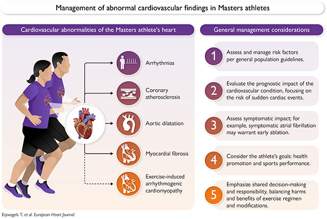
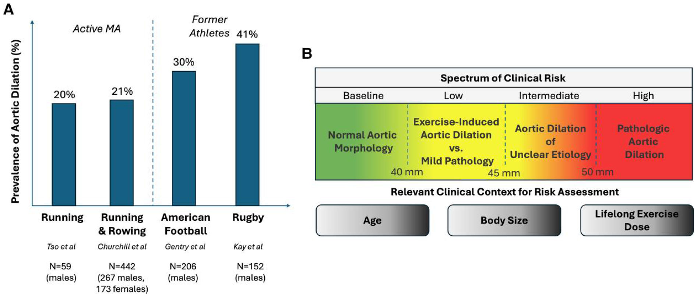

📄 [Abrir o PDF original](https://cdn.jsdelivr.net/gh/muriloffs/cardiology-agent@main/study-inbox/processados/nihms-2170486.pdf)

# Atletas Masters com achados cardiovasculares anormais: consenso clínico EAPC/ESC e ACC

> 🎓 **Aprofunde:** Este é um Clinical Consensus Statement conjunto — não uma diretriz formal com classes de recomendação (I/IIa/IIb). A força de cada conselho é graduada por um sistema próprio da ESC (ver Figura 2), variando de "conselho clínico baseado em evidência robusta" até "área de incerteza". Domine essa distinção: a maior parte das recomendações deste documento repousa em **consenso de especialistas e extrapolação de dados de pacientes sedentários**, porque praticamente não existem ensaios clínicos randomizados exclusivos em atletas. O eixo central de todo o documento é a **tomada de decisão compartilhada (SDM)**.

## Resumo / Abstract

O treinamento físico melhora a saúde cardiovascular e reduz o risco de eventos cardiovasculares futuros e de mortalidade. Entretanto, evidências emergentes sugerem que atletas Masters podem ter uma prevalência mais alta de anormalidades cardiovasculares — como arritmias atriais, aterosclerose coronariana, dilatação aórtica e fibrose miocárdica — quando comparados a pares menos ativos.

O manejo clínico de atletas Masters pode ser desafiador, pois as diretrizes disponíveis para tais condições baseiam-se geralmente em dados derivados de pacientes sedentários e sintomáticos, limitando sua aplicabilidade a indivíduos altamente treinados. Outros desafios únicos na avaliação clínica do atleta Masters incluem: diferenças na apresentação sintomática em comparação a indivíduos sedentários, potencial resistência ao início de tratamento farmacológico e a crescente disponibilidade de dados de saúde provenientes de dispositivos vestíveis (wearables) de consumo, que podem fornecer informações relevantes sobre o estado cardiovascular.

O propósito deste documento conjunto EAPC/ESC e ACC é fornecer uma atualização aprofundada sobre o estado atual do conhecimento acerca de achados cardiovasculares anormais em atletas Masters. Apresenta-se uma abordagem baseada em consenso de especialistas sobre avaliação diagnóstica, manejo e prognóstico de: (i) fibrilação atrial, (ii) bradiarritmias, (iii) arritmias ventriculares, (iv) aterosclerose coronariana, (v) dilatação aórtica, (vi) fibrose miocárdica e (vii) cardiomiopatia arritmogênica induzida por exercício. Discutem-se desafios clínicos, áreas de controvérsia e incerteza, e os potenciais mecanismos subjacentes. São apresentadas também perspectivas futuras e direções de pesquisa, incluindo a necessidade de estudos de desfecho clínico, ensaios randomizados dedicados a atletas e registros internacionais com populações diversas e seguimento longitudinal.

> 🎓 **Aprofunde:** Note o paradoxo central que o documento explora ao longo de todas as seções: o atleta Masters tem **menor mortalidade cardiovascular global**, mas, simultaneamente, maior prevalência de várias anormalidades cardíacas estruturais e elétricas (FA, calcificação coronariana, dilatação aórtica, fibrose). A pergunta de fundo é se esses achados representam adaptações benignas, marcadores de risco, ou "lesão por uso excessivo" do coração. O artigo cita explicitamente o conceito provocador de Thompson et al.: "Can the heart get an overuse sports injury?" (NEJM Evid 2023, [10.1056/EVIDra2200175](https://doi.org/10.1056/EVIDra2200175)).

## Introdução

A atividade física habitual e o treinamento físico regular reduzem o risco de doença cardiovascular (DCV) e de mortalidade por todas as causas. A associação complexa entre a dose de atividade física e os benefícios de saúde parece ser **curvilínea**, com as maiores reduções de risco obtidas já com pequenas quantidades de exercício, e benefícios adicionais com volumes mais elevados. Essas observações contribuíram para a crença de que "mais exercício é melhor". Como resultado, o número de pessoas que praticam treinamento físico regular e participam de esportes competitivos durante a vida adulta aumentou de forma marcante nas últimas décadas.

Atletas Masters são definidos como indivíduos com **35 anos ou mais** que realizam treinamento físico habitual para melhorar níveis de condicionamento e participam regularmente de competições (Figura 1). Seus hábitos de exercício excedem consistentemente as recomendações globais contemporâneas de atividade física e são impulsionados primariamente por **metas de desempenho ou competição**, e não por metas de saúde.

Dados mostraram que aqueles que participam de eventos organizados de endurance têm menor risco de mortalidade em comparação a pares da população geral, com reduções de risco maiores para corredores e ciclistas do que para caminhantes de longa distância — sugerindo um papel importante da **intensidade do exercício**. Contudo, alta aptidão cardiorrespiratória não exclui a possibilidade de desenvolver fatores de risco e DCV. Evidências emergentes sugerem que algumas anormalidades cardiovasculares são mais prevalentes em atletas Masters do que em pares sedentários. Por exemplo, indivíduos que realizam treinamento de longo prazo têm prevalência aumentada de arritmias atriais, calcificação coronariana e dilatação aórtica. Além disso, realce tardio por gadolínio (LGE) miocárdico aumentado, indicativo de fibrose miocárdica (FM), tem sido relatado em atletas que treinam por toda a vida ("lifelong").

As diretrizes atuais para o manejo de condições cardiovasculares comuns baseiam-se quase exclusivamente em dados de pacientes sedentários sintomáticos com DCV e/ou pacientes sedentários assintomáticos de risco médio a alto. Assim, as estratégias contemporâneas que delineiam avaliação diagnóstica, opções de tratamento, prescrição de exercício e eventual restrição de exercício têm **generalização limitada** aos atletas Masters com achados cardiovasculares anormais. O manejo clínico nesse contexto é, portanto, altamente variável e frequentemente baseado em pequenos estudos unicêntricos, opiniões e experiências anedóticas do clínico.

## Abordagem metodológica

O grupo de redação foi montado em alinhamento com as políticas de gênero da ESC e do ACC e com esforços para incluir pesquisadores em início de carreira. Equipes de quatro a cinco especialistas internacionais foram designadas para cada seção de conteúdo, com sessões online para discutir e alcançar consenso sobre as considerações apresentadas nas tabelas. A equipe de liderança (T.E., J.K., A.B., G.C.) harmonizou todas as seções e recomendações. O rascunho foi circulado entre todos os coautores para sugestões adicionais, particularmente direcionadas às considerações clínicas, em um processo repetido até alcançar consenso. A força do conselho para as considerações de manejo clínico, ditada pela política da ESC, está resumida na Figura 2.

> 🎓 **Aprofunde:** A graduação "Área de incerteza" aparece com frequência neste documento e é honesta sobre a fragilidade da base de evidência. Quando você ler uma recomendação que descreve algo como "é desconhecido se...", entenda que se trata exatamente dessa categoria — não há dado, apenas posicionamento prudente. Isso reforça o porquê da SDM ser tão enfatizada.

## Considerações clínicas para o atleta Masters

A avaliação clínica do atleta Masters alinha-se com a prática cardiovascular de rotina, mas há vários desafios únicos a esta população (Figura 3).

**Primeiro — apresentação clínica diferente.** Atletas Masters frequentemente se apresentam com a queixa principal de **redução da capacidade de exercício** isoladamente ou em adição a sintomas comuns (dor torácica, palpitações, etc.). Essa queixa levanta um diagnóstico diferencial específico que inclui DCV incidente, patologia sistêmica não cardiovascular, envelhecimento e "destreinamento" fisiológico. É importante quantificar a redução da capacidade de exercício usando o **próprio atleta como referência**, pois a capacidade de exercício "reduzida" de um atleta Masters frequentemente ainda excede em muito os níveis normais de referência da população geral.

O impacto do envelhecimento merece atenção: declínios da capacidade de exercício relacionados à idade são inevitáveis, mas ocorrem de forma **gradual ao longo de anos**. Reduções súbitas da capacidade de exercício **não** são sugestivas de efeito do envelhecimento e devem levantar suspeita de anormalidade subjacente.

**Segundo — resistência à farmacoterapia.** Atletas Masters frequentemente resistem ao início de tratamento farmacológico. A concepção errônea de que o exercício de alto nível dispensa medicação, somada a preocupações sobre o impacto de fármacos na capacidade de exercício — particularmente estatinas e agentes com efeito cronotrópico negativo (betabloqueadores) — é comum. Ainda assim, terapia medicamentosa associada a modificações de estilo de vida é frequentemente necessária para controlar fatores de risco comuns como hipertensão e dislipidemia.

**Terceiro — dados de wearables.** Atletas Masters usam cada vez mais dispositivos de fitness comercialmente disponíveis, que fornecem informação relevante à saúde cardiovascular. Os clínicos são encorajados a desenvolver familiaridade básica com as métricas comuns desses dispositivos (dados de frequência cardíaca de exercício, escores de variabilidade da frequência cardíaca, dados de trajetória de carga aguda de treino, etc.) para integrar essa informação à avaliação diagnóstica.

**Quarto — escassez de dados primários.** Há poucos dados primários para guiar intervenções terapêuticas. As decisões de manejo devem considerar as limitações de se apoiar em dados derivados de pacientes não atletas e devem apresentar o que se sabe e o que não se sabe no contexto da **tomada de decisão compartilhada (SDM)**. A SDM inclui explicação dos riscos e benefícios das opções de manejo e integra a opinião do clínico sobre o equilíbrio risco-benefício de cada estratégia.

**Finalmente**, o uso de **drogas para melhora de desempenho** (performance-enhancing drugs) deve ser avaliado na investigação do atleta Masters, pois podem explicar sintomas de apresentação e exacerbar as formas comuns de achados cardiovasculares anormais discutidas no documento.

> 🎓 **Aprofunde:** Memorize o conceito de "o atleta como seu próprio controle". Um VO₂máx de 40 ml/kg/min pode ser excelente para um sedentário e catastroficamente baixo para um ex-atleta de endurance. A queda **súbita** (em semanas a meses) versus **gradual** (em anos) é o divisor de águas clínico para diferenciar envelhecimento de patologia incidente. Referência-chave sobre wearables: Petek et al., JACC 2023 ([10.1016/j.jacc.2023.04.054](https://doi.org/10.1016/j.jacc.2023.04.054)).

## Fibrilação atrial

A fibrilação atrial (FA) é uma arritmia relacionada à idade que resulta, em parte, de remodelamento cardiomiopático atrial de longa data. Atletas Masters têm **menor prevalência de fatores de risco clássicos** de FA (hipertensão, obesidade, diabetes), porém **maior prevalência e incidência de FA**. Entre esquiadores nórdicos Masters, a prevalência de FA é aproximadamente o **dobro** da de membros comparáveis da população geral. Isso vale tanto para homens quanto para mulheres, embora as taxas absolutas de FA sejam menores em atletas mulheres do que em homens. As razões de risco (hazard ratios) ajustadas para prevalência de FA em atletas Masters são estimadas entre **2,5 e 4**, com maior duração e intensidade de exercício associadas a maior risco.

> 🎓 **Aprofunde:** Este é o achado mais paradoxal e mais bem estabelecido do documento. O atleta de endurance tem **menos** dos fatores de risco tradicionais de FA, mas **mais** FA — o que aponta para uma fisiopatologia específica do exercício, e não para o acúmulo de fatores de risco convencionais. Referências-chave: Drca et al. (atletas femininas de endurance, Br J Sports Med 2023, [PMID 37433586](https://pubmed.ncbi.nlm.nih.gov/37433586/)) e Svedberg et al. (esquiadores cross-country, Circulation 2019, [PMID 31446766](https://pubmed.ncbi.nlm.nih.gov/31446766/)).

### Mecanismos

Múltiplos mecanismos foram propostos para explicar o aumento da incidência de FA:

1. **Mudanças estruturais no átrio** — dilatação causada por sobrecarga de pressão e volume.
2. **Mudanças autonômicas** — tônus vagal aumentado em repouso e tônus simpático mais alto durante o exercício.
3. **Mudanças elétricas** — lentificação da condução com aumento da dispersão elétrica.
4. **Desenvolvimento de fibrose intersticial atrial** — possivelmente devido a inflamação crônica de baixo grau.

Esses efeitos do remodelamento do coração de atleta sobre a propensão à FA podem se estender **além da carreira esportiva ativa**. Um estudo recente mostrou risco **quatro vezes maior** de FA entre ex-atletas de elite com alto escore de risco poligênico. Por outro lado, a contribuição poligênica para o risco de FA foi semelhante entre atletas e não atletas (odds ratio 3,7 vs 2,0; P = 0,37). Esses achados enfatizam a interação complexa entre genética, treinamento e FA, que pode adicionalmente ser mediada por mecanismos não herdados.

> 🎓 **Aprofunde:** O dado poligênico (Flannery et al., remadores de classe mundial, Eur Heart J 2025, [PMID 40561495](https://pubmed.ncbi.nlm.nih.gov/40561495/)) é sutil mas importante: o risco genético **multiplica** o risco em quem foi atleta, mas a contribuição genética *per se* não difere de não atletas. Ou seja, o exercício parece atuar como um "segundo golpe" sobre um substrato genético, e não cria um perfil genético novo. O modelo animal de Guasch et al. (J Am Coll Cardiol 2013, [PMID 23583240](https://pubmed.ncbi.nlm.nih.gov/23583240/)) demonstrou experimentalmente a promoção de FA por exercício de endurance.

### Avaliação e manejo

Dada a prevalência aumentada, uma alta suspeição clínica deve levar a um **baixo limiar para investigação diagnóstica** em indivíduos com sintomas (como palpitações), particularmente naqueles com escores CHA₂DS₂-VA elevados. A avaliação clínica de FA suspeita em atletas não difere da de não atletas, mas as decisões de tratamento devem considerar sintomas e qualidade de vida no contexto do desempenho esportivo.

Uma estratégia de **controle de frequência** em atletas Masters sintomáticos é frequentemente ineficaz. Betabloqueadores (proibidos em certos esportes), antagonistas de cálcio e digoxina são raramente tolerados por efeitos colaterais tanto em repouso quanto durante o exercício. Assim, o **controle de ritmo** é geralmente a opção preferida.

A terapia antiarrítmica permanece uma opção viável, mas a **ablação por cateter** emergiu como opção adicional e razoável de **primeira linha**. Preocupações prévias de que o isolamento de veias pulmonares (PVI) seria menos eficaz em atletas do que em não atletas foram refutadas em diversas séries de ablação que mostraram eficácia semelhante nos dois grupos. Portanto, o PVI como tratamento de primeira linha da FA também se aplica aos atletas Masters. A SDM permanece importante, pois complicações (que ainda ocorrem em **1% a 2%** dos casos de PVI) podem impactar o desempenho atlético.

Os dados atuais sobre o impacto do PVI na tolerância ao exercício são limitados. Um estudo retrospectivo comparando teste ergométrico antes e depois do PVI não encontrou diferença significativa — porém apenas uma minoria dos participantes realizou teste pré e pós-procedimento. Outro estudo, em atletas altamente sintomáticos com FA (também de pequeno porte), mostrou melhora da capacidade de exercício após ablação por radiofrequência. O sucesso do procedimento após ablação parece comparável ao de não atletas, com taxas lentas de recorrência ("attrition") no seguimento mais longo. Embora altos volumes de exercício de endurance sejam fator de risco bem estabelecido para FA, permanece sob investigação se reduções prescritas de exercício (destreinamento) levam a controle de ritmo mais eficaz.

### Anticoagulação

Pequenos estudos sugerem que atletas com FA podem ter menor risco de AVC do que não atletas, mas **não há dados** que sustentem algoritmos de anticoagulação específicos para atletas. A avaliação de risco de AVC e a prevenção devem seguir escores validados como o **CHA₂DS₂-VA**. Para atletas que participam de esportes com risco de trauma (colisão ou impacto corporal), a SDM em torno da continuidade da participação é necessária. Semelhante à população geral, a **oclusão do apêndice atrial esquerdo** pode ser apropriada apenas para atletas Masters com contraindicações médicas definitivas à anticoagulação. Não há dados que sustentem o uso da oclusão do apêndice com o único propósito de evitar anticoagulação em atletas sem contraindicações médicas; recomenda-se seguir o manejo direcionado por diretrizes.

### Tabela 1 — Consensos clínicos para atletas Masters com FA

| # | Consideração | Força do conselho |
|---|---|---|
| 1 | Mudanças cardiovasculares relacionadas ao esporte de endurance podem promover FA em cargas de treino mais altas, mas a atividade física de intensidade moderada deve ser encorajada pelos muitos benefícios fisiológicos e psicológicos. | Pode ser apropriado (consenso) |
| 2 | Atletas com FA devem ser avaliados e tratados para fatores de risco padrão (hipertensão, apneia obstrutiva do sono, controle de peso, uso de álcool, hipertireoidismo). | Conselho clínico (consenso) |
| 3 | Anticoagulação deve seguir diretrizes padrão, incluindo uso de anticoagulantes para atletas com escore CHA₂DS₂-VA ≥2. | Conselho clínico (consenso) |
| 4 | Em atletas que preenchem critérios de anticoagulação, o tipo de esporte e o risco de colisão/trauma devem ser integrados via SDM quanto à participação futura. | Pode ser apropriado (consenso) |
| 5 | O manejo medicamentoso deve visar a participação esportiva segura, incluindo controle adequado de frequência durante o exercício e/ou abordagem "pill-in-the-pocket" com antiarrítmicos Classe 1C. | Pode ser apropriado (consenso) |
| 6 | O controle de ritmo é geralmente preferido ao controle de frequência em atletas com FA para otimizar desempenho e qualidade de vida. | Conselho clínico (consenso) |
| 7 | Com SDM, o PVI é razoável como opção de tratamento precoce em atletas, considerando possíveis complicações e o impacto desconhecido na tolerância ao exercício. | Conselho clínico (consenso) |
| 8 | É desconhecido se a redução prescrita da atividade esportiva de endurance leva a menores taxas de recorrência de FA. | Área de incerteza |
| 9 | Dispositivos de oclusão do apêndice atrial esquerdo não devem ser implantados com o único propósito de evitar anticoagulação em atletas Masters com FA. | Área de incerteza / consenso |

> 🎓 **Aprofunde:** Pontos que você deve dominar: (1) controle de ritmo > controle de frequência no atleta (drogas de controle de frequência são mal toleradas e podem ser proibidas em competição); (2) PVI é razoável como **primeira linha** e tem eficácia comparável à de não atletas; (3) anticoagulação segue CHA₂DS₂-VA convencional — **não** há "desconto" para atletas apesar do possível menor risco de AVC; (4) oclusão do apêndice **não** é atalho para evitar anticoagulação. Referência operacional: consenso HRS 2024 sobre arritmias no atleta (Lampert et al., Heart Rhythm 2024, [PMID 38763377](https://pubmed.ncbi.nlm.nih.gov/38763377/)).

## Bradiarritmias

Bradiarritmias e bradicardia sinusal marcada são frequentes em atletas Masters de esportes de endurance. Bradicardia sinusal com frequências **<40 bpm**, bloqueio atrioventricular de primeiro grau e bloqueio AV de segundo grau tipo I podem ocorrer em atletas Masters saudáveis e assintomáticos em condições de repouso. As bradiarritmias ocorrem devido a uma combinação de aumento do tônus vagal induzido pelo exercício e **mudanças moleculares de proteínas de canais iônicos** que levam à geração e condução de impulso sinoatrial atenuadas. É importante notar que a maioria dos atletas com bradicardia sinusal e formas benignas de bloqueio cardíaco (primeiro grau e segundo grau tipo 1) demonstra **aumento apropriado da frequência cardíaca durante o exercício**.

> 🎓 **Aprofunde:** A grande mudança conceitual aqui é que a bradicardia do atleta **não é só vagal** — há remodelamento elétrico intrínseco com downregulation de canais marca-passo (especialmente o canal HCN/funny current) no nó sinusal e remodelamento no nó AV. Referências: D'Souza et al. (J Physiol 2015, [PMID 25871551](https://pubmed.ncbi.nlm.nih.gov/25871551/)) e Mesirca et al. (Circ Res 2021, [PMID 33849278](https://pubmed.ncbi.nlm.nih.gov/33849278/)) — o último demonstrou remodelamento elétrico intrínseco subjacente ao bloqueio AV em atletas. Implicação clínica: parte dessa bradicardia pode **não** reverter completamente com o destreinamento.

### Avaliação

Na avaliação e manejo, é essencial determinar se sintomas — como tontura, pré-síncope, intolerância isolada ao exercício ou fadiga — estão ligados a bradiarritmias clinicamente significativas. A abordagem diagnóstica deve incluir história médica detalhada, **teste de esforço** e **monitoramento ambulatorial de ritmo** para avaliar a resposta cronotrópica ao exercício. Embora limiares específicos sejam atualmente desconhecidos para atletas Masters, a **incompetência cronotrópica** é definida como uma frequência cardíaca significativamente menor que a prevista durante o teste de esforço máximo. Esforços diagnósticos devem ser feitos para determinar a relação entre frequência cardíaca máxima atingida e desempenho de exercício.

Atualmente, é **desconhecido** se reduções da atividade esportiva em atletas com incompetência cronotrópica diminuem a probabilidade de implante futuro de marca-passo, ou se o implante de marca-passo com função de resposta de frequência (rate-response) efetivamente melhora a capacidade de exercício.

### Mudanças patológicas e prognóstico

Embora as bradiarritmias sejam mais frequentemente assintomáticas e reversíveis, dados emergentes indicam que o exercício de endurance de longo prazo também pode aumentar a probabilidade de **mudanças patológicas do nó sinusal e do sistema de condução**. Uma relação dose-resposta foi observada em estudo de esquiadores cross-country, com aqueles que participaram de mais corridas tendo maior risco de doença do nó sinusal ou bloqueio AV de terceiro grau. Em estudo de seguimento, a incidência de longo prazo de bradicardia e a necessidade de implante de marca-passo foram, respectivamente, **19% e 17% mais frequentes** em esquiadores homens do que na população geral, e mais notavelmente entre os atletas de melhor desempenho e os que competiram em mais eventos. Entretanto, atualmente **não há evidência** que sustente a necessidade de seguimento rotineiro de longo prazo nesses indivíduos na ausência de sintomas.

### Tabela 2 — Consensos clínicos para atletas Masters com bradiarritmias

| # | Consideração | Força do conselho |
|---|---|---|
| 1 | A avaliação de atletas com sintomas possivelmente atribuíveis a bradiarritmias (tontura, pré-síncope, intolerância intermitente ao exercício) deve incluir história cuidadosa, teste de esforço e monitoramento ambulatorial para avaliar a resposta cronotrópica. | Conselho clínico (consenso) |
| 2 | Em atletas assintomáticos com bradicardia sinusal, BAV de 1º grau ou Mobitz I, nenhuma intervenção é necessária. Em contraste, atletas com bradiarritmias patológicas (BAV de 2º grau tipo II e 3º grau) devem seguir manejo de diretriz clínica padrão. | Conselho clínico (consenso) |
| 3 | É desconhecido se reduções prescritas de atividade esportiva em atletas com incompetência cronotrópica reduzem a necessidade futura de implante de marca-passo. | Área de incerteza |
| 4 | Em atletas com capacidade de exercício e resposta cronotrópica reduzidas (subjetiva ou objetivamente), é desconhecido se o implante de marca-passo com função rate-response melhora a capacidade de exercício. | Área de incerteza |

> 🎓 **Aprofunde:** Distinga "benigno" de "patológico": bradicardia sinusal, BAV 1º grau e Mobitz I que **aumentam a FC ao exercício** = adaptação benigna, sem intervenção. Mobitz II e BAV total = patológico, seguir diretrizes convencionais. Domine os dados de Andersen (52.755 esquiadores, Eur Heart J 2013, [PMID 23756332](https://pubmed.ncbi.nlm.nih.gov/23756332/)) e Svedberg (Circulation 2024, [PMID 39101218](https://pubmed.ncbi.nlm.nih.gov/39101218/)) — eles estabelecem a relação dose-resposta entre volume de competição e doença do nó sinusal/necessidade de marca-passo.

## Arritmias ventriculares

A ocorrência de arritmias ventriculares em atletas Masters geralmente **não** é um achado normal relacionado ao treino e requer atenção clínica, pois pode ser o primeiro sinal de doença cardíaca subjacente. Contrações ventriculares prematuras (PVCs) assintomáticas ou outras arritmias ventriculares são comumente detectadas em atletas de endurance. Estudos prévios relataram prevalência de **7%** em finalistas de ultramaratona e **34%** entre atletas de meia-idade e idosos submetidos a teste de esforço de pré-participação. A prevalência de arritmias ventriculares no Holter **não parece diferir** entre atletas Masters e a população geral. Entretanto, PVCs têm maior probabilidade de apresentar características de **maior risco** em atletas Masters do que em atletas mais jovens — embora a maioria dos estudos prévios tenha se concentrado predominantemente em atletas jovens.

### PVCs de alto risco

O termo "PVCs de alto risco", usado para denotar uma série de características morfológicas que aumentam a probabilidade pré-teste de doença, foi resumido em declarações de consenso prévias para atletas e inclui:

1. **PVCs com morfologia atípica** — originárias de locais diferentes das vias de saída de VE/VD ou dos fascículos;
2. **PVCs polimórficas, repetitivas ou com intervalo de acoplamento curto** (<360 ms);
3. **PVCs em combinação com outras características eletrocardiográficas anormais** para a população geral;
4. **Não supressão, nova emergência de PVCs com exercício, ou aumento da carga de PVCs durante o exercício**;
5. **Sintomas de início súbito de intolerância ao exercício** associados ao surgimento de arritmias.

Uma **alta carga de PVCs isolada** — observada em ECG de 12 derivações, teste de esforço ou Holter de 24h — foi sugerida como potencial marcador de alto risco. Entretanto, é importante notar que **limiares de carga de PVCs ainda não estão claramente definidos**, e pontos de corte vinculados a desfechos clínicos não estão disponíveis em coortes atléticas, complicando a interpretação e aplicação clínicas desse achado. Não obstante, em atletas com **carga de PVCs >10%** no Holter de 24h, é razoável avaliar a estrutura e função cardíaca para excluir disfunção ventricular esquerda induzida por PVCs.

### Significado prognóstico e cautela

Até que ponto PVCs em atletas Masters assintomáticos refletem doença subjacente e/ou carregam prognóstico desfavorável ainda não foi bem definido. Enquanto o exercício moderado é protetor contra arritmias, o exercício excessivo e prolongado pode induzir remodelamento estrutural e elétrico do coração, aumentando o risco de arritmias ventriculares. Por isso, deve-se ter **cautela** ao avaliar atletas Masters, pois algumas características que seriam sinalizadas como de alto risco em atletas jovens podem ser **mais prevalentes** na população de atletas Masters ostensivamente saudáveis. As diretrizes europeias e americanas disponíveis fornecem recomendações apenas para o atleta mais jovem; assim, características de alto risco precisam ser definidas para atletas Masters em estudos futuros.

Entre atletas Masters com características de PVC consistentes com maior risco, sugere-se uma investigação clínica incluindo: história médica familiar e pessoal, ECG de repouso, ecocardiografia, teste de esforço e registro ECG ambulatorial de 12 derivações. Esse monitoramento deve abranger **pelo menos uma ou mais sessões de treino** para avaliar com precisão a carga e o comportamento das PVCs durante o esforço físico. Atualmente é desconhecido se a carga de PVCs atípicas está associada a risco clínico. Investigações adicionais — incluindo ressonância magnética cardíaca (RMC), estudos eletrofisiológicos e teste genético — podem ser apropriadas individualmente, a depender dos resultados dos testes de primeira linha.

### Tabela 3 — Consensos clínicos para atletas Masters com arritmias ventriculares

| # | Consideração | Força do conselho |
|---|---|---|
| 1 | Em atletas assintomáticos com PVC isolada e rara (>1 em ECG de repouso) de morfologia típica (via de saída ou fascículos), nenhuma investigação adicional é necessária. | Conselho clínico (consenso) |
| 2 | Para atletas com >1 PVC típica em ECG de repouso, ou PVCs sintomáticas, a investigação deve incluir história familiar e pessoal, ecocardiografia, teste de esforço, monitoramento ambulatorial (incluindo sessão de treino) e seguimento longitudinal individualizado. | Pode ser apropriado (consenso) |
| 3 | Em atletas com características de PVC de maior risco (morfologia atípica, carga >10%, PVCs repetitivas, intervalo de acoplamento curto, emergência durante exercício), avaliação mais extensa — incluindo RMC, estudo eletrofisiológico invasivo e/ou teste genético — deve ser considerada. | Conselho clínico (consenso) |
| 4 | O manejo de atletas Masters com PVCs de alto risco e/ou arritmias ventriculares complexas deve basear-se na patologia subjacente e seguir diretrizes específicas da doença. | Conselho clínico (consenso) |
| 5 | Vigilância longitudinal individualizada é razoável em atletas Masters com PVCs de alto risco e sem etiologia claramente definida durante a avaliação inicial. | Pode ser apropriado (consenso) |

> 🎓 **Aprofunde:** Pontos cruciais a dominar: (1) a prevalência de PVCs no Holter **não difere** de não atletas, então PVC isolada de morfologia típica não é necessariamente patológica; (2) a chave é a **morfologia** (origem atípica fora das vias de saída/fascículos = bandeira vermelha) e o **comportamento ao exercício** (não supressão ou aumento = alarme); (3) carga >10% obriga investigar disfunção de VE induzida por PVC; (4) o monitoramento deve cobrir uma sessão de treino real. Referências de critérios: Heidbuchel et al. (Europace 2021, [PMID 32596731](https://pubmed.ncbi.nlm.nih.gov/32596731/)), Zorzi et al. SICSPORT (Int J Cardiol 2023, [PMID 37517780](https://pubmed.ncbi.nlm.nih.gov/37517780/)), Corrado et al. algoritmo diagnóstico (Br J Sports Med 2020, [PMID 31481389](https://pubmed.ncbi.nlm.nih.gov/31481389/)), e Cipriani et al. sobre valor preditivo do teste de esforço (Heart Rhythm 2019, [PMID 30172028](https://pubmed.ncbi.nlm.nih.gov/30172028/)).

## Aterosclerose coronariana

O treinamento físico regular melhora fatores de risco ateroscleróticos, incluindo pressão arterial, status inflamatório, níveis lipídicos e tolerância à glicose. Entretanto, há evidência emergente de que calcificação e aterosclerose coronarianas são mais comuns em atletas de endurance Masters **homens** — mas **não mulheres** — em comparação a pares menos ativos. Uma associação **não linear** entre volumes de exercício ao longo da vida e a prevalência de escore de cálcio coronariano (CACS) **>100 unidades Agatston (AU)** foi repetidamente observada.

Estudos iniciais demonstraram que as placas ateroscleróticas eram predominantemente **calcificadas**, sugerindo que o treinamento poderia promover estabilização de placa por aumento da calcificação — semelhante ao efeito das estatinas. Em contraste, o estudo **Master@Heart** encontrou que a prevalência de placas calcificadas foi **semelhante** entre atletas lifelong e controles. Entretanto, o status de aptidão relativamente alto do grupo controle pode explicar esse achado.

> 🎓 **Aprofunde:** Esta é uma das áreas de maior controvérsia do documento. A "hipótese da placa estável" (mais cálcio = placa mais estável, efeito tipo estatina) vem dos estudos de Aengevaeren (Circulation 2017, [PMID 28450347](https://pubmed.ncbi.nlm.nih.gov/28450347/)) e Merghani (Circulation 2017, [PMID 28465287](https://pubmed.ncbi.nlm.nih.gov/28465287/)). O Master@Heart (De Bosscher et al., Eur Heart J 2023, [10.1093/eurheartj/ehad152](https://doi.org/10.1093/eurheartj/ehad152)) desafiou isso, mas o grupo controle era de homens muito condicionados — não verdadeiramente sedentários — o que pode ter atenuado a diferença. Note também o **dimorfismo sexual marcante**: o fenômeno é descrito em homens, não em mulheres (Papatheodorou et al., Circulation 2024, [PMID 39466884](https://pubmed.ncbi.nlm.nih.gov/39466884/)). Mecanismos diretamente proporcionais à **intensidade** do exercício (Aengevaeren MARC-2, Circulation 2023, [PMID 36597865](https://pubmed.ncbi.nlm.nih.gov/36597865/)).

### Mecanismos

Os mecanismos subjacentes em homens permanecem incertos. **Fatores de risco CV tradicionais** — uso prévio de tabaco, hipertensão arterial e história familiar de doença aterosclerótica prematura — são altamente prevalentes entre atletas de meia-idade e idosos e devem ser avaliados em todos. **Fatores da fisiologia do exercício** — aumentos sustentados de pressão arterial e frequência cardíaca, estresse mecânico coronariano, disrupção do fluxo intracoronariano laminar e inflamação induzida pelo exercício — podem sinergizar com os fatores de risco tradicionais no desenvolvimento e progressão da calcificação e aterosclerose coronariana. A magnitude desses mecanismos induzidos pelo exercício parece estar diretamente relacionada à **intensidade**, conforme sugerido por dados do estudo MARC-2. Mecanismos adicionais — mudanças induzidas pelo exercício no metabolismo lipídico e na homeostase do cálcio, consumo de dieta aterogênica e fatores genéticos indefinidos — também podem contribuir.

### Prognóstico

Dados prospectivos de desfecho em atletas Masters com calcificação e aterosclerose coronariana **não estão disponíveis atualmente**. Contudo, achados do **Cooper Center Longitudinal Study**, uma coorte de população geral, fornecem insights importantes. Homens com CACS <100 AU que se exercitaram em alto volume (>3000 MET-min/semana) tiveram risco de mortalidade por todas as causas significativamente menor do que pares menos ativos com CACS <100 AU — mas **nenhuma diferença** na taxa de eventos foi observada entre exercitadores de alto vs baixo volume com **CACS ≥100 AU**. Em outro estudo, os indivíduos com os níveis mais altos de aptidão tiveram o menor risco CV em cada categoria definida de CACS; entretanto, mesmo no subgrupo mais condicionado, a taxa de eventos CV foi maior naqueles com **CACS >400 AU vs CACS = 0**.

Em resumo: maiores quantidades de exercício e melhor aptidão cardiorrespiratória parecem **reduzir o risco** de calcificação arterial coronariana, mas **não negam o efeito** de um CACS mais alto sobre o risco de eventos CV.

### Avaliação e manejo

A investigação clínica deve consistir em controle de fatores de risco CV, delineamento de sintomas e estratificação de risco. Na ausência de dados de desfecho em atletas Masters, o controle de fatores de risco deve ser **semelhante ao da população geral**. **Estatinas são o tratamento primário** para prevenção de eventos CV em atletas com CACS elevado, e valores de corte universais de CACS e metas de LDL podem ser usados.

Dados do registro multinacional **CONFIRM** revelaram que indivíduos com **CACS >300 AU** enfrentam risco equivalente de eventos CV maiores em comparação aos que têm diagnóstico prévio de infarto do miocárdio, AVC ou doença arterial periférica — e tais riscos são ainda maiores entre os de **CACS >1000 AU**. Portanto, o tratamento agressivo de fatores de risco deve ser abordado em atletas com CACS alto. Semelhante à população geral, terapia com **aspirina em baixa dose** e terapia hipolipemiante são razoáveis para atletas Masters com características de placa de alto risco.

É razoável usar escores de risco que integram o CACS, como os fornecidos pelo **MESA** ou pelo **Astro-CHARM**, para estimar eventos CV incidentes e o benefício potencial de terapias. Entretanto, deve-se reconhecer que os escores disponíveis **não capturam** fatores importantes que contribuem para o risco global em atletas Masters — características de atividade física habitual (dose total de exercício, padrões de descanso/recuperação, periodização anual), níveis de aptidão cardiorrespiratória, ingestão de macronutrientes dietéticos e estresse psicossocial.

Atletas Masters com calcificação coronariana, mas **sem evidência de aterosclerose contendo lipídios** (sem placas de atenuação mista ou baixa em imagem não invasiva) e sem fatores de risco tradicionais podem ser vistos na prática. O **rastreamento rotineiro de CACS em atletas Masters de baixo risco atualmente NÃO é recomendado** nem pelas Diretrizes de Cardiologia do Esporte da ESC, nem pelas Clinical Considerations da AHA/ACC. Para atletas considerados de risco intermediário ou alto pelas estimativas tradicionais, estratificação adicional é razoável e pode incluir avaliação de CACS e fenótipo de placa por angiotomografia computadorizada.

### Estilo de vida, exercício e restrição

O estilo de vida é importante modificador de risco — estudos prévios mostraram que maiores volumes de exercício e melhor aptidão reduzem o risco de desfechos adversos **em todas as categorias de CACS** em comparação a indivíduos menos treinados/condicionados. Com base na evidência atual, **não deve haver restrições ao exercício** (intensidade, duração, frequência) em atletas assintomáticos com CACS alto na **ausência de isquemia miocárdica induzível**. É imperativo que atletas e médicos apreciem que a redução ótima de risco CV é maximizada em **níveis de exercício bem abaixo** do volume típico de treino dos Masters, e que **nenhuma quantidade de exercício substitui a farmacoterapia** direcionada por diretrizes.

Em atletas assintomáticos de risco intermediário ou alto (incluindo os com calcificação coronariana), estratificação adicional é razoável. Opções incluem **teste de esforço** (para avaliar isquemia silenciosa) e/ou **angiotomografia coronariana**. O teste de esforço define a capacidade objetiva de exercício, pode provocar arritmias induzidas pelo exercício e elicitar alterações isquêmicas de ST com o exercício — vantagens parcialmente compensadas pela sensibilidade e especificidade subótimas do ECG de esforço. A angiotomografia permite quantificar grau, localização e morfologia de estenoses, mas não fornece informação sobre capacidade funcional. Na prática, esses testes são frequentemente realizados **em paralelo**, pois fornecem informação sinérgica para o controle de fatores de risco e o papel da revascularização via SDM.

### Sintomas e revascularização

Sintomas de doença arterial coronariana (DAC) em atletas Masters podem **não** se limitar à angina típica, podendo se apresentar como **declínios inexplicados de desempenho** ou dispneia de esforço. Atletas sintomáticos e os com aterosclerose obstrutiva devem ser avaliados para isquemia induzível conforme diretrizes. O **exercício** (estímulo fisiológico) é preferido a estímulos farmacológicos para teste de estresse em atletas.

Múltiplos estudos demonstraram que a trombose aguda **não** é a única responsável por parada cardíaca súbita em homens com DAC, sugerindo que DAC estável de alto grau pode precipitar **arritmia isquêmica mediada por demanda**. O ensaio **ISCHEMIA** demonstrou que a intervenção invasiva precoce não tem benefício de mortalidade apreciável sobre a terapia médica em indivíduos com DAC obstrutiva estável. Entretanto, é importante notar que atletas Masters **não são comparáveis** à população do ISCHEMIA, pois podem exercitar-se rotineiramente em intensidades que excedem o limiar isquêmico e estão expostos a precipitantes adicionais de desestabilização de placa — **desidratação, hipercoagulabilidade e aumento das forças de cisalhamento do fluxo coronariano**. Esses fatores provavelmente aumentam a suscetibilidade a eventos CV adversos durante o exercício.

Assim, e **independentemente da presença de sintomas**, para atletas Masters com lesões de alto risco (>50% de estenose de tronco de coronária esquerda; >50% de estenose proximal da descendente anterior; doença de dois-três vasos com estenose >50%; e estenose >90% em um vaso), conforme diretrizes da ESC e AHA/ACC, e que pretendem se engajar em exercício vigoroso, a **revascularização coronariana pode ser considerada após SDM criterioso**. Esta permanece uma área-chave para pesquisa futura.

### Tabela 4 — Consensos clínicos para atletas Masters com aterosclerose coronariana

| # | Consideração | Força do conselho |
|---|---|---|
| 1 | Atletas Masters com fatores de risco CV estabelecidos devem receber cuidado preventivo (cardíaco) primário, incluindo aconselhamento de estilo de vida e farmacoterapia (anti-hipertensiva, hipolipemiante, etc.), conforme diretrizes da população geral. | Conselho clínico (consenso) |
| 2 | Alta aptidão cardiorrespiratória associa-se a melhor mortalidade global e CV. Na ausência de sinais ou sintomas de isquemia, restrições ou reduções de exercício (intensidade, duração, frequência) NÃO são necessárias, incluindo na presença de fatores de risco CV tradicionais — incluindo CACS alto. | Conselho clínico (consenso) |
| 3 | Em atletas Masters assintomáticos de baixo risco com perfis CV de baixo risco, o rastreamento rotineiro de CACS NÃO deve ser realizado. | Conselho clínico (consenso) |
| 4 | Em atletas Masters de risco moderado ou alto, estratificação adicional é razoável, incluindo teste de esforço máximo e/ou angiotomografia coronariana para avaliar grau, localização e morfologia das estenoses. | Pode ser apropriado (consenso) |
| 5 | Avaliação diagnóstica de isquemia com teste funcional e/ou angiotomografia coronariana deve ser realizada em atletas Masters com sintomas sugestivos de isquemia. | Conselho clínico (consenso) |
| 6 | Atletas com isquemia miocárdica confirmada devem receber aconselhamento individualizado de estilo de vida e início de farmacoterapia direcionada por diretrizes. | Conselho clínico (consenso) |
| 7 | Revascularização de estenoses coronarianas estáveis responsáveis por sintomas pode ser apropriada para reduzir o impacto sintomático e o risco potencial de arritmias ventriculares isquêmicas durante o exercício de alta intensidade. | Pode ser apropriado (consenso) |
| 8 | Na ausência de dados randomizados, a revascularização de estenoses de alto grau em atletas Masters assintomáticos com evidência de isquemia em teste funcional ou de imagem pode ser apropriada dado o risco potencial de arritmia ventricular isquêmica durante o exercício de alta intensidade. | Pode ser apropriado (consenso) |
| 9 | Semelhante à população geral, aspirina em baixa dose e terapia hipolipemiante são razoáveis para atletas Masters com características de placa de alto risco ou CACS alto. | Pode ser apropriado (consenso) |
| 10 | Não há evidência que sustente o início de aspirina profilática antes da competição em atletas Masters sem fatores de risco CV estabelecidos. | Área de incerteza |

> 🎓 **Aprofunde:** O "exercise paradox" coronariano é o ponto-chave: o atleta Masters com DAC obstrutiva de alto grau **não** é o paciente do ISCHEMIA. Por exercitar-se acima do limiar isquêmico e adicionar desidratação, hipercoagulabilidade e cisalhamento elevado, ele tem perfil de risco peri-exercício potencialmente diferente — daí a abertura, **mesmo em assintomáticos**, para considerar revascularização em lesões de alto grau via SDM. Mas atenção à mensagem central: **nenhum exercício substitui estatina/controle de fatores de risco**, e a redução ótima de risco ocorre em volumes muito abaixo do treino do Masters. Estudos de parada cardíaca durante esporte: Kim et al. (NEJM 2012, [PMID 22236223](https://pubmed.ncbi.nlm.nih.gov/22236223/)), Marijon et al. (Circulation 2015, [PMID 25847988](https://pubmed.ncbi.nlm.nih.gov/25847988/)). Síntese do tema: Claessen et al. (Eur Heart J 2025, [PMID 39791533](https://pubmed.ncbi.nlm.nih.gov/39791533/)) e Aengevaeren et al. (Circulation 2020, [PMID 32310695](https://pubmed.ncbi.nlm.nih.gov/32310695/)).

## Dilatação aórtica

O impacto do exercício vigoroso sobre a aorta permanece área de pesquisa em andamento. Uma metanálise de 2013 revelou diâmetros aórticos **3,2 mm maiores** em atletas comparados a controles, sugerindo um efeito potencial da exposição ao exercício sobre as dimensões aórticas. Estudos em atletas jovens (≤25 anos) indicam que a dilatação aórtica — tipicamente definida como **≥40 mm em homens** e **≥34–38 mm em mulheres** — é observada em apenas ~1–2% dos atletas.

Dados em populações atléticas mais velhas permanecem limitados e relatam variação substancial na prevalência. Por exemplo, dilatação aórtica leve (40 a 45 mm) estava presente em ~20% de corredores e remadores Masters, enquanto prevalências de até **41%** foram relatadas em ex-atletas de força de elite, incluindo jogadores de futebol americano e de rugby. Esses achados sugerem que o treinamento de longo prazo específico do esporte — talvez em combinação com fatores de risco tradicionais, doenças aórticas idiopáticas e/ou uso de substâncias proibidas — pode contribuir para aumento das dimensões aórticas e potencial risco associado.

![Figura 5, Painel A — Prevalência de dilatação aórtica (≥40 mm) em atletas Masters ativos: corrida 20% (Tso et al, n=59 homens), corrida+remo 21% (Churchill et al, n=442), futebol americano 30% (Gentry et al, n=206 homens), rugby 41% (Kay et al, n=152 homens). Painel B — Espectro de risco clínico: Normal (<40mm) → Dilatação induzida por exercício vs patologia leve (40mm) → Dilatação de etiologia incerta (45mm, risco intermediário) → Dilatação patológica (50mm, alto risco). Contexto relevante: idade, tamanho corporal, dose de exercício ao longo da vida](fig-5.png)

### Valva aórtica bicúspide e fatores de risco

Uma **valva aórtica bicúspide (VAB)** é encontrada em ~1% dos atletas (como na população geral), e dados de população geral sugerem que até **50%** desenvolverão aumento aórtico. Fatores de risco para dilatação incluem **envelhecimento e hipertensão**, e tem sido sugerido que aumentos agudos e transitórios marcados da pressão arterial sistólica induzidos pelo exercício podem ser fator de risco. Em contraste, estudos recentes **não encontraram impacto** das características de exercício ao longo da vida sobre as dimensões aórticas em pacientes e atletas com VAB.

### Tipo de esporte

Os dados sobre tipo de esporte e dilatação aórtica são **inconclusivos**. Os aumentos marcados da PA sistólica que ocorrem durante esportes de força e treinamento resistido geraram preocupação sobre complicações aórticas. Em atletas jovens, contudo, múltiplos estudos mostraram que atletas de endurance tendem a ter dimensões aórticas maiores do que os de esportes de força/potência. Estudos comparativos desse tipo em atletas Masters são escassos, com exceção de uma análise que encontrou o remo (esporte misto com componentes de potência e endurance) associado a maior prevalência de dilatação aórtica vs corrida. Assim, a contribuição do esporte em geral e do tipo de esporte especificamente para dilatação e eventos aórticos em atletas Masters permanece incerta — área importante de pesquisa futura.

### Progressão, prognóstico e retorno ao esporte

Não há dados que definam taxas de progressão entre atletas Masters com dilatação aórtica. Da mesma forma, dados sobre prognóstico — especificamente taxas de síndromes aórticas agudas — são extremamente limitados, impedindo conclusões significativas sobre a magnitude exata do risco. O retorno ao esporte após cirurgia aórtica também é área de incerteza. Dados muito limitados (n = 21) sugerem segurança do retorno ao esporte de endurance após cirurgia eletiva para doença aórtica associada à VAB. O risco de participação esportiva competitiva após reparo de aneurisma ou dissecção aórtica é incerto e provavelmente determinado pelo resultado cirúrgico, presença de dissecção residual e doença subjacente. Decisões de participação devem ser abordadas via SDM.

### Avaliação

Atletas Masters diagnosticados com dilatação aórtica (≥40 mm para homens e mulheres, considerando o tamanho corporal) devem ser submetidos a avaliação clínica abrangente, incluindo avaliação para características sugestivas de etiologia hereditária ou sindrômica, e história familiar abrangente. **Teste genético** pode ser apropriado para os de maior risco de doença hereditária. Atletas com doença aórtica torácica hereditária requerem avaliação cuidadosa e cuidado especializado, fora do escopo deste documento.

Todos os atletas Masters com dilatação aórtica devem ser submetidos a **imagem transversal da aorta inteira pelo menos uma vez**. A **ecocardiografia transtorácica** é recomendada para avaliar morfologia e função da valva aórtica. Um plano de vigilância de imagem customizado — baseado no diagnóstico individual e no tamanho aórtico, incluindo comparação lado a lado por revisor experiente — deve ser desenvolvido e iniciado **6–12 meses** após a avaliação inicial.

### Indexação e limiares

As dimensões aórticas relacionam-se ao tamanho corporal, e há debate em andamento sobre a melhor forma de normalizar as medidas. Várias abordagens de indexação foram propostas para populações não atléticas, mas as diretrizes atuais apoiam-se primariamente em **tamanhos aórticos não ajustados**, dada sua associação com dados de desfecho. O documento alinha-se a esse framework e **não** propõe limiares separados de tamanho aórtico para atletas masculinos e femininos, embora incorporar o tamanho corporal à avaliação global de risco possa ser apropriado.

### Manejo clínico

O manejo deve focar em **controle da pressão arterial, prescrições de exercício e imagem de vigilância**. A PA de repouso deve ser medida com técnica apropriada, e os atletas devem ser submetidos a monitoramento da PA com vigilância domiciliar intermitente e/ou MAPA de 24h. **Bloqueadores do receptor de angiotensina** são agentes comuns de primeira linha, embora evidência de alta qualidade falte na ausência de aortopatias genéticas específicas. Embora o uso de **betabloqueador** seja comum na população geral com dilatação aórtica, eles são frequentemente mal tolerados por atletas Masters. No momento, **não há dados** que sustentem o tratamento de hipertensão induzida pelo exercício se a PA de repouso for normal. Quanto à intervenção cirúrgica, devem ser seguidas as **diretrizes padrão** para encaminhamento cirúrgico.

### Participação esportiva e estratificação de risco

Dados limitados estão disponíveis para guiar decisões sobre participação esportiva. Portanto, **SDM é necessária**. Em todas as categorias de risco, a avaliação clínica deve considerar idade, sexo e tamanho corporal:

- **Baixo risco**: dimensões aórticas máximas de **40–44 mm**.
- **Alto risco**: os que atingem limiares estabelecidos para intervenção cirúrgica.
- **Risco intermediário**: aneurismas de **45–50 mm** — requerem avaliação individualizada. Embora dados de desfecho para essa população faltem, atletas de risco intermediário devem geralmente ser aconselhados a **evitar atividade resistida de alta intensidade** e alertados de que treino/competição de endurance de alta intensidade pode conferir risco de dilatação progressiva e síndromes aórticas agudas incidentes em comparação à intensidade moderada.

Após a avaliação inicial, deve ser implementado um plano de seguimento longitudinal abrangente, incluindo imagem seriada, monitoramento de PA e rastreamento familiar.

### Tabela 5 — Consensos clínicos para atletas Masters com dilatação aórtica

| # | Consideração | Força do conselho |
|---|---|---|
| 1 | Atletas com dilatação aórtica (≥40 mm, considerando tamanho corporal) devem ser submetidos a avaliação médica abrangente, incluindo história familiar multigeracional sugestiva de doença aórtica hereditária e exame físico para traços fenotípicos. | Conselho clínico (consenso) |
| 2 | Devem realizar imagem transversal da aorta inteira (TC ou RM) pelo menos uma vez; plano de vigilância customizado iniciado 6–12 meses após a avaliação inicial. | Conselho clínico (consenso) |
| 3 | Teste genético é razoável em atletas com aumento aórtico confirmado ≥45 mm. | Pode ser apropriado (consenso) |
| 4 | Atletas com dimensões aórticas atingindo limiares cirúrgicos estabelecidos (≥50 mm) devem ser aconselhados a evitar esporte competitivo de alta intensidade e ser encaminhados para consideração de intervenção cirúrgica. | Conselho clínico (consenso) |
| 5 | Atletas com dilatação aórtica de 40–44 mm, sem etiologia hereditária, são geralmente de baixo risco; participação em esportes competitivos de alta intensidade é razoável, com vigilância clínica e de imagem apropriada. | Conselho clínico (consenso) |
| 6 | Atletas com dilatação de 45–50 mm, sem etiologia hereditária, são de risco intermediário; SDM deve reconhecer a incerteza dos riscos da alta intensidade e a progressão da dilatação/síndromes aórticas agudas. | Pode ser apropriado (consenso) |
| 7 | Atletas com história de reparo cirúrgico/dissecção aórtica devem ser aconselhados sobre os benefícios de saúde do exercício aeróbico de intensidade baixa a moderada via SDM. | Pode ser apropriado (consenso) |
| 8 | Dados que definem riscos de retomar treino/competição de alta intensidade após reparo cirúrgico são limitados; riscos podem superar benefícios — SDM necessária. | Pode ser apropriado (consenso) |
| 9 | É razoável que atletas com aortopatia de VAB submetidos a reparo cirúrgico de raiz/aorta ascendente retornem à participação com atividade esportiva apropriada via SDM. | Pode ser apropriado (consenso) |
| 10 | Retorno à participação plena em treino/esporte após reparo de aneurisma em atletas com valva tricúspide e sem etiologia hereditária pode ser apropriado via SDM. | Pode ser apropriado (consenso) |

> 🎓 **Aprofunde:** Domine os limiares de risco (40–44 baixo / 45–50 intermediário / ≥50 alto) e a recomendação de **não** criar limiares separados por sexo (usar tamanho não ajustado, mas incorporar tamanho corporal ao julgamento). Note a importante distinção entre atletas jovens (endurance → aorta maior) e a inconclusividade nos Masters. O dado de VAB é contraintuitivo: estudos recentes **não** mostraram que o exercício ao longo da vida piora a aorta em portadores de VAB (Schreurs et al., J Am Heart Assoc 2024, [PMID 38293944](https://pubmed.ncbi.nlm.nih.gov/38293944/); D'Ascenzi SPREAD, Br J Sports Med 2024, [PMID 39153748](https://pubmed.ncbi.nlm.nih.gov/39153748/)). Referência fundamental de limiares: diretriz ACC/AHA 2022 de doença aórtica (Isselbacher et al., Circulation 2022, [PMID 36322642](https://pubmed.ncbi.nlm.nih.gov/36322642/)). Dado de dilatação em endurance Masters: Churchill et al. (JAMA Cardiol 2020, [PMID 32101252](https://pubmed.ncbi.nlm.nih.gov/32101252/)).

## Fibrose miocárdica

A ressonância magnética cardíaca (RMC) está emergindo como ferramenta valiosa na avaliação de atletas com suspeita de distúrbios cardíacos, devido à caracterização tecidual avançada e à detecção de anormalidades miocárdicas sutis — incluindo fibrose miocárdica (FM) após administração de contraste à base de gadolínio e imagem pós-contraste. A FM refere-se ao aumento da deposição de **colágeno na matriz extracelular** do miocárdio após lesão, e a avaliação do LGE pode esclarecer a etiologia (isquêmica vs não isquêmica) e a gravidade (% do miocárdio afetado) da FM. Exemplos comuns de lesão cardíaca que precipitam FM incluem isquemia miocárdica, inflamação e sobrecarga hemodinâmica.

Entretanto, a identificação de **FM isolada** em atletas Masters apresenta um dilema diagnóstico, pois pode ser desafiador distinguir entre adaptações benignas ao treino e sinais precoces de cardiomiopatia. A FM também pode constituir **substrato para arritmias ventriculares**, devido à interação entre catecolaminas aumentadas, estresses hemodinâmicos durante o exercício, deslocamentos de eletrólitos e condução heterogênea em regiões de FM.

### Prevalência e limitações

A prevalência relatada de FM medida por LGE em atletas Masters varia de **3% a 50%**. As principais razões para essa variabilidade incluem diferenças tanto no desenho dos estudos quanto nas populações atléticas estudadas, que variam por idade, sexo (mulheres sub-representadas), esporte e intensidade/duração prévia do treino. Limitações adicionais incluem: pequeno número de sujeitos, viés de seleção, fatores de risco desconhecidos (possíveis confundidores), falta de controles apropriados, históricos de treino autorrelatados e efeitos desconhecidos de drogas de melhora de desempenho e/ou ilícitas. No momento, os mecanismos que ligam treino intenso à FM adquirida são especulativos, mas incluem inflamação, hipertensão subclínica, isquemia miocárdica mediada por demanda e sobrecarga crônica de volume ventricular.

### Tabela 6 — Estudos selecionados comparando prevalência de FM em atletas competitivos mais velhos

**Estudos SUPORTIVOS (maior prevalência de FM em atletas):**

| Estudo | Sujeitos | Sexo/Idade | Esporte | LGE |
|---|---|---|---|---|
| Ragab 2023 | 74 atletas / 36 controles | 75% M (44±8a), 25% F (36±7a) | Maratona | LGE 11% atletas (63% ponto de inserção VD; 25% não isquêmico; 12% isquêmico) vs 0% controles; ↑ECV em homens corredores |
| Farooq 2023 | 50 atletas / 26 controles | 100% M (56a) | Ciclismo/triatlo | LGE 48% atletas vs 15% controles (P=0,005, todos não isquêmicos) |
| Domenech-Ximenos 2020 | 93 atletas / 72 controles | 53% M (36a) | Triatlo | LGE 35% (M) e 41% (F) atletas vs 5% e 0% controles (todos hinge point) |
| Tahir 2018 | 83 atletas / 36 controles | 65% M (44a), 35% F (42a) | Triatlo | LGE 17% atletas vs 0% controles (M, P=0,052, não isquêmico); ↓T1 nativo em triatletas |
| Wilson 2011 | 12 veteranos / 20 controles | 100% M (56a) | Endurance | LGE 50% veteranos (17% isquêmico, 17% não isquêmico, 66% hinge point); 0% controles |
| Breuckmann 2009 | 102 corredores / 102 controles | 100% M (57a) | Maratona (≥5 maratonas) | LGE 12% atletas vs 4% controles (P=0,077; 42% isquêmico, 58% não isquêmico) |

**Estudos NÃO SUPORTIVOS:**

| Estudo | Sujeitos | Esporte | LGE |
|---|---|---|---|
| Andresen 2024 | 27 atletas / 16 controles | Maratona/triatlo/ciclismo (elite) | LGE 12% atletas vs 0% controles (P=0,14, não isquêmico); sem dif. ECV |
| Missenard 2021 | 33 atletas / 18 controles | Corrida/triatlo/ciclismo | LGE 5% controles vs 0% atletas (P=0,33); sem dif. ECV |
| Malek 2019 | 30 atletas / 10 controles | Ultramaratona | LGE 27% atletas vs 10% controles (P=0,4; 62,5% inserção VD); sem dif. ECV |
| Pujadas 2018 | 34 atletas / 12 controles | Corrida (maratona <3h) | LGE 9% atletas vs 0% controles (não isquêmico); sem correlação volume-LGE |
| Abdullah 2016 | 21 atletas / 71 controles | Maratona/triatlo | LGE 0% atletas vs 1,5% controles (hinge point) |
| Bohm 2016 | 33 atletas (16 ex-elite mundial) / 33 controles | Corrida/triatlo/ciclismo | LGE 3% atletas vs 0% controles (não isquêmico) |

> 🎓 **Aprofunde:** A variabilidade de 3% a 50% **não** é ruído aleatório — reflete heterogeneidade de população (homens vs mulheres, elite vs amador), esporte e padrão de LGE relatado. O ponto que você deve dominar é o **padrão de LGE**: LGE no **ponto de inserção/hinge do VD** é o padrão mais comum em atletas saudáveis e é **benigno**. LGE não isquêmico difuso ou subepicárdico/intramural com arritmias é preocupante. Observe que vários estudos "suportivos" mostram predomínio de hinge point — ou seja, parte da "FM aumentada" pode ser fenômeno benigno. Síntese: van de Schoor et al. (Mayo Clin Proc 2016, [PMID 27720455](https://pubmed.ncbi.nlm.nih.gov/27720455/)) e Javed et al. (Int J Cardiol 2024, [PMID 37741350](https://pubmed.ncbi.nlm.nih.gov/37741350/): "benign bystander or malignant marker?").

### Avaliação, prognóstico e manejo

Quando FM é identificada em um atleta Masters, é importante considerar o **contexto clínico** em que a RMC foi obtida e a presença de fatores de risco CV subjacentes. Todos os atletas Masters com FM significativa devem ser avaliados para formas comuns de cardiomiopatia tipicamente associadas a FM. A história clínica, o padrão e a extensão do LGE, e a probabilidade pré-teste de doença subjacente informam o prognóstico e devem guiar a consideração de testes adicionais e estratificação de risco.

Por exemplo, **LGE isolado no(s) ponto(s) de inserção/hinge do VD** em atletas Masters assintomáticos é **comum, não associado a desfechos adversos, e não deve requerer testes adicionais**. Em contraste, LGE mais extenso em associação com arritmias ventriculares complexas originárias do miocárdio afetado é altamente sugestivo de patologia significativa e deve ser investigado mais a fundo. O prognóstico é ditado pelo padrão e extensão do LGE e pela etiologia subjacente.

É razoável recomendar **restrição esportiva temporária** em um subconjunto de atletas Masters com LGE, com base na história clínica, fatores de risco subjacentes, dados de outros testes diagnósticos e o padrão/extensão do LGE. A estratificação de risco requerida deve incluir teste de esforço máximo específico do esporte e monitoramento ambulatorial de ritmo de duração estendida (incluindo durante o treino) para avaliar arritmias ventriculares clinicamente significativas. O tratamento — incluindo farmacoterapia e/ou implante de desfibrilador — deve ser guiado pelo diagnóstico subjacente e pela presença e gravidade dos sintomas.

### Tabela 7 — Consensos clínicos para atletas Masters com fibrose miocárdica

| # | Consideração | Força do conselho |
|---|---|---|
| 1 | Em atletas com FM identificada após RMC, investigações adicionais devem basear-se em características históricas (presença de sintomas/arritmias), presença de fatores de risco CV e testes diagnósticos de suporte (ECG de 12 derivações, padrão e extensão do LGE). | Conselho clínico (consenso) |
| 2 | O tratamento da FM em atletas deve basear-se no diagnóstico clínico subjacente, e a estratificação de risco para reduzir o risco de morte súbita/parada cardíaca deve incluir tratamento de arritmias ventriculares e/ou redução de sintomas. | Conselho clínico (consenso) |
| 3 | Atletas Masters assintomáticos com LGE isolado no ponto de inserção/hinge do VD por RMC NÃO requerem avaliação adicional e/ou estratificação de risco clínica. | Conselho clínico (consenso) |
| 4 | Em atletas assintomáticos com LGE detectado incidentalmente em padrão associado a alto risco de parada/morte súbita (ex.: LGE não isquêmico subepicárdico em padrão de estria no VE), é razoável prosseguir com estratificação de risco adicional incluindo teste de esforço máximo específico do esporte e monitoramento ambulatorial (incluindo durante o treino) para excluir arritmias ventriculares complexas. | Pode ser apropriado (consenso) |
| 5 | A determinação sobre esporte competitivo e/ou atividade física intensa em atletas Masters com FM deve incorporar SDM e considerar o diagnóstico subjacente, padrão e extensão do LGE, e resultados da estratificação de risco adicional, particularmente a presença de arritmias ventriculares complexas. | Conselho clínico (consenso) |

> 🎓 **Aprofunde:** A mensagem operacional mais importante: **LGE em hinge point/inserção do VD, assintomático = não investigar, não restringir** (Grigoratos et al., Int J Cardiovasc Imaging 2020, [PMID 32026265](https://pubmed.ncbi.nlm.nih.gov/32026265/); Swift et al. sobre padrões de LGE não impactarem mortalidade, JACC Cardiovasc Imaging 2014, [PMID 25496540](https://pubmed.ncbi.nlm.nih.gov/25496540/)). Já **LGE não isquêmico subepicárdico em "estria" no VE** é o padrão de alarme que exige estratificação completa (teste de esforço + Holter durante treino + busca de cardiomiopatia). A RMC deve sempre ser lida no contexto clínico — sintomas, arritmias, fatores de risco. O scar channel na RMC tem valor preditivo de arritmias (Sánchez-Somonte et al., Heart Rhythm 2021, [PMID 33892202](https://pubmed.ncbi.nlm.nih.gov/33892202/)).

## Cardiomiopatia arritmogênica induzida por exercício (ExI-ACM)

Atletas Masters ocasionalmente se apresentam com arritmias ventriculares, frequentemente com **predominância do ventrículo direito**, o que pode levar à descoberta de **dilatação ventricular assimétrica marcada** durante a investigação clínica, sem etiologia clara. Esse cenário é mais frequentemente visto em atletas Masters de disciplinas de endurance com componente isométrico concomitante (ciclismo, triatlo, remo). Esse fenótipo clínico incomum — para o qual estimativas confiáveis de prevalência faltam e cuja própria existência permanece debatida — é relatado em atletas Masters de ambos os sexos e foi denominado **"cardiomiopatia arritmogênica induzida por exercício" (ExI-ACM)**.

> 🎓 **Aprofunde:** Esta é a entidade mais controversa do documento — o próprio texto reconhece que sua existência "permanece debatida". Você precisa entender o conceito (substrato arritmogênico de predomínio de VD que se desenvolve aparentemente pela carga de exercício de endurance, frequentemente sem mutação desmossômica) e, ao mesmo tempo, manter o ceticismo apropriado: é diagnóstico **de exclusão**. Defendido principalmente pelo grupo de La Gerche (JACC Cardiovasc Imaging 2021, [PMID 33221208](https://pubmed.ncbi.nlm.nih.gov/33221208/): "is real... if you consider it").

### Mecanismos e genética

Casos iniciais de ExI-ACM eram considerados representantes de variantes "gene-elusivas" de cardiomiopatia arritmogênica do VD, pois exibiam fenótipo altamente similar mas raramente carregavam variantes gênicas patogênicas. A **tensão hemodinâmica repetitiva de carga de pressão e volume durante o exercício**, que afeta desproporcionalmente o VD, foi proposta como mecanismo causal contribuinte. Um estudo de porte moderado em ex-atletas de endurance de elite **não** mostrou evidência de remodelamento adverso. Avanços na genética cardíaca recentemente demonstraram uma **contribuição poligênica** para o remodelamento cardíaco extremo. Entretanto, um vínculo direto entre um perfil poligênico e remodelamento maladaptativo clinicamente significativo ainda **não foi estabelecido**. No momento, as contribuições relativas de carga de treino, predisposição genética e outros confundidores não medidos (drogas de melhora de desempenho, hipertensão não diagnosticada, miocardite subclínica) ao desenvolvimento de substrato miocárdico patológico permanecem incertas.

### Prognóstico

Dados que definem o prognóstico da ExI-ACM são limitados. Uma série de casos inicial de **46 atletas de endurance de alto nível** com arritmias ventriculares complexas revelou que **18 tiveram evento arrítmico maior, incluindo 9 que morreram subitamente**, ao longo de seguimento mediano de **2 anos**. Essa taxa preocupante de eventos adversos ocorreu **apesar** de aconselhamento médico para parar o esporte competitivo e de tratamento médico, ablação e/ou implante de CDI. Nessa série, os desfechos **não** puderam ser previstos pela presença de sintomas, dados de imagem morfológica no momento do diagnóstico, ou pelos resultados da avaliação não invasiva de arritmias. O **único fator preditivo** de eventos adversos foi a **inducibilidade de taquicardia ventricular sustentada ou fibrilação ventricular durante estudo eletrofisiológico invasivo**. Essa série de casos inicial, recrutada de três centros terciários de cardiologia esportiva, provavelmente identificou os fenótipos mais graves, com os piores prognósticos.

> 🎓 **Aprofunde:** Memorize esta série seminal (Heidbüchel et al., Eur Heart J 2003, [PMID 12919770](https://pubmed.ncbi.nlm.nih.gov/12919770/)): 46 atletas, 18 eventos arrítmicos maiores incluindo 9 mortes súbitas em 2 anos, apesar do tratamento. O ponto de aprendizado crucial: o **único preditor** foi a inducibilidade de TV/FV no EEF invasivo — sintomas, imagem e avaliação não invasiva **falharam** em prever desfecho. Isso justifica considerar EEF na estratificação dessa população específica. Cuidado com o viés de referência terciária (fenótipos mais graves).

### Diagnóstico de exclusão e características de alto risco

Dadas as incertezas, diagnosticar ExI-ACM permanece desafiador e é primariamente um **diagnóstico de exclusão**. Antes dessa determinação, todas as outras causas potenciais de cardiomiopatia estrutural e doença elétrica devem ser cuidadosamente consideradas. Os principais diagnósticos diferenciais a excluir são: **cardiomiopatia arritmogênica genética**, cardiomiopatia de VE não dilatada, cardiomiopatia dilatada e outras condições arritmogênicas como sarcoidose.

Ao avaliar atletas para suspeita de ExI-ACM, a atenção deve focar em **características estruturais e funcionais de alto risco** que possam impactar decisões de retorno ao jogo, já que o exercício irrestrito contínuo pode facilitar a progressão do substrato patogênico. Essas características incluem:

- **Aumento desproporcional do VD** em relação ao tamanho do VE;
- **Fração de ejeção do VD reduzida** (tipicamente <40% na RMC; valores <45% podem ainda ser fisiológicos em ~1 em 6 atletas jovens de elite);
- **Strain de parede livre do VD prejudicado**, com valores menos negativos que **−20%** indicando disfunção;
- **Anormalidades de movimento de parede do VD** (acinesia ou discinesia) — que **nunca são adaptativas** em atletas e devem sempre ser consideradas patológicas, embora sejam incomuns na ExI-ACM e mais características da cardiomiopatia arritmogênica familiar, onde representam critério diagnóstico maior.

### Manejo

O manejo está resumido na Tabela 8, em alinhamento com as diretrizes gerais da ESC para cardiomiopatias. Vários estudos observacionais sugerem que o **destreinamento** pode contribuir para reversão parcial das mudanças estruturais cardíacas e redução de arritmias ventriculares. Destreinamento prescrito para atletas com suspeita de ExI-ACM é abordagem razoável para aqueles **sem arritmias sustentadas ou ameaçadoras à vida** e deve ser acoplado a reavaliação seriada para guiar estratificação e decisões de manejo.

O manejo de arritmias — seja por medicação, ablação ou implante de CDI — deve conformar-se às evidências e recomendações mais recentes sobre arritmias ventriculares e prevenção de morte súbita em pacientes com cardiomiopatias. Em atletas com indicação inicial de CDI, **reavaliação após período de destreinamento** pode ser apropriada. O **colete desfibrilador (wearable cardioverter-defibrillator)** pode ser proposto como solução interina naqueles julgados de alto risco, durante a restrição de exercício. A **ablação epicárdica** pode ser efetiva em atletas com TV documentada e cicatriz subepicárdica isolada da via de saída do VD. Finalmente, atletas com suspeita de ExI-ACM que desenvolvem insuficiência do VD e/ou regurgitação tricúspide secundária devem ser manejados conforme diretrizes contemporâneas de insuficiência cardíaca.

### Tabela 8 — Consensos clínicos para atletas Masters com cardiomiopatia inexplicada

| # | Consideração | Força do conselho |
|---|---|---|
| 1 | A ExI-ACM, doença miocárdica proposta atribuída ao treino de longo prazo sem outra etiologia aparente, é diagnóstico de exclusão. Até o momento, não há critérios diagnósticos formais; características propostas incluem dilatação/disfunção sistólica desproporcional do VD e arritmias ventriculares de origem no VD. | Pode ser apropriado (consenso) |
| 2 | Atletas com história esportiva de endurance extensa que se apresentam com cardiomiopatia inexplicada, caracterizada por dilatação do VD desproporcional ao VE e arritmias ventriculares de origem no VD, requerem avaliação diagnóstica abrangente incluindo RMC com contraste, teste genético, monitoramento de ritmo e teste de esforço para excluir outras formas de cardiomiopatia. | Conselho clínico (consenso) |
| 3 | O papel do estudo eletrofisiológico invasivo em atletas Masters com cardiomiopatia inexplicada e arritmias ventriculares sintomáticas é incerto, mas pode ser apropriado para guiar estratificação de risco e identificar atletas que possam se beneficiar de CDI. | Pode ser apropriado (consenso) |
| 4 | Em atletas com cardiomiopatia de etiologia inexplicada, SDM é sugerida para discutir decisões de manejo sobre participação esportiva, destreinamento prescrito, avaliação contínua, manejo de arritmias ventriculares, necessidade de CDI e frequência de imagem seriada para monitorar progressão. | Conselho clínico (consenso) |

> 🎓 **Aprofunde:** Domine os números de corte da função do VD: **FEVD <40% na RMC** (mas <45% pode ainda ser fisiológico em ~1/6 dos atletas jovens de elite); **strain de parede livre do VD menos negativo que −20% = disfunção**; **acinesia/discinesia de parede do VD nunca é adaptativa**. Estes vêm de Lie et al. (JACC Cardiovasc Imaging 2021, [PMID 33129723](https://pubmed.ncbi.nlm.nih.gov/33129723/)), Claessen et al. (Circulation 2024, [PMID 38109351](https://pubmed.ncbi.nlm.nih.gov/38109351/), sobre FE reduzida em atletas de elite com sobreposição genética com CMD), Zaidi et al. (JACC 2015, [PMID 26112193](https://pubmed.ncbi.nlm.nih.gov/26112193/)) e La Gerche et al. (Eur Heart J 2015, [PMID 26038590](https://pubmed.ncbi.nlm.nih.gov/26038590/)). Pilar terapêutico: **destreinamento** (com reavaliação seriada), reservando CDI conforme estratificação — e reavaliando a indicação de CDI após destreinamento (Darden et al., HeartRhythm Case Rep 2022, [PMID 36147714](https://pubmed.ncbi.nlm.nih.gov/36147714/)).

## Perspectivas futuras e direções de pesquisa

Ao longo das duas últimas décadas, a evidência sobre anormalidades CV em atletas Masters evoluiu, mas incertezas significativas persistem. As melhores práticas para manejo daqueles com risco CV ou DCV carecem de evidência forte e baseiam-se em consenso de especialistas e extrapolação da população geral — apesar de diferenças-chave. Três incertezas centrais:

1. O **"paradoxo do exercício"** — referindo-se ao risco cardíaco agudo aumentado durante o exercício mesmo em indivíduos altamente condicionados — permanece imprecisamente quantificado em atletas Masters.
2. O **equilíbrio risco-benefício** entre fatores de risco CV (como calcificação coronariana) e os efeitos protetores da alta aptidão cardiorrespiratória é incerto.
3. Os **mecanismos subjacentes** aos fenótipos cardíacos potencialmente maladaptativos permanecem incompletamente compreendidos.

Abordar essas incertezas exigirá estudos longitudinais rigorosamente controlados. Registros futuros de atletas Masters devem priorizar populações diversas com representação equilibrada de homens e mulheres e iniciar o rastreamento de desfechos o mais cedo possível na vida. Fenotipagem abrangente — avaliações clínicas seriadas, ECG de 12 derivações, imagem avançada e dados laboratoriais — é essencial. A **medição prospectiva e objetiva da dose de exercício** (duração, intensidade, frequência) e da disciplina esportiva deve substituir a dependência de recordação retrospectiva. Além disso, fatores únicos desta população — ingestão dietética (suplementos/dieta durante períodos de alto volume de treino e competição) e estresse psicossocial — devem ser examinados junto às avaliações tradicionais de risco. Estudos futuros também devem considerar o uso de **drogas de melhora de desempenho e/ou ilícitas**, frequentemente não relatado apesar de seus conhecidos efeitos CV deletérios.

Notavelmente, **nenhum estudo explorou determinantes sociais de saúde ou potenciais disparidades raciais** em desfechos entre atletas Masters, enquanto disparidades baseadas em sexo na incidência de doença permanecem sub-estudadas — uma lacuna crítica. Avanços em inteligência artificial e cardiologia computacional podem informar adicionalmente este trabalho.

Dados de registro longitudinais são necessários para entender melhor os achados potencialmente maladaptativos. A diferenciação entre **calcificações coronarianas estáveis vs placa aterosclerótica instável de morfologia mista** — incluindo seus mecanismos subjacentes e desfechos clínicos — melhorará o manejo. Da mesma forma, dados de registro controlados ajudarão a esclarecer mecanismos causais e distinguir adaptações patológicas de fisiológicas em FA, FM subclínica e dilatação aórtica. A possibilidade de ExI-ACM também justifica investigação adicional. Embora estimativas confiáveis de prevalência dessa patologia proposta faltem, ela parece ser uma condição **rara**, afetando um pequeno subconjunto de atletas Masters. A identificação de fatores que determinam a suscetibilidade do hospedeiro — incluindo, mas não limitado a, influências genéticas — é necessária. Evidência emergente sugere que até **~50%** dos casos de cardiomiopatia arritmogênica gene-negativos podem abrigar mutações genéticas previamente não reconhecidas, sugerindo um componente genético importante mas ainda mal compreendido.

Até o momento, **nenhum ensaio clínico ou randomizado focou exclusivamente em atletas**, incluindo Masters. Consequentemente, a opinião de consenso de especialistas, baseada largamente em dados observacionais e experiência clínica, direciona os padrões de prática atuais e pode desviar das diretrizes de população geral. Por exemplo, a consideração de revascularização coronariana foi recomendada para atletas Masters com DAC obstrutiva estável nas diretrizes de Cardiologia do Esporte da ESC e em declarações da AHA/ACC. Além disso, a manutenção de ritmo sinusal na FA — que cada vez mais envolve PVI de primeira linha — permanece complexa. Lacunas-chave incluem: entender os efeitos do destreinamento sobre a carga de FA, o risco de recorrência de FA com retomada de treino de alta intensidade pós-PVI, o impacto de longo prazo do PVI sobre a capacidade de exercício e a eficácia de técnicas emergentes de ablação (ex.: **ablação por campo pulsado / pulsed field ablation**) em indivíduos altamente ativos. Embora conduzir ensaios randomizados em atletas Masters apresente desafios, tais estudos são essenciais para estabelecer melhores práticas baseadas em dados.

## Conclusões

A população global de atletas Masters continua a crescer. Embora se beneficiem de alta aptidão cardiorrespiratória e mortalidade cardíaca reduzida, eles frequentemente abrigam fatores de risco CV tradicionais e risco aumentado de formas comuns de anormalidades CV. Apesar dos avanços recentes na compreensão da DCV em atletas Masters, incertezas permanecem. O cuidado cardíaco deve incluir avaliação abrangente de fatores de risco CV tradicionais, aconselhamento de estilo de vida e terapia médica quando apropriado. Considerações-chave que devem guiar intervenções terapêuticas incluem: **carga de sintomas** e seu impacto na qualidade de vida, **preferências e metas** do atleta, e **prognóstico específico da doença**, caso a caso. A **SDM representa abordagem essencial** na determinação de estratégias de tratamento e prescrição de exercício. Pesquisa futura é necessária para delinear mais claramente os benefícios e riscos potenciais do exercício de alta dose em atletas Masters com e sem anormalidades CV estabelecidas.

> 🎓 **Aprofunde:** Cinco princípios de manejo (do Graphical Abstract) que sintetizam todo o documento e merecem memorização: (1) Avalie e maneje fatores de risco conforme diretrizes da população geral; (2) Avalie o impacto prognóstico da condição, com foco no risco de eventos cardíacos súbitos; (3) Avalie o impacto sintomático (ex.: FA sintomática pode justificar ablação precoce); (4) Considere as metas do atleta (promoção de saúde **e** desempenho esportivo); (5) Enfatize SDM e responsabilidade compartilhada, equilibrando os danos e benefícios do regime de exercício e suas modificações.

## Financiamento

T.M.H.E. foi apoiado por um Established Investigator E-Dekker grant (#03-002-2023-0036) e FIT-HEART consortium grant (#01-001-2024-0621) da Dutch Heart Foundation.

## Referências citadas

1. Thompson PD, Eijsvogels TMH, Kim JH. Can the heart get an overuse sports injury? NEJM Evid 2023;2:EVIDra2200175. [10.1056/EVIDra2200175](https://doi.org/10.1056/EVIDra2200175). [PMID 38320102](https://pubmed.ncbi.nlm.nih.gov/38320102/) — [🔍 buscar](https://scholar.google.com/scholar?q=Thompson+PD%2C+Eijsvogels+TMH%2C+Kim+JH.+Can+the+heart+get+an+overuse+sports+injury%3F+NEJM+Evid+2023%3B2%3AEVIDra2200175.)
2. Bakker EA, Aengevaeren VL, Lee DC, Thompson PD, Eijsvogels TMH. All-cause mortality risks among participants in mass-participation sporting events. Br J Sports Med 2024;58:421–6. [10.1136/bjsports-2023-107190](https://doi.org/10.1136/bjsports-2023-107190). [PMID 38316539](https://pubmed.ncbi.nlm.nih.gov/38316539/) — [🔍 buscar](https://scholar.google.com/scholar?q=Bakker+EA%2C+Aengevaeren+VL%2C+Lee+DC%2C+Thompson+PD%2C+Eijsvogels+TMH.+All-cause+mortality+risks+among+participants+in+mass-participation+sporting+events.+Br+J+Sports+Med+2024%3B58%3A421%E2%80%936.)
3. Shapero K, et al. Cardiovascular risk and disease among masters endurance athletes: insights from the Boston MASTER initiative. Sports Med Open 2016;2:29. [10.1186/s40798-016-0053-0](https://doi.org/10.1186/s40798-016-0053-0). [PMID 27547715](https://pubmed.ncbi.nlm.nih.gov/27547715/) — [🔍 buscar](https://scholar.google.com/scholar?q=Shapero+K%2C+et+al.+Cardiovascular+risk+and+disease+among+masters+endurance+athletes%3A+insights+from+the+Boston+MASTER+initiative.+Sports+Med+Open+2016%3B2%3A29.)
4. Petek BJ, et al. Consumer wearable health and fitness technology in cardiovascular medicine: JACC state-of-the-art review. J Am Coll Cardiol 2023;82:245–64. [10.1016/j.jacc.2023.04.054](https://doi.org/10.1016/j.jacc.2023.04.054). [PMID 37438010](https://pubmed.ncbi.nlm.nih.gov/37438010/) — [🔍 buscar](https://scholar.google.com/scholar?q=Petek+BJ%2C+et+al.+Consumer+wearable+health+and+fitness+technology+in+cardiovascular+medicine%3A+JACC+state-of-the-art+review.+J+Am+Coll+Cardiol+2023%3B82%3A245%E2%80%9364.)
5. Drca N, Larsson SC, Grannas D, Jensen-Urstad M. Elite female endurance athletes are at increased risk of atrial fibrillation compared to the general population. Br J Sports Med 2023;57:1175–9. [10.1136/bjsports-2022-106035](https://doi.org/10.1136/bjsports-2022-106035). [PMID 37433586](https://pubmed.ncbi.nlm.nih.gov/37433586/) — [🔍 buscar](https://scholar.google.com/scholar?q=Drca+N%2C+Larsson+SC%2C+Grannas+D%2C+Jensen-Urstad+M.+Elite+female+endurance+athletes+are+at+increased+risk+of+atrial+fibrillation+compared+to+the+general+population.+Br+J+Sports+Med+2023%3B57%3A1175%E2%80%939.)
6. Svedberg N, et al. Long-term incidence of atrial fibrillation and stroke among cross-country skiers. Circulation 2019;140:910–20. [10.1161/CIRCULATIONAHA.118.039461](https://doi.org/10.1161/CIRCULATIONAHA.118.039461). [PMID 31446766](https://pubmed.ncbi.nlm.nih.gov/31446766/) — [🔍 buscar](https://scholar.google.com/scholar?q=Svedberg+N%2C+et+al.+Long-term+incidence+of+atrial+fibrillation+and+stroke+among+cross-country+skiers.+Circulation+2019%3B140%3A910%E2%80%9320.)
7. Aengevaeren VL, et al. Relationship between lifelong exercise volume and coronary atherosclerosis in athletes. Circulation 2017;136:138–48. [10.1161/CIRCULATIONAHA.117.027834](https://doi.org/10.1161/CIRCULATIONAHA.117.027834). [PMID 28450347](https://pubmed.ncbi.nlm.nih.gov/28450347/) — [🔍 buscar](https://scholar.google.com/scholar?q=Aengevaeren+VL%2C+et+al.+Relationship+between+lifelong+exercise+volume+and+coronary+atherosclerosis+in+athletes.+Circulation+2017%3B136%3A138%E2%80%9348.)
8. Merghani A, et al. Prevalence of subclinical coronary artery disease in masters endurance athletes with a low atherosclerotic risk profile. Circulation 2017;136:126–37. [10.1161/CIRCULATIONAHA.116.026964](https://doi.org/10.1161/CIRCULATIONAHA.116.026964). [PMID 28465287](https://pubmed.ncbi.nlm.nih.gov/28465287/) — [🔍 buscar](https://scholar.google.com/scholar?q=Merghani+A%2C+et+al.+Prevalence+of+subclinical+coronary+artery+disease+in+masters+endurance+athletes+with+a+low+atherosclerotic+risk+profile.+Circulation+2017%3B136%3A126%E2%80%9337.)
9. De Bosscher R, et al. Lifelong endurance exercise and its relation with coronary atherosclerosis. Eur Heart J 2023;26:2388–99. [10.1093/eurheartj/ehad152](https://doi.org/10.1093/eurheartj/ehad152) — [🔍 buscar](https://scholar.google.com/scholar?q=De+Bosscher+R%2C+et+al.+Lifelong+endurance+exercise+and+its+relation+with+coronary+atherosclerosis.+Eur+Heart+J+2023%3B26%3A2388%E2%80%9399.)
10. Churchill TW, et al. Association of ascending aortic dilatation and long-term endurance exercise. JAMA Cardiol 2020;5:522. [10.1001/jamacardio.2020.0054](https://doi.org/10.1001/jamacardio.2020.0054). [PMID 32101252](https://pubmed.ncbi.nlm.nih.gov/32101252/) — [🔍 buscar](https://scholar.google.com/scholar?q=Churchill+TW%2C+et+al.+Association+of+ascending+aortic+dilatation+and+long-term+endurance+exercise.+JAMA+Cardiol+2020%3B5%3A522.)
11. van de Schoor FR, et al. Myocardial fibrosis in athletes. Mayo Clin Proc 2016;91:1617–31. [10.1016/j.mayocp.2016.07.012](https://doi.org/10.1016/j.mayocp.2016.07.012). [PMID 27720455](https://pubmed.ncbi.nlm.nih.gov/27720455/) — [🔍 buscar](https://scholar.google.com/scholar?q=van+de+Schoor+FR%2C+et+al.+Myocardial+fibrosis+in+athletes.+Mayo+Clin+Proc+2016%3B91%3A1617%E2%80%9331.)
12. Pelliccia A, et al. 2020 ESC guidelines on sports cardiology and exercise in patients with cardiovascular disease. Eur Heart J 2021;42:17–96. [10.1093/eurheartj/ehaa605](https://doi.org/10.1093/eurheartj/ehaa605). [PMID 32860412](https://pubmed.ncbi.nlm.nih.gov/32860412/) — [🔍 buscar](https://scholar.google.com/scholar?q=Pelliccia+A%2C+et+al.+2020+ESC+guidelines+on+sports+cardiology+and+exercise+in+patients+with+cardiovascular+disease.+Eur+Heart+J+2021%3B42%3A17%E2%80%9396.)
13. Johansen KR, et al. Risk of atrial fibrillation and stroke among older men exposed to prolonged endurance sport practice. Open Heart 2022;9:e002154. [10.1136/openhrt-2022-002154](https://doi.org/10.1136/openhrt-2022-002154). [PMID 36396296](https://pubmed.ncbi.nlm.nih.gov/36396296/) — [🔍 buscar](https://scholar.google.com/scholar?q=Johansen+KR%2C+et+al.+Risk+of+atrial+fibrillation+and+stroke+among+older+men+exposed+to+prolonged+endurance+sport+practice.+Open+Heart+2022%3B9%3Ae002154.)
14. Flannery MD, Kalman JM, Sanders P, La Gerche A. State of the art review: atrial fibrillation in athletes. Heart Lung Circ 2017;26:983–9. [10.1016/j.hlc.2017.05.132](https://doi.org/10.1016/j.hlc.2017.05.132). [PMID 28606607](https://pubmed.ncbi.nlm.nih.gov/28606607/) — [🔍 buscar](https://scholar.google.com/scholar?q=Flannery+MD%2C+Kalman+JM%2C+Sanders+P%2C+La+Gerche+A.+State+of+the+art+review%3A+atrial+fibrillation+in+athletes.+Heart+Lung+Circ+2017%3B26%3A983%E2%80%939.)
15. Boraita A, et al. Incidence of atrial fibrillation in elite athletes. JAMA Cardiol 2018;3:1200–5. [10.1001/jamacardio.2018.3482](https://doi.org/10.1001/jamacardio.2018.3482). [PMID 30383155](https://pubmed.ncbi.nlm.nih.gov/30383155/) — [🔍 buscar](https://scholar.google.com/scholar?q=Boraita+A%2C+et+al.+Incidence+of+atrial+fibrillation+in+elite+athletes.+JAMA+Cardiol+2018%3B3%3A1200%E2%80%935.)
16. Guasch E, et al. Atrial fibrillation promotion by endurance exercise: demonstration and mechanistic exploration in an animal model. J Am Coll Cardiol 2013;62:68–77. [10.1016/j.jacc.2013.01.091](https://doi.org/10.1016/j.jacc.2013.01.091). [PMID 23583240](https://pubmed.ncbi.nlm.nih.gov/23583240/) — [🔍 buscar](https://scholar.google.com/scholar?q=Guasch+E%2C+et+al.+Atrial+fibrillation+promotion+by+endurance+exercise%3A+demonstration+and+mechanistic+exploration+in+an+animal+model.+J+Am+Coll+Cardiol+2013%3B62%3A68%E2%80%9377.)
17. Flannery MD, et al. Atrial fibrillation in former world-class rowers: role of environmental and genetic factors. Eur Heart J 2025;46:5114–25. [10.1093/eurheartj/ehaf369](https://doi.org/10.1093/eurheartj/ehaf369). [PMID 40561495](https://pubmed.ncbi.nlm.nih.gov/40561495/) — [🔍 buscar](https://scholar.google.com/scholar?q=Flannery+MD%2C+et+al.+Atrial+fibrillation+in+former+world-class+rowers%3A+role+of+environmental+and+genetic+factors.+Eur+Heart+J+2025%3B46%3A5114%E2%80%9325.)
18. Lampert R, et al. 2024 HRS expert consensus statement on arrhythmias in the athlete. Heart Rhythm 2024;21:e151–252. [10.1016/j.hrthm.2024.05.018](https://doi.org/10.1016/j.hrthm.2024.05.018). [PMID 38763377](https://pubmed.ncbi.nlm.nih.gov/38763377/) — [🔍 buscar](https://scholar.google.com/scholar?q=Lampert+R%2C+et+al.+2024+HRS+expert+consensus+statement+on+arrhythmias+in+the+athlete.+Heart+Rhythm+2024%3B21%3Ae151%E2%80%93252.)
19. Khan AK, et al. Impact of atrial fibrillation and atrial fibrillation therapies on sports performance in athletes. Heart Rhythm 2024;22:2562–9. [10.1016/j.hrthm.2024.11.020](https://doi.org/10.1016/j.hrthm.2024.11.020). [PMID 39557377](https://pubmed.ncbi.nlm.nih.gov/39557377/) — [🔍 buscar](https://scholar.google.com/scholar?q=Khan+AK%2C+et+al.+Impact+of+atrial+fibrillation+and+atrial+fibrillation+therapies+on+sports+performance+in+athletes.+Heart+Rhythm+2024%3B22%3A2562%E2%80%939.)
20. Furlanello F, et al. Radiofrequency catheter ablation of atrial fibrillation in athletes referred for disabling symptoms. J Cardiovasc Electrophysiol 2008;19:457–62. [10.1111/j.1540-8167.2007.01077.x](https://doi.org/10.1111/j.1540-8167.2007.01077.x). [PMID 18266680](https://pubmed.ncbi.nlm.nih.gov/18266680/) — [🔍 buscar](https://scholar.google.com/scholar?q=Furlanello+F%2C+et+al.+Radiofrequency+catheter+ablation+of+atrial+fibrillation+in+athletes+referred+for+disabling+symptoms.+J+Cardiovasc+Electrophysiol+2008%3B19%3A457%E2%80%9362.)
21. Mandsager KT, et al. Outcomes of pulmonary vein isolation in athletes. JACC Clin Electrophysiol 2020;6:1265–74. [10.1016/j.jacep.2020.05.009](https://doi.org/10.1016/j.jacep.2020.05.009). [PMID 33092753](https://pubmed.ncbi.nlm.nih.gov/33092753/) — [🔍 buscar](https://scholar.google.com/scholar?q=Mandsager+KT%2C+et+al.+Outcomes+of+pulmonary+vein+isolation+in+athletes.+JACC+Clin+Electrophysiol+2020%3B6%3A1265%E2%80%9374.)
22. Joglar JA, et al. 2023 ACC/AHA/ACCP/HRS guideline for the diagnosis and management of atrial fibrillation. Circulation 2024;149:e1–156. [10.1161/CIR.0000000000001193](https://doi.org/10.1161/CIR.0000000000001193). [PMID 38033089](https://pubmed.ncbi.nlm.nih.gov/38033089/) — [🔍 buscar](https://scholar.google.com/scholar?q=Joglar+JA%2C+et+al.+2023+ACC%2FAHA%2FACCP%2FHRS+guideline+for+the+diagnosis+and+management+of+atrial+fibrillation.+Circulation+2024%3B149%3Ae1%E2%80%93156.)
23. Van Gelder IC, et al. 2024 ESC guidelines for the management of atrial fibrillation. Eur Heart J 2024;45:3314–414. [10.1093/eurheartj/ehae176](https://doi.org/10.1093/eurheartj/ehae176). [PMID 39210723](https://pubmed.ncbi.nlm.nih.gov/39210723/) — [🔍 buscar](https://scholar.google.com/scholar?q=Van+Gelder+IC%2C+et+al.+2024+ESC+guidelines+for+the+management+of+atrial+fibrillation.+Eur+Heart+J+2024%3B45%3A3314%E2%80%93414.)
24. Kim JH, et al. Clinical considerations for competitive sports participation for athletes with cardiovascular abnormalities: AHA/ACC scientific statement. J Am Coll Cardiol 2025;85:1059–108. [10.1016/j.jacc.2024.12.025](https://doi.org/10.1016/j.jacc.2024.12.025). [PMID 39976316](https://pubmed.ncbi.nlm.nih.gov/39976316/) — [🔍 buscar](https://scholar.google.com/scholar?q=Kim+JH%2C+et+al.+Clinical+considerations+for+competitive+sports+participation+for+athletes+with+cardiovascular+abnormalities%3A+AHA%2FACC+scientific+statement.+J+Am+Coll+Cardiol+2025%3B85%3A1059%E2%80%93108.)
25. Talan DA, et al. Twenty-four hour continuous ECG recordings in long-distance runners. Chest 1982;82:19–24. [10.1378/chest.82.1.19](https://doi.org/10.1378/chest.82.1.19). [PMID 7083929](https://pubmed.ncbi.nlm.nih.gov/7083929/) — [🔍 buscar](https://scholar.google.com/scholar?q=Talan+DA%2C+et+al.+Twenty-four+hour+continuous+ECG+recordings+in+long-distance+runners.+Chest+1982%3B82%3A19%E2%80%9324.)
26. D'Souza A, Sharma S, Boyett MR. CrossTalk opposing view: bradycardia in the trained athlete is attributable to a downregulation of a pacemaker channel in the sinus node. J Physiol 2015;593:1749–51. [10.1113/jphysiol.2014.284356](https://doi.org/10.1113/jphysiol.2014.284356). [PMID 25871551](https://pubmed.ncbi.nlm.nih.gov/25871551/) — [🔍 buscar](https://scholar.google.com/scholar?q=D%27Souza+A%2C+Sharma+S%2C+Boyett+MR.+CrossTalk+opposing+view%3A+bradycardia+in+the+trained+athlete+is+attributable+to+a+downregulation+of+a+pacemaker+channel+in+the+sinus+node.+J+Physiol+2015%3B593%3A1749%E2%80%9351.)
27. Mesirca P, et al. Intrinsic electrical remodeling underlies atrioventricular block in athletes. Circ Res 2021;129:e1–20. [10.1161/CIRCRESAHA.119.316386](https://doi.org/10.1161/CIRCRESAHA.119.316386). [PMID 33849278](https://pubmed.ncbi.nlm.nih.gov/33849278/) — [🔍 buscar](https://scholar.google.com/scholar?q=Mesirca+P%2C+et+al.+Intrinsic+electrical+remodeling+underlies+atrioventricular+block+in+athletes.+Circ+Res+2021%3B129%3Ae1%E2%80%9320.)
28. Andersen K, et al. Risk of arrhythmias in 52 755 long-distance cross-country skiers: a cohort study. Eur Heart J 2013;34:3624–31. [10.1093/eurheartj/eht188](https://doi.org/10.1093/eurheartj/eht188). [PMID 23756332](https://pubmed.ncbi.nlm.nih.gov/23756332/) — [🔍 buscar](https://scholar.google.com/scholar?q=Andersen+K%2C+et+al.+Risk+of+arrhythmias+in+52+755+long-distance+cross-country+skiers%3A+a+cohort+study.+Eur+Heart+J+2013%3B34%3A3624%E2%80%9331.)
29. Svedberg N, et al. Long-term incidence of bradycardia and pacemaker implantations among cross-country skiers. Circulation 2024;150:1161–70. [10.1161/CIRCULATIONAHA.123.068280](https://doi.org/10.1161/CIRCULATIONAHA.123.068280). [PMID 39101218](https://pubmed.ncbi.nlm.nih.gov/39101218/) — [🔍 buscar](https://scholar.google.com/scholar?q=Svedberg+N%2C+et+al.+Long-term+incidence+of+bradycardia+and+pacemaker+implantations+among+cross-country+skiers.+Circulation+2024%3B150%3A1161%E2%80%9370.)
30. Cavigli L, et al. The acute effects of an ultramarathon on biventricular function and ventricular arrhythmias in master athletes. Eur Heart J Cardiovasc Imaging 2022;23:423–30. [10.1093/ehjci/jeab017](https://doi.org/10.1093/ehjci/jeab017). [PMID 33544827](https://pubmed.ncbi.nlm.nih.gov/33544827/) — [🔍 buscar](https://scholar.google.com/scholar?q=Cavigli+L%2C+et+al.+The+acute+effects+of+an+ultramarathon+on+biventricular+function+and+ventricular+arrhythmias+in+master+athletes.+Eur+Heart+J+Cardiovasc+Imaging+2022%3B23%3A423%E2%80%9330.)
31. Pizzolato M, et al. Incidence and characteristics of premature ventricular beats at exercise testing for preparticipation screening. J Sports Med Phys Fitness 2024;64:846–8. [10.23736/S0022-4707.24.16084-7](https://doi.org/10.23736/S0022-4707.24.16084-7). [PMID 38863422](https://pubmed.ncbi.nlm.nih.gov/38863422/) — [🔍 buscar](https://scholar.google.com/scholar?q=Pizzolato+M%2C+et+al.+Incidence+and+characteristics+of+premature+ventricular+beats+at+exercise+testing+for+preparticipation+screening.+J+Sports+Med+Phys+Fitness+2024%3B64%3A846%E2%80%938.)
32. Zorzi A, et al. Burden of ventricular arrhythmias at 12-lead 24-hour ambulatory ECG monitoring in middle-aged endurance athletes versus sedentary controls. Eur J Prev Cardiol 2018;25:2003–11. [10.1177/2047487318797396](https://doi.org/10.1177/2047487318797396). [PMID 30160531](https://pubmed.ncbi.nlm.nih.gov/30160531/) — [🔍 buscar](https://scholar.google.com/scholar?q=Zorzi+A%2C+et+al.+Burden+of+ventricular+arrhythmias+at+12-lead+24-hour+ambulatory+ECG+monitoring+in+middle-aged+endurance+athletes+versus+sedentary+controls.+Eur+J+Prev+Cardiol+2018%3B25%3A2003%E2%80%9311.)
33. Heidbuchel H, et al. Recommendations for participation... Part 2: ventricular arrhythmias, channelopathies, and implantable defibrillators. Europace 2021;23:147–8. [10.1093/europace/euaa106](https://doi.org/10.1093/europace/euaa106). [PMID 32596731](https://pubmed.ncbi.nlm.nih.gov/32596731/) — [🔍 buscar](https://scholar.google.com/scholar?q=Heidbuchel+H%2C+et+al.+Recommendations+for+participation...+Part+2%3A+ventricular+arrhythmias%2C+channelopathies%2C+and+implantable+defibrillators.+Europace+2021%3B23%3A147%E2%80%938.)
34. Zorzi A, et al. Interpretation and management of premature ventricular beats in athletes (SICSPORT). Int J Cardiol 2023;391:131220. [10.1016/j.ijcard.2023.131220](https://doi.org/10.1016/j.ijcard.2023.131220). [PMID 37517780](https://pubmed.ncbi.nlm.nih.gov/37517780/) — [🔍 buscar](https://scholar.google.com/scholar?q=Zorzi+A%2C+et+al.+Interpretation+and+management+of+premature+ventricular+beats+in+athletes+%28SICSPORT%29.+Int+J+Cardiol+2023%3B391%3A131220.)
35. Cipriani A, et al. Predictive value of exercise testing in athletes with ventricular ectopy evaluated by cardiac magnetic resonance. Heart Rhythm 2019;16:239–48. [10.1016/j.hrthm.2018.08.029](https://doi.org/10.1016/j.hrthm.2018.08.029). [PMID 30172028](https://pubmed.ncbi.nlm.nih.gov/30172028/) — [🔍 buscar](https://scholar.google.com/scholar?q=Cipriani+A%2C+et+al.+Predictive+value+of+exercise+testing+in+athletes+with+ventricular+ectopy+evaluated+by+cardiac+magnetic+resonance.+Heart+Rhythm+2019%3B16%3A239%E2%80%9348.)
36. Heidbuchel H, Prior DL, La Gerche A. Ventricular arrhythmias associated with long-term endurance sports: what is the evidence? Br J Sports Med 2012;46 Suppl 1:i44–50. [10.1136/bjsports-2012-091162](https://doi.org/10.1136/bjsports-2012-091162). [PMID 23097479](https://pubmed.ncbi.nlm.nih.gov/23097479/) — [🔍 buscar](https://scholar.google.com/scholar?q=Heidbuchel+H%2C+Prior+DL%2C+La+Gerche+A.+Ventricular+arrhythmias+associated+with+long-term+endurance+sports%3A+what+is+the+evidence%3F+Br+J+Sports+Med+2012%3B46+Suppl+1%3Ai44%E2%80%9350.)
37. Heidbüchel H, et al. High prevalence of right ventricular involvement in endurance athletes with ventricular arrhythmias. Eur Heart J 2003;24:1473–80. [10.1016/S0195-668X(03)00282-3](https://doi.org/10.1016/S0195-668X(03)00282-3). [PMID 12919770](https://pubmed.ncbi.nlm.nih.gov/12919770/) — [🔍 buscar](https://scholar.google.com/scholar?q=Heidb%C3%BCchel+H%2C+et+al.+High+prevalence+of+right+ventricular+involvement+in+endurance+athletes+with+ventricular+arrhythmias.+Eur+Heart+J+2003%3B24%3A1473%E2%80%9380.)
38. D'Ambrosio P, et al. Arrhythmias and structural remodeling in lifelong and retired master endurance athletes. J Sport Health Sci 2025;14:101043. [10.1016/j.jshs.2025.101043](https://doi.org/10.1016/j.jshs.2025.101043). [PMID 40273982](https://pubmed.ncbi.nlm.nih.gov/40273982/) — [🔍 buscar](https://scholar.google.com/scholar?q=D%27Ambrosio+P%2C+et+al.+Arrhythmias+and+structural+remodeling+in+lifelong+and+retired+master+endurance+athletes.+J+Sport+Health+Sci+2025%3B14%3A101043.)
39. Corrado D, Drezner JA, D'Ascenzi F, Zorzi A. How to evaluate premature ventricular beats in the athlete: critical review and proposal of a diagnostic algorithm. Br J Sports Med 2020;54:1142–8. [10.1136/bjsports-2018-100529](https://doi.org/10.1136/bjsports-2018-100529). [PMID 31481389](https://pubmed.ncbi.nlm.nih.gov/31481389/) — [🔍 buscar](https://scholar.google.com/scholar?q=Corrado+D%2C+Drezner+JA%2C+D%27Ascenzi+F%2C+Zorzi+A.+How+to+evaluate+premature+ventricular+beats+in+the+athlete%3A+critical+review+and+proposal+of+a+diagnostic+algorithm.+Br+J+Sports+Med+2020%3B54%3A1142%E2%80%938.)
40. Aengevaeren VL, et al. Exercise and coronary atherosclerosis: observations, explanations, relevance, and clinical management. Circulation 2020;141:1338–50. [10.1161/CIRCULATIONAHA.119.044467](https://doi.org/10.1161/CIRCULATIONAHA.119.044467). [PMID 32310695](https://pubmed.ncbi.nlm.nih.gov/32310695/) — [🔍 buscar](https://scholar.google.com/scholar?q=Aengevaeren+VL%2C+et+al.+Exercise+and+coronary+atherosclerosis%3A+observations%2C+explanations%2C+relevance%2C+and+clinical+management.+Circulation+2020%3B141%3A1338%E2%80%9350.)
41. Papatheodorou E, et al. Prevalence of coronary atherosclerosis in female masters endurance athletes. Circulation 2024;150:1478–80. [10.1161/CIRCULATIONAHA.124.069484](https://doi.org/10.1161/CIRCULATIONAHA.124.069484). [PMID 39466884](https://pubmed.ncbi.nlm.nih.gov/39466884/) — [🔍 buscar](https://scholar.google.com/scholar?q=Papatheodorou+E%2C+et+al.+Prevalence+of+coronary+atherosclerosis+in+female+masters+endurance+athletes.+Circulation+2024%3B150%3A1478%E2%80%9380.)
42. Claessen G, et al. Coronary atherosclerosis in athletes: emerging concepts and preventive strategies. Eur Heart J 2025;46:890–903. [10.1093/eurheartj/ehae927](https://doi.org/10.1093/eurheartj/ehae927). [PMID 39791533](https://pubmed.ncbi.nlm.nih.gov/39791533/) — [🔍 buscar](https://scholar.google.com/scholar?q=Claessen+G%2C+et+al.+Coronary+atherosclerosis+in+athletes%3A+emerging+concepts+and+preventive+strategies.+Eur+Heart+J+2025%3B46%3A890%E2%80%93903.)
43. Puri R, et al. Impact of statins on serial coronary calcification during atheroma progression and regression. J Am Coll Cardiol 2015;65:1273–82. [10.1016/j.jacc.2015.01.036](https://doi.org/10.1016/j.jacc.2015.01.036). [PMID 25835438](https://pubmed.ncbi.nlm.nih.gov/25835438/) — [🔍 buscar](https://scholar.google.com/scholar?q=Puri+R%2C+et+al.+Impact+of+statins+on+serial+coronary+calcification+during+atheroma+progression+and+regression.+J+Am+Coll+Cardiol+2015%3B65%3A1273%E2%80%9382.)
44. Aengevaeren VL, et al. Exercise volume versus intensity and the progression of coronary atherosclerosis (MARC-2). Circulation 2023;147:993–1003. [10.1161/CIRCULATIONAHA.122.061173](https://doi.org/10.1161/CIRCULATIONAHA.122.061173). [PMID 36597865](https://pubmed.ncbi.nlm.nih.gov/36597865/) — [🔍 buscar](https://scholar.google.com/scholar?q=Aengevaeren+VL%2C+et+al.+Exercise+volume+versus+intensity+and+the+progression+of+coronary+atherosclerosis+%28MARC-2%29.+Circulation+2023%3B147%3A993%E2%80%931003.)
45. DeFina LF, et al. Association of all-cause and cardiovascular mortality with high levels of physical activity and concurrent coronary artery calcification. JAMA Cardiol 2019;4:174–81. [10.1001/jamacardio.2018.4628](https://doi.org/10.1001/jamacardio.2018.4628). [PMID 30698608](https://pubmed.ncbi.nlm.nih.gov/30698608/) — [🔍 buscar](https://scholar.google.com/scholar?q=DeFina+LF%2C+et+al.+Association+of+all-cause+and+cardiovascular+mortality+with+high+levels+of+physical+activity+and+concurrent+coronary+artery+calcification.+JAMA+Cardiol+2019%3B4%3A174%E2%80%9381.)
46. Radford NB, et al. Cardiorespiratory fitness, coronary artery calcium, and cardiovascular disease events (Cooper Center Longitudinal Study). Circulation 2018;137:1888–95. [10.1161/CIRCULATIONAHA.117.032708](https://doi.org/10.1161/CIRCULATIONAHA.117.032708). [PMID 29343464](https://pubmed.ncbi.nlm.nih.gov/29343464/) — [🔍 buscar](https://scholar.google.com/scholar?q=Radford+NB%2C+et+al.+Cardiorespiratory+fitness%2C+coronary+artery+calcium%2C+and+cardiovascular+disease+events+%28Cooper+Center+Longitudinal+Study%29.+Circulation+2018%3B137%3A1888%E2%80%9395.)
47. Visseren FLJ, et al. 2021 ESC guidelines on cardiovascular disease prevention in clinical practice. Eur Heart J 2021;42:3227–337. [10.1093/eurheartj/ehab484](https://doi.org/10.1093/eurheartj/ehab484). [PMID 34458905](https://pubmed.ncbi.nlm.nih.gov/34458905/) — [🔍 buscar](https://scholar.google.com/scholar?q=Visseren+FLJ%2C+et+al.+2021+ESC+guidelines+on+cardiovascular+disease+prevention+in+clinical+practice.+Eur+Heart+J+2021%3B42%3A3227%E2%80%93337.)
48. Budoff MJ, et al. When does a calcium score equate to secondary prevention?: insights from the CONFIRM registry. JACC Cardiovasc Imaging 2023;16:1181–9. [10.1016/j.jcmg.2023.03.008](https://doi.org/10.1016/j.jcmg.2023.03.008). [PMID 37227328](https://pubmed.ncbi.nlm.nih.gov/37227328/) — [🔍 buscar](https://scholar.google.com/scholar?q=Budoff+MJ%2C+et+al.+When+does+a+calcium+score+equate+to+secondary+prevention%3F%3A+insights+from+the+CONFIRM+registry.+JACC+Cardiovasc+Imaging+2023%3B16%3A1181%E2%80%939.)
49. Peng AW, et al. Very high coronary artery calcium (≥1000) and association with cardiovascular disease events... results from MESA. Circulation 2021;143:1571–83. [10.1161/CIRCULATIONAHA.120.050545](https://doi.org/10.1161/CIRCULATIONAHA.120.050545). [PMID 33650435](https://pubmed.ncbi.nlm.nih.gov/33650435/) — [🔍 buscar](https://scholar.google.com/scholar?q=Peng+AW%2C+et+al.+Very+high+coronary+artery+calcium+%28%E2%89%A51000%29+and+association+with+cardiovascular+disease+events...+results+from+MESA.+Circulation+2021%3B143%3A1571%E2%80%9383.)
50. McClelland RL, et al. 10-Year coronary heart disease risk prediction using coronary artery calcium and traditional risk factors (MESA). J Am Coll Cardiol 2015;66:1643–53. [10.1016/j.jacc.2015.08.035](https://doi.org/10.1016/j.jacc.2015.08.035). [PMID 26449133](https://pubmed.ncbi.nlm.nih.gov/26449133/) — [🔍 buscar](https://scholar.google.com/scholar?q=McClelland+RL%2C+et+al.+10-Year+coronary+heart+disease+risk+prediction+using+coronary+artery+calcium+and+traditional+risk+factors+%28MESA%29.+J+Am+Coll+Cardiol+2015%3B66%3A1643%E2%80%9353.)
51. Khera A, et al. Astro-CHARM coronary calcium atherosclerotic cardiovascular disease risk calculator. Circulation 2018;138:1819–27. [10.1161/CIRCULATIONAHA.118.033505](https://doi.org/10.1161/CIRCULATIONAHA.118.033505). [PMID 30354651](https://pubmed.ncbi.nlm.nih.gov/30354651/) — [🔍 buscar](https://scholar.google.com/scholar?q=Khera+A%2C+et+al.+Astro-CHARM+coronary+calcium+atherosclerotic+cardiovascular+disease+risk+calculator.+Circulation+2018%3B138%3A1819%E2%80%9327.)
52. Kim JH, et al. Cardiac arrest during long-distance running races. N Engl J Med 2012;366:130–40. [10.1056/NEJMoa1106468](https://doi.org/10.1056/NEJMoa1106468). [PMID 22236223](https://pubmed.ncbi.nlm.nih.gov/22236223/) — [🔍 buscar](https://scholar.google.com/scholar?q=Kim+JH%2C+et+al.+Cardiac+arrest+during+long-distance+running+races.+N+Engl+J+Med+2012%3B366%3A130%E2%80%9340.)
53. Marijon E, et al. Sudden cardiac arrest during sports activity in middle age. Circulation 2015;131:1384–91. [10.1161/CIRCULATIONAHA.114.011988](https://doi.org/10.1161/CIRCULATIONAHA.114.011988). [PMID 25847988](https://pubmed.ncbi.nlm.nih.gov/25847988/) — [🔍 buscar](https://scholar.google.com/scholar?q=Marijon+E%2C+et+al.+Sudden+cardiac+arrest+during+sports+activity+in+middle+age.+Circulation+2015%3B131%3A1384%E2%80%9391.)
54. Maron DJ, et al. Initial invasive or conservative strategy for stable coronary disease (ISCHEMIA). N Engl J Med 2020;382:1395–407. [10.1056/NEJMoa1915922](https://doi.org/10.1056/NEJMoa1915922). [PMID 32227755](https://pubmed.ncbi.nlm.nih.gov/32227755/) — [🔍 buscar](https://scholar.google.com/scholar?q=Maron+DJ%2C+et+al.+Initial+invasive+or+conservative+strategy+for+stable+coronary+disease+%28ISCHEMIA%29.+N+Engl+J+Med+2020%3B382%3A1395%E2%80%93407.)
55. Vrints C, et al. 2024 ESC guidelines for the management of chronic coronary syndromes. Eur Heart J 2024;45:3415–537. [10.1093/eurheartj/ehae177](https://doi.org/10.1093/eurheartj/ehae177). [PMID 39210710](https://pubmed.ncbi.nlm.nih.gov/39210710/) — [🔍 buscar](https://scholar.google.com/scholar?q=Vrints+C%2C+et+al.+2024+ESC+guidelines+for+the+management+of+chronic+coronary+syndromes.+Eur+Heart+J+2024%3B45%3A3415%E2%80%93537.)
56. Iskandar A, Thompson PD. A meta-analysis of aortic root size in elite athletes. Circulation 2013;127:791–8. [10.1161/CIRCULATIONAHA.112.000974](https://doi.org/10.1161/CIRCULATIONAHA.112.000974). [PMID 23322885](https://pubmed.ncbi.nlm.nih.gov/23322885/) — [🔍 buscar](https://scholar.google.com/scholar?q=Iskandar+A%2C+Thompson+PD.+A+meta-analysis+of+aortic+root+size+in+elite+athletes.+Circulation+2013%3B127%3A791%E2%80%938.)
57. Tso JV, et al. Exercise blood pressure changes and aortic dilatation in male masters endurance athletes. Eur J Prev Cardiol 2023;30:e18–20. [10.1093/eurjpc/zwac250](https://doi.org/10.1093/eurjpc/zwac250). [PMID 36306424](https://pubmed.ncbi.nlm.nih.gov/36306424/) — [🔍 buscar](https://scholar.google.com/scholar?q=Tso+JV%2C+et+al.+Exercise+blood+pressure+changes+and+aortic+dilatation+in+male+masters+endurance+athletes.+Eur+J+Prev+Cardiol+2023%3B30%3Ae18%E2%80%9320.)
58. Gentry JLC, et al. Ascending aortic dimensions in former national football league athletes. Circ Cardiovasc Imaging 2017;10:e006852. [10.1161/CIRCIMAGING.117.006852](https://doi.org/10.1161/CIRCIMAGING.117.006852). [PMID 29122845](https://pubmed.ncbi.nlm.nih.gov/29122845/) — [🔍 buscar](https://scholar.google.com/scholar?q=Gentry+JLC%2C+et+al.+Ascending+aortic+dimensions+in+former+national+football+league+athletes.+Circ+Cardiovasc+Imaging+2017%3B10%3Ae006852.)
59. Kay S, et al. Rugby player's aorta: alarming prevalence of ascending aortic dilatation. Heart Lung Circ 2020;29:196–201. [10.1016/j.hlc.2019.06.714](https://doi.org/10.1016/j.hlc.2019.06.714). [PMID 31494040](https://pubmed.ncbi.nlm.nih.gov/31494040/) — [🔍 buscar](https://scholar.google.com/scholar?q=Kay+S%2C+et+al.+Rugby+player%27s+aorta%3A+alarming+prevalence+of+ascending+aortic+dilatation.+Heart+Lung+Circ+2020%3B29%3A196%E2%80%93201.)
60. Braverman AC. Aortic involvement in patients with a bicuspid aortic valve. Heart 2011;97:506–13. [10.1136/hrt.2009.183871](https://doi.org/10.1136/hrt.2009.183871). [PMID 21339321](https://pubmed.ncbi.nlm.nih.gov/21339321/) — [🔍 buscar](https://scholar.google.com/scholar?q=Braverman+AC.+Aortic+involvement+in+patients+with+a+bicuspid+aortic+valve.+Heart+2011%3B97%3A506%E2%80%9313.)
61. Schreurs BA, et al. Associations of lifelong exercise characteristics with valvular function and aortic diameters in patients with a bicuspid aortic valve. J Am Heart Assoc 2024;13:e031850. [10.1161/JAHA.123.031850](https://doi.org/10.1161/JAHA.123.031850). [PMID 38293944](https://pubmed.ncbi.nlm.nih.gov/38293944/) — [🔍 buscar](https://scholar.google.com/scholar?q=Schreurs+BA%2C+et+al.+Associations+of+lifelong+exercise+characteristics+with+valvular+function+and+aortic+diameters+in+patients+with+a+bicuspid+aortic+valve.+J+Am+Heart+Assoc+2024%3B13%3Ae031850.)
62. D'Ascenzi F, et al. Sport practice and its effects on aortic size and valve function in bicuspid aortic valve disease (SPREAD). Br J Sports Med 2024;58:1419–25. [10.1136/bjsports-2023-107772](https://doi.org/10.1136/bjsports-2023-107772). [PMID 39153748](https://pubmed.ncbi.nlm.nih.gov/39153748/) — [🔍 buscar](https://scholar.google.com/scholar?q=D%27Ascenzi+F%2C+et+al.+Sport+practice+and+its+effects+on+aortic+size+and+valve+function+in+bicuspid+aortic+valve+disease+%28SPREAD%29.+Br+J+Sports+Med+2024%3B58%3A1419%E2%80%9325.)
63. Lai AF, Braverman AC. Endurance exercise following ascending thoracic aortic aneurysm resection in bicuspid aortic valve aortopathy. JAMA Cardiol 2022;7:772–3. [10.1001/jamacardio.2022.1410](https://doi.org/10.1001/jamacardio.2022.1410). [PMID 35675088](https://pubmed.ncbi.nlm.nih.gov/35675088/) — [🔍 buscar](https://scholar.google.com/scholar?q=Lai+AF%2C+Braverman+AC.+Endurance+exercise+following+ascending+thoracic+aortic+aneurysm+resection+in+bicuspid+aortic+valve+aortopathy.+JAMA+Cardiol+2022%3B7%3A772%E2%80%933.)
64. Isselbacher EM, et al. 2022 ACC/AHA guideline for the diagnosis and management of aortic disease. Circulation 2022;146:e334–482. [10.1161/CIR.0000000000001106](https://doi.org/10.1161/CIR.0000000000001106). [PMID 36322642](https://pubmed.ncbi.nlm.nih.gov/36322642/) — [🔍 buscar](https://scholar.google.com/scholar?q=Isselbacher+EM%2C+et+al.+2022+ACC%2FAHA+guideline+for+the+diagnosis+and+management+of+aortic+disease.+Circulation+2022%3B146%3Ae334%E2%80%93482.)
65. Erbel R, et al. 2014 ESC guidelines on the diagnosis and treatment of aortic diseases. Eur Heart J 2014;35:2873–926. [10.1093/eurheartj/ehu281](https://doi.org/10.1093/eurheartj/ehu281). [PMID 25173340](https://pubmed.ncbi.nlm.nih.gov/25173340/) — [🔍 buscar](https://scholar.google.com/scholar?q=Erbel+R%2C+et+al.+2014+ESC+guidelines+on+the+diagnosis+and+treatment+of+aortic+diseases.+Eur+Heart+J+2014%3B35%3A2873%E2%80%93926.)
66. Javed W, Malhotra A, Swoboda P. Cardiac magnetic resonance assessment of athletic myocardial fibrosis; benign bystander or malignant marker? Int J Cardiol 2024;394:131382. [10.1016/j.ijcard.2023.131382](https://doi.org/10.1016/j.ijcard.2023.131382). [PMID 37741350](https://pubmed.ncbi.nlm.nih.gov/37741350/) — [🔍 buscar](https://scholar.google.com/scholar?q=Javed+W%2C+Malhotra+A%2C+Swoboda+P.+Cardiac+magnetic+resonance+assessment+of+athletic+myocardial+fibrosis%3B+benign+bystander+or+malignant+marker%3F+Int+J+Cardiol+2024%3B394%3A131382.)
67. Sánchez-Somonte P, et al. Scar channels in cardiac magnetic resonance to predict appropriate therapies in primary prevention. Heart Rhythm 2021;18:1336–43. [10.1016/j.hrthm.2021.04.017](https://doi.org/10.1016/j.hrthm.2021.04.017). [PMID 33892202](https://pubmed.ncbi.nlm.nih.gov/33892202/) — [🔍 buscar](https://scholar.google.com/scholar?q=S%C3%A1nchez-Somonte+P%2C+et+al.+Scar+channels+in+cardiac+magnetic+resonance+to+predict+appropriate+therapies+in+primary+prevention.+Heart+Rhythm+2021%3B18%3A1336%E2%80%9343.)
68. Grigoratos C, et al. Clinical importance of late gadolinium enhancement at right ventricular insertion points in otherwise normal hearts. Int J Cardiovasc Imaging 2020;36:913–20. [10.1007/s10554-020-01783-y](https://doi.org/10.1007/s10554-020-01783-y). [PMID 32026265](https://pubmed.ncbi.nlm.nih.gov/32026265/) — [🔍 buscar](https://scholar.google.com/scholar?q=Grigoratos+C%2C+et+al.+Clinical+importance+of+late+gadolinium+enhancement+at+right+ventricular+insertion+points+in+otherwise+normal+hearts.+Int+J+Cardiovasc+Imaging+2020%3B36%3A913%E2%80%9320.)
69. Swift AJ, et al. LGE patterns in pulmonary hypertension do not impact overall mortality. JACC Cardiovasc Imaging 2014;7:1209–17. [10.1016/j.jcmg.2014.08.014](https://doi.org/10.1016/j.jcmg.2014.08.014). [PMID 25496540](https://pubmed.ncbi.nlm.nih.gov/25496540/) — [🔍 buscar](https://scholar.google.com/scholar?q=Swift+AJ%2C+et+al.+LGE+patterns+in+pulmonary+hypertension+do+not+impact+overall+mortality.+JACC+Cardiovasc+Imaging+2014%3B7%3A1209%E2%80%9317.)
70. Arbelo E, et al. 2023 ESC guidelines for the management of cardiomyopathies. Eur Heart J 2023;44:3503–626. [10.1093/eurheartj/ehad194](https://doi.org/10.1093/eurheartj/ehad194). [PMID 37622657](https://pubmed.ncbi.nlm.nih.gov/37622657/) — [🔍 buscar](https://scholar.google.com/scholar?q=Arbelo+E%2C+et+al.+2023+ESC+guidelines+for+the+management+of+cardiomyopathies.+Eur+Heart+J+2023%3B44%3A3503%E2%80%93626.)
71. Sawant AC, et al. Exercise has a disproportionate role in the pathogenesis of ARVD/C in patients without desmosomal mutations. J Am Heart Assoc 2014;3:e001471. [10.1161/JAHA.114.001471](https://doi.org/10.1161/JAHA.114.001471). [PMID 25516436](https://pubmed.ncbi.nlm.nih.gov/25516436/) — [🔍 buscar](https://scholar.google.com/scholar?q=Sawant+AC%2C+et+al.+Exercise+has+a+disproportionate+role+in+the+pathogenesis+of+ARVD%2FC+in+patients+without+desmosomal+mutations.+J+Am+Heart+Assoc+2014%3B3%3Ae001471.)
72. La Gerche A. Exercise-induced arrhythmogenic (right ventricular) cardiomyopathy is real…if you consider it. JACC Cardiovasc Imaging 2021;14:159–61. [10.1016/j.jcmg.2020.09.014](https://doi.org/10.1016/j.jcmg.2020.09.014). [PMID 33221208](https://pubmed.ncbi.nlm.nih.gov/33221208/) — [🔍 buscar](https://scholar.google.com/scholar?q=La+Gerche+A.+Exercise-induced+arrhythmogenic+%28right+ventricular%29+cardiomyopathy+is+real%E2%80%A6if+you+consider+it.+JACC+Cardiovasc+Imaging+2021%3B14%3A159%E2%80%9361.)
73. Venlet J, et al. Isolated subepicardial right ventricular outflow tract scar in athletes with ventricular tachycardia. J Am Coll Cardiol 2017;69:497–507. [10.1016/j.jacc.2016.11.041](https://doi.org/10.1016/j.jacc.2016.11.041). [PMID 28153106](https://pubmed.ncbi.nlm.nih.gov/28153106/) — [🔍 buscar](https://scholar.google.com/scholar?q=Venlet+J%2C+et+al.+Isolated+subepicardial+right+ventricular+outflow+tract+scar+in+athletes+with+ventricular+tachycardia.+J+Am+Coll+Cardiol+2017%3B69%3A497%E2%80%93507.)
74. La Gerche A, et al. Lower than expected desmosomal gene mutation prevalence in endurance athletes with complex ventricular arrhythmias of right ventricular origin. Heart 2010;96:1268–74. [10.1136/hrt.2009.189621](https://doi.org/10.1136/hrt.2009.189621). [PMID 20525856](https://pubmed.ncbi.nlm.nih.gov/20525856/) — [🔍 buscar](https://scholar.google.com/scholar?q=La+Gerche+A%2C+et+al.+Lower+than+expected+desmosomal+gene+mutation+prevalence+in+endurance+athletes+with+complex+ventricular+arrhythmias+of+right+ventricular+origin.+Heart+2010%3B96%3A1268%E2%80%9374.)
75. La Gerche A, et al. Exercise-induced right ventricular dysfunction and structural remodelling in endurance athletes. Eur Heart J 2012;33:998–1006. [10.1093/eurheartj/ehr397](https://doi.org/10.1093/eurheartj/ehr397). [PMID 22160404](https://pubmed.ncbi.nlm.nih.gov/22160404/) — [🔍 buscar](https://scholar.google.com/scholar?q=La+Gerche+A%2C+et+al.+Exercise-induced+right+ventricular+dysfunction+and+structural+remodelling+in+endurance+athletes.+Eur+Heart+J+2012%3B33%3A998%E2%80%931006.)
76. Claessen G, et al. Reduced ejection fraction in elite endurance athletes: clinical and genetic overlap with dilated cardiomyopathy. Circulation 2024;149:1405–15. [10.1161/CIRCULATIONAHA.122.063777](https://doi.org/10.1161/CIRCULATIONAHA.122.063777). [PMID 38109351](https://pubmed.ncbi.nlm.nih.gov/38109351/) — [🔍 buscar](https://scholar.google.com/scholar?q=Claessen+G%2C+et+al.+Reduced+ejection+fraction+in+elite+endurance+athletes%3A+clinical+and+genetic+overlap+with+dilated+cardiomyopathy.+Circulation+2024%3B149%3A1405%E2%80%9315.)
77. James CA, et al. Exercise increases age-related penetrance and arrhythmic risk in ARVD/C-associated desmosomal mutation carriers. J Am Coll Cardiol 2013;62:1290–7. [10.1016/j.jacc.2013.06.033](https://doi.org/10.1016/j.jacc.2013.06.033). [PMID 23871885](https://pubmed.ncbi.nlm.nih.gov/23871885/) — [🔍 buscar](https://scholar.google.com/scholar?q=James+CA%2C+et+al.+Exercise+increases+age-related+penetrance+and+arrhythmic+risk+in+ARVD%2FC-associated+desmosomal+mutation+carriers.+J+Am+Coll+Cardiol+2013%3B62%3A1290%E2%80%937.)
78. Lie ØH, et al. Cardiac phenotypes and markers of adverse outcome in elite athletes with ventricular arrhythmias. JACC Cardiovasc Imaging 2021;14:148–58. [10.1016/j.jcmg.2020.07.039](https://doi.org/10.1016/j.jcmg.2020.07.039). [PMID 33129723](https://pubmed.ncbi.nlm.nih.gov/33129723/) — [🔍 buscar](https://scholar.google.com/scholar?q=Lie+%C3%98H%2C+et+al.+Cardiac+phenotypes+and+markers+of+adverse+outcome+in+elite+athletes+with+ventricular+arrhythmias.+JACC+Cardiovasc+Imaging+2021%3B14%3A148%E2%80%9358.)
79. Zaidi A, et al. Clinical differentiation between physiological remodeling and ARVC in athletes with marked ECG repolarization anomalies. J Am Coll Cardiol 2015;65:2702–11. [10.1016/j.jacc.2015.04.035](https://doi.org/10.1016/j.jacc.2015.04.035). [PMID 26112193](https://pubmed.ncbi.nlm.nih.gov/26112193/) — [🔍 buscar](https://scholar.google.com/scholar?q=Zaidi+A%2C+et+al.+Clinical+differentiation+between+physiological+remodeling+and+ARVC+in+athletes+with+marked+ECG+repolarization+anomalies.+J+Am+Coll+Cardiol+2015%3B65%3A2702%E2%80%9311.)
80. La Gerche A, et al. Exercise-induced right ventricular dysfunction is associated with ventricular arrhythmias in endurance athletes. Eur Heart J 2015;36:1998–2010. [10.1093/eurheartj/ehv202](https://doi.org/10.1093/eurheartj/ehv202). [PMID 26038590](https://pubmed.ncbi.nlm.nih.gov/26038590/) — [🔍 buscar](https://scholar.google.com/scholar?q=La+Gerche+A%2C+et+al.+Exercise-induced+right+ventricular+dysfunction+is+associated+with+ventricular+arrhythmias+in+endurance+athletes.+Eur+Heart+J+2015%3B36%3A1998%E2%80%932010.)
81. Tfelt-Hansen J, et al. 2022 ESC guidelines for the management of patients with ventricular arrhythmias and the prevention of sudden cardiac death. Eur Heart J 2022;43:3997–4126. [10.1093/eurheartj/ehac262](https://doi.org/10.1093/eurheartj/ehac262). [PMID 36017572](https://pubmed.ncbi.nlm.nih.gov/36017572/) — [🔍 buscar](https://scholar.google.com/scholar?q=Tfelt-Hansen+J%2C+et+al.+2022+ESC+guidelines+for+the+management+of+patients+with+ventricular+arrhythmias+and+the+prevention+of+sudden+cardiac+death.+Eur+Heart+J+2022%3B43%3A3997%E2%80%934126.)
82. Darden D, Scheinman MM, Hoffmayer KS. Exercise-induced arrhythmogenic right ventricular cardiomyopathy: reverse remodeling with detraining. HeartRhythm Case Rep 2022;8:599–603. [10.1016/j.hrcr.2022.06.003](https://doi.org/10.1016/j.hrcr.2022.06.003). [PMID 36147714](https://pubmed.ncbi.nlm.nih.gov/36147714/) — [🔍 buscar](https://scholar.google.com/scholar?q=Darden+D%2C+Scheinman+MM%2C+Hoffmayer+KS.+Exercise-induced+arrhythmogenic+right+ventricular+cardiomyopathy%3A+reverse+remodeling+with+detraining.+HeartRhythm+Case+Rep+2022%3B8%3A599%E2%80%93603.)
83. Baggish AL, et al. Cardiovascular toxicity of illicit anabolic-androgenic steroid use. Circulation 2017;135:1991–2002. [10.1161/CIRCULATIONAHA.116.026945](https://doi.org/10.1161/CIRCULATIONAHA.116.026945). [PMID 28533317](https://pubmed.ncbi.nlm.nih.gov/28533317/) — [🔍 buscar](https://scholar.google.com/scholar?q=Baggish+AL%2C+et+al.+Cardiovascular+toxicity+of+illicit+anabolic-androgenic+steroid+use.+Circulation+2017%3B135%3A1991%E2%80%932002.)
84. Krishnan S, et al. Racial disparities in sports cardiology: a review. JAMA Cardiol 2024;9:935. [10.1001/jamacardio.2024.1899](https://doi.org/10.1001/jamacardio.2024.1899). [PMID 39018059](https://pubmed.ncbi.nlm.nih.gov/39018059/) — [🔍 buscar](https://scholar.google.com/scholar?q=Krishnan+S%2C+et+al.+Racial+disparities+in+sports+cardiology%3A+a+review.+JAMA+Cardiol+2024%3B9%3A935.)
85. Corrado D, et al. Arrhythmogenic right ventricular cardiomyopathy: evaluation of the current diagnostic criteria and differential diagnosis. Eur Heart J 2020;41:1414–29. [10.1093/eurheartj/ehz669](https://doi.org/10.1093/eurheartj/ehz669). [PMID 31637441](https://pubmed.ncbi.nlm.nih.gov/31637441/) — [🔍 buscar](https://scholar.google.com/scholar?q=Corrado+D%2C+et+al.+Arrhythmogenic+right+ventricular+cardiomyopathy%3A+evaluation+of+the+current+diagnostic+criteria+and+differential+diagnosis.+Eur+Heart+J+2020%3B41%3A1414%E2%80%9329.)
86. Ragab H, et al. Prevalence and pattern of focal and potential diffuse myocardial fibrosis in male and female marathon runners. Eur Radiol 2023;33:4648–56. [10.1007/s00330-023-09416-3](https://doi.org/10.1007/s00330-023-09416-3). [PMID 36683089](https://pubmed.ncbi.nlm.nih.gov/36683089/) — [🔍 buscar](https://scholar.google.com/scholar?q=Ragab+H%2C+et+al.+Prevalence+and+pattern+of+focal+and+potential+diffuse+myocardial+fibrosis+in+male+and+female+marathon+runners.+Eur+Radiol+2023%3B33%3A4648%E2%80%9356.)
87. Bohm P, et al. Right and left ventricular function and mass in male elite master athletes: a controlled contrast-enhanced CMR study. Circulation 2016;133:1927–35. [10.1161/CIRCULATIONAHA.115.020975](https://doi.org/10.1161/CIRCULATIONAHA.115.020975). [PMID 27073129](https://pubmed.ncbi.nlm.nih.gov/27073129/) — [🔍 buscar](https://scholar.google.com/scholar?q=Bohm+P%2C+et+al.+Right+and+left+ventricular+function+and+mass+in+male+elite+master+athletes%3A+a+controlled+contrast-enhanced+CMR+study.+Circulation+2016%3B133%3A1927%E2%80%9335.)