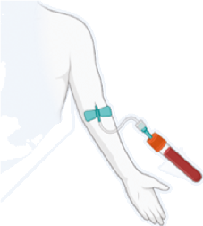

📄 [Abrir o PDF original](https://cdn.jsdelivr.net/gh/muriloffs/cardiology-agent@main/study-inbox/processados/annink-et-al-2026-combined-ldl-c-lp%2528a%2529-and-hscrp-assessment-predicts-ascvd-in-the-multiethnic-helius-cohort.pdf)

# Avaliação Combinada de LDL-C, Lp(a) e hsCRP Prediz DCVAE na Coorte Multiétnica HELIUS

**Original Research — JACC, 2026 (Article in Press).** Annink ME, Beverloo CYY, Kraaijenhof JM, Reeskamp LF, Galenkamp H, van den Born BJH, Stroes ESG, Nurmohamed NS. [10.1016/j.jacc.2026.05.006](https://doi.org/10.1016/j.jacc.2026.05.006)

> 🎓 **Aprofunde:** Este estudo aborda uma tríade de biomarcadores que capturam **vias fisiopatológicas distintas e complementares** da aterosclerose: o LDL-C (colesterol de lipoproteína de baixa densidade → carga de colesterol aterogênico da via clássica apoB), a Lp(a) (lipoproteína[a] → risco geneticamente determinado, apoB + fosfolipídios oxidados) e a hsCRP (proteína C-reativa de alta sensibilidade → marcador *downstream* da inflamação vascular, via IL-1/IL-6). A pergunta central é se essa avaliação combinada — já validada em populações majoritariamente europeias — se mantém válida em populações étnicas com distribuições de biomarcadores e risco de fundo DRAMATICAMENTE diferentes. Ao longo do texto, chamo a sigla oficial em português de **DCVAE** (doença cardiovascular aterosclerótica), equivalente ao ASCVD do original.

---

## Resumo Estruturado (Abstract)

**Contexto.** LDL-C, Lp(a) e hsCRP capturam vias diferentes que impulsionam a doença cardiovascular aterosclerótica (DCVAE). Contudo, é desconhecido se sua avaliação combinada fornece estratificação de risco confiável em diferentes populações étnicas com distribuições marcadamente distintas desses biomarcadores, bem como risco de fundo diferente de DCVAE.

**Objetivos.** Avaliar as associações independentes e conjuntas de LDL-C, Lp(a) e hsCRP com DCVAE incidente e testar formalmente a interação aditiva e multiplicativa desses biomarcadores em uma coorte multiétnica, além de determinar se essas associações são consistentes entre participantes de ascendência africana, europeia e sul-asiática surinamesa.

**Métodos.** Entre 15.676 participantes do HELIUS (HEalthy Life In an Urban Setting) sem infarto do miocárdio ou AVC isquêmico prévios (idade média 44,4 ± 13,2 anos; 56,0% mulheres), a DCVAE incidente foi identificada por vinculação a registros nacionais. Modelos de risco competitivo de Fine-Gray foram usados para avaliar associações através de quintis crescentes de biomarcadores e de elevações conjuntas. A interação aditiva foi avaliada pelo excesso de risco relativo devido à interação (RERI), pela proporção atribuível (AP) e pelo índice de sinergia. O valor preditivo incremental de Lp(a) e hsCRP além de um modelo clínico baseado no PREVENT-ASCVD foi avaliado por área sob a curva tempo-dependente e melhora líquida de reclassificação (NRI) contínua.

**Resultados.** Ao longo de mediana de 8,9 anos de seguimento (138.375 pessoas-ano), ocorreram 378 eventos de DCVAE. As razões de risco de subdistribuição ajustadas (quintil superior vs. inferior) foram 1,39 (IC95%: 1,09-1,79) para LDL-C, 1,86 (IC95%: 1,54-2,25) para Lp(a) e 1,51 (IC95%: 1,34-1,71) para hsCRP. A avaliação formal de interação não mostrou interação na escala multiplicativa nem aditiva. O risco aumentou com o número de biomarcadores elevados, atingindo aumento de 2,44 vezes (IC95%: 1,46-4,09) entre aqueles com os 3 elevados. Padrões dose-resposta consistentes foram observados entre grupos étnicos (P_interação = 0,75), embora o risco absoluto de DCVAE fosse aproximadamente 3 vezes maior em participantes sul-asiáticos surinameses. A adição de Lp(a) e hsCRP a um modelo clínico melhorou modestamente a discriminação em 10 anos (Δ área sob a curva: 0,006; P = 0,030) e a reclassificação (NRI contínua: 0,165; IC95%: 0,050-0,289).

**Conclusões.** Em uma coorte multiétnica de prevenção primária, a avaliação combinada de LDL-C, Lp(a) e hsCRP identificou indivíduos em risco elevado de longo prazo por meio de vias independentes, com gradientes de risco relativo consistentes, porém riscos absolutos divergentes entre etnias.

> 🎓 **Aprofunde:** Domine três achados-chave já no abstract: (1) **Independência de vias** — nenhuma interação multiplicativa ou aditiva significa que os efeitos se SOMAM; um paciente com os três elevados carrega risco cumulativo, não redundante. (2) **Gradiente relativo preservado, risco absoluto divergente** — o mesmo aumento *proporcional* de risco por biomarcador vale para todas as etnias, mas o *risco absoluto de base* difere 3x (sul-asiáticos surinameses muito mais altos). Isso é a distinção fundamental entre *risco relativo* (biologia generalizável) e *risco absoluto* (que depende do contexto populacional). (3) A adição dos biomarcadores ao modelo clínico melhora a discriminação de forma modesta (ΔAUC 0,006), mas a reclassificação (NRI 0,165) é mais expressiva — nuance importante ao interpretar valor de biomarcadores.

---

## Introdução

A doença cardiovascular aterosclerótica (DCVAE) é impulsionada por acúmulo lipídico e inflamação arterial. Lipoproteínas contendo apolipoproteína B (apoB) — como o LDL-C e a Lp(a) — são causais para a aterogênese. Essas lipoproteínas promovem a formação de placa e desencadeiam sinalização inflamatória que contribui para a progressão e ruptura da placa. Uma via inflamatória importante envolve a sinalização da interleucina-1, tendo a hsCRP como marcador *downstream*. Embora a hsCRP não seja em si causal, ela está consistentemente associada a eventos de DCVAE.

> 🎓 **Aprofunde:** Ponto conceitual central — **causalidade vs. associação**. LDL-C e Lp(a) são *causais* (comprovado por randomização mendeliana e ensaios de intervenção — refs. 1, 2, 3). A hsCRP NÃO é causal (a colaboração genética CCGC, ref. 5, com randomização mendeliana, não encontrou efeito causal da PCR sobre DCVAE), mas é um *marcador robusto* da atividade inflamatória subjacente (via NLRP3/IL-1β/IL-6). Portanto, a hsCRP é útil para *estratificar risco* e para *identificar candidatos a terapia anti-inflamatória*, não como alvo terapêutico direto. Domine essa distinção: a hsCRP sinaliza a via, não é a via.

Estudos recentes de prevenção primária demonstraram que LDL-C, Lp(a) e hsCRP estão cada um independentemente associados à DCVAE e que elevações conjuntas identificam indivíduos em risco particularmente alto de longo prazo (WHS, EPIC-Norfolk, UK Biobank — refs. 9-11). Entretanto, esses estudos foram conduzidos em populações de ascendência quase exclusivamente europeia. Isso deixa uma lacuna crítica: nem o risco lipídico nem o inflamatório se distribuem uniformemente entre diferentes populações étnicas. Indivíduos de ascendência africana e sul-asiática têm concentrações circulantes marcadamente mais altas de Lp(a) e hsCRP, enquanto também apresentam maior carga de DCVAE do que indivíduos de ascendência europeia. É desconhecido se as conclusões das investigações anteriores sobre essa tríade de biomarcadores se preservam em populações diversas nas quais os biomarcadores basais e a incidência de DCVAE são fundamentalmente diferentes.

> 🎓 **Aprofunde:** Os três estudos de referência a dominar: **WHS** (Women's Health Study, ref. 9, NEJM 2024, seguimento de 30 anos), **EPIC-Norfolk** (ref. 10, Eur Heart J 2025, rastreamento único universal em prevenção primária) e **UK Biobank** (Markus et al., ref. 11). Todos mostraram associações independentes e conjuntas dos três biomarcadores — MAS em populações europeias. O diferencial do HELIUS é ser multiétnico. Note a base biológica das diferenças étnicas: Lp(a) mais alta em africanos e sul-asiáticos é impulsionada por **variação ancestral no locus LPA** (refs. 35, 36), e hsCRP mais alta reflete determinantes genéticos + cardiometabólicos (refs. 12-14, 37, 38).

Uma segunda questão não resolvida diz respeito à natureza da interação entre LDL-C, Lp(a) e hsCRP. Estudos prévios relataram achados mistos quanto à interação multiplicativa entre esses biomarcadores (refs. 11, 19-24), mas nenhum avaliou formalmente a interação aditiva, que carrega implicações distintas para a avaliação conjunta de risco. Se o risco de DCVAE mediado por esses biomarcadores se acumula aditivamente, pacientes com múltiplas elevações podem se beneficiar de intervenções concomitantes que visam essas vias — como terapia hipolipemiante, agentes emergentes redutores de Lp(a) e drogas anti-inflamatórias como a colchicina (refs. 25-27).

> 🎓 **Aprofunde:** A distinção entre **interação aditiva** e **interação multiplicativa** é o cerne metodológico do artigo — domine-a. A interação *multiplicativa* testa se o efeito conjunto (na escala de HR) é maior que o produto dos efeitos individuais. A interação *aditiva* testa se o risco em excesso conjunto é maior que a soma dos riscos em excesso individuais. Para a decisão clínica ("vale a pena tratar as duas vias ao mesmo tempo?"), a escala ADITIVA é a mais relevante — porque se não há sinergia aditiva (RERI ≈ 0), cada via contribui de forma independente e somável, justificando intervenções concomitantes sobre cada uma. Nenhum estudo anterior tinha feito essa avaliação aditiva formal — esse é o principal avanço metodológico do HELIUS.

Portanto, os autores examinaram as associações independentes e conjuntas de LDL-C, Lp(a) e hsCRP com DCVAE incidente em uma grande coorte multiétnica de base populacional, entre indivíduos sem DCVAE prévia. Adicionalmente, avaliaram se o risco de DCVAE associado à carga cumulativa de biomarcadores é consistente entre participantes de ascendência africana, europeia e sul-asiática surinamesa. Por fim, testaram formalmente interação aditiva e multiplicativa e determinaram o valor preditivo incremental de Lp(a) e hsCRP além de um modelo clínico de risco.

---

## Métodos

### População e Desenho do Estudo

O estudo HELIUS (HEalthy Life In an Urban Setting) é uma coorte multiétnica, de base populacional, em andamento, conduzida em Amsterdã, Holanda (refs. 28, 29). Um total de 24.780 indivíduos de ascendência holandesa, sul-asiática surinamesa, africana surinamesa, ganesa, turca e marroquina, com idade entre 18 e 70 anos, foram recrutados entre 2011 e 2015. A etnia foi classificada com base no país de nascimento: participantes nascidos fora da Holanda com pelo menos 1 dos pais nascido no mesmo país, e aqueles nascidos na Holanda com ambos os pais nascidos no exterior, foram considerados não holandeses. A distinção entre africanos surinameses e sul-asiáticos surinameses foi determinada por autorrelato.

A população africana surinamesa é majoritariamente descendente de africanos ocidentais trazidos ao Suriname como parte do comércio transatlântico de escravizados entre os séculos XVII e XIX. A população sul-asiática surinamesa é descendente de trabalhadores migrantes que vieram da Índia sob domínio britânico ao Suriname no fim do século XIX e início do XX. Após a independência do Suriname da Holanda em 1975, um número substancial de indivíduos africanos surinameses e sul-asiáticos surinameses migrou para a Holanda.

> 🎓 **Aprofunde:** Entenda por que essa granularidade histórica importa: a coorte permite separar **duas populações surinamesas com origens genéticas totalmente distintas** (africana ocidental vs. sul-asiática/indiana), apesar de compartilharem trajetória migratória. Isso é raro e valioso — permite dissecar diferenças ancestrais de biomarcadores (Lp(a) alta em africanos por variação no LPA; hsCRP alta em sul-asiáticos) de fatores de estilo de vida/socioeconômicos comuns.

A coleta de dados envolveu exame físico, questionário e coleta de amostras biológicas. O estudo foi aprovado pelo Conselho de Revisão Ética do Amsterdam UMC (MREC 10/100# 17.10.1729) e conduzido conforme os princípios da Declaração de Helsinque. Todos os participantes deram consentimento informado por escrito. Foram incluídos no presente estudo os participantes com medidas basais disponíveis de Lp(a), hsCRP e LDL-C e com consentimento escrito para vinculação de seus dados a registros de saúde. Participantes que relataram infarto do miocárdio ou AVC isquêmico ao início foram excluídos.

### Medidas Laboratoriais

Amostras de plasma em jejum foram coletadas no início e armazenadas a −80 °C. Colesterol total, HDL-C e triglicérides foram medidos por espectrofotometria colorimétrica (Roche Diagnostics). O LDL-C foi calculado pela fórmula de Friedewald. As concentrações de Lp(a) foram medidas com o ensaio imunoturbidimétrico molar Roche Tina-Quant Lipoprotein(a) (Roche Diagnostics), padronizado para ser amplamente independente do tamanho da isoforma da apolipoproteína(a). As concentrações de hsCRP foram medidas turbidimetricamente em analisador Cobas 702c (Roche Diagnostics). Quando a hsCRP medida estava abaixo do limite inferior de detecção (<0,3 mg/L), o valor foi substituído por 0,15 mg/L (n = 1.377). A falta de dados dos biomarcadores no início foi baixa no geral (<1% para cada).

> 🎓 **Aprofunde:** Detalhe técnico crucial para a Lp(a): o ensaio molar (nmol/L) independente de isoforma. A apo(a) tem número variável de repetições **kringle IV tipo 2** — isoformas menores (menos repetições) associam-se a maiores concentrações e maior risco. Ensaios antigos em massa (mg/dL) sofrem viés por tamanho de isoforma; o ensaio molar padronizado (nmol/L) corrige isso e é o preferido. Lembre também que o cálculo de LDL-C por Friedewald tem limitações em triglicérides muito altos e LDL-C baixo — relevante para interpretar o quintil mais baixo.

### Definições de Desfecho e Vinculação

Os dados do estudo foram vinculados a dados de mortalidade e a registros de internações hospitalares da Statistics Netherlands (refs. 30, 31). Os dados de mortalidade incluíram todos os óbitos e causas registrados de 2011 a 2023 no Registro de Causas de Óbito. Os registros de internação da Dutch Hospital Data incluíram todas as admissões (≥1 dia) em hospitais gerais e acadêmicos na Holanda de 2011 a 2022. Após a vinculação, os registros foram pseudonimizados pela Statistics Netherlands e disponibilizados para análise. Os eventos foram selecionados conforme a CID-9 (para eventos em 2011 e 2012) e CID-10 (para eventos de 2013 a 2023). O desfecho primário foi um composto de infarto do miocárdio não fatal, AVC isquêmico não fatal, revascularização coronariana e mortalidade cardiovascular. A incidência de revascularização coronariana — definida como intervenção coronariana percutânea ou cirurgia de revascularização miocárdica — foi avaliada por códigos nacionais holandeses de procedimento.

### Análises Estatísticas

Variáveis contínuas são apresentadas como média ± DP ou mediana (IQR), conforme apropriado; categóricas como contagens e percentuais. Coeficientes de correlação de Spearman foram calculados entre pares de biomarcadores. Para aumentar o poder estatístico, as 6 etnias foram agrupadas em 3 grupos com base em composição genética sobreposta e origens geográficas (ref. 32): holandeses e turcos como **europeus**; africanos surinameses, ganeses e marroquinos como **africanos**; e sul-asiáticos surinameses como grupo distinto.

> 🎓 **Aprofunde:** Note a decisão metodológica de agregar 6 etnias em 3 grupos por proximidade genética/geográfica. Os autores testaram heterogeneidade *dentro* dos grupos agregados (africano e europeu) por testes de razão de verossimilhança usando a variável original de 6 etnias, e não encontraram heterogeneidade significativa — justificando o agrupamento. Também usaram **erros-padrão robustos por cluster** com a variável de 6 etnias como cluster, para levar em conta correlações intra-grupo. Isso é boa prática estatística para evitar subestimar a variância.

As associações entre quintis de biomarcadores e DCVAE incidente foram avaliadas em análise tempo-até-primeiro-evento usando modelos de risco de subdistribuição de Fine-Gray, com óbito não cardiovascular como evento competitivo. O seguimento foi calculado da visita basal até o primeiro evento de DCVAE, óbito ou última data de seguimento disponível. Em casos de múltiplos eventos no mesmo participante, usou-se o primeiro. Razões de risco de subdistribuição (SHR) foram estimadas para cada quintil em relação ao mais baixo.

- **Modelos minimamente ajustados:** idade, sexo, etnia e os 2 outros biomarcadores como covariáveis contínuas.
- **Modelos totalmente ajustados:** adicionalmente incluíram tabagismo atual, terapia hipolipemiante, pressão arterial sistólica, diabetes mellitus, taxa de filtração glomerular estimada e microalbuminúria.

> 🎓 **Aprofunde:** Por que **Fine-Gray** e não Cox padrão? Em uma coorte de prevenção primária relativamente jovem, o óbito não cardiovascular é um *evento competitivo* — quem morre de outra causa não pode mais ter DCVAE. O modelo de Fine-Gray modela a *função de incidência cumulativa de subdistribuição*, fornecendo estimativas de risco absoluto mais corretas na presença de risco competitivo, ao contrário do Cox que superestima. As **SHR** (subdistribution hazard ratios) são as razões desse modelo. Domine: Fine-Gray para risco absoluto/incidência cumulativa com competição; Cox cause-specific para etiologia.

Tendências lineares foram testadas modelando quintis como variáveis ordinais. Como análises de sensibilidade, os biomarcadores também foram modelados continuamente (LDL-C sem transformação; Lp[a] e hsCRP transformados por log natural) e usando pontos de corte clínicos estabelecidos: hsCRP (<1, 1-3, ≥3 mg/L), Lp(a) (<75, 75-125, ≥125 nmol/L) e LDL-C (<1,8; 1,8-3,5; ≥3,5 mmol/L).

Para avaliar associações conjuntas, os participantes foram classificados como alto (quintil superior) vs. baixo (quintis 1-4) para cada par de biomarcadores e para os 3 simultaneamente, com ambos (ou os 3) baixos como referência. A **interação multiplicativa** foi testada comparando modelos de Fine-Gray totalmente ajustados com biomarcadores transformados em splines cúbicas restritas contra modelos incluindo adicionalmente termos de interação de spline, usando o teste de razão de verossimilhança. Para a análise de 3 vias, um modelo com todos os termos de spline e produtos pareados foi comparado a um modelo incluindo adicionalmente o termo de produto de 3 vias.

A razão SHR conjunta observada/esperada foi computada, com a SHR conjunta esperada definida como o produto das SHR individuais sob independência multiplicativa. A **interação aditiva** foi avaliada usando o excesso de risco relativo devido à interação (**RERI**), a proporção atribuível devido à interação (**AP**) e o **índice de sinergia**, com valores nulos de 0, 0 e 1, respectivamente. Os ICs foram derivados pelo método delta a partir da matriz de variância-covariância dos coeficientes do modelo de Fine-Gray. Essas análises de interação foram repetidas usando pontos de corte clínicos.

> 🎓 **Aprofunde:** Memorize os **valores nulos** das três métricas de interação aditiva: **RERI = 0**, **AP = 0**, **Índice de sinergia = 1**. Se os ICs dessas métricas contêm o valor nulo, NÃO há interação aditiva → as vias são independentes e aditivas. RERI (relative excess risk due to interaction) = quanto de risco em excesso vem da interação além da soma. AP = fração do risco no grupo duplamente exposto atribuível à interação. Índice de sinergia = razão entre o excesso de risco observado e o esperado sob aditividade. São as ferramentas epidemiológicas padrão (Rothman) para interação biológica.

A carga cumulativa de biomarcadores elevados foi categorizada como 0, 1 ou ≥2 no quintil superior. A incidência cumulativa de DCVAE foi estimada em 5 e 10 anos pelo estimador de Aalen-Johansen, estratificada por categoria de carga e grupo étnico, com ICs95% derivados da variância da função de incidência cumulativa. Diferenças de risco absoluto em 10 anos foram calculadas entre cada categoria de carga e a referência (0 elevados). A modificação de efeito por etnia foi testada por teste de razão de verossimilhança comparando modelos com e sem termo de interação entre carga de biomarcadores e etnia.

Para avaliar se Lp(a) e hsCRP melhoram a predição além de modelos clínicos estabelecidos, comparou-se um modelo clínico com um modelo aprimorado. O **modelo clínico** incluiu o escore de risco de DCVAE de 10 anos derivado do PREVENT-ASCVD (Predicting Risk of Cardiovascular Disease EVENTs–Atherosclerotic Cardiovascular Disease), que incorpora colesterol não-HDL (capturando assim o LDL-C junto com outras lipoproteínas contendo apoB) (refs. 33, 34), junto com as covariáveis já especificadas. O **modelo aprimorado** incluiu adicionalmente Lp(a) log-transformada e hsCRP log-transformada.

Curvas ROC tempo-dependentes foram construídas em 5 e 10 anos por ponderação por probabilidade inversa de censura, considerando riscos competitivos, e a área sob a curva ROC (AUC) foi comparada entre modelos. Para quantificar o *overfitting*, aplicou-se adicionalmente correção de otimismo bootstrap de Harrell (1.000 reamostragens) às AUCs de ambos os modelos, reportando estimativas aparentes e corrigidas por otimismo. A NRI contínua foi estimada em 5 e 10 anos por métodos de Kaplan-Meier com 1.000 iterações bootstrap para ICs de percentil 95, decomposta em NRI+ (eventos) e NRI− (não eventos). A reclassificação categórica foi avaliada em 10 anos usando limiares concordantes com a diretriz ACC/AHA (<3%, 3%-5%, 5%-10%, ≥10%) (ref. 34).

> 🎓 **Aprofunde:** Conceitos-chave de avaliação de modelo: (1) **AUC tempo-dependente** = discriminação (capacidade de ordenar corretamente quem terá evento). Ganhos de AUC costumam ser pequenos mesmo para bons biomarcadores porque a AUC é pouco sensível. (2) **NRI (net reclassification improvement)** = quanto o novo modelo reclassifica corretamente pacientes para cima (eventos) ou para baixo (não eventos). A NRI contínua não depende de limiares fixos. (3) **Correção de otimismo bootstrap de Harrell** = validação interna que estima e desconta o *overfitting* (quão inflada está a performance por avaliar no mesmo dado do ajuste). Aqui os estimadores aparentes e corrigidos foram quase idênticos → pouco overfitting. IMPORTANTE: não houve validação EXTERNA (coorte independente) — limitação reconhecida.

Ambos os modelos foram ajustados e avaliados na mesma coorte; a correção de otimismo bootstrap forneceu validação interna, mas não houve validação externa. Análises exploratórias estratificadas por etnia avaliaram a consistência do valor preditivo incremental entre os grupos.

Em todos os modelos que incluíam etnia como covariável, a variável agregada de 3 níveis foi incluída como covariável e a variável original de 6 etnias foi usada como variável de agrupamento (cluster). Erros-padrão robustos por cluster foram estimados usando as 6 etnias originais para contabilizar correlações intra-grupo. Para avaliar heterogeneidade dentro das etnias agregadas, testes de razão de verossimilhança foram realizados nos subgrupos africano e europeu, com termo de interação entre a variável independente de interesse e a variável de 6 etnias; nenhuma heterogeneidade estatisticamente significativa foi encontrada. Covariáveis faltantes (excluindo LDL-C, Lp[a] e hsCRP) foram imputadas por imputação multivariada por equações encadeadas. Um P bilateral < 0,05 foi considerado significativo. As análises foram feitas em R versão 4.4.3.

---

## Resultados

### Características da Coorte

Um total de 15.676 participantes foi incluído. A idade média era 44,4 ± 13,2 anos, 56,0% eram mulheres, e a coorte incluiu participantes de ascendência africana (45,8%), europeia (39,8%) e sul-asiática surinamesa (14,4%). O LDL-C médio era 2,8 ± 0,9 mmol/L, a mediana de Lp(a) era 35,6 nmol/L (12,7-92,7) e a mediana de hsCRP era 1,3 mg/L (0,6-3,0).

**Tabela 1 — Características Basais da Coorte Total e por Etnia**

| Característica | Total (N=15.676) | Africano (n=7.178) | Europeu (n=6.236) | Sul-Asiático Surinamês (n=2.262) |
|---|---|---|---|---|
| Idade (anos) | 44,4 ± 13,2 | 44,7 ± 12,7 | 43,9 ± 13,7 | 45,0 ± 13,2 |
| Sexo feminino | 8.772 (56,0%) | 4.218 (58,8%) | 3.304 (53,0%) | 1.250 (55,3%) |
| Hipertensão | 5.075 (32,4%) | 2.742 (38,2%) | 1.509 (24,2%) | 824 (36,4%) |
| Terapia hipolipemiante | 1.333 (8,5%) | 524 (7,3%) | 417 (6,7%) | 392 (17,3%) |
| Diabetes mellitus | 1.311 (8,4%) | 684 (9,5%) | 272 (4,4%) | 355 (15,7%) |
| Tabagista atual | 3.827 (24,4%) | 1.428 (19,9%) | 1.769 (28,4%) | 630 (27,9%) |
| LDL-C (mmol/L) | 2,8 ± 0,9 | 2,7 ± 0,9 | 3,0 ± 0,9 | 2,9 ± 0,9 |
| Lp(a) (nmol/L) | 35,6 (12,7-92,7) | 58,9 (27,0-120,0) | 16,4 (7,0-47,6) | 34,7 (15,0-87,5) |
| hsCRP (mg/L) | 1,3 (0,6-3,0) | 1,4 (0,6-3,2) | 1,1 (0,5-2,4) | 1,7 (0,8-3,9) |

> 🎓 **Aprofunde:** Observe os padrões étnicos que sustentam toda a hipótese do estudo: **Lp(a) mediana ~3,6x maior em africanos (58,9)** vs. europeus (16,4); **hsCRP mais alta em sul-asiáticos (1,7)** vs. europeus (1,1). Além disso, os sul-asiáticos surinameses têm perfil cardiometabólico pior: mais diabetes (15,7% vs. 4,4% europeus), mais terapia hipolipemiante (17,3% vs. 6,7%) — refletindo o "fenótipo sul-asiático" de alto risco cardiovascular apesar de biomarcadores lipídicos não tão discrepantes. Esse é o pano de fundo para o achado de risco absoluto ~3x maior nesse grupo.

As distribuições por quintil variaram fortemente por etnia. Para a **Lp(a)**, apenas 8,6% dos africanos estavam no Q1 (mais baixo), enquanto 27,0% estavam no Q5 (mais alto); nos europeus, 34,9% no Q1 e apenas 12,3% no Q5. Para a **hsCRP**, os sul-asiáticos surinameses estavam sobrerrepresentados no Q5 (26,5%) e sub-representados no Q1 (13,9%). Para o **LDL-C**, os europeus estavam concentrados nos quintis superiores (23,8% no Q5).

Cortes de quintil da coorte total:
- **LDL-C:** Q1 ≤2,05; Q2 2,05-2,54; Q3 2,54-3,00; Q4 3,00-3,57; Q5 >3,57 mmol/L.
- **Lp(a):** Q1 ≤9,87; Q2 9,87-24,30; Q3 24,30-51,60; Q4 51,60-113,00; Q5 >113,00 nmol/L.
- **hsCRP:** Q1 ≤0,48; Q2 0,48-0,95; Q3 0,95-1,77; Q4 1,77-3,70; Q5 >3,70 mg/L.

As **correlações entre os biomarcadores foram fracas** (Spearman ρ: LDL-C–Lp(a) −0,09; LDL-C–hsCRP 0,11; Lp(a)–hsCRP 0,06; todos P < 0,001), indicando que cada biomarcador captura informação amplamente independente.

> 🎓 **Aprofunde:** As correlações quase nulas (|ρ| ≤ 0,11) são um achado FUNDAMENTAL — confirmam que os três biomarcadores medem coisas biologicamente distintas. Isso já antecipa a ausência de interação e sustenta o argumento de "vias paralelas". Se fossem altamente correlacionados, medir os três seria redundante. Note também a correlação negativa entre LDL-C e Lp(a) (−0,09): fenômeno conhecido — reduções de LDL podem coincidir com Lp(a) relativamente maior, mas aqui o efeito é minúsculo.

### Eventos Incidentes

Ao longo de mediana de 8,9 anos (IQR 7,8-9,7), somando 138.375 pessoas-ano, ocorreram 378 primeiros eventos de DCVAE: **126 infartos do miocárdio, 87 AVCs isquêmicos, 117 revascularizações coronarianas e 48 óbitos cardiovasculares**.

**Tabela 2 — Eventos Incidentes de DCVAE por Etnia**

| Tipo de evento | Africano (n=7.178) | Europeu (n=6.236) | Sul-Asiático Surinamês (n=2.262) | Total (N=15.676) |
|---|---|---|---|---|
| Óbito cardiovascular | 19 (13,4%) | 19 (15,6%) | 10 (8,7%) | 48 (12,7%) |
| AVC isquêmico | 46 (32,6%) | 22 (18,0%) | 19 (16,5%) | 87 (23,0%) |
| Infarto do miocárdio | 37 (26,2%) | 45 (36,9%) | 44 (38,2%) | 126 (33,3%) |
| Revascularização | 39 (27,7%) | 36 (29,5%) | 42 (36,5%) | 117 (31,0%) |
| Total de eventos DCVAE | 141 (100%) | 122 (100%) | 115 (100%) | 378 (100%) |

> 🎓 **Aprofunde:** Detalhe clínico importante: nos africanos o AVC isquêmico é o evento mais frequente (32,6%), enquanto em europeus e sul-asiáticos predomina a doença coronariana (IM + revascularização). Isso reflete perfis de doença distintos por etnia — africanos com peso maior de doença cerebrovascular (relação com hipertensão, presente em 38,2%). Note também que os 115 eventos em apenas 2.262 sul-asiáticos correspondem a uma taxa desproporcionalmente alta — grupo com 14,4% da coorte, mas 30% dos eventos.

### Associações Individuais por Quintil

_(figura: Forest plot das SHR e aSHR para DCVAE incidente através de quintis crescentes de LDL-C, Lp(a) e hsCRP — Figura 1 — ver original)_

Nos modelos de Fine-Gray totalmente ajustados, as razões de risco de subdistribuição ajustadas (aSHR) do quintil superior vs. inferior foram:
- **LDL-C:** 1,39 (IC95%: 1,09-1,79; P = 0,009)
- **Lp(a):** 1,86 (IC95%: 1,54-2,25; P < 0,001)
- **hsCRP:** 1,51 (IC95%: 1,34-1,71; P < 0,001)

Associações lineares consistentes foram observadas para os três biomarcadores. Cada 1 mmol/L a mais de LDL-C correspondeu a aSHR de 1,23 (IC95%: 1,13-1,33; P < 0,001); cada aumento de 1 log em Lp(a) e hsCRP correspondeu a aSHRs de 1,12 (IC95%: 1,09-1,16; P < 0,001) e 1,13 (IC95%: 1,06-1,20; P < 0,001), respectivamente.

Essas associações persistiram através de limiares clinicamente relevantes:
- LDL-C ≥3,5 vs. <1,8 mmol/L: aSHR 1,34 (IC95%: 1,04-1,74; P = 0,025)
- Lp(a) ≥125 vs. <75 nmol/L: aSHR 1,44 (IC95%: 1,26-1,65; P < 0,001)
- hsCRP ≥3 vs. <1 mg/L: aSHR 1,31 (IC95%: 1,15-1,51; P < 0,001)

> 🎓 **Aprofunde:** Observe um ponto sutil na Figura 1: nos modelos MINIMAMENTE ajustados (só idade, sexo, etnia), o LDL-C aparece com SHR *inversa* nos quintis intermediários (ex.: Q2 SHR 0,75, Q4 SHR 0,75) — provavelmente por confundimento negativo (quem tem LDL alto está mais em terapia hipolipemiante, e a etnia africana tem LDL mais baixo mas mais eventos por AVC). Mas nos modelos TOTALMENTE ajustados, a relação dose-resposta linear se restabelece (P_tendência = 0,009). Isso ilustra por que o ajuste multivariável importa. A robustez das associações — mantidas com biomarcadores contínuos, log-transformados E em cortes clínicos — é o argumento de que os achados não são artefato dos cortes de quintil populacionais.

### Associações Conjuntas Pareadas

_(figura: Curvas de incidência cumulativa e forest plot das associações pareadas de LDL-C, Lp(a) e hsCRP com DCVAE — Figura 2 — ver original)_

Em todos os 3 pares de biomarcadores, a incidência de DCVAE foi mais baixa quando ambos estavam nos quintis 1-4 e mais alta quando ambos no quintil superior. As aSHR para elevação conjunta foram:
- **LDL-C + Lp(a):** 1,79 (IC95%: 1,26-2,56; P = 0,001)
- **LDL-C + hsCRP:** 1,89 (IC95%: 1,58-2,26; P < 0,001)
- **Lp(a) + hsCRP:** 1,92 (IC95%: 1,65-2,23; P < 0,001)

Essas associações conjuntas também persistiram através de limiares clínicos. Nenhum dos termos de interação multiplicativa atingiu significância estatística (P_interação = 0,066, 0,865 e 0,659 para LDL-C × Lp(a), LDL-C × hsCRP e Lp(a) × hsCRP, respectivamente). A avaliação formal de interação aditiva rendeu estimativas de RERI, AP e índice de sinergia consistentes com seus valores nulos (0, 0 e 1) para os 3 pares, sem evidência de desvio da aditividade. Estendendo aos 3 biomarcadores simultaneamente, não houve evidência de interação multiplicativa de 3 vias (P_interação = 0,47).

### Avaliação Formal de Interação (Tabela 3)

**Tabela 3 — Avaliação Formal de Interação Pareada e de 3 Vias**

| Combinação | aSHR conjunta observada | aSHR conjunta esperada | Razão Obs/Esp | RERI (IC95%) | AP (IC95%) | Índice de sinergia (IC95%) | P_interação |
|---|---|---|---|---|---|---|---|
| LDL-C × Lp(a) | 1,794 | 2,080 | 0,863 | −0,091 (−0,821 a 0,640) | −0,050 (−0,475 a 0,374) | 0,898 (0,085 a 1,710) | 0,066 |
| LDL-C × hsCRP | 1,893 | 1,685 | 1,124 | 0,294 (−0,191 a 0,780) | 0,156 (−0,077 a 0,388) | 1,492 (0,519 a 2,464) | 0,865 |
| Lp(a) × hsCRP | 1,920 | 1,676 | 1,146 | 0,328 (−0,345 a 1,002) | 0,171 (−0,181 a 0,522) | 1,554 (−0,233 a 3,342) | 0,659 |
| LDL-C × Lp(a) × hsCRP | 2,443 | 1,960 | 1,246 | −0,310 (−2,502 a 1,881) | −0,127 (−1,083 a 0,828) | 0,823 (−0,320 a 1,965) | 0,470 |

> 🎓 **Aprofunde:** Esta é a Tabela mais importante do artigo do ponto de vista conceitual. Interprete: em TODAS as combinações, os ICs do RERI cruzam o 0, os ICs da AP cruzam o 0, e os ICs do índice de sinergia cruzam o 1 → **sem interação aditiva**. Analogamente, todos os P_interação multiplicativa são não significativos. Conclusão robusta: **as três vias contribuem de forma independente e ADITIVA** para o risco. Ressalva importante que os próprios autores fazem: os ICs são LARGOS (poder limitado, 378 eventos), então "ausência de interação" não é o mesmo que "prova de aditividade perfeita" — não se pode excluir efeitos de interação modestos. Mas o padrão geral é consistente com vias paralelas. A implicação terapêutica é direta: tratar LDL, Lp(a) e inflamação simultaneamente deve produzir benefícios somáveis, não redundantes.

### Carga Cumulativa de Biomarcadores

_(figura: Curvas de incidência cumulativa e forest plot das associações conjuntas das 8 combinações de LDL-C, Lp(a) e hsCRP — Figura 3 — ver original)_

O risco de DCVAE aumentou progressivamente com o número de biomarcadores no quintil superior, atingindo aSHR de **2,44 (IC95%: 1,46-4,09; P < 0,001)** entre indivíduos com os 3 elevados vs. nenhum elevado. As combinações intermediárias (Figura 3) mostraram gradiente crescente: por exemplo, LDL-C+Lp(a)+hsCRP− teve aSHR 1,71; Lp(a)+hsCRP com LDL-C− teve aSHR 2,04.

### Valor Preditivo Incremental (Tabela 4)

Comparou-se o modelo clínico baseado no PREVENT-ASCVD com o modelo aprimorado incorporando Lp(a) e hsCRP log-transformadas.

**Tabela 4 — Valor Preditivo Incremental de Adicionar Lp(a) e hsCRP ao Modelo Clínico**

| Métrica | 5 anos (aparente) | 5 anos (corrigido otimismo) | 10 anos (aparente) | 10 anos (corrigido otimismo) |
|---|---|---|---|---|
| AUC modelo clínico | 0,836 (0,808-0,863) | 0,832 (0,804-0,859) | 0,768 (0,742-0,795) | 0,763 (0,736-0,789) |
| AUC clínico + Lp(a) + hsCRP | 0,837 (0,811-0,864) | 0,833 (0,807-0,859) | 0,775 (0,748-0,801) | 0,768 (0,742-0,795) |
| ΔAUC (P) | 0,002 (P=0,56) | 0,001 (P=0,76) | 0,006 (P=0,030) | 0,006 (P=0,050) |
| NRI contínua | 0,178 (0,034-0,322) | — | 0,165 (0,050-0,289) | — |
| NRI+ (eventos) | 0,035 (−0,110 a 0,180) | — | 0,022 (−0,088 a 0,142) | — |
| NRI− (não eventos) | 0,142 (0,127-0,158) | — | 0,143 (0,127-0,159) | — |
| NRI categórica (10 anos) | — | — | 0,008 (−0,034 a 0,051) | — |

Em 10 anos, o modelo clínico alcançou AUC de 0,768 (IC95%: 0,742-0,795), que melhorou levemente para 0,775 (IC95%: 0,748-0,801) com a adição de Lp(a) e hsCRP (ΔAUC 0,006; P = 0,030). Após correção de otimismo, os estimadores mudaram pouco (clínico 0,763; aprimorado 0,768; ΔAUC 0,006; P = 0,050). Em 5 anos, a discriminação foi maior no geral, mas o ganho incremental foi menor (0,836 vs. 0,837; ΔAUC 0,002; P = 0,56). A NRI contínua em 10 anos foi 0,165 (IC95%: 0,050-0,289), impulsionada principalmente pela melhor classificação de não eventos (NRI− 0,143; IC95%: 0,127-0,159), com padrão similar em 5 anos (NRI 0,178). A NRI categórica com limiares de 3%, 5% e 10% foi não significativa em 10 anos (0,008; IC95%: −0,034 a 0,051).

> 🎓 **Aprofunde:** Interpretação crítica: a melhora de discriminação é MODESTA (ΔAUC 0,006, mal significativa após correção). MAS a NRI contínua de 0,165 é mais expressiva — e a decomposição revela que o ganho vem quase inteiramente de reclassificar corretamente NÃO EVENTOS para baixo (NRI− 0,143), não de reclassificar eventos para cima (NRI+ não significativa). Ou seja: os biomarcadores ajudam mais a *tranquilizar* corretamente quem NÃO terá evento do que a *identificar* quem terá. A NRI categórica (limiares de decisão clínicos) foi nula — sinalizando que, na prática de decisão dicotômica (tratar/não tratar), o ganho pode ser limitado. Este é um exemplo clássico da lição de que ΔAUC pequeno não invalida o valor de um biomarcador — mas também não deve superestimá-lo.

Em análises exploratórias estratificadas por etnia, o ΔAUC em 10 anos, embora direcionalmente consistente, não foi estatisticamente significativo em nenhum grupo étnico (Europeu ΔAUC 0,008, P=0,076; Africano ΔAUC 0,008, P=0,22; Sul-Asiático Surinamês ΔAUC 0,001, P=0,81). A NRI contínua em 10 anos foi significativa entre europeus (0,293; IC95%: 0,089-0,492), impulsionada por melhor classificação de não eventos (NRI− 0,189), mas não significativa entre africanos (0,094; IC95%: −0,090 a 0,271) e sul-asiáticos surinameses (0,046; IC95%: −0,182 a 0,264). A NRI categórica em 10 anos foi não significativa em todos os grupos.

### Consistência entre Etnias

_(figura: Curvas de incidência cumulativa por carga cumulativa de biomarcadores e etnia (Overall, Africano, Europeu, Sul-Asiático Surinamês) + tabela de SHR e riscos absolutos — Figura 4 — ver original)_

Na população geral, o risco de DCVAE aumentou progressivamente com o número de biomarcadores elevados: aSHRs de **1,30 (IC95%: 1,12-1,50; P < 0,001) para 1 elevado** e **1,94 (IC95%: 1,59-2,37; P < 0,001) para ≥2 elevados**, vs. nenhum.

Padrões dose-resposta similares foram observados em africanos, europeus e sul-asiáticos surinameses, cada um com tendências lineares significativas (P_tendência < 0,001 para africanos e europeus; P_tendência = 0,048 para sul-asiáticos surinameses), **sem evidência de modificação de efeito por etnia (P_interação = 0,75)**.

**Riscos absolutos divergentes (incidência cumulativa de DCVAE em 10 anos):**

| Carga de biomarcadores | Africano | Europeu | Sul-Asiático Surinamês |
|---|---|---|---|
| 0 elevados | 1,6% (1,1-2,1) | 1,6% (1,1-2,2) | 5,5% (3,9-7,1) |
| ≥2 elevados | 4,4% (2,7-6,1) | 4,1% (2,2-6,0) | 9,4% (4,4-14,4) |
| Diferença absoluta de risco (≥2 vs. 0) | 2,8 pp | 2,5 pp | 3,9 pp |

> 🎓 **Aprofunde:** Este é o achado clínico central do braço multiétnico. Domine o contraste: o **risco RELATIVO** (a razão de risco por biomarcador elevado) é o MESMO entre etnias — a biologia é generalizável. Mas o **risco ABSOLUTO** diverge drasticamente: um sul-asiático surinamês SEM nenhum biomarcador elevado (5,5% em 10 anos) já tem risco maior que um africano ou europeu COM 2+ elevados (~4%). Isso significa que a tríade de biomarcadores NÃO captura toda a carga de risco residual dos sul-asiáticos — há risco de fundo (genético, cardiometabólico, socioeconômico) que os três marcadores não explicam. Adicionalmente, a diferença absoluta de risco (impacto clínico da acumulação de biomarcadores) é MAIOR nos sul-asiáticos (3,9 pp), reforçando que, apesar de risco relativo igual, o impacto absoluto de tratar múltiplas vias é maior nessa população de alto risco. Consequência prática: escores de risco relativo generalizam, mas a calibração absoluta precisa ser específica por população.

Outros valores da Figura 4 (aSHR na coorte total e por grupo, para carga cumulativa):
- **Total:** 1 elevado aSHR 1,30; ≥2 aSHR 1,94.
- **Africano:** 1 elevado aSHR 1,38; ≥2 aSHR 2,14.
- **Europeu:** 1 elevado aSHR 1,48; ≥2 aSHR 1,92.
- **Sul-Asiático Surinamês:** 1 elevado aSHR 1,15 (NS, P=0,50); ≥2 aSHR 1,88 (P=0,022).

---

## Discussão

Entre quase 16.000 adultos de ascendência africana, europeia e sul-asiática surinamesa sem DCVAE prévia, uma única avaliação combinada de LDL-C, Lp(a) e hsCRP identificou indivíduos em risco substancialmente elevado de longo prazo. Cada biomarcador previu eventos independentemente através dos quintis, e o risco aumentou progressivamente com o número de elevações, chegando a 2,4 vezes mais alto entre aqueles com os 3 no quintil superior vs. nenhum. A avaliação formal de interação demonstrou que esses biomarcadores contribuem para o risco de DCVAE por vias independentes. Entre populações étnicas com distribuições de biomarcadores marcadamente diferentes, os gradientes de risco relativo foram preservados, mas o risco absoluto diferiu substancialmente — evidenciando que **as vias biológicas generalizam, mas o risco populacional não**.

_(figura: Central Illustration — HELIUS: características da coorte; associações Q5 vs Q1 (LDL-C 1,39, Lp(a) 1,86, hsCRP 1,51); triângulo de interação com RERI/LRT; risco por carga cumulativa e etnia; conclusões — ver original)_

### Consistência entre populações e distribuições diferentes

Associações independentes e conjuntas de LDL-C, Lp(a) e hsCRP com DCVAE foram demonstradas em populações majoritariamente de ascendência europeia (WHS, EPIC-Norfolk, UK Biobank — refs. 9-11). Se essas associações se preservam em populações com distribuições fundamentalmente diferentes desses biomarcadores e carga de fundo de DCVAE distinta permanecia sem resposta. Indivíduos de ascendência africana e sul-asiática surinamesa têm concentrações de Lp(a) marcadamente mais altas, impulsionadas por variação ancestral específica no locus LPA (refs. 35, 36), e concentrações de hsCRP mais altas refletindo determinantes tanto genéticos quanto cardiometabólicos (refs. 12-14, 37, 38).

Apesar disso, as razões de risco (Q5 vs. Q1) no HELIUS — 1,39 para LDL-C, 1,86 para Lp(a) e 1,51 para hsCRP — foram altamente consistentes com as descritas no **WHS (1,36; 1,33; 1,70 em 30 anos)** e no **EPIC-Norfolk (1,78; 1,19; 1,55 em 20 anos)**, mesmo na população comparativamente jovem e no seguimento relativamente curto do HELIUS.

> 🎓 **Aprofunde:** A concordância dos HRs entre HELIUS, WHS e EPIC-Norfolk, apesar de idades e seguimentos muito diferentes, é um forte argumento de *replicação* e de que a magnitude do efeito é uma propriedade biológica estável. Vale destacar: o WHS acompanhou mulheres por 30 anos — logo, essa tríade prediz eventos ao longo de DÉCADAS, não só a curto prazo. Isso reforça a mensagem final dos autores sobre estratificação precoce (a idade média do HELIUS era só 44,4 anos).

Importante: apesar das distribuições marcadamente diferentes (africanos concentrados nos quintis superiores de Lp(a); sul-asiáticos sobrerrepresentados no quintil mais alto de hsCRP), os achados foram consistentes quando os biomarcadores foram modelados continuamente e com cortes clínicos — indicando que as associações não são dirigidas por limiares de quintil específicos da população. Um achado crítico é que o risco de DCVAE subiu incrementalmente com o número de biomarcadores elevados, e esse efeito foi observado nos 3 grupos étnicos sem evidência de modificação de efeito por etnia. Essas observações fornecem racional para avaliação adicional da avaliação combinada de LDL-C, Lp(a) e hsCRP em abordagens de estratificação de risco em populações diversas.

Deve-se notar, contudo, que o risco absoluto de DCVAE foi substancialmente maior entre sul-asiáticos surinameses em cada nível de carga de biomarcadores. Mesmo sul-asiáticos surinameses sem biomarcadores elevados tinham risco de DCVAE em 10 anos marcadamente elevado — sugerindo que a tríade não captura toda a extensão do risco residual nesse grupo, o que justifica investigação de marcadores adicionais na população sul-asiática.

### Independência mecanística das vias

Uma segunda contribuição-chave é a avaliação formal de interação. Estudos prévios no UK Biobank e EPIC-Norfolk relataram ausência de interação multiplicativa entre LDL-C e Lp(a), LDL-C e hsCRP, ou Lp(a) e hsCRP, mas a potencial interação aditiva não fora avaliada (refs. 11, 19, 21). As análises do HELIUS estendem esses achados demonstrando formalmente **ausência de desvio da aditividade** para qualquer combinação pareada ou para a interação de 3 vias. Embora os ICs sejam largos e não excluam totalmente efeitos de interação modestos, o padrão geral é consistente com contribuições de vias independentes.

Isso é biologicamente plausível:
- **LDL-C** promove o acúmulo lipídico na parede arterial e está causalmente ligado à formação de placa (refs. 1, 2).
- **Lp(a)**, uma lipoproteína contendo apoB que carrega fosfolipídios oxidados, representa um fator de risco pró-aterogênico e pró-inflamatório geneticamente determinado, amplamente resistente à modificação de estilo de vida (ref. 3).
- **hsCRP**, embora não causal, reflete a sinalização de IL-1β, a ativação do NLRP3 e a inflamação crônica de baixo grau: um estado pró-inflamatório do endotélio vascular central à progressão e desestabilização da placa (refs. 4-8).

> 🎓 **Aprofunde:** Domine a fisiopatologia das três vias como pilares independentes: (1) **Via do LDL-C** — retenção subendotelial de partículas apoB → oxidação → captação por macrófagos → células espumosas → placa. (2) **Via da Lp(a)** — partícula apoB-100 ligada covalentemente à apo(a) (homóloga ao plasminogênio), carreadora de fosfolipídios oxidados (OxPL) → pró-aterogênica, pró-inflamatória e pró-trombótica; NÃO responde a estatinas ou dieta, é geneticamente fixa (locus LPA). (3) **Via inflamatória (hsCRP)** — hsCRP é *downstream* do eixo NLRP3 → IL-1β → IL-6 → PCR hepática. Marca a inflamação residual. Cada via tem alvo terapêutico próprio (ver abaixo). O fato de as três serem aditivas e independentes é o alicerce conceitual para a estratégia de "tratamento multipathway".

Apesar da considerável variação nas concentrações de Lp(a) e hsCRP entre grupos étnicos, esses achados apoiam que o risco aterosclerótico surge de processos paralelos, e não de um único mecanismo dominante — também em populações com predisposição genética a distribuições diferentes de biomarcadores. Isso desafia o foco tradicional apenas na redução lipídica e apoia uma mudança para reconhecer a importância das demais vias, em toda etnia.

### Implicações terapêuticas

Essa independência mecanística tem implicações terapêuticas diretas:
- **LDL-C elevado** apoia intensificação adicional da terapia hipolipemiante.
- **hsCRP elevada** sinaliza atividade inflamatória potencialmente responsiva a intervenções direcionadas como colchicina (ref. 25) e/ou inibidores emergentes de IL-6 (ref. 26).
- **Lp(a) elevada** identifica risco geneticamente mediado que pode se tornar acionável com agentes redutores de Lp(a) emergentes em ensaios de fase avançada (ref. 27).

Como essas vias são independentes e aditivas, indivíduos com múltiplas elevações provavelmente se beneficiam mais de intervenções direcionadas multipathway. Além disso, o risco de eventos observado apesar da idade relativamente jovem dos participantes do HELIUS (média 44,4 anos) reforça a necessidade de estratificação de risco precoce guiada por biomarcadores para estender a sobrevida livre de DCVAE.

> 🎓 **Aprofunde:** Conheça os agentes emergentes por via: para **Lp(a)** — pelacarsen (ASO antisenso, ensaio Lp(a)HORIZON), olpasiran e lepodisiran (siRNAs), muvalaplin (inibidor oral) — todos em fase avançada (ref. 27, Ballantyne & Norata, Eur Heart J 2025). Para **inflamação** — colchicina (já aprovada para DCVAE após LoDoCo2/COLCOT) e ziltivekimab, inibidor de IL-6, testado no RESCUE fase 2 (ref. 26, Ridker et al., Lancet 2021) e agora no ZEUS. A ideia central: pela primeira vez temos ferramentas para atacar cada uma das três vias — e este estudo fornece o racional epidemiológico de que atacá-las simultaneamente traz benefícios somáveis.

### Valor além dos escores de risco atuais

Algoritmos de risco recomendados por diretrizes, como PREVENT-ASCVD e SCORE2, incorporam fatores demográficos e convencionais, incluindo carga de colesterol aterogênico (via não-HDL), mas omitem avaliação específica de Lp(a) geneticamente determinada e marcadores inflamatórios — vias que podem responder por risco residual substancial (refs. 39, 40). No HELIUS, indivíduos com elevações conjuntas de Lp(a) e hsCRP, nenhum dos quais aparece em modelos clínicos padrão, tiveram risco de DCVAE quase 2 vezes maior que os sem essas elevações. A adição de Lp(a) e hsCRP a um modelo baseado no PREVENT-ASCVD melhorou modestamente a discriminação (ΔAUC 0,006) e produziu melhora mais pronunciada na reclassificação (NRI 0,17) em 10 anos. Estimadores aparentes e corrigidos por otimismo foram quase idênticos, indicando *overfitting* limitado, embora ambos os modelos tenham sido derivados e avaliados na mesma coorte.

Esses achados sugerem que Lp(a) e hsCRP capturam biologia prognosticamente relevante não refletida em fatores de risco convencionais, apoiando investigação adicional e validação externa de sua incorporação em algoritmos clínicos. Esses biomarcadores podem ser particularmente valiosos para refinar estimativas em indivíduos de risco intermediário, para personalizar a intensidade da prevenção primária e para identificar candidatos a terapias emergentes específicas de via.

> 🎓 **Aprofunde:** Nuance importante sobre PREVENT e SCORE2: o PREVENT já usa colesterol NÃO-HDL (que engloba LDL-C + outras lipoproteínas apoB), então o LDL-C "individual" acrescenta pouco além disso — daí a ΔAUC pequena vir sobretudo de Lp(a) e hsCRP, que os escores realmente ignoram. As diretrizes de dislipidemia ACC/AHA 2026 (ref. 34) usam limiares de risco de 3%, 5% e 10% para decisão. Lembre: Lp(a) é hoje recomendação de dosagem única ao menos uma vez na vida em várias diretrizes justamente por ser geneticamente estável — este estudo reforça isso em populações diversas.

### Limitações do Estudo

1. Embora os eventos tenham sido identificados por vinculação a registros nacionais, permanece possível classificação incorreta, particularmente para diagnósticos ambulatoriais ou procedimentos não capturados em dados de hospitalização.
2. Os biomarcadores foram medidos apenas no início, impedindo a avaliação de mudanças temporais, regressão à média ou o impacto do início de tratamento durante o seguimento.
3. Apesar do ajuste para riscos competitivos com Fine-Gray, confundimento residual não pode ser excluído, particularmente de fatores não medidos de estilo de vida ou socioeconômicos.
4. Como se tratava de uma população relativamente jovem com número limitado de eventos, os grupos de 2 e 3 biomarcadores no quintil superior foram fundidos (≥2) para poder suficiente na análise estratificada por etnia.
5. Embora o HELIUS seja etnicamente diverso, os participantes foram recrutados de uma única área metropolitana europeia, o que pode limitar a generalizabilidade.
6. Embora tenham demonstrado melhora significativa em discriminação e reclassificação ao adicionar Lp(a) e hsCRP a um modelo com o escore PREVENT-ASCVD, a magnitude da melhora foi modesta. Embora a correção de otimismo bootstrap tenha fornecido validação interna, a análise não incluiu coorte de validação independente. Validação externa em coortes independentes com seguimento mais longo é necessária.

> 🎓 **Aprofunde:** Duas limitações merecem peso especial na sua leitura crítica: (a) **Medida única basal** — a Lp(a) é estável ao longo da vida (vantagem: uma medida basta), mas a hsCRP e o LDL-C flutuam, e não se capturou o efeito de tratamentos iniciados no seguimento (regressão à média pode atenuar associações reais). (b) **Ausência de validação externa** — todos os ganhos de reclassificação vieram de validação interna (bootstrap); antes de incorporar à prática, é preciso replicar em coorte independente. Essas ressalvas moderam o entusiasmo, mas não invalidam o achado central de independência de vias.

---

## Conclusões

Em uma grande coorte multiétnica de base populacional sem DCVAE prévia, uma única avaliação combinada de LDL-C, Lp(a) e hsCRP refletiu vias independentes que contribuem para a DCVAE em indivíduos com incidência de DCVAE e distribuição desses biomarcadores marcadamente diferentes. O risco aumentou de forma escalonada através dos quintis de biomarcadores e foi 2,4 vezes maior entre indivíduos com os 3 elevados vs. nenhum — observação consistente entre participantes de ascendência africana, europeia e sul-asiática surinamesa. Esses achados apoiam uma abordagem orientada por vias para a avaliação de risco de DCVAE e destacam o valor potencial da avaliação combinada de biomarcadores, particularmente para identificar indivíduos com alto risco absoluto em populações diversas.

> 🎓 **Aprofunde:** Síntese para dominar em uma frase: *biologia generaliza, risco absoluto não*. Os três biomarcadores capturam vias independentes e aditivas que valem para todas as etnias (mesmo gradiente relativo), mas a decisão clínica (quem tratar, com que intensidade) exige contextualizar pelo risco absoluto populacional — que é ~3x maior em sul-asiáticos surinameses. Para a prática: dose Lp(a) ao menos uma vez, considere hsCRP para risco inflamatório residual, e reconheça que múltiplas elevações justificam abordagem multipathway (hipolipemiante + anti-inflamatório + futuros redutores de Lp(a)).

---

## Referências citadas

1. Boren J, Packard CJ, Binder CJ. Apolipoprotein B-containing lipoproteins in atherogenesis. Nat Rev Cardiol. 2025;22:399–413. [10.1038/s41569-024-01111-0](https://doi.org/10.1038/s41569-024-01111-0) — [🔍 buscar](https://scholar.google.com/scholar?q=Boren+J%2C+Packard+CJ%2C+Binder+CJ.+Apolipoprotein+B-containing+lipoproteins+in+atherogenesis.+Nat+Rev+Cardiol.+2025%3B22%3A399%E2%80%93413.)
2. Cholesterol Treatment Trialists' (CTT) Collaboration, Baigent C, Blackwell L, et al. Efficacy and safety of more intensive lowering of LDL cholesterol: a meta-analysis of data from 170,000 participants in 26 randomised trials. Lancet. 2010;376:1670–1681. [10.1016/S0140-6736(10)61350-5](https://doi.org/10.1016/S0140-6736(10)61350-5) — [🔍 buscar](https://scholar.google.com/scholar?q=Cholesterol+Treatment+Trialists%27+%28CTT%29+Collaboration%2C+Baigent+C%2C+Blackwell+L%2C+et+al.+Efficacy+and+safety+of+more+intensive+lowering+of+LDL+cholesterol%3A+a+meta-analysis+of+data+from+170%2C000+participants+in+26)
3. Nordestgaard BG, Langsted A. Lipoprotein(a) and cardiovascular disease. Lancet. 2024;404:1255–1264. [10.1016/S0140-6736(24)01308-4](https://doi.org/10.1016/S0140-6736(24)01308-4) — [🔍 buscar](https://scholar.google.com/scholar?q=Nordestgaard+BG%2C+Langsted+A.+Lipoprotein%28a%29+and+cardiovascular+disease.+Lancet.+2024%3B404%3A1255%E2%80%931264.)
4. Grebe A, Hoss F, Latz E. NLRP3 Inflammasome and the IL-1 pathway in atherosclerosis. Circ Res. 2018;122:1722–1740. [10.1161/CIRCRESAHA.118.311362](https://doi.org/10.1161/CIRCRESAHA.118.311362) — [🔍 buscar](https://scholar.google.com/scholar?q=Grebe+A%2C+Hoss+F%2C+Latz+E.+NLRP3+Inflammasome+and+the+IL-1+pathway+in+atherosclerosis.+Circ+Res.+2018%3B122%3A1722%E2%80%931740.)
5. C Reactive Protein Coronary Heart Disease Genetics Collaboration (CCGC), Wensley F, Gao P, et al. Association between C reactive protein and coronary heart disease: mendelian randomisation analysis based on individual participant data. BMJ. 2011;342:d548. [10.1136/bmj.d548](https://doi.org/10.1136/bmj.d548) — [🔍 buscar](https://scholar.google.com/scholar?q=C+Reactive+Protein+Coronary+Heart+Disease+Genetics+Collaboration+%28CCGC%29%2C+Wensley+F%2C+Gao+P%2C+et+al.+Association+between+C+reactive+protein+and+coronary+heart+disease%3A+mendelian+randomisation+analysis+based+on+individual)
6. Ridker PM, Cushman M, Stampfer MJ, Tracy RP, Hennekens CH. Inflammation, aspirin, and the risk of cardiovascular disease in apparently healthy men. N Engl J Med. 1997;336:973–979. [10.1056/NEJM199704033361401](https://doi.org/10.1056/NEJM199704033361401) — [🔍 buscar](https://scholar.google.com/scholar?q=Ridker+PM%2C+Cushman+M%2C+Stampfer+MJ%2C+Tracy+RP%2C+Hennekens+CH.+Inflammation%2C+aspirin%2C+and+the+risk+of+cardiovascular+disease+in+apparently+healthy+men.+N+Engl+J+Med.+1997%3B336%3A973%E2%80%93979.)
7. Ridker PM, Buring JE, Shih J, Matias M, Hennekens CH. Prospective study of C-reactive protein and the risk of future cardiovascular events among apparently healthy women. Circulation. 1998;98:731–733. [10.1161/01.cir.98.8.731](https://doi.org/10.1161/01.cir.98.8.731) — [🔍 buscar](https://scholar.google.com/scholar?q=Ridker+PM%2C+Buring+JE%2C+Shih+J%2C+Matias+M%2C+Hennekens+CH.+Prospective+study+of+C-reactive+protein+and+the+risk+of+future+cardiovascular+events+among+apparently+healthy+women.+Circulation.+1998%3B98%3A731%E2%80%93733.)
8. Danesh J, Whincup P, Walker M, et al. Low grade inflammation and coronary heart disease: prospective study and updated meta-analyses. BMJ. 2000;321:199–204. [10.1136/bmj.321.7255.199](https://doi.org/10.1136/bmj.321.7255.199) — [🔍 buscar](https://scholar.google.com/scholar?q=Danesh+J%2C+Whincup+P%2C+Walker+M%2C+et+al.+Low+grade+inflammation+and+coronary+heart+disease%3A+prospective+study+and+updated+meta-analyses.+BMJ.+2000%3B321%3A199%E2%80%93204.)
9. Ridker PM, Moorthy MV, Cook NR, Rifai N, Lee IM, Buring JE. Inflammation, cholesterol, lipoprotein(a), and 30-year cardiovascular outcomes in women. N Engl J Med. 2024;391:2087–2097. [10.1056/NEJMoa2405182](https://doi.org/10.1056/NEJMoa2405182) — [🔍 buscar](https://scholar.google.com/scholar?q=Ridker+PM%2C+Moorthy+MV%2C+Cook+NR%2C+Rifai+N%2C+Lee+IM%2C+Buring+JE.+Inflammation%2C+cholesterol%2C+lipoprotein%28a%29%2C+and+30-year+cardiovascular+outcomes+in+women.+N+Engl+J+Med.+2024%3B391%3A2087%E2%80%932097.)
10. Kraaijenhof JM, Nurmohamed NS, Nordestgaard AT, et al. Low-density lipoprotein cholesterol, C-reactive protein, and lipoprotein(a) universal one-time screening in primary prevention: the EPIC-Norfolk study. Eur Heart J. 2025;46:3875–3884. [10.1093/eurheartj/ehaf209](https://doi.org/10.1093/eurheartj/ehaf209) — [🔍 buscar](https://scholar.google.com/scholar?q=Kraaijenhof+JM%2C+Nurmohamed+NS%2C+Nordestgaard+AT%2C+et+al.+Low-density+lipoprotein+cholesterol%2C+C-reactive+protein%2C+and+lipoprotein%28a%29+universal+one-time+screening+in+primary+prevention%3A+the+EPIC-Norfolk+study.+Eur+Heart+J.+2025%3B46%3A3875%E2%80%933884.)
11. Markus MRP, Ittermann T, Marino Coronado J, et al. Low-density lipoprotein cholesterol, lipoprotein(a) and high-sensitivity C-reactive protein are independent predictors of cardiovascular events. Eur Heart J. 2025;46:3863–3874. [10.1093/eurheartj/ehaf281](https://doi.org/10.1093/eurheartj/ehaf281) — [🔍 buscar](https://scholar.google.com/scholar?q=Markus+MRP%2C+Ittermann+T%2C+Marino+Coronado+J%2C+et+al.+Low-density+lipoprotein+cholesterol%2C+lipoprotein%28a%29+and+high-sensitivity+C-reactive+protein+are+independent+predictors+of+cardiovascular+events.+Eur+Heart+J.+2025%3B46%3A3863%E2%80%933874.)
12. Beverloo CYY, Annink ME, Kraaijenhof JM, et al. High-sensitivity C-reactive protein and cardiovascular events in a multi-ethnic cohort: the HELIUS study. Eur J Prev Cardiol. Published online November 19, 2025. [10.1093/eurjpc/zwaf740](https://doi.org/10.1093/eurjpc/zwaf740) — [🔍 buscar](https://scholar.google.com/scholar?q=Beverloo+CYY%2C+Annink+ME%2C+Kraaijenhof+JM%2C+et+al.+High-sensitivity+C-reactive+protein+and+cardiovascular+events+in+a+multi-ethnic+cohort%3A+the+HELIUS+study.+Eur+J+Prev+Cardiol.+Published+online+November+19%2C+2025.)
13. Kelley-Hedgepeth A, Lloyd-Jones DM, Colvin A, et al. Ethnic differences in C-reactive protein concentrations. Clin Chem. 2008;54:1027–1037. [10.1373/clinchem.2007.098996](https://doi.org/10.1373/clinchem.2007.098996) — [🔍 buscar](https://scholar.google.com/scholar?q=Kelley-Hedgepeth+A%2C+Lloyd-Jones+DM%2C+Colvin+A%2C+et+al.+Ethnic+differences+in+C-reactive+protein+concentrations.+Clin+Chem.+2008%3B54%3A1027%E2%80%931037.)
14. Khera A, McGuire DK, Murphy SA, et al. Race and gender differences in C-reactive protein levels. J Am Coll Cardiol. 2005;46:464–469. [10.1016/j.jacc.2005.04.051](https://doi.org/10.1016/j.jacc.2005.04.051) — [🔍 buscar](https://scholar.google.com/scholar?q=Khera+A%2C+McGuire+DK%2C+Murphy+SA%2C+et+al.+Race+and+gender+differences+in+C-reactive+protein+levels.+J+Am+Coll+Cardiol.+2005%3B46%3A464%E2%80%93469.)
15. Reyes-Soffer G. The impact of race and ethnicity on lipoprotein(a) levels and cardiovascular risk. Curr Opin Lipidol. 2021;32:163–166. [10.1097/MOL.0000000000000753](https://doi.org/10.1097/MOL.0000000000000753) — [🔍 buscar](https://scholar.google.com/scholar?q=Reyes-Soffer+G.+The+impact+of+race+and+ethnicity+on+lipoprotein%28a%29+levels+and+cardiovascular+risk.+Curr+Opin+Lipidol.+2021%3B32%3A163%E2%80%93166.)
16. Patel D, Koschinsky ML, Agarwala A, et al. Role of lipoprotein(a) in atherosclerotic cardiovascular disease in South Asian individuals. J Am Heart Assoc. 2025;14:eJAHA2024040361T. [10.1161/JAHA.124.040361](https://doi.org/10.1161/JAHA.124.040361) — [🔍 buscar](https://scholar.google.com/scholar?q=Patel+D%2C+Koschinsky+ML%2C+Agarwala+A%2C+et+al.+Role+of+lipoprotein%28a%29+in+atherosclerotic+cardiovascular+disease+in+South+Asian+individuals.+J+Am+Heart+Assoc.+2025%3B14%3AeJAHA2024040361T.)
17. Post WS, Watson KE, Hansen S, et al. Racial and ethnic differences in all-cause and cardiovascular disease mortality: the MESA study. Circulation. 2022;146:229–239. [10.1161/CIRCULATIONAHA.122.059174](https://doi.org/10.1161/CIRCULATIONAHA.122.059174) — [🔍 buscar](https://scholar.google.com/scholar?q=Post+WS%2C+Watson+KE%2C+Hansen+S%2C+et+al.+Racial+and+ethnic+differences+in+all-cause+and+cardiovascular+disease+mortality%3A+the+MESA+study.+Circulation.+2022%3B146%3A229%E2%80%93239.)
18. Razieh C, Zaccardi F, Miksza J, et al. Differences in the risk of cardiovascular disease across ethnic groups: UK Biobank observational study. Nutr Metab Cardiovasc Dis. 2022;32:2594–2602. [10.1016/j.numecd.2022.08.002](https://doi.org/10.1016/j.numecd.2022.08.002) — [🔍 buscar](https://scholar.google.com/scholar?q=Razieh+C%2C+Zaccardi+F%2C+Miksza+J%2C+et+al.+Differences+in+the+risk+of+cardiovascular+disease+across+ethnic+groups%3A+UK+Biobank+observational+study.+Nutr+Metab+Cardiovasc+Dis.+2022%3B32%3A2594%E2%80%932602.)
19. Verbeek R, Hoogeveen RM, Langsted A, et al. Cardiovascular disease risk associated with elevated lipoprotein(a) attenuates at low low-density lipoprotein cholesterol levels in a primary prevention setting. Eur Heart J. 2018;39:2589–2596. [10.1093/eurheartj/ehy334](https://doi.org/10.1093/eurheartj/ehy334) — [🔍 buscar](https://scholar.google.com/scholar?q=Verbeek+R%2C+Hoogeveen+RM%2C+Langsted+A%2C+et+al.+Cardiovascular+disease+risk+associated+with+elevated+lipoprotein%28a%29+attenuates+at+low+low-density+lipoprotein+cholesterol+levels+in+a+primary+prevention+setting.+Eur+Heart+J.)
20. Arnold N, Blaum C, Gossling A, et al. C-reactive protein modifies lipoprotein(a)-related risk for coronary heart disease: the BiomarCaRE project. Eur Heart J. 2024;45:1043–1054. [10.1093/eurheartj/ehad867](https://doi.org/10.1093/eurheartj/ehad867) — [🔍 buscar](https://scholar.google.com/scholar?q=Arnold+N%2C+Blaum+C%2C+Gossling+A%2C+et+al.+C-reactive+protein+modifies+lipoprotein%28a%29-related+risk+for+coronary+heart+disease%3A+the+BiomarCaRE+project.+Eur+Heart+J.+2024%3B45%3A1043%E2%80%931054.)
21. Small AM, Pournamdari A, Melloni GEM, et al. Lipoprotein(a), C-reactive protein, and cardiovascular risk in primary and secondary prevention populations. JAMA Cardiol. 2024;9:385–391. [10.1001/jamacardio.2023.5605](https://doi.org/10.1001/jamacardio.2023.5605) — [🔍 buscar](https://scholar.google.com/scholar?q=Small+AM%2C+Pournamdari+A%2C+Melloni+GEM%2C+et+al.+Lipoprotein%28a%29%2C+C-reactive+protein%2C+and+cardiovascular+risk+in+primary+and+secondary+prevention+populations.+JAMA+Cardiol.+2024%3B9%3A385%E2%80%93391.)
22. Thomas PE, Vedel-Krogh S, Kamstrup PR, Nordestgaard BG. Lipoprotein(a) is linked to atherothrombosis and aortic valve stenosis independent of C-reactive protein. Eur Heart J. 2023;44:1449–1460. [10.1093/eurheartj/ehad055](https://doi.org/10.1093/eurheartj/ehad055) — [🔍 buscar](https://scholar.google.com/scholar?q=Thomas+PE%2C+Vedel-Krogh+S%2C+Kamstrup+PR%2C+Nordestgaard+BG.+Lipoprotein%28a%29+is+linked+to+atherothrombosis+and+aortic+valve+stenosis+independent+of+C-reactive+protein.+Eur+Heart+J.+2023%3B44%3A1449%E2%80%931460.)
23. Zhang W, Speiser JL, Ye F, et al. High-sensitivity C-reactive protein modifies the cardiovascular risk of lipoprotein(a): Multi-Ethnic Study of Atherosclerosis. J Am Coll Cardiol. 2021;78:1083–1094. [10.1016/j.jacc.2021.07.016](https://doi.org/10.1016/j.jacc.2021.07.016) — [🔍 buscar](https://scholar.google.com/scholar?q=Zhang+W%2C+Speiser+JL%2C+Ye+F%2C+et+al.+High-sensitivity+C-reactive+protein+modifies+the+cardiovascular+risk+of+lipoprotein%28a%29%3A+Multi-Ethnic+Study+of+Atherosclerosis.+J+Am+Coll+Cardiol.+2021%3B78%3A1083%E2%80%931094.)
24. Hoogeveen RC, Diffenderfer MR, Lim E, et al. Lipoprotein(a) and risk of incident atherosclerotic cardiovascular disease: impact of high-sensitivity C-reactive protein and risk variability among human clinical subgroups. Nutrients. 2025;17:1324. [10.3390/nu17081324](https://doi.org/10.3390/nu17081324) — [🔍 buscar](https://scholar.google.com/scholar?q=Hoogeveen+RC%2C+Diffenderfer+MR%2C+Lim+E%2C+et+al.+Lipoprotein%28a%29+and+risk+of+incident+atherosclerotic+cardiovascular+disease%3A+impact+of+high-sensitivity+C-reactive+protein+and+risk+variability+among+human+clinical+subgroups.+Nutrients.+2025%3B17%3A1324.)
25. Liberale L, Montecucco F, Schwarz L, Luscher TF, Camici GG. Inflammation and cardiovascular diseases: lessons from seminal clinical trials. Cardiovasc Res. 2021;117:411–422. [10.1093/cvr/cvaa211](https://doi.org/10.1093/cvr/cvaa211) — [🔍 buscar](https://scholar.google.com/scholar?q=Liberale+L%2C+Montecucco+F%2C+Schwarz+L%2C+Luscher+TF%2C+Camici+GG.+Inflammation+and+cardiovascular+diseases%3A+lessons+from+seminal+clinical+trials.+Cardiovasc+Res.+2021%3B117%3A411%E2%80%93422.)
26. Ridker PM, Devalaraja M, Baeres FMM, et al. IL-6 inhibition with ziltivekimab in patients at high atherosclerotic risk (RESCUE): a double-blind, randomised, placebo-controlled, phase 2 trial. Lancet. 2021;397:2060–2069. [10.1016/S0140-6736(21)00520-1](https://doi.org/10.1016/S0140-6736(21)00520-1) — [🔍 buscar](https://scholar.google.com/scholar?q=Ridker+PM%2C+Devalaraja+M%2C+Baeres+FMM%2C+et+al.+IL-6+inhibition+with+ziltivekimab+in+patients+at+high+atherosclerotic+risk+%28RESCUE%29%3A+a+double-blind%2C+randomised%2C+placebo-controlled%2C+phase+2+trial.+Lancet.+2021%3B397%3A2060%E2%80%932069.)
27. Ballantyne CM, Norata GD. The evolving landscape of targets for lipid lowering: from molecular mechanisms to translational implications. Eur Heart J. 2025;46:4737–4750. [10.1093/eurheartj/ehaf606](https://doi.org/10.1093/eurheartj/ehaf606) — [🔍 buscar](https://scholar.google.com/scholar?q=Ballantyne+CM%2C+Norata+GD.+The+evolving+landscape+of+targets+for+lipid+lowering%3A+from+molecular+mechanisms+to+translational+implications.+Eur+Heart+J.+2025%3B46%3A4737%E2%80%934750.)
28. Snijder MB, Galenkamp H, Prins M, et al. Cohort profile: the Healthy Life in an Urban Setting (HELIUS) study in Amsterdam, The Netherlands. BMJ Open. 2017;7:e017873. [10.1136/bmjopen-2017-017873](https://doi.org/10.1136/bmjopen-2017-017873) — [🔍 buscar](https://scholar.google.com/scholar?q=Snijder+MB%2C+Galenkamp+H%2C+Prins+M%2C+et+al.+Cohort+profile%3A+the+Healthy+Life+in+an+Urban+Setting+%28HELIUS%29+study+in+Amsterdam%2C+The+Netherlands.+BMJ+Open.+2017%3B7%3Ae017873.)
29. Galenkamp H, Koopman ADM, van der Zwan JE, et al. Cohort profile update: the Healthy Life in an Urban Setting (HELIUS) study. Int J Epidemiol. 2025;54:dyaf071. [10.1093/ije/dyaf071](https://doi.org/10.1093/ije/dyaf071) — [🔍 buscar](https://scholar.google.com/scholar?q=Galenkamp+H%2C+Koopman+ADM%2C+van+der+Zwan+JE%2C+et+al.+Cohort+profile+update%3A+the+Healthy+Life+in+an+Urban+Setting+%28HELIUS%29+study.+Int+J+Epidemiol.+2025%3B54%3Adyaf071.)
30. Statistics Netherlands Official Cause-of-Death Statistics Methodology. — [🔍 buscar](https://scholar.google.com/scholar?q=Statistics+Netherlands+Official+Cause-of-Death+Statistics+Methodology.)
31. Dutch Hospital Data. Landelijke Basisregistratie Ziekenhuiszorg (LBZ). — [🔍 buscar](https://scholar.google.com/scholar?q=Dutch+Hospital+Data.+Landelijke+Basisregistratie+Ziekenhuiszorg+%28LBZ%29.)
32. Ferwerda B, Abdellaoui A, Nieuwdorp M, Zwinderman K. A genetic map of the modern urban society of Amsterdam. Front Genet. 2021;12:727269. [10.3389/fgene.2021.727269](https://doi.org/10.3389/fgene.2021.727269) — [🔍 buscar](https://scholar.google.com/scholar?q=Ferwerda+B%2C+Abdellaoui+A%2C+Nieuwdorp+M%2C+Zwinderman+K.+A+genetic+map+of+the+modern+urban+society+of+Amsterdam.+Front+Genet.+2021%3B12%3A727269.)
33. Khan SS, Matsushita K, Sang Y, et al. Development and Validation of the American Heart Association's PREVENT equations. Circulation. 2024;149:430–449. [10.1161/CIRCULATIONAHA.123.067626](https://doi.org/10.1161/CIRCULATIONAHA.123.067626) — [🔍 buscar](https://scholar.google.com/scholar?q=Khan+SS%2C+Matsushita+K%2C+Sang+Y%2C+et+al.+Development+and+Validation+of+the+American+Heart+Association%27s+PREVENT+equations.+Circulation.+2024%3B149%3A430%E2%80%93449.)
34. Blumenthal RS, Morris PB, Gaudino M, et al. 2026 ACC/AHA/AACVPR/ABC/ACPM/ADA/AGS/APhA/ASPC/NLA/PCNA guideline on the management of dyslipidemia. J Am Coll Cardiol. Published online March 13, 2026. [10.1016/j.jacc.2025.11.016](https://doi.org/10.1016/j.jacc.2025.11.016) — [🔍 buscar](https://scholar.google.com/scholar?q=Blumenthal+RS%2C+Morris+PB%2C+Gaudino+M%2C+et+al.+2026+ACC%2FAHA%2FAACVPR%2FABC%2FACPM%2FADA%2FAGS%2FAPhA%2FASPC%2FNLA%2FPCNA+guideline+on+the+management+of+dyslipidemia.+J+Am+Coll+Cardiol.+Published+online+March+13%2C+2026.)
35. Mehta A, Jain V, Saeed A, et al. Lipoprotein(a) and ethnicities. Atherosclerosis. 2022;349:42–52. [10.1016/j.atherosclerosis.2022.04.005](https://doi.org/10.1016/j.atherosclerosis.2022.04.005) — [🔍 buscar](https://scholar.google.com/scholar?q=Mehta+A%2C+Jain+V%2C+Saeed+A%2C+et+al.+Lipoprotein%28a%29+and+ethnicities.+Atherosclerosis.+2022%3B349%3A42%E2%80%9352.)
36. Lee SR, Prasad A, Choi YS, et al. LPA gene, ethnicity, and cardiovascular events. Circulation. 2017;135:251–263. [10.1161/circulationaha.116.024611](https://doi.org/10.1161/circulationaha.116.024611) — [🔍 buscar](https://scholar.google.com/scholar?q=Lee+SR%2C+Prasad+A%2C+Choi+YS%2C+et+al.+LPA+gene%2C+ethnicity%2C+and+cardiovascular+events.+Circulation.+2017%3B135%3A251%E2%80%93263.)
37. Reiner AP, Beleza S, Franceschini N, et al. Genome-wide association and population genetic analysis of C-reactive protein in African American and Hispanic American women. Am J Hum Genet. 2012;91:502–512. [10.1016/j.ajhg.2012.07.023](https://doi.org/10.1016/j.ajhg.2012.07.023) — [🔍 buscar](https://scholar.google.com/scholar?q=Reiner+AP%2C+Beleza+S%2C+Franceschini+N%2C+et+al.+Genome-wide+association+and+population+genetic+analysis+of+C-reactive+protein+in+African+American+and+Hispanic+American+women.+Am+J+Hum+Genet.+2012%3B91%3A502%E2%80%93512.)
38. Kocarnik JM, Pendergrass SA, Carty CL, et al. Multiancestral analysis of inflammation-related genetic variants and C-reactive protein in the population architecture using genomics and epidemiology study. Circ Cardiovasc Genet. 2014;7:178–188. [10.1161/CIRCGENETICS.113.000173](https://doi.org/10.1161/CIRCGENETICS.113.000173) — [🔍 buscar](https://scholar.google.com/scholar?q=Kocarnik+JM%2C+Pendergrass+SA%2C+Carty+CL%2C+et+al.+Multiancestral+analysis+of+inflammation-related+genetic+variants+and+C-reactive+protein+in+the+population+architecture+using+genomics+and+epidemiology+study.+Circ+Cardiovasc+Genet.+2014%3B7%3A178%E2%80%93188.)
39. Goff DC Jr, Lloyd-Jones DM, Bennett G, et al. 2013 ACC/AHA guideline on the assessment of cardiovascular risk. J Am Coll Cardiol. 2014;63(25 Pt B):2935–2959. [10.1016/j.jacc.2013.11.005](https://doi.org/10.1016/j.jacc.2013.11.005) — [🔍 buscar](https://scholar.google.com/scholar?q=Goff+DC+Jr%2C+Lloyd-Jones+DM%2C+Bennett+G%2C+et+al.+2013+ACC%2FAHA+guideline+on+the+assessment+of+cardiovascular+risk.+J+Am+Coll+Cardiol.+2014%3B63%2825+Pt+B%29%3A2935%E2%80%932959.)
40. SCORE2 Working Group and ESC Cardiovascular Risk Collaboration. SCORE2 risk prediction algorithms: new models to estimate 10-year risk of cardiovascular disease in Europe. Eur Heart J. 2021;42:2439–2454. [10.1093/eurheartj/ehab309](https://doi.org/10.1093/eurheartj/ehab309) — [🔍 buscar](https://scholar.google.com/scholar?q=SCORE2+Working+Group+and+ESC+Cardiovascular+Risk+Collaboration.+SCORE2+risk+prediction+algorithms%3A+new+models+to+estimate+10-year+risk+of+cardiovascular+disease+in+Europe.+Eur+Heart+J.+2021%3B42%3A2439%E2%80%932454.)