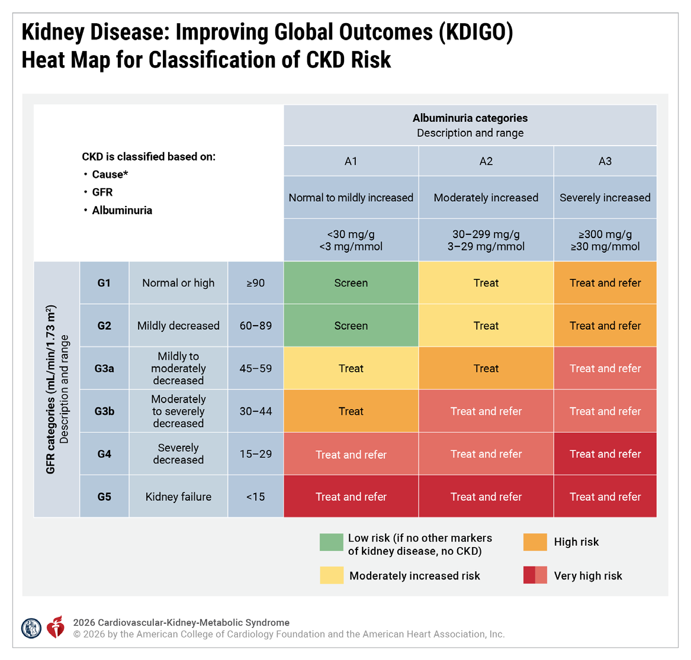

📄 [Abrir o PDF original](https://cdn.jsdelivr.net/gh/muriloffs/cardiology-agent@main/study-inbox/processados/ndumele-et-al-2026-2026-aha-acc-ada-asn-guideline-for-the-prevention-detection-evaluation-and-management-of.pdf)

# Diretriz 2026 AHA/ACC/ADA/ASN — Síndrome Cardiovascular-Renal-Metabólica (CKM)

> 🎓 **Aprofunde:** Esta é a primeira diretriz formal a unificar o conceito de **síndrome cardiovascular-renal-metabólica (CKM)** — um construto introduzido pela AHA em 2023 (Ndumele et al, *Circulation*. 2023;148:1606–1635). Ela aposenta e substitui a "2013 AHA/ACC/TOS Guideline for the Management of Overweight and Obesity in Adults" e expande muito além da obesidade, integrando fatores de risco metabólicos, doença renal crônica (DRC) e doença cardiovascular (DCV) em um único modelo estadiado. O que você precisa dominar primeiro: o conceito de que essas três famílias de doença são **interconectadas e potencializam mutuamente o risco**, e que o cuidado siloado por subespecialidade é justamente o que se quer abolir.

## Objetivo, Métodos e Estrutura

O público-alvo primário são clínicos que cuidam de pacientes ao longo de todo o espectro da CKM, condição inter-relacionada caracterizada pelas conexões entre fatores de risco metabólicos (incluindo obesidade e diabetes tipo 2 [DM2]), doença renal crônica (DRC) e doença cardiovascular (DCV).

A busca bibliográfica abrangente foi conduzida de 29 de outubro de 2024 a 14 de abril de 2025, identificando estudos clínicos, revisões sistemáticas, metanálises e outras evidências em humanos publicadas desde 2015, em inglês, no MEDLINE (via PubMed), EMBASE, Cochrane Library, Agency for Healthcare Research and Quality e outras bases selecionadas relevantes. Estudos-chave selecionados publicados até novembro de 2025 foram acrescentados pelo comitê quando apropriado.

O foco é criar um documento vivo e funcional com conhecimento atual em CKM, voltado a cardiologistas, endocrinologistas, nefrologistas, e clínicos de atenção primária e especialidade que manejam esses pacientes.

As recomendações clínicas destinam-se a adultos (≥18 anos); recomendações para jovens (<18 anos) são previstas como foco de documentos futuros. A diretriz enfatiza modelos de cuidado interdisciplinar para entregar cuidado centrado no paciente e harmonizado, além da importância de abordar determinantes sociais da saúde (SDOH) adversos para o manejo holístico. Há ênfase em modificação do estilo de vida e manejo do peso para atacar a causa-raiz da CKM: a adiposidade excessiva e disfuncional. Para estágios mais tardios, fornece orientação sobre uso de terapias cardio e renoprotetoras com benefício comprovado e incorpora atualizações na predição de risco cardiovascular. A diretriz também fornece declarações sobre o custo-valor de várias terapias indicadas para CKM, com foco em medicamentos de marca — essas declarações ficam próximas às recomendações clínicas relacionadas, mas **não** se destinam a informar decisão clínica individual.

> 🎓 **Aprofunde:** Atenção ao estatuto das **declarações de custo-valor (economic value statements)**: elas existem para decisões de população e sistema de saúde, NÃO para decidir tratamento de um paciente específico. A metodologia está no AHA/ACC Statement on Cost Value Methodology (Kazi DS et al, *Circulation*. 2025;152:e332–e358). O limiar de custo-efetividade usado pela ACC/AHA ao longo do documento é **US$ 120.000 por QALY ganho** — guarde esse número, ele aparece repetidamente.

## Top Take-Home Messages (10 mensagens centrais)

1. **Estadiamento da CKM:** o estadiamento da CKM é recomendado para jovens e adultos para prevenir progressão de estágio, ajustar a terapia ao risco absoluto, reduzir eventos cardiovasculares e perda de função renal ao longo da vida, e promover regressão de estágio por meio de mudanças de estilo de vida e perda de peso.
2. **Quantifique o risco com as equações PREVENT:** indivíduos em risco de DCV (estágios CKM 0–3) devem ter o risco quantificado com as equações PREVENT (Predicting Risk of Cardiovascular Disease EVENTS) para estimar risco em 10 e 30 anos de DCV aterosclerótica (ASCVD), insuficiência cardíaca (IC) e DCV total. Risco de DCV em 10 anos ≥20% é um dos critérios para CKM estágio 3. Risco de DCV em 10 anos ≥7,5% informa a priorização de farmacoterapias.
3. **Avalie rotineiramente fatores de risco CKM:** avaliações rotineiras de fatores de risco metabólicos e função renal são recomendadas em todos os adultos, bem como avaliações seletivas para pré-IC, doença hepática esteatótica associada a disfunção metabólica (MASLD) e apneia obstrutiva do sono (AOS) em subgrupos.
4. **Avalie e aborde os SDOH:** avaliações rotineiras de SDOH ligados ao desenvolvimento de CKM e suas complicações são recomendadas. Abordar SDOH adversos identificados é componente central do cuidado holístico.
5. **Cuidado interdisciplinar com uma pessoa-âncora (point person):** uso de modelos interdisciplinares para sobreposição de DM2, DRC e DCV é recomendado para facilitar o cuidado centrado no paciente. Enfatiza-se uma pessoa-âncora de coordenação CKM para coordenar a equipe, facilitar a implementação da terapia médica baseada em evidências (GDMT) e apoiar pacientes e clínicos.
6. **Avalie e trate sobrepeso e obesidade:** avaliações com IMC E circunferência abdominal são recomendadas. Sobrepeso e obesidade devem ser tratados para prevenir progressão e promover regressão da CKM. Ênfase no suporte à mudança de estilo de vida, com uso adjuvante de farmacoterapias da obesidade e cirurgia metabólica/bariátrica conforme necessário.
7. **Use antihiperglicemiantes cardioprotetores no diabetes:** em pacientes com DM2 com DCV ou risco aumentado, além de estilo de vida, manejo do peso e controle de fatores de risco, recomenda-se GDMT antihiperglicemiante cardioprotetora — inibidores de SGLT2 (SGLT2i), terapia baseada em GLP-1, ou ambos — para melhorar desfechos cardiovasculares e renais. A escolha do agente é guiada por comorbidades (DRC, ASCVD, IC, obesidade, hiperglicemia grave, MASLD).
8. **Avalie DRC e use agentes renoprotetores:** uso de TFGe E relação albumina-creatinina urinária (UACR) é recomendado para caracterizar DRC e guiar agentes renoprotetores que conferem benefício cardiovascular e renal. Em DRC com DM2 ou DRC com albuminúria, inibidores do sistema renina-angiotensina (RASi) e SGLT2i devem ser primeira linha. Se a albuminúria persistir em DRC com DM2, deve-se adicionar antagonista não esteroidal do receptor mineralocorticoide (nsMRA) ou terapia baseada em GLP-1.
9. **Aborde fatores de risco CKM em pacientes com ASCVD:** o manejo da ASCVD deve enfatizar comorbidades CKM, incluindo tratamento da obesidade (estilo de vida, farmacoterapia e cirurgia metabólica/bariátrica quando apropriado), uso de antihiperglicemiantes cardioprotetores no DM2 e agentes renoprotetores na DRC.
10. **Aborde fatores de risco CKM em pacientes com IC:** para ICFEr (FE reduzida), enfatizar benefícios cardiovasculares e renais de RASi (ARNI, IECA, BRA) e SGLT2i como parte da terapia quádrupla com betabloqueadores e MRA esteroidais. Para ICFEmr/ICFEp, usar SGLT2i como GDMT de primeira linha, adicionar terapia baseada em GLP-1 em obesos ou outros fatores de risco CKM e considerar nsMRA em DM2 + DRC.

> 🎓 **Aprofunde:** Memorize os **dois limiares de PREVENT que governam toda a diretriz**: ≥20% em 10 anos = critério de estágio 3 (equivalente de risco a DCV subclínica); ≥7,5% em 10 anos = limiar para priorizar farmacoterapia (SGLT2i/GLP-1 no DM2; também anti-hipertensivo na HAS estágio 1 pela diretriz de PA 2025). E note a divisão de trabalho mecanística: **SGLT2i → impacto preferencial em IC/hospitalização por IC e proteção renal; GLP-1 → impacto preferencial em eventos ateroscleróticos (IAM, AVC) e peso**.

## Preâmbulo

Desde 1980 a ACC e a AHA traduzem evidência científica em diretrizes de prática clínica. Quando aplicável, fornecem declarações de valor econômico aplicando análises de custo-efetividade. As diretrizes definem práticas que atendem à maioria, mas não a todas as circunstâncias, e não substituem o julgamento clínico. ACC e AHA patrocinam o desenvolvimento sem apoio comercial; membros são voluntários.

## 1. Introdução

O comitê de redação incluiu representação de cardiologia geral, preventiva e intervencionista, endocrinologia, nefrologia, cirurgia bariátrica, medicina de família, clínica médica, pediatria, gastroenterologia, epidemiologia cardiovascular, economia da saúde, enfermagem de prática avançada e farmacologia clínica, além de defensores de pacientes (patient advocates). Houve representação da AHA, ACC, ADA (incluindo ADA Obesity Alliance) e da American Society of Nephrology.

A Classe de Recomendação (COR) indica a força da recomendação e abrange o benefício estimado em proporção ao risco. O Nível de Evidência (LOE) avalia a qualidade da evidência científica.

> 🎓 **Aprofunde:** Releia rapidamente a lógica COR/LOE: **Classe 1 (forte)** = benefício >>> risco ("é recomendado"); **2a (moderada)** = benefício >> risco ("é razoável"); **2b (fraca)** = benefício ≥ risco ("pode ser considerado"); **3 Sem Benefício** = benefício = risco; **3 Dano** = risco > benefício ("potencialmente perigoso"). LOE B-R = aleatorizado de qualidade moderada; B-NR = não aleatorizado/observacional de qualidade moderada; C-LD = dados limitados; C-EO = opinião de especialista. Saber a COR/LOE de cada recomendação é parte central de dominar a diretriz.

## Tabela 1 — Publicações AHA/ACC associadas (recurso, evita repetir recomendações)

| Tema | Organização | Ano (ref.) |
|---|---|---|
| Prevenção primária de DCV | ACC/AHA | 2019 |
| Prevenção de AVC em pacientes com AVC/AIT | AHA/ASA | 2021 |
| Manejo da IC | AHA/ACC/HFSA | 2022 |
| Manejo da doença coronariana crônica (CCD) | AHA/ACC/ACCP/ASPC/NLA/PCNA | 2023 |
| Manejo da fibrilação atrial (FA) | ACC/AHA/ACCP/HRS | 2023 |
| Manejo da DAP de membros inferiores | ACC/AHA/multisociedade | 2024 |
| Prevenção/detecção/avaliação/manejo da HAS | AHA/ACC/multisociedade | 2025 |
| Manejo da dislipidemia | ACC/AHA/multisociedade | 2026 |

Documentos relevantes adicionais incluem: Obesidade e DCV (AHA 2021), AOS e DCV (AHA 2021), Life's Essential 8 (AHA 2022), Doença hepática gordurosa não alcoólica e risco cardiovascular (AHA 2022), Saúde CKM (AHA 2023), Equações de predição incorporando saúde CKM (AHA 2023), Manejo da obesidade em adultos com IC (ACC 2025), Risk-based primary prevention of HF (AHA 2025) e Papel da atividade física no tratamento da obesidade (AHA 2026).

## 2. Definições e Classificação

### 2.1. Definições

A CKM é uma síndrome clínica com estágios de 1 a 4 (explicados na Seção 2.3).

**GDMT (terapia médica baseada em evidências):** engloba avaliação clínica, testes diagnósticos e tratamentos farmacológicos e procedurais. Confirmar dose com a bula, avaliar contraindicações e interações. Recomendações limitadas a drogas/dispositivos/tratamentos aprovados nos EUA.

Definições das condições que compõem a CKM:
- **ASCVD clínica:** história de síndromes coronarianas agudas, IAM, angina estável/instável, revascularização coronariana ou arterial, AVC, AIT ou DAP.
- **IC clínica:** IC com sintomatologia clínica incluindo ICFEr, ICFEmr e ICFEp.
- **DM2:** distúrbio metabólico complexo caracterizado por resistência à ação da insulina e comprometimento progressivo da secreção de insulina, levando à hiperglicemia.
- **Obesidade:** excesso de gordura corporal que apresenta risco à saúde, diagnosticada por IMC ≥30 kg/m². Obesidade abdominal: circunferência abdominal ≥88 cm em mulheres ou ≥102 cm em homens.
- **DRC:** filtração glomerular persistentemente reduzida (TFGe <60 mL/min/1,73 m²) OU evidência de albuminúria (UACR ≥30 mg/g) em ao menos 2 medições com 3 meses de intervalo.
- **Hipertensão:** PA sistólica ≥130 mm Hg ou diastólica ≥80 mm Hg com base na média de ≥2 leituras cuidadosas em ≥2 ocasiões.
- **Falência renal (Kidney Failure):** TFGe cronicamente <15 mL/min/1,73 m² (DRC estágio 5) ou necessidade crônica de terapia de substituição renal (diálise). Antigamente chamada de "doença renal terminal/end-stage".
- **Pré-diabetes:** glicemia de jejum 100–125 mg/dL, intolerância à glicose (glicose de 2h 140–199 mg/dL em TOTG de 75 g) ou HbA1c 5,7%–6,4%.
- **Pré-IC:** doença miocárdica subclínica (anormalidades estruturais/funcionais, evidência de aumento de pressão de enchimento ou biomarcadores cardíacos elevados) na ausência de sintomatologia clínica de IC.
- **MASLD:** esteatose hepática no contexto de fatores de risco metabólicos (obesidade ou DM2); definida recentemente para substituir a doença hepática gordurosa não alcoólica.

Definições de terapias usadas na CKM:
- **Terapia baseada em GLP-1 com benefício comprovado:** agentes que mimetizam/potencializam a atividade da incretina GLP-1, sozinhos ou como agonista duplo que também mimetiza o GIP (polipeptídeo insulinotrópico dependente de glicose), com evidência de redução de risco em ensaios de desfecho cardiovascular. Também chamadas de terapias "baseadas em incretina".
- **RASi:** classe que inibe o sistema renina-angiotensina, incluindo IECA e BRA — reduz PA, proteinúria e progressão de DCV e renal.
- **RAASi:** representa os RASi (IECA, BRA) E inclui inibidores do sistema da aldosterona (MRAs).
- **Cirurgia metabólica e bariátrica (MBS):** grupo de procedimentos (bypass gástrico, gastrectomia em sleeve) para induzir perda de peso e melhorar saúde metabólica alterando a anatomia/fisiologia gastrointestinal.
- **Manejo do estilo de vida:** avaliação dos hábitos basais e aconselhamento/suporte a modificações saudáveis — alimentação cardiossaudável, atividade física regular, evitar todos os produtos de nicotina, sono saudável e manutenção de peso saudável; inclui os elementos do Life's Essential 8 da AHA, além de manejo do estresse.

**Risk Enhancers (intensificadores de risco) para progressão da CKM:** fatores clínicos (ex.: condições inflamatórias crônicas, história de desfechos adversos da gravidez [APOs]), sociais, demográficos ou história familiar de diabetes/falência renal, associados a maior risco de progressão da CKM. Muitos se sobrepõem aos da diretriz de dislipidemia 2026, mas há fatores distintos para os 2 desfechos (progressão da CKM versus ASCVD).

> 🎓 **Aprofunde:** Note duas sutilezas que cobram nuance: (1) a definição de **hipertensão é ≥130/≥80** (alinhada à diretriz de PA 2025), não 140/90; (2) **albuminúria isolada (UACR ≥30 mg/g) já define DRC** mesmo com TFGe normal — por isso a diretriz insiste no rastreio DUPLO (TFGe + UACR). E perceba que os "risk enhancers para progressão da CKM" são um construto NOVO e distinto dos enhancers de ASCVD — o desfecho de interesse é progressão de estágio, não apenas evento aterosclerótico.

### 2.2. Abreviações (principais)

ACEi (IECA), ARB (BRA), ARNI (inibidor do receptor de angiotensina-neprilisina), ASCVD (DCV aterosclerótica), BNP/NT-proBNP (peptídeos natriuréticos), CAC (escore de cálcio coronariano), CKD (DRC), CKM (cardiovascular-renal-metabólica), DOAC (anticoagulante oral direto), eGFR (TFGe), GDM (diabetes mellitus gestacional), GDMT (terapia médica baseada em evidências), GIP, GLP-1, GLP-RA, HbA1c, HFmrEF (ICFEmr), HFpEF (ICFEp), HFrEF (ICFEr), hs (alta sensibilidade), ICER (razão custo-efetividade incremental), LDL-C, LSG (gastrectomia laparoscópica em sleeve), LVEF (FEVE), MACE, MASLD, MBS, MRA, nsMRA, OSA (AOS), PAD (DAP), PREVENT, QALY, RAASi, RASi, RYGB (bypass gástrico em Y de Roux), SDOH, SGLT2i, T2D (DM2), UACR, VKA (antagonista da vitamina K), VTE (TEV).

### 2.3. Definição e Estágios da CKM

A definição (Tabela 3) reflete as interconexões substanciais entre fatores de risco metabólicos, DRC e DCV, e seus impactos sinérgicos sobre morbidade e mortalidade. Serve como ponto de partida para definir/descrever estágios, desenvolver ferramentas de rastreio e estratificação de risco, e identificar melhores práticas. O construto sustenta a abolição do cuidado siloado, a importância do rastreio em atenção primária e subespecialidades, e o valor da colaboração interdisciplinar. Reconhece os papéis integrais dos SDOH e do estilo de vida na promoção e preservação da saúde CKM ao longo da vida.

**Tabela 3 — Definição de CKM**

| Tipo | Definição |
|---|---|
| Formal | Distúrbio sistêmico caracterizado por interações fisiopatológicas entre fatores de risco metabólicos, DRC e sistema cardiovascular, levando a disfunção multiorgânica e alta taxa de desfechos cardiovasculares adversos. Inclui indivíduos em risco de DCV (por fatores metabólicos, DRC ou ambos) E indivíduos com DRC/DCV potencialmente relacionada a/complicada por fatores metabólicos. A probabilidade aumenta com condições desfavoráveis de estilo de vida e autocuidado resultantes de políticas, economia e ambiente. |
| Simplificada | Distúrbio de saúde devido às conexões entre doença cardíaca, doença renal, diabetes e obesidade, levando a maus desfechos de saúde. |

A detecção oportuna das condições CKM com consequências clínicas adversas é importante oportunidade preventiva de saúde pública, especialmente dada a disponibilidade de múltiplas terapias eficazes. Os estágios refletem a progressão fisiopatológica típica: adiposidade excessiva/disfuncional (estágio 1) → fatores de risco metabólicos, DRC ou ambos (estágio 2) → DCV subclínica, ou os equivalentes de risco de DRC de muito alto risco ou alto risco previsto de DCV (estágio 3) → DCV clínica com fatores de risco CKM concomitantes (estágio 4). Estilo de vida saudável e manejo do peso são os maiores deterrentes da progressão. A DCV é foco primário por ter maior incidência e carga de mortalidade; mas a DRC também é foco-chave, com risco progressivamente maior pela classificação de risco KDIGO correspondendo a estágios CKM mais tardios.

![Figura 1 — Estágios da CKM (0 a 4), mostrando progressão fisiopatológica e risco absoluto crescente de DCV; estágio 0 = sem fatores de risco/foco em prevenção primordial; estágio 1 = adiposidade excessiva/disfuncional (sobrepeso/obesidade, obesidade abdominal, pré-diabetes); estágio 2 = fatores metabólicos (hipertrigliceridemia, HAS, síndrome metabólica, DM2), DRC moderado-alto risco; estágio 3 = DCV subclínica (ateromatose subclínica, pré-IC) ou equivalentes de risco (DRC muito alto risco G4-G5/KDIGO; risco ≥20% em 10 anos por PREVENT-CVD); estágio 4 = DCV clínica (DAC, IC, AVC, DAP, FA)](fig-2.png)

#### 2.3.1. Componentes dos estágios CKM em jovens

Fatores de risco metabólicos e DRC emergem cada vez mais em jovens (<18 anos) e frequentemente persistem/progridem na vida adulta. Por isso o estadiamento CKM é indicado ao longo de toda a vida. Definições de valores anormais têm limiares pediátricos específicos. Por mudanças de crescimento, usam-se **percentis de IMC** para diagnosticar sobrepeso/obesidade (em vez dos valores fixos de adultos), com limiares por percentil também para obesidade classe 2 e 3. Para PA: crianças <13 anos são classificadas por percentis de PA; 13–17 anos pelos mesmos limiares de adultos. Por dados insuficientes ligando PA infantil a desfechos cardiovasculares adultos, a hipertensão é definida pela distribuição normativa em crianças saudáveis; como em adolescentes o percentil correspondente às vezes é maior que os limiares adultos, adotaram-se os limiares adultos em adolescentes para facilitar implementação. Painel lipídico em jejum é preferido, mas amostra não-jejum pode ser usada. Definições de glicose anormal alinham-se aos critérios adultos.

**Tabela 5 — Critérios diagnósticos em jovens (<18 anos)**

| Fator | Critérios |
|---|---|
| Sobrepeso/Obesidade | Sobrepeso: IMC ≥p85 a <p95. Obesidade: IMC ≥p95. Obesidade grave: ≥120% do p95. Classe 2: ≥120% a <140% do p95 ou IMC 35 a <40 (o menor). Classe 3: ≥140% do p95 ou IMC ≥40 (o menor) |
| PA <13 anos | Normal: <p90. Elevada: ≥p90 a <p95 ou 120/80 a <p95 (o menor). HAS estágio 1: ≥p95 a <p95+12 mm Hg, ou 130/80 a 139/89 (o menor). HAS estágio 2: ≥p95+12 mm Hg, ou ≥140/90 (o menor) |
| PA ≥13 anos | Normal <120/<80; Elevada 120 a 129/<80; HAS estágio 1: 130/80 a 139/89; HAS estágio 2: ≥140/90 |
| Dislipidemia (jejum) | CT ≥200; HDL-C <40; LDL-C ≥130; TG 0–9 anos ≥100, 10–19 anos ≥130; não-HDL-C ≥145. Não-jejum: não-HDL-C ≥145, HDL-C <40 |
| Glicose anormal | Pré-diabetes: glicemia jejum 100–125 OU HbA1c 5,7–6,4% OU glicose 2h TOTG 140–199. Diabetes: glicemia jejum ≥126 OU HbA1c ≥6,5% OU glicose 2h ≥200 OU glicose aleatória ≥200 com sintomas/crise hiperglicêmica |

## 3. Avaliação e Diagnóstico

### 3.1. Abordagem diagnóstica ao estadiamento CKM

**Recomendações — Abordagem diagnóstica ao estadiamento**

| # | Recomendação | COR | LOE |
|---|---|---|---|
| 1 | Em jovens (<18 a) e adultos (≥18 a), o estadiamento CKM deve ser realizado avaliando fatores de risco metabólicos, função renal (calcular TFGe, com UACR adicional em estágio ≥2) e status de DCV, para prevenir progressão, promover regressão e personalizar o tratamento conforme risco absoluto e benefício líquido esperado das terapias | 1 | B-NR |
| 2 | Em adultos com risco intermediário de ASCVD em 10 anos (PREVENT-ASCVD 5% a <10%) ou risco borderline selecionado (3% a <5%) onde a decisão sobre terapia preventiva permanece incerta, a presença de aterosclerose coronariana subclínica identificada por CAC pode ser benéfica para informar a prevenção ótima | 2a | B-NR |
| 3 | Em adultos com risco previsto de IC em 10 anos aumentado (PREVENT-HF ≥5%), avaliação para pré-IC com biomarcadores cardíacos (peptídeos natriuréticos [BNP, NT-proBNP], troponina cardíaca de alta sensibilidade [hs-cTn]) pode ser benéfica para guiar testes adicionais (ex.: imagem cardíaca) e cuidado coordenado para prevenção ótima de IC | 2a | B-NR |

O diagnóstico exige avaliação da saúde metabólica, função renal e fatores de risco cardiovasculares, aumentando a identificação de condições frequentemente não reconhecidas ou assintomáticas. O estadiamento deve ser feito com o paciente clinicamente estável, tanto para acurácia quanto para repetibilidade no acompanhamento. Avaliações antropométricas idealmente incluem circunferência abdominal além do IMC, dado o papel central da adiposidade abdominal. Outras medidas diretas de gordura corporal, quando disponíveis, podem caracterizar melhor o risco. A medição de UACR além da TFGe, para caracterizar plenamente a DRC e o risco cardiovascular associado, é aconselhada nos estágios 2 a 4, pela maior prevalência observada de UACR anormal quando já há fatores metabólicos ou DRC. A identificação de DCV subclínica (estágio 3) — aterosclerose coronariana subclínica ou pré-IC — pode influenciar o manejo por reclassificação de risco e prognosticação aprimorada.

**Texto de suporte:**
1. O estadiamento (Tabela 4) permite identificar/tratar conforme o risco absoluto e o benefício esperado. Estudos intervencionais sugerem que detecção e intervenção mais precoces se associam a maior benefício. Um estudo longitudinal de 10 anos no Reino Unido avaliou um programa de rastreio (medindo e registrando os principais riscos de DCV; indivíduos de alto risco recebiam orientação padronizada de promoção de saúde): o rastreio associou-se a melhores níveis de fatores de risco (PA e colesterol) e comportamentos. Um estudo de modelagem multicoorte mostrou que medir preditores clínicos de DCV (como os usados no estadiamento CKM) estimou prognóstico individual e efeitos de tratamento em termos de risco em 10 anos, risco vitalício e expectativa de vida livre de DCV. A avaliação de fatores de risco habilita a quantificação do risco em 10 e 30 anos de ASCVD, IC e DCV total pelo PREVENT.
2. O CAC melhora a predição de ASCVD e a seleção de pacientes para modificação agressiva de fatores de risco (ex.: estatina). Dados do MESA mostraram que o CAC se associa fortemente ao risco em 10 anos de ASCVD incidente, independente de fatores de risco padrão e de forma semelhante entre grupos demográficos. Os escores de CAC demonstram aumento logarítmico do risco, sem platô claro: indivíduos com CAC ≥1000 têm risco maior de DCV e mortalidade total do que aqueles com 400–999. O ensaio CorCal randomizou 601 pacientes de prevenção primária para CAC (n=302) ou orientação por calculadora de risco (n=299): o braço CAC teve maior reclassificação de risco, e em 1 ano teve melhor aderência à estatina, menor LDL-C e custos similares ou reduzidos. Dado o impacto na reclassificação, o CAC pode ser considerado conforme a diretriz de dislipidemia 2026 em indivíduos com risco borderline-intermediário (PREVENT-ASCVD 3% a 10%) quando há incerteza sobre terapia preventiva.
3. Elevações de biomarcadores cardíacos (BNP, NT-proBNP ou hs-cTn) ou anormalidades estruturais/funcionais à imagem (ex.: ecocardiografia) identificam pré-IC, com a coocorrência dos dois indicando maior risco absoluto. O ensaio STOP-HF (em pacientes ≥40 anos com ≥1 fator de risco de DCV) demonstrou que testar BNP, com ecocardiografia reflexa e encaminhamento para cuidado coordenado naqueles com BNP ≥50 pg/mL, associou-se a ~45% menor chance de desenvolver disfunção ventricular esquerda ou IC. Aumento atrial esquerdo, hipertrofia ventricular esquerda, strain longitudinal global anormal e E/e' elevado são preditores independentes de IC incidente. Quando o diagnóstico de pré-IC não é conhecido, um risco PREVENT-HF em 10 anos ≥5% pode ser considerado para testagem seletiva de biomarcadores cardíacos, dado o risco semelhante de 3% a 5% de IC incidente em 10 anos associado a biomarcadores elevados em coortes comunitárias. Evidências também apoiam testagem por idade e fatores de risco CKM (ex.: idade ≥40 anos e ≥1 fator de risco, como no STOP-HF), mas com menor rendimento do que uma estratégia guiada por medida integrada (PREVENT-HF). O valor prognóstico incremental da testagem de biomarcadores em indivíduos com DRC avançada ou ASCVD é incerto, dada a altíssima prevalência de biomarcadores elevados nesses subgrupos.

**Tabela 4 — Definições e critérios diagnósticos de estadiamento CKM em adultos**

| Estágio | Critérios |
|---|---|
| 0: Sem fatores de risco CKM | IMC e circunferência abdominal normais, normoglicemia, normotensão, perfil lipídico normal e sem evidência de DRC ou DCV subclínica/clínica |
| 1: Adiposidade excessiva ou disfuncional | Sobrepeso/obesidade, obesidade abdominal ou tecido adiposo disfuncional, sem outros fatores metabólicos ou DRC. IMC ≥25 (ou ≥23 se ascendência asiática); circunferência ≥88/102 cm mulher/homem (ou ≥80/90 se asiático); OU glicemia jejum 100–125 mg/dL ou HbA1c 5,7–6,4%* |
| 2: Fatores metabólicos, DRC ou ambos | HAS (PAS ≥130, PAD ≥80 ou uso de anti-hipertensivos); hipertrigliceridemia (≥150 mg/dL); síndrome metabólica (critérios AHA/NHLBI)†; DM2 (glicemia jejum ≥126 ou HbA1c ≥6,5%); e/ou DRC de risco moderado-alto pela classificação KDIGO |
| 3: DCV subclínica em CKM | DCV subclínica (aterosclerose coronariana subclínica ou pré-IC) com adiposidade/outros fatores/DRC; OU equivalente de risco. Aterosclerose subclínica: principalmente CAC com Agatston ≥100 (CAC incidental moderado-grave, ateromatose por cateterismo/angio-TC, ou índice tornozelo-braço baixo sem claudicação também atendem). Pré-IC: biomarcadores elevados (NT-proBNP ≥125 pg/mL; hs-cTnT ≥14 ng/L mulher e ≥22 ng/L homem; hs-cTnI ≥10 ng/L mulher e ≥12 ng/L homem) OU parâmetros ecocardiográficos (combinação dos 2 = maior risco). Equivalentes de risco: DRC muito alto risco (G4-G5 ou muito alto risco KDIGO); risco DCV em 10 anos ≥20% por PREVENT-CVD |
| 4: DCV clínica em CKM | DCV clínica (DAC, IC, AVC, DAP, FA) com adiposidade/outros fatores/DRC. 4a: sem falência renal. 4b: falência renal (TFGe <15 ou necessidade de terapia de substituição renal crônica) |

*Indivíduos com diabetes gestacional devem receber rastreio intensificado de pré-diabetes pós-gravidez. †Síndrome metabólica: ≥3 de: circunferência ≥88 cm mulher/≥102 cm homem (≥80/≥90 se asiático); HDL-C <40 homem/<50 mulher; TG ≥150; PA elevada (PAS ≥130 ou PAD ≥80 e/ou anti-hipertensivos); glicemia jejum ≥100.

> 🎓 **Aprofunde:** Domine os **cortes de biomarcadores de pré-IC** (Tabela 4 e Tabela 16) — eles são cobrados com nuance (NT-proBNP ≥125; hs-cTnT 14/22; hs-cTnI 10/12). E note a hierarquia diagnóstica do estágio 3: ele inclui tanto **DCV subclínica de fato** (CAC ≥100 ou pré-IC) quanto **equivalentes de risco** (DRC G4-G5/muito alto risco KDIGO, ou PREVENT-CVD ≥20%). O limiar de CAC ≥100 (Agatston) é escolhido por marcar alto risco absoluto com impacto terapêutico. Referência-chave do PREVENT: Khan SS et al, *Circulation*. 2024;149:430–449 (desenvolvimento/validação).

### 3.1.1. Avaliação diagnóstica longitudinal para todos os estágios CKM

**Recomendações — Avaliação longitudinal**

| # | Recomendação | COR | LOE |
|---|---|---|---|
| 1 | Em todos os adultos com ou em risco de CKM, recomenda-se medir IMC e circunferência abdominal ao menos anualmente para identificar risco de progressão | 1 | B-NR |
| 2 | Em adultos sem CKM (estágio 0), recomenda-se avaliar lipídios, glicemia e função renal (TFGe) ao menos a cada 5 anos e PA ao menos anualmente, para identificação oportuna de fatores de risco CKM | 1 | B-NR |
| 3 | Em adultos com estágio 1, recomenda-se avaliar lipídios, glicemia e função renal (TFGe) ao menos a cada 2 a 3 anos e PA ao menos anualmente | 1 | B-NR |
| 4 | Em adultos em estágio 2 e acima, recomenda-se avaliar lipídios, glicemia e PA ao menos anualmente | 1 | B-NR |
| 5 | Em adultos em estágio 2 e acima, avaliações de TFGe E UACR são recomendadas ao menos anualmente para caracterizar risco de DRC e guiar prevenção/manejo de DCV e renal | 1 | B-NR |

O monitoramento longitudinal é importante para informar sobre início/progressão da CKM. Identificação mais precoce de fatores de risco e início oportuno de terapias (diabetes, HAS, dislipidemias, DRC) associam-se a melhores desfechos. O tecido adiposo excessivo/disfuncional, particularmente a adiposidade visceral, está na raiz da CKM, e o excesso de adiposidade é fator de risco modificável em todos os estágios. Por isso, IMC e circunferência abdominal devem ser avaliados anualmente. A frequência das demais avaliações depende do estágio (Figura 3), aumentando para estágios mais altos. Para estágio ≥2, a avaliação anual deve incluir TFGe E UACR — juntos, são necessários para diagnosticar adequadamente a DRC e têm implicações prognósticas e terapêuticas complementares.

**Texto de suporte:**
1. Tratar sobrepeso/obesidade é central, pois a adiposidade excessiva/disfuncional é o principal motor de fatores metabólicos e DRC, com risco cardiovascular subsequente. A adiposidade visceral contribui para inflamação e resistência à insulina, com patologia multissistêmica. Evitar ganho de peso com o envelhecimento associa-se a menor chance de desenvolver fatores metabólicos. Rastreio anual de sobrepeso (IMC ≥25 a <30) e obesidade (IMC ≥30) é apoiado por múltiplas diretrizes. Em alguns subgrupos (ex.: asiático-americanos), sugere-se corte de IMC ≥23 por maior risco metabólico em pesos relativamente baixos. O IMC é limitado por não refletir composição corporal, particularmente obesidade abdominal. Usar IMC E circunferência fornece informação prognóstica complementar. A relação cintura-quadril caracteriza melhor o risco do que a circunferência, mas a complexidade de medida e a falta de padronização a tornam menos ideal na clínica.
2. A emergência de HAS e elevações de biomarcadores como TG e glicose são indicadores críticos. Prevenir o desenvolvimento de HAS reduz mais o risco do que tratar HAS já existente. PA idealmente checada a cada visita, com alvo <130/80 mmHg para a maioria. TG altos e HDL-C baixo são marcadores de resistência à insulina, com TG tendo potencial impacto causal na DCV aterosclerótica. Avaliações de pré-diabetes/diabetes (glicemia de jejum, HbA1c, TOTG) são críticas pela forte associação da hiperglicemia com doença cardiovascular e renal. Em indivíduos com peso normal, a hiperglicemia se desenvolve mais comumente em não-brancos, então avaliações sistemáticas em todos os adultos, independentemente do IMC, podem promover identificação mais equitativa.
3. Indivíduos com estágio 1 por sobrepeso/obesidade têm maior risco de desenvolver fatores metabólicos e DRC. Mesmo na ausência desses fatores, o excesso de peso associa-se a maior risco cardiovascular, particularmente IC. Estudos de "obesidade metabolicamente saudável" mostraram que, em 4 a 5 anos, ~30% a 45% desenvolvem síndrome metabólica ou diabetes. Pela alta incidência de diabetes a curto prazo, grandes sociedades e o USPSTF recomendam avaliação de síndrome metabólica e diabetes a cada 3 anos nos que têm excesso de peso. Entre adultos com pré-diabetes, o risco de diabetes incidente é muito alto, indicando vigilância anual. Vigilância intensificada também em diabetes gestacional prévio. Por isso, avaliações em estágio 1 devem ocorrer ao menos a cada 2 a 3 anos.
4. A presença de fatores metabólicos (excesso de peso, circunferência alta, PA alta, TG altos, HDL-C baixo e hiperglicemia) associa-se a maior risco de DCV, com dados experimentais/genéticos/intervencionais apoiando associação causal para todos exceto HDL-C baixo. A identificação de síndrome metabólica indica maior risco e maior chance de anormalidades fisiopatológicas adicionais (inflamação sistêmica, maior número de partículas LDL, protrombose, disfunção endotelial). Em diabéticos, a glicemia deve ser avaliada com HbA1c (controle dos últimos 2–3 meses). Avaliações anuais em estágio 2 apoiam intensificação precoce de estilo de vida e farmacoterapia.
5. O diagnóstico de DRC inclui TFGe E UACR (DRC = TFGe <60 crônica OU UACR ≥30). A maioria dos indivíduos com DRC desconhece o diagnóstico. A maioria da DRC é atribuível a DM2 e HAS. A albuminúria informa a abordagem terapêutica. Pelo heat map KDIGO (Figura 2), TFGe e UACR fornecem informação complementar e aditiva sobre risco. A TFGe com creatinina E cistatina C tem melhor acurácia que cada marcador isolado, mas a disponibilidade da cistatina C é limitada. Em DRC avançada, avaliações mais frequentes (a cada 3 a 6 meses) podem ser consideradas.

### 3.2. Avaliação de determinantes sociais da saúde (SDOH)

**Recomendações — SDOH**

| # | Recomendação | COR | LOE |
|---|---|---|---|
| 1 | Em adultos com ou em risco de CKM (≥18 a), rastreio rotineiro com ferramenta validada (Tabela 6) para avaliar SDOH é recomendado para informar cuidado centrado no paciente | 1 | B-NR |
| 2 | Em jovens com ou em risco de CKM (<18 a), rastreio rotineiro dos cuidadores com ferramenta validada (Tabela 7) é recomendado | 1 | B-NR |

Os SDOH (fatores de risco não médicos que impactam risco de doença e desfechos) têm papel crítico na saúde CKM ao longo da vida. SDOH adversos em múltiplos níveis impactam comportamentos de saúde. Em jovens, promovem adversidade precoce em períodos críticos de desenvolvimento, afetando saúde cardiovascular na vida adulta. Também modificam vias biológicas que promovem risco cardiometabólico. Por esses mecanismos, levam ao desenvolvimento de fatores de risco CKM. SDOH adversos também prejudicam autocuidado e engajamento com o sistema de saúde, com consequências sobre mortalidade cardiovascular e total e contribuição para disparidades. A importância dos SDOH é refletida pela inclusão do índice de privação social (medida baseada em local) na equação PREVENT. Medicare e Medicaid reembolsam avaliação de SDOH a cada 6 meses em ambulatório e anualmente em internação; avaliar a cada visita pode apoiar melhor a prevenção/manejo.

**Texto de suporte:**
1. Para adultos, o rastreio de SDOH e necessidades sociais relacionadas pode ser integrado à atenção, identificando fatores não médicos a serem abordados. Ferramentas variam, mas domínios essenciais incluem estresse financeiro, insegurança alimentar, instabilidade habitacional, segurança/exposição à violência, desafios de transporte e necessidades de serviços públicos. Domínios adicionais: suporte familiar/social, comportamentos de saúde, letramento em saúde e saúde mental. Estudos intervencionais limitados mostraram melhora em PA, lipídios, cessação do tabagismo e ingestão de frutas/vegetais ao avaliar e abordar SDOH adversos. Ferramentas podem ser embutidas no prontuário eletrônico. Desafios: padronização limitada, preocupações com privacidade (especialmente comunidades pequenas/rurais) e necessidade de otimizar sistemas de encaminhamento.
2. Ferramentas específicas para cuidadores de jovens identificam exposições da infância que influenciam a saúde CKM ao longo da vida. Domínios essenciais: estabilidade econômica, educação, contexto familiar, acesso à saúde e ambiente do bairro. Ferramentas adicionais abordam segregação residencial, vulnerabilidade social, qualidade do ar, ambiente para caminhada/bicicleta, letramento, discriminação e espiritualidade. Há barreiras únicas (ex.: hesitação por preocupação com privacidade do cuidador).

## 4. Avaliação de Risco

### 4.1. Avaliação quantitativa do risco de DCV

**Recomendações — Avaliação quantitativa de risco de DCV**

| # | Recomendação | COR | LOE |
|---|---|---|---|
| 1 | Em adultos 30–79 anos sem DCV (DAC, AVC ou IC), o cálculo do risco em 10 anos de DCV (e seus componentes ASCVD e IC) com as equações PREVENT é recomendado para quantificar risco CKM e informar estratégias de prevenção | 1 | B-NR |
| 2 | Em adultos 30–59 anos sem DCV, o cálculo do risco em 30 anos de DCV (e componentes) com PREVENT pode ser útil | 2a | B-NR |

A avaliação quantitativa é central: define estágio, guia avaliação de DCV subclínica e informa recomendações de tratamento, com o objetivo de combinar a intensidade da prevenção ao risco. Como a redução absoluta de risco esperada para qualquer terapia é diretamente proporcional ao risco basal previsto, uma estratégia baseada em risco é mais eficaz que uma baseada apenas em níveis de fatores de risco (em termos de número necessário para tratar para prevenir 1 evento). As equações PREVENT estimam com acurácia e precisão o risco em 10 e 30 anos de DCV e componentes, sendo PREVENT-CVD a equação primária dado o risco aumentado tanto de ASCVD quanto de IC na CKM.

**Texto de suporte:**
1. Para adultos 30–79 anos sem DCV, aplicar PREVENT para estimar risco em 10 anos é recomendado. As equações base incluem fatores de risco tradicionais e, de novo, preditores relevantes para CKM (IMC e TFGe), com modelos add-on incorporando UACR, HbA1c e índice de privação social. Foram validadas externamente em grupo diverso de 3.330.085 adultos dos EUA, com discriminação boa a excelente (C-statistic mediano mulheres 0,79; homens 0,76) e boa calibração para DCV e subtipos. Ainda assim, há potencial para imprecisões, particularmente em grupos sub-representados ou de risco aumentado por enhancers.
2. Para adultos jovens, o risco em 30 anos pode ser calculado junto com o de 10 anos e guiar decisão compartilhada, particularmente aconselhamento de estilo de vida. O risco em 10 anos pode ser limitado em jovens, pois é improvável que desenvolvam DCV na próxima década; muitos têm risco em 30 anos aumentado apesar de risco baixo em 10 anos. O risco absoluto em 30 anos e o percentil idade/sexo podem reclassificar (ex.: se ≥p75, como usado para CAC). Outras ferramentas: PREVENT-Risk Age (idade baseada no risco previsto comparada à cronológica).

**Tabela 8 — Recomendações baseadas em equações PREVENT específicas por desfecho na prevenção primária**

| Equação | Desfecho | Objetivo | Limiar / uso | Diretriz |
|---|---|---|---|---|
| PREVENT-CVD | DCV total (ASCVD + IC) | Estadiamento | Definir estágio 3 quando risco 10a ≥20% (equivalente de DCV subclínica) | CKM 2026 |
| PREVENT-CVD | DCV total | Tratamento | Iniciar GLP-1 ou SGLT2i (ou ambos) quando risco 10a ≥7,5% (quando indicado) | CKM 2026 |
| PREVENT-CVD | DCV total | Tratamento | Iniciar terapia para PA intensiva na HAS estágio 1 quando risco 10a ≥7,5% | PA 2025 |
| PREVENT-ASCVD | ASCVD (DAC fatal, IAM não fatal, AVC fatal/não fatal) | Estadiamento/detecção subclínica | Avaliar aterosclerose subclínica quando risco 10a 3% a <10% e há incerteza | Dislipidemia 2026 |
| PREVENT-ASCVD | ASCVD | Tratamento | Iniciar hipolipemiante se risco 10a ≥5%; considerar se 3% a <5% após enhancers/30a/CAC; considerar se risco 30a ≥10% | Dislipidemia 2026 |
| PREVENT-HF | IC (FEr, FEmr, FEp) | Estadiamento/detecção subclínica | Avaliar IC subclínica e coordenação quando risco 10a ≥5% | CKM 2026 |

### 4.2. Risk Enhancers (intensificadores de risco) para a CKM

**Recomendação:** Em adultos 30–79 anos sem DCV, é razoável usar risk enhancers para progressão da CKM para guiar decisões sobre intensificação da prevenção. **(COR 2a, LOE B-NR)**

Uma vez estimado o risco por PREVENT e definido o estágio, os enhancers refinam a estimativa de avançar para estágios mais altos e desenvolver DCV clínica ou piora renal. Embora muitos se sobreponham aos enhancers de ASCVD, há diferenças baseadas no objetivo de reconhecer indivíduos com risco aumentado de progressão. Os enhancers, junto com o risco em 30 anos, podem ser considerados quando há incerteza sobre o benefício de uma terapia para prevenir progressão da CKM com base nas avaliações padrão de 10 anos, níveis de fatores de risco ou preferências do paciente. Há considerável heterogeneidade no risco de progressão entre estágios, associada a maior risco de DCV, falência renal e mortalidade.

**Tabela 9 — Risk Enhancers para CKM**

| Categoria | Fatores |
|---|---|
| História médica pessoal | Condições inflamatórias/autoimunes crônicas (artrite reumatoide, LES, HIV/AIDS); distúrbios do sono (AOS); saúde psicológica ruim (depressão, ansiedade); fatores de risco sexo-específicos (menopausa precoce <40 anos, desfechos adversos da gravidez, síndrome dos ovários policísticos, disfunção erétil) |
| SDOH | Menor nível socioeconômico; maior carga de SDOH adversos individuais e baseados em local |
| Inflamação | PCR de alta sensibilidade elevada (≥2,0 mg/L se medida) |
| História familiar | Diabetes; falência renal |
| Demográfico | Grupos de maior risco (ex.: sul-asiático, indígena americano, ilhéu do Pacífico)* |

*Mecanismos podem incluir fatores sociais e/ou genéticos.

> 🎓 **Aprofunde:** O PREVENT é o motor quantitativo da diretriz; os **enhancers** são o ajuste fino qualitativo. Domine especialmente os enhancers **sexo-específicos** (menopausa precoce, APOs, SOP, disfunção erétil) e os de inflamação (PCR-as ≥2,0) — são frequentemente subutilizados. Note também que a equação PREVENT já incorpora o índice de privação social, então parte do peso dos SDOH já está "dentro" do modelo.

## 5. Princípios Gerais de Cuidado na CKM

Os princípios gerais incluem: abordagem não julgadora ao manejo da obesidade; abordagem abrangente dos fatores de risco; suporte a um framework de cuidado interdisciplinar para minimizar fragmentação; e integração de esforços para mitigar o impacto dos SDOH. O framework Life's Essential 8 da AHA é relevante em todos os estágios. As interconexões têm implicações de manejo, com uso de terapias de benefício multiorgânico — condições sobrepostas servem como pontos focais para maximizar benefícios (Tabela 10). Modelos interdisciplinares com pessoa-âncora podem facilitar a implementação real e podem ser adaptados para flexibilidade em áreas de poucos recursos. Pacientes com SDOH adversos devem ser conectados a recursos comunitários.

### 5.1. Cuidado interdisciplinar

**Recomendações — Cuidado interdisciplinar**

| # | Recomendação | COR | LOE |
|---|---|---|---|
| 1 | Em adultos com CKM estágio 2 a 4 com ≥2 condições CKM (diabetes, DRC e/ou DCV), o uso de equipes interdisciplinares com uma pessoa-âncora de coordenação CKM é recomendado para facilitar cuidado multissistêmico, incluindo intervenções de estilo de vida e otimização da GDMT | 1 | B-R |
| 2 | Em adultos com CKM, mitigar o impacto clínico de SDOH adversos deve ser priorizado para otimizar o cuidado holístico | 1 | C-EO |

Pacientes com CKM frequentemente têm múltiplas condições e múltiplos clínicos, levando à fragmentação. O AHA Presidential Advisory delineou 2 abordagens interdisciplinares: (1) baseada em valor (value-based) e (2) baseada em volume (volume-based). Na baseada em valor, equipes com pessoa-âncora + representantes multiespecialidade desenvolvem protocolos para manejar pacientes com ≥2 condições, com comunicação cruzada facilitada pela pessoa-âncora. Na baseada em volume, pacientes de alto risco são encaminhados a subespecialistas, e a pessoa-âncora ajuda a navegar entre clínicos. A pessoa-âncora apoia manejo medicamentoso abrangente, facilitação do estilo de vida e coordenação. O cuidado pode ser virtual ou presencial. SDOH adversos devem ser mitigados incorporando agentes comunitários de saúde, assistentes sociais, gestores de caso ou navegadores.

**Tabela 10 — Considerações terapêuticas relacionadas a condições CKM sobrepostas (resumo)**

| Condição sobreposta | Com Obesidade | Com DM2 | Com DRC |
|---|---|---|---|
| Manejo central | Estilo de vida; farmacoterapia adjuvante da obesidade; ou MBS conforme necessário | Estilo de vida; controle de fatores; SGLT2i, GLP-1 ou ambos se risco aumentado de DCV | RASi e SGLT2i de 1ª linha em DRC albuminúrica para reduzir DCV e perda de função renal |
| Obesidade | — | Com obesidade ≥ classe II, priorizar GLP-1 para manejar DM2 e reduzir DCV | Perda de peso intencional reduz albuminúria |
| DM2 | Com obesidade ≥ classe II, priorizar GLP-1 | — | RASi e SGLT2i de 1ª linha; adicionar GLP-1 RA e/ou finerenona para DKD com albuminúria persistente |
| DRC albuminúrica | Perda de peso reduz albuminúria | RASi e SGLT2i 1ª linha; +GLP-1 RA e/ou finerenona se persistir | — |
| MASLD | Redução de peso; GLP-1 RA se MASLD fibrótica | Redução de peso; GLP-1 RA pelo alto risco de fibrose | — |
| Ateromatose subclínica | Maior redução absoluta de risco com terapias preventivas indicadas | Idem | Idem |
| Pré-IC | Perda de peso acentuada pode reduzir risco de IC | Priorizar SGLT2i para prevenção de IC | SGLT2i; se DKD, considerar +GLP-1 RA ou finerenona |
| ASCVD | Equipe integrada de peso; GLP-1 para reduzir MACE/morte CV | Estilo de vida, controle de fatores, SGLT2i/GLP-1 para reduzir MACE/morte CV | SGLT2i para reduzir MACE, morte CV e perda renal |
| ICFEp | GLP-1 recomendado para reduzir eventos de IC; considerar treino + dieta com déficit calórico | SGLT2i 1ª linha; considerar +GLP-1 se diabetes e obesidade | SGLT2i (parte da GDMT) reduz eventos IC e perda renal; considerar finerenona se DKD |
| ICFEr | Risco/benefício de GLP-1 incerto (especialmente sem ASCVD) | SGLT2i 1ª linha para reduzir eventos IC e morte CV | SGLT2i e ARNI/RASi (GDMT padrão) reduzem eventos IC, morte CV e perda renal |

**Texto de suporte:**
1. Equipes interdisciplinares são críticas para as patologias interdependentes e SDOH multinível. Vários ECRs demonstraram melhor implementação de terapias CKM e/ou estilo de vida com equipes interdisciplinares. O seguimento de longo prazo do STENO-2 (intervenção multifatorial em DM2 e microalbuminúria, por equipe multidisciplinar — médico, enfermeiro, nutricionista — focada em controle de fatores via estilo de vida e farmacoterapia direcionada) melhorou a mortalidade total em indivíduos com DM2, sobrepeso/obesidade e albuminúria. No COORDINATE-Diabetes, uma intervenção multifacetada enfatizando colaboração entre cardiologistas e clínicos de diabetes melhorou a prescrição de terapias baseadas em evidências em DM2 + ASCVD. Metanálise de 19 ECRs mostrou que equipes com ≥3 disciplinas reduziram significativamente fatores de risco cardiovascular em diabéticos na atenção primária. Dados randomizados apoiam o uso de farmacêuticos, enfermeiros, navegadores não licenciados e agentes comunitários de saúde. Vários estudos sugerem custo-efetividade de longo prazo.
2. SDOH adversos contribuem para maior risco de DCV e mortalidade total. Abordá-los provavelmente melhora a qualidade do cuidado; porém faltam dados robustos sobre desfechos clínicos. Um pequeno ECR cruzado (44 adultos com diabetes e insegurança alimentar) mostrou que entrega de refeições medicamente adaptadas melhorou qualidade da dieta e insegurança alimentar e reduziu hipoglicemia. Um estudo prospectivo não randomizado encontrou melhoras modestas em PA e lipídios (não em HbA1c) ao rastrear/abordar SDOH. Uma intervenção de agente comunitário em internados de baixo nível socioeconômico aumentou acesso à atenção primária pós-alta e reduziu reinternações em 30 dias. Outro ECR pequeno mostrou que coordenação de cuidado liderada por serviço social reduziu reinternação em 30 dias em 22% em idosos de alto risco. Suporte para abordar SDOH é provavelmente benéfico e de mínimo risco, mas mais pesquisa é urgentemente necessária.

**Tabela 11 — Equipe interdisciplinar CKM:** Cuidado médico geral (clínico de atenção primária*; pessoa-âncora†; farmacêutico clínico; enfermeiro; nutricionista). Cuidado de subespecialidade (clínico de cardiologia*, endocrinologia*, nefrologia*, hepatologia*; educador em diabetes). Suporte social (assistente social; agente comunitário de saúde). *Pode ser MD, DO ou profissional de prática avançada. †Educadores em diabetes ou coordenadores de IC podem exercer o papel de pessoa-âncora.

**Tabela 12 — Serviços coordenados para manejo ótimo da CKM:** Manejo medicamentoso abrangente (educação, reconciliação, início/titulação/monitoramento de terapias, abordar efeitos colaterais/descontinuação inapropriada, deprescrição compartilhada, aderência, acesso/programas de assistência). Facilitação do estilo de vida (educação/coaching de dieta, exercício, cessação do tabagismo). Coordenação do cuidado (comunicação entre clínicos). Navegação do paciente (entendimento do plano, comunicação, seguimento/consultas, acesso a programas de assistência social).

> 🎓 **Aprofunde:** O **STENO-2** é citação obrigatória (Gaede P et al; seguimento longo em *N Engl J Med*. 2008;358:580–591) — é a prova-de-conceito de que intervenção multifatorial coordenada reduz mortalidade no DM2 com microalbuminúria, e o seguimento de 21 anos mostrou ganho de expectativa de vida ligado a tempo livre de DCV. Os modelos value-based vs volume-based são organizados pela carga de multimorbidade/risco absoluto: quanto mais condições e maior risco, mais se justifica equipe formal e encaminhamentos. Note também o conceito de **comprehensive medication management** liderado por farmacêutico, com forte base randomizada.

### 5.2. CKM Estágio 0

Estágio 0 = ausência de fatores de risco (IMC e circunferência normais, normoglicemia, normotensão, perfil lipídico normal, sem DRC ou DCV). Mais comum (embora não exclusivo) em jovens e adultos jovens. Homens e adultos negros têm menor probabilidade de não ter fatores de risco do que mulheres e adultos brancos, respectivamente. Infelizmente, 90% a 95% dos adultos dos EUA estão em estágio 1 a 4. Dados longitudinais mostram que a maioria dos indivíduos de meia-idade em estágio 0 progride para estágio mais alto em 10 anos, com maior risco de DCV e mortalidade. O foco do estágio 0 é **prevenção primordial**, com objetivo de prevenir o desenvolvimento de fatores de risco — particularmente o desenvolvimento de adiposidade excessiva/disfuncional, pois a emergência de fatores metabólicos da juventude até a meia-idade está primariamente ligada ao ganho de peso com o envelhecimento. Recomendações estão na diretriz de prevenção primária ACC/AHA 2019.

### 5.3. Prevenção de DCV na CKM

Nos estágios 1 a 3, o foco principal é prevenir progressão para estágios mais tardios e DCV clínica, com impactos positivos adicionais sobre DRC, MASLD e outras manifestações multiorgânicas. Isso envolve aplicar os princípios gerais e abordar os fatores-chave (obesidade, DM2 e DRC) para reduzir a probabilidade de eventos de DCV e falência renal (Figura 6). PA e lipídios devem ser monitorados/manejados conforme as diretrizes vigentes.

![Figura 6 — Visão geral dos princípios de manejo nos estágios 1 a 3 para obesidade, DM2 ou DRC. Aplicar princípios CKM (Life's Essential 8; cuidado interdisciplinar quando condições confluem; abordar SDOH; manejar PA e lipídios). Por perfil: Obesidade (aconselhamento não julgador; estilo de vida para ≥5%-10% de perda; GLP-1 ou MBS se não atingir metas). DM2 (estilo de vida; controle coletivo de fatores; se risco aumentado [PREVENT-CVD 10a ≥7,5% ou idade >50 com outros fatores], iniciar GLP-1 ou SGLT2i; co-utilizar metformina se HbA1c 0,5%-1% acima da meta). DRC (RASi e SGLT2i de 1ª linha em DM2/albuminúria; +GLP-1/finerenona se albuminúria persistente)](fig-9.png)

### 5.4. CKM Estágio 1

Definição: sobrepeso/obesidade, obesidade abdominal ou tecido adiposo disfuncional sem outros fatores metabólicos, DRC ou DCV. Medir IMC e circunferência em conjunto aprimora a caracterização; elevações em ambos indicam grupo prioritário para perda de peso. A definição de adiposidade disfuncional inclui indivíduos com pré-diabetes, refletindo alterações metabólicas que contribuem para resistência à insulina mesmo na ausência de excesso de adiposidade. Objetivo: prevenir o desenvolvimento de fatores metabólicos adicionais com mudanças de estilo de vida e perda de peso. O manejo deve envolver abordagem multimodal (aconselhamento de estilo de vida + farmacoterapia e/ou MBS conforme necessário), com alvo de perda de ≥5% a 10% (benefícios aumentam com maior perda). Indivíduos com pré-diabetes, independentemente do IMC, devem ser priorizados para estilo de vida. Para hiperglicemia persistente/progressiva apesar do estilo de vida, farmacoterapia (ex.: metformina) pode ser considerada para prevenir progressão a diabetes.

#### 5.4.1. Abordagem geral ao manejo da obesidade

**Recomendações**

| # | Recomendação | COR | LOE |
|---|---|---|---|
| 1 | Em adultos com sobrepeso/obesidade, a modificação do estilo de vida é recomendada como estratégia de 1ª linha para facilitar perda de ao menos 5% a 10% do peso basal | 1 | A |
| 2 | Em adultos recebendo aconselhamento de perda de peso, uma abordagem não julgadora ao iniciar discussões é recomendada para aumentar a efetividade | 1 | B-NR |
| 3 | Em adultos com obesidade, equipes interdisciplinares integradas de manejo do peso podem ser eficazes para abordagens centradas no paciente | 2a | B-NR |

O manejo do peso é fundamental. A obesidade é condição crônica complexa, com etiologia multifatorial (fatores sociais, comportamentais e biológicos). Uma vez estabelecida, múltiplos mecanismos compensatórios (metabolismo, fome, saciedade) são disparados com a perda intencional, resultando comumente em reganho. Por isso, engajamento de longo prazo é necessário. Há um número crescente de opções eficazes, com estilo de vida sendo 1ª linha e farmacoterapias da obesidade e MBS como adjuvantes (Figura 7). Nenhuma abordagem é ótima para todos; deve ser individualizada conforme grau de obesidade, estágio, recursos e preferências.

**Texto de suporte:**
1. Sobrepeso/obesidade afetam mais de 70% dos adultos dos EUA. A modificação do estilo de vida, apoiada por mudança de comportamento, é 1ª linha; é eficaz para perda moderada (5%-10%) e tem efeitos favoráveis sobre múltiplos fatores metabólicos, mesmo independente da perda. Aborda processos fisiopatológicos (inflamação sistêmica, disfunção endotelial, dislipidemia aterogênica, hipercoagulabilidade) que podem ser inadequadamente tratados só com manejo farmacológico das comorbidades. Pela cronicidade e mecanismos compensatórios, suporte comportamental frequente e de longo prazo é necessário.
2. Por estigma de peso pervasivo, discussões frequentemente são julgadoras, com foco excessivo em responsabilidade pessoal. Experimentar estigma de peso pode associar-se independentemente a piores desfechos. Estudos mostram que indivíduos têm maior chance de alcançar >10% de perda após discussão não julgadora versus percebida como julgadora; e quem experimenta viés de peso engaja-se menos no cuidado. A STOP Obesity Alliance fornece um toolkit para discussão eficaz e não julgadora; o toolkit "Weight Can't Wait" inclui estratégias para conectar a discussão à ação.
3. O cenário avançou; suporte de equipe interdisciplinar (nutricionistas, cinesiologistas, farmacêuticos, especialistas em saúde mental, além de especialistas em medicina da obesidade) pode ser particularmente eficaz. Farmacoterapias, especialmente GLP-1, são adjuvantes eficazes; abordagens interdisciplinares podem garantir acesso e uso apropriado. A MBS, a terapia mais potente, tornou-se mais segura. Envolvimento de equipe multidisciplinar é recomendado por diretrizes cirúrgicas para otimizar pré e pós-operatório. Há evidência de que equipes integradas (medicina da obesidade + cirurgia bariátrica + outros membros) podem aprimorar o cuidado centrado no paciente.

#### 5.4.2. Modificação intensiva do estilo de vida para perda de peso

**Recomendações**

| # | Recomendação | COR | LOE |
|---|---|---|---|
| 1 | Em adultos com sobrepeso/obesidade, clínicos devem oferecer aconselhamento ao menos anual sobre os benefícios de ≥5%-10% de perda para redução de risco CKM | 1 | A |
| 2 | Encaminhamento a intervenções comportamentais multicomponente (presenciais ou virtuais) é benéfico para promover perda de peso | 1 | A |
| 3 | Para adultos com barreiras significativas a intervenções multicomponente, soluções digitais autodirigidas podem ser benéficas | 2a | B-R |
| 4 | Modificação do estilo de vida com restrição calórica moderada e atividade física regular deve ser recomendada para promover perda de peso e reduzir risco cardiovascular | 1 | A |
| 5 | Em adultos que perderam peso com sucesso, programas de longo prazo que enfatizam aumento da atividade física devem ser recomendados para manutenção | 1 | B-NR |

Diversas sociedades recomendam intervenções comportamentais intensivas e multicomponente. Componentes: dieta com déficit de 500–750 kcal/dia, ≥150 min/semana de atividade aeróbica moderadamente vigorosa e ≥14 meses de terapia comportamental (automonitoramento de ingestão, atividade e peso, e resolução guiada de problemas). Levam a perda média de ~8%, grau que melhora risco metabólico — mas isso pode superestimar resultados do mundo real (participantes mais motivados; manutenção difícil; disponibilidade limitada; custo). Programas eficazes são frequentemente entregues por equipes multidisciplinares. O sucesso deve basear-se em: (1) acessibilidade; (2) custo baixo o suficiente; (3) participação de longo prazo. Soluções tecnológicas têm potencial.

**Texto de suporte:**
1. Aconselhamento por médicos é recomendado; aconselhamento estruturado pode aumentar a motivação. Revisão sistemática de entrevista motivacional relatou perda modesta (5%). Indivíduos com IMC E circunferência elevados são grupo prioritário. Perda de 5%-10% em sobrepeso/obesidade e diabetes associa-se a melhora de glicemia, PA, HDL-C e TG, podendo reduzir risco de fatores incidentes; perda intencional melhora controle de fatores existentes (PA, glicemia, dislipidemia, albuminúria, inflamação sistêmica), com possível redução de DCV com ≥10% de perda.
2. Intervenções multicomponente combinam abordagens (grupos, orientação clínica, dieta específica, atividade física), mais eficazes com modificação de comportamento para aderência de longo prazo. Têm impacto significativo na perda e melhora de fatores metabólicos e função renal; eficácia semelhante presencial ou virtual. Revisão sistemática (2024) reportou perda de ~5% em sobrepeso/obesidade + DM2 ao longo de ~12 meses, independentemente do mix de componentes. Feedback frequente positivamente impacta aderência. Comorbidades como DCV e AOS não interferem no sucesso. Expandir disponibilidade a áreas com menos recursos permanece desafio.
3. Soluções digitais autodirigidas (apps, wearables) promovem restrição calórica, atividade, automonitoramento e educação. Poucas foram rigorosamente estudadas. Revisão Cochrane 2024: alguns apps associaram-se a perda modesta de curto prazo (−2,6 kg em 6–8 meses), com pouco benefício relativo aos 12 meses; heterogeneidade significativa e altas taxas de abandono. Mesmo assim, para muitos pacientes, soluções digitais baratas podem ser a única alternativa. Campo em evolução, com coaches digitais baseados em IA recém-disponíveis (efetividade ainda não sistematicamente estudada).
4. Restrição calórica moderada causa déficit energético sustentável; várias abordagens dietéticas têm impacto modesto (~4 kg). Aos 12 meses, perda e benefícios de fatores desaparecem na maioria (aderência declinante). DASH, mediterrânea, pescatariana e vegetariana fornecem benefícios cardiometabólicos notáveis (redução de HAS, DM2, DCV). Dietas cetogênicas (muito baixo carboidrato e alto teor de gordura saturada) induzem perda mas causam hipercolesterolemia grave com potencial de aumento de risco cardiovascular. Alimentação com tempo restrito (jejum intermitente) tem alguma eficácia, mas não é mais eficaz que abordagem com calorias limitadas. Atividade física isolada dificilmente resulta em perda clinicamente significativa, mas combinada à dieta resulta em maior perda de longo prazo do que só dieta.
5. Manutenção é o grande desafio. Reganho é fenômeno complexo (comportamental, fisiológico, ambiental). Registros de perda de peso mostram estratégias de manutenção (café da manhã regular, alimentos saudáveis em casa). O comportamento mais consistentemente associado à manutenção é o aumento da atividade física. Em ECR de intervenção de baixa caloria por 8 semanas, exercício foi mais eficaz aos 12 meses (−4,1 kg) que nenhuma manutenção, mas menos que liraglutida (−7,8 kg) ou exercício + liraglutida (−9,5 kg).

#### 5.4.3. Farmacoterapia da obesidade no estágio 1

**Recomendações**

| # | Recomendação | COR | LOE / Valor |
|---|---|---|---|
| 1 | Em adultos com CKM estágio 1 (sobrepeso/obesidade [IMC ≥27] sem outros fatores metabólicos, DRC ou DCV), adicionar GLP-1 com benefício comprovado à intervenção estruturada de estilo de vida pode ser benéfico para promover perda de peso e melhorar glicemia e perfil CKM | 2a | A |
| 2 | Em adultos com estágio 1, adicionar GLP-1 com benefício comprovado é projetado como **não custo-efetivo** aos preços de 2025 | — | Valor: Não custo-efetivo (alta certeza) |
| 3 | Em adultos com estágio 1, farmacoterapia da obesidade não baseada em GLP-1 pode ser razoável para promover perda de peso | 2b | A |

O cenário avançou significativamente com as terapias baseadas em GLP-1. Três agentes disponíveis (liraglutida, semaglutida, tirzepatida). Além de promoverem até 15% a 21% de perda (semaglutida e tirzepatida), melhoram o perfil de fatores de risco CKM. Apesar disso, causam efeitos GI e seus benefícios revertem após descontinuação; o custo permanece barreira. Vários agentes não-GLP-1 são aprovados (orlistate, fentermina, fentermina-topiramato, naltrexona-bupropiona) — induzem perda e alguma melhora de fatores, com efeitos modestos relativos aos GLP-1.

**Texto de suporte:**
1. Múltiplos ECRs placebo-controlados (com estilo de vida) de liraglutida, semaglutida e tirzepatida demonstram efetividade em não diabéticos. Alcançar >5% de perda foi muito comum, com reduções de circunferência. Reduções de PA acompanham declínios de peso; lipídios e PCR-as também melhoram. Glicemia melhora consistentemente, com evidência de prevenir progressão a diabetes em resistentes à insulina. Agentes mais novos (semaglutida e tirzepatida) têm maior eficácia e possivelmente melhor tolerabilidade que a liraglutida. O SURMOUNT-5 demonstrou que tirzepatida é superior à semaglutida em perda total e manutenção. Atualmente só 1 GLP-1 oral (semaglutida) está disponível, ligeiramente menos eficaz que a subcutânea. Para perda inadequada/reganho, encaminhar para manejo do peso para considerar farmacoterapia alternativa ou MBS.
2. Estudo de modelagem (perspectiva do sistema de saúde dos EUA, horizonte vitalício): em obesos sem comorbidades, o ICER da semaglutida (preço líquido US$ 8412) foi US$ 1.012.000/QALY; tirzepatida (US$ 6236) foi US$ 449.000/QALY. Outra análise (coorte de maior risco sem diabetes mas com HAS) achou que semaglutida (custo anual US$ 13.618 lista) não seria custo-efetiva versus estilo de vida (ICER US$ 237.000/QALY), ainda mais alta versus outras farmacoterapias ($469.000 vs fentermina/topiramato) e liraglutida vs estilo de vida ($483.000/QALY). O custo da semaglutida caiu por negociações/rebates/venda direta, e atualização preliminar sugere melhor custo-efetividade nessa subpopulação de maior risco.
3. Entre não-GLP-1: fentermina/topiramato tem a maior perda, seguida de bupropiona/naltrexona e por último orlistate. Bupropiona/naltrexona, fentermina/topiramato e orlistate melhoram glicemia; os dois últimos reduzem PA. A presença de estimulante na fentermina/topiramato levanta preocupações; fentermina isolada é frequentemente de curto prazo (12 semanas) por preocupações cardiovasculares/abuso. Bupropiona/naltrexona aumenta levemente a PA — esses agentes geralmente devem ser evitados em DCV pelo potencial de aumentar risco. Efeitos GI são comuns com bupropiona/naltrexona e, em particular, com orlistate.

**Tabela 13 — Mudanças médias de peso/fatores e efeitos colaterais das farmacoterapias da obesidade**

| Agente (dose) | Perda média corrigida por placebo | Perda máxima | Duração (semanas) | Impacto (corrigido) | Efeitos comuns | Cautelas |
|---|---|---|---|---|---|---|
| Tirzepatida 15 mg | 15% | 21% | 72 | PAS −6,5; PAD −3; A1c −0,4%; TG −19% | Náusea, diarreia, constipação | Evitar em NEM2, história de pancreatite |
| Semaglutida 2,4 mg | 12% | 15% | 68 | PAS −4,5; PAD −2; A1c −0,3%; TG −16% | Náusea, diarreia, vômito, constipação | Idem |
| Liraglutida 3 mg | 5% | 8% | 56 | PAS −3; A1c −0,3%; TG −8 mg/dL | ↑FC, náusea, diarreia, constipação | Idem |
| Fentermina/topiramato 15/92 mg | 8% | 13% | 56 | PAS −3; PAD −1; TG −20 mg/dL | ↑FC, tontura, boca seca, constipação | Limitar dose se TFG<50, evitar em DAC, retirada abrupta = risco de convulsão |
| Naltrexona/bupropiona 32/360 mg | 4% | 8% | 56 | TG −9 mg/dL; A1c −1% no DM2 | PAS +2, cefaleia, náusea, constipação | Limitar dose se TFG<50, monitorar PA, evitar em HAS/DAC, contraindicado se risco de convulsão |
| Orlistate 120 mg | 3% | 10% | 52 | PAS −2,5; pode prevenir progressão a DM | Manchas fecais, esteatorreia, urgência | Suplementar vitaminas lipossolúveis |
| Fentermina 15–37,5 mg | 3%–5% | 10% | 28 | PAS −1,3; FC +5 bpm; TG −10% | Boca seca, insônia, cefaleia, ansiedade, agitação, HAS (rara) | Evitar em HAS/DCV não controladas, história de abuso, glaucoma |

> 🎓 **Aprofunde:** Ponto de prova clássico: **bupropiona/naltrexona e agentes contendo fentermina aumentam PA/FC e são recomendação Classe 3-DANO em pacientes com ASCVD** (Seção 6.2.1). Domine a hierarquia de eficácia: tirzepatida > semaglutida > liraglutida; entre não-GLP-1: fentermina/topiramato > bupropiona/naltrexona > orlistate. E entenda o paradoxo do custo-valor: no estágio 1 "puro" (sem comorbidade), GLP-1 é projetado como **não custo-efetivo** — o valor melhora conforme o risco basal aumenta.

#### 5.4.4. Intervenções cirúrgicas para perda de peso (estágios 1 a 3)

**Recomendações**

| # | Recomendação | COR | LOE / Valor |
|---|---|---|---|
| 1 | Em pacientes com CKM estágio 1 a 3 e obesidade sem resposta adequada ao estilo de vida (com ou sem farmacoterapia adjuvante), a MBS pode ser benéfica para facilitar perda e mitigar progressão da CKM | 2a | A |
| 2 | Em pacientes com obesidade grave, a cirurgia bariátrica é custo-efetiva comparada ao tratamento médico, independentemente do status basal de diabetes | — | Valor: Custo-efetivo (alta certeza) |
| 3 | Em pacientes pós-MBS que reganharam quantidade significativa (≥25% do peso perdido total), terapias baseadas em GLP-1 podem ser úteis para promover perda e manejar comorbidades | 2a | B-NR |

MBS é o termo atual para os procedimentos de perda de peso, com valor clínico além da perda (redução de comorbidades e mortalidade de longo prazo). RYGB e LSG compreendem 90% dos procedimentos. Embora o GLP-1 tenha efeitos promissores, faltam dados de longo prazo e a descontinuação com reganho é comum. A MBS, até o momento, é superior em promover perda de longo prazo e reduzir risco cardiovascular, morbidade e mortalidade (pode mudar conforme acumula evidência de GLP-1). As abordagens não são mutuamente exclusivas; GLP-1 pode ser usado pré-cirurgia ou para reganho pós-cirurgia. Decisão compartilhada é apropriada.

**Texto de suporte:**
1. MBS tem eficácia em IMC ≥35 independentemente de comorbidades e pode beneficiar DM2 com limiar de IMC 30; entre pacientes asiáticos, há evidência de benefício com IMC <30. Perda de excesso de peso maior com RYGB (56%) que LSG (46%), com diferenças persistentes em 10 anos. Tem efeitos favoráveis sobre todos os fatores CKM, AOS e MASLD. No GATEWAY (RCT), MBS resultou em maior remissão de HAS (2,4% vs 46,9%) e redução de anti-hipertensivos vs terapia médica. STAMPEDE e ARMMS-T2D demonstraram maiores taxas de remissão de diabetes que terapia médica/estilo de vida (40% dos participantes do ARMMS-T2D em GLP-1). Remissão de fatores superior com RYGB vs LSG. Estudos observacionais pareados demonstram redução de eventos CV fatais/não fatais (42%) e mortalidade total (49%) comparando MBS a cuidado de rotina. Grandes registros: complicações cirúrgicas maiores <5% e mortalidade <0,1%.
2. Estudos de modelagem (LSG, RYGB vs terapia médica em obesidade grave, com/sem diabetes): apesar de o ICER variar, é consistentemente <US$ 120.000/QALY. Um estudo achou que em 5 anos, RYGB vs terapia médica produziu 0,44 QALY adicionais a custo incremental de US$ 20.633 (ICER US$ 46.877/QALY, dólares de 2020). O ICER variou inversamente com IMC basal e gravidade do diabetes, e diminuiu com duração do seguimento. Ressalva: comparações foram com farmacoterapias anteriores. Estudo recente de modelagem sugeriu que GLP-1 (US$ 19.881/ano) não seria custo-efetivo vs RYGB, mas assume preço base substancialmente maior que o custo de 2023 — então a comparação é incerta.
3. ~10% dos pacientes pós-RYGB e ~30% pós-LSG têm perda inadequada (<20% do peso total). Algum reganho a partir do nadir (12–18 meses) é comum. Em coorte de 1406 adultos seguidos por 6,6 anos, >20% de reganho associou-se a 42% de declínio clinicamente importante na qualidade de vida e 35,3% de piora do diabetes. O PCORnet Bariatric Study reportou reganho modesto (RYGB 7,2 kg; LSG 8,2 kg). GLP-1 demonstrou mitigar reganho pós-cirúrgico em vários estudos observacionais (liraglutida, semaglutida, tirzepatida), consistente com a noção de que obesidade é condição crônica.

#### 5.4.5. Manejo após diabetes gestacional

**Recomendações**

| # | Recomendação | COR | LOE |
|---|---|---|---|
| 1 | Em mulheres com DMG, TOTG 4 a 12 semanas pós-parto é recomendado para rastreio de pré-diabetes/diabetes e identificar risco de DM2 e progressão CKM | 1 | B-R |
| 2 | Aconselhamento por clínico é recomendado sobre o risco aumentado de DM2 e progressão CKM | 1 | C-LD |
| 3 | Em puérperas com história de DMG e pré-diabetes, otimizar glicose e fatores metabólicos via estilo de vida ou metformina é recomendado para reduzir DM2 incidente e progressão CKM | 1 | B-R |

DMG = intolerância à glicose identificada durante a gravidez. Pelo risco aumentado de DM2, a abordagem de avaliações longitudinais (glicemia, lipídios, função renal — ao menos a cada 2–3 anos) deve ser a mesma do estágio 1. DMG não tratada afeta 2% a 10% dos nascimentos nos EUA, com 35% a 60% de chance de progredir a DM2 em 10 a 20 anos. Obesidade, ganho de peso excessivo e retenção de peso pós-parto são fatores de risco, com risco subsequente 10× de DM2 e 2× de DCV.

**Texto de suporte:**
1. TOTG 75 g a 4–12 semanas pós-parto. Alternativas: teste precoce (antes da alta), glicemia de jejum 6–12 semanas ou HbA1c após 13 semanas. HbA1c isolada tem sensibilidade insuficiente. Após TOTG normal precoce, testagem de longo prazo a cada 1–3 anos pode ser considerada; HbA1c anual é apoiada.
2. O aconselhamento deve começar no pré-natal e continuar até o fim do seguimento pós-parto da mãe e do bebê. A integração de aconselhamento antes/durante/após a gravidez melhorou o rastreio glicêmico e mitigou riscos. A lactação reduz resistência à insulina, glicose, e estresse oxidativo pancreático, com menor risco de DM2 — deve ser discutida. Avaliação biopsicossocial para depressão pós-parto é recomendada.
3. Análise post hoc do DPP: mulheres com DMG em intervenção de estilo de vida ou metformina por 12 meses tiveram melhor controle glicêmico e redução de 50% a 60% no risco de DM2 vs controles, com vantagens de longo prazo (10 anos). Intervenção pós-parto (educação, manejo de peso, pedômetro, telefone, texto) resultou em maior perda em 6 meses. Dieta DASH ou mediterrânea pós-parto associa-se a menor incidência de HAS e DM2. Pioglitazona reduz risco de DM2 em hispânicas com DMG, mas aumenta risco de ganho de peso, edema e fraturas.

### 5.5. CKM Estágio 2

Definição: presença de fatores metabólicos, DRC de risco moderado-alto, ou ambos, na ausência de DCV subclínica/clínica. A prevenção de DCV constrói sobre os estágios 0 e 1 e desloca para foco específico em abordar fatores metabólicos e DRC oportunamente para prevenir DCV clínica e falência renal. Estilo de vida permanece base, mas o manejo farmacológico é central. Há ênfase em antihiperglicemiantes cardioprotetores no DM2 e renoprotetores na DRC. Um risco DCV em 10 anos ≥7,5% por PREVENT-CVD orienta a priorização de farmacoterapia. Perda de peso (estilo de vida, farmacoterapia ou cirurgia) é chave para prevenir progressão e promover regressão.

#### 5.5.1. Manejo do DM2 nos estágios 2 a 3

**Recomendações**

| # | Recomendação | COR | LOE / Valor |
|---|---|---|---|
| 1 | Estilo de vida (mudança de comportamento, dieta saudável, atividade física), com abordagens farmacológicas/cirúrgicas adjuvantes conforme necessário, é recomendado para atingir/manter peso saudável e melhorar controle glicêmico | 1 | A |
| 2 | Intervenções multifatoriais intensivas (estilo de vida + farmacoterapia direcionada a hiperglicemia, HAS, dislipidemia e albuminúria) são recomendadas para reduzir DCV, mortalidade e complicações renais | 1 | B-R |
| 3 | Em DM2 com risco aumentado de DCV (PREVENT-CVD 10a ≥7,5%), o plano deve incluir SGLT2i ou GLP-1 com benefício demonstrado para reduzir eventos cardiovasculares e mortalidade | 1 | A |
| 4 | Tratamento com SGLT2i é projetado como custo-efetivo vs cuidado usual | — | Valor: Custo-efetivo (certeza moderada) |
| 5 | Tratamento com GLP-1 é projetado como **não** custo-efetivo vs cuidado usual | — | Valor: Não custo-efetivo (certeza moderada) |
| 6 | Em DM2 com risco aumentado e HbA1c 0,5%-1% acima da meta individualizada, metformina pode ser eficaz combinada a antihiperglicemiantes cardioprotetores para atingir alvos glicêmicos | 2a | A |
| 7 | Em DM2 com risco aumentado de DCV ou múltiplos fatores CKM, terapia combinada GLP-1 + SGLT2i pode ser considerada para reduzir eventos além de um único agente | 2b | B-NR |

DM2 é complicação frequente da obesidade e fator de risco maior de DCV. A maioria tem fatores metabólicos adicionais (adiposidade, HAS, dislipidemia). Alvos: HbA1c <7,0% (não gestante sem hipoglicemia significativa) e PA <130/80. Metas menos rígidas (ex.: <8,0%) podem ser apropriadas para expectativa de vida limitada. Como a maioria dos diabéticos ≥40 anos tem ao menos risco intermediário de ASCVD, estatina de intensidade moderada-alta é aconselhada, com consideração de ezetimiba em maior risco, para reduzir LDL-C em ≥50%. Uso de SGLT2i ou GLP-1 é aconselhado para redução de DCV em risco aumentado, com escolha guiada por comorbidades (DRC, pré-IC, obesidade, hiperglicemia grave, MASLD).

![Figura 8 — Manejo do DM2 nos estágios 2 a 3. Recomendar/apoiar estilo de vida (COR 1) → controle multimodal de fatores (COR 1) → se em risco aumentado (PREVENT-CVD ≥7,5% ou idade ≥50 com fatores CKM): adicionar antihiperglicemiante cardioprotetor (COR 1). GLP-1 (priorizar em obesidade grave, MASLD ou hiperglicemia grave) AND co-utilizar metformina (se não iniciada, e HbA1c >0,5%-1% acima); SGLT2i (priorizar em DRC ou pré-IC) AND co-utilizar metformina. Combinar GLP-1 + SGLT2i se múltiplos fatores ou alto risco previsto (COR 2b)](fig-11.png)

**Texto de suporte:**
1. Manejo do peso tem múltiplos benefícios no DM2 (reduções de A1c e esteatose hepática, melhora de fatores). Farmacoterapias da obesidade (GLP-1) são vantajosas como adjuvantes em DM2 e IMC ≥27. Tirzepatida e semaglutida têm a maior eficácia. MBS deve ser considerada em DM2 e IMC ≥30 (ou ≥27,5 em asiáticos-americanos), recomendada pela ASMBS e ADA, com reduções de DCV, mortalidade CV e total observadas em estudos observacionais/pareados.
2. A maioria dos DM2 tem múltiplos fatores adicionais (adiposidade abdominal, HAS, dislipidemia), maioria com síndrome metabólica, além de características fisiopatológicas (inflamação, disfunção endotelial, lipoproteínas aterogênicas, estado protrombótico). No STENO-2, regime multifatorial intensivo (modificação de comportamento + polifarmacoterapia: antihiperglicemiante, IECA/BRA, hipolipemiante, aspirina) associou-se a redução de eventos CV e mortalidade total/CV vs convencional. Benefícios expandiram-se ao longo de 8 anos; aos 21 anos de seguimento, o grupo intensivo sobreviveu mais, com aumento de expectativa de vida ligado a tempo livre de DCV.
3. Em DM2 e alto risco de DCV, SGLT2i e/ou GLP-1 com benefício demonstrado são recomendados independentemente de HbA1c ou uso de metformina. Ambos reduzem MACE e mortalidade CV; SGLT2i com impacto particular em hospitalização por IC, e GLP-1 com impacto mais substancial em eventos ASCVD incidentes. Com base na distribuição de risco nos ensaios e na redução absoluta/NNT, recomenda-se PREVENT-CVD 10a ≥7,5% para priorizar. Abordagem complementar: idade ≥50 anos com DM2 e fatores adicionais. Dados observacionais sugerem benefício também em risco moderado. Para jovens/meia-idade sem risco aumentado de 10 anos, risco de 30 anos ≥p75 é métrica adicional. SGLT2i pode ser priorizado em DRC e/ou pré-IC; GLP-1 em obesidade ≥ classe II, hiperglicemia grave (HbA1c ≥9%) e/ou MASLD.
4. Custo-efetividade de SGLT2i vs cuidado padrão: provavelmente custo-efetivo no limiar de US$ 120.000/QALY (preços US$ 3500–5700/ano nos estudos, vs ~US$ 6500/ano em 2025), podendo melhorar com negociações Medicare/genéricos.
5. GLP-1 vs cuidado usual: em geral não custo-efetivo, especialmente como 1ª linha, com ICER variando amplamente conforme custo e comparador.
6. SGLT2i têm efeito glicêmico modesto (redução de A1c 0,5%-1%). GLP-1 tem impacto mais substancial, mas titulação inadequada/descontinuação por efeitos colaterais/custo limita. Para HbA1c >0,5%-1% acima da meta, co-utilizar agente glicêmico adicional. Metformina é enfatizada (efeito em A1c e peso, risco muito baixo de hipoglicemia, acessibilidade, combinação segura). Tanto SGLT2i quanto GLP-1 conferem benefício independente da metformina e devem ser 1ª linha. Pioglitazona pode ser combinada e pode reduzir ASCVD, mas aumenta risco de IC.
7. Faltam dados intervencionais de combinação SGLT2i + GLP-1 sobre desfechos. Mecanismos e benefícios são distintos. Ensaios indicam ausência de heterogeneidade no efeito de cada classe conforme uso do outro agente. Dados observacionais/modelagem sugerem benefício aditivo. Pode ser considerado em alto risco selecionado, balanceando com polifarmácia, custo e preferências.

**Tabela 14 — Efeitos adversos dos SGLT2i no DM2:** Risco de CAD em deficiência de insulina (muito menos comum em DM2; descontinuar e tratar prontamente; atenção a fatores predisponentes — dieta cetogênica — e CAD euglicêmica; suspender antes de cirurgia eletiva ~3–4 dias, doença crítica ou jejum prolongado). Infecções micóticas genitais (higiene; evitar em alto risco; cautela em hiperglicemia grave). Fasciíte necrosante do períneo (gangrena de Fournier) — rara. Depleção de volume intravascular (atenção a volume/PA, especialmente em doença/jejum; monitorar função renal após início).

**Tabela 15 — Efeitos adversos dos GLP-1 no DM2:** Efeitos GI (aconselhar; modificação dietética; titulação mais lenta; não recomendado em gastroparesia). Tumores de células C tireoidianas (em roedores; contraindicado em história pessoal/familiar de carcinoma medular ou NEM2). Pancreatite (não estabelecida causalidade; não iniciar se alto risco; descontinuar se suspeita). Doença biliar aguda. Íleo. Potencial impacto sobre medicações orais por atraso no esvaziamento gástrico (incluindo anticoncepcionais orais — orientar método não-oral ou barreira por 4 semanas após início e cada escalonamento). Complicações de retinopatia diabética (monitorar em alto risco). Neuropatia óptica isquêmica anterior não arterítica (NAION) — rara. Lesão renal aguda (monitorar em DRC com reações GI graves). Risco de aspiração pulmonar (orientar descontinuação antes de procedimentos).

> 🎓 **Aprofunde:** Dois pilares para dominar aqui: (1) o **STENO-2** reaparece como evidência da abordagem multifatorial intensiva no DM2; (2) a regra de priorização **PREVENT-CVD ≥7,5% OU idade ≥50 com fatores CKM** para iniciar SGLT2i/GLP-1, independentemente da HbA1c ou metformina. Sobre segurança: memorize a **CAD euglicêmica** com SGLT2i (suspender no perioperatório/jejum) e a interação dos GLP-1 com anticoncepcionais orais por atraso do esvaziamento gástrico. Referências-chave: SMART-C (Apperloo EM et al, *Lancet Diabetes Endocrinol*. 2024;12:545–557) e Neuen BL et al, *Circulation*. 2024;150:1781–1790 (combinação).

#### 5.5.2. Hipertrigliceridemia

Definição: TG de jejum ≥150 mg/dL ou não-jejum ≥175 mg/dL. Estudos de randomização mendeliana sugerem ligação causal entre TG elevados e ASCVD. TG persistentemente elevados são considerados enhancer de risco para ASCVD. TG elevados também se associam a maior incidência de DRC e declínio mais rápido de TFGe, possivelmente mediado por albuminúria. Identificar/abordar causas secundárias reversíveis (estilo de vida ruim, hipotireoidismo, hiperglicemia não controlada, albuminúria grave, medicações). Considerações iniciais: estilo de vida e estatina em risco borderline-intermediário ou maior. Para hipertrigliceridemia persistente com estatina máxima tolerada ou fatores adicionais, icosapent etil pode ser considerado. Hipertrigliceridemia grave (≥500 mg/dL) associa-se a maior risco de ASCVD e pancreatite; medidas: dieta muito pobre em gordura, evitar carboidratos refinados e álcool, encaminhamento a nutricionista, fibrato ou ômega-3 de prescrição para prevenir pancreatite aguda.

#### 5.5.3. Hipertensão

A HAS contribui para dano progressivo de órgão-alvo (piora renal e DCV). No estágio 2, contribui para desenvolvimento de DRC, que por sua vez aumenta o risco/gravidade da HAS. Estilo de vida (redução de sódio, perda de peso, atividade física, DASH/mediterrânea) reduz PA. As diretrizes vigentes apoiam estilo de vida + anti-hipertensivo para PA média ≥140/90, ou ≥130/80 com DCV clínica, AVC prévio, diabetes, DRC ou PREVENT-CVD 10a ≥7,5%. Alvo terapêutico <130/80. Primeiras linhas: RASi, diuréticos tiazídicos e bloqueadores de canal de cálcio diidropiridínicos de longa ação, com combinação em comprimido único preferida. RASi são preferidos em DRC e albuminúria (controle de PA + proteção renal/cardiovascular). Para recomendações específicas, ver a diretriz de PA AHA/ACC 2025.

#### 5.5.4. Manejo da DRC nos estágios 2 a 3

**Recomendações**

| # | Recomendação | COR | LOE / Valor |
|---|---|---|---|
| 1 | Em estágios 2-3 com DRC + DM2, ou DRC sem DM2 mas UACR ≥30 mg/g, e TFGe ≥30, usar RASi (IECA/BRA) na dose máxima tolerada para reduzir perda de função renal e risco de DCV | 1 | B-R |
| 2 | Em DRC + DM2, ou DRC sem DM2 mas UACR ≥200 mg/g, e TFGe ≥20, usar SGLT2i para reduzir perda renal e riscos de hospitalização por IC e mortalidade CV | 1 | A |
| 3 | Em DRC sem DM2 mas UACR ≥30 a 199 mg/g, SGLT2i pode ser considerado | 2a | B-R |
| 4 | SGLT2i é projetado como custo-efetivo (DRC com/sem DM2) | — | Valor: Custo-efetivo (alta certeza) |
| 5 | Em DRC + DM2 + UACR ≥30 mg/g apesar de IECA/BRA e SGLT2i (TFGe ≥25), adicionar nsMRA com benefício comprovado para reduzir riscos de perda renal/falência renal e DCV | 1 | A |
| 6 | Finerenona é projetada como **não** custo-efetiva vs cuidado usual | — | Valor: Não custo-efetivo (certeza moderada) |
| 7 | Em DRC + DM2 + UACR ≥100 mg/g apesar de IECA/BRA e SGLT2i, usar GLP-1 com benefício comprovado para reduzir riscos de perda renal/falência renal e DCV | 1 | B-R |
| 8 | Custo-efetividade de adicionar GLP-1 (UACR ≥100) é **indeterminada** | — | Valor: Indeterminado (evidência insuficiente) |

Objetivo: reduzir riscos de perda de função renal e MACE. Manejo agressivo de comorbidades (HAS, dislipidemia) reduz risco; ECRs sugerem que atorvastatina pode reduzir progressão da DRC. Componente central: agentes que previnem perda renal e conferem benefício cardiovascular (Figura 9). Em DRC + DM2 ou DRC + albuminúria (UACR ≥30), RASi e SGLT2i (dados mais fortes em UACR ≥200 na ausência de DM2) são 1ª linha (longo histórico de eficácia/segurança e acessibilidade). Finerenona e/ou GLP-1 são terapias adicionais para alto risco com DM2, DRC e albuminúria persistente. Os benefícios cardiovasculares nesses ensaios são principalmente por redução de hospitalizações por IC, MACE e morte CV. Cortes-chave: UACR ≥30 para RASi/SGLT2i/finerenona (esta em DM2); UACR ≥100 para GLP-1 no DM2. Embora dados de combinação SGLT2i + finerenona mostrem benefício aditivo sobre albuminúria, há dados escassos de combinação de >2 classes para benefício cardiovascular; modelagem sugere ganhos com múltiplas classes.

![Figura 9 — Manejo da DRC nos estágios 2-3. CKM com DRC (TFGe <60 e/ou UACR ≥30) sem DCV → DM2? Sim: RASi + SGLT2i (COR 1) → albuminúria persistente? Sim: adicionar terapia renoprotetora (COR 1): GLP-1 RA* (priorizar em hiperglicemia/obesidade/MASLD) OU nsMRA → checar UACR a cada 3-6 meses → persistente? Sim: considerar combinação GLP-1 RA* + nsMRA. Sem DM2: albuminúria (UACR ≥30)? Não: sem terapia renoprotetora. Sim: UACR ≥200 → RASi + SGLT2i (COR 1); UACR 30-199 → RASi (COR 1) AND SGLT2i (COR 2a). *Semaglutida é o único GLP-1 RA demonstrado a melhorar desfechos renais e CV em DM2 + DRC com albuminúria](fig-12.png)

**Texto de suporte:**
1. Múltiplos ECRs e metanálises mostram benefício de RASi em reduzir perda renal e falência renal em DRC + DM2 ou DRC + albuminúria. No RENAAL, losartana reduziu o desfecho primário (duplicação de creatinina, doença renal terminal ou óbito), reduziu duplicação de creatinina e DRT, e diminuiu 1ª hospitalização por IC, sem efeito na mortalidade. Metanálises também mostram redução de eventos CV vs placebo; benefício atenuado vs controles ativos.
2. SGLT2i em DRC + DM2 ou DRC + UACR ≥200 sem DM2 reduzem significativamente perda renal, falência renal, morte CV e hospitalização por IC vs placebo. Benefício observado independentemente de RASi ou GLP-1 RA de base, sugerindo benefício independente/incremental. Ensaios incluíram TFGe ≥20; terapia continuada até falência renal com benefício contínuo. Benefícios CV impulsionados primariamente por redução de morte CV (particularmente IC e morte súbita), sem efeito significativo sobre IAM/AVC.
3. Na metanálise SMART-C, SGLT2i reduziram MACE (HR 0,90; IC 0,84–0,96) e morte CV (HR 0,80; 0,72–0,88) em albuminúria (UACR ≥30). Proporção sem diabetes foi baixa (só EMPA-Kidney). No EMPA-Kidney, a redução foi maior em UACR mais alto (≥30–300: HR 0,91 vs ≥300: HR 0,67), mas a taxa de declínio de TFGe foi mais lenta em todos os subgrupos, incluindo UACR <30. Por isso, SGLT2i pode ser considerado em DRC sem DM2 com UACR 30–199, embora os dados de benefício renal+CV combinado sejam menos robustos que em ≥200.
4. Adicionar SGLT2i é projetado custo-efetivo. DKD com empagliflozina (custo anual US$ 3200): custo-efetivo. Dapagliflozina em DRC não diabética: melhorou expectativa de vida em 2 anos, aumentou QALY (6,75→8,06), reduziu falência renal (ICER US$ 60.000/QALY a US$ 4416/ano). Alta certeza de custo-efetividade.
5. Finerenona (nsMRA) em DRC + DM2 + albuminúria apesar de RASi (TFGe ≥25): nos FIDELIO-DKD e FIGARO-DKD, reduziu albuminúria, perda de função renal, falência renal, morte por doença renal, IC e mortalidade CV. Sem heterogeneidade por uso de SGLT2i ou GLP-1 RA (subgrupos não potentes). Só incluídos com potássio ≤4,8 mmol/L; descontinuação por hipercalemia maior que placebo. Ensaios não exigiram uso prévio de RASi + SGLT2i; por seu histórico, RASi e SGLT2i são 1ª linha, com finerenona para alto risco com albuminúria persistente.
6. Finerenona (custo anual US$ 7300; ICER US$ 135.000/QALY): projetada como não custo-efetiva no limiar US$ 120.000/QALY. Em análises de sensibilidade, ~35% das simulações tiveram ICER <US$ 120.000. Custo anual no Federal Supply Schedule US$ 7600 (agosto 2025).
7. Metanálises de GLP-1 RA em DM2 + DRC mostram menores riscos de declínio renal, falência renal, MACE, hospitalização por IC, morte CV e mortalidade total, independentemente de SGLT2i. No FLOW, semaglutida 1,0 mg SC semanal reduziu desfechos renais maiores, MACE, hospitalização por IC, morte CV e total. Semaglutida é terapia adicional para alto risco com albuminúria persistente (≥100 mg/g, critério do ensaio) apesar de RASi+SGLT2i, podendo ser priorizada sobre finerenona em hiperglicemia não controlada, obesidade ou MASLD.
8. Não foram identificadas avaliações econômicas com base no FLOW; o grande benefício sugere potencial impacto populacional, mas o alto custo e o grande número de elegíveis demandam avaliação econômica rigorosa.

> 🎓 **Aprofunde:** Os **cortes de UACR são a chave decisória da nefroproteção** — domine: ≥30 mg/g aciona RASi/SGLT2i/nsMRA (esta no DM2); ≥100 mg/g aciona GLP-1 (no DM2); ≥200 mg/g dá a evidência mais forte de SGLT2i em DRC SEM diabetes. Note a assimetria diabetes/não-diabetes: no DM2, RASi+SGLT2i são para TODOS com DRC; sem DM2, dependem da albuminúria. Ensaios-chave: RENAAL (Brenner BM et al, *N Engl J Med*. 2001;345:861–869), FIDELIO/FIGARO/FIDELITY (finerenona), EMPA-Kidney (Herrington WG et al, *N Engl J Med*. 2023;388:117–127), FLOW (Perkovic V et al, *N Engl J Med*. 2024;391:109–121, semaglutida em DRC).

### 5.6. CKM Estágio 3

Representa população de prevenção primária de alto risco com DCV subclínica (ASCVD ou IC), ou equivalentes de risco de DRC muito alto risco (KDIGO) ou alto risco previsto de DCV (PREVENT-CVD 10a >20%). O limiar de 20% reflete uma taxa de eventos (2%/ano) equivalente à de pacientes com DCV estabelecida. Os princípios do estágio 2 se aplicam, mas o risco absoluto substancialmente maior justifica terapias intensificadas para evitar eventos de curto prazo, com expectativa de maior redução absoluta. Embora estudos não tenham recrutado especificamente estágio 3, ensaios de SGLT2i, GLP-1 RA e finerenona que incluíram populações alinhadas demonstram NNTs baixos. Combinações farmacológicas podem ser mais fortemente consideradas, pois o benefício pode superar o dano de polifarmácia/custo/efeitos colaterais; estudos de simulação sugerem benefícios aditivos.

#### 5.6.1. Uso de marcadores de aterosclerose subclínica

**Recomendação:** Em adultos com CKM estágio 3 por CAC clinicamente significativo (escore >100 ou CAC moderado-grave em avaliação qualitativa), o início/intensificação de terapias preventivas indicadas para CKM pode ser benéfico para reduzir eventos cardiovasculares. **(COR 2a, LOE B-NR)**

A presença de aterosclerose subclínica (ex.: CAC elevado) associa-se a maior risco cardiovascular naqueles com fatores CKM. O CAC representa carga aterosclerótica total, permitindo reclassificação. A presença/gravidade de CAC informa início/intensificação de hipolipemiantes e outras terapias. Embora outras medidas (índice tornozelo-braço, espessura íntima-média carotídea) tenham utilidade, são limitadas para guiar cuidado. CAC zero associa-se a baixo risco de curto-intermediário prazo na população geral, mas sua utilidade pode ser limitada em CKM, especialmente jovens com desenvolvimento acelerado de CAC e alto risco vitalício. CAC associa-se a maior risco cardiovascular em DRC.

**Texto de suporte:** Estudos usando estimativas de redução relativa de ECRs e taxas absolutas de estudos epidemiológicos demonstram que CAC moderado-grave identifica pacientes de alto risco absoluto mais propensos a se beneficiar de terapias preventivas (estatinas, GLP-1, redução agressiva de PA, icosapent etil em hipertrigliceridemia). Embora ainda não avaliado com CAC, os mesmos princípios provavelmente se aplicam a SGLT2i, RASi e nsMRA. CAC >100 identifica os mais propensos a se beneficiar (baixo NNT); escores maiores = NNT ainda menor. Alternativamente, ≥p75 de CAC pode indicar risco aumentado em mulheres e jovens apesar de níveis absolutos menores. Calcificações coronarianas moderadas-graves incidentais em TC de tórax não-gated tipicamente correlacionam com CAC ≥100, com valor prognóstico semelhante.

#### 5.6.2. Pré-Insuficiência Cardíaca

**Recomendações**

| # | Recomendação | COR | LOE |
|---|---|---|---|
| 1 | Em CKM estágio 3 por pré-IC, intervenções intensivas de estilo de vida e controle intensivo de fatores de risco são recomendados para melhorar saúde CKM e prevenir progressão a IC clínica | 1 | B-R |
| 2 | Em pré-IC com DM2 ou DRC, SGLT2i é recomendado como 1ª linha para prevenção de IC | 1 | B-NR |
| 3 | Em pré-IC com diabetes, DRC e UACR ≥100 mg/g, adicionar GLP-1 com benefício comprovado ao SGLT2i é razoável para prevenção de IC | 2a | B-NR |
| 4 | Em pré-IC com diabetes, DRC e UACR ≥30 mg/g, adicionar nsMRA ao SGLT2i é razoável para prevenção de IC | 2a | B-NR |

Pré-IC (IC subclínica) = elevação de biomarcadores ou evidência de imagem de disfunção cardíaca na ausência de sintomas (Tabela 16), incluída no estágio 3. Altamente prevalente na meia-idade, particularmente com fatores CKM, com maior risco quando há anormalidades em biomarcadores E ecocardiografia. Ensaios recrutando especificamente pré-IC para prevenção de IC são limitados; maior parte da evidência é post hoc. Objetivo: reduzir progressão a IC clínica (Figura 12). Avaliações de biomarcadores podem ser feitas em PREVENT-HF ≥5%. Imagem cardíaca refina a avaliação de risco absoluto e estimula encaminhamento. Estratégias preventivas: estilo de vida, intensificação do controle de fatores, terapias CKM baseadas em evidências. Além disso, betabloqueadores e IECA/BRA são recomendados em disfunção sistólica ventricular esquerda.

**Tabela 16 — Definição de Pré-IC (limiares ecocardiográficos e de biomarcadores)**

| Categoria | Limiares |
|---|---|
| Doença estrutural | LAVI ≥29 mL/m²; LVMI >116 g/m² (H) / >95 g/m² (M); RWT >0,42; espessura parede VE ≥12 mm; FEVE <50%; GLS <16%; e' septal <7 cm/s; velocidade TR >2,8 m/s |
| Imagem não invasiva (pressões de enchimento) | Pressão sistólica de AP estimada >35 mm Hg; E/e' médio ≥15 |
| Biomarcadores cardíacos | BNP ≥35 pg/mL; NT-proBNP ≥125 pg/mL |

*Pré-IC = estágio B HF (diretriz IC 2022): sem sintomas/sinais, com 1 de: [1] doença estrutural, [2] evidência não invasiva de pressão de enchimento aumentada, [3] fatores de risco com biomarcadores elevados (na ausência de diagnóstico competidor). Cortes de peptídeo natriurético podem ter menor especificidade, especialmente em idosos, FA ou DRC.

**Texto de suporte:**
1. Em todos os estágios CKM, estilo de vida intensivo e controle intensivo de fatores têm evidência robusta de melhorar saúde CKM. Poucos estudos randomizados de comportamento examinaram pré-IC. Estudo unicêntrico (46 pacientes pré-IC) mostrou que treino de exercício de alta intensidade por 1 ano melhorou mecânica miocárdica. Análise post hoc do Look AHEAD (45–76 anos, sobrepeso/obesidade e diabetes) demonstrou redução significativa de hs-cTn em 1 e 4 anos atribuída a perda significativa (≥5%). Na mesma população, intervenção intensiva associou-se a menor risco de ICFEp em NT-proBNP alto basal ou estável/decrescente. Dados epidemiológicos sugerem que maior atividade física associa-se a menor risco de progressão a IC entre adultos com biomarcadores elevados.
2. Em diabéticos, SGLT2i têm evidência robusta para prevenção primária de IC. Metanálise de 3 ensaios (EMPA-REG, CANVAS, DECLARE-TIMI 58; 30.431 com DM2 sem IC) demonstrou redução de 21% em hospitalização por IC incidente (HR 0,79; 0,71–0,88). Substudos de biomarcadores sugeriram que >50% da população tinha níveis consistentes com pré-IC. Em estudo de 44 pacientes com strain longitudinal comprometido, empagliflozina associou-se a melhora significativa de strain (+2% em 6 meses).
3. Em diabéticos, metanálise de 5 ensaios (4 com GLP-1 RA de menor potência, 1 com semaglutida) não mostrou redução significativa de hospitalização por IC; metanálise mais recente de 10 ensaios estimou redução de 13% (HR 0,87; 0,80–0,94). Análises post hoc do SURPASS-4 (DM2 com/em alto risco de DCV) mostraram que pré-IC por NT-proBNP elevado teve redução significativa de NT-proBNP. No FLOW (DM2 + DRC albuminúrica), semaglutida reduziu eventos de IC (HR 0,74; 0,58–0,94), com redução semelhante de IC incidente nos sem IC basal (HR 0,68; 0,50–0,91), NNT de 49 em 3 anos para prevenir 1 evento. Em DM2 + DRC, modelagem sugere benefício aditivo de GLP-1 RA ao SGLT2i (43% de redução de hospitalização por IC).
4. Em DM2 + DRC albuminúrica (FIDELITY pooled), finerenona demonstrou redução de 21% de IC (HR 0,79; 0,66–0,92), com benefícios semelhantes nos sem história de IC e com HVE basal. Consistente com/sem SGLT2i ou GLP-1 RA de base. Sugere que 2ª linha com GLP-1 RA com benefício CV comprovado OU nsMRA é razoável para prevenção de IC após SGLT2i, ou se SGLT2i contraindicado. Em DM2 + DRC, grande proporção tinha ASCVD basal (FIDELITY 46%; FLOW 23%). Modelagem sugere benefício aditivo de nsMRA ao SGLT2i (50% de redução de hospitalização por IC), provavelmente impulsionado por proteção renal.

## 6. Manejo da DCV na CKM

### 6.1. CKM Estágio 4

Definido pela presença de DCV clínica (ASCVD, IC ou FA) entre indivíduos com adiposidade excessiva/disfuncional, outros fatores metabólicos ou DRC. Refinado pela ausência (4a) ou presença (4b) de falência renal. Os fatores CKM potencializam piores desfechos em DCV estabelecida. Foco: otimizar prevenção secundária no contexto de fatores CKM. Em todos, enfatiza-se modificação intensiva e abrangente de estilo de vida e fatores, com peso saudável e controle ótimo de fatores clínicos. Os riscos elevados de eventos cardiorrenais e mortalidade enfatizam a necessidade de cuidado interdisciplinar coordenado. Diretrizes adicionais fornecem recomendações: HAS e colesterol para prevenção secundária; GDMT para CCD, DAP, AVC e IC; controle de frequência/ritmo na FA.

### 6.2. Manejo da ASCVD

Objetivo: melhorar função e qualidade de vida e otimizar prevenção secundária para evitar eventos recorrentes (Figura 13). Recomendações de CCD, DAP e cerebrovascular estão nas respectivas diretrizes AHA/ACC, enfatizando antiplaquetários e estatina de alta intensidade/máxima tolerada como 1ª linha, com hipolipemiantes adicionais conforme indicado. Para DAP, considerar rivaroxabana + aspirina em baixa dose para evitar MACE e eventos de membro (sem alto risco de sangramento). Para HAS comórbida, manejo intensivo com alvo <130/80 e escolha por comorbidades (IECA/BRA se diabetes/DRC). Indivíduos com ASCVD frequentemente têm obesidade, diabetes e/ou DRC comórbidas.

#### 6.2.1. Estágio 4 com obesidade e ASCVD

**Recomendações**

| # | Recomendação | COR | LOE / Valor |
|---|---|---|---|
| 1 | Em estágio 4 com sobrepeso/obesidade e ASCVD, tratamento com intervenção comportamental intensiva multicomponente é recomendado para promover perda de peso e melhora dos fatores CKM | 1 | A |
| 2 | Em sobrepeso/obesidade (IMC ≥27) e ASCVD, tratamento com GLP-1 com benefício CV comprovado, além de aconselhamento dietético/atividade física, é recomendado para reduzir risco de eventos cardiovasculares | 1 | B-R |
| 3 | GLP-1 com benefício CV comprovado é projetado como custo-efetivo vs cuidado usual | — | Valor: Custo-efetivo (certeza moderada) |
| 4 | Em obesidade (IMC ≥30) e ASCVD que não atingiram metas com estilo de vida (± farmacoterapia máxima tolerada), MBS pode ser benéfica para facilitar perda mínima de 5%-10% para melhorar saúde CKM e reduzir risco CV | 2a | B-NR |
| 5 | Em sobrepeso/obesidade (IMC ≥27) e ASCVD, tratamento com naltrexona/bupropiona ou agentes contendo fentermina é **potencialmente perigoso** (podem aumentar PA e FC) | 3: Dano | B-R |

O tratamento pode incluir estilo de vida intensivo, farmacoterapia e cirurgia bariátrica (Figura 14), guiado por perfil CKM, preferências e acesso. ~5% de perda via estilo de vida intensivo melhora significativamente múltiplos fatores. Intervenções podem ser implementadas durante/após reabilitação cardíaca. No SELECT, semaglutida SC em IMC ≥27 e ASCVD sem DM2 resultou em redução de peso E MACE, com evidência de benefícios cardiovasculares independentes do peso. Em IMC ≥30 e ASCVD, encaminhamento para cirurgia bariátrica pode ser benéfico se estilo de vida e farmacoterapia não resultarem em perda significativa.

**Texto de suporte:**
1. Revisão sistemática (maioria ECRs) mostrou maior chance de perda clinicamente significativa (5%) com intervenções comportamentais vs controles. O Look AHEAD (sobrepeso/obesidade + DM2, com/sem DCV) não demonstrou impacto sobre eventos CV, possivelmente por perda modesta e alto uso de estatina entre controles. Apesar disso, perda de 5%-10% causa melhoras nos fatores CKM (remissão de DM2). Metanálise mostrou que dieta mediterrânea associou-se a 38% menor risco de eventos CV. Intervenções de estilo de vida não abordam as vias neurometabólicas compensatórias (↓leptina, ↑grelina) que promovem reganho.
2. No SELECT, 17.604 participantes (IMC ≥27, ASCVD estabelecida — IAM/AVC/DAP sintomática — sem DM2, doença renal terminal ou diálise): redução de 20% no desfecho primário composto (morte CV, IAM não fatal, AVC não fatal) com semaglutida 2,4 mg vs placebo. Redução média de 9% de peso em 4 anos, com melhoras cardiometabólicas, inflamação sistêmica e redução de eventos independentemente da HbA1c basal. Redução de risco observada antes da perda significativa, e similar independentemente da magnitude da perda — benefícios em parte independentes do peso. Semaglutida descontinuada mais por efeitos GI, mas eventos adversos sérios totais menores que placebo.
3. Modelagem (prevenção secundária em coorte representativa dos EUA): vs cuidado usual, adicionar semaglutida aos ~4 milhões de adultos sem diabetes elegíveis projetaria evitar ~360.000 MACE. Preço líquido 2023 US$ 8604: ICER US$ 148.100/QALY. Em sensibilidade, custo-efetiva no limiar US$ 120.000/QALY se custo anual reduzido 18% (US$ 7055). Preço médio caiu; preço cash direto ao consumidor (US$ 5988) já é menor que o limiar.
4. Pacientes com ASCVD e obesidade (IMC ≥30) sem metas atingidas podem se beneficiar de MBS (RYGB ou LSG). MBS causa perda substancial (30%-35%) e melhora múltiplos fatores. Análise de IAM prévio no SWEDEHEART: pacientes com MBS menos propensos a morte CV e IAM recorrente, mas não AVC (HR 0,45 morte; 0,24 IAM; 0,91 AVC). Baixas taxas de complicação, mas risco perioperatório maior em ASCVD; risco-benefício não totalmente definido (sem dados randomizados), embora provavelmente seguro/eficaz em ASCVD estável de baixo risco cirúrgico.
5. Revisão/metanálise (154 ensaios): naltrexona associou-se a PA significativamente maior isolada (PAS +2,70; PAD +4,00) e combinada com bupropiona (PAS +2,01; PAD +1,25). Fentermina associou-se a FC maior isolada (+4,20). Por esses efeitos adversos, naltrexona/bupropiona e agentes contendo fentermina não são aconselhados em DCV.

> 🎓 **Aprofunde:** O **SELECT** (Lincoff AM et al, *N Engl J Med*. 2023;389:2221–2232) é a base da recomendação de GLP-1 em obesidade + ASCVD SEM diabetes — e a observação de que o benefício é em grande parte **independente da magnitude da perda de peso** muda a lógica de continuação da droga. Reforce a Classe 3-Dano de naltrexona/bupropiona e fentermina em DCV. Note que em obesidade + ASCVD o GLP-1 já é **custo-efetivo** (diferente do estágio 1 puro), porque o risco basal é maior.

#### 6.2.2. Estágio 4 com DM2 e ASCVD

**Recomendações**

| # | Recomendação | COR | LOE / Valor |
|---|---|---|---|
| 1 | Plano de estilo de vida focado em dieta cardiossaudável e atividade física é recomendado para melhorar controle glicêmico, peso e outros fatores de ASCVD | 1 | A |
| 2 | Uso de SGLT2i OU GLP-1 com benefício CV comprovado é recomendado para reduzir eventos cardiovasculares e mortalidade CV | 1 | A |
| 3 | SGLT2i é projetado custo-efetivo vs cuidado usual | — | Valor: Custo-efetivo (certeza moderada) |
| 4 | Custo-efetividade do GLP-1 é **indeterminada** | — | Valor: Indeterminado (evidência insuficiente) |
| 5 | Uso de combinação SGLT2i + GLP-1 pode ser benéfico para melhorar desfechos cardiovasculares | 2a | C-LD |

Dieta cardiossaudável e atividade física são pilares, com benefícios para o perfil CKM. Controle de fatores (tabagismo, PA, colesterol) permanece importante. Estilo de vida + farmacoterapia direcionada reduziu eventos e mortalidade (microalbuminúria). SGLT2i ou GLP-1 são centrais (Figura 16): ambos reduzem MACE e morte CV, com SGLT2i impactando principalmente eventos de IC e GLP-1 eventos ateroscleróticos. Em DAP sintomática, semaglutida aumenta distância de caminhada (STRIDE). GLP-1 frequentemente causa perda significativa e melhora do perfil CKM e MASLD, enquanto SGLT2i tem impacto marcante na DRC. Devem ser 1ª linha em DM2 + ASCVD. A escolha do primeiro agente deve ser individualizada (perfil CKM, MASLD, tipo de redução priorizada, preferência, custo). Em hiperglicemia significativa, metformina é opção (eficácia/segurança, baixo risco de hipoglicemia).

**Texto de suporte:**
1. Dietas mediterrânea, DASH e vegetariana/vegana ajudam na perda e controle glicêmico em DM2. Coortes mostram menor probabilidade de eventos e morte CV com dieta saudável. Um ECR de intervenção agressiva (14% com DCV) não mostrou redução de ASCVD apesar de sucesso inicial. Perda de peso é componente essencial; atividade física (incluindo reduzir tempo sedentário, aeróbica, resistência) associa-se a melhoras de fatores e mortalidade.
2. Em DM2 + ASCVD, SGLT2i e GLP-1 reduzem significativamente MACE e mortalidade CV, promovem perda e reduzem progressão renal. SGLT2i reduzem principalmente IC incidente/agravada; GLP-1 RA reduzem principalmente eventos ateroscleróticos (IAM, AVC). Ambos melhoram desfechos renais; GLP-1 promove perda e controle glicêmico (especialmente semaglutida e tirzepatida) e reduz fibrose em MASH. Priorizar SGLT2i ou GLP-1 deve ser individualizado (controle glicêmico/perda desejados, DRC e TFGe atual [SGLT2i não iniciar se <20], fatores CKM adicionais e MASLD/MASH, custo, preferências). Pelos mecanismos distintos, a redução de risco pode ser maior com uso concomitante.
3. Estudos de custo-efetividade de SGLT2i vs cuidado padrão sugerem custo-efetividade; população não restrita a ASCVD estabelecida, mas resultados robustos a faixa de risco de MACE — provavelmente generalizáveis a ASCVD. Valor pode melhorar com negociações Medicare/genéricos.
4. Modelagem recente: GLP-1 não custo-efetivo em adultos com diabetes e sobrepeso/obesidade; sem estudos de alta qualidade no subgrupo diabetes + ASCVD. Custo-efetividade considerada indeterminada por evidência insuficiente.
5. Estudos de SGLT2i + GLP-1 concomitantes mostram benefícios para A1C, PA e peso. Análises de subgrupo sugerem que a combinação pode reduzir mais o risco CV. Metanálise de SGLT2i mostrou benefícios CV/renais independentemente de GLP-1 de base; metanálise de GLP-1 mostrou redução de MACE independentemente de SGLT2i. Metanálise combinando ECRs e não-randomizados mostrou melhores desfechos com a combinação, mas maior incidência de hipoglicemia. Análises pré-especificadas do SOUL (semaglutida oral) mostraram benefícios independentes do uso concomitante de SGLT2i. A combinação pode ser considerada para melhorar controle glicêmico, fatores CKM e desfechos.

#### 6.2.3. Estágio 4 com DRC e ASCVD

Diretrizes reconhecem DRC como alto risco de ASCVD recorrente. Há relação de risco bidirecional: eventos de ASCVD também aumentam risco de falência renal. Como nos estágios 2-3, estatina é recomendada em ASCVD + DRC. DRC aumenta risco de lesão renal aguda e sangramento com angiografia/intervenções coronarianas — necessária consideração cuidadosa (ver diretriz de revascularização coronariana 2021 ACC/AHA/SCAI, Seção 9.3). O uso de terapias renoprotetoras melhora desfechos renais E cardiovasculares, com benefícios semelhantes com/sem ASCVD. O manejo da DRC em ASCVD é análogo ao dos estágios 2-3: RASi e SGLT2i de 1ª linha; adicionar GLP-1 ou finerenona em DRC + ASCVD + DM2 com albuminúria residual apesar de 1ª linha, com escolha por perfil CKM/comorbidades.

### 6.3. Manejo da IC

Na CKM estágio 4 + IC, a GDMT padrão é indicada, além de manejo dos fatores CKM (obesidade, diabetes, DRC). **Terapia quádrupla é 1ª linha na ICFEr:** RASi (ARNI/IECA/BRA), betabloqueadores, MRA e SGLT2i. Ensaios demonstram redução de mortalidade CV e hospitalizações por IC em até 30 dias após início, ressaltando intervenção precoce. Após terapia quádrupla, hidralazina/dinitrato de isossorbida é recomendado para reduzir mortalidade CV e hospitalizações entre pacientes que se autoidentificam como negros. Para retenção de fluidos, diuréticos. Dispositivos (CDI, ressincronização) têm papel essencial na ICFEr quando indicados. Para ICFEmr ou ICFEp, 1ª linha inclui SGLT2i e diuréticos. Evidência de ARNI, BRA e MRA esteroidal na ICFEp permanece limitada a análises post hoc/secundárias (recomendações Classe 2b). Dados emergem sobre o nsMRA finerenona em ICFEmr/ICFEp (FINEARTS-HF). Betabloqueadores não são recomendados na ICFEp (sem benefício na ausência de indicações secundárias como FA, DAC sintomática).

![Figura 17 — Visão geral do manejo da IC no estágio 4. Tratar com GDMT de 1ª linha (ICFEr: betabloqueador, MRA esteroidal, ARNI/IECA/BRA, SGLT2i, diuréticos; ICFEp: SGLT2i e diuréticos). Aplicar princípios CKM. Por perfil: Obesidade (ICFEp: iniciar GLP-1; considerar treino + dieta com déficit calórico; ICFEr: benefícios de redução de peso/GLP-1 incertos). DM2 (priorizar SGLT2i; em ICFEp + fatores, considerar +GLP-1). DRC (eGFR ≥30: ARNI/IECA/BRA; eGFR ≥20: SGLT2i; ICFEmr/ICFEp + DM2 + eGFR ≥25 + UACR ≥30: considerar finerenona)](fig-20.png)

#### 6.3.1. Estágio 4 com obesidade e IC

**Recomendações**

| # | Recomendação | COR | LOE / Valor |
|---|---|---|---|
| 1 | Em estágio 4 com obesidade e ICFEp sintomática, GLP-1 com benefício CV comprovado é indicado para melhorar perfil CKM, capacidade funcional e sintomas de IC, e prevenir eventos de piora da IC | 1 | A |
| 2 | Custo-efetividade de adicionar GLP-1 à GDMT em obesidade + ICFEp é **indeterminada** | — | Valor: Indeterminado (evidência insuficiente) |
| 3 | Em obesidade e ICFEp, combinação de treino de exercício + dieta com déficit calórico pode ser benéfica para melhorar capacidade funcional | 2a | B-R |
| 4 | Em adultos selecionados com obesidade e ICFEr sintomática, o tratamento da obesidade pode ser considerado para melhorar capacidade funcional e facilitar transplante cardíaco em candidatos elegíveis | 2b | B-NR |

GDMT baseada em evidências deve ser priorizada em todos com IC. Tratar obesidade emerge como oportunidade de melhorar capacidade funcional e sintomatologia, particularmente na ICFEp (mais ligada epidemiologicamente à obesidade). Intervenções de estilo de vida (dieta com déficit calórico e treino aeróbico) mostraram melhoras modestas mas clinicamente importantes em idosos com ICFEp. Estudos retrospectivos de cirurgia bariátrica em IC basal sugerem benefícios de médio prazo. GLP-1 (semaglutida e tirzepatida) na ICFEp obesa melhora status de saúde reportado, qualidade de vida, distância de caminhada de 6 min (6MWD) e liberdade de eventos de piora da IC, incluindo hospitalizações.

**Texto de suporte:**
1. No STEP-HFpEF (FEVE ≥45%, obesidade sem DM2, KCCQ-CSS <90), semaglutida reduziu peso e melhorou status de saúde por KCCQ-CSS (mudança 16,6 vs 8,7 pontos; P<0,001), com melhoras em 6MWD, NT-proBNP e PCR. STEP-HFpEF-DM (com DM2) teve resultados similares. Participantes já em diuréticos de alça tiveram a maior melhora e menor necessidade de diurético. No SUMMIT, tirzepatida associou-se a perda substancial, melhora de KCCQ-CSS (19,5 vs 12,7; P<0,001) e redução de 38% no desfecho composto (morte CV, evento de piora com hospitalização, ou intensificação de medicação de IC).
2. Sem estudos de custo-efetividade específicos baseados em STEP-HFpEF/SUMMIT — indeterminada.
3. SECRET (100 idosos com ICFEp e obesidade): VO2 de pico aumentou e peso diminuiu mais com ambas intervenções, com leves reduções de massa magra no braço dieta. SECRET-II (88 com ICFEp obesa): perda significativa e melhora de VO2 de pico; treino de resistência não atenuou perda de massa magra mas aumentou força e qualidade muscular. Programa pragmático de 15 semanas: perda média de 8,1 kg (−6,7%).
4. Risco-benefício de tratar obesidade na ICFEr permanece indefinido. Exercício isolado é minimamente impactante na ICFEr. Pequenos ensaios sugerem eficácia/segurança; piloto de orlistate (n=21) indicou melhora funcional. Porém LIVE e FIGHT demonstraram taxas numericamente maiores de eventos CV com liraglutida, maior risco em NYHA III-IV. O SELECT mostrou menor risco CV com semaglutida no subgrupo com ICFEr, mas 90% eram NYHA I-II. O perfil de GLP-1 RA na ICFEr avançada permanece incerto, com monitoramento próximo aconselhado. Segurança da MBS na ICFEr também indefinida. Dados observacionais sugerem que perda cirúrgica pode ajudar a ponte de pacientes com dispositivo de assistência ventricular ao transplante.

> 🎓 **Aprofunde:** A grande novidade aqui é a **divergência obesidade-ICFEp vs ICFEr**: o GLP-1 tem Classe 1 forte na ICFEp obesa (STEP-HFpEF, STEP-HFpEF-DM, SUMMIT/tirzepatida) com melhora de sintomas, função e eventos; mas na **ICFEr o GLP-1 é incerto/potencialmente prejudicial** (sinais de aumento de eventos no LIVE e FIGHT, maior risco em NYHA III-IV). Esse contraste é cobrado com frequência. Referências: STEP-HFpEF (Kosiborod MN et al, *N Engl J Med*. 2023;389:1069–1084); SUMMIT (Packer M et al, *N Engl J Med*. 2025;392:427–437).

#### 6.3.2. Estágio 4 com DM2 e IC

**Recomendações**

| # | Recomendação | COR | LOE / Valor |
|---|---|---|---|
| 1 | Em DM2 e IC, SGLT2i deve ser priorizado como 1ª linha de glicemia cardioprotetora para reduzir morte CV e hospitalizações por IC | 1 | A |
| 2 | Em DM2 e IC com FEVE ≤40%, adicionar SGLT2i à GDMT prévia é projetado custo-efetivo (ICER <US$ 120.000/QALY) | — | Valor: Custo-efetivo (alta certeza) |
| 3 | Em DM2 e ICFEp, custo-efetividade de adicionar SGLT2i é **indeterminada** (evidência conflitante) | — | Valor: Indeterminado |
| 4 | Em DM2, ICFEp e outros fatores CKM, adicionar GLP-1 com benefício CV comprovado ao SGLT2i pode ser benéfico para melhorar sintomatologia e reduzir desfechos adversos relacionados à CKM | 2a | B-R |
| 5 | Em DM2, IC estável, eGFR ≥30 e A1c acima da meta, adicionar metformina ao SGLT2i pode ser benéfico para atingir alvos glicêmicos | 2a | B-NR |

DM2 aumenta substancialmente o risco de IC — se as tendências persistirem, IC será a principal complicação cardiovascular do DM2. DM2 e IC coocorrem frequentemente, com sobreposição notável entre DM2 e ICFEp. GDMT padrão de IC é base. Análises de subgrupo e ECRs em DM2 + ICFEp demonstram eficácia dos SGLT2i para reduzir eventos de IC e mortalidade CV, em ICFEr e ICFEp. Por isso, SGLT2i são 1ª linha. O papel fundamental do RASi não deve ser negligenciado (benefícios vasculares + IC). Adicionar GLP-1 em DM2 com obesidade e ICFEp melhora sintomas e função, e aborda fatores CKM adicionais.

**Texto de suporte:**
1. SGLT2i têm ampla eficácia em reduzir hospitalizações por IC e morte CV em DM2 + IC de qualquer FE. Metanálise EMPEROR-Reduced/DAPA-HF: HR 0,74 (0,65–0,84) para o composto em DM2 + ICFEr. Post hoc DECLARE-TIMI 58 (DM2 + ICFEr): dapagliflozina reduziu morte CV e hospitalização por IC (HR 0,62; 0,45–0,86). Metanálise DELIVER/EMPEROR-Preserved: redução >20% em DM2 + IC com FEVE >40%. Por benefícios amplos, são 1ª linha cardioprotetora glicêmica.
2/3. Análises de custo-efetividade: na ICFEr, ICER US$ 66.800–79.700/QALY (custo-efetivo). Na ICFEp, não custo-efetivo a preços atuais (sensível ao efeito sobre mortalidade); estudos juntaram pacientes com/sem diabetes — em DM2 + ICFEp, considerado indeterminado por benefícios adicionais possíveis.
4. STEP-HFpEF DM testou GLP-1 em ICFEp + obesidade + DM2: semaglutida reduziu peso e melhorou KCCQ-CSS e 6MWD. No SUMMIT (metade com DM2), tirzepatida reduziu peso, melhorou KCCQ-CSS/6MWD e reduziu eventos de piora da IC em 38%, sem heterogeneidade por DM2. Menos clareza na ICFEr (sinais de risco em pequenos ensaios). Sem heterogeneidade da eficácia de GLP-1 conforme presença de SGLT2i. Razoável usar GLP-1 como add-on ao SGLT2i em DM2 + ICFEp + fatores adicionais.
5. Dados sobre metformina em IC são observacionais e anteriores à GDMT atual. Múltiplos observacionais apoiam associação linear positiva de glicemia com incidência/eventos de IC, mas curva em U para mortalidade em DM2 + IC existente. Manter HbA1c entre 7% e 8% é apropriado. Relatos não randomizados não apoiam dano com metformina (contraindicada em IC descompensada). Razoável adicionar metformina ao SGLT2i quando necessário controle glicêmico adicional, com ajuste de dose por TFGe (≥60: dose normal; 45-59: 1000–1500 mg/dia; 30-44: ≤1000 mg/dia; <30: contraindicada).

#### 6.3.3. Estágio 4 com DRC e IC

**Recomendações**

| # | Recomendação | COR | LOE / Valor |
|---|---|---|---|
| 1 | Em DRC, eGFR ≥30 e ICFEr, iniciar ARNI (ou outro RASi se ARNI não puder) é recomendado para reduzir risco de morte CV/hospitalização por IC e perda de função renal | 1 | A |
| 2 | ARNI é projetado custo-efetivo vs RASi (em DRC + ICFEr) | — | Valor: Custo-efetivo (certeza moderada) |
| 3 | Em DRC e IC de qualquer FE, eGFR ≥20, iniciar SGLT2i para reduzir mortalidade CV, hospitalização por IC e possivelmente perda renal | 1 | A |
| 4 | Em DRC e IC com FEVE ≤40, adicionar SGLT2i é projetado custo-efetivo | — | Valor: Custo-efetivo (certeza moderada) |
| 5 | Em DRC e ICFEp sintomática, custo-efetividade de SGLT2i é **indeterminada** (evidência conflitante) | — | Valor: Indeterminado |
| 6 | Em DRC, DM2, UACR ≥30 e IC com FEVE >40 (ICFEmr e ICFEp), eGFR ≥25, iniciar nsMRA é razoável para reduzir hospitalização por IC e perda renal | 2a | B-R |
| 7 | Custo-efetividade de adicionar nsMRA (FEVE >40) é **indeterminada** (evidência insuficiente) | — | Valor: Indeterminado |
| 8 | Em DRC e ICFEr, eGFR >30, uso de novos ligantes orais de potássio pode ser razoável para reduzir hipercalemia e permitir RAASi | 2b | B-R |
| 9 | Custo-efetividade de ligantes de potássio é incerta | — | Valor: Indeterminado |

IC frequentemente se apresenta/desenvolve em conjunto com DRC. Há 4 pilares farmacológicos que melhoram sobrevida e reduzem hospitalização na ICFEr (6 classes se o paciente se autoidentifica negro); dois são renoprotetores: (1) RASi, com ARNI tendo benefícios de IC superiores a IECA/BRA; (2) SGLT2i. Terapia dupla com >1 RASi (IECA/BRA/ARNI) deve ser evitada (piora renal, angioedema, hipercalemia, hipotensão). Em DRC + ICFEp ou ICFEmr, SGLT2i têm os dados mais substanciais de proteção renal e redução dos compostos de mortalidade/hospitalização. Finerenona é consideração para DM2 + DRC + ICFEmr/ICFEp (FINEARTS-HF), em quem não tem hipercalemia. As recomendações refletem os critérios de TFGe de inclusão dos ensaios.

**Texto de suporte:**
1. Em ICFEr, RASi melhora desfechos de IC e risco de piora renal. ARNI associa-se a maior redução do composto morte CV/hospitalização e é o agente preferido na ICFEr (benefício em eGFR >30). Maioria dos ensaios excluiu G4-G5 (dados limitados a post hoc). O UK HARP 3 não mostrou diferença entre ARNI e BRA nos efeitos renais (poucos com IC). Declínio modesto agudo de função renal (geralmente hemodinâmico) não indica dano e pode associar-se a melhores desfechos de longo prazo.
2. Análises de custo-efetividade de ARNI vs RASi na ICFEr (NYHA II-IV): ICERs ~US$ 50.000/QALY (dólares 2015); ajustado para inflação ~US$ 68.000/QALY, bem abaixo do limiar. Subgrupo DRC não examinado, mas benefício absoluto pode ser maior em DRC (maior risco de eventos de IC, sem modificação de efeito por eGFR no PARADIGM-HF), provável custo-efetivo em DRC precoce-moderada (incerto em avançada).
3. SGLT2i reduzem morte CV, hospitalização por IC e declínio de eGFR em DRC (eGFR >20) + ICFEr, particularmente com albuminúria. Eficácia em eGFR >20 também na ICFEmr/ICFEp; dados mais escassos em G4. No EMPEROR-Preserved/Reduced, empagliflozina melhorou desfechos e reduziu a inclinação do declínio de eGFR em todas as categorias de risco KDIGO. Mais evidência necessária para eGFR <20.
4. Análises de custo-efetividade na ICFEr: ICER US$ 68.000–84.000/QALY (custo-efetivo). Subgrupo DRC não examinado, mas benefício absoluto provavelmente maior; razoável extrapolar (incerto em DRC avançada). Deve melhorar com genéricos/negociação de preço.
5. Na ICFEp, SGLT2i não custo-efetivo a preços atuais (sensível à mortalidade). EMPEROR-Preserved (efeito não significativo sobre mortalidade CV; HR 0,91): ICER US$ 437.400/QALY (sem benefício de mortalidade) ou US$ 174.053/QALY (com 9% de benefício). Estudo pooled EMPEROR-Preserved/DELIVER: ICER US$ 141.200/QALY. Análises juntaram com/sem DRC sem incorporar benefício renal — indeterminado em DM2 + ICFEp.
6. Finerenona em DKD demonstrou impacto sobre perda renal e IC incidente (benefício de IC via proteção renal). FINEARTS-HF: finerenona reduziu o composto morte total/hospitalização por IC em ICFEmr/ICFEr, mas não reduziu o desfecho renal primário isolado (provavelmente por ausência de DRC substancial — eGFR médio basal 62, UACR <20). Provável benefício CV e renal em DKD albuminúrica + ICFEmr/ICFEp, mas estudo dedicado necessário. Não estender para eGFR <25 ou potássio >5 (excluídos dos ensaios).
7. Sem análises rigorosas de custo-efetividade de nsMRA na ICFEp + DRC + DM2 (custo no Federal Supply Schedule US$ 7612/ano). Prioridade de pesquisa.
8. Ligantes orais de potássio (ex.: patiromer) podem permitir melhor uso de RAASi reduzindo hipercalemia, embora poucos com eGFR <30 e IC tenham sido incluídos. Ciclossilicato de zircônio e sódio pode aumentar risco de eventos de IC. Dados atuais não determinam se o risco de IC é maior com zircônio vs patiromer.
9. Sem análises rigorosas de custo-efetividade de patiromer/zircônio em DRC + IC (custo do patiromer 24%-28% maior que o zircônio). Prioridade urgente de pesquisa.

### 6.4. Fibrilação Atrial

As consequências progressivas da adiposidade excessiva/disfuncional aumentam o risco de FA incidente; a FA também se associa a maior risco de múltiplos componentes do estágio 4 (AVC, IAM, IC, DRC, DAP). Componentes dos estágios 1-3 (sobrepeso/obesidade, HAS, DM2, DRC) aumentam risco de FA. Nos estágios 1-3, prevenção inclui estilo de vida saudável, manejo de peso, controle glicêmico e de PA, cessação do tabagismo, moderação/abstinência de álcool e tratamento de distúrbios respiratórios do sono. Dados limitados apoiam IECA, BRA, estatinas, SGLT2i e GLP-1 para prevenir início de FA. MRAs associaram-se a redução de FA de início recente e recorrente. Em FA prevalente (estágio 4), estilo de vida e manejo de sobrepeso/obesidade, HAS, DM2 e DRC são aconselhados para reduzir carga, recorrência e progressão. Em FA com IMC ≥40 sem cirurgia bariátrica prévia, DOACs (apixabana e rivaroxabana) são opções para tromboprofilaxia. Ver a diretriz de FA 2023 ACC/AHA/ACCP/HRS.

### 6.5. Tratamento da CKM em pacientes com DRC avançada

**Recomendação:** Em adultos com DRC tratados com terapias renoprotetoras (benefício renal E cardiovascular) cuja eGFR cai abaixo dos limiares de início específicos da droga, é razoável continuar esses tratamentos enquanto seguramente tolerados. **(COR 2a, LOE B-R)**

Como enfatizado pelo heat map KDIGO, DRC G4 e G5 conferem risco muito alto de desfechos adversos. A evidência sobre agentes CKM nesse grupo é limitada (subgrupos sub-potentes); em geral, são seguros em G4-G5, com sugestão de retenção dos efeitos salutares. Vários ECRs mostram que continuar essas terapias após a eGFR cair abaixo do limiar de início pode associar-se a benefício cardiovascular contínuo. Em falência renal em diálise, as taxas de DCV são altas e principal causa de morte, com fenótipos únicos; IC e sobrecarga de fluido extracelular são proeminentes, com possível impacto mitigador de diálise mais frequente. Calcificação arterial medial contribui para doença vascular, o que pode explicar parcialmente os resultados negativos de ensaios de estatina em diálise. O uso de terapias CKM em transplantados renais está sendo investigado e não é abordado aqui.

**Texto de suporte:** Os limiares de início específicos por eGFR são: RASi ≥30; SGLT2i ≥20; finerenona ≥25 mL/min/1,73 m². Vários ensaios maiores permitiram continuação das drogas após queda abaixo dos limiares, e mesmo após início de diálise, com benefício contínuo e sem aumento aparente de efeitos adversos. Redução direcionalmente similar no desfecho cardiovascular foi observada em subgrupo com G4 no FIDELITY, mas não significativa e requerendo investigação. Hipercalemia mais frequente em G4 tratada com finerenona. Metanálise recente sugeriu que RAASi em DRC avançada reduz a taxa de falência renal com substituição mas não de morte. Em eGFR <15 (G5), alvos de PA, lipídios e glicemia são incertos e dependem de julgamento clínico e decisão compartilhada.

## 7. Considerações Importantes

### 7.1. Manejo do LDL-C na CKM

A CKM contribui para aterogênese acelerada e maior risco de eventos de ASCVD. Reduzir o LDL-C com estilo de vida e farmacologia é central para prevenção primária e secundária. Em pacientes com hipertrigliceridemia, não-HDL-C ou apolipoproteína B devem ser considerados como medidas mais confiáveis da carga de partículas aterogênicas.

Nos estágios 1 a 2, a presença de DM2 ou DRC em adultos ≥40 anos, ou risco intermediário de ASCVD previsto (PREVENT-ASCVD 5% a 9,9%), apoia o uso de estatinas e outros hipolipemiantes. Em risco borderline (PREVENT-ASCVD 3% a 4,9%), o hipolipemiante pode ser considerado como parte de uma discussão de risco que incorpore enhancers. No estágio 3, a presença/extensão de ateromatose coronariana subclínica pode informar metas de LDL-C. Pela diretriz de dislipidemia 2026: para CAC 100 a 999 Agatston ou CAC incidental moderado-grave, alvo de LDL-C <70 mg/dL; para CAC muito grave ≥1000, alvo ainda mais agressivo <55 mg/dL. O VESALIUS-CV demonstrou benefícios cardiovasculares de redução agressiva de LDL-C em pacientes com diabetes de alto risco, ateromatose coronariana ou ambos, sem IAM/AVC prévio.

Em pacientes com ASCVD existente (estágio 4), a presença de componentes CKM (diabetes, DRC) associa-se a maior risco de ASCVD recorrente, frequentemente caindo no subgrupo de ASCVD de muito alto risco. Devem receber redução intensiva de LDL-C para <55 mg/dL com estatinas de alta intensidade, ezetimiba e, se necessário, terapias adjuvantes (anticorpos monoclonais PCSK9, inclisiran ou bempedoico). Ver a diretriz de dislipidemia ACC/AHA 2026.

### 7.2. Doença Hepática Esteatótica Associada a Disfunção Metabólica (MASLD)

**Recomendações**

| # | Recomendação | COR | LOE |
|---|---|---|---|
| 1 | Em adultos com CKM e diabetes ou ≥2 fatores de risco cardiometabólicos, cálculo do índice FIB-4 é recomendado a cada 1 a 2 anos para avaliar risco de fibrose hepática relacionada à MASLD | 1 | B-NR |
| 2 | Em CKM estágio 1 por pré-diabetes, é razoável calcular o FIB-4 a cada 2 a 3 anos | 2a | C-LD |
| 3 | Em CKM e MASLD, modificação do estilo de vida (atividade física e dieta para perda), com farmacoterapia da obesidade e/ou MBS conforme necessário, é recomendada para reduzir gravidade/progressão da MASLD e melhorar perfil CKM | 1 | B-R |
| 4 | Em CKM e MASLD com DM2, ou MASH com fibrose clinicamente significativa, tratamento com GLP-1 com benefício comprovado é indicado para facilitar melhoras histológicas na MASLD | 1 | B-R |

MASLD (anteriormente doença hepática gordurosa não alcoólica) é altamente prevalente, crônica, progressiva e ameaçadora à vida. MASH (anteriormente NASH) é a forma grave, principal causa de cirrose, câncer de fígado e indicação de transplante. A MASLD é resultado fisiopatológico de deposição ectópica de gordura, inflamação e resistência à insulina, centrais para a CKM. Esses pacientes têm altas taxas de DCV, e há necessidade de rastreio/prevenção dos fatores CKM. **O estágio de fibrose é o melhor preditor de desfechos adversos.** A avaliação começa com o índice FIB-4, com avaliações sequenciais conforme necessário para excluir/incluir fibrose clinicamente significativa (≥ estágio 2). Perda de ≥10% leva a melhora/remissão. A MBS causa remissão, mesmo em estágios avançados. Em MASH com fibrose estágio 2 ou 3, o GLP-1 RA semaglutida associa-se a redução de esteato-hepatite e fibrose. Resmetirom (agonista do receptor beta do hormônio tireoidiano) está aprovado para melhorar histologia em MASH com fibrose 2-3. Estatinas são seguras/eficazes na MASLD. Encaminhamento a gastro/hepato na presença de fibrose significativa (≥ estágio 2).

**Texto de suporte:**
1. Indivíduos de maior risco: DM2 e/ou >2 fatores cardiometabólicos. No NHANES III, prevalência/gravidade aumentaram com mais comorbidades, particularmente DM2, com maior risco de mortalidade. FIB-4 (derivado de idade, AST, ALT, plaquetas) é custo-efetivo, prediz desfechos e exclui efetivamente fibrose significativa. Mudança de categoria de FIB-4 (baixo → intermediário/alto) pode avaliar progressão. Rastreio recomendado a cada 1-2 anos em DM2 ou ≥2 fatores, e a cada 2-3 anos se <2 fatores e sem DM2.
2. MASLD é causa líder de falência hepática nos EU