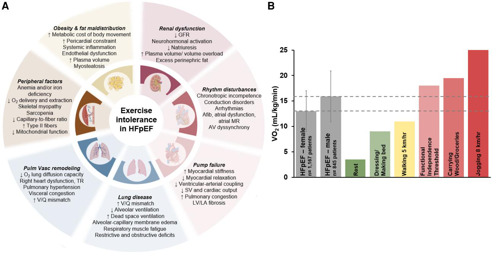
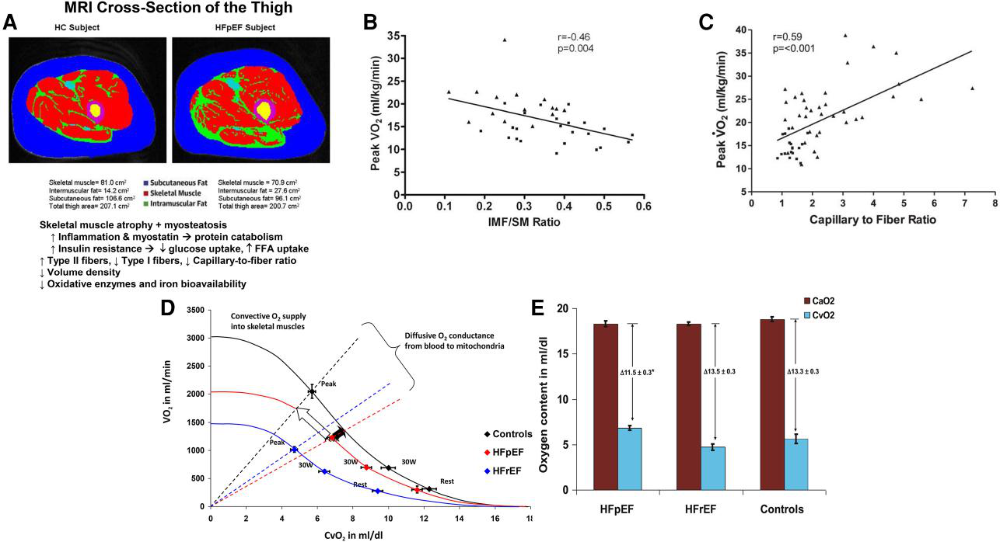
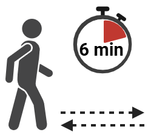
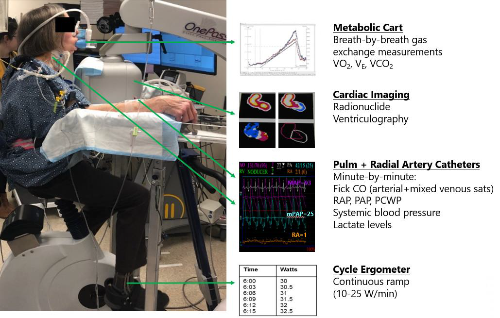
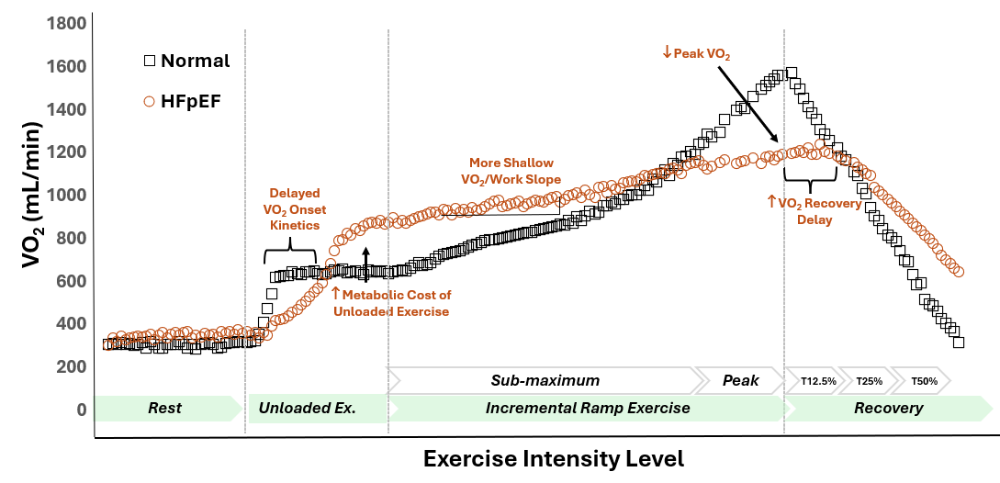
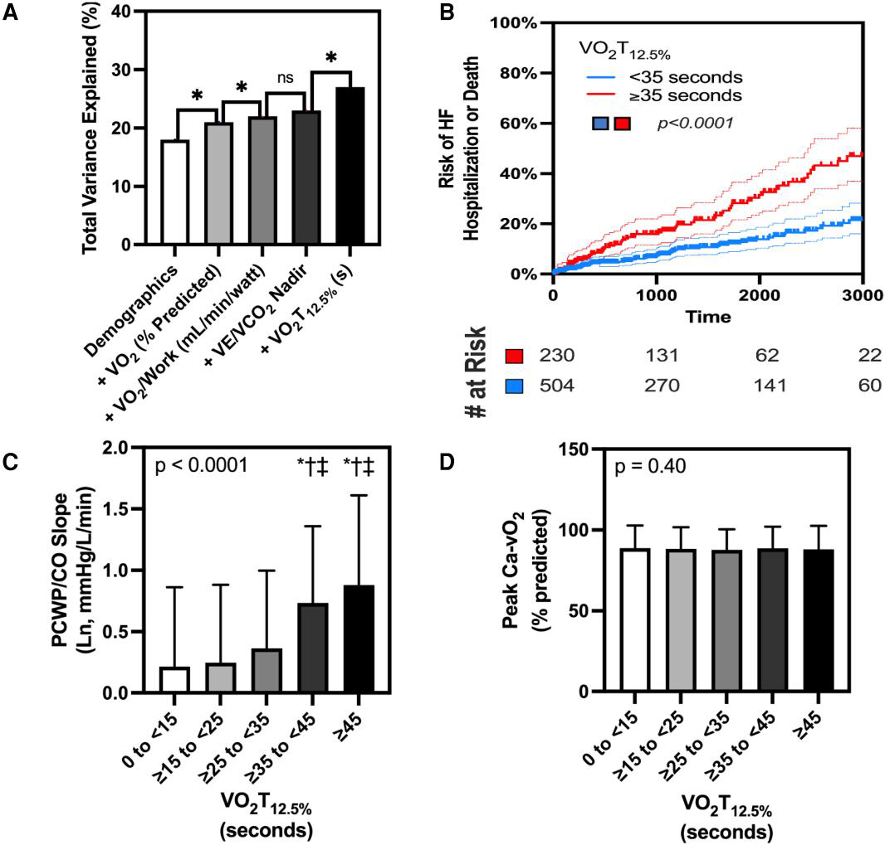

# Insuficiência cardíaca com fração de ejeção preservada (ICFEp): fisiopatologia, avaliação clínica e manejo da intolerância ao exercício

> 🎓 **Aprofunde:** Esta é uma *state-of-the-art review* do EHJ centrada em um conceito unificador: a intolerância ao exercício (IE) na ICFEp é **a manifestação clínica mais sensível e primária** da síndrome, e resulta de déficits compostos e multissistêmicos (cardíaco, pulmonar, vascular, hematológico, neuromuscular). A grande mensagem para dominar é a transição do modelo "cardiocêntrico" (foco em pressões de enchimento) para um modelo de **fenotipagem por domínios baseada no exercício**, que tem implicações diretas no porquê de tantos ensaios clínicos centrais terem sido neutros.

## Introdução

A IC afeta >64 milhões de pessoas no mundo; a ICFEp corresponde a quase metade dos casos e está em ascensão. As características clínicas e os perfis de fatores de risco têm grande heterogeneidade regional. Apesar dessa variação, a **intolerância ao exercício (IE)** é consistentemente observada na ICFEp, mesmo na ausência de congestão evidente em repouso.

A IE reflete comprometimento da reserva central E periférica, com a maioria dos pacientes exibindo déficits compostos em sistemas cardiovascular, pulmonar, hematológico e neuromuscular. Esse entendimento da ICFEp como **distúrbio de função multissistêmica** justifica avaliações fisiológicas baseadas em exercício que desmascaram e hierarquizam déficits que não são evidentes em repouso.

> 🎓 **Aprofunde:** Conceito-chave para a prova e para a prática: a ICFEp não é "disfunção diastólica isolada". O exercício é a ferramenta diagnóstica e fenotípica central porque desmascara déficits ocultos. Houstis et al. (ref. 6) é o trabalho fundamental da "análise da via do O₂ personalizada" que rankeia as causas de IE em cada paciente.

## Extensão e etiologia da intolerância ao exercício na ICFEp

O **pico de consumo de oxigênio (pVO₂)** é o padrão-ouro de capacidade funcional na ICFEp. Dados agregados de 8 estudos (2012 pacientes):
- Mulheres com ICFEp: pVO₂ médio ≈ **13,1 ± 4,1 mL/kg/min**
- Homens com ICFEp: pVO₂ ≈ **15,9 ± 5,5 mL/kg/min**

Atividades cotidianas como caminhar a 5 km/h custam >70% do pVO₂ médio que esses pacientes conseguem. Correr a 8 km/h excede a capacidade da maioria. Esses valores de pVO₂ são comparáveis aos limiares usados para indicar transplante cardíaco em ICFEr — sublinhando a gravidade da limitação.

A IE na ICFEp difere de condições bem demarcadas (ex.: síndromes coronarianas agudas com elevação de biomarcadores). Aqui, as causas são exposições cumulativas ao longo da vida: inatividade física, inflamação sistêmica, adiposidade excessiva/maldistribuída. A ICFEp foi caracterizada como **"síndrome de deficiência de exercício"** — a falta de exercício predispõe a câmara ventricular pequena, atrofia cardíaca e rigidez aumentada. Estudos populacionais: anormalidades cardio-específicas (BRE, infarto no ECG) aumentam o risco de ICFEr > ICFEp; já adiposidade na meia-idade e sedentarismo predispõem a ICFEp > ICFEr.

> 🎓 **Aprofunde:** A noção de "exercise deficiency syndrome" (La Gerche et al., ref. 31) é central: explica por que o treinamento físico é a intervenção mais potente e por que a fisiopatologia é tão periférica. Domine os valores de pVO₂ por sexo — são citados ao longo de todo o artigo como referência de gravidade.

### Contribuições cardíacas

- **Relaxamento miocárdico prejudicado** (Tau prolongado) e **rigidez aumentada** (inclinação mais íngreme da relação pressão-volume diastólica final) → pressões de enchimento elevadas durante o exercício.
- Indivíduos normais melhoram o relaxamento do VE com exercício; na ICFEp, o Tau **não encurta** normalmente apesar da demanda fisiológica conforme a FC sobe.
- Outras anormalidades: constrição pericárdica, reserva contrátil diminuída, **incompetência cronotrópica**, função de "capacitor" e "booster" atrial prejudicada → ascensão exagerada das pressões de enchimento.

**Critério diagnóstico hemodinâmico:** PCWP (pressão de oclusão da artéria pulmonar) ≥ **25 mmHg** durante exercício supino. Além das elevações absolutas, há **augmentação prejudicada do débito cardíaco (DC)**, expressa como relação PCWP/DC íngreme — inclinação **≥ 2 mmHg/L/min** constitui limiar anormal.

Tan et al. (ref. 39) mostraram que a limitação combina anormalidades sistólicas E diastólicas: deformação miocárdica prejudicada, mecânica de torção/destorção alterada, sucção ventricular reduzida, destorção tardia, enchimento diastólico precoce prejudicado, strain longitudinal e radial reduzidos, rotação apical diminuída — **ICFEp não é distúrbio isolado da diástole**.

> 🎓 **Aprofunde:** Dois números para memorizar: **PCWP ≥ 25 mmHg** no exercício supino (critério diagnóstico) e **inclinação PCWP/DC ≥ 2 mmHg/L/min** (limiar anormal pressão-fluxo). A grande sacada é que o índice de inclinação (slope) é *effort-independent* — não depende de o paciente chegar ao pico — e portanto mais robusto.

### Contribuintes vasculares sistêmicos

- **Rigidez arterial** é contribuinte sistêmico-chave (envelhecimento vascular, ativação neuro-hormonal, inflamação, remodelamento). Reduz complacência aórtica, aumenta pós-carga do VE e aumenta a reflexão tardia de onda sistólica → prejudica relaxamento e eficiência contrátil.
- Índices de **acoplamento ventrículo-arterial (V-A)** integram essas interações; rigidez vascular elevada associa-se a reserva de VE prejudicada.
- Disfunção endotelial e da reatividade microvascular limitam perfusão muscular e coronariana → maior carga de sintomas, menor capacidade funcional.
- Pacientes com ICFEp podem desenvolver **injúria miocárdica transitória** por mismatch oferta-demanda coronariana durante exercício (ref. 45).
- Reddy et al. (ref. 46): no exercício submáximo, ICFEp tem menor complacência arterial total e maior elastância arterial efetiva vs controles, apesar de PA média similar → associadas a pressões de enchimento maiores e DC reduzido.
- Namasivayam et al. (ref. 42): maior pulsatilidade pressórica induzível reflete rigidez arterial e associa-se independentemente a maior risco de eventos CV.

### Contribuições pulmonares e vasculares pulmonares

- **94%** dos pacientes com ICFEp têm anormalidade em ≥1 teste de função pulmonar.
- **Distensibilidade vascular pulmonar** (% de aumento do diâmetro do vaso por mmHg de aumento de pressão) está reduzida e ligada a reserva contrátil do VD prejudicada.
- Relações PAP-fluxo anormais com **desacoplamento VD-AP** induzido pelo exercício.
- **Eficiência ventilatória prejudicada:** inclinação VE/VCO₂ aumentada (espaço morto fracionado + set point de PaCO₂). Combinada a déficits obstrutivos, o paciente pode atingir limite mecânico pulmonar (VE aproximando-se da MVV). Respiração rápida e superficial + força muscular respiratória reduzida → mais espaço morto fisiológico e ventilação ineficiente.
- **Troca gasosa prejudicada:** DLco reduzida em repouso e exercício, principalmente por redução da condutância da membrana alvéolo-capilar (Dm), com contribuição variável do volume capilar pulmonar (Vc). Elevação crônica das pressões esquerdas → remodelamento vascular pulmonar, água extravascular aumentada, espessamento da membrana alvéolo-capilar. A redução de DLco pode ser **desproporcional** ao grau de HP/pressão atrial esquerda — implicando disfunção alvéolo-capilar intrínseca.

**Mecânica torácica extracardíaca:** Leahy et al. (ref. 54) — **hiperinsuflação dinâmica** (quantificada por manobras de capacidade inspiratória e alças fluxo-volume) associa-se a PCWP maior em carga submáxima padronizada e no pico. Maior volume pulmonar expiratório final e PCWP elevada podem refletir associação compartilhada com maior adiposidade. Campain et al. (ref. 56): menor %FEV1 previsto em repouso relaciona-se a maior variação respirofásica no traçado de PCWP no pico.

> 🎓 **Aprofunde:** Inclinação **VE/VCO₂ > 36** = ineficiência ventilatória / mismatch V/Q (limiar extrapolado da ICFEr; na ICFEp limiares menores como ~33 já predizem desfechos — Guazzi, ref. 118). DLco reduzida desproporcional aponta disfunção alvéolo-capilar intrínseca. A hiperinsuflação dinâmica (Leahy, ref. 54) é uma armadilha interpretativa importante: confunde a leitura da PCWP de exercício.

### Contribuintes periféricos / esqueléticos

**Extração e utilização de O₂ pelo músculo esquelético** — abundantemente investigados e contribuintes significativos da IE:
- Miosteatose (infiltração gordurosa intramuscular), sarcopenia, rarefação capilar, rigidez vascular aumentada, **redução de fibras tipo I (oxidativas)** e da razão tipo I/tipo II.
- A extensão dessas anormalidades **correlaciona diretamente** com a redução do pVO₂ (Haykowsky, ref. 57).

**Conceito da DmO₂ vs Ca-vO₂:** A diferença arteriovenosa de O₂ (Ca-vO₂) medida no CPET invasivo avalia extração periférica, MAS é influenciada pela taxa de entrega de O₂. A **capacidade de difusão de O₂ do músculo (DmO₂)**, aproximada pela razão VO₂/PvO₂, representa especificamente a utilização periférica. Exemplo crítico: paciente com baixa reserva de DC pode exibir Ca-vO₂ alta apenas por tempo de trânsito capilar prolongado, **mascarando** um verdadeiro déficit de DmO₂.

**Anemia e deficiência de ferro** — presentes em **>50%** dos pacientes com ICFEp. O ferro é cofator na respiração mitocondrial, fosforilação oxidativa e ciclo do ácido cítrico. **Deficiência de ferro definida por saturação de transferrina <20%** associa-se a menor pVO₂ e piores desfechos.

> 🎓 **Aprofunde:** Distinção que cai em prova e muda conduta: **Ca-vO₂** (extração líquida) ≠ **DmO₂** (utilização periférica verdadeira, ≈ VO₂/PvO₂). Em baixo DC, o trânsito capilar lento eleva a Ca-vO₂ falsamente. O achado de Dhakal (ref. 58) — pior condutância difusiva de O₂ na ICFEp que na ICFEr — é a base fisiológica para priorizar intervenções periféricas. Defina deficiência de ferro pela **saturação de transferrina <20%** (melhor preditor que ferritina — Lee et al., ref. 66).

### Obesidade

Marcada por gordura visceral e epicárdica excessivas → inflamação sistêmica, remodelamento miocárdico, disfunção microvascular, **maior constrição pericárdica** → reserva diastólica prejudicada e pressões de enchimento elevadas no exercício. A mecânica pulmonar é comprometida (restrição da expansão torácica, maior trabalho respiratório, menor reserva ventilatória). Limitações periféricas: infiltração adiposa muscular, rarefação capilar, disfunção mitocondrial. A obesidade aumenta o **custo metabólico de iniciar movimento ("trabalho interno")** — medida relacionada ao IMC que quantifica os equivalentes de trabalho para iniciar exercício sem carga.

---

## Avaliação clínica na ICFEp

Avaliações dinâmicas integrativas — **CPET** (teste cardiopulmonar de exercício) e **ecocardiografia de estresse de exercício** — desmascaram déficits hemodinâmicos e periféricos não detectáveis em repouso.

### Capacidade global de exercício e carga de sintomas

- **KCCQ** (Kansas City Cardiomyopathy Questionnaire): visão reprodutível da carga de sintomas e qualidade de vida; supera outros PROs na ICFEp e oferece mais granularidade que a classe NYHA.
- Avaliações objetivas: **TC6M** (teste de caminhada de 6 min — baixo custo, mas não quantifica pVO₂ nem identifica o órgão limitante), **acelerometria** e **CPET**.
- CPET fornece pVO₂ e resposta ventilatória; **RER > 1,05** verifica esforço máximo.
- Correlações entre NYHA, KCCQ e medidas objetivas (TC6M, pVO₂) são **modestas** → reforça a importância de medidas objetivas.

**Limiares de mudança clinicamente relevante:** KCCQ +5 pontos; pVO₂ +1 mL/kg/min; TC6M +20 m; acelerometria 5000 unidades; NYHA 1 classe.

> 🎓 **Aprofunde:** Memorize os limiares de mudança clinicamente significativa (KCCQ +5; TC6M +20 m; pVO₂ +1 mL/kg/min) — são a régua para interpretar todos os ensaios da Tabela 1. CPET isolado captura apenas limitações pulmonares e incompetência cronotrópica; para o domínio hemodinâmico é preciso eco de exercício ou teste invasivo.

### Avaliação por domínios (abordagem domain-based)

Fluxograma estruturado e sequencial: repouso primeiro (eco, peptídeos natriuréticos, escores) → testes dinâmicos em sintomas inexplicados. Domínios: **hemodinâmico (vermelho), pulmonar (azul), periférico/muscular (marrom)** — frequentemente coexistem.

#### Domínio hemodinâmico

**Ecocardiografia em repouso:** diástole, sincronia AV, função atrial, doença estrutural, identificação de mimetizadores. **Strain de reservatório atrial esquerdo (LArS) < 24,5%** aumenta a acurácia diagnóstica — esse limiar prediz pressões elevadas em repouso E no exercício (diferente de cutoffs menores, ex. 18%, validados só contra hemodinâmica de repouso).

**Peptídeos natriuréticos (NT-proBNP):** identificam alto risco, mas valores normais **não excluem** ICFEp. Muitos pacientes com ICFEp confirmada hemodinamicamente no exercício ficam abaixo dos limiares de NT-proBNP exigidos por ensaios clínicos.

**Escores diagnósticos** (H₂FPEF, HFpEF-ABA, HFA-PEFF): derivados/validados contra PCWP ≥ 25 mmHg no pico do exercício supino. Limitação: até metade dos pacientes que atingem o limiar supino **falham** em atingir critérios no exercício **em pé (upright)** — esses "discordantes" têm menos anormalidades estruturais/hemodinâmicas e escores H₂FPEF menores.

> 🎓 **Aprofunde:** Dois pontos de alto rendimento: (1) **LArS < 24,5%** é o cutoff a lembrar (Reddy, ref. 74 / Lababidi, ref. 75 para a contextualização do 18%); (2) **NT-proBNP normal NÃO exclui ICFEp** (Landsteiner, ref. 10) — muitos pacientes "de exercício" estão abaixo dos limiares de inclusão dos trials, o que ajuda a explicar populações de ensaios enviesadas para fenótipos mais congestos.

**Eco de estresse — teste de estresse diastólico:** E/e' septal ou médio **≥ 15** sugere reserva diastólica prejudicada. Viabilidade cai com a carga (96,3% a 20 W; 74,9% no pico) por fusão das ondas E-A. E/e' > 15 a 20 W: alto VPP para PCWP ≥ 25 mmHg (~82%); VPN de teste "negativo" limitado (~58%) — ~42% dos "negativos" ainda têm PCWP ≥ 25 mmHg. PCWP cai rápido na recuperação precoce, mas E/e' frequentemente permanece ≥15 → **E/e' de recuperação não é surrogado direto da pressão de cunha contemporânea**. Fusão E-A em FC alta (>90-100 bpm) confunde → preferir aferição no submáximo. Cerca de 1/4 dos casos invasivamente confirmados podem ser perdidos por E/e'.

**Hipertensão pulmonar de exercício (inclinação PAP/DC):** quantifica a resistência pulmonar total (pressão atrial esquerda + RVP). **Inclinação > 3 mmHg/L/min** = acoplamento pressão-fluxo anormal — NÃO delineia componentes pré/pós-capilares e não deve ser critério diagnóstico isolado; é barômetro integrativo da resposta hemodinâmica. Eco de exercício e CPET invasivo concordam bem; eco semissupino com contraste melhora a viabilidade (até 93%).
- Inclinação mais robusta com múltiplos pontos ao longo do exercício.
- Estimativa não invasiva: fórmula de Chemla a partir da velocidade de regurgitação tricúspide (TRV) e DC do LVOT (mPAP = 0,61 × gradiente TR + 2 mmHg). Sinal de TR otimizado com colóide/salina agitada, posição semissupina, multipontos.
- Razões mPAP/DC de ponto único no exercício têm performance prognóstica comparável a abordagens multiponto.
- Incluir estimativa de PAD em repouso **não** melhora a correlação (PAD de repouso não reflete a de exercício).
- FA e regurgitação mitral funcional atrial podem **inclinar** a curva (alteram pressão AE ou reserva de volume sistólico).
- **TAPSE/sPAP de exercício** (acoplamento VD-AP) pode ser alternativa complementar/mais simples.
- Pacientes com escores negativos mas PAP/DC anormal têm maior risco e limitação comparável aos classificados como ICFEp → candidatos a avaliação invasiva.

> 🎓 **Aprofunde:** Domine os três slopes: **PCWP/DC > 2**, **PAP/DC > 3 (mPAP/DC)** mmHg/L/min, e a relevância de eles serem effort-independent. A inclinação PAP/DC > 3 é definição corrente de anormal e prediz prognóstico (Ho, ref. 103; Kovacs, ref. 108). A fórmula de Chemla (ref. 87) é a adaptação prática para eco — saiba que o RAP de repouso não deve ser somado.

**CPETecho (eco + CPET simultâneos):** captura domínios hemodinâmico, pulmonar e periférico em um único teste; permite dissecar variáveis de Fick do pVO₂. Extração periférica não invasiva: **Ca-vO₂ = VO₂/DC** (gás expirado / DC eco). Distingue limitação central (DC-limitada) de periférica (extração-limitada); inclinações CO/VO₂ mais rasas implicam maior comprometimento cardíaco relativo. Ressalva: Ca-vO₂ reflete propensão à difusão E tempo de trânsito capilar.

**Hemodinâmica invasiva:** cateteres micromanométricos de alta fidelidade com alças pressão-volume quantificam **Tau (τ)** e a inclinação da relação pressão-volume diastólica final (rigidez, b). Critérios: **Tau > 48 ms** ou **b > 0,27**. Essas anormalidades são altamente prevalentes na dispneia exertional (Gessner, ref. 98). Requerem equipamento/expertise não rotineiros. Métodos simplificados em investigação (quociente pressão-volume diastólico eco; rigidez derivada de batimento único).

- Reddy et al. (ref. 101): aplicar PCWP ≥ 25 vs PCWP/DC > 2 reclassifica ~20% dos pacientes; reclassificados de ICFEp→controle tinham mais PCWP de repouso elevada e melhor augmentação de DC.
- Baratto et al. (ref. 36): meta-análise de 27 estudos — inclinações PCWP/DC na ICFEp consistentemente >2; controles <2.
- **VO₂T12.5%** (tempo para recuperar 12,5% do pVO₂): em 814 pacientes, VO₂T12.5% prolongado associou-se a PCWP/DC elevado (mais que outras variáveis do CPET) e **não** se relacionou à extração periférica → especificidade cardíaca. Cutoff de **35 s** identificou pacientes de alto risco; preditor independente de hospitalização por IC e mortalidade.

#### CPET com hemodinâmica invasiva (iCPET) — padrão-ouro

Permite medida direta e repetida de DC, PCWP, mPAP e utilização periférica de O₂; seguro, viável, reprodutível, sem comprometer a capacidade máxima de exercício (ref. 104).

- Medidas de repouso isoladas têm limitações (jejum noturno prolongado → depleção volêmica → PCWP falsamente baixa, <15 mmHg).
- **Índices de inclinação** (PCWP/DC > 2; PAP/DC > 3) são robustos e effort-independent; independentes de nivelamento do transdutor.
- **Limiares fixos** (PCWP ≥ 25; mPAP ≥ 30) podem ser excedidos em normais em cargas altas ou com grandes oscilações respiratórias.
- Para iCPET **em pé**: PAP/DC e PCWP/DC predizem desfechos independentemente das pressões de repouso. Para iCPET **supino**: PCWP indexada à carga, PCWP ≥ 25 e PCWP/DC predizem prognóstico (>3000 pacientes).

**Posição corporal importa** (Fudim, ref. 77): metade dos que atingem critério supino (exPCWP ≥ 25, usado para ancorar escores) não atinge critério em pé (PCWP/DC > 2). Reclassificação ocorre **exclusivamente** de supino→não-em-pé; todos com resposta upright anormal também eram anormais supinos. Os "só supinos" têm menos anormalidades, menos FA, escores H₂FPEF menores → comprometimento central mais leve em pé.

> 🎓 **Aprofunde:** Ideia central da seção: **inclinação (slope) > limiar fixo**. Os slopes são reprodutíveis e effort-independent; limiares fixos sofrem com oscilação respiratória e estado volêmico. O **VO₂T12.5% ≥ 35 s** (Campain, ref. 102) é um marcador não invasivo prático e cardio-específico — vale conhecer. A discordância supino-vs-em-pé (Fudim, ref. 77) é nuance moderna importante: o supino superdiagnostica formas leves.

#### Domínio periférico (muscular)

Vantagem do iCPET: medir simultaneamente DC de Fick e extração periférica (Ca-vO₂ por gasometrias arterial e venosa mista). Plotando DC vs VO₂, a inclinação revela o predomínio do déficit:
- **Normal:** ~**5-6 L de DC por 1 L de aumento de VO₂**.
- Inclinações de DC **mais baixas** → dependência desproporcional da extração periférica.
- Valores de DC **mais altos** → maior comprometimento da extração periférica (não do DC).

Em ICFEr, DC reduzido vs esperado prediz eventos CV; inclinações mais íngremes (mais periférico) sinalizam menos eventos. Dhakal (ref. 58): pior condutância difusiva de O₂ na ICFEp que na ICFEr → maior ganho potencial de VO₂ corrigindo utilização periférica vs hemodinâmica central.

#### Domínio pulmonar (pulmão)

- No exercício em pé, **hipoxemia franca é incomum** na ICFEp com elevação isolada de PCWP; SpO₂ e PaO₂ correlacionam-se inversamente com RVP de exercício → **dessaturação deve levantar suspeita de disfunção vascular pulmonar**.
- Omar et al. (ref. 113): dessaturação mais comum com PAP E PCWP elevadas no exercício supino.
- **VE/VCO₂ íngreme (>36)** = mismatch V/Q + espaço morto aumentado → disfunção vascular pulmonar mais provável + eventos CV adversos. Em ICFEr, >36 está validado; na ICFEp cutoffs menores descritos (Guazzi ~33; outros maiores) → falta cutoff específico uniforme.
- Nayor et al. (ref. 115): VE/VCO₂ (especialmente no **nadir**) reflete medidas invasivas — maior VE/VCO₂ → menor DC de pico, PCWP/DC mais íngreme, maior risco. O nadir minimiza confundidores de hiperventilação precoce/tardia.
- **Mecânica pulmonar:** VE/MVV alto, capacidade inspiratória reduzida ou queda de FEV1 pós-exercício → restrição mecânica, particularmente se **VE/MVV > 70%** antes do limiar anaeróbio. Alças fluxo-volume com manobra inspiratória máxima superam espirometria de repouso. **TV/IC > 0,9** = hiperinsuflação dinâmica.

### Abordagem integrada: o modelo de clínica de ICFEp/dispneia

Clínicas dedicadas integram dados clínicos, biomarcadores, eco, função pulmonar e teste de exercício, com uso parcimonioso de CPET invasivo. A experiência crescente com CPETecho (replicando padrões do iCPET: relações pressão-fluxo, inclinações CO/VO₂) ampliará a fenotipagem baseada em exercício — sobretudo se os subfenótipos responderem a intervenções dirigidas.

---

## Melhorando a capacidade de exercício na ICFEp: abordagens atuais e emergentes

Uma síntese ponderada pelo tamanho amostral revela: terapias **cardiocêntricas** (que postulam melhorar hemodinâmica central/pressões de enchimento) geram ganhos limitados; **exercício e intervenções metabólicas/periféricas** rendem os maiores ganhos funcionais.

### Intervenções para todos os pacientes com ICFEp

#### Treinamento físico supervisionado (SET)
Intervenção mais investigada. Tratamento etiológico E sintomático. Atua principalmente aumentando **extração periférica de O₂** (recrutamento capilar, hiperemia de exercício, eficiência respiratória) e reduzindo tecido adiposo intramuscular. Mudanças em função diastólica/estrutura cardíaca são ausentes ou modestas (inclusive no recente **Ex-DHF**). Três meta-análises: ganhos consistentes de **2,1-2,2 mL/kg/min** de pVO₂ vs controle sedentário (todos P < 0,001). Treino de alta intensidade/intervalado pode acelerar ganhos; resistência e treino muscular respiratório agregam benefício. Barreiras: baixo engajamento de provedores, falta de cobertura, limitações neuromusculares, dificuldade de manutenção.

> 🎓 **Aprofunde:** O SET é a intervenção de maior efeito (≈ +2,1-2,2 mL/kg/min) e seu mecanismo é **periférico**, não diastólico — coerente com a tese central da revisão. Isso é o oposto do que se vê em CMH obstrutiva (ver síntese final).

### Intervenções cardio-reno-metabólicas na ICFEp congesta
(Ensaios enriquecidos por maior estresse de parede/congestão — critérios de NT-proBNP acima do exigido pela definição universal + cardiopatia estrutural.)

#### Inibidores de SGLT2
Reduzem internações e morte CV em todo o espectro de FE, mas o efeito na capacidade de exercício é **inconsistente**:
- **PRESERVED-HF** (dapagliflozina, n=289, IMC mediano 34,8): melhora de **20,1 m** no TC6M, independente de marcadores de congestão; maior em diabéticos e IMC >34,8.
- **DETERMINE-Preserved** (n=504, IMC 28,7) e **EMPEROR-Preserved** (n=5988): efeito neutro no TC6M.
- Meta-análise (8 estudos, 2624 pacientes): diferença mínima de **6,7 m** vs placebo.
- **CAMEO-DAPA** (n=38, IMC 34,7): redução de PCWP em repouso e exercício **SEM** aumento de pVO₂ — espelhando estratégias de cGMP que baixam pressões mas não aumentam pVO₂.

#### Antagonistas da aldosterona
- **Aldo-DHF** (espironolactona 25 mg, n=422): pVO₂ **sem mudança** (diferença +0,1 mL/kg/min, P=0,81); espironolactona **reduziu** TC6M em 15 m (P=0,03), apesar de melhora em E/e', massa de VE e NT-proBNP.
- Meta-análise (3 estudos, 519 pacientes): sem diferença na distância de caminhada. Efeito da finerenona na capacidade de exercício na ICFEp **não reportado**.

#### ARB e inibição da neprilisina
- Valsartana: sem efeito em gás expirado/TC6M (152 hipertensos com ICFEp).
- **PARALLAX** (sacubitril/valsartana, n=2572, FE ≥40%): **não** melhorou TC6M em 24 semanas (diferença −2,5 m, P=0,42).

#### Diuréticos de alça
Usados para mitigar IE dependente de congestão, mas **sem ECRs** definitivos sobre capacidade de exercício na ICFEp.

### Intervenções para o subfenótipo obeso

#### Agonistas de GLP-1
- **STEP-HFpEF** (semaglutida, FE >45%, obesidade): +14 a 20 m no TC6M.
- **SUMMIT** (tirzepatida — duplo agonista GLP-1/GIP, n=731, IMC médio 38,2): +18 m no TC6M em 1 ano.
- Apesar de perda de peso significativa (10,7% e 11,6% vs placebo), as melhoras relativas no TC6M foram apenas ~6% e 6,3%.
- Contraste: dieta isolada e dieta+exercício (Kitzman) → 6,6% e 10% de perda de peso com 6,3% e 21,4% de melhora no TC6M — **maior ganho funcional por unidade de perda de peso**.
- Cirurgia bariátrica (n=61, IMC 50,45): +23,4% no TC6M com 21,4% de perda de peso em 3 meses.
- No STEP-HFpEF, ganhos no TC6M atingiram platô em ~20 semanas apesar de perda contínua — ganhos precoces não são só descarga mecânica.
- Ganhos modestos podem refletir **perda de massa magra** e persistência de limitações multidomínio.

#### Intervenções dietéticas
- ECR fatorial (Kitzman, ref. 154, n=100, IMC 39,3): após 20 semanas, pVO₂ +1,2 mL/kg/min com exercício e +1,3 com dieta isolada; **combinação aditiva = +2,5 mL/kg/min**.
- Restrição de sal (DASH, prova de conceito, n=13): perda mínima de peso (1,7 kg), redução de PA (155→138 e 79→72 mmHg) e aumento de TC6M (313→337 m, P=0,006).

> 🎓 **Aprofunde:** Padrão a reconhecer: **baixar pressões de enchimento ≠ melhorar VO₂** (CAMEO-DAPA, nitritos, cGMP). E **perda de peso por dieta/exercício rende mais função por kg perdido que GLP-1**, provavelmente por preservação de massa magra. O Kitzman (ref. 154) demonstra aditividade dieta+exercício = +2,5 mL/kg/min — número-chave.

### Intervenções para deficiência de ferro e nutrientes

#### Reposição de ferro
Ferro deficiente em >50%. **FAIR-HFpEF** (n=39, encerrado precocemente): ferro carboximaltose IV → **+49 ± 22 m** no TC6M. (IRONMET-HFpEF, ferro derisomaltose, em andamento com pVO₂.)

#### Suplementação vitamínica
Deficiências hidrossolúveis (tiamina, vit C, B12) exacerbadas por diuréticos de alça; B12 baixa em idosos, dieta vegetariana, pós-bariátrica, metformina/IBP. **Escassez de ECRs** apoiando suplementação rotineira para melhorar exercício.

### Intervenções para o subfenótipo de incompetência cronotrópica

Incompetência cronotrópica presente em **42-80%** (depende da definição). A questão: é alvo terapêutico ou apenas reflexo de outras limitações que restringem o "acesso cronotrópico"?
- **RAPID-HF** (marcapasso atrial responsivo à frequência, crossover, n=29): FC de pico ↑ modesto (123 com vs 109 sem pacing), mas **pVO₂ inalterado** (16,5 vs 16,8) porque o ganho de FC foi anulado por **queda de 24 mL no volume sistólico de pico** (112→88 mL, P=0,02). Em ICFEr, resultados igualmente neutros ou benefícios modestos.
- Beta-bloqueadores, ivabradina e outros cronotrópicos negativos podem **piorar** a IE.
- **PRESERVE-HR** (crossover, n=52, retirada de beta-bloqueador vs continuação): índice cronotrópico médio 0,41 (todos <0,62 — incompetência grave). Retirada → **+30 bpm na FC de pico e +2,1 mL/kg/min no pVO₂**. Benefício maior em pacientes com volume sistólico final do VE abaixo da mediana (14,9 mL/m²).
- Ivabradina (If blocker) **reduz** pVO₂ (ref. 137); segundo ensaio maior (EDIFY) neutro para TC6M.

> 🎓 **Aprofunde:** Lição fisiológica elegante: na ICFEp o **aumento de FC pode ser anulado pela queda do volume sistólico** (RAPID-HF) — pacing não funciona universalmente. Mas a **retirada de beta-bloqueador em incompetência cronotrópica grave** (PRESERVE-HR, ref. 139/195) é exemplo de sucesso de enriquecimento fenotípico (+16,9% no pVO₂). É o protótipo da "terapia certa para o paciente certo".

### Intervenções para hipertensão atrial e volume sanguíneo estressado

#### Denervação esplâncnica e vasodilatadores
ICFEp tem **volume sanguíneo estressado aumentado**. A denervação esplâncnica atenua a redistribuição de sangue para órgãos torácicos. **REBALANCE-HF** (n=90): **sem diferença** em PCWP (1 mês) ou capacidade de exercício (1 ano); 11% mais hipotensão ortostática vs sham. Fenotipagem de exercício em pé pode identificar candidatos. **Vasodilatadores/cGMP**: apesar de atraentes para desacoplamento V-A, **não** melhoram capacidade de exercício na ICFEp.

### Intervenções para o fenótipo com hipertensão pulmonar (PH-HFpEF)
HAP e PH-HFpEF combinada estão além do escopo. **Levosimendana** (sensibilizador de cálcio/ativador de canal K-ATP) é promissora (formulação oral em avaliação — NCT05983250, TC6M como desfecho primário). Denervação da artéria pulmonar e o inibidor de activina **sotatercept** mostram promessa para reduzir RVP — exigindo fenotipagem fisiológica cuidadosa.

### Além das terapias dirigidas à IC
Tratamento da IE frequentemente exige abordagem holística: reconhecer e tratar doença arterial periférica, neuropatia, linfedema, artrite e barreiras mentais. Medicações que contribuem para retenção de líquido/imobilidade (pregabalina, anticolinérgicos, anlodipino, AINEs) exigem ponderação de risco-benefício.

[[TABELA: Checklist após manejo de ICFEp — recomendações de exames diagnósticos adicionais]]

| Investigação | Quando indicar |
|---|---|
| **Excluir doença arterial coronariana** | Alterações segmentares de motilidade; alterações de repolarização; fatores de risco / dispneia como equivalente anginoso; baixa reserva de volume sistólico com platô de pulso de O₂ |
| **Ressonância cardíaca** | Suspeita de cardiomiopatia infiltrativa, inflamatória, sobrecarga de ferro ou não-compactação |
| **Cintilografia com pirofosfato + cadeias leves séricas + imunofixação sérica/urinária** | Síndrome do túnel do carpo (bilateral), estenose espinhal, ruptura de tendão do bíceps, polineuropatia (homens idosos magros); hipertrofia biventricular, especialmente com derrame pericárdico e/ou padrão de sparing apical do strain longitudinal global; baixa voltagem de QRS para a massa de VE |
| **Cintilografia ventilação-perfusão** | HP de (exercício) com mismatch V/Q desproporcional (VE/VCO₂ > 45 ou SpO₂ < 92%) |
| **TC de tórax de alta resolução** | Função pulmonar restritiva com difusão de O₂ prejudicada e dessaturação > 5% no exercício |
| **Limitação mecânica pulmonar** | Deve motivar consulta pulmonar |

### Síntese dos ensaios e conclusões

Ensaios que dirigem a IE na ICFEp mostram, em geral, melhora **modesta ou nula** com terapias que **baixam pressões de enchimento**. Os pilares emergentes da ICFEp (reduzem hospitalizações, atenuam remodelamento) têm efeitos modestos no exercício — análogo à ICFEr.

**Contraste marcante com a CMH obstrutiva (oHCM):** intervenções cardiocêntricas geram **grandes ganhos** de capacidade na oHCM. A oHCM tem **inclinação CO-VO₂ rasa** (limitação predominante por DC reduzido); a ICFEp tem espectro heterogêneo, com limitações periféricas comuns e **inclinações CO-VO₂ elevadas**. Em estudo de inibidor de miosina cardíaca na oHCM, melhoras de pVO₂ foram proporcionais a reduções de NT-proBNP e gradiente de via de saída. Já na ICFEp, modelagem da via do O₂ indica apenas melhora **parcial** do pVO₂ para uma dada melhora em uma variável-componente.

> 🎓 **Aprofunde:** A comparação ICFEp vs oHCM é a moral da história da revisão. Na oHCM (cardiocêntrica, slope CO-VO₂ raso), corrigir o coração corrige o VO₂. Na ICFEp (multissistêmica, slope CO-VO₂ alto), corrigir um componente isolado da via do O₂ rende ganho parcial. **Não abandonar intervenções cardio-específicas — mas aplicá-las com fenotipagem de exercício** para enriquecer o efeito (ex.: retirada de BB na incompetência cronotrópica grave; PRESERVE-HR). Futuro: dirigir mais esforço à **utilização periférica de O₂** (sarcopenia, massa magra, ferro, aderência ao exercício multimodal).

## Conclusão e direções futuras

A IE na ICFEp surge de uma constelação multifatorial de anormalidades centrais e periféricas, frequentemente em camadas sobre múltiplos domínios fisiológicos. A fenotipagem de exercício de alta resolução ajuda a dissecar o predomínio de cada domínio. Estratégias que miram apenas mecanismos cardíacos tiveram sucesso limitado, mas há tendência de mais ensaios positivos nos últimos 5 anos. Intervenções para IE devem coexistir com a terapia médica guiada por diretrizes (que reduz mortalidade/hospitalizações). Intervenções futuras guiadas por **fenotipagem por domínios** são promissoras, mas requerem mais investigação.

---

## Tabela-resumo: ensaios randomizados em ICFEp com desfechos objetivos de exercício (Tabela 1, seleção dos principais)

| Ensaio (ano) | Intervenção | N | População | Impacto na capacidade de exercício |
|---|---|---|---|---|
| REDUCE-LAP HF I (2018) | Shunt interatrial | 44 | FE≥40%, exPCWP≥25 | Sem mudança significativa (carga +1,5 vs −1,9 W; P=0,35) |
| REBALANCE-HF (2024) | Denervação esplâncnica | 90 | FE≥40%, exPCWP≥25 | Sem diferença no TC6M (3/6/12 meses) |
| Aldo-DHF (2013) | Espironolactona | 422 | FE≥50% | pVO₂ sem mudança (+0,1; P=0,81) |
| PARALLAX (2021) | Sacubitril/valsartana | 2566 | FE≥40% | TC6M sem mudança (−2,5 m; P=0,42) |
| RELAX (2013) | Sildenafila | 216 | FE≥50% | pVO₂ sem mudança (P=0,98) |
| Borlaug 2015 | Nitrito IV | 28 | FE≥50% | ↑ leve VO₂ a 20 W (P=0,02); ↓ PCWP |
| NEAT-HFpEF (2015) | Mononitrato isossorbida | 110 | FE≥50% | Tendência a ↓ atividade diária; TC6M sem diferença |
| INDIE-HFpEF (2018) | Nitrito inorgânico inalado | 98 | FE≥50% | pVO₂ sem mudança (−0,20; P=0,27) |
| VITALITY-HFpEF (2020) | Vericiguat | 789 | FE≥45% | TC6M sem mudança |
| CAPACITY HFpEF (2020) | Praliciguat | 181 | FE≥40% | pVO₂ sem mudança (−0,30; P=0,37) |
| Sarma 2023 | Nitroglicerina sublingual | 30 | FE>50% | ↓ PCWP 7 mmHg; pVO₂ sem diferença |
| INABLE-Training (2024) | Treino físico + nitrito | 73 | FE≥50% | Treino ↑ pVO₂ (+0,8; P<0,001); nitrito sem efeito |
| KNO3CK OUT (2025) | Nitrato de potássio | 84 | FE>50% | pVO₂ sem mudança (P=0,73) |
| HFNEF (2015) | Ivabradina | 22 | FE≥50% | pVO₂ ↓ (−2,1 vs +0,9; P=0,003) |
| EDIFY (2017) | Ivabradina | 179 | FE≥45% | TC6M sem melhora |
| PRESERVE-HR (2021) | Retirada de beta-bloqueador | 52 | FE>50% | pVO₂ ↑ (+2,1 mL/kg/min; P<0,001) |
| RAPID-HF (2023) | Marcapasso atrial responsivo | 29 | FE≥40% | Sem efeito no pVO₂ (P=0,27) |
| PRESERVED-HF (2021) | Dapagliflozina | 324 | FE≥45% | TC6M +20,1 m (P=0,007) |
| EMPERIAL-Preserved (2021) | Empagliflozina | 312 | FE≥40% | TC6M sem mudança (+4,0 m; P=0,37) |
| CAMEO-DAPA (2023) | Dapagliflozina | 37 | FE≥50% | ↓ exPCWP (−5,7 mmHg); pVO₂ sem diferença |
| DETERMINE-Preserved (2024) | Dapagliflozina | 253 | FE≥40% | TC6M sem diferença (P=0,67) |
| STEP-HFpEF (2023) | Semaglutida | 529 | FE≥50%, IMC≥30 | TC6M +20,3 m (P<0,001) |
| SUMMIT (2025) | Tirzepatida | 731 | FE≥50%, IMC≥30 | TC6M +18,3 m (P<0,001) |
| HuMAIN-HFpEF (2025) | HU6 | 66 | FE≥50%, IMC≥30 | pVO₂ e TC6M sem diferença |
| FAIR-HFpEF (2024) | Ferro carboximaltose IV | 39 | ICFEp + def. ferro | TC6M +49 m (P=0,029) |
| PARIS/Ex-DHF/SECRET (treino) | Treino físico ± dieta | vários | FE≥50% | pVO₂ ↑ consistente (~2,1-2,5 mL/kg/min); dieta+exercício aditivo (+2,5) |
| Mueller 2021 | HIIT / treino contínuo | 180 | FE≥50% | pVO₂ ↑ (HIIT +1,5; contínuo +2,0 vs controle) |
| DoPING-HFpEF (2023) | Trimetazidina | 25 | FE≥50% | Sem efeito em PCWP/TC6M |
| KETO-HFpEF (2024) | Éster de cetona | 24 | FE>40%+DM2 | ↑ DC, ↓ PCWP; pVO₂ sem diferença (P=0,70) |
| Selvaraj 2025 | Éster de cetona | 20 | FE≥50% | pVO₂ sem melhora (P=0,75) |
| HELP (2021) | Levosimendana | 37 | PH-HFpEF | TC6M +29,3 m (P=0,033); ↓ PCWP em todas as cargas |
| AMETHYST (2024) | Verinurad+alopurinol | 159 | FE≥45%+hiperuricemia | pVO₂ similar entre grupos |
| Mitiperstat (2025) | Inibidor de mieloperoxidase | 30 | rPCWP≥15 ou exPCWP≥25 | pVO₂ sem diferença (P=0,70) |

---

## Referências citadas

6. Houstis NE, et al. Exercise intolerance in heart failure with preserved ejection fraction: diagnosing and ranking its causes using personalized O₂ pathway analysis. Circulation 2018;137:148–61. [10.1161/CIRCULATIONAHA.117.029058](https://doi.org/10.1161/CIRCULATIONAHA.117.029058)
10. Landsteiner I, et al. Implications of HFpEF definitions unveiled by rest and exercise hemodynamics. Circ Res 2025;137:357–59. [10.1161/CIRCRESAHA.125.326504](https://doi.org/10.1161/CIRCRESAHA.125.326504)
11. Eisman AS, et al. Pulmonary capillary wedge pressure patterns during exercise predict exercise capacity and incident heart failure. Circ Heart Fail 2018;11:e004750. [10.1161/CIRCHEARTFAILURE.117.004750](https://doi.org/10.1161/CIRCHEARTFAILURE.117.004750)
31. La Gerche A, et al. Heart failure with preserved ejection fraction as an exercise deficiency syndrome: JACC focus seminar 2/4. J Am Coll Cardiol 2022;80:1177–91. [10.1016/j.jacc.2022.07.011](https://doi.org/10.1016/j.jacc.2022.07.011)
35. Borlaug BA, et al. Exercise hemodynamics enhance diagnosis of early heart failure with preserved ejection fraction. Circ Heart Fail 2010;3:588–95. [10.1161/CIRCHEARTFAILURE.109.930701](https://doi.org/10.1161/CIRCHEARTFAILURE.109.930701)
36. Baratto C, et al. Exercise haemodynamics in heart failure with preserved ejection fraction: a systematic review and meta-analysis. ESC Heart Fail 2022;9:3079–91. [10.1002/ehf2.13979](https://doi.org/10.1002/ehf2.13979)
39. Tan YT, et al. The pathophysiology of heart failure with normal ejection fraction. J Am Coll Cardiol 2009;54:36–46. [10.1016/j.jacc.2009.03.037](https://doi.org/10.1016/j.jacc.2009.03.037)
42. Namasivayam M, et al. Exercise blood pressure in heart failure with preserved and reduced ejection fraction. JACC Heart Fail 2022;10:278–86. [10.1016/j.jchf.2022.01.012](https://doi.org/10.1016/j.jchf.2022.01.012)
45. Obokata M, et al. Myocardial injury and cardiac reserve in patients with heart failure and preserved ejection fraction. J Am Coll Cardiol 2018;72:29–40. [10.1016/j.jacc.2018.04.039](https://doi.org/10.1016/j.jacc.2018.04.039)
46. Reddy YNV, et al. Arterial stiffening with exercise in patients with heart failure and preserved ejection fraction. J Am Coll Cardiol 2017;70:136–48. [10.1016/j.jacc.2017.05.029](https://doi.org/10.1016/j.jacc.2017.05.029)
54. Leahy MG, et al. Heart-lung interactions in HFpEF: dynamic hyperinflation and exercise PCWP. JACC Heart Fail 2025;13:102523. [10.1016/j.jchf.2025.102523](https://doi.org/10.1016/j.jchf.2025.102523)
56. Campain J, et al. Characterization and prognostic implications of respirophasic variation in invasive hemodynamic measurements at rest and with exercise. J Card Fail 2024;30:843–7. [10.1016/j.cardfail.2023.12.009](https://doi.org/10.1016/j.cardfail.2023.12.009)
57. Haykowsky MJ, et al. Skeletal muscle composition and its relation to exercise intolerance in older patients with heart failure and preserved ejection fraction. Am J Cardiol 2014;113:1211–6. [10.1016/j.amjcard.2013.12.031](https://doi.org/10.1016/j.amjcard.2013.12.031)
58. Dhakal BP, et al. Mechanisms of exercise intolerance in heart failure with preserved ejection fraction: the role of abnormal peripheral oxygen extraction. Circ Heart Fail 2015;8:286–94. [10.1161/CIRCHEARTFAILURE.114.001825](https://doi.org/10.1161/CIRCHEARTFAILURE.114.001825)
66. Lee S, et al. Transferrin saturation is a better predictor than ferritin of metabolic and hemodynamic exercise responses in HFpEF. JACC Heart Fail 2025;13:102478. [10.1016/j.jchf.2025.02.024](https://doi.org/10.1016/j.jchf.2025.02.024)
74. Reddy YNV, et al. Left atrial strain and compliance in the diagnostic evaluation of heart failure with preserved ejection fraction. Eur J Heart Fail 2019;21:891–900. [10.1002/ejhf.1464](https://doi.org/10.1002/ejhf.1464)
75. Lababidi H, et al. New algorithm for estimating left ventricular filling pressure by echocardiography. Circulation 2025;152:424–35. [10.1161/CIRCULATIONAHA.125.074974](https://doi.org/10.1161/CIRCULATIONAHA.125.074974)
77. Fudim M, et al. Discrepancy in the diagnosis of heart failure with preserved ejection fraction between supine versus upright exercise hemodynamic testing. Circ Heart Fail 2024;17:e012020. [10.1161/CIRCHEARTFAILURE.124.012020](https://doi.org/10.1161/CIRCHEARTFAILURE.124.012020)
87. Chemla D, et al. New formula for predicting mean pulmonary artery pressure using systolic pulmonary artery pressure. Chest 2004;126:1313–7. [10.1378/chest.126.4.1313](https://doi.org/10.1378/chest.126.4.1313)
98. Gessner R, et al. Diagnosing HFpEF in patients with unexplained dyspnea by using invasive left ventricular pressure-volume loops. J Card Fail 2025;31:1661–71. [10.1016/j.cardfail.2025.09.010](https://doi.org/10.1016/j.cardfail.2025.09.010)
101. Reddy YNV, et al. Diagnosis of heart failure with preserved ejection fraction among patients with unexplained dyspnea. JAMA Cardiol 2022;7:891–9. [10.1001/jamacardio.2022.1916](https://doi.org/10.1001/jamacardio.2022.1916)
102. Campain J, et al. Characterization and application of novel exercise recovery patterns that reflect cardiac performance: a substudy of the SEQUOIA-HCM trial. Circulation 2025;152:990–1002. [10.1161/CIRCULATIONAHA.124.073585](https://doi.org/10.1161/CIRCULATIONAHA.124.073585)
103. Ho JE, et al. Exercise pulmonary hypertension predicts clinical outcomes in patients with dyspnea on effort. J Am Coll Cardiol 2020;75:17–26. [10.1016/j.jacc.2019.10.048](https://doi.org/10.1016/j.jacc.2019.10.048)
104. Landsteiner I, et al. Feasibility and reproducibility of performing maximal incremental exercise with the addition of invasive hemodynamic measurements. J Card Fail 2025;31:163–5. [10.1016/j.cardfail.2024.08.052](https://doi.org/10.1016/j.cardfail.2024.08.052)
108. Kovacs G, et al. Prognostic relevance of exercise pulmonary hypertension: results of the multicentre PEX-NET Clinical Research Collaboration. Eur Respir J 2024;64:2400698. [10.1183/13993003.00698-2024](https://doi.org/10.1183/13993003.00698-2024)
113. Omar M, et al. Hypoxaemia in patients with heart failure and preserved ejection fraction. Eur J Heart Fail 2023;25:1593–603. [10.1002/ejhf.2930](https://doi.org/10.1002/ejhf.2930)
115. Nayor M, et al. Clinical and hemodynamic associations and prognostic implications of ventilatory efficiency in patients with preserved left ventricular systolic function. Circ Heart Fail 2020;13:e006729. [10.1161/CIRCHEARTFAILURE.119.006729](https://doi.org/10.1161/CIRCHEARTFAILURE.119.006729)
118. Guazzi M, et al. Cardiopulmonary exercise testing in the clinical and prognostic assessment of diastolic heart failure. J Am Coll Cardiol 2005;46:1883–90. [10.1016/j.jacc.2005.07.051](https://doi.org/10.1016/j.jacc.2005.07.051)
122. Feldman T, et al. Transcatheter interatrial shunt device (REDUCE LAP-HF I). Circulation 2018;137:364–75. [10.1161/CIRCULATIONAHA.117.032094](https://doi.org/10.1161/CIRCULATIONAHA.117.032094)
123. Fudim M, et al. Endovascular ablation of the greater splanchnic nerve in HFpEF: the REBALANCE-HF randomized clinical trial. JAMA Cardiol 2024;9:1143–53. [10.1001/jamacardio.2024.2612](https://doi.org/10.1001/jamacardio.2024.2612)
124. Edelmann F, et al. Effect of spironolactone on diastolic function and exercise capacity (Aldo-DHF). JAMA 2013;309:781–91. [10.1001/jama.2013.905](https://doi.org/10.1001/jama.2013.905)
126. Pieske B, et al. Effect of sacubitril/valsartan vs standard medical therapies (PARALLAX). JAMA 2021;326:1919–29. [10.1001/jama.2021.18463](https://doi.org/10.1001/jama.2021.18463)
127. Redfield MM, et al. Effect of phosphodiesterase-5 inhibition (RELAX). JAMA 2013;309:1268–77. [10.1001/jama.2013.2024](https://doi.org/10.1001/jama.2013.2024)
137. Pal N, et al. Effect of selective heart rate slowing in heart failure with preserved ejection fraction. Circulation 2015;132:1719–25. [10.1161/CIRCULATIONAHA.115.017119](https://doi.org/10.1161/CIRCULATIONAHA.115.017119)
139. Palau P, et al. Effect of beta-blocker withdrawal on functional capacity (PRESERVE-HR). J Am Coll Cardiol 2021;78:2042–56. [10.1016/j.jacc.2021.08.073](https://doi.org/10.1016/j.jacc.2021.08.073)
140. Reddy YNV, et al. Rate-adaptive atrial pacing for HFpEF: the RAPID-HF randomized clinical trial. JAMA 2023;329:801–9. [10.1001/jama.2023.0675](https://doi.org/10.1001/jama.2023.0675)
141. Nassif ME, et al. The SGLT2 inhibitor dapagliflozin in HFpEF (PRESERVED-HF). Nat Med 2021;27:1954–60. [10.1038/s41591-021-01536-x](https://doi.org/10.1038/s41591-021-01536-x)
143. Borlaug BA, et al. Cardiac and metabolic effects of dapagliflozin (CAMEO-DAPA). Circulation 2023;143:834–44. [10.1161/CIRCULATIONAHA.123.065134](https://doi.org/10.1161/CIRCULATIONAHA.123.065134)
144. McMurray JJV, et al. Effect of dapagliflozin versus placebo (DETERMINE). Circulation 2024;149:825–38. [10.1161/CIRCULATIONAHA.123.065061](https://doi.org/10.1161/CIRCULATIONAHA.123.065061)
145. Kosiborod MN, et al. Semaglutide in patients with HFpEF and obesity (STEP-HFpEF). N Engl J Med 2023;389:1069–84. [10.1056/NEJMoa2306963](https://doi.org/10.1056/NEJMoa2306963)
146. Packer M, et al. Tirzepatide for HFpEF and obesity (SUMMIT). N Engl J Med 2025;392:427–37. [10.1056/NEJMoa2410027](https://doi.org/10.1056/NEJMoa2410027)
148. von Haehling S, et al. Ferric carboxymaltose and exercise capacity in HFpEF and iron deficiency (FAIR-HFpEF). Eur Heart J 2024;45:3789–800. [10.1093/eurheartj/ehae479](https://doi.org/10.1093/eurheartj/ehae479)
154. Kitzman DW, et al. Effect of caloric restriction or aerobic exercise training on peak oxygen consumption and quality of life (SECRET). JAMA 2016;315:36–46. [10.1001/jama.2015.17346](https://doi.org/10.1001/jama.2015.17346)
164. Sachdev V, et al. Supervised exercise training for chronic HFpEF: AHA/ACC scientific statement. Circulation 2023;147:e699–715. [10.1161/CIR.0000000000001122](https://doi.org/10.1161/CIR.0000000000001122)
195. Palau P, et al. Beta-blocker withdrawal and functional capacity improvement in HFpEF. JAMA Cardiol 2024;9:392–6. [10.1001/jamacardio.2023.5500](https://doi.org/10.1001/jamacardio.2023.5500)
196. Fudim M, et al. Venous tone and stressed blood volume in heart failure: JACC review topic of the week. J Am Coll Cardiol 2022;79:1858–69. [10.1016/j.jacc.2022.02.050](https://doi.org/10.1016/j.jacc.2022.02.050)
197. Lewis GD, et al. Developments in exercise capacity assessment in heart failure clinical trials and the rationale for the design of METEORIC-HF. Circ Heart Fail 2022;15:e008970. [10.1161/CIRCHEARTFAILURE.121.008970](https://doi.org/10.1161/CIRCHEARTFAILURE.121.008970)
198. Landsteiner I, et al. Cardiopulmonary exercise testing for characterization of hypertrophic cardiomyopathy: a meta-analysis. J Am Heart Assoc 2025;14:e039551. [10.1161/JAHA.124.039551](https://doi.org/10.1161/JAHA.124.039551)
200. Lee MMY, et al. Aficamten and cardiopulmonary exercise test performance: a substudy of the SEQUOIA-HCM randomized clinical trial. JAMA Cardiol 2024;9:990–1000. [10.1001/jamacardio.2024.2781](https://doi.org/10.1001/jamacardio.2024.2781)