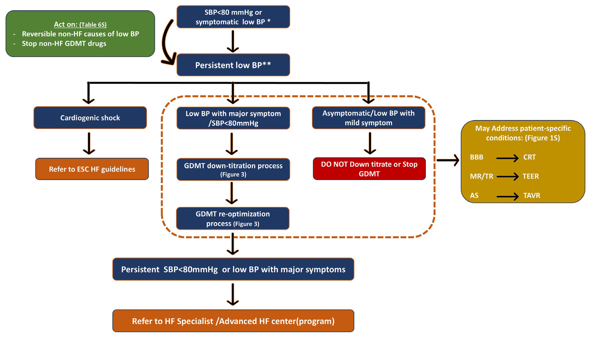
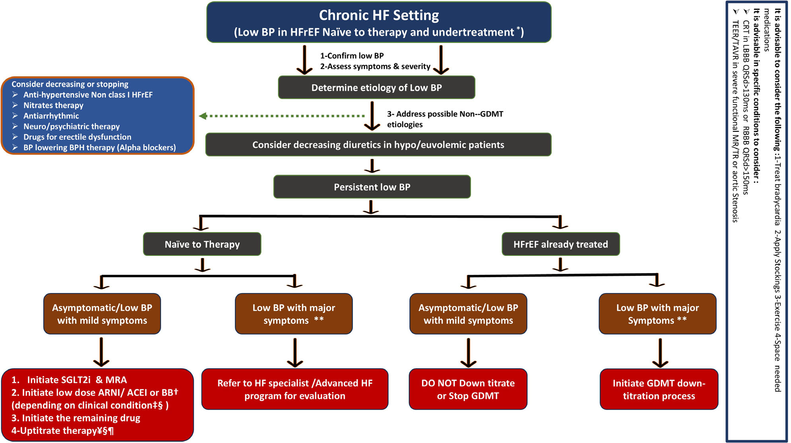
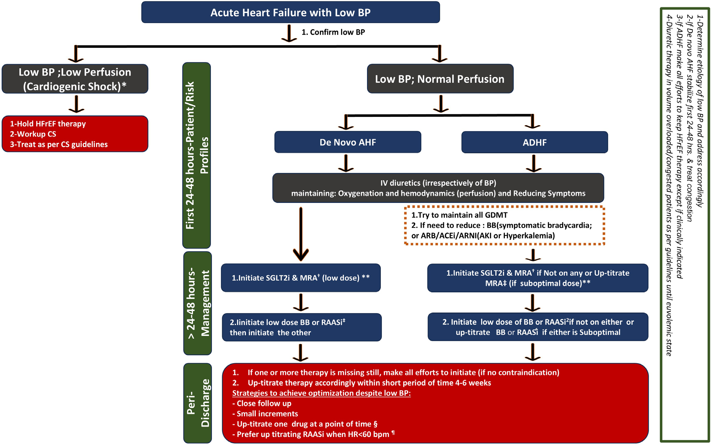
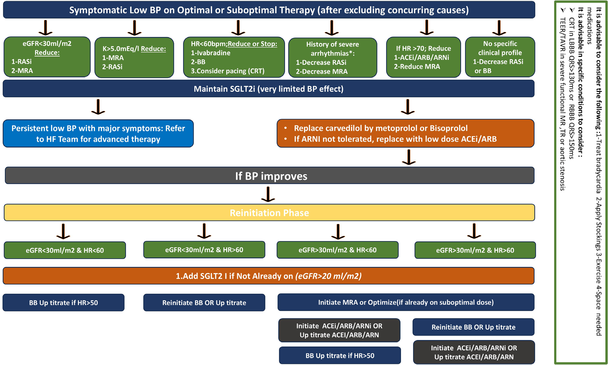

📄 [Abrir o PDF original](https://cdn.jsdelivr.net/gh/muriloffs/cardiology-agent@main/study-inbox/processados/European%20J%20of%20Heart%20Fail%20-%202025%20-%20Skouri%20-%20Clinical%20management%20and%20therapeutic%20optimization%20of%20patients%20with%20heart%20failure.pdf)

# Manejo clínico e otimização terapêutica de pacientes com IC com fração de ejeção reduzida e pressão arterial baixa
### Documento de Consenso Clínico da Heart Failure Association (HFA) da ESC — *European Journal of Heart Failure* (2025)

> 🎓 **Aprofunde:** Este é um *clinical consensus statement* — ou seja, uma posição de especialistas da HFA, e não uma diretriz formal (que teria classes de recomendação I/IIa/IIb e níveis de evidência A/B/C). O objetivo central é combater a **inércia clínica** gerada pela percepção de que "pressão baixa impede otimizar a terapia". Domine desde já a tese principal do documento: **hipotensão assintomática ou minimamente sintomática NÃO é motivo para reduzir ou suspender a terapia guiada por diretrizes (GDMT).**

---

## Resumo estruturado (mensagem central do documento)

Apesar de grandes avanços no manejo da insuficiência cardíaca (IC) e das recomendações das diretrizes ao longo das últimas duas décadas, a evidência do mundo real mostra implementação subótima da terapia médica guiada por diretrizes (GDMT — *guideline-directed medical therapy*) na IC com fração de ejeção reduzida (ICFEr / HFrEF). A pressão arterial (PA) baixa é comum nesses pacientes e representa uma das principais barreiras percebidas para implementar tratamentos que salvam vidas, pois os médicos temem a hipotensão sintomática e suas consequências.

Embora a PA baixa possa ser vista em pacientes hospitalizados com sinais de choque, o cenário mais comum é o de **hipotensão não grave, assintomática**, em pacientes recebendo terapia fundamental para ICFEr — situação na qual a **titulação para baixo (down-titration) ou a descontinuação precoce da GDMT deve ser evitada**. O documento fornece uma visão abrangente da PA baixa na ICFEr, incluindo definição, fatores de risco e efeitos das terapias de IC sobre a PA, e propõe fluxogramas de manejo para otimizar o tratamento da ICFEr no contexto de PA baixa, com o objetivo final de melhorar os desfechos.

**Palavras-chave:** Pressão arterial • Hipotensão • Terapia guiada por diretrizes • Implementação do tratamento • Insuficiência cardíaca com fração de ejeção reduzida.

---

## Preâmbulo

O manejo contemporâneo da ICFEr impactou favoravelmente a sobrevida, as taxas de hospitalização e a qualidade de vida. Os ensaios demonstraram tanto o **benefício precoce** do início imediato quanto os **grandes benefícios das terapias combinadas de IC ao longo do tempo**. Apesar de vários ensaios de referência positivos e das recomendações das diretrizes, a evidência do mundo real mostrou implementação insuficiente da GDMT — em termos de início limitado, titulação incompleta e manutenção a longo prazo.

Diversas barreiras dificultam a implementação efetiva das diretrizes de IC, incluindo fatores relacionados ao **paciente/cuidador**, ao **médico/provedor** e aos **serviços de saúde**. Comorbidades, idade avançada, "polifarmácia" percebida e consciência limitada sobre a IC podem afetar a adesão e contribuir para a inércia clínica na prescrição e otimização das medicações.

Nesse contexto, a PA baixa está entre as barreiras percebidas mais comuns ao início, implementação e escalonamento da GDMT, já que muitas medicações de IC têm efeito hipotensor. De fato, uma pesquisa internacional recente da HFA da ESC, conduzida em 91 países, mostrou que **66% dos respondentes identificaram a hipotensão como uma preocupação maior e 31% como preocupação secundária**.

> 🎓 **Aprofunde:** Guarde esse dado epidemiológico da percepção médica (survey em 91 países — Savarese *et al.*, ref. 21): quase todos os cardiologistas veem hipotensão como problema. O documento inteiro é a resposta a esse medo. A distinção conceitual crucial que ele martela: **PA baixa ≠ má perfusão ≠ mau prognóstico irreversível**. Muitas vezes a hipotensão detectada é assintomática ou minimamente sintomática, e a GDMT deve ser continuada para realizar os grandes benefícios clínicos.

Embora a PA baixa em pacientes com ICFEr esteja ligada a pior prognóstico, o tratamento com GDMT demonstrou **enfraquecer essa associação**, evidenciando os benefícios contínuos das terapias recomendadas mesmo em pacientes com PA baixa. Os grandes ensaios clínicos recentes de IC relataram que o **impacto relativo da terapia farmacológica sobre os desfechos clínicos foi consistente em todas as categorias de PA basal** consideradas para inclusão. Essa aparente contradição destaca a complexidade do tratamento da IC, reforçando a necessidade de abordagens matizadas e personalizadas no manejo desses pacientes.

Nesse sentido, um documento de consenso recente da HFA sobre otimização da GDMT destacou a importância do **perfilamento do paciente** (*patient profiling*), que consiste em adaptar a terapia médica com base em características clínicas como PA, frequência cardíaca (FC) e presença de comorbidades, para guiar o início e a titulação (Rosano *et al.*, ref. 31).

Este documento destaca a percepção da PA baixa como contribuinte-chave para a inércia clínica e barreira à implementação do tratamento, resume as evidências recentes e propõe estratégias para otimizar a GDMT na prática clínica em pacientes com ICFEr e PA baixa.

---

## Prevalência da pressão arterial baixa na população com ICFEr

A prevalência de PA baixa na população com ICFEr depende de fatores como a gravidade da IC, presença de comorbidades, idade, sexo e apresentação clínica. Além disso, varia entre ensaios clínicos e registros de acordo com o limiar numérico escolhido — que muitas vezes é **arbitrário** — e a definição específica utilizada.

**Definições comuns de PA baixa incluem:**
- PA sistólica (PAS) absoluta **< 90 mmHg** ou pressão arterial média (PAM) **< 65 mmHg** em repouso;
- Presença de **hipotensão ortostática** (definida como queda súbita da PAS **> 20 mmHg**, ou da PA diastólica [PAD] **> 10 mmHg** ao levantar-se);
- Hipotensão (PA 90–100 mmHg) com **sintomas clinicamente relevantes** (tontura, síncope, cefaleia, distúrbios visuais, êmese ou fadiga);
- Hipotensão como efeito colateral ou evento adverso da GDMT ou de outras medicações.

> 🎓 **Aprofunde:** Domine essa distinção semântica que o documento faz questão de corrigir: **"hipotensão" e "PA baixa" são semanticamente sinônimos**, mas "hipotensão" é frequentemente usada de forma INCORRETA para descrever PA baixa associada a sintomas. Toda vez que houver PA baixa acompanhada de sintomas, isso deve ser explicitamente declarado, pois tem implicações significativas no manejo. Em hipotensão sintomática, o limiar de PA muitas vezes não é claramente definido e é arbitrário, porque os indivíduos toleram níveis diferentes de PA baixa de forma diferente. Já nos ensaios clínicos, o limiar de inclusão para PA baixa clinicamente relevante é quase sempre fixo (geralmente próximo de 90 mmHg) — mas isso é feito **para prevenir dropouts e preservar o poder estatístico do estudo**, não por razão fisiológica.

**Dados do mundo real (ambulatorial):**
- Registros mostram que cerca de **3–4% da população com ICFEr** têm PA baixa no cenário ambulatorial (definida como PAS < 90 mmHg no Swedish Heart Failure Registry, ou < 95 mmHg no registro CHECK-HF).
- Na base de atenção primária Health Improvement Network (Reino Unido), com 18.677 pacientes adultos monitorados entre 2000 e 2005, a **incidência de hipotensão (PAS ≤ 90 mmHg) foi de 14%** ao longo de um seguimento médio de 3,3 anos. Isso corresponde a uma taxa de **3,17 casos por 100 pacientes-ano**, com incidência notavelmente maior em **mulheres de 18–39 anos**, que experimentaram **17,72 casos por 100 pacientes-ano** (Martin-Perez *et al.*, ref. 41).

**Dados no cenário agudo (hospitalizado):** A prevalência de hipotensão aumenta com a gravidade da IC. Em pacientes com ICFEr hospitalizados por descompensação aguda, a prevalência de PA baixa é previsivelmente maior que no cenário crônico. Entre os registros de IC:
- **ADHERE:** 9% (corte de PAS < 90 mmHg);
- **CHAMP-HF:** 22% (PAS < 110 mmHg);
- **OPTIMIZE-HF:** 25% (limiar de PAS < 120 mmHg).

Como esperado, na população com IC aguda, a incidência de hipotensão está consistentemente ligada à gravidade da doença e aos tratamentos administrados.

> 🎓 **Aprofunde:** Note como a prevalência "explode" conforme se eleva o limiar de PAS adotado (9% a < 90, 22% a < 110, 25% a < 120). Isso ilustra o ponto do documento: a "prevalência de hipotensão" é fortemente dependente da definição arbitrária, e comparar números entre registros sem alinhar os cortes é enganoso.

---

## Impacto prognóstico da pressão arterial baixa

A PA baixa é um importante marcador prognóstico em pacientes com ICFEr, como demonstra sua inclusão em vários modelos de risco: o escore **PROMPT-HF**, o escore **LIFE-HF** e o **Seattle Heart Failure Model**. Por outro lado, **quando os pacientes estão em GDMT, o impacto prognóstico de uma PAS baixa é atenuado**.

No Swedish Heart Failure Registry, o risco composto de morte cardiovascular ou hospitalização por IC aumentou conforme a PAS diminuiu, mostrando um **aumento de 2,5 vezes com PAS < 80 mmHg** e um **aumento de 1,5 vezes com PAS < 100 mmHg**, comparado a uma PAS de 120 mmHg. Notavelmente, a associação entre PA baixa e mortalidade aumentada foi **atenuada em pacientes com ICFEr sob GDMT otimizada**, sugerindo que, além da gravidade da doença, a mortalidade maior também pode se relacionar ao fato de menos pacientes desse grupo atingirem doses-alvo das medicações (Girerd *et al.*, ref. 24).

> 🎓 **Aprofunde:** Esta é uma das referências mais importantes do documento (Girerd *et al.*, Swedish Heart Failure Registry, ref. 24 — [10.1002/ejhf.3066](https://doi.org/10.1002/ejhf.3066)). A mensagem-chave que você deve dominar: **hipotensão na IC é menos deletéria se associada a doses altas ou crescentes de medicação de IC.** Ou seja, o pior prognóstico da PA baixa parece decorrer, em parte, de o paciente estar SUBtratado — e não simplesmente da PA baixa em si. Isso desmonta o raciocínio de "reduzir GDMT porque a PA está baixa".

No registro internacional **QUALIFY**, a associação de FC de repouso elevada com PAS mais baixa identifica os pacientes de maior risco para eventos cardiovasculares.

**No cenário agudo:** dados de registros indicam que a **PAS baixa à admissão** em pacientes hospitalizados por IC é preditor independente de aumento de morbimortalidade. Além disso, a PAS baixa durante a hospitalização por IC foi identificada como preditor independente de eventos clínicos adversos em pacientes com ICFEr no ensaio **EVEREST**.

---

## Efeito dos tratamentos de insuficiência cardíaca sobre a pressão arterial

Vários tratamentos de IC podem reduzir a PA, com as maiores quedas observadas nos tratamentos envolvendo **inibidores do receptor de angiotensina–neprilisina (ARNi)**. Contudo, é importante destacar que as GDMTs provaram ser eficazes e seguras em todos os níveis de PAS basal, e o efeito hipotensor das medicações de ICFEr **diminui à medida que a PAS basal diminui**.

> 🎓 **Aprofunde:** Este é o mecanismo fisiopatológico central para tranquilizar o clínico. Aparentemente contraintuitivo: quanto MENOR a PA basal, MENOR o efeito de queda adicional da PA da GDMT. A explicação: em pacientes com PAS basal baixa, a melhora da função cardíaca induzida pela própria GDMT (↑ débito cardíaco, remodelamento reverso) tende a AUMENTAR a PA ao longo do tempo, compensando ou até superando o efeito vasodilatador direto. Isso aparece repetidamente nas análises por estratos de PAS dos grandes ensaios.

**Evidências por ensaio (efeito sobre PA e hipotensão):**

| Ensaio | Fármaco | Achado sobre PA/hipotensão |
|---|---|---|
| **SOLOIST-WHF** (n=1222, IC recém-piorada, DM2) | Sotagliflozina (iSGLT2) | Hipotensão emergente do tratamento em **6% (tratamento) vs. 4,6% (placebo)** |
| **EMPEROR-Reduced** | Empagliflozina (iSGLT2) | Eventos hipotensivos sintomáticos similares: **5,7% vs. 5,5% (placebo)** |
| **DAPA-HF** | Dapagliflozina (iSGLT2) | Hipotensão sintomática significativamente menor: **0,3% vs. 0,5%** (diferença provável em cortes e população) |
| **COPERNICUS** | Carvedilol | No estrato PAS 85–95 mmHg, sem queda relevante de PA |
| **EMPHASIS-HF** | Eplerenona (MRA) | No estrato PAS basal 95–105 mmHg, **aumento médio de PAS de 2,8 mmHg** vs. placebo em 1 e 6 meses (provável melhora da função cardíaca) |
| **PARADIGM-HF** | Sacubitril/valsartana (ARNi) | Hipotensão foi preditor-chave de não conclusão da fase de *run-in* |

> 🎓 **Aprofunde — o "sinal do estrato baixo":** Domine o padrão que se repete. No **DAPA-HF**, os pacientes no estrato de PA basal mais baixo (95–110 mmHg) tiveram a MENOR queda média de PA com dapagliflozina vs. placebo (−1,50 mmHg), que diminuiu para menos de 1 mmHg após 4 meses (Serenelli *et al.*, ref. 29). No **EMPEROR-Reduced**, mesma tendência de aumento de PA em pacientes assintomáticos com PAS 100–110 mmHg com empagliflozina (Bohm *et al.*, ref. 25). No **COPERNICUS**, mesmo padrão com carvedilol no estrato 85–95 mmHg (ref. 57). No **EMPHASIS-HF**, aumento de PAS com eplerenona no estrato baixo (ref. 30). Ou seja: **nos pacientes de PA mais baixa, a GDMT tende a AUMENTAR a PA, não a derrubá-la.**

No **PARADIGM-HF**, entre os 8.399 pacientes randomizados, **1.343 (16,0%) tiveram hipotensão assintomática** e **936 (11,1%) tiveram hipotensão sintomática** ao menos uma vez após a randomização. Importante: a eficácia e a segurança da sacubitril/valsartana foram mantidas, independentemente da presença ou ausência de hipotensão (Matsumoto *et al.*, ref. 60). Uma análise *post-hoc* (Bohm *et al.*, ref. 28) mostrou que o benefício da sacubitril/valsartana sobre a enalapril foi **consistente em todas as categorias de PAS basal** (< 110; 110 a < 120; 120 a < 130; 130 a < 140; > 140 mmHg), reforçando que a PA baixa não deve impedir a otimização da GDMT. Curiosamente, pacientes no estrato de PAS basal mais baixo (95–110 mmHg) tiveram leve aumento de PA ao longo de todo o seguimento em ambos os braços — efeito mais pronunciado no braço enalapril.

No *run-in* do ensaio **LIFE** (LCZ696 em IC avançada), hipotensão ou sintomas hipotensivos foram as razões primárias para descontinuar a sacubitril/valsartana em baixa dose.

**No cenário agudo**, eventos de PA baixa durante o tratamento de IC foram compreensivelmente mais prevalentes:
- **ASCEND-HF** (nesiritida): **22% tiveram episódio intra-hospitalar de hipotensão** (73,1% assintomática), com fatores-chave incluindo randomização para nesiritida, terapia crônica com metolazona e indicadores de doença grave (ortopneia basal e B3).
- **PIONEER-HF** (sacubitril/valsartana vs. enalapril em IC aguda estabilizada): mesmo com precauções (manter PAS > 100 mmHg nas 6 h prévias, estabilidade clínica, início em dose baixa em PAS mais baixa), **cerca de 20% descontinuaram em cada braço até 8 semanas**, predominantemente por eventos adversos; hipotensão sintomática em **15% (tratamento) vs. 12,7% (placebo)**.
- **STRONG-HF** (otimização rápida guiada por NT-proBNP após IC aguda): **hipotensão em 5% no grupo de alta intensidade vs. 1% no cuidado usual**; hipotensão ortostática em 0,6% (alta intensidade) vs. nenhum (usual); tontura em 0,7% vs. 0,4%.

> 🎓 **Aprofunde:** O **STRONG-HF** (Mebazaa *et al.*, ref. 4 — [10.1016/S0140-6736(22)02076-1](https://doi.org/10.1016/S0140-6736(22)02076-1)) é o ensaio-âncora deste documento. Ele testou uma estratégia de titulação rápida a 100% das doses recomendadas em 2 semanas pós-alta, com seguimento estreito, em pacientes recém-hospitalizados por IC aguda, hemodinamicamente estáveis e com peptídeos natriuréticos elevados. Reduziu sintomas, melhorou qualidade de vida e diminuiu mortalidade por todas as causas ou readmissão por IC em 180 dias. A hipotensão foi mais frequente no braço intensivo, mas em taxa absoluta baixa (5%) — a mensagem: **titular agressiva porém cuidadosamente é seguro e salva vidas.**

No **VICTORIA** (vericiguat, ICFEr com piora recente e PAS basal > 100 mmHg): pacientes com PAS inicial ≥ 110 mmHg tiveram queda inicial mais pronunciada de PAS com vericiguat vs. placebo nas primeiras 16 semanas (especialmente > 75 anos), antes de retornar ao basal. Já os com PAS basal < 110 mmHg mostraram **tendência de aumento de PAS ao longo do tempo em ambos os braços**.

No **GALACTIC-HF** (omecamtiv mecarbil, ICFEr internados e ambulatoriais, PAS ≥ 85 mmHg): o omecamtiv mecarbil **reduziu significativamente o risco de desfechos de IC nos de menor PAS basal (≤ 100 mmHg)** vs. placebo, **sem afetar os valores de PA**.

---

## Pressão arterial baixa no cenário clínico

A PA baixa em pacientes com IC pode ocorrer com ou sem sintomas, tanto em ambiente hospitalar quanto ambulatorial, embora seja mais comum durante hospitalizações por IC. A hipotensão pode ocorrer em vários contextos: pacientes novos ao tratamento de IC, durante o início da terapia e em pacientes já em manejo médico otimizado. Em cada cenário é essencial identificar as **circunstâncias específicas e o momento (timing)** dos episódios de PA baixa, especialmente em relação ao tratamento de IC.

A PA baixa pode surgir de **fatores reversíveis** (superdiurese, medicações concomitantes — passíveis de intervenção) ou de **fatores irreversíveis** (estágio da IC, idade do paciente). A identificação de fatores reversíveis é crucial, pois permite seu tratamento e a subsequente otimização da GDMT. A identificação das causas é particularmente crítica no cenário agudo, onde intervenção rápida costuma ser necessária.

### Fatores contribuintes: cardiovasculares vs. não cardiovasculares

**1. Cardiovasculares:** fatores associados à gravidade da doença e à terapia cardiovascular, incluindo classe NYHA avançada, doença valvar moderada a grave, medicações cardiovasculares (anti-hipertensivos, nitratos, diuréticos) e condições como miocardite e isquemia aguda que agravam a descompensação da IC por reduzir o volume sistólico e/ou aumentar pressões de enchimento. No cenário agudo, a hipotensão frequentemente aponta para redução do débito cardíaco e volume sistólico, apesar da ativação simpática aumentada — que tipicamente aumentaria a resistência periférica e a contratilidade.

**2. Não cardiovasculares:** algumas comorbidades (infecções, doença de Parkinson) ou tratamentos não cardiovasculares (alfabloqueadores para hiperplasia prostática, inibidores da fosfodiesterase-5 para disfunção erétil, ISRS e antidepressivos tricíclicos/tetracíclicos na depressão, levodopa no Parkinson).

**Tabela 1 — Causas potenciais de PA baixa (reconstrução em PT)**

| Cardiovasculares | Não cardiovasculares |
|---|---|
| IC avançada (baixo débito — NYHA IIIb–IV; hiponatremia) | Idade avançada (grupos etários mais altos) |
| Diminuição do volume sanguíneo (sangramento recente, trauma) | Doença renal crônica (DRC) |
| Doença valvar (IM, IT e EAo significativas) | Problemas endócrinos: hipotireoidismo; insuficiência adrenal (Addison); hipoglicemia; diabetes |
| Bradicardia (bloqueios AV) | Infecção (quando grave): ITU, choque séptico |
| Desidratação (superdiurese; calor; diarreia) | Reação alérgica (anafilaxia) |
| Aumento da dose de diurético na semana anterior | Deficiência nutricional: B12 e folato causando anemia |
| Repouso prolongado no leito (hipotensão ortostática) | Deficiência de ferro |
| Gravidez (primeiras 24 semanas) | Doença hepática: cirrose |
| Medicações que baixam PA: BCC; alfabloqueadores; anti-hipertensivos de ação central; diuréticos (tiazídicos); IECA; BRA; betabloqueador | DPOC |
| Medicações para angina: BB; BCC; nitratos | Demência |
| IC não classe I: hidralazina/nitratos | Doença de Parkinson |
| Síncope neuromediada | Depressão |
| Vasorreatividade alterada por comorbidades (diabetes) | Medicações: antidepressivos; antipsicóticos (2ª geração); antagonistas dopaminérgicos; iPDE5; alfabloqueadores (HPB); medicina complementar/alternativa; narcóticos e álcool; betabloqueadores intraoculares (glaucoma) |
| **Agudo–rapidamente progressivo:** cardiomiopatia periparto; miocardite; hipertensão intra-abdominal (ascite); sinais persistentes de congestão exigindo altas doses de diuréticos/vasodilatadores | |

> 🎓 **Aprofunde:** A Tabela 1 é material de decoreba de alto valor prático. O ponto pedagógico crucial: em um paciente diabético com IC, a PA baixa pode ser erroneamente atribuída à "piora da IC", quando na verdade decorre de **disfunção autonômica (neuropatia autonômica cardíaca)** pela longa evolução do diabetes (Pop-Busui, ref. 67). Esses fatores se sobrepõem e se somam sinergicamente. Antes de mexer na GDMT, procure sistematicamente as causas reversíveis desta tabela.

---

## Efeito de dispositivos, procedimentos intervencionistas e fármacos não-classe I na otimização do tratamento da IC

Dispositivos e procedimentos intervencionistas relacionados à IC podem ser considerados mais precocemente em certos casos onde otimizar o tratamento médico da IC é desafiador devido à PA baixa. Essas intervenções têm potencial de melhorar desfechos, aliviar sintomas, melhorar qualidade de vida (QV) e, em última análise, **aumentar a PA**, facilitando a prescrição da terapia baseada em evidências. Embora os dados atuais sejam insuficientes para confirmar se otimizar a GDMT após tais intervenções leva a melhores desfechos, vale sempre reconsiderar essa possibilidade após os procedimentos.

### Terapia de ressincronização cardíaca (TRC/CRT)

A TRC provou ser altamente eficaz em melhorar a QV e reduzir hospitalizações e mortalidade por IC em pacientes selecionados com ICFEr e dissincronia elétrica ventricular esquerda. A implantação da TRC tipicamente resulta em **aumento médio de PA de 5%**, principalmente pela sincronia miocárdica melhorada e melhora da FEVE por remodelamento reverso. Além disso, essa terapia pode permitir a **titulação de betabloqueadores** em pacientes com bradicardia sintomática.

> 🎓 **Aprofunde:** O aumento de PA de ~5% pós-TRC (Ather *et al.*, ref. 77) e a possibilidade de titular betabloqueadores após a TRC (Aranda *et al.*, ref. 78) são conceitos práticos: em paciente com QRS largo/BRE e PA baixa que limita a GDMT, a TRC pode "destravar" a otimização farmacológica.

### Intervenções valvares transcateter e outros procedimentos

A doença valvar (estenose aórtica [EAo] ou regurgitação mitral/tricúspide) no contexto da ICFEr pode induzir ou piorar a hipotensão, principalmente por reduzir o volume sistólico anterógrado e o débito cardíaco.

**Alívio da EAo:** o **PARTNER I** (EAo grave sintomática, alto risco/proibitivo, TAVR) mostrou que **55% dos participantes tiveram aumento da PAS aos 30 dias** pós-procedimento; ao longo de 6 meses houve elevação moderada da PAS de < 10 mmHg e leve queda da PAD de < 5 mmHg. Outro estudo com 105 pacientes com EAo grave relatou **aumento imediato pós-TAVR da PAS (média 15 ± 31 mmHg)**, sustentado por 5 dias em 51% dos pacientes. Embora não haja dados específicos para o cenário de ICFEr, é biologicamente plausível que benefícios semelhantes ocorram nesses pacientes.

**TEER (reparo borda-a-borda transcateter):** o TEER das valvas atrioventriculares pode reduzir o refluxo na circulação pulmonar ou sistêmica, aliviando a congestão e melhorando o fluxo cardíaco anterógrado e a perfusão. Isso pode ter efeitos benéficos sobre PA e função renal, potencialmente facilitando a otimização da GDMT. Uma análise recente do registro **EuroSMR** (coorte grande do mundo real de RM secundária grave e ICFEr) mostrou que **o preditor independente mais significativo da intensificação da terapia médica pós-TEER mitral foi a redução ótima do grau de regurgitação mitral**.

### Fibrilação atrial (FA)

A FA pode afetar adversamente a IC: a ausência do *atrial kick*, o controle inadequado da FC, a adaptação prejudicada da FC às demandas metabólicas e a irregularidade do ritmo podem contribuir para descompensação e menor PA. Observações prévias mostraram que uma sequência irregular de intervalos RR pode **reduzir o débito cardíaco em ~0,8 L/min, independentemente da FC**. Em pacientes com ICFEr, quando se suspeita que a FA contribua significativamente para a PA baixa, **restaurar o ritmo sinusal pode ser uma abordagem razoável**.

### Outros fármacos

**Ivabradina:** o inibidor do canal If do nó sinoatrial reduz eficazmente a FC elevada em pacientes em ritmo sinusal **sem afetar adversamente a PA** (que pode até mostrar leve aumento). É particularmente útil na ICFEr quando a PA baixa limita a otimização/escalonamento de betabloqueadores, permitindo manejo mais efetivo destes ao longo do tempo (crônico e agudo). Uma análise secundária do **SHIFT** demonstrou que reduzir a FC de repouso com ivabradina é eficaz em melhorar desfechos clínicos em pacientes com ICFEr e PAS baixa (Abdin *et al.*, ref. 91).

**Digoxina:** glicosídeo cardíaco com propriedades inotrópicas e efeitos neuro-hormonais moduladores (resetando a sensibilidade barorreceptora, com efeitos parassimpaticomiméticos e antiadrenérgicos). Resulta em ↑ débito cardíaco, redução da pós-carga e ↓ pressão capilar pulmonar na ICFEr. As diretrizes recomendam seu uso na ICFEr como **tratamento de segunda linha para controle de frequência na FA, em combinação com betabloqueadores**. Como a digoxina **não reduz (ou até aumenta) a PA**, pode ser considerada em pacientes com ICFEr, FA e FC elevada, onde a otimização da GDMT é limitada pela PA baixa.

> 🎓 **Aprofunde:** Guarde os dois ensaios em andamento citados. **DECISION** (van Veldhuisen *et al.*, ref. 95 — NCT03783429): digoxina em baixa dose adicionada ao cuidado-padrão em ICFEr/ICFEmr, em RS ou FA. **DIGIT-HF** (Bavendiek *et al.*, ref. 96 — EudraCT 2013-005326-38): digitoxina como adjunto em ICFEr avançada. Conceito-chave para dominar: ivabradina e digoxina são as duas ferramentas "neutras para PA" que permitem controle de FC / benefício terapêutico quando o betabloqueador não pode ser titulado por hipotensão (ivabradina em RS; digoxina em FA).

---

## Abordagem pragmática à pressão arterial baixa

Dado o valor limitado da PA como indicador direto da função cardíaca e da perfusão orgânica, a decisão clínica **não deve ser excessivamente influenciada por leituras de PA baixa**, a menos que sejam criticamente baixas (ex.: **PAS < 80 mmHg**), indicando comprometimento hemodinâmico significativo. Em vez disso, a avaliação do paciente deve focar em **sintomas e/ou perfusão orgânica**, pois a PA baixa nem sempre se correlaciona com perfusão comprometida.

> 🎓 **Aprofunde:** Grave o limiar de alerta do documento: **PAS < 80 mmHg** OU hipotensão causando sintomas maiores em ICFEr crônica — em qualquer cenário — é o limiar crítico que justifica reavaliação do tratamento, incluindo possível ajuste da GDMT. **Hipotensão com sintomas menores NÃO é razão para suspender ou reduzir a GDMT.** Meng (ref. 97) fundamenta que o impacto da hipotensão sobre perfusão orgânica é heterogêneo — PA baixa não é sinônimo de má perfusão.

---

## Pressão arterial baixa em pacientes com IC crônica

Após confirmar perfusão orgânica adequada (ou seja, ausência de choque cardiogênico), o primeiro passo é verificar as leituras de PA e, se sintomas maiores estiverem presentes, avaliar se correspondem aos valores baixos de PA. A **má perfusão orgânica persistente** (possivelmente acompanhada de piora grave da função renal) deve desencadear avaliação abrangente e pode exigir hospitalização ou encaminhamento rápido a um programa de IC avançada.

### Passos iniciais no manejo da PA baixa

_(figura: Tabela 2 — Como determinar se a PA baixa é clinicamente significativa — ver original)_

**Tabela 2 — Como determinar se a PA baixa é clinicamente significativa (reconstrução em PT)**

1. **Medida de PA de consultório:**
   - Obter PA em posição supina/sentada e em pé (por 3 min) para determinar hipotensão ortostática (queda de 20 mmHg na PAS e/ou 10 mmHg na PAD).
   - Se houver sintomas durante hipotensão ortostática confirmada ⟹ **hipotensão sintomática**.
2. **Medidas por MAPA (ABPM):**
   - Considerar MAPA se a hipotensão ortostática não for identificada na medida de consultório.
   - Correlacionar sintomas com episódios de PA baixa no MAPA; se correlacionados ⟹ **hipotensão sintomática**.
3. **Reavaliação:**
   - Se a PA de consultório inicial (± MAPA) não identificou hipotensão sintomática, considerar avaliação repetida durante o seguimento.
4. **Em todos os casos** (mesmo sem sintomas relacionados à hipotensão), abordar fatores desencadeantes não relacionados à ICFEr:
   - a. Condições médicas transitórias (ex.: diarreia ou febre).
   - b. Uso de tratamentos cardiovasculares não recomendados para ICFEr.

Como os sintomas indicativos de hipotensão (tontura, fadiga) são inespecíficos, é essencial estabelecer a **conexão entre sua ocorrência (particularmente ao levantar-se/em posição ereta) e a PA baixa**, medindo a PA em decúbito e em pé. Uma queda de 20 mmHg na PAS e/ou 10 mmHg na PAD dentro dos primeiros 3 min de ortostase sugere causa relacionada à PA. Se a hipotensão ortostática não for confirmada, o **MAPA** pode identificar episódios hipotensivos correlacionados aos sintomas, oferecendo também informação prognóstica importante. Um passo adicional é identificar fatores de hipotensão não relacionados à ICFEr, como condições que levam à desidratação (diarreia, febre, excesso de diurético) ou o uso de tratamentos cardiovasculares não recomendados para ICFEr (**bloqueadores dos canais de cálcio, anti-hipertensivos de ação central ou alfabloqueadores**), que devem ser reduzidos ou descontinuados.

### PA baixa em pacientes ambulatoriais NAÏVE à terapia

Pacientes com ICFEr podem apresentar PA baixa já na apresentação inicial, antes de iniciar a GDMT. PA sistólica baixa naïve persistente ou intolerância à GDMT podem indicar estágio mais avançado de IC. Contudo, **a PA baixa isolada nem define nem está incluída nos critérios maiores para diagnóstico de IC avançada (estágio D, critérios ACC/AHA).**

Se a PA do paciente normalizar após intervenções iniciais (modulação/descontinuação de tratamentos hipotensores não relacionados à IC), a GDMT deve ser iniciada prontamente conforme as diretrizes. Para PA baixa persistente em pacientes assintomáticos ou levemente sintomáticos com ICFEr e perfusão adequada, uma sequência de baixa dose de medicações de IC pode ser iniciada:

1. Como os **iSGLT2 e os MRAs têm o menor efeito sobre a PA, mas efeito benéfico rápido**, devem ser iniciados como primeira classe.
2. Em seguida, considerar iniciar **betabloqueador em baixa dose (se FC > 70 bpm)** OU **dose baixa (50 mg 2×/dia) ou muito baixa (25 mg 2×/dia) de sacubitril/valsartana**, com titulação gradual quando possível.
3. Em caso de baixa tolerância à sacubitril/valsartana, considerar **IECA em baixa dose** (ou BRA, se IECA contraindicado).
4. Betabloqueadores seletivos β1 podem ser preferidos pelo menor efeito hipotensor comparado aos não seletivos com propriedades α, β1, β2 ou vasodilatadoras.
5. Se os betabloqueadores não forem bem tolerados hemodinamicamente, a **ivabradina** pode ser alternativa viável, isolada ou com betabloqueador em baixa dose, ajudando a facilitar sua titulação.
6. Monitoramento estreito é essencial: iniciar/titular **um fármaco por vez com incrementos pequenos** até a maior dose tolerada ou dose-alvo. Diuréticos serão ajustados conforme o volume — superdiurese pode gerar PA mais baixa.

> 🎓 **Aprofunde — sequência prática de ouro:** Domine a hierarquia de sequenciamento por impacto sobre PA. **iSGLT2 e MRA primeiro (mínimo efeito na PA, benefício rápido) → depois betabloqueador ou ARNi/IECA/BRA em baixa dose.** Rosano *et al.* (ref. 31) fundamenta o perfilamento; Kim *et al.* (ref. 104) dá evidência da estratégia de início com dose muito baixa de sacubitril/valsartana (25 mg 2×/dia). A lógica do sequenciamento: começar pelos fármacos que não derrubam PA e que melhoram a função cardíaca cria "margem hemodinâmica" para introduzir os demais.

### PA baixa em pacientes ambulatoriais JÁ EM tratamento

No cenário ambulatorial, a PA baixa durante GDMT é bastante frequente em ICFEr e **nem sempre indica má tolerância aos fármacos de IC**. A hipotensão sintomática na ICFEr crônica, tipicamente caracterizada por tontura leve ao levantar, geralmente pode ser manejada com **educação e aconselhamento do paciente, sem necessidade de reduzir a farmacoterapia de IC**. Os pacientes costumam se sentir tranquilizados e permanecem aderentes quando entendem que a tontura transitória é um efeito colateral de fármacos que prolongam a vida, reduzem hospitalizações e melhoram a QV.

**Regra de bolso:** pacientes **clinicamente estáveis em terapia médica ótima, mas com PA baixa** — sintomáticos ou não — **é improvável que tenham a condição diretamente causada pela GDMT.** Esse cenário comum deve levar prontamente à investigação de outras causas, cardiovasculares (valvopatias, isquemia miocárdica) e não cardiovasculares (início de alfabloqueadores para HPB), para evitar interrupções/reduções/descontinuações desnecessárias das terapias fundamentais de ICFEr.

**Primeiro passo:** avaliar o status de congestão para verificar a viabilidade de **reduzir a dose de diurético**. Explorar sinais clínicos, biológicos ou ultrassonográficos (pulmonar e/ou cardíaco) de congestão. Na ausência de sinais congestivos, os diuréticos podem ser cautelosamente reduzidos. Embora poucos ensaios tenham focado na redução de diuréticos, um ECR recente demonstrou que essa abordagem é factível em pacientes estáveis com ICFEr (Rohde *et al.*, ref. 112). O **monitoramento seriado de níveis estáveis de peptídeos natriuréticos** é útil durante a titulação de diuréticos para assegurar que a congestão não piore significativamente.

Se o ajuste dos diuréticos falhar ou não for viável, e persistir hipotensão sintomática clinicamente relevante, pode ser necessário reconsiderar doses ou tipos de outras medicações de ICFEr — particularmente importante em pacientes em otimização/titulação, onde a PA baixa provavelmente decorre do início ou aumento das medicações de IC.

> 🎓 **Aprofunde:** Fixe a hierarquia de intervenção no paciente crônico já tratado: **(1) buscar outras causas (não é a GDMT!) → (2) reduzir diurético se euvolêmico → (3) só então reconsiderar a GDMT.** E o conceito diferencial que o documento reforça: **iSGLT2 e MRAs raramente causam PA baixa; sacubitril/valsartana é o mais propenso à hipotensão sintomática.** Esse conhecimento guia o sequenciamento e a priorização.

---

## Pressão arterial baixa em pacientes com IC aguda

No cenário de IC aguda, os valores de PA devem ser interpretados dentro do contexto da apresentação clínica e da trajetória do paciente. Em estudo recente de IC aguda, **pacientes com PAS baixa e sem sinais de hipoperfusão tiveram prognóstico similar ao dos com PAS normal** (Rossello *et al.*, ref. 114). O **perfilamento clínico baseado em congestão e perfusão é crucial**, pois a PA isolada é insuficiente para guiar a terapia e prever o prognóstico.

A maioria dos pacientes no cenário agudo está congesta e bem perfundida (fenótipo **"úmido e quente"** da classificação de Forrester), logo sem contraindicação para continuar ou iniciar GDMT após atingir estabilidade clínica. Em casos de IC aguda com PA baixa, é crucial **excluir choque cardiogênico** (definido por PAS < 90 mmHg com sinais de hipoperfusão orgânica), pois a abordagem seguirá as diretrizes respectivas. Deve-se ter em mente que, nas fases iniciais do choque cardiogênico, a **hipoperfusão pode ocorrer sem hipotensão**, já que a PA pode ser mantida por vasoconstrição compensatória às custas da perfusão e oxigenação tecidual.

> 🎓 **Aprofunde:** Este é um ponto de segurança clínica de alto impacto: **choque cardiogênico pode existir com PA "normal" (pré-choque / choque normotenso)**. Não se deixe tranquilizar por uma PAS aceitável — avalie perfusão (lactato, débito urinário, extremidades, estado mental). van Diepen *et al.* (ref. 120) e Chioncel *et al.* (ref. 121) são as referências de manejo do choque cardiogênico.

_(figura: Figura 2 — Algoritmo de otimização do tratamento na ICFEr com PA baixa no cenário de IC aguda — ver original)_

### Manejo por fases no cenário agudo

**Primeiras 48 h de admissão:** os objetivos primários são estabilizar hemodinamicamente, tratar sobrecarga volêmica/congestão e assegurar oxigenação tecidual adequada. A continuação/início da GDMT deve ser avaliada conforme o fenótipo clínico. Tipicamente, nos fenótipos **"seco e frio"** e **"úmido e frio"**, a terapia de IC pode ser suspensa ou reduzida, especialmente betabloqueadores e/ou inibidores do SRA.

**Após as primeiras 48 h:** o tratamento pode ser iniciado, reiniciado ou titulado conforme o cenário clínico em evolução e as características do paciente (GDMT ótima ou subótima, IC aguda *de novo*, etc.). Tipicamente, o melhor é **começar/reiniciar pelas medicações de menor impacto sobre a PA (iSGLT2 ou MRAs em baixa dose)**, introduzindo gradualmente os demais fármacos por titulação conservadora. Esse processo pode se estender por **4–6 semanas**, exigindo monitoramento estreito e ajustes incrementais pequenos, com cada fármaco adicionado sequencialmente. Todos os esforços devem ser feitos para iniciar qualquer terapia fundamental faltante, salvo contraindicação.

Essa abordagem de otimização precoce é sustentada pelo **STRONG-HF**, que demonstrou que uma estratégia intensiva (titulação da GDMT a 100% das doses recomendadas em 2 semanas de alta e seguimento estreito após admissão por IC aguda) reduziu significativamente sintomas, melhorou QV e diminuiu mortalidade por todas as causas ou readmissões por IC em 180 dias vs. cuidado usual.

> 🎓 **Aprofunde — subanálises do STRONG-HF que você precisa dominar:**
> - **Chioncel *et al.* (ref. 122):** a presença de comorbidades não cardiovasculares ou idade avançada NÃO restringiu a titulação rápida de alta intensidade nem diminuiu o benefício no desfecho primário.
> - **Pagnesi *et al.* (ref. 123):** PA basal baixa aumentou a probabilidade de atingir os indicadores de segurança usados para guiar a titulação (eGFR < 30 mL/min/1,73 m²; potássio > 5,0 mmol/L; **PAS < 95 mmHg**; FC < 55 bpm; NT-proBNP > 10% acima do valor pré-alta). Isso resultou em administração de doses menores de GDMT, menor percentual de dose ótima e menos melhora de QV — **porém o benefício da estratégia intensiva em reduzir morbimortalidade PERSISTIU independentemente da PAS basal.** Conclusão prática: pacientes com PA mais baixa se recuperando de IC aguda podem exigir **protocolo de titulação mais gradual e monitoramento mais estreito** pós-alta, mas ainda devem ser otimizados.

---

## Condições clínicas específicas

Em pacientes com ICFEr e PA baixa, é crucial reconhecer que, quando certas condições clínicas coexistem, **a PA baixa isolada, a hipotensão sintomática ou a hipoperfusão podem ser particularmente deletérias** e afetar adversamente os desfechos. Essas condições incluem:
- Doença vascular periférica significativa, especialmente com úlceras/feridas que não cicatrizam;
- Estenose carotídea bilateral significativa não tratada;
- Acidente cerebrovascular recente (AIT ou AVC);
- Isquemia intestinal ou angina abdominal;
- Doença renal terminal em diálise;
- Condições de disfunção autonômica.

O manejo eficaz nesses cenários exige uma **abordagem de equipe multidisciplinar** para melhorar os desfechos.

---

## Como sequenciar a descontinuação de fármacos em diferentes cenários

Quando todas as estratégias para manejar a PA baixa na ICFEr já foram abordadas (parar, reduzir ou trocar tratamentos não indicados pelas diretrizes de 2021, terapias de comorbidades e outros fármacos sem benefício comprovado) e persistirem **sintomas maiores ou PA gravemente baixa (< 80 mmHg)**, pode ser necessário reduzir ou descontinuar um ou mais fármacos da GDMT.

É importante reconhecer que **os maus desfechos associados aos efeitos colaterais dos fármacos de IC podem decorrer da DESCONTINUAÇÃO da terapia, e não do efeito colateral em si.** Evidências que sustentam esse conceito:
- **Rossignol (EORP HF Long-Term Registry, ref. 124):** relação entre hipercalemia, descontinuação de inibidores do SRAA (RAASi) e desfechos. A hipercalemia serve como marcador de risco que contribui para descontinuação e uso subótimo, resultando em maior mortalidade.
- **TOPCAT-Americas (Ferreira *et al.*, ref. 125):** pacientes randomizados para espironolactona receberam doses menores e descontinuaram o fármaco em até 30% no primeiro ano entre os com hipercalemia e baixa TFG. A **descontinuação da espironolactona associou-se a risco 2 a 4 vezes maior de eventos adversos subsequentes.**
- **Projeto SCREAM (Trevisan *et al.*, ref. 126):** interromper um MRA após episódio de hipercalemia associou-se a **menor risco de hipercalemia recorrente, mas MAIOR risco de morte ou eventos cardiovasculares.**

> 🎓 **Aprofunde:** Este é um dos raciocínios mais importantes do documento. O paradoxo terapêutico: **tratar o efeito colateral suspendendo o fármaco pode ser mais perigoso que o próprio efeito colateral.** A hipercalemia é o exemplo-padrão — suspender o MRA reduz a hipercalemia, mas aumenta mortalidade. Por analogia, suspender GDMT por hipotensão leve pode piorar o prognóstico. Domine a lógica: a estratégia deve ser sempre a de **manter o máximo de GDMT possível e reintroduzir o mais cedo possível**, não a de suspender.

_(figura: Figura 3 — Algoritmo de down-titration e reotimização do tratamento de IC em ICFEr com PA baixa — ver original)_

Durante o processo de descontinuação sequenciada, deve-se concentrar todos os esforços em **continuar iSGLT2 e potencialmente MRAs** (se não contraindicados), pois têm o menor impacto sobre a PA. Concomitantemente, para aliviar sintomas de PA baixa e manter maior percentual de GDMT, implementar **intervenções não farmacológicas:**
- **Espaçar as medicações** ao longo do dia para reduzir o efeito hipotensor sinérgico dos fármacos de IC;
- **Exercício e treinamento físico** — comprovadamente melhoram tanto a hipotensão ortostática quanto a PA baixa;
- **Meias/faixas de compressão** para minimizar quedas ortostáticas de PA.

Como a evidência do mundo real sugere que descontinuar ou não reiniciar a terapia de IC aumenta significativamente a mortalidade, é essencial **reintroduzir o tratamento o mais cedo possível**. Dicas práticas para facilitar o início/reinício da GDMT:

- **Sempre reintroduzir na menor dose possível** e titular com cuidado sob monitoramento estreito, evitando reiniciar dois fármacos simultaneamente.
- **Iniciar com dose baixa ou muito baixa de ARNi.** Se não tolerado, trocar por dose baixa de IECA ou BRA (menor impacto sobre a PA).
- **Considerar trocar carvedilol ou nebivolol por um betabloqueador seletivo sem propriedades vasodilatadoras**, como metoprolol ou bisoprolol.
- Se a FC-alvo (< 70 bpm) não for atingida e aumentar a dose do betabloqueador não for viável, **considerar adicionar ivabradina (RS) ou digoxina (FA).**
- Para todos os pacientes com ICFEr, PA baixa e **eGFR > 20 mL/min/1,73 m²**, iniciar iSGLT2. Se já em iSGLT2, considerar **titular MRA se eGFR > 25–30 mL/min/1,73 m²**, ou **priorizar betabloqueadores se eGFR < 25–30 mL/min/1,73 m².**
- Se a reintrodução resultar em **PA baixa sintomática persistente e/ou hipoperfusão, encaminhar a uma equipe de IC avançada.**

> 🎓 **Aprofunde:** A troca de carvedilol/nebivolol (que têm vasodilatação — bloqueio α no carvedilol; NO no nebivolol) por bisoprolol/metoprolol (β1-seletivos puros) é uma manobra prática elegante para reduzir o efeito hipotensor mantendo o betabloqueio. E note a lógica renal: em eGFR baixo (< 25–30), prioriza-se o betabloqueador sobre a titulação do MRA (para não arriscar hipercalemia/piora renal), mas o iSGLT2 é mantido/iniciado até eGFR > 20.

---

## Lacunas de evidência e implicações para pesquisa

Os grandes ensaios de IC tipicamente incluíram pacientes com PA normal, deixando os pacientes com **PA muito baixa (ex.: PAS < 90 ou 95 mmHg) notavelmente sub-representados** (Vaduganathan *et al.*, ref. 132). Ensaios pragmáticos futuros são cruciais para abordar as lacunas de pesquisa. Esses estudos devem focar em:

- **Avaliar a eficácia e a segurança da GDMT em pacientes com PA muito baixa**, particularmente ao usar medicações que reduzem significativamente a PA (IECA, BRA, ARNi).
- **Testar as estratégias de manejo de PA baixa propostas**, para fornecer evidência randomizada em apoio a este consenso de especialistas.
- **Investigar o impacto de descontinuar medicações não prolongadoras da vida** para melhorar os desfechos da GDMT (sobrevida e QV), bem como os benefícios potenciais de reduzir diuréticos para diminuir eventos relacionados à IC, incluindo hospitalizações.
- **Avaliar os efeitos de procedimentos cardíacos intervencionistas** (TRC, TAVR, TEER mitral/tricúspide) e da restauração do ritmo sinusal na FA sobre PA, otimização da GDMT e desfechos.

Abordar essas lacunas é crucial para desenvolver estratégias de tratamento mais eficazes para pacientes com ICFEr e PA baixa, potencialmente afetando abordagens de tratamento globais.

---

## Mensagens para levar para casa (Tabela 3)

> 🎓 **Aprofunde:** Esta tabela é o "cartão de bolso" do documento. Memorize-a integralmente — é o resumo operacional da conduta.

1. Hipotensão **assintomática ou levemente sintomática NÃO deve ser motivo** para redução ou cessação da GDMT.
2. Redução ou cessação de uma ou mais GDMT é aconselhável em caso de **PAS < 80 mmHg ou PA baixa com sintomas relevantes**.
3. Na IC crônica, **sempre avaliar sintomas de hipotensão/hipotensão ortostática**.
4. Na IC aguda, **sempre avaliar a perfusão orgânica** (choque ou pré-choque).
5. O limiar de PA como critério de exclusão em ensaios clínicos é definido primariamente para **prevenir dropouts e manter o poder estatístico** — não é limiar fisiológico.
6. **iSGLT2 e MRAs têm o menor efeito sobre a PA** e, em grupos de PA baixa, podem até aumentá-la.
7. Em condições específicas, outros fármacos ou dispositivos podem facilitar a otimização da GDMT (ivabradina, TRC, TEER, digoxina).
8. Em condições de PA baixa, o **primeiro passo é parar medicações cardíacas desnecessárias** e procurar causas transitórias e reversíveis.
9. **Coordenação multidisciplinar** para selecionar alternativas com menor efeito hipotensor para medicações não cardíacas (HPB, antidepressivos).
10. Quando descontinuação/redução de terapia for necessária: **começar pela menos tolerada**.
11. Em hipotensão persistente com incapacidade de iniciar/titular GDMT: **encaminhar precocemente ao especialista em IC ou a programas de terapia avançada**.
12. Quando a PA melhorar, sempre considerar **reinício/rechallenge** dos fármacos, começando pelos mais bem tolerados.
13. Esforçar-se para atingir a terapia ótima:
    - Espaçar medicações em doses divididas ao longo do dia;
    - Usar betabloqueador seletivo ou considerar ivabradina;
    - Se ARNi não tolerado, tentar introduzir e otimizar IECA/BRA.

---

## Conclusão

Para melhorar a implementação das recomendações das diretrizes de IC, é crucial abordar os fatores clínicos que limitam o início, a otimização e a continuação da GDMT, a fim de melhorar o cuidado e os desfechos de pacientes com ICFEr. Este documento destaca a importância da GDMT em pacientes com ICFEr e PA baixa, define a hipotensão clinicamente relevante, propõe um caminho para identificar suas etiologias e estratégias para manejar os tratamentos de IC em diferentes cenários. Enfatiza também o papel das **intervenções não farmacológicas** que ajudam a aumentar a PA e otimizar a GDMT.

O objetivo principal é auxiliar os provedores de saúde (cardiologistas, intensivistas e clínicos gerais) a **superar a inércia clínica**, melhorando o início e a otimização da GDMT e reduzindo a taxa de descontinuação do tratamento de IC. Reforça a necessidade de que médicos de outras subespecialidades **consultem a equipe de IC antes de reduzir ou suspender medicações de ICFEr** devido à percepção de leituras de "PA baixa". Por fim, é um chamado à ação para abordar as significativas lacunas de conhecimento nesta área.

---

## Fluxograma-resumo (Graphical Abstract — reconstrução em passos)

_(figura: Graphical Abstract — Abordagem proposta para manejo e otimização terapêutica em ICFEr com PA baixa — ver original)_

1. **Ponto de partida:** PAS < 80 mmHg ou PA baixa sintomática (com sintomas maiores ou leves).
2. **Agir primeiro (Tabela 6S):** tratar causas reversíveis não relacionadas à IC + parar fármacos não-GDMT que baixam a PA.
3. **PA baixa persistente** (PAS < 80 mmHg ou PA baixa sintomática ou assintomática) → dividir em três ramos:
   - **Choque cardiogênico** → seguir as diretrizes de IC da ESC.
   - **PA baixa com sintoma maior / PAS < 80 mmHg** → processo de down-titulação da GDMT (Figura 3) → processo de reotimização da GDMT (Figura 3).
   - **PA baixa assintomática / com sintoma leve** → **NÃO fazer down-titulação nem parar a GDMT.**
4. **Em paralelo, endereçar condições específicas do paciente (Figura S1):** BRE/BBB → TRC; IM/IT → TEER; EAo → TAVR.
5. **Se persistir PAS < 80 mmHg ou PA baixa com sintomas maiores** → encaminhar a especialista em IC / centro (programa) de IC avançada.

---

## Referências citadas

1. McDonagh TA, Metra M, Adamo M, *et al.* 2021 ESC Guidelines for the diagnosis and treatment of acute and chronic heart failure. *Eur J Heart Fail* 2022;24:4–131. [10.1002/ejhf.2333](https://doi.org/10.1002/ejhf.2333) — [🔍 buscar](https://scholar.google.com/scholar?q=McDonagh+TA%2C+Metra+M%2C+Adamo+M%2C+%2Aet+al.%2A+2021+ESC+Guidelines+for+the+diagnosis+and+treatment+of+acute+and+chronic+heart+failure.+%2AEur+J+Heart+Fail%2A+2022%3B24%3A4%E2%80%93131.)
2. McDonagh TA, Metra M, Adamo M, *et al.* 2023 Focused Update of the 2021 ESC Guidelines. *Eur J Heart Fail* 2024;26:5–17. [10.1002/ejhf.3024](https://doi.org/10.1002/ejhf.3024) — [🔍 buscar](https://scholar.google.com/scholar?q=McDonagh+TA%2C+Metra+M%2C+Adamo+M%2C+%2Aet+al.%2A+2023+Focused+Update+of+the+2021+ESC+Guidelines.+%2AEur+J+Heart+Fail%2A+2024%3B26%3A5%E2%80%9317.)
3. Vaduganathan M, Claggett BL, Jhund PS, *et al.* Estimating lifetime benefits of comprehensive disease-modifying pharmacological therapies in HFrEF. *Lancet* 2020;396:121–128. [10.1016/S0140-6736(20)30748-0](https://doi.org/10.1016/S0140-6736(20)30748-0) — [🔍 buscar](https://scholar.google.com/scholar?q=Vaduganathan+M%2C+Claggett+BL%2C+Jhund+PS%2C+%2Aet+al.%2A+Estimating+lifetime+benefits+of+comprehensive+disease-modifying+pharmacological+therapies+in+HFrEF.+%2ALancet%2A+2020%3B396%3A121%E2%80%93128.)
4. Mebazaa A, Davison B, Chioncel O, *et al.* Safety, tolerability and efficacy of up-titration of GDMT for acute heart failure (STRONG-HF). *Lancet* 2022;400:1938–1952. [10.1016/S0140-6736(22)02076-1](https://doi.org/10.1016/S0140-6736(22)02076-1) — [🔍 buscar](https://scholar.google.com/scholar?q=Mebazaa+A%2C+Davison+B%2C+Chioncel+O%2C+%2Aet+al.%2A+Safety%2C+tolerability+and+efficacy+of+up-titration+of+GDMT+for+acute+heart+failure+%28STRONG-HF%29.+%2ALancet%2A+2022%3B400%3A1938%E2%80%931952.)
11. Linssen GCM, Veenis JF, Brunner-La Rocca HP, *et al.* Differences in guideline-recommended heart failure medication (CHECK-HF registry). *Neth Heart J* 2020;28:334–344. [10.1007/s12471-020-01421-1](https://doi.org/10.1007/s12471-020-01421-1) — [🔍 buscar](https://scholar.google.com/scholar?q=Linssen+GCM%2C+Veenis+JF%2C+Brunner-La+Rocca+HP%2C+%2Aet+al.%2A+Differences+in+guideline-recommended+heart+failure+medication+%28CHECK-HF+registry%29.+%2ANeth+Heart+J%2A+2020%3B28%3A334%E2%80%93344.)
12. Greene SJ, Butler J, Albert NM, *et al.* Medical therapy for HFrEF: the CHAMP-HF registry. *J Am Coll Cardiol* 2018;72:351–366. [10.1016/j.jacc.2018.04.070](https://doi.org/10.1016/j.jacc.2018.04.070) — [🔍 buscar](https://scholar.google.com/scholar?q=Greene+SJ%2C+Butler+J%2C+Albert+NM%2C+%2Aet+al.%2A+Medical+therapy+for+HFrEF%3A+the+CHAMP-HF+registry.+%2AJ+Am+Coll+Cardiol%2A+2018%3B72%3A351%E2%80%93366.)
16. Komajda M, Anker SD, Cowie MR, *et al.* Physicians' adherence to guideline-recommended medications in HFrEF (QUALIFY global survey). *Eur J Heart Fail* 2016;18:514–522. [10.1002/ejhf.510](https://doi.org/10.1002/ejhf.510) — [🔍 buscar](https://scholar.google.com/scholar?q=Komajda+M%2C+Anker+SD%2C+Cowie+MR%2C+%2Aet+al.%2A+Physicians%27+adherence+to+guideline-recommended+medications+in+HFrEF+%28QUALIFY+global+survey%29.+%2AEur+J+Heart+Fail%2A+2016%3B18%3A514%E2%80%93522.)
17. Savarese G, Lindberg F, Cannata A, *et al.* How to tackle therapeutic inertia in HFrEF. *Eur J Heart Fail* 2024;26:1278–1297. [10.1002/ejhf.3295](https://doi.org/10.1002/ejhf.3295) — [🔍 buscar](https://scholar.google.com/scholar?q=Savarese+G%2C+Lindberg+F%2C+Cannata+A%2C+%2Aet+al.%2A+How+to+tackle+therapeutic+inertia+in+HFrEF.+%2AEur+J+Heart+Fail%2A+2024%3B26%3A1278%E2%80%931297.)
21. Savarese G, Lindberg F, Christodorescu RM, *et al.* Physician perceptions, attitudes, and strategies towards implementing GDMT in HFrEF (survey HFA da ESC). *Eur J Heart Fail* 2024;26:1408–1418. [10.1002/ejhf.3214](https://doi.org/10.1002/ejhf.3214) — [🔍 buscar](https://scholar.google.com/scholar?q=Savarese+G%2C+Lindberg+F%2C+Christodorescu+RM%2C+%2Aet+al.%2A+Physician+perceptions%2C+attitudes%2C+and+strategies+towards+implementing+GDMT+in+HFrEF+%28survey+HFA+da+ESC%29.+%2AEur+J+Heart+Fail%2A+2024%3B26%3A1408%E2%80%931418.)
24. Girerd N, Coiro S, Benson L, *et al.* Hypotension in heart failure is less harmful if associated with high or increasing doses of heart failure medication (Swedish Heart Failure Registry). *Eur J Heart Fail* 2024;26:359–369. [10.1002/ejhf.3066](https://doi.org/10.1002/ejhf.3066) — [🔍 buscar](https://scholar.google.com/scholar?q=Girerd+N%2C+Coiro+S%2C+Benson+L%2C+%2Aet+al.%2A+Hypotension+in+heart+failure+is+less+harmful+if+associated+with+high+or+increasing+doses+of+heart+failure+medication+%28Swedish+Heart+Failure+Registry%29.)
25. Bohm M, Anker SD, Butler J, *et al.* Empagliflozin improves cardiovascular and renal outcomes irrespective of systolic blood pressure (EMPEROR-Reduced). *J Am Coll Cardiol* 2021;78:1337–1348. [10.1016/j.jacc.2021.07.049](https://doi.org/10.1016/j.jacc.2021.07.049) — [🔍 buscar](https://scholar.google.com/scholar?q=Bohm+M%2C+Anker+SD%2C+Butler+J%2C+%2Aet+al.%2A+Empagliflozin+improves+cardiovascular+and+renal+outcomes+irrespective+of+systolic+blood+pressure+%28EMPEROR-Reduced%29.+%2AJ+Am+Coll+Cardiol%2A+2021%3B78%3A1337%E2%80%931348.)
26. Komajda M, Bohm M, Borer JS, *et al.* Efficacy and safety of ivabradine according to blood pressure level in SHIFT. *Eur J Heart Fail* 2014;16:810–816. [10.1002/ejhf.114](https://doi.org/10.1002/ejhf.114) — [🔍 buscar](https://scholar.google.com/scholar?q=Komajda+M%2C+Bohm+M%2C+Borer+JS%2C+%2Aet+al.%2A+Efficacy+and+safety+of+ivabradine+according+to+blood+pressure+level+in+SHIFT.+%2AEur+J+Heart+Fail%2A+2014%3B16%3A810%E2%80%93816.)
27. Lam CSP, Mulder H, Lopatin Y, *et al.* Blood pressure and safety events with vericiguat (VICTORIA). *J Am Heart Assoc* 2021;10:e021094. [10.1161/JAHA.121.021094](https://doi.org/10.1161/JAHA.121.021094) — [🔍 buscar](https://scholar.google.com/scholar?q=Lam+CSP%2C+Mulder+H%2C+Lopatin+Y%2C+%2Aet+al.%2A+Blood+pressure+and+safety+events+with+vericiguat+%28VICTORIA%29.+%2AJ+Am+Heart+Assoc%2A+2021%3B10%3Ae021094.)
28. Bohm M, Young R, Jhund PS, *et al.* Systolic blood pressure, cardiovascular outcomes and efficacy and safety of sacubitril/valsartan (PARADIGM-HF). *Eur Heart J* 2017;38:1132–1143. [10.1093/eurheartj/ehw570](https://doi.org/10.1093/eurheartj/ehw570) — [🔍 buscar](https://scholar.google.com/scholar?q=Bohm+M%2C+Young+R%2C+Jhund+PS%2C+%2Aet+al.%2A+Systolic+blood+pressure%2C+cardiovascular+outcomes+and+efficacy+and+safety+of+sacubitril%2Fvalsartan+%28PARADIGM-HF%29.+%2AEur+Heart+J%2A+2017%3B38%3A1132%E2%80%931143.)
29. Serenelli M, Bohm M, Inzucchi SE, *et al.* Effect of dapagliflozin according to baseline systolic blood pressure (DAPA-HF). *Eur Heart J* 2020;41:3402–3418. [10.1093/eurheartj/ehaa496](https://doi.org/10.1093/eurheartj/ehaa496) — [🔍 buscar](https://scholar.google.com/scholar?q=Serenelli+M%2C+Bohm+M%2C+Inzucchi+SE%2C+%2Aet+al.%2A+Effect+of+dapagliflozin+according+to+baseline+systolic+blood+pressure+%28DAPA-HF%29.+%2AEur+Heart+J%2A+2020%3B41%3A3402%E2%80%933418.)
30. Serenelli M, Jackson A, Dewan P, *et al.* Mineralocorticoid receptor antagonists, blood pressure, and outcomes in HFrEF. *JACC Heart Fail* 2020;8:188–198. [10.1016/j.jchf.2019.09.011](https://doi.org/10.1016/j.jchf.2019.09.011) — [🔍 buscar](https://scholar.google.com/scholar?q=Serenelli+M%2C+Jackson+A%2C+Dewan+P%2C+%2Aet+al.%2A+Mineralocorticoid+receptor+antagonists%2C+blood+pressure%2C+and+outcomes+in+HFrEF.+%2AJACC+Heart+Fail%2A+2020%3B8%3A188%E2%80%93198.)
31. Rosano GMC, Moura B, Metra M, *et al.* Patient profiling in heart failure for tailoring medical therapy (consenso HFA da ESC). *Eur J Heart Fail* 2021;23:872–881. [10.1002/ejhf.2206](https://doi.org/10.1002/ejhf.2206) — [🔍 buscar](https://scholar.google.com/scholar?q=Rosano+GMC%2C+Moura+B%2C+Metra+M%2C+%2Aet+al.%2A+Patient+profiling+in+heart+failure+for+tailoring+medical+therapy+%28consenso+HFA+da+ESC%29.+%2AEur+J+Heart+Fail%2A+2021%3B23%3A872%E2%80%93881.)
35. Gheorghiade M, Abraham WT, Albert NM, *et al.* Systolic blood pressure at admission, clinical characteristics, and outcomes (OPTIMIZE-HF). *JAMA* 2006;296:2217–2226. [10.1001/jama.296.18.2217](https://doi.org/10.1001/jama.296.18.2217) — [🔍 buscar](https://scholar.google.com/scholar?q=Gheorghiade+M%2C+Abraham+WT%2C+Albert+NM%2C+%2Aet+al.%2A+Systolic+blood+pressure+at+admission%2C+clinical+characteristics%2C+and+outcomes+%28OPTIMIZE-HF%29.+%2AJAMA%2A+2006%3B296%3A2217%E2%80%932226.)
41. Martin-Perez M, Michel A, Ma M, García Rodríguez LA. Development of hypotension in patients newly diagnosed with heart failure in UK general practice. *BMJ Open* 2019;9:e028750. [10.1136/bmjopen-2018-028750](https://doi.org/10.1136/bmjopen-2018-028750) — [🔍 buscar](https://scholar.google.com/scholar?q=Martin-Perez+M%2C+Michel+A%2C+Ma+M%2C+Garc%C3%ADa+Rodr%C3%ADguez+LA.+Development+of+hypotension+in+patients+newly+diagnosed+with+heart+failure+in+UK+general+practice.+%2ABMJ+Open%2A+2019%3B9%3Ae028750.)
42. Fonarow GC, Yancy CW, Heywood JT; ADHERE. Adherence to heart failure quality-of-care indicators in US hospitals. *Arch Intern Med* 2005;165:1469–1477. [10.1001/archinte.165.13.1469](https://doi.org/10.1001/archinte.165.13.1469) — [🔍 buscar](https://scholar.google.com/scholar?q=Fonarow+GC%2C+Yancy+CW%2C+Heywood+JT%3B+ADHERE.+Adherence+to+heart+failure+quality-of-care+indicators+in+US+hospitals.+%2AArch+Intern+Med%2A+2005%3B165%3A1469%E2%80%931477.)
43. Patel PA, Heizer G, O'Connor CM, *et al.* Hypotension during hospitalization for acute heart failure (ASCEND-HF). *Circ Heart Fail* 2014;7:918–925. [10.1161/CIRCHEARTFAILURE.113.000872](https://doi.org/10.1161/CIRCHEARTFAILURE.113.000872) — [🔍 buscar](https://scholar.google.com/scholar?q=Patel+PA%2C+Heizer+G%2C+O%27Connor+CM%2C+%2Aet+al.%2A+Hypotension+during+hospitalization+for+acute+heart+failure+%28ASCEND-HF%29.+%2ACirc+Heart+Fail%2A+2014%3B7%3A918%E2%80%93925.)
52. Ambrosy AP, Vaduganathan M, Mentz RJ, *et al.* Clinical profile and prognostic value of low systolic blood pressure (EVEREST). *Am Heart J* 2013;165:216–225. [10.1016/j.ahj.2012.11.004](https://doi.org/10.1016/j.ahj.2012.11.004) — [🔍 buscar](https://scholar.google.com/scholar?q=Ambrosy+AP%2C+Vaduganathan+M%2C+Mentz+RJ%2C+%2Aet+al.%2A+Clinical+profile+and+prognostic+value+of+low+systolic+blood+pressure+%28EVEREST%29.+%2AAm+Heart+J%2A+2013%3B165%3A216%E2%80%93225.)
53. Vardeny O, Claggett B, Kachadourian J, *et al.* Incidence, predictors, and outcomes associated with hypotensive episodes (PARADIGM-HF). *Circ Heart Fail* 2018;11:e004745. [10.1161/CIRCHEARTFAILURE.117.004745](https://doi.org/10.1161/CIRCHEARTFAILURE.117.004745) — [🔍 buscar](https://scholar.google.com/scholar?q=Vardeny+O%2C+Claggett+B%2C+Kachadourian+J%2C+%2Aet+al.%2A+Incidence%2C+predictors%2C+and+outcomes+associated+with+hypotensive+episodes+%28PARADIGM-HF%29.+%2ACirc+Heart+Fail%2A+2018%3B11%3Ae004745.)
54. Bhatt DL, Szarek M, Steg PG, *et al.* Sotagliflozin in patients with diabetes and recent worsening heart failure (SOLOIST-WHF). *N Engl J Med* 2021;384:117–128. [10.1056/NEJMoa2030183](https://doi.org/10.1056/NEJMoa2030183) — [🔍 buscar](https://scholar.google.com/scholar?q=Bhatt+DL%2C+Szarek+M%2C+Steg+PG%2C+%2Aet+al.%2A+Sotagliflozin+in+patients+with+diabetes+and+recent+worsening+heart+failure+%28SOLOIST-WHF%29.+%2AN+Engl+J+Med%2A+2021%3B384%3A117%E2%80%93128.)
55. Packer M, Anker SD, Butler J, *et al.* Cardiovascular and renal outcomes with empagliflozin in heart failure (EMPEROR-Reduced). *N Engl J Med* 2020;383:1413–1424. [10.1056/NEJMoa2022190](https://doi.org/10.1056/NEJMoa2022190) — [🔍 buscar](https://scholar.google.com/scholar?q=Packer+M%2C+Anker+SD%2C+Butler+J%2C+%2Aet+al.%2A+Cardiovascular+and+renal+outcomes+with+empagliflozin+in+heart+failure+%28EMPEROR-Reduced%29.+%2AN+Engl+J+Med%2A+2020%3B383%3A1413%E2%80%931424.)
56. McMurray JJV, Solomon SD, Inzucchi SE, *et al.* Dapagliflozin in patients with heart failure and reduced ejection fraction (DAPA-HF). *N Engl J Med* 2019;381:1995–2008. [10.1056/NEJMoa1911303](https://doi.org/10.1056/NEJMoa1911303) — [🔍 buscar](https://scholar.google.com/scholar?q=McMurray+JJV%2C+Solomon+SD%2C+Inzucchi+SE%2C+%2Aet+al.%2A+Dapagliflozin+in+patients+with+heart+failure+and+reduced+ejection+fraction+%28DAPA-HF%29.+%2AN+Engl+J+Med%2A+2019%3B381%3A1995%E2%80%932008.)
57. Packer M, Coats AJ, Fowler MB, *et al.* Effect of carvedilol on survival in severe chronic heart failure (COPERNICUS). *N Engl J Med* 2001;344:1651–1658. [10.1056/NEJM200105313442201](https://doi.org/10.1056/NEJM200105313442201) — [🔍 buscar](https://scholar.google.com/scholar?q=Packer+M%2C+Coats+AJ%2C+Fowler+MB%2C+%2Aet+al.%2A+Effect+of+carvedilol+on+survival+in+severe+chronic+heart+failure+%28COPERNICUS%29.+%2AN+Engl+J+Med%2A+2001%3B344%3A1651%E2%80%931658.)
59. Vader JM, Givertz MM, Starling RC, *et al.* Tolerability of sacubitril/valsartan in advanced heart failure (LIFE trial run-in). *JACC Heart Fail* 2022;10:449–456. [10.1016/j.jchf.2022.04.013](https://doi.org/10.1016/j.jchf.2022.04.013) — [🔍 buscar](https://scholar.google.com/scholar?q=Vader+JM%2C+Givertz+MM%2C+Starling+RC%2C+%2Aet+al.%2A+Tolerability+of+sacubitril%2Fvalsartan+in+advanced+heart+failure+%28LIFE+trial+run-in%29.+%2AJACC+Heart+Fail%2A+2022%3B10%3A449%E2%80%93456.)
60. Matsumoto S, Shen L, Henderson AD, *et al.* Asymptomatic vs symptomatic hypotension with sacubitril/valsartan (PARADIGM-HF). *J Am Coll Cardiol* 2024;84:1685–1700. [10.1016/j.jacc.2024.08.012](https://doi.org/10.1016/j.jacc.2024.08.012) — [🔍 buscar](https://scholar.google.com/scholar?q=Matsumoto+S%2C+Shen+L%2C+Henderson+AD%2C+%2Aet+al.%2A+Asymptomatic+vs+symptomatic+hypotension+with+sacubitril%2Fvalsartan+%28PARADIGM-HF%29.+%2AJ+Am+Coll+Cardiol%2A+2024%3B84%3A1685%E2%80%931700.)
61. Velazquez EJ, Morrow DA, DeVore AD, *et al.* Angiotensin-neprilysin inhibition in acute decompensated heart failure (PIONEER-HF). *N Engl J Med* 2019;380:539–548. [10.1056/NEJMoa1812851](https://doi.org/10.1056/NEJMoa1812851) — [🔍 buscar](https://scholar.google.com/scholar?q=Velazquez+EJ%2C+Morrow+DA%2C+DeVore+AD%2C+%2Aet+al.%2A+Angiotensin-neprilysin+inhibition+in+acute+decompensated+heart+failure+%28PIONEER-HF%29.+%2AN+Engl+J+Med%2A+2019%3B380%3A539%E2%80%93548.)
62. Teerlink JR, Diaz R, Felker GM, *et al.* Cardiac myosin activation with omecamtiv mecarbil in systolic heart failure (GALACTIC-HF). *N Engl J Med* 2021;384:105–116. [10.1056/NEJMoa2025797](https://doi.org/10.1056/NEJMoa2025797) — [🔍 buscar](https://scholar.google.com/scholar?q=Teerlink+JR%2C+Diaz+R%2C+Felker+GM%2C+%2Aet+al.%2A+Cardiac+myosin+activation+with+omecamtiv+mecarbil+in+systolic+heart+failure+%28GALACTIC-HF%29.+%2AN+Engl+J+Med%2A+2021%3B384%3A105%E2%80%93116.)
63. Metra M, Pagnesi M, Claggett BL, *et al.* Effects of omecamtiv mecarbil in HFrEF according to blood pressure (GALACTIC-HF). *Eur Heart J* 2022;43:5006–5016. [10.1093/eurheartj/ehac293](https://doi.org/10.1093/eurheartj/ehac293) — [🔍 buscar](https://scholar.google.com/scholar?q=Metra+M%2C+Pagnesi+M%2C+Claggett+BL%2C+%2Aet+al.%2A+Effects+of+omecamtiv+mecarbil+in+HFrEF+according+to+blood+pressure+%28GALACTIC-HF%29.+%2AEur+Heart+J%2A+2022%3B43%3A5006%E2%80%935016.)
67. Pop-Busui R. Cardiac autonomic neuropathy in diabetes: a clinical perspective. *Diabetes Care* 2010;33:434–441. [10.2337/dc09-1294](https://doi.org/10.2337/dc09-1294) — [🔍 buscar](https://scholar.google.com/scholar?q=Pop-Busui+R.+Cardiac+autonomic+neuropathy+in+diabetes%3A+a+clinical+perspective.+%2ADiabetes+Care%2A+2010%3B33%3A434%E2%80%93441.)
77. Ather S, Bangalore S, Vemuri S, *et al.* Trials on the effect of cardiac resynchronization on arterial blood pressure. *Am J Cardiol* 2011;107:561–568. [10.1016/j.amjcard.2010.10.014](https://doi.org/10.1016/j.amjcard.2010.10.014) — [🔍 buscar](https://scholar.google.com/scholar?q=Ather+S%2C+Bangalore+S%2C+Vemuri+S%2C+%2Aet+al.%2A+Trials+on+the+effect+of+cardiac+resynchronization+on+arterial+blood+pressure.+%2AAm+J+Cardiol%2A+2011%3B107%3A561%E2%80%93568.)
78. Aranda JM Jr, Woo GW, Conti JB, *et al.* Use of cardiac resynchronization therapy to optimize beta-blocker therapy. *Am J Cardiol* 2005;95:889–891. [10.1016/j.amjcard.2004.12.023](https://doi.org/10.1016/j.amjcard.2004.12.023) — [🔍 buscar](https://scholar.google.com/scholar?q=Aranda+JM+Jr%2C+Woo+GW%2C+Conti+JB%2C+%2Aet+al.%2A+Use+of+cardiac+resynchronization+therapy+to+optimize+beta-blocker+therapy.+%2AAm+J+Cardiol%2A+2005%3B95%3A889%E2%80%93891.)
81. Lindman BR, Otto CM, Douglas PS, *et al.* Blood pressure and arterial load after transcatheter aortic valve replacement (PARTNER). *Circ Cardiovasc Imaging* 2017;10:e006308. [10.1161/CIRCIMAGING.116.006308](https://doi.org/10.1161/CIRCIMAGING.116.006308) — [🔍 buscar](https://scholar.google.com/scholar?q=Lindman+BR%2C+Otto+CM%2C+Douglas+PS%2C+%2Aet+al.%2A+Blood+pressure+and+arterial+load+after+transcatheter+aortic+valve+replacement+%28PARTNER%29.+%2ACirc+Cardiovasc+Imaging%2A+2017%3B10%3Ae006308.)
82. Perlman GY, Loncar S, Pollak A, *et al.* Post-procedural hypertension following TAVI: incidence and clinical significance. *JACC Cardiovasc Interv* 2013;6:472–478. [10.1016/j.jcin.2012.12.124](https://doi.org/10.1016/j.jcin.2012.12.124) — [🔍 buscar](https://scholar.google.com/scholar?q=Perlman+GY%2C+Loncar+S%2C+Pollak+A%2C+%2Aet+al.%2A+Post-procedural+hypertension+following+TAVI%3A+incidence+and+clinical+significance.+%2AJACC+Cardiovasc+Interv%2A+2013%3B6%3A472%E2%80%93478.)
85. Adamo M, Tomasoni D, Stolz L, *et al.* Impact of transcatheter edge-to-edge mitral valve repair on GDMT uptitration. *JACC Cardiovasc Interv* 2023;16:896–905. [10.1016/j.jcin.2023.01.362](https://doi.org/10.1016/j.jcin.2023.01.362) — [🔍 buscar](https://scholar.google.com/scholar?q=Adamo+M%2C+Tomasoni+D%2C+Stolz+L%2C+%2Aet+al.%2A+Impact+of+transcatheter+edge-to-edge+mitral+valve+repair+on+GDMT+uptitration.+%2AJACC+Cardiovasc+Interv%2A+2023%3B16%3A896%E2%80%93905.)
86. Clark DM, Plumb VJ, Epstein AE, Kay GN. Hemodynamic effects of an irregular sequence of ventricular cycle lengths during atrial fibrillation. *J Am Coll Cardiol* 1997;30:1039–1045. [10.1016/s0735-1097(97)00254-4](https://doi.org/10.1016/s0735-1097(97)00254-4) — [🔍 buscar](https://scholar.google.com/scholar?q=Clark+DM%2C+Plumb+VJ%2C+Epstein+AE%2C+Kay+GN.+Hemodynamic+effects+of+an+irregular+sequence+of+ventricular+cycle+lengths+during+atrial+fibrillation.+%2AJ+Am+Coll+Cardiol%2A+1997%3B30%3A1039%E2%80%931045.)
87. Swedberg K, Komajda M, Böhm M, *et al.* Ivabradine and outcomes in chronic heart failure (SHIFT). *Lancet* 2010;376:875–885. [10.1016/S0140-6736(10)61198-1](https://doi.org/10.1016/S0140-6736(10)61198-1) — [🔍 buscar](https://scholar.google.com/scholar?q=Swedberg+K%2C+Komajda+M%2C+B%C3%B6hm+M%2C+%2Aet+al.%2A+Ivabradine+and+outcomes+in+chronic+heart+failure+%28SHIFT%29.+%2ALancet%2A+2010%3B376%3A875%E2%80%93885.)
91. Abdin A, Komajda M, Borer JS, *et al.* Efficacy of ivabradine in heart failure patients with a high-risk profile (SHIFT). *ESC Heart Fail* 2023;10:2895–2902. [10.1002/ehf2.14455](https://doi.org/10.1002/ehf2.14455) — [🔍 buscar](https://scholar.google.com/scholar?q=Abdin+A%2C+Komajda+M%2C+Borer+JS%2C+%2Aet+al.%2A+Efficacy+of+ivabradine+in+heart+failure+patients+with+a+high-risk+profile+%28SHIFT%29.+%2AESC+Heart+Fail%2A+2023%3B10%3A2895%E2%80%932902.)
93. Packer M, Gheorghiade M, Young JB, *et al.* Withdrawal of digoxin from patients with chronic heart failure (RADIANCE). *N Engl J Med* 1993;329:1–7. [10.1056/NEJM199307013290101](https://doi.org/10.1056/NEJM199307013290101) — [🔍 buscar](https://scholar.google.com/scholar?q=Packer+M%2C+Gheorghiade+M%2C+Young+JB%2C+%2Aet+al.%2A+Withdrawal+of+digoxin+from+patients+with+chronic+heart+failure+%28RADIANCE%29.+%2AN+Engl+J+Med%2A+1993%3B329%3A1%E2%80%937.)
94. Kirch C, Grossmann M, Fischer S, *et al.* Effect of digoxin on circadian blood pressure values in congestive heart failure. *Eur J Clin Invest* 2000;30:285–289. [10.1046/j.1365-2362.2000.00627.x](https://doi.org/10.1046/j.1365-2362.2000.00627.x) — [🔍 buscar](https://scholar.google.com/scholar?q=Kirch+C%2C+Grossmann+M%2C+Fischer+S%2C+%2Aet+al.%2A+Effect+of+digoxin+on+circadian+blood+pressure+values+in+congestive+heart+failure.+%2AEur+J+Clin+Invest%2A+2000%3B30%3A285%E2%80%93289.)
95. van Veldhuisen DJ, Rienstra M, Mosterd A, *et al.* Efficacy and safety of low-dose digoxin in heart failure (DECISION). *Eur J Heart Fail* 2024;26:2223–2230. [10.1002/ejhf.3428](https://doi.org/10.1002/ejhf.3428) — [🔍 buscar](https://scholar.google.com/scholar?q=van+Veldhuisen+DJ%2C+Rienstra+M%2C+Mosterd+A%2C+%2Aet+al.%2A+Efficacy+and+safety+of+low-dose+digoxin+in+heart+failure+%28DECISION%29.+%2AEur+J+Heart+Fail%2A+2024%3B26%3A2223%E2%80%932230.)
96. Bavendiek U, Berliner D, Dávila LA, *et al.* Rationale and design of the DIGIT-HF trial. *Eur J Heart Fail* 2019;21:676–684. [10.1002/ejhf.1452](https://doi.org/10.1002/ejhf.1452) — [🔍 buscar](https://scholar.google.com/scholar?q=Bavendiek+U%2C+Berliner+D%2C+D%C3%A1vila+LA%2C+%2Aet+al.%2A+Rationale+and+design+of+the+DIGIT-HF+trial.+%2AEur+J+Heart+Fail%2A+2019%3B21%3A676%E2%80%93684.)
97. Meng L. Heterogeneous impact of hypotension on organ perfusion and outcomes: a narrative review. *Br J Anaesth* 2021;127:845–861. [10.1016/j.bja.2021.06.048](https://doi.org/10.1016/j.bja.2021.06.048) — [🔍 buscar](https://scholar.google.com/scholar?q=Meng+L.+Heterogeneous+impact+of+hypotension+on+organ+perfusion+and+outcomes%3A+a+narrative+review.+%2ABr+J+Anaesth%2A+2021%3B127%3A845%E2%80%93861.)
98. Cautela J, Tartiere JM, Cohen-Solal A, *et al.* Management of low blood pressure in ambulatory HFrEF patients. *Eur J Heart Fail* 2020;22:1357–1365. [10.1002/ejhf.1835](https://doi.org/10.1002/ejhf.1835) — [🔍 buscar](https://scholar.google.com/scholar?q=Cautela+J%2C+Tartiere+JM%2C+Cohen-Solal+A%2C+%2Aet+al.%2A+Management+of+low+blood+pressure+in+ambulatory+HFrEF+patients.+%2AEur+J+Heart+Fail%2A+2020%3B22%3A1357%E2%80%931365.)
99. McEvoy JW, McCarthy CP, Bruno RM, *et al.* 2024 ESC Guidelines for the management of elevated blood pressure and hypertension. *Eur Heart J* 2024;45:3912–4018. [10.1093/eurheartj/ehae178](https://doi.org/10.1093/eurheartj/ehae178) — [🔍 buscar](https://scholar.google.com/scholar?q=McEvoy+JW%2C+McCarthy+CP%2C+Bruno+RM%2C+%2Aet+al.%2A+2024+ESC+Guidelines+for+the+management+of+elevated+blood+pressure+and+hypertension.+%2AEur+Heart+J%2A+2024%3B45%3A3912%E2%80%934018.)
101. Crespo-Leiro MG, Metra M, Lund LH, *et al.* Advanced heart failure: a position statement of the HFA of the ESC. *Eur J Heart Fail* 2018;20:1505–1535. [10.1002/ejhf.1236](https://doi.org/10.1002/ejhf.1236) — [🔍 buscar](https://scholar.google.com/scholar?q=Crespo-Leiro+MG%2C+Metra+M%2C+Lund+LH%2C+%2Aet+al.%2A+Advanced+heart+failure%3A+a+position+statement+of+the+HFA+of+the+ESC.+%2AEur+J+Heart+Fail%2A+2018%3B20%3A1505%E2%80%931535.)
104. Kim H, Oh J, Lee S, *et al.* Clinical evidence of initiating a very low dose of sacubitril/valsartan. *Sci Rep* 2021;11:16335. [10.1038/s41598-021-95787-w](https://doi.org/10.1038/s41598-021-95787-w) — [🔍 buscar](https://scholar.google.com/scholar?q=Kim+H%2C+Oh+J%2C+Lee+S%2C+%2Aet+al.%2A+Clinical+evidence+of+initiating+a+very+low+dose+of+sacubitril%2Fvalsartan.+%2ASci+Rep%2A+2021%3B11%3A16335.)
111. Silva G, Moura B, Moreira E, *et al.* Loop diuretic discontinuation in chronic heart failure patients: a retrospective study. *Rev Port Cardiol* 2024;43:513–522. [10.1016/j.repc.2024.02.012](https://doi.org/10.1016/j.repc.2024.02.012) — [🔍 buscar](https://scholar.google.com/scholar?q=Silva+G%2C+Moura+B%2C+Moreira+E%2C+%2Aet+al.%2A+Loop+diuretic+discontinuation+in+chronic+heart+failure+patients%3A+a+retrospective+study.+%2ARev+Port+Cardiol%2A+2024%3B43%3A513%E2%80%93522.)
112. Rohde LE, Rover MM, Figueiredo Neto JA, *et al.* Short-term diuretic withdrawal in stable outpatients with mild heart failure. *Eur Heart J* 2019;40:3605–3612. [10.1093/eurheartj/ehz554](https://doi.org/10.1093/eurheartj/ehz554) — [🔍 buscar](https://scholar.google.com/scholar?q=Rohde+LE%2C+Rover+MM%2C+Figueiredo+Neto+JA%2C+%2Aet+al.%2A+Short-term+diuretic+withdrawal+in+stable+outpatients+with+mild+heart+failure.+%2AEur+Heart+J%2A+2019%3B40%3A3605%E2%80%933612.)
113. Mueller C, McDonald K, de Boer RA, *et al.* HFA of the ESC practical guidance on the use of natriuretic peptide concentrations. *Eur J Heart Fail* 2019;21:715–731. [10.1002/ejhf.1494](https://doi.org/10.1002/ejhf.1494) — [🔍 buscar](https://scholar.google.com/scholar?q=Mueller+C%2C+McDonald+K%2C+de+Boer+RA%2C+%2Aet+al.%2A+HFA+of+the+ESC+practical+guidance+on+the+use+of+natriuretic+peptide+concentrations.+%2AEur+J+Heart+Fail%2A+2019%3B21%3A715%E2%80%93731.)
114. Rossello X, Bueno H, Gil V, *et al.* Synergistic impact of systolic blood pressure and perfusion status on mortality in acute heart failure. *Circ Heart Fail* 2021;14:e007347. [10.1161/CIRCHEARTFAILURE.120.007347](https://doi.org/10.1161/CIRCHEARTFAILURE.120.007347) — [🔍 buscar](https://scholar.google.com/scholar?q=Rossello+X%2C+Bueno+H%2C+Gil+V%2C+%2Aet+al.%2A+Synergistic+impact+of+systolic+blood+pressure+and+perfusion+status+on+mortality+in+acute+heart+failure.+%2ACirc+Heart+Fail%2A+2021%3B14%3Ae007347.)
115. Chioncel O, Mebazaa A, Maggioni AP, *et al.* Acute heart failure congestion and perfusion status (ESC-EORP-HFA Registry). *Eur J Heart Fail* 2019;21:1338–1352. [10.1002/ejhf.1492](https://doi.org/10.1002/ejhf.1492) — [🔍 buscar](https://scholar.google.com/scholar?q=Chioncel+O%2C+Mebazaa+A%2C+Maggioni+AP%2C+%2Aet+al.%2A+Acute+heart+failure+congestion+and+perfusion+status+%28ESC-EORP-HFA+Registry%29.+%2AEur+J+Heart+Fail%2A+2019%3B21%3A1338%E2%80%931352.)
120. van Diepen S, Katz JN, Albert NM, *et al.* Contemporary management of cardiogenic shock: AHA scientific statement. *Circulation* 2017;136:e232–e268. [10.1161/CIR.0000000000000525](https://doi.org/10.1161/CIR.0000000000000525) — [🔍 buscar](https://scholar.google.com/scholar?q=van+Diepen+S%2C+Katz+JN%2C+Albert+NM%2C+%2Aet+al.%2A+Contemporary+management+of+cardiogenic+shock%3A+AHA+scientific+statement.+%2ACirculation%2A+2017%3B136%3Ae232%E2%80%93e268.)
121. Chioncel O, Parissis J, Mebazaa A, *et al.* Epidemiology, pathophysiology and contemporary management of cardiogenic shock (position statement HFA da ESC). *Eur J Heart Fail* 2020;22:1315–1341. [10.1002/ejhf.1922](https://doi.org/10.1002/ejhf.1922) — [🔍 buscar](https://scholar.google.com/scholar?q=Chioncel+O%2C+Parissis+J%2C+Mebazaa+A%2C+%2Aet+al.%2A+Epidemiology%2C+pathophysiology+and+contemporary+management+of+cardiogenic+shock+%28position+statement+HFA+da+ESC%29.+%2AEur+J+Heart+Fail%2A+2020%3B22%3A1315%E2%80%931341.)
122. Chioncel O, Davison B, Adamo M, *et al.* Non-cardiac comorbidities and intensive up-titration (STRONG-HF). *Eur J Heart Fail* 2023;25:1994–2006. [10.1002/ejhf.3039](https://doi.org/10.1002/ejhf.3039) — [🔍 buscar](https://scholar.google.com/scholar?q=Chioncel+O%2C+Davison+B%2C+Adamo+M%2C+%2Aet+al.%2A+Non-cardiac+comorbidities+and+intensive+up-titration+%28STRONG-HF%29.+%2AEur+J+Heart+Fail%2A+2023%3B25%3A1994%E2%80%932006.)
123. Pagnesi M, Vilamajo OAG, Meirino A, *et al.* Blood pressure and intensive treatment up-titration after acute heart failure hospitalization (STRONG-HF). *Eur J Heart Fail* 2024;26:638–651. [10.1002/ejhf.3174](https://doi.org/10.1002/ejhf.3174) — [🔍 buscar](https://scholar.google.com/scholar?q=Pagnesi+M%2C+Vilamajo+OAG%2C+Meirino+A%2C+%2Aet+al.%2A+Blood+pressure+and+intensive+treatment+up-titration+after+acute+heart+failure+hospitalization+%28STRONG-HF%29.+%2AEur+J+Heart+Fail%2A+2024%3B26%3A638%E2%80%93651.)
124. Rossignol P, Lainscak M, Crespo-Leiro MG, *et al.* Unravelling the interplay between hyperkalaemia, RAASi use and clinical outcomes (ESC-HFA-EORP HF Long-Term Registry). *Eur J Heart Fail* 2020;22:1378–1389. [10.1002/ejhf.1793](https://doi.org/10.1002/ejhf.1793) — [🔍 buscar](https://scholar.google.com/scholar?q=Rossignol+P%2C+Lainscak+M%2C+Crespo-Leiro+MG%2C+%2Aet+al.%2A+Unravelling+the+interplay+between+hyperkalaemia%2C+RAASi+use+and+clinical+outcomes+%28ESC-HFA-EORP+HF+Long-Term+Registry%29.+%2AEur+J+Heart+Fail%2A+2020%3B22%3A1378%E2%80%931389.)
125. Ferreira JP, Rossello X, Pocock SJ, *et al.* Spironolactone dose in heart failure with preserved ejection fraction (TOPCAT). *Eur J Heart Fail* 2020;22:1615–1624. [10.1002/ejhf.1909](https://doi.org/10.1002/ejhf.1909) — [🔍 buscar](https://scholar.google.com/scholar?q=Ferreira+JP%2C+Rossello+X%2C+Pocock+SJ%2C+%2Aet+al.%2A+Spironolactone+dose+in+heart+failure+with+preserved+ejection+fraction+%28TOPCAT%29.+%2AEur+J+Heart+Fail%2A+2020%3B22%3A1615%E2%80%931624.)
126. Trevisan M, Fu EL, Xu Y, *et al.* Stopping mineralocorticoid receptor antagonists after hyperkalaemia (SCREAM). *Eur J Heart Fail* 2021;23:1698–1707. [10.1002/ejhf.2287](https://doi.org/10.1002/ejhf.2287) — [🔍 buscar](https://scholar.google.com/scholar?q=Trevisan+M%2C+Fu+EL%2C+Xu+Y%2C+%2Aet+al.%2A+Stopping+mineralocorticoid+receptor+antagonists+after+hyperkalaemia+%28SCREAM%29.+%2AEur+J+Heart+Fail%2A+2021%3B23%3A1698%E2%80%931707.)
132. Vaduganathan M, Butler J, Pitt B, Gheorghiade M. Contemporary drug development in heart failure: call for hemodynamically neutral therapies. *Circ Heart Fail* 2015;8:826–831. [10.1161/CIRCHEARTFAILURE.115.002271](https://doi.org/10.1161/CIRCHEARTFAILURE.115.002271) — [🔍 buscar](https://scholar.google.com/scholar?q=Vaduganathan+M%2C+Butler+J%2C+Pitt+B%2C+Gheorghiade+M.+Contemporary+drug+development+in+heart+failure%3A+call+for+hemodynamically+neutral+therapies.+%2ACirc+Heart+Fail%2A+2015%3B8%3A826%E2%80%93831.)