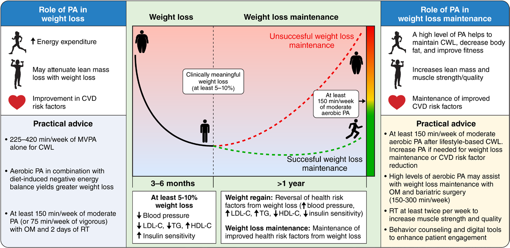

📄 [Abrir o PDF original](https://cdn.jsdelivr.net/gh/muriloffs/cardiology-agent@main/study-inbox/processados/swift-et-al-2026-role-of-physical-activity-in-obesity-treatment-and-cardiometabolic-health-a-scientific-statement-from.pdf)

# Papel da Atividade Física no Tratamento da Obesidade e na Saúde Cardiometabólica
## Declaração Científica da American Heart Association (Circulation, 2026)

> 🎓 **Aprofunde:** Este é um *scientific statement* da AHA — documento de posicionamento que sintetiza evidências, mas que NÃO atribui classes de recomendação formais (Classe I/IIa etc.), diferentemente de uma *guideline*. O foco central é uma mensagem que precisa ficar cristalina para você: **a atividade física (AF) isolada raramente produz perda de peso clinicamente significativa, mas tem benefícios cardiometabólicos INDEPENDENTES do peso e potencializa as demais estratégias de tratamento (dieta, medicação anti-obesidade, cirurgia bariátrica).** Domine essa dissociação entre "emagrecer" e "melhorar a saúde".

## Resumo (Abstract)

Perda de peso (PP) e manutenção da perda de peso (MPP) são temas centrais para clínicos e profissionais de saúde envolvidos no tratamento da obesidade e na redução do risco de doença cardiovascular (DCV). Como a atividade física é um componente-chave do tratamento abrangente da obesidade, esta declaração resume o papel da AF na promoção de perda de peso, manutenção da perda de peso e saúde cardiometabólica, complementando as estratégias de intervenção baseadas em estilo de vida, farmacológicas e cirúrgicas.

Independentemente da perda de peso, a AF e os programas de exercício melhoram os principais fatores de risco cardiometabólico — incluindo hipertensão, resistência à insulina e dislipidemia — que são altamente prevalentes em pacientes com sobrepeso ou obesidade. Como modalidade isolada de tratamento, a AF e os programas de exercício dificilmente resultam em perda de peso clinicamente significativa (isto é, pelo menos 5% de perda do peso corporal inicial), a menos que os níveis de AF aeróbica sejam excepcionalmente altos.

Quando combinada com balanço energético negativo induzido por dieta, medicação para obesidade ou tratamento cirúrgico, o aumento da AF pode ampliar a perda total de peso e melhorar os desfechos cardiometabólicos. Como os clínicos desempenham papel fundamental em fomentar e sustentar as metas de saúde dos pacientes, a declaração também oferece uma visão geral de estratégias baseadas em evidência para o aconselhamento direcionado de perda de peso e para o uso de tecnologia digital, particularmente para engajar pacientes e alcançar metas realistas de AF.

> 🎓 **Aprofunde:** Memorize a definição operacional de **perda de peso clinicamente significativa (PPCS)** usada em todo o documento: **≥5% do peso corporal inicial** (referência 2 — diretriz AHA/ACC/TOS 2013). Esse limiar de 5% é o ponto a partir do qual aparecem melhoras consistentes em pressão arterial, glicemia e lipídios.

## Introdução

As taxas de obesidade atingiram máximas históricas, com a obesidade afetando **42% dos adultos nos Estados Unidos** (referência 1 — NHANES 2017–março de 2020). A obesidade está fortemente associada a numerosos fatores de risco para DCV, como hipertensão, dislipidemia e resistência à insulina (referência 2). Assim, estratégias de tratamento voltadas para promover perda de peso relacionada à obesidade e reduzir o risco cardiovascular são foco proeminente na assistência à saúde.

A **atividade física** — definida como *qualquer movimento corporal produzido pela musculatura esquelética que resulte em gasto energético* (referência 3 — Caspersen et al., 1985) — é um componente-chave dessas estratégias, com papel relevante na PP, na MPP, na redução do risco cardiovascular e na promoção geral da saúde.

Esta declaração tem dois objetivos: (1) fornecer uma visão geral dos benefícios cardiometabólicos e do papel da AF nas abordagens abrangentes de tratamento da obesidade, complementando estilo de vida, farmacoterapia e cirurgia; e (2) oferecer estratégias comportamentais que possam ser consideradas para aumentar a AF em pacientes com sobrepeso ou obesidade.

> 🎓 **Aprofunde:** A Figura 1 é o "mapa mental" do documento. Fixe os números práticos: para PPCS com AF isolada são necessários **225–420 min/semana de AVMV** (atividade moderada a vigorosa); para a fase de medicação/cirurgia bariátrica, **≥150 min/semana de AF aeróbica + 2 dias de treino resistido (TR)**; e na manutenção a meta é **pelo menos 150 min/semana de AF moderada**, aumentando se necessário. Os abreviativos da figura: CWL = PPCS, MVPA = AVMV, OM = medicação anti-obesidade, RT = treino resistido.

## Benefícios Cardiometabólicos da Atividade Física

Antes de discutir a relação da AF com PP e MPP, é importante enfatizar que a AF e o **exercício** — definido como *um subconjunto planejado, estruturado e repetitivo da AF, realizado para manter ou melhorar saúde e/ou aptidão física* (referência 3) — têm benefícios cardiometabólicos **independentemente da perda de peso**.

O *Physical Activity Guidelines for Americans* (referência 4 — Piercy et al., JAMA 2018) recomenda que adultos pratiquem **pelo menos 150 a 300 minutos de AF aeróbica de intensidade moderada OU 75 a 150 minutos de intensidade vigorosa por semana** para benefícios significativos à saúde. Além disso, atividades de fortalecimento muscular de intensidade moderada ou maior, envolvendo os principais grupos musculares, devem ser realizadas **≥2 dias/semana**.

Para quem está iniciando a prática, é importante notar que benefícios à saúde podem ser obtidos adotando quantidades modestas de AF (ou seja, abaixo das recomendações) (referência 5 — Kraus et al., 2019); alguns benefícios — incluindo redução da pressão arterial e aumento da sensibilidade à insulina — podem ser observados mesmo após **um único episódio** de AF moderada a vigorosa, no próprio dia da atividade (referência 4).

> 🎓 **Aprofunde:** Duas mensagens-chave aqui. Primeiro, há uma resposta **dose-resposta** mas com curva mais inclinada na faixa baixa — sair do sedentarismo para algum exercício é onde mais se ganha ("some is better than none"). Segundo, há um **efeito agudo, do mesmo dia** sobre PA e sensibilidade à insulina; isso reforça que o benefício metabólico não depende de emagrecer cronicamente. Domine essa lógica para aconselhar o paciente que "não consegue" perder peso.

### Hipertensão e resistência à insulina

A AF e os programas de exercício estão bem estabelecidos para melhorar os principais fatores de risco cardiometabólico (hipertensão, resistência à insulina, dislipidemia), que são altamente prevalentes em pacientes com sobrepeso ou obesidade (referências 6 e 7). O exercício aeróbico reduz a pressão arterial de repouso na população geral (Δsistólica ≈ −4 mmHg; Δdiastólica ≈ −3 mmHg) (referência 8 — Barone Gibbs et al., Hypertension 2021).

Especificamente em adultos com sobrepeso ou obesidade, uma **meta-análise de 54 ensaios clínicos randomizados (ECRs)** de AF e exercício — abrangendo treino aeróbico, resistido ou combinações, com durações de 4 a 48 semanas (referência 9 — Battista et al., Obes Rev 2021) — mostrou que o treino físico melhorou a PA de repouso na amostra total (Δsistólica −3,0 mmHg; Δdiastólica −1,9 mmHg) e no subgrupo de hipertensos (Δsistólica −3,4 mmHg; Δdiastólica −2,1 mmHg).

O treino físico também reduziu a resistência à insulina (ΔHOMA-IR −0,34), com efeito mais pronunciado no subgrupo de adultos com **diabetes tipo 2** (ΔHOMA-IR −0,50) (referência 9).

> 🎓 **Aprofunde:** HOMA-IR é o *homeostatic model assessment for insulin resistance* — índice derivado de glicemia e insulina de jejum. Note o gradiente: o efeito do exercício sobre a resistência à insulina é **maior em quem tem maior disfunção metabólica de base** (diabéticos). Esse padrão de "maior benefício em quem está pior" se repete ao longo do documento (HAS, dislipidemia).

### Dislipidemia

O exercício aeróbico melhora os lipídios, sendo os efeitos mais estabelecidos o **aumento do HDL-colesterol e a redução de triglicerídeos**, com impacto mínimo ou nulo sobre o LDL-colesterol (referência 8).

Em uma meta-análise recente de **2.990 adultos com ≥3 critérios de síndrome metabólica**, o treino aeróbico a ≥40% do V̇O₂máx por pelo menos 12 semanas melhorou significativamente: colesterol total (−11,2 mg/dL), triglicerídeos (−15,1 mg/dL), HDL-colesterol (+3,1 mg/dL) e LDL-colesterol (−4,6 mg/dL) (referência 10 — Wood et al., Br J Sports Med 2021).

Em uma meta-análise de 619 adultos com sobrepeso ou obesidade, Cai e Zou (referência 11) relataram redução de triglicerídeos (−10,1 mg/dL) após treino aeróbico (duração 6–24 semanas; intensidade relativa 45–80%), sem mudanças significativas em outras variáveis lipídicas.

> 🎓 **Aprofunde:** A assinatura lipídica clássica do exercício aeróbico é **↑HDL e ↓TG, com pouco efeito no LDL**. Isso é coerente com o mecanismo: o exercício aumenta a atividade da lipase lipoproteica e o clearance de partículas ricas em triglicerídeos. Não espere do exercício o que se espera de uma estatina (redução de LDL).

### Aptidão cardiorrespiratória (ACR / fitness)

Além de melhorar os fatores de risco tradicionais (Tabela 1), o treino aeróbico aumenta a **aptidão cardiorrespiratória (ACR)** (referência 19 — Ross et al., Circulation 2016). Baixa ACR é fator de risco para DCV, mortalidade cardiovascular e mortalidade por todas as causas, **independentemente de outros fatores de risco (incluindo o nível de obesidade)** (referência 19) e especificamente em adultos com sobrepeso e obesidade (referências 22 e 23).

Segundo a meta-análise de Kodama et al. (referência 24 — JAMA 2009), um nível **1 MET mais alto de ACR** está associado a **redução de 15% em eventos e mortalidade relacionados a DCV** (desfecho combinado). MET = *metabolic equivalent*, múltiplo da taxa metabólica de repouso, aproximadamente 3,5 mL·kg⁻¹·min⁻¹.

Grande parte da carga de DCV atribuível à ACR é experimentada por adultos na categoria de "baixa aptidão"; dados epidemiológicos sugerem que a maior parte da redução de risco de DCV é observada quando se comparam níveis de aptidão **baixa (<7,9 METs)** e **moderada (7,9–10,8 METs)** — redução de **47%** — ao passo que a comparação entre moderada e **alta (≥10,9 METs)** mostra apenas −7% (não significativo) (referência 24).

O treino aeróbico melhora a ACR de maneira **dose-dependente**, com melhoras observadas até em níveis de exercício abaixo das diretrizes de AF (referência 25 — Church et al., JAMA 2007). Além disso, o exercício aeróbico de **alta intensidade (65%–80% do V̇O₂máx)** aumenta a ACR em maior grau do que o de intensidade moderada (45%–55% do V̇O₂máx) (referência 20), mesmo quando igualados pelo gasto energético total (referências 20, 26, 27).

Do ponto de vista clínico, ajudar os pacientes a participar de exercício aeróbico para elevar sua ACR da categoria baixa para a moderada é **crítico para reduzir o risco de DCV** (referência 19).

> 🎓 **Aprofunde:** Este é talvez o conceito mais importante da seção: o **maior ganho de sobrevida ocorre ao tirar o paciente da faixa de "baixa aptidão" (<7,9 METs)** para a moderada — a maior parte do risco está concentrada nos menos aptos. O objetivo clínico não é transformar o paciente em atleta, mas tirá-lo do quartil mais baixo de fitness. Memorize os cortes: baixa <7,9 / moderada 7,9–10,8 / alta ≥10,9 METs. E note: a intensidade VIGOROSA melhora mais a ACR que a moderada *mesmo igualando o gasto energético* — ou seja, a intensidade tem um efeito próprio sobre o fitness, independente do volume.

### Treino resistido (TR)

O **treino resistido (TR)** é uma AF de fortalecimento muscular que envolve contrair músculos contra resistência externa (referência 4). Conforme discutido em declaração científica recente da AHA (referência 16 — Paluch et al., Circulation 2024), baseada principalmente em ECRs de 2 a 6 meses com TR de intensidade majoritariamente moderada a alta (40%–80% do esforço máximo) em 2 a 3 dias/semana, o TR (**sem redução da ingestão calórica**) melhora a massa magra (+0,8 kg), reduz a gordura corporal (−1,6%) e a pressão arterial (sistólica −4 mmHg; diastólica −2 mmHg).

O TR também demonstra efeitos modestos, porém benéficos, sobre os lipídios sanguíneos, incluindo aumentos de HDL-colesterol de 2 a 12 mg/dL e reduções de colesterol total de −8 mg/dL e de triglicerídeos de 7 a 13 mg/dL (referência 16).

Além disso, **combinar treino aeróbico e TR** (ambos tipicamente de intensidade moderada a vigorosa) mostrou-se especialmente eficaz para melhorar a sensibilidade à insulina e reduzir a hemoglobina A1c em comparação ao aeróbico ou ao TR isolados — o que tem relevância clínica para adultos com resistência à insulina ou diabetes tipo 2 (referências 14 e 16).

Assim, o papel independente da AF e do exercício na melhora da saúde cardiometabólica é importante de ser discutido com pacientes que têm dificuldade de alcançar ou manter a perda de peso.

> 🎓 **Aprofunde:** Ponto de ouro para a prova e para a prática: o **treino combinado (aeróbico + resistido)** é o que mais reduz HbA1c e melhora a sensibilidade à insulina — supera cada modalidade isolada. Isso vem do raciocínio mecanístico: o aeróbico melhora a captação de glicose e a função mitocondrial, e o resistido aumenta a massa muscular (principal sítio de captação de glicose mediada por insulina). Logo, no diabético/pré-diabético com obesidade, prescreva **as duas modalidades**.

### Tabela 1 — Efeitos do treino aeróbico, resistido e combinado sobre fatores de risco cardiometabólico, independentemente da perda de peso

| Desfecho | Aeróbico | Resistido | Combinado | Síntese da evidência |
|---|---|---|---|---|
| **Pressão arterial de repouso** | + | + | + | Aeróbico (AT), resistido (RT) e combinado (CT) têm efeitos favoráveis semelhantes sobre PAS de repouso (−5,2 a −1,8 mmHg) e PAD (−3,9 a −1,9 mmHg), em adultos com e sem obesidade (refs. 9, 12, 13). Efeito do AT tende a ser maior em homens, em hipertensos e em intervenções ≤24 sem de intensidade moderada-vigorosa (ref. 12). Efeito do RT é maior em pré-hipertensos/hipertensos; maior efeito sobre PAS em intervenções >8 sem (refs. 12, 13). |
| **Sensibilidade à insulina e controle glicêmico** | ++ | + | +++ | Todos os modos têm efeito favorável; o **CT produz o maior impacto**, seguido de AT e depois RT (ref. 14). Em adultos com sobrepeso/obesidade, efeito médio sobre HOMA-IR é −0,34, mais pronunciado no DM2 (−0,50) (ref. 9). |
| **Perfil lipídico** | + | + | + | AT, RT e CT têm efeitos favoráveis semelhantes; maior volume de exercício → maior melhora (ref. 15). Em síndrome metabólica, ≥12 sem de AT: TC −11,2; TG −15,1; HDL-C +3,1; LDL-C −4,6 mg/dL (ref. 10). |
| **Massa magra** | + | ++ | ++ | RT tem efeito mais favorável que AT em preservar/aumentar massa magra (ref. 16). Efeitos médios de RT e CT são +1,3 e +0,9 kg vs AT (ref. 17). |
| **Massa gorda** | ++ | 0 | +++ | AT reduz mais massa gorda que RT (refs. 16, 18). Efeitos médios de AT e CT: −1,2 e −1,9 kg vs RT (ref. 17). **CT oferece o maior benefício para AMBAS** (massa gorda e magra). |
| **ACR (fitness)** | ++ | + ou 0 | ++ | AT mais favorável que RT para melhorar ACR (ref. 16). Modificado por sexo, idade, ACR basal e estado de saúde (ref. 19). AT melhora ACR de modo dose-dependente; AT de maior intensidade > moderado (ref. 20). Em adultos com obesidade, melhora média do V̇O₂máx absoluto: 15% (CT), 9,2%–12,9% (AT), 7,2%–7,4% (RT) (ref. 21). |

*Legenda: + benefício pequeno a moderado; ++ moderado; +++ moderado a grande; 0 sem efeito.*

> 🎓 **Aprofunde:** Esta tabela vale memorização por modalidade. Pontos de domínio: (1) **Combinado é o melhor para sensibilidade à insulina (+++) e o melhor pacote global (gordura ↓ e massa magra ↑)**; (2) **Resistido preserva/aumenta massa magra**, mas tem efeito **nulo (0)** sobre massa gorda; (3) **Aeróbico é o melhor para perder gordura e melhorar ACR**. Use essa matriz para casar a prescrição com o objetivo dominante de cada paciente.

## Atividade Física e Perda de Peso

De modo geral, a AF e os programas de exercício **sem redução da ingestão energética** dificilmente resultam em perda de peso clinicamente significativa (PPCS; ≥5% do peso corporal inicial — referência 2), a menos que os níveis de exercício sejam especialmente altos (por exemplo, **225–420 min/semana de exercício aeróbico** — referência 28, ACSM 2009 position stand).

Uma **network meta-análise de 34 ECRs** (6 categorias de intervenção: aeróbico, resistido ou combinações de diferentes intensidades, durações de 8–52 semanas), incluindo **2.064 adultos com obesidade**, estimou perda de peso média entre **−0,05 e −1,01 kg** (referência 21 — O'Donoghue et al., Obes Rev 2021).

Outra meta-análise específica para programas de exercício aeróbico (intensidade moderada a vigorosa; 120–240 min/semana), incluindo **1.126 adultos com sobrepeso ou obesidade**, demonstrou perda de peso média entre **−1,4 e −2,5 kg** para intervenções de 6 e 12 meses (referência 29 — Thorogood et al., Am J Med 2011).

Entretanto, grandes estudos de treino aeróbico com participantes perdendo peso demonstram **considerável variabilidade individual de resposta**, com alguns participantes sem mudança e outros chegando a **ganhar peso** (referências 30–34). Estudos que estimam a prevalência de indivíduos que alcançam PPCS com treino aeróbico sugerem que **<15% alcançam a PPCS** (referências 34, 35).

Ainda assim, perda de peso modesta (≈3% a <5% do peso corporal) por meio do aumento de AF isolada é **alcançável e realista** (referências 21, 29, 34–36), com maior perda ocorrendo de modo dose-resposta (referência 28).

> 🎓 **Aprofunde:** Mensagem central de toda a declaração: **AF isolada ≈ PP modesta (3–<5%) na maioria; PPCS (<15% das pessoas) só com volumes muito altos (225–420 min/sem)**. Há grande heterogeneidade — alguns até ganham peso, em parte por **compensação** (aumento de ingestão calórica e/ou redução da AF não-exercício). Esse dado deve calibrar a expectativa do paciente: "vamos usar o exercício pela saúde e como adjuvante; quem dirige a perda de peso é a dieta/medicação".

### AF combinada com déficit calórico

Quando combinada com redução da ingestão energética (déficit de **500–1000 kcal·dia⁻¹**), a AF tipicamente **amplia a perda de peso**, potencialmente aumentando os benefícios cardiometabólicos (já que a magnitude da PP se associa a maiores benefícios cardiometabólicos) (referência 36 — Jakicic et al., ACSM consensus 2024).

Meta-análises demonstram que o exercício combinado ao balanço energético negativo induzido por dieta produz maior perda de peso (**1,2–1,7 kg adicionais** — referências 37–39, ou **20% a mais** — referência 36) comparado à dieta isolada, sendo que **o componente dietético dirige a maior parte da resposta de PP**.

Fatores associados a respostas reduzidas de PP à AF incluem aqueles, em algum grau, sob controle do paciente — como **redução da AF e aumento da ingestão calórica** (que reduz o balanço energético negativo necessário para PP) (referências 2, 30, 36).

No entanto, com a PPCS, os pacientes também apresentam mudanças hormonais associadas a **aumento da fome**: ↑grelina, ↓GLP-1, ↓PYY, ↓CCK, além de alterações nas vias de recompensa alimentar (referência 40 — Busetto et al., 2021). Adicionalmente, a PP pode ser contraposta por uma **redução do gasto energético de repouso (3%–5% em pacientes com obesidade)**, que responde por 60% a 70% do gasto energético de 24 horas (referência 40).

Assim, os pacientes precisam ser adequadamente aconselhados sobre os **aumentos de fome (e do nível de AF necessário)** durante as tentativas de PP. No conjunto, a AF deve ser incluída nas tentativas de PP para ampliar a resposta, **apoiar contra as respostas compensatórias** e fornecer os benefícios independentes de saúde já mencionados.

> 🎓 **Aprofunde:** Esta é a base fisiopatológica da "dificuldade de emagrecer e de manter". A perda de peso desencadeia uma resposta homeostática contrarregulatória: (1) **mudança no eixo de saciedade** — sobe a grelina (orexígena) e caem GLP-1, PYY e CCK (anorexígenos), aumentando a fome; e (2) **termogênese adaptativa** — queda do gasto energético de repouso além do esperado pela perda de massa, dificultando manter o déficit. Entender isso muda o aconselhamento: o paciente não está "falhando", a biologia está empurrando para o reganho. A AF ajuda a sustentar o lado do gasto nessa batalha.

### Quando os volumes de AF são muito altos

Nos casos em que os níveis de AF excedem bastante o mínimo das diretrizes (por exemplo, 225–420 min/semana de exercício), a PPCS **pode** ser alcançada apenas com exercício aeróbico; entretanto, a variabilidade individual permanece (referência 28).

A **quantidade total de exercício** (tempo ou gasto energético) parece ter maior impacto sobre a PP do que outros componentes do programa (por exemplo, intensidade ou modalidade) (referência 28). Em geral, programas de treino de intensidade moderada e vigorosa produzem magnitudes semelhantes de PP quando igualados pela quantidade total de exercício (referências 36, 39).

Comparado ao treino aeróbico contínuo, o **treino intervalado de alta intensidade (HIIT)** demonstrou produzir alterações globais de peso corporal semelhantes, sugerindo ser uma **opção potencial para pacientes sem contraindicações médicas** (referência 36).

ECRs que incluem combinação de aeróbico e TR mostraram resposta de PP (0%–3% do peso inicial) **semelhante** à do treino aeróbico isolado (referência 41). Alternativamente, substituir atividades sedentárias por **AF de intensidade leve** pode ter efeitos aditivos com a AVMV para controle de peso (referência 36) — oferecendo opções adicionais para o paciente alcançar suas metas de AF.

> 🎓 **Aprofunde:** Domine a hierarquia: para PERDA DE PESO, o que mais importa é o **volume total/gasto energético**, não a intensidade nem a modalidade. Já para o FITNESS (ACR), a intensidade conta. HIIT e contínuo dão peso parecido; combinado e aeróbico isolado dão peso parecido. Isso libera flexibilidade na prescrição — escolha a modalidade que o paciente vai aderir.

### Perda de massa magra durante a perda de peso

Nos adultos que alcançam PPCS, uma preocupação potencial é a **perda de massa corporal magra** — incluindo músculo, osso e órgãos (referência 36). Essa redução de massa magra durante a PP é acompanhada de **redução da taxa metabólica de repouso**, o que potencialmente contrapõe a PP e a MPP (referências 28, 42).

Como a maioria das tentativas de PP fracassa no longo prazo (referência 43 — Wing e Phelan, 2005), a massa magra perdida **pode não ser totalmente recuperada durante o reganho** (referências 44, 45), potencialmente resultando em **percentual de gordura corporal MAIOR do que antes** da tentativa de PP (referências 44–46).

A perda de massa magra é particularmente importante para adultos com baixa massa magra antes da PP — como idosos ou pessoas com **fragilidade, obesidade sarcopênica** ou condições crônicas relacionadas — porque uma redução da força muscular tipicamente ocorre com a PP dietética (referência 47 — Colleluori e Villareal, 2021).

> 🎓 **Aprofunde:** Conceito de alto rendimento: o ciclo **"weight cycling"** (perde-reganha) pode deixar o paciente com **percentual de gordura ainda maior**, porque o que se perde é mistura de gordura+músculo, mas o que se reganha é preferencialmente gordura. Daí a importância de proteger a massa magra durante a PP — especialmente no idoso e na **obesidade sarcopênica** (coexistência de obesidade e baixa massa/função muscular).

### Estratégias para atenuar a perda de massa magra

A perda de massa magra durante a PP dietética pode ser atenuada por **ingestão proteica adequada** (ao menos a recomendação diária de 0,8 g/kg/dia) e por **treino físico** (referência 42).

Embora os achados sejam mistos (referência 39) e provenham majoritariamente de adultos de meia-idade a idosos, alguns estudos apoiam a capacidade do exercício aeróbico, do TR ou da combinação de atenuar a perda de massa magra (ou massa muscular esquelética / massa livre de gordura) quando realizados junto à PP dietética (referências 48–54).

Uma meta-análise estimou que adicionar exercício à PP dietética pode **preservar a massa livre de gordura em 13%** comparado à dieta isolada (referência 52 — Weinheimer et al., 2010). Uma meta-análise de 6 estudos comparando dieta isolada vs dieta + TR (intervenções de 12–24 semanas; treino 3×/semana) em idosos mostrou que o TR **preveniu 93% da perda de massa magra** comparado à dieta isolada (referência 55 — Sardeli et al., 2018). Entretanto, o grau de preservação de massa magra com TR pode ser **modulado pela magnitude da redução calórica** (referência 56 — Murphy e Koehler, 2022).

A **qualidade muscular** (que engloba força, potência, atividade enzimática e função metabólica em relação à massa magra/muscular — referências 57, 58) tem sido proposta como outra métrica para avaliar a perda muscular nas intervenções de PP, oferecendo uma visão mais abrangente da função muscular além da simples quantidade de massa magra perdida.

Uma meta-análise recente de 33 estudos mostrou que a PP dietética reduziu a **força do extensor do joelho (−7,5%)**, com redução **não significativa** da preensão palmar (−1,7%) (referência 59 — Zibellini et al., 2016).

Em idosos com obesidade, combinar TR com PP dietética demonstrou, em alguns estudos, **atenuar ou melhorar índices de qualidade muscular** comparado à dieta isolada (referências 55, 60, 61). Evidências do *Cooperative Lifestyle Intervention Program* sugerem que o **TR pode ser mais eficaz que o exercício aeróbico ou a dieta isolada** para melhorar a qualidade muscular e preservar a massa magra após PP em idosos (referência 62 — Madrid et al., 2023).

Outra preocupação com a perda de massa magra é a potencial perda de **tecido muscular esquelético**, que é um importante sítio de captação de glicose (referência 63). Apesar da perda de massa magra, a PP geralmente **melhora a sensibilidade à insulina**, especialmente quando combinada ao exercício (referência 64 — Fisher et al., 2012).

Adicionalmente, o treino físico melhora outros aspectos da função muscular durante a PP, incluindo manter/aumentar a ACR (referências 49, 64, 65), melhorar a **capacidade mitocondrial do músculo esquelético** (referência 66) e aumentar a função física (referência 48). Portanto, aconselhar os pacientes a se exercitarem durante a PP tem relevância clínica, especialmente para aqueles com baixa massa muscular antes da PP.

> 🎓 **Aprofunde:** Para PRESERVAR MÚSCULO durante o emagrecimento, três pilares: (1) **proteína ≥0,8 g/kg/dia** (vários autores defendem mais que isso na PP, mas o texto cita o mínimo); (2) **treino resistido** (preveniu 93% da perda de massa magra em idosos — ref. 55); (3) **evitar déficit calórico extremo**, que limita o ganho de massa magra mesmo com TR (ref. 56). E note o conceito moderno de **qualidade muscular** (força/potência por unidade de massa), que pode ser melhor preservada que a quantidade — útil porque a PP derruba mais a força do extensor do joelho (−7,5%) que a preensão palmar.

## Atividade Física e Manutenção da Perda de Peso (MPP)

Em geral, o **reganho de peso após PPCS está associado à reversão das melhoras de saúde** que ocorreram durante a PP inicial (referências 67–69). Assim, a MPP é de **importância clínica capital**, embora inegavelmente difícil de sustentar no longo prazo (referência 2).

Engajar-se em **altos níveis de AF** parece ter papel importante na MPP bem-sucedida. Organizações de saúde recomendam **200 a 300 min/semana de AF moderada para a MPP** (referências 2, 28). Essa orientação baseia-se primariamente em dados **retrospectivos** de intervenções de estilo de vida, sugerindo que maiores níveis de AF têm mais probabilidade de resultar em maior MPP, de modo dose-resposta (referência 28).

Por exemplo, Jakicic et al. (referência 70 — Arch Intern Med 2008) avaliaram AF e MPP em análise retrospectiva de uma intervenção de PP de 24 meses. Maior nível de AF aos 24 meses associou-se a maior percentual de PP mantida:
- **≥300 min/sem → ≈11% da PP inicial mantida**
- **250–299 min/sem → ≈8%**
- **150–249 min/sem → ≈6%**
- **<150 min/sem → ≈3%**

Dados de longo prazo do *Diabetes Prevention Program* (referência 71) e do *Look AHEAD* (referência 72) também mostram que maiores níveis de AF são **preditivos de MPP a longo prazo**.

> 🎓 **Aprofunde:** Atenção à natureza da evidência: a recomendação histórica de **200–300 min/sem para manter peso** vem de dados **retrospectivos/observacionais** (quem se manteve era quem se exercitava mais). Isso é diferente de provar causalidade. Os ensaios prospectivos (abaixo) bagunçam essa relação dose-resposta linear. Memorize a escada do Jakicic 2008 (300→11%, 250→8%, 150→6%, <150→3%), mas saiba que ela é associativa.

### A evidência prospectiva é mista

Ao contrário, estudos prospectivos que randomizaram adultos com sobrepeso e obesidade para distintos níveis de exercício aeróbico relataram **achados mistos** para MPP — alguns sugerindo benefício com maiores quantidades de exercício (referência 73 — Jeffery et al., 2003) e outros não observando dose-resposta (referência 74).

Em uma intervenção de manutenção da PPCS de 12 meses, Washburn et al. (referência 74 — Obesity 2021) não observaram diferenças significativas no reganho de peso entre participantes randomizados para **150, 225 ou 300 min/semana** de exercício aeróbico semissupervisionado (70% da FC máxima) combinado a aconselhamento comportamental.

Os autores notaram que a ausência de dose-resposta pode dever-se à **baixa adesão ao exercício**, especialmente no grupo de alto volume (que atingiu média de apenas **179 dos 300 minutos semanais prescritos**). Embora houvesse alta variabilidade individual, o reganho de peso entre os grupos foi mínimo (**1,2%–3,4%**). Assim, combinado à terapia comportamental, exercitar-se em volumes **menores** do que os atualmente recomendados para MPP foi eficaz em prevenir o reganho.

Dada a ausência de uma dose-resposta clara nos ensaios prospectivos e os problemas de adesão a níveis altos de exercício, uma declaração de consenso recente do **American College of Sports Medicine** (referência 36) sobre PP defendeu que o nível de AF progrida **até 150 min/semana de AVMV** e, depois, seja aumentado se necessário para ampliar a MPP ou melhorar os fatores de risco. Entretanto, mais dados de ensaios prospectivos são necessários para entender as relações dose-resposta após a PPCS, tanto sobre peso quanto sobre fatores de risco cardiovascular.

> 🎓 **Aprofunde:** Conflito-chave para dominar: a recomendação **histórica/observacional** é 200–300 min/sem para manter peso, mas o **ensaio prospectivo de Washburn (ref. 74)** mostrou que 150, 225 e 300 min davam reganho parecido (e baixo) — em parte porque ninguém aderia ao volume alto. Por isso o **consenso do ACSM 2024 (ref. 36)** recomenda pragmaticamente progredir **até ~150 min/sem** e só então subir se necessário. A lição prática: comece com uma meta atingível (150 min) em vez de prescrever 300 min que o paciente não cumprirá.

### AF, reganho de peso e proteção cardiometabólica

Como prevenir o reganho é desafiador, outra área de pesquisa relevante é entender se **manter a adesão à AF pode conter a regressão do perfil cardiometabólico, mesmo havendo reganho modesto**. Poucos estudos existem nessa área.

Estudos prospectivos após PPCS (de 10%–16%) mostraram que, comparado a nenhum exercício, o exercício aeróbico pode ajudar a **manter melhoras na pressão arterial diastólica** (referência 75 — Thomas et al., 2010), no **HOMA-IR** (referência 75) e na **sensibilidade à insulina** (medida por teste de tolerância à glicose intravenoso) (referência 64), apesar de um reganho de ≈55% da PP total.

Tais benefícios cardiometabólicos do exercício poderiam ser explicados pelos **efeitos independentes do exercício sobre a ação da insulina e a homeostase glicêmica**, apesar dos impactos negativos potenciais do reganho. Contudo, mais dados são necessários quanto aos fatores de risco avaliados, componentes do programa (quantidade, modalidade) e características dos participantes (estado de doença, sexo, idade, raça e etnia).

**Síntese da MPP:** os dados atuais sugerem que, após a PPCS, os pacientes devem inicialmente progredir para um nível de AF de **pelo menos 150 min/semana de atividade moderada** e, se necessário, para doses maiores, para promover ainda mais a MPP ou induzir maiores melhoras nos fatores de risco cardiometabólico (referência 36). Embora dados limitados estejam disponíveis sobre se a AF pode atenuar o aumento dos parâmetros cardiometabólicos com o reganho, o exercício pode ter papel em **manter a melhora da pressão diastólica e da sensibilidade à insulina** advindas da PP inicial (referências 64, 75).

> 🎓 **Aprofunde:** Conceito sofisticado e otimista: mesmo que o paciente **reganhe ~metade do peso perdido**, manter o exercício preserva ganhos metabólicos (PA diastólica, HOMA-IR, sensibilidade à insulina) — porque o exercício age na ação da insulina por mecanismos **independentes do peso**. Mensagem para o paciente frustrado com reganho: "continue se exercitando — boa parte do benefício metabólico não se perde junto com o peso".

## Atividade Física no Contexto de Tratamento com Medicações Anti-Obesidade ou Cirurgia Bariátrica

De modo geral, as **medicações anti-obesidade** são indicadas para pacientes com **IMC ≥30 kg/m²** OU IMC de **27 a 29,9 kg/m² com comorbidades relacionadas ao peso** que não atingiram metas de PP apenas com mudanças de estilo de vida (referência 76 — Gudzune e Kushner, JAMA 2024).

A **cirurgia bariátrica** é indicada para pacientes com **IMC ≥35 kg/m²** OU IMC de **30 a 34,9 kg/m² com diabetes ou incapacidade de alcançar PP por métodos não cirúrgicos**.

Embora muitos adultos sejam elegíveis a medicações, cirurgia ou ambos, existem numerosas barreiras para receber esses tratamentos — como **falta de cobertura/seguro de saúde adequados, custo do tratamento e preocupação com efeitos colaterais**. Para serem mais eficazes, medicações e cirurgia devem ser acompanhadas de mudanças contínuas de estilo de vida, incluindo abordagens dietéticas e aumento de AF, para aprimorar a regulação do peso corporal por meio de sua contribuição ao balanço energético (referência 77 — Elmaleh-Sachs et al., JAMA 2023).

Nas seções seguintes, examinam-se as populações tratadas com medicações anti-obesidade e cirurgia bariátrica para determinar se os dados existentes indicam que a AF amplia PP/MPP ou tem efeitos sinérgicos sobre outros desfechos, particularmente fatores de risco cardiometabólico e desfechos cardiovasculares.

> 🎓 **Aprofunde:** Fixe os critérios de elegibilidade — caem em prova: **medicação** = IMC ≥30, ou ≥27 com comorbidade. **Cirurgia** = IMC ≥35, ou ≥30 com DM2/refratariedade. E note o conceito-chave: medicação e cirurgia **não dispensam** estilo de vida; pelo contrário, dieta e AF continuam sendo a base que sustenta o balanço energético e protege contra reganho.

### Medicações Anti-Obesidade e AF

Por muitos anos, as medicações anti-obesidade receberam pouca atenção dada a PP relativamente modesta observada em ensaios clínicos. Entretanto, o advento dos **agonistas do receptor de GLP-1 (GLP-1RA)** reacendeu o campo, com vários medicamentos resultando em PPCS e talvez rivalizando com a cirurgia bariátrica (referência 78 — Drucker, 2022).

Atualmente, **3 GLP-1RA estão aprovados para PP: liraglutida, semaglutida e tirzepatida** (referência 77). Embora os mecanismos exatos de PP não sejam completamente compreendidos, acredita-se que os GLP-1RA reduzam o peso por **retardar o esvaziamento e a motilidade gástricos** e por **aumentar sinais centrais de saciedade**, levando a reduções de apetite e ingestão alimentar (referência 79 — Michos et al., 2023).

Esses mecanismos também explicam o perfil de efeitos colaterais, que é majoritariamente **gastrointestinal** (náusea, vômito, diarreia). Contudo, esses efeitos frequentemente melhoram com o tempo e podem ser mitigados com **titulação mais lenta** da medicação (referência 80).

> 🎓 **Aprofunde:** Tirzepatida é um **agonista DUPLO** — GLP-1RA *e* agonista do receptor do GIP (polipeptídeo insulinotrópico dependente de glicose). Domine os mecanismos do GLP-1RA: retardo do esvaziamento gástrico + saciedade central → menos fome e ingestão. Os efeitos GI são consequência direta disso (esvaziamento mais lento → náusea). A titulação lenta é a estratégia para tolerabilidade.

#### Liraglutida

A liraglutida, primeiro GLP-1RA aprovado para controle de peso, em adição ao aconselhamento de estilo de vida demonstrou **PP consistente de 4 a 6 kg** em diversas populações no programa **SCALE** (*Satiety and Clinical Adiposity–Liraglutide Evidence in Non-Diabetic and Diabetic Individuals*) (referência 81).

Subsequentemente, o **LEADER trial** (*Liraglutide and Cardiovascular Outcomes in Type 2 Diabetes*) demonstrou que a liraglutida, comparada ao placebo, **reduziu significativamente os eventos cardiovasculares adversos maiores (MACE)** em pacientes (IMC médio 32,5 kg/m²) com DM2 e alto risco cardiovascular (**HR 0,87 [IC95% 0,78–0,97]**) ao longo de mediana de seguimento de 3,8 anos (referência 82 — Marso et al., NEJM 2016).

#### Semaglutida

A série de ensaios **STEP** (*Semaglutide Treatment Effect in People With Obesity*) estabeleceu a semaglutida como agente eficaz para controle de peso, com dados harmonizados sugerindo **redução de peso de 11,4% ajustada pelo placebo** (referência 83 — Shi et al., Lancet 2024).

Notavelmente, o **STEP 3** foi conduzido para entender o efeito da semaglutida sobre o peso quando adicionada a **terapia comportamental intensiva**, incluindo dieta hipocalórica, aconselhamento regular de estilo de vida e exercício. Na randomização, os participantes foram instruídos a praticar **100 min/semana de AF em blocos >10 minutos**, distribuídos igualmente por 4 a 5 dias, e a aumentar gradualmente a AF em 25 minutos a cada 4 semanas, com meta de **200 min/semana**. Em 68 semanas de seguimento, os participantes apresentaram **redução de 16% no peso** vs basal — mais do que o observado com aconselhamento de estilo de vida menos intensivo no STEP 1 (referência 84 — Wadden et al., JAMA 2021).

O recém-publicado **SELECT trial** (*Semaglutide Effects on Heart Disease and Stroke in Patients With Overweight or Obesity*) representa o **primeiro ensaio de desfechos cardiovasculares a demonstrar redução de MACE** em pacientes com DCV estabelecida, com sobrepeso ou obesidade e **sem diabetes tipo 2** (**HR 0,80 [IC95% 0,72–0,90]**) (referência 85 — Lincoff et al., NEJM 2023).

> 🎓 **Aprofunde:** O **SELECT (ref. 85)** é um marco: pela primeira vez um GLP-1RA reduziu MACE em pessoas com obesidade/sobrepeso **SEM diabetes** — desacoplando o benefício cardiovascular do controle glicêmico. Já o LEADER (ref. 82) tinha mostrado o benefício em DM2. Memorize os HR: LEADER 0,87; SELECT 0,80. E note no STEP 3 que **terapia comportamental intensiva + semaglutida** levou a 16% de PP — a soma de estilo de vida intensivo com o fármaco supera o fármaco com aconselhamento leve (STEP 1).

#### Tirzepatida

A tirzepatida é um novo agonista GLP-1RA e do receptor de GIP, aprovado para o manejo do DM2 com sobrepeso e obesidade. O ensaio **SURMOUNT-1** demonstrou que a dose semanal de **15 mg de tirzepatida resultou em redução de 21% no peso** vs basal em seguimento de 72 semanas (referência 86 — Jastreboff et al., NEJM 2022).

O **SURMOUNT-3** testou o efeito da modificação intensiva de estilo de vida **antes** da administração de tirzepatida (referência 87 — Wadden et al., Nat Med 2023). Os participantes precisavam perder **≥5% do peso corporal total durante um período de lead-in de 12 semanas**, no qual receberam 8 sessões com nutricionista (ou profissional qualificado equivalente) e foram encorajados a praticar **pelo menos 150 min/semana de AF moderada**. Durante esse lead-in, perderam em média **7% do peso total**. Em seguida, os tratados com tirzepatida perderam **18% adicionais de peso**, comparado a um **ganho de ≈3%** no grupo placebo.

Esses resultados sugerem que a PPCS pode ser alcançada com mudanças saudáveis de estilo de vida e **ampliada com a adição de tirzepatida** vs placebo — efeito aditivo também observado com outras medicações para obesidade (referência 88). Embora suporte comportamental para AF tenha sido fornecido, **esses ensaios não quantificaram os níveis de AF dos participantes nem realizaram subanálises** para determinar se a AF afetou o peso ou outros desfechos.

O **SURMOUNT-MMO** (*A Study of Tirzepatide on the Reduction on Morbidity and Mortality in Adults With Obesity*) está em andamento para avaliar se a tirzepatida reduz MACE em pacientes com sobrepeso ou obesidade de alto risco de DCV (DCV estabelecida ou prevenção primária de alto risco) **sem DM2**.

> 🎓 **Aprofunde:** Note a magnitude crescente de PP: liraglutida 4–6 kg; semaglutida ~11–16%; tirzepatida ~21% — daí a comparação com cirurgia bariátrica. Limitação metodológica crucial que você deve saber: nos ensaios de GLP-1RA, **a AF foi "encorajada" mas não foi medida nem analisada como variável** — por isso NÃO sabemos quanto a AF contribuiu para os resultados. O SURMOUNT-MMO é o aguardado ensaio de desfecho duro para tirzepatida em obesidade sem diabetes.

#### Perda de massa magra com GLP-1RA

Quanto à massa magra, dados de ensaios clínicos mostraram uma **proporção notável da PP total devida à massa magra** (em vez de massa gorda): **≈45% para semaglutida** e **25,7% para tirzepatida** (referência 89 — Neeland et al., 2024).

Há discussão e incerteza em andamento sobre as consequências de saúde dessa perda de massa magra em pacientes em terapia com GLP-1RA (por exemplo, heterogeneidade entre estudos; massa magra não indica diretamente massa ou qualidade muscular esquelética; mudanças benéficas no músculo esquelético mediadas pelos GLP-1RA), o que está além do escopo deste documento.

> 🎓 **Aprofunde:** Tema quentíssimo: **proporção alta de perda de massa magra com GLP-1RA** (semaglutida ~45%, tirzepatida ~25,7% da PP total). Isso reacende a importância do **treino resistido + proteína adequada** durante o uso desses fármacos, embora o texto faça a ressalva de que "massa magra" no DEXA ≠ massa/qualidade muscular esquelética, e que os próprios GLP-1RA podem ter efeitos musculares benéficos. Conceito a dominar e acompanhar na literatura.

#### Combinando GLP-1RA com exercício

Dados comparando GLP-1RA isolado vs GLP-1RA + exercício são limitados. Lundgren et al. (referência 88 — NEJM 2021) avaliaram o impacto de um programa de treino (desenhado para atingir as recomendações aeróbicas) em participantes em uso de liraglutida, após um run-in de 8 semanas com dieta hipocalórica.

Aos 52 semanas, o grupo **exercício + liraglutida**, comparado ao grupo **liraglutida isolada**, teve:
- **Maior PP total** (−3,4 kg vs −0,7 kg)
- **Maior perda de massa gorda** (−4,7 kg vs −2,0 kg)
- **Nenhuma mudança significativa de massa magra** entre os grupos (0,0 kg vs +0,5 kg) nem dentro dos grupos
- **Melhora significativa da ACR no grupo exercício + liraglutida** (+4,8 mL·kg⁻¹·min⁻¹ [IC95% 3,4–6,1]), enquanto a ACR no grupo liraglutida isolada **não mudou** significativamente (+1,1 mL·kg⁻¹·min⁻¹ [IC95% −0,3 a 2,6])

Um relatório secundário desse ensaio demonstrou **maior perda de gordura androide** no grupo exercício + liraglutida, com reduções semelhantes no escore z de síndrome metabólica (referência 90 — Sandsdal et al., 2023).

> 🎓 **Aprofunde:** Estudo-chave (Lundgren, NEJM 2021): a combinação **exercício + liraglutida** foi superior para perder mais peso, mais gordura, **mais gordura androide (visceral)** e — crucialmente — para melhorar a **ACR**, que NÃO melhorou com a medicação isolada. Isso ilustra os 3 mecanismos pelos quais a AF agrega valor à medicação: (1) ↑gasto energético (mais PP/MPP); (2) atenuar perda de massa magra; (3) trazer benefícios que o fármaco sozinho não dá (melhora do fitness).

#### Síntese — GLP-1RA e AF

Embora haja promessa de que a AF e o exercício forneçam benefícios adicionais de saúde comparados à medicação isolada, dados suficientes ainda não estão disponíveis para responder conclusivamente sobre o efeito da AF em pacientes em GLP-1RA. Os efeitos de componentes específicos do programa de AF (dose, intensidade, modalidade) em combinação com GLP-1RA precisam ser avaliados em estudos futuros.

No entanto, é lógico que pacientes em GLP-1RA devam derivar benefícios das recomendações gerais de AF (referência 4) — ou seja, **pelo menos 150 min/semana de AF moderada ou 75 min/semana de AF vigorosa, mais fortalecimento muscular ≥2 dias/semana** — porque o exercício se associa a aumento de ACR e redução de fatores de risco cardiometabólico, melhorando qualidade de vida e mortalidade independentemente do estado de peso.

Mecanismos potenciais pelos quais a AF pode melhorar a saúde na terapia com GLP-1RA: (1) afetar a PP/MPP via aumento do gasto energético; (2) atenuar a perda de massa magra (ou músculo esquelético); (3) prover melhoras de saúde que talvez não sejam alcançáveis só com GLP-1RA (por exemplo, melhorar a ACR).

ECRs rigorosamente desenhados avaliando dose-resposta do exercício, modalidade e impactos da AF sobre desfechos de saúde em pacientes em GLP-1RA são necessários para desenvolver recomendações específicas a esta população.

### Atividade Física Antes da Cirurgia Bariátrica

Dados nacionalmente representativos demonstram que adultos elegíveis à cirurgia bariátrica por critérios de IMC têm probabilidade significativamente **menor** de cumprir as diretrizes de AF do que aqueles com peso normal (**20,3% vs 45,6%**); em comparação, **23,1%** dos adultos americanos que já fizeram cirurgia bariátrica cumprem as diretrizes de AF (referência 91 — Hong et al., 2022).

Notavelmente, **não existem critérios nas diretrizes clínicas de cirurgia bariátrica para níveis ideais de AF na população pré-operatória**, segundo as diretrizes da *American Society for Metabolic & Bariatric Surgery* (referência 92). Antes da aprovação para cirurgia, a maioria das seguradoras exige que os pacientes demonstrem participação em um programa comportamental de estilo de vida; tais programas tipicamente incluem metas de AF, mas não há acordo sobre o nível ideal de AF no pré-operatório.

Numerosos ensaios foram conduzidos em populações pré-operatórias para entender o efeito de uma intervenção de AF e do aumento dos níveis de AF sobre desfechos avaliados após a intervenção (antes da cirurgia) ou após a cirurgia. Uma revisão sistemática de Jabbour et al. (referência 93) indica que esses estudos (**n=21**) tendiam a ser pequenos e muitos não tinham controle ou grupo de comparação adequado; as intervenções de AF variaram de 7 dias a 24 semanas; e os tipos de intervenção eram heterogêneos, abrangendo atividade aeróbica de várias intensidades, força/TR e exercício aquático.

Embora alguns estudos tenham demonstrado melhoras intragrupo para AF pré-operatória e certos desfechos, a ampla gama de desfechos e a falta de grupos comparadores geram **achados mistos**. Um estudo encontrou relação entre aumento da AF pré-operatória e redução da pressão arterial e do escore de risco de Framingham. Em contraste, a maioria dos estudos não examinou especificamente fatores de risco cardiometabólico, e **nenhum mediu desfechos cardiovasculares** (referência 93).

Alguns estudos apoiam melhores desfechos pós-cirúrgicos em pacientes que aumentaram a AF antes da cirurgia (referência 93); porém, como a própria cirurgia bariátrica tem impacto tão grande sobre o peso em muitos pacientes, o **efeito independente de uma intervenção pré-cirúrgica de AF pode ser difícil de detectar** — contribuindo para o fato de alguns estudos não mostrarem relação entre a intervenção pré-cirúrgica e desfechos pós-cirúrgicos.

Uma revisão sistemática restrita a ensaios controlados de intervenções pré-operatórias de AF (**n=4**) demonstra ainda achados mistos (referência 94 — Bellicha et al., Obes Rev 2021). Comparado ao controle, 2 de 3 estudos de curto prazo relataram melhoras significativas no peso ou IMC pré-operatórios, mas achados discordantes para outros desfechos; e 1 estudo de seguimento de longo prazo relatou redução da massa corporal — **incluindo redução da massa livre de gordura — 12 meses após a cirurgia**. Assim, futuros estudos de intervenção pré-cirúrgica de AF, incluindo grupo controle e períodos mais longos de seguimento pós-cirúrgico, são justificados.

> 🎓 **Aprofunde:** Dois pontos para dominar sobre o pré-bariátrica: (1) **não há padrão de AF ideal pré-operatório** nas diretrizes — apenas exigências de seguradoras; (2) a evidência é fraca e mista, em parte porque a cirurgia "ofusca" qualquer efeito da AF pré-operatória sobre o peso. Note o sinal de alerta de um estudo: a AF pré-operatória pode levar a redução de **massa livre de gordura** no pós-operatório de longo prazo — outro motivo para vigiar a massa magra.

### Atividade Física Após a Cirurgia Bariátrica

A *American Society for Metabolic & Bariatric Surgery* sugere uma **abordagem individualizada e gradual** de AF após a cirurgia, com **mínimo de 150 min/semana e meta de 300 min/semana de AF aeróbica moderada, com TR 2 a 3 vezes/semana**, afirmando que indivíduos que se tornam e permanecem fisicamente ativos após a cirurgia têm mais probabilidade de **alcançar e manter a PP** (referência 92).

A sugestão de que maiores níveis de AF após a bariátrica se associam a melhores desfechos de peso é apoiada por dados observacionais (referência 95) e de ensaios clínicos (referência 94).

Meta-análises geralmente sugerem que a AF após a bariátrica leva a **maior PP (1,8–2,5 kg)** (referências 94, 96) e **maior perda de gordura** (referências 94, 96), além de melhoras em **ACR e força muscular** (referência 94), comparada a condições controle sem AF.

Por outro lado, uma meta-análise recente de Bond et al. (referência 97), com estudos predominantemente de exercício supervisionado (12–26 semanas), mostrou **mudança de peso não significativa (−1,5 kg)**. Esse achado pode ser atribuível ao número limitado de estudos (**5**) e a níveis de AF abaixo dos recomendados (**80–120 min/semana**).

Adicionalmente, algumas evidências sugerem efeito positivo da AF pós-operatória na melhora da **densidade mineral óssea** e na MPP (referência 94). Entretanto, **nenhuma mudança significativa foi observada em fatores de risco cardiometabólico** como pressão arterial, sensibilidade à insulina ou níveis de colesterol (referência 94). Poucos estudos incluem fatores de risco para DCV e desfechos de MACE (referência 94).

**Síntese — pós-bariátrica:** dados de ensaios clínicos de qualidade mista sugerem que a AF após a bariátrica se associa a melhores desfechos de peso (incluindo MPP). Atualmente, a maioria dos centros cirúrgicos de PP **carece de programas pós-cirúrgicos abrangentes de AF**, e o seguro tipicamente não cobre o acesso a programas de AF de alta qualidade após a cirurgia. Idealmente, uma equipe de tratamento incluindo um **fisiologista do exercício certificado** estaria disponível para prescrever e implementar programas de AF para indivíduos após a cirurgia bariátrica.

> 🎓 **Aprofunde:** No pós-bariátrico, fixe a recomendação da ASMBS: **mínimo 150, meta 300 min/sem aeróbico + TR 2–3×/sem**. A evidência é mais robusta para PP/gordura/ACR/força do que para fatores de risco cardiometabólico (sem mudança significativa em PA, insulina ou colesterol nessa população — provavelmente porque a própria cirurgia já normaliza muito desses parâmetros). O "gap" prático que o documento denuncia é a **falta de programas estruturados e de cobertura** para reabilitação por exercício pós-bariátrica.

## Estratégias para Aconselhamento sobre AF no Tratamento da Obesidade e na Saúde Cardiometabólica, com Atenção ao Uso de Tecnologia Digital Contemporânea

Os clínicos desempenham papel central em fomentar e sustentar a PP, incluindo encorajar AF regular por meio de mudanças graduais e progressivas (referências 98, 99). Usar abordagens baseadas em evidência destinadas a contextos clínicos — como o **modelo dos 5As (assess, advise, agree, assist, arrange — avaliar, aconselhar, acordar, assistir, arranjar)** para aconselhamento direcionado de PP (referências 98, 100) — demonstrou melhorar significativamente as práticas de tratamento da obesidade, incluindo a comunicação médico-paciente, as avaliações médicas da obesidade e os planos de acompanhamento (referências 100, 101).

Cada passo adicional do modelo dos 5As entregue por um médico associa-se a **maior probabilidade de o paciente tentar perder peso** adotando comportamentos mais saudáveis, como comer melhor e exercitar-se regularmente (referências 102, 103). O modelo dos 5As pode ser usado para abordar tanto a meta global de PP quanto as metas das estratégias individuais (dieta, aumento de AF). Esta seção foca na aplicação dos 5As para aumentar a AF.

> 🎓 **Aprofunde:** Domine o acrônimo **5As: Assess (avaliar), Advise (aconselhar), Agree (acordar), Assist (assistir), Arrange (arranjar)**. A evidência (refs. 102, 103) mostra **relação dose-resposta**: quanto mais etapas dos 5As o médico executa, maior a chance de o paciente mudar de comportamento. É a estrutura de aconselhamento mais validada para obesidade em atenção primária (Sociedade de Medicina Comportamental, ref. 100).

### Aplicando os 5As

**Assess (Avaliar):** é importante avaliar os níveis de AF, incluindo a carga de comorbidades psicossociais, psiquiátricas ou correlatas que possam dificultar a prática ou manutenção da AF e o controle do peso. Junto com as avaliações clínicas, é importante perguntar ao paciente sobre sua **prontidão e confiança** para se engajar em AF ou estabelecer novos comportamentos. Avaliar se o paciente reconhece a importância da AF regular para controlar o peso oferece insight sobre sua intenção e motivação.

**Advise (Aconselhar):** aconselhar sobre o papel da AF na PP, considerando a condição clínica, pode reforçar as intenções de praticar AF rotineira e fortalecer a relação clínico-paciente (referência 101).

**Agree (Acordar):** um desfecho-chave da abordagem é **acordar um plano de ação pessoal**, que no tratamento da obesidade incluiria metas comportamentais relacionadas à AF (referência 100). A discussão deve ser **colaborativa**, usando estratégias centradas no paciente como **entrevista motivacional** e planejamento de ação guiado. Os clínicos são encorajados a estabelecer metas alcançáveis e personalizadas usando o **framework SMART (specific, measurable, achievable, relevant, time-bound — específica, mensurável, atingível, relevante, temporalmente definida)**. As metas devem focar tipo, frequência, intensidade e duração da atividade, adaptadas ao nível atual de AF do paciente, permitindo progressão gradual (Tabela 3). Ao definir as metas, os clínicos devem orientar expectativas realistas, enfatizando os benefícios amplos de saúde — pequenas quantidades de AF já trazem benefícios mentais e físicos significativos. Embora altos níveis de AF se alinhem ao sucesso, encorajar uma abordagem de **"algo é melhor que nada" ("some is better than none")** (referência 107) pode ser estratégia mais apropriada para motivar indivíduos sedentários e de baixa atividade a iniciar a AF regular.

**Assist (Assistir):** crítico para operacionalizar os 5As é **assistir o paciente a alcançar suas metas comportamentais**, ajudando-o a identificar barreiras e desafios e a encontrar recursos ou oportunidades. A resolução colaborativa de problemas pode ajudar a superar obstáculos e fomentar o engajamento (referências 104, 108), especialmente importante para **grupos sub-recursados** com baixa participação em AF, altas taxas de sobrepeso/obesidade e maior risco de saúde cardiovascular ruim (referências 7, 105).

**Arrange (Arranjar):** dadas as limitações de fornecer aconselhamento adequado durante visitas clínicas breves e episódicas (referências 98, 99), os clínicos podem considerar **encaminhar pacientes de resposta lenta** (PP negligível, episódios de reganho ou recaída) a **aconselhamento comportamental intensivo**, como programas comunitários ou comerciais de tratamento da obesidade (referências 98–100, 109). Arranjar suporte eficaz, combinado à supervisão médica, encoraja intervenções baseadas em evidência por outros profissionais e **aumenta a responsabilização (accountability)** do paciente quanto às metas de PP/MPP. Pode incluir encaminhamento a **fisioterapeutas, fisiologistas do exercício** e outros profissionais auxiliares (enfermeiros/enfermeiros de prática avançada, nutricionistas, educadores/coaches de saúde, conselheiros comportamentais) para sustentar mudanças de AF (referências 101, 103) e aumentar a probabilidade de o paciente alcançar a PPCS (referência 109).

Entretanto, **manter a supervisão médica e o acompanhamento é crucial** para apoiar a motivação e as intenções de exercício dentro de uma intervenção multidisciplinar (referência 109). O processo dos 5As pode ser **iterativo**, e avaliações contínuas de AF são vitais, mesmo que o paciente não demonstre interesse inicial.

### Tabela 2 — Usando o modelo dos 5As para encorajar a participação em AF regular

| Elemento dos 5As | Aplicação para promover AF regular (exemplos de frases) |
|---|---|
| **Assess (Avaliar):** descobrir a intenção e o conhecimento do paciente sobre AF | "Parece que você tem muita coisa acontecendo agora." / "Como você poderia reservar alguns minutos para cuidar de você?" / "Você tem ideias de como começar, ou quer sugestões?" |
| **Advise (Aconselhar):** oferecer informações para ampliar a compreensão de como incorporar AF no dia | "Você está interessado em ser mais ativo. Acredita que vai reservar tempo para sua meta de AF?" / "Você quer se exercitar 3 dias/semana mas sente falta de tempo. Quer ouvir como outros incluíram AF na rotina corrida?" |
| **Agree (Acordar):** colaborar no estabelecimento de metas SMART | "Que tal uma caminhada de 10–20 min no horário de almoço? Dá para encaixar?" / "Você disse que vai caminhar 30 min após o trabalho — quer colocar na agenda para evitar conflitos?" |
| **Assist (Assistir):** resolução colaborativa de problemas e estratégias para atingir a meta SMART | "Se houver uma semana em que não dê para caminhar depois do trabalho, há plano alternativo (almoço, fim de semana)?" (alvo: tempo) / "Aqui está uma lista de centros recreativos e grupos de caminhada locais" (alvo: ambiente, social) / "O trânsito atrapalha ir à academia? Que tal um app de exercício em casa?" (alvo: tempo, acesso) |
| **Arrange (Arranjar):** planejar revisão de progresso e referências de suporte | "Sua consulta de retorno é em [data]. Pode trazer o registro dos dias de exercício?" / "Vamos olhar a contagem de passos no celular e revisar a meta de 8.000 passos/dia?" / "Para apoiar seu esforço, seria útil trabalhar com um fisiologista do exercício e um nutricionista." |

### Tabela 3 — Exemplos de metas SMART baseadas no nível individual de AF e nos objetivos de controle de peso

As metas SMART devem ser desenvolvidas **colaborativamente** entre clínico e paciente para aumentar a probabilidade de alcance, promover sucesso e elevar a autoeficácia. Metas e adesão podem ser alcançadas adicionando atividades de estilo de vida não estruturadas, exercício ou ambos (passear com o cão, caminhar, nadar, pedalar, limpeza doméstica, usar escadas).

| Tipo de meta | Exemplos |
|---|---|
| **Metas diárias** | "Vou caminhar/correr no almoço de 30 min nos dias úteis e incluir 30 min de caminhada vigorosa no fim de semana." / "Vou usar escadas em vez de elevador/escada rolante." / "Vou caminhar ou pedalar com a família após o jantar." / "Vou aumentar a distância de corrida em ¼ a ½ milha por semana." / "Vou fazer aula de fitness (presencial ou online) 3 dias/semana nos próximos 6 meses." |
| **Metas de curto prazo** | "No outono, vou correr uma prova de 5 km." / "Nos próximos 3 meses, vou aumentar a média de passos de 6.000 para 8.000/dia, chegando a 10.000/dia em 6 meses." |
| **Metas de longo prazo (6 meses–1 ano)** | "No próximo ano, vou participar de uma prova de 10 km ou meia-maratona." / "Vou conseguir correr 20–30 min/dia sem parar." / "Vou progredir de 10 agachamentos com peso corporal para 10 agachamentos com carga, com boa técnica." |

> 🎓 **Aprofunde:** Memorize as duas ferramentas práticas: **5As** (estrutura da consulta) e **SMART** (estrutura da meta). A combinação **entrevista motivacional + metas SMART + "some is better than none"** é o núcleo do aconselhamento. Detalhe importante: o documento valoriza a **abordagem multidisciplinar** (fisiologista do exercício, nutricionista, coach) MAS com **supervisão médica mantida** — não é "terceirizar e esquecer", é coordenar.

### Contexto, manutenção e o papel da tecnologia digital

A *US Preventive Services Task Force* e as diretrizes AHA/ACC/The Obesity Society apoiam os benefícios de sessões intensivas de aconselhamento individual ou em grupo, frequentemente entregues fora da consulta, para PPCS nos primeiros 6 meses (referências 2, 106). Apesar da eficácia do aconselhamento comportamental intensivo para a PP inicial, o **reganho de peso após 6 a 12 meses de tratamento é comum**, reforçando a utilidade da AF sustentada e de técnicas contínuas e adaptativas de modificação comportamental (referências 28, 111).

O cenário atual de saúde demonstra integração multifacetada de tecnologia para promover AF — desde a incorporação da AF nos **prontuários eletrônicos**, ao uso de **pedômetros** custo-efetivos e tecnologias digitais como **aplicativos de saúde móvel e wearables** (smartwatches, adesivos com sensores) para monitoramento em tempo real (referências 7, 112).

Avanços em tecnologias digitais permitiram experiências escaláveis, personalizadas e engajadoras (referência 113). Alavancar o suporte baseado em tecnologia também é instrumental para aprimorar o **automonitoramento**, que é chave para o sucesso em promover AF (referência 114). Esses métodos contribuem para a PP de curto prazo e podem apoiar esforços de MPP (referência 115). Evidências emergentes sugerem que programas baseados em tecnologia motivam indivíduos sedentários a se exercitar e melhoram a colaboração paciente-médico (referência 116). Uma meta-análise de **28 ECRs** encontrou que **mensagens de texto e personalização** se associaram a promoção de AF mais eficaz (referência 117 — Laranjo et al., 2021).

Ao adotar wearables, clínicos podem capacitar pacientes a automonitorar diversos aspectos da AF: passos, distância, tipo de atividade, minutos, gasto calórico e frequência cardíaca (referências 118, 119). Podem também encorajar o uso de aplicativos e programas web personalizados, oferecendo insights (texto e visualizações), recursos de redes sociais e desafios de AF em grupo (referência 120). Tecnologias digitais expandem metodologias tradicionais ao permitir **medição em tempo real** de vários parâmetros e facilitam o contato imediato entre pacientes e profissionais, além de medir desfechos discretos em pontos específicos no tempo (referências 118, 121).

> 🎓 **Aprofunde:** Da literatura de tecnologia, retenha os achados acionáveis: **mensagens de texto + personalização** são os componentes mais eficazes (meta-análise de 28 ECRs, ref. 117); o **automonitoramento** é a técnica de mudança de comportamento mais associada a sucesso. Wearables permitem dados objetivos e contínuos (passos, FC) e contato em tempo real — mas atenção às ressalvas abaixo.

### Limitações e equidade da tecnologia digital

Embora a tecnologia prometa baixos custos marginais e maior alcance (referência 115), persistem preocupações sobre **validade e confiabilidade da medição** entre dispositivos (referências 113, 122). Compreender os **determinantes digitais de saúde** e garantir **inclusividade** no desenvolvimento e teste dessas tecnologias também é imperativo (referências 123, 124).

Apesar desses obstáculos, alavancar a acessibilidade da saúde digital pode ajudar a alcançar grupos diversos e sub-recursados tradicionalmente sub-representados na pesquisa médica, aprimorar avaliações de risco por triagem, moldar futuras intervenções e levar a uma assistência mais simplificada e equitativa (referências 125, 126).

Avanços em saúde digital e **inteligência artificial** devem aprimorar a futura promoção de AF, envolvendo identificação e intervenção mais precoces por meio de **algoritmos baseados em prontuário eletrônico** e facilitando **intervenções "just-in-time"** (no momento certo) que alavancam métricas de wearables.

É crítico reconhecer que as tecnologias digitais são limitadas pelo que os pacientes conseguem fazer em casa (dar consentimento por videoconferência, administrar uma terapia de modo independente, coletar dados com wearable) (referência 119). Embora essas tecnologias provavelmente se tornem cada vez mais complexas, são essenciais à prática clínica e à pesquisa de promoção de AF, oferecendo ferramentas inovadoras para complementar abordagens abrangentes de tratamento da obesidade (referência 118).

> 🎓 **Aprofunde:** Domine a tensão central da saúde digital: **promessa (escala, custo baixo, alcance a sub-recursados) vs riscos (validade/confiabilidade variável entre dispositivos, exclusão digital)**. Conceitos a fixar: **determinantes digitais de saúde** e **inclusão digital como determinante social de saúde** (refs. 123, 124). E o horizonte: **IA + algoritmos de prontuário + intervenções just-in-time** baseadas em wearables.

## Conclusões

A AF é **essencial para o tratamento abrangente da obesidade**, ampliando a PP e a MPP, ao mesmo tempo em que melhora o perfil de risco cardiovascular, a composição corporal, a ACR e a qualidade de vida. Apesar dos avanços recentes em medicações anti-obesidade e cirurgia bariátrica, **incluir a AF como tratamento adjuvante traz a promessa de benefícios adicionais de saúde**.

Abordagens multidisciplinares envolvendo tanto clínicos quanto profissionais de saúde auxiliares são fundamentais para fomentar e sustentar a PP. Dadas as taxas sem precedentes de obesidade — especialmente entre grupos sub-recursados que também são menos propensos a serem fisicamente ativos —, esses programas devem ser **eficazes, disponíveis e acessíveis financeiramente** em populações diversas.

Ao alavancar os benefícios únicos e multifacetados da AF, é possível aumentar a probabilidade de sucesso de longo prazo das abordagens abrangentes de tratamento da obesidade e ajudar a reduzir a prevalência da obesidade e de seus desfechos cardiovasculares.

### Figura 2 — Mensagens-chave (reconstrução)

**Coluna 1 — AF e Perda de Peso:**
- AF junto com redução da ingestão energética é recomendada para aumentar a chance de PPCS.
- O balanço energético negativo induzido por dieta dirige a maior parte da resposta de PP (~80%); a AF pode ampliar a PP de modo dose-resposta.
- Respostas de PP à AF aeróbica são altamente variáveis e, em geral, não atingem PPCS isoladamente (a menos que os níveis de AF sejam muito altos).
- O TR ajuda a atenuar a perda de massa magra com a PP e melhora força e qualidade musculares.
- O aconselhamento sobre AF e o encaminhamento a programa de AF são fortemente encorajados junto a medicação ou cirurgia bariátrica.

**Coluna 2 — AF e Manutenção da Perda de Peso:**
- O reganho após PPCS piora fatores de risco para DCV (lipídios, glicemia, PA) que haviam melhorado.
- Após PPCS por estilo de vida/farmacologia/cirurgia, a AF aeróbica pode atenuar o reganho.
- Após PP comportamental, encorajar progressão para **≥150 min/semana** de AF, com aumento adicional conforme necessário para MPP ou controle de risco.
- Após PP cirúrgica: **150–300 min/semana de aeróbico + TR 2–3 vezes/semana**, levando a maior PP e perda de gordura, e melhoras em ACR e força muscular.

**Coluna 3 — Estratégias de Aconselhamento sobre AF:**
- Estabelecer metas SMART de forma colaborativa.
- Usar abordagens baseadas em evidência para contextos clínicos, como o modelo 5As.
- Integrar tecnologia para promoção de AF (experiências escaláveis e personalizadas, aprimorando o automonitoramento).

**Nota da figura:** No presente momento, dados suficientes não estão disponíveis para abordar conclusivamente os efeitos da AF durante a PP/MPP em pacientes em uso de GLP-1RA. Entretanto, pacientes em GLP-1RA provavelmente derivam benefícios holísticos ao iniciar e progredir a AF até as recomendações gerais (≥150 min/sem de AF moderada ou ≥75 min/sem de vigorosa, mais TR ≥2 dias/semana).

> 🎓 **Aprofunde:** Síntese final para dominar a declaração inteira em uma frase: **"A AF raramente faz emagrecer sozinha, mas melhora a saúde independentemente do peso, protege a massa magra, potencializa dieta/medicação/cirurgia e ajuda a manter o que foi perdido — e tudo isso depende de aconselhamento estruturado (5As + SMART) e, cada vez mais, de ferramentas digitais."** Esse é o esqueleto que conecta todas as seções.

## Referências citadas

1. Stierman B, et al. National Health and Nutrition Examination Survey 2017-March 2020 prepandemic data files. *Natl Health Stat Report.* 2021;158:1–12. [10.15620/cdc:106273](https://doi.org/10.15620/cdc:106273) — [🔍 buscar](https://scholar.google.com/scholar?q=Stierman+B%2C+et+al.+National+Health+and+Nutrition+Examination+Survey+2017-March+2020+prepandemic+data+files.+%2ANatl+Health+Stat+Report.%2A+2021%3B158%3A1%E2%80%9312.)
2. Jensen MD, et al. 2013 AHA/ACC/TOS guideline for the management of overweight and obesity in adults. *Circulation.* 2014;129(suppl 2):S102–S138. [10.1161/01.cir.0000437739.71477.ee](https://doi.org/10.1161/01.cir.0000437739.71477.ee) — [🔍 buscar](https://scholar.google.com/scholar?q=Jensen+MD%2C+et+al.+2013+AHA%2FACC%2FTOS+guideline+for+the+management+of+overweight+and+obesity+in+adults.+%2ACirculation.%2A+2014%3B129%28suppl+2%29%3AS102%E2%80%93S138.)
3. Caspersen CJ, Powell KE, Christenson GM. Physical activity, exercise, and physical fitness: definitions and distinctions for health-related research. *Public Health Rep.* 1985;100:126–131. — [🔍 buscar](https://scholar.google.com/scholar?q=Caspersen+CJ%2C+Powell+KE%2C+Christenson+GM.+Physical+activity%2C+exercise%2C+and+physical+fitness%3A+definitions+and+distinctions+for+health-related+research.+%2APublic+Health+Rep.%2A+1985%3B100%3A126%E2%80%93131.)
4. Piercy KL, et al. The Physical Activity Guidelines for Americans. *JAMA.* 2018;320:2020–2028. [10.1001/jama.2018.14854](https://doi.org/10.1001/jama.2018.14854) — [🔍 buscar](https://scholar.google.com/scholar?q=Piercy+KL%2C+et+al.+The+Physical+Activity+Guidelines+for+Americans.+%2AJAMA.%2A+2018%3B320%3A2020%E2%80%932028.)
5. Kraus WE, et al. Physical activity, all-cause and cardiovascular mortality, and cardiovascular disease. *Med Sci Sports Exerc.* 2019;51:1270–1281. [10.1249/MSS.0000000000001939](https://doi.org/10.1249/MSS.0000000000001939) — [🔍 buscar](https://scholar.google.com/scholar?q=Kraus+WE%2C+et+al.+Physical+activity%2C+all-cause+and+cardiovascular+mortality%2C+and+cardiovascular+disease.+%2AMed+Sci+Sports+Exerc.%2A+2019%3B51%3A1270%E2%80%931281.)
6. Palaniappan LP, et al. 2026 Heart disease and stroke statistics. *Circulation.* 2026;153:e275–e906. [10.1161/CIR.0000000000001412](https://doi.org/10.1161/CIR.0000000000001412) — [🔍 buscar](https://scholar.google.com/scholar?q=Palaniappan+LP%2C+et+al.+2026+Heart+disease+and+stroke+statistics.+%2ACirculation.%2A+2026%3B153%3Ae275%E2%80%93e906.)
7. Jerome GJ, et al. Increasing equity of physical activity promotion for optimal cardiovascular health in adults: AHA scientific statement. *Circulation.* 2023;147:1951–1962. [10.1161/CIR.0000000000001148](https://doi.org/10.1161/CIR.0000000000001148) — [🔍 buscar](https://scholar.google.com/scholar?q=Jerome+GJ%2C+et+al.+Increasing+equity+of+physical+activity+promotion+for+optimal+cardiovascular+health+in+adults%3A+AHA+scientific+statement.+%2ACirculation.%2A+2023%3B147%3A1951%E2%80%931962.)
8. Barone Gibbs B, et al. Physical activity as a critical component of first-line treatment for elevated blood pressure or cholesterol. *Hypertension.* 2021;78:e26–e37. [10.1161/HYP.0000000000000196](https://doi.org/10.1161/HYP.0000000000000196) — [🔍 buscar](https://scholar.google.com/scholar?q=Barone+Gibbs+B%2C+et+al.+Physical+activity+as+a+critical+component+of+first-line+treatment+for+elevated+blood+pressure+or+cholesterol.+%2AHypertension.%2A+2021%3B78%3Ae26%E2%80%93e37.)
9. Battista F, et al. Effect of exercise on cardiometabolic health of adults with overweight or obesity: focus on blood pressure, insulin resistance, and intrahepatic fat. *Obes Rev.* 2021;22(suppl 4):e13269. [10.1111/obr.13269](https://doi.org/10.1111/obr.13269) — [🔍 buscar](https://scholar.google.com/scholar?q=Battista+F%2C+et+al.+Effect+of+exercise+on+cardiometabolic+health+of+adults+with+overweight+or+obesity%3A+focus+on+blood+pressure%2C+insulin+resistance%2C+and+intrahepatic+fat.+%2AObes+Rev.%2A+2021%3B22%28suppl+4%29%3Ae13269.)
10. Wood G, et al. Determining the effect size of aerobic exercise training on the standard lipid profile in sedentary adults with three or more metabolic syndrome factors. *Br J Sports Med.* [10.1136/bjsports-2021-103999](https://doi.org/10.1136/bjsports-2021-103999) — [🔍 buscar](https://scholar.google.com/scholar?q=Wood+G%2C+et+al.+Determining+the+effect+size+of+aerobic+exercise+training+on+the+standard+lipid+profile+in+sedentary+adults+with+three+or+more+metabolic+syndrome+factors.+%2ABr+J+Sports)
11. Cai M, Zou Z. Effect of aerobic exercise on blood lipid and glucose in obese or overweight adults: a meta-analysis. *Obes Res Clin Pract.* 2016;10:589–602. [10.1016/j.orcp.2015.10.010](https://doi.org/10.1016/j.orcp.2015.10.010) — [🔍 buscar](https://scholar.google.com/scholar?q=Cai+M%2C+Zou+Z.+Effect+of+aerobic+exercise+on+blood+lipid+and+glucose+in+obese+or+overweight+adults%3A+a+meta-analysis.+%2AObes+Res+Clin+Pract.%2A+2016%3B10%3A589%E2%80%93602.)
12. Cornelissen VA, Smart NA. Exercise training for blood pressure: a systematic review and meta-analysis. *J Am Heart Assoc.* 2013;2:e004473. [10.1161/JAHA.112.004473](https://doi.org/10.1161/JAHA.112.004473) — [🔍 buscar](https://scholar.google.com/scholar?q=Cornelissen+VA%2C+Smart+NA.+Exercise+training+for+blood+pressure%3A+a+systematic+review+and+meta-analysis.+%2AJ+Am+Heart+Assoc.%2A+2013%3B2%3Ae004473.)
13. Inder JD, et al. Isometric exercise training for blood pressure management. *Hypertens Res.* 2016;39:88–94. [10.1038/hr.2015.111](https://doi.org/10.1038/hr.2015.111) — [🔍 buscar](https://scholar.google.com/scholar?q=Inder+JD%2C+et+al.+Isometric+exercise+training+for+blood+pressure+management.+%2AHypertens+Res.%2A+2016%3B39%3A88%E2%80%9394.)
14. Collins KA, et al. Differential effects of amount, intensity, and mode of exercise training on insulin sensitivity and glucose homeostasis. *Sports Med Open.* 2022;8:90. [10.1186/s40798-022-00480-5](https://doi.org/10.1186/s40798-022-00480-5) — [🔍 buscar](https://scholar.google.com/scholar?q=Collins+KA%2C+et+al.+Differential+effects+of+amount%2C+intensity%2C+and+mode+of+exercise+training+on+insulin+sensitivity+and+glucose+homeostasis.+%2ASports+Med+Open.%2A+2022%3B8%3A90.)
15. Mann S, Beedie C, Jimenez A. Differential effects of aerobic exercise, resistance training and combined exercise modalities on cholesterol and the lipid profile. *Sports Med.* 2014;44:211–221. [10.1007/s40279-013-0110-5](https://doi.org/10.1007/s40279-013-0110-5) — [🔍 buscar](https://scholar.google.com/scholar?q=Mann+S%2C+Beedie+C%2C+Jimenez+A.+Differential+effects+of+aerobic+exercise%2C+resistance+training+and+combined+exercise+modalities+on+cholesterol+and+the+lipid+profile.+%2ASports+Med.%2A+2014%3B44%3A211%E2%80%93221.)
16. Paluch AE, et al. Resistance exercise training in individuals with and without cardiovascular disease: 2023 update. *Circulation.* 2024;149:e217–e231. [10.1161/cir.0000000000001189](https://doi.org/10.1161/cir.0000000000001189) — [🔍 buscar](https://scholar.google.com/scholar?q=Paluch+AE%2C+et+al.+Resistance+exercise+training+in+individuals+with+and+without+cardiovascular+disease%3A+2023+update.+%2ACirculation.%2A+2024%3B149%3Ae217%E2%80%93e231.)
17. Schwingshackl L, et al. Impact of different training modalities on anthropometric and metabolic characteristics in overweight/obese subjects. *PLoS One.* 2013;8:e82853. [10.1371/journal.pone.0082853](https://doi.org/10.1371/journal.pone.0082853) — [🔍 buscar](https://scholar.google.com/scholar?q=Schwingshackl+L%2C+et+al.+Impact+of+different+training+modalities+on+anthropometric+and+metabolic+characteristics+in+overweight%2Fobese+subjects.+%2APLoS+One.%2A+2013%3B8%3Ae82853.)
18. Powell-Wiley TM, et al. Obesity and cardiovascular disease: AHA scientific statement. *Circulation.* 2021;143:e984–e1010. [10.1161/CIR.0000000000000973](https://doi.org/10.1161/CIR.0000000000000973) — [🔍 buscar](https://scholar.google.com/scholar?q=Powell-Wiley+TM%2C+et+al.+Obesity+and+cardiovascular+disease%3A+AHA+scientific+statement.+%2ACirculation.%2A+2021%3B143%3Ae984%E2%80%93e1010.)
19. Ross R, et al. Importance of assessing cardiorespiratory fitness in clinical practice. *Circulation.* 2016;134:e653–e699. [10.1161/CIR.0000000000000461](https://doi.org/10.1161/CIR.0000000000000461) — [🔍 buscar](https://scholar.google.com/scholar?q=Ross+R%2C+et+al.+Importance+of+assessing+cardiorespiratory+fitness+in+clinical+practice.+%2ACirculation.%2A+2016%3B134%3Ae653%E2%80%93e699.)
20. Physical Activity Guidelines Advisory Committee. 2018 Physical Activity Guidelines Advisory Committee Scientific Report. US Department of Health and Human Services; 2018. — [🔍 buscar](https://scholar.google.com/scholar?q=Physical+Activity+Guidelines+Advisory+Committee.+2018+Physical+Activity+Guidelines+Advisory+Committee+Scientific+Report.+US+Department+of+Health+and+Human+Services%3B+2018.)
21. O'Donoghue G, et al. What exercise prescription is optimal to improve body composition and cardiorespiratory fitness in adults living with obesity? A network meta-analysis. *Obes Rev.* 2021;22:e13137. [10.1111/obr.13137](https://doi.org/10.1111/obr.13137) — [🔍 buscar](https://scholar.google.com/scholar?q=O%27Donoghue+G%2C+et+al.+What+exercise+prescription+is+optimal+to+improve+body+composition+and+cardiorespiratory+fitness+in+adults+living+with+obesity%3F+A+network+meta-analysis.+%2AObes+Rev.%2A+2021%3B22%3Ae13137.)
22. Lee D-c, et al. Long-term effects of changes in cardiorespiratory fitness and body mass index on all-cause and cardiovascular disease mortality in men. *Circulation.* 2011;124:2483–2490. [10.1161/circulationaha.111.038422](https://doi.org/10.1161/circulationaha.111.038422) — [🔍 buscar](https://scholar.google.com/scholar?q=Lee+D-c%2C+et+al.+Long-term+effects+of+changes+in+cardiorespiratory+fitness+and+body+mass+index+on+all-cause+and+cardiovascular+disease+mortality+in+men.+%2ACirculation.%2A+2011%3B124%3A2483%E2%80%932490.)
23. Barry VW, Caputo JL, Kang M. The joint association of fitness and fatness on cardiovascular disease mortality: a meta-analysis. *Prog Cardiovasc Dis.* 2018;61:136–141. [10.1016/j.pcad.2018.07.004](https://doi.org/10.1016/j.pcad.2018.07.004) — [🔍 buscar](https://scholar.google.com/scholar?q=Barry+VW%2C+Caputo+JL%2C+Kang+M.+The+joint+association+of+fitness+and+fatness+on+cardiovascular+disease+mortality%3A+a+meta-analysis.+%2AProg+Cardiovasc+Dis.%2A+2018%3B61%3A136%E2%80%93141.)
24. Kodama S, et al. Cardiorespiratory fitness as a quantitative predictor of all-cause mortality and cardiovascular events. *JAMA.* 2009;301:2024–2035. [10.1001/jama.2009.681](https://doi.org/10.1001/jama.2009.681) — [🔍 buscar](https://scholar.google.com/scholar?q=Kodama+S%2C+et+al.+Cardiorespiratory+fitness+as+a+quantitative+predictor+of+all-cause+mortality+and+cardiovascular+events.+%2AJAMA.%2A+2009%3B301%3A2024%E2%80%932035.)
25. Church TS, et al. Effects of different doses of physical activity on cardiorespiratory fitness among sedentary, overweight or obese postmenopausal women with elevated blood pressure. *JAMA.* 2007;297:2081–2091. [10.1001/jama.297.19.2081](https://doi.org/10.1001/jama.297.19.2081) — [🔍 buscar](https://scholar.google.com/scholar?q=Church+TS%2C+et+al.+Effects+of+different+doses+of+physical+activity+on+cardiorespiratory+fitness+among+sedentary%2C+overweight+or+obese+postmenopausal+women+with+elevated+blood+pressure.+%2AJAMA.%2A+2007%3B297%3A2081%E2%80%932091.)
26. Duscha BD, et al. Effects of exercise training amount and intensity on peak oxygen consumption in middle-age men and women at risk for cardiovascular disease. *Chest.* 2005;128:2788–2793. [10.1378/chest.128.4.2788](https://doi.org/10.1378/chest.128.4.2788) — [🔍 buscar](https://scholar.google.com/scholar?q=Duscha+BD%2C+et+al.+Effects+of+exercise+training+amount+and+intensity+on+peak+oxygen+consumption+in+middle-age+men+and+women+at+risk+for+cardiovascular+disease.+%2AChest.%2A+2005%3B128%3A2788%E2%80%932793.)
27. Ross R, et al. Effects of exercise amount and intensity on abdominal obesity and glucose tolerance in obese adults: a randomized trial. *Ann Intern Med.* 2015;162:325–334. [10.7326/M14-1189](https://doi.org/10.7326/M14-1189) — [🔍 buscar](https://scholar.google.com/scholar?q=Ross+R%2C+et+al.+Effects+of+exercise+amount+and+intensity+on+abdominal+obesity+and+glucose+tolerance+in+obese+adults%3A+a+randomized+trial.+%2AAnn+Intern+Med.%2A+2015%3B162%3A325%E2%80%93334.)
28. Donnelly JE, et al. ACSM position stand: Appropriate physical activity intervention strategies for weight loss and prevention of weight regain for adults. *Med Sci Sports Exerc.* 2009;41:459–471. [10.1249/MSS.0b013e3181949333](https://doi.org/10.1249/MSS.0b013e3181949333) — [🔍 buscar](https://scholar.google.com/scholar?q=Donnelly+JE%2C+et+al.+ACSM+position+stand%3A+Appropriate+physical+activity+intervention+strategies+for+weight+loss+and+prevention+of+weight+regain+for+adults.+%2AMed+Sci+Sports+Exerc.%2A+2009%3B41%3A459%E2%80%93471.)
29. Thorogood A, et al. Isolated aerobic exercise and weight loss: a systematic review and meta-analysis. *Am J Med.* 2011;124:747–755. [10.1016/j.amjmed.2011.02.037](https://doi.org/10.1016/j.amjmed.2011.02.037) — [🔍 buscar](https://scholar.google.com/scholar?q=Thorogood+A%2C+et+al.+Isolated+aerobic+exercise+and+weight+loss%3A+a+systematic+review+and+meta-analysis.+%2AAm+J+Med.%2A+2011%3B124%3A747%E2%80%93755.)
30. Martin CK, et al. Effect of different doses of supervised exercise on food intake, metabolism, and non-exercise physical activity: the E-MECHANIC randomized controlled trial. *Am J Clin Nutr.* 2019;110:583–592. [10.1093/ajcn/nqz054](https://doi.org/10.1093/ajcn/nqz054) — [🔍 buscar](https://scholar.google.com/scholar?q=Martin+CK%2C+et+al.+Effect+of+different+doses+of+supervised+exercise+on+food+intake%2C+metabolism%2C+and+non-exercise+physical+activity%3A+the+E-MECHANIC+randomized+controlled+trial.+%2AAm+J+Clin+Nutr.%2A+2019%3B110%3A583%E2%80%93592.)
31. Donnelly JE, et al. Aerobic exercise alone results in clinically significant weight loss for men and women: Midwest Exercise Trial 2. *Obesity.* 2013;21:E219–E228. [10.1002/oby.20145](https://doi.org/10.1002/oby.20145) — [🔍 buscar](https://scholar.google.com/scholar?q=Donnelly+JE%2C+et+al.+Aerobic+exercise+alone+results+in+clinically+significant+weight+loss+for+men+and+women%3A+Midwest+Exercise+Trial+2.+%2AObesity.%2A+2013%3B21%3AE219%E2%80%93E228.)
32. Slentz CA, et al. Effects of exercise training alone vs combined exercise and nutritional lifestyle intervention on glucose homeostasis in prediabetic individuals. *Diabetologia.* 2016;59:2088–2098. [10.1007/s00125-016-4051-z](https://doi.org/10.1007/s00125-016-4051-z) — [🔍 buscar](https://scholar.google.com/scholar?q=Slentz+CA%2C+et+al.+Effects+of+exercise+training+alone+vs+combined+exercise+and+nutritional+lifestyle+intervention+on+glucose+homeostasis+in+prediabetic+individuals.+%2ADiabetologia.%2A+2016%3B59%3A2088%E2%80%932098.)
33. Church TS, et al. Changes in weight, waist circumference and compensatory responses with different doses of exercise among sedentary, overweight postmenopausal women. *PLoS One.* 2009;4:e4515. [10.1371/journal.pone.0004515](https://doi.org/10.1371/journal.pone.0004515) — [🔍 buscar](https://scholar.google.com/scholar?q=Church+TS%2C+et+al.+Changes+in+weight%2C+waist+circumference+and+compensatory+responses+with+different+doses+of+exercise+among+sedentary%2C+overweight+postmenopausal+women.+%2APLoS+One.%2A+2009%3B4%3Ae4515.)
34. Swift DL, et al. Effects of aerobic training with and without weight loss on insulin sensitivity and lipids. *PLoS One.* 2018;13:e0196637. [10.1371/journal.pone.0196637](https://doi.org/10.1371/journal.pone.0196637) — [🔍 buscar](https://scholar.google.com/scholar?q=Swift+DL%2C+et+al.+Effects+of+aerobic+training+with+and+without+weight+loss+on+insulin+sensitivity+and+lipids.+%2APLoS+One.%2A+2018%3B13%3Ae0196637.)
35. Swift DL, et al. Effects of clinically significant weight loss with exercise training on insulin resistance and cardiometabolic adaptations. *Obesity.* 2016;24:812–819. [10.1002/oby.21404](https://doi.org/10.1002/oby.21404) — [🔍 buscar](https://scholar.google.com/scholar?q=Swift+DL%2C+et+al.+Effects+of+clinically+significant+weight+loss+with+exercise+training+on+insulin+resistance+and+cardiometabolic+adaptations.+%2AObesity.%2A+2016%3B24%3A812%E2%80%93819.)
36. Jakicic JM, et al. Physical activity and excess body weight and adiposity for adults: ACSM consensus statement. *Transl J ACSM.* 2024;9:e000266. [10.1249/tjx.0000000000000266](https://doi.org/10.1249/tjx.0000000000000266) — [🔍 buscar](https://scholar.google.com/scholar?q=Jakicic+JM%2C+et+al.+Physical+activity+and+excess+body+weight+and+adiposity+for+adults%3A+ACSM+consensus+statement.+%2ATransl+J+ACSM.%2A+2024%3B9%3Ae000266.)
37. Johns DJ, et al. Diet or exercise interventions vs combined behavioral weight management programs. *J Acad Nutr Diet.* 2014;114:1557–1568. [10.1016/j.jand.2014.07.005](https://doi.org/10.1016/j.jand.2014.07.005) — [🔍 buscar](https://scholar.google.com/scholar?q=Johns+DJ%2C+et+al.+Diet+or+exercise+interventions+vs+combined+behavioral+weight+management+programs.+%2AJ+Acad+Nutr+Diet.%2A+2014%3B114%3A1557%E2%80%931568.)
38. Cheng C-C, Hsu C-Y, Liu J-F. Effects of dietary and exercise intervention on weight loss and body composition in obese postmenopausal women. *Menopause.* 2018;25:772–782. [10.1097/GME.0000000000001085](https://doi.org/10.1097/GME.0000000000001085) — [🔍 buscar](https://scholar.google.com/scholar?q=Cheng+C-C%2C+Hsu+C-Y%2C+Liu+J-F.+Effects+of+dietary+and+exercise+intervention+on+weight+loss+and+body+composition+in+obese+postmenopausal+women.+%2AMenopause.%2A+2018%3B25%3A772%E2%80%93782.)
39. Bellicha A, et al. Effect of exercise training on weight loss, body composition changes, and weight maintenance in adults with overweight or obesity. *Obes Rev.* 2021;22(suppl 4):e13256. [10.1111/obr.13256](https://doi.org/10.1111/obr.13256) — [🔍 buscar](https://scholar.google.com/scholar?q=Bellicha+A%2C+et+al.+Effect+of+exercise+training+on+weight+loss%2C+body+composition+changes%2C+and+weight+maintenance+in+adults+with+overweight+or+obesity.+%2AObes+Rev.%2A+2021%3B22%28suppl+4%29%3Ae13256.)
40. Busetto L, et al. Mechanisms of weight regain. *Eur J Intern Med.* 2021;93:3–7. [10.1016/j.ejim.2021.01.002](https://doi.org/10.1016/j.ejim.2021.01.002) — [🔍 buscar](https://scholar.google.com/scholar?q=Busetto+L%2C+et+al.+Mechanisms+of+weight+regain.+%2AEur+J+Intern+Med.%2A+2021%3B93%3A3%E2%80%937.)
41. Swift DL, et al. The effects of exercise and physical activity on weight loss and maintenance. *Prog Cardiovasc Dis.* 2018;61:206–213. [10.1016/j.pcad.2018.07.014](https://doi.org/10.1016/j.pcad.2018.07.014) — [🔍 buscar](https://scholar.google.com/scholar?q=Swift+DL%2C+et+al.+The+effects+of+exercise+and+physical+activity+on+weight+loss+and+maintenance.+%2AProg+Cardiovasc+Dis.%2A+2018%3B61%3A206%E2%80%93213.)
42. Cava E, Yeat NC, Mittendorfer B. Preserving healthy muscle during weight loss. *Adv Nutr.* 2017;8:511–519. [10.3945/an.116.014506](https://doi.org/10.3945/an.116.014506) — [🔍 buscar](https://scholar.google.com/scholar?q=Cava+E%2C+Yeat+NC%2C+Mittendorfer+B.+Preserving+healthy+muscle+during+weight+loss.+%2AAdv+Nutr.%2A+2017%3B8%3A511%E2%80%93519.)
43. Wing RR, Phelan S. Long-term weight loss maintenance. *Am J Clin Nutr.* 2005;82:222S–225S. [10.1093/ajcn/82.1.222S](https://doi.org/10.1093/ajcn/82.1.222S) — [🔍 buscar](https://scholar.google.com/scholar?q=Wing+RR%2C+Phelan+S.+Long-term+weight+loss+maintenance.+%2AAm+J+Clin+Nutr.%2A+2005%3B82%3A222S%E2%80%93225S.)
44. Beavers KM, et al. Is lost lean mass from intentional weight loss recovered during weight regain in postmenopausal women? *Am J Clin Nutr.* 2011;94:767–774. [10.3945/ajcn.110.004895](https://doi.org/10.3945/ajcn.110.004895) — [🔍 buscar](https://scholar.google.com/scholar?q=Beavers+KM%2C+et+al.+Is+lost+lean+mass+from+intentional+weight+loss+recovered+during+weight+regain+in+postmenopausal+women%3F+%2AAm+J+Clin+Nutr.%2A+2011%3B94%3A767%E2%80%93774.)
45. Yates T, et al. Impact of weight loss and weight gain trajectories on body composition in a population at high risk of type 2 diabetes. *Diabetes Obes Metab.* 2024;26:1008–1015. [10.1111/dom.15400](https://doi.org/10.1111/dom.15400) — [🔍 buscar](https://scholar.google.com/scholar?q=Yates+T%2C+et+al.+Impact+of+weight+loss+and+weight+gain+trajectories+on+body+composition+in+a+population+at+high+risk+of+type+2+diabetes.+%2ADiabetes+Obes+Metab.%2A+2024%3B26%3A1008%E2%80%931015.)
46. Lee JS, et al. Weight loss and regain and effects on body composition: the Health, Aging, and Body Composition Study. *J Gerontol A Biol Sci Med Sci.* 2010;65:78–83. [10.1093/gerona/glp042](https://doi.org/10.1093/gerona/glp042) — [🔍 buscar](https://scholar.google.com/scholar?q=Lee+JS%2C+et+al.+Weight+loss+and+regain+and+effects+on+body+composition%3A+the+Health%2C+Aging%2C+and+Body+Composition+Study.+%2AJ+Gerontol+A+Biol+Sci+Med+Sci.%2A+2010%3B65%3A78%E2%80%9383.)
47. Colleluori G, Villareal DT. Aging, obesity, sarcopenia and the effect of diet and exercise intervention. *Exp Gerontol.* 2021;155:111561. [10.1016/j.exger.2021.111561](https://doi.org/10.1016/j.exger.2021.111561) — [🔍 buscar](https://scholar.google.com/scholar?q=Colleluori+G%2C+Villareal+DT.+Aging%2C+obesity%2C+sarcopenia+and+the+effect+of+diet+and+exercise+intervention.+%2AExp+Gerontol.%2A+2021%3B155%3A111561.)
48. Villareal DT, et al. Aerobic or resistance exercise, or both, in dieting obese older adults. *N Engl J Med.* 2017;376:1943–1955. [10.1056/NEJMoa1616338](https://doi.org/10.1056/NEJMoa1616338) — [🔍 buscar](https://scholar.google.com/scholar?q=Villareal+DT%2C+et+al.+Aerobic+or+resistance+exercise%2C+or+both%2C+in+dieting+obese+older+adults.+%2AN+Engl+J+Med.%2A+2017%3B376%3A1943%E2%80%931955.)
49. Weiss EP, et al. Effects of weight loss on lean mass, strength, bone, and aerobic capacity. *Med Sci Sports Exerc.* 2017;49:206–217. [10.1249/MSS.0000000000001074](https://doi.org/10.1249/MSS.0000000000001074) — [🔍 buscar](https://scholar.google.com/scholar?q=Weiss+EP%2C+et+al.+Effects+of+weight+loss+on+lean+mass%2C+strength%2C+bone%2C+and+aerobic+capacity.+%2AMed+Sci+Sports+Exerc.%2A+2017%3B49%3A206%E2%80%93217.)
50. Chomentowski P, et al. Moderate exercise attenuates the loss of skeletal muscle mass that occurs with intentional caloric restriction–induced weight loss. *J Gerontol Ser A.* 2009;64A:575–580. [10.1093/gerona/glp007](https://doi.org/10.1093/gerona/glp007) — [🔍 buscar](https://scholar.google.com/scholar?q=Chomentowski+P%2C+et+al.+Moderate+exercise+attenuates+the+loss+of+skeletal+muscle+mass+that+occurs+with+intentional+caloric+restriction%E2%80%93induced+weight+loss.+%2AJ+Gerontol+Ser+A.%2A+2009%3B64A%3A575%E2%80%93580.)
51. Rice B, et al. Effects of aerobic or resistance exercise and/or diet on glucose tolerance and plasma insulin levels in obese men. *Diabetes Care.* 1999;22:684–691. [10.2337/diacare.22.5.684](https://doi.org/10.2337/diacare.22.5.684) — [🔍 buscar](https://scholar.google.com/scholar?q=Rice+B%2C+et+al.+Effects+of+aerobic+or+resistance+exercise+and%2For+diet+on+glucose+tolerance+and+plasma+insulin+levels+in+obese+men.+%2ADiabetes+Care.%2A+1999%3B22%3A684%E2%80%93691.)
52. Weinheimer EM, Sands LP, Campbell WW. A systematic review of the separate and combined effects of energy restriction and exercise on fat-free mass. *Nutr Rev.* 2010;68:375–388. [10.1111/j.1753-4887.2010.00298.x](https://doi.org/10.1111/j.1753-4887.2010.00298.x) — [🔍 buscar](https://scholar.google.com/scholar?q=Weinheimer+EM%2C+Sands+LP%2C+Campbell+WW.+A+systematic+review+of+the+separate+and+combined+effects+of+energy+restriction+and+exercise+on+fat-free+mass.+%2ANutr+Rev.%2A+2010%3B68%3A375%E2%80%93388.)
53. Garrow JS, Summerbell CD. Meta-analysis: effect of exercise, with or without dieting, on the body composition of overweight subjects. *Eur J Clin Nutr.* 1995;49:1–10. — [🔍 buscar](https://scholar.google.com/scholar?q=Garrow+JS%2C+Summerbell+CD.+Meta-analysis%3A+effect+of+exercise%2C+with+or+without+dieting%2C+on+the+body+composition+of+overweight+subjects.+%2AEur+J+Clin+Nutr.%2A+1995%3B49%3A1%E2%80%9310.)
54. Clark JE. Diet, exercise or diet with exercise: comparing the effectiveness of treatment options for weight-loss. *J Diabetes Metab Disord.* 2015;14:31. [10.1186/s40200-015-0154-1](https://doi.org/10.1186/s40200-015-0154-1) — [🔍 buscar](https://scholar.google.com/scholar?q=Clark+JE.+Diet%2C+exercise+or+diet+with+exercise%3A+comparing+the+effectiveness+of+treatment+options+for+weight-loss.+%2AJ+Diabetes+Metab+Disord.%2A+2015%3B14%3A31.)
55. Sardeli AV, et al. Resistance training prevents muscle loss induced by caloric restriction in obese elderly individuals. *Nutrients.* 2018;10:423. [10.3390/nu10040423](https://doi.org/10.3390/nu10040423) — [🔍 buscar](https://scholar.google.com/scholar?q=Sardeli+AV%2C+et+al.+Resistance+training+prevents+muscle+loss+induced+by+caloric+restriction+in+obese+elderly+individuals.+%2ANutrients.%2A+2018%3B10%3A423.)
56. Murphy C, Koehler K. Energy deficiency impairs resistance training gains in lean mass but not strength. *Scand J Med Sci Sports.* 2022;32:125–137. [10.1111/sms.14075](https://doi.org/10.1111/sms.14075) — [🔍 buscar](https://scholar.google.com/scholar?q=Murphy+C%2C+Koehler+K.+Energy+deficiency+impairs+resistance+training+gains+in+lean+mass+but+not+strength.+%2AScand+J+Med+Sci+Sports.%2A+2022%3B32%3A125%E2%80%93137.)
57. Barbat-Artigas S, et al. How to assess functional status: a new muscle quality index. *J Nutr Health Aging.* 2012;16:67–77. [10.1007/s12603-012-0004-5](https://doi.org/10.1007/s12603-012-0004-5) — [🔍 buscar](https://scholar.google.com/scholar?q=Barbat-Artigas+S%2C+et+al.+How+to+assess+functional+status%3A+a+new+muscle+quality+index.+%2AJ+Nutr+Health+Aging.%2A+2012%3B16%3A67%E2%80%9377.)
58. de Lucena Alves CP, et al. Muscle quality in older adults: a scoping review. *J Am Med Dir Assoc.* 2023;24:462–467.e12. [10.1016/j.jamda.2023.02.012](https://doi.org/10.1016/j.jamda.2023.02.012) — [🔍 buscar](https://scholar.google.com/scholar?q=de+Lucena+Alves+CP%2C+et+al.+Muscle+quality+in+older+adults%3A+a+scoping+review.+%2AJ+Am+Med+Dir+Assoc.%2A+2023%3B24%3A462%E2%80%93467.e12.)
59. Zibellini J, et al. Effect of diet-induced weight loss on muscle strength in adults with overweight or obesity. *Obes Rev.* 2016;17:647–663. [10.1111/obr.12422](https://doi.org/10.1111/obr.12422) — [🔍 buscar](https://scholar.google.com/scholar?q=Zibellini+J%2C+et+al.+Effect+of+diet-induced+weight+loss+on+muscle+strength+in+adults+with+overweight+or+obesity.+%2AObes+Rev.%2A+2016%3B17%3A647%E2%80%93663.)
60. Beavers KM, et al. Effect of exercise type during intentional weight loss on body composition in older adults with obesity. *Obesity.* 2017;25:1823–1829. [10.1002/oby.21977](https://doi.org/10.1002/oby.21977) — [🔍 buscar](https://scholar.google.com/scholar?q=Beavers+KM%2C+et+al.+Effect+of+exercise+type+during+intentional+weight+loss+on+body+composition+in+older+adults+with+obesity.+%2AObesity.%2A+2017%3B25%3A1823%E2%80%931829.)
61. Frimel TN, Sinacore DR, Villareal DT. Exercise attenuates the weight-loss-induced reduction in muscle mass in frail obese older adults. *Med Sci Sports Exerc.* 2008;40:1213–1219. [10.1249/MSS.0b013e31816a85ce](https://doi.org/10.1249/MSS.0b013e31816a85ce) — [🔍 buscar](https://scholar.google.com/scholar?q=Frimel+TN%2C+Sinacore+DR%2C+Villareal+DT.+Exercise+attenuates+the+weight-loss-induced+reduction+in+muscle+mass+in+frail+obese+older+adults.+%2AMed+Sci+Sports+Exerc.%2A+2008%3B40%3A1213%E2%80%931219.)
62. Madrid DA, et al. Effect of exercise modality and weight loss on changes in muscle and bone quality in older adults with obesity. *Exp Gerontol.* 2023;174:112126. [10.1016/j.exger.2023.112126](https://doi.org/10.1016/j.exger.2023.112126) — [🔍 buscar](https://scholar.google.com/scholar?q=Madrid+DA%2C+et+al.+Effect+of+exercise+modality+and+weight+loss+on+changes+in+muscle+and+bone+quality+in+older+adults+with+obesity.+%2AExp+Gerontol.%2A+2023%3B174%3A112126.)
63. McCarthy D, Berg A. Weight loss strategies and the risk of skeletal muscle mass loss. *Nutrients.* 2021;13:2473. [10.3390/nu13072473](https://doi.org/10.3390/nu13072473) — [🔍 buscar](https://scholar.google.com/scholar?q=McCarthy+D%2C+Berg+A.+Weight+loss+strategies+and+the+risk+of+skeletal+muscle+mass+loss.+%2ANutrients.%2A+2021%3B13%3A2473.)
64. Fisher G, Hunter GR, Gower BA. Aerobic exercise training conserves insulin sensitivity for 1 yr following weight loss in overweight women. *J Appl Physiol.* 2012;112:688–693. [10.1152/japplphysiol.00843.2011](https://doi.org/10.1152/japplphysiol.00843.2011) — [🔍 buscar](https://scholar.google.com/scholar?q=Fisher+G%2C+Hunter+GR%2C+Gower+BA.+Aerobic+exercise+training+conserves+insulin+sensitivity+for+1+yr+following+weight+loss+in+overweight+women.+%2AJ+Appl+Physiol.%2A+2012%3B112%3A688%E2%80%93693.)
65. Jakicic JM, et al. Effect of a lifestyle intervention on change in cardiorespiratory fitness in adults with type 2 diabetes: Look AHEAD. *Int J Obes.* 2009;33:305–316. [10.1038/ijo.2008.280](https://doi.org/10.1038/ijo.2008.280) — [🔍 buscar](https://scholar.google.com/scholar?q=Jakicic+JM%2C+et+al.+Effect+of+a+lifestyle+intervention+on+change+in+cardiorespiratory+fitness+in+adults+with+type+2+diabetes%3A+Look+AHEAD.+%2AInt+J+Obes.%2A+2009%3B33%3A305%E2%80%93316.)
66. Toledo FG, et al. Mitochondrial capacity in skeletal muscle is not stimulated by weight loss despite increases in insulin action. *Diabetes.* 2008;57:987–994. [10.2337/db07-1429](https://doi.org/10.2337/db07-1429) — [🔍 buscar](https://scholar.google.com/scholar?q=Toledo+FG%2C+et+al.+Mitochondrial+capacity+in+skeletal+muscle+is+not+stimulated+by+weight+loss+despite+increases+in+insulin+action.+%2ADiabetes.%2A+2008%3B57%3A987%E2%80%93994.)
67. Berger SE, et al. Change in cardiometabolic risk factors associated with magnitude of weight regain 3 years after a 1-year intensive lifestyle intervention in type 2 diabetes: Look AHEAD. *J Am Heart Assoc.* 2019;8:e010951. [10.1161/JAHA.118.010951](https://doi.org/10.1161/JAHA.118.010951) — [🔍 buscar](https://scholar.google.com/scholar?q=Berger+SE%2C+et+al.+Change+in+cardiometabolic+risk+factors+associated+with+magnitude+of+weight+regain+3+years+after+a+1-year+intensive+lifestyle+intervention+in+type+2+diabetes%3A+Look+AHEAD.+%2AJ)
68. Beavers DP, et al. Cardiometabolic risk after weight loss and subsequent weight regain in overweight and obese postmenopausal women. *J Gerontol A Biol Sci Med Sci.* 2013;68:691–698. [10.1093/gerona/gls236](https://doi.org/10.1093/gerona/gls236) — [🔍 buscar](https://scholar.google.com/scholar?q=Beavers+DP%2C+et+al.+Cardiometabolic+risk+after+weight+loss+and+subsequent+weight+regain+in+overweight+and+obese+postmenopausal+women.+%2AJ+Gerontol+A+Biol+Sci+Med+Sci.%2A+2013%3B68%3A691%E2%80%93698.)
69. Ryan AS, Serra MC, Goldberg AP. Metabolic benefits of prior weight loss with and without exercise on subsequent 6-month weight regain. *Obesity.* 2018;26:37–44. [10.1002/oby.22032](https://doi.org/10.1002/oby.22032) — [🔍 buscar](https://scholar.google.com/scholar?q=Ryan+AS%2C+Serra+MC%2C+Goldberg+AP.+Metabolic+benefits+of+prior+weight+loss+with+and+without+exercise+on+subsequent+6-month+weight+regain.+%2AObesity.%2A+2018%3B26%3A37%E2%80%9344.)
70. Jakicic JM, et al. Effect of exercise on 24-month weight loss maintenance in overweight women. *Arch Intern Med.* 2008;168:1550–1559. [10.1001/archinte.168.14.1550](https://doi.org/10.1001/archinte.168.14.1550) — [🔍 buscar](https://scholar.google.com/scholar?q=Jakicic+JM%2C+et+al.+Effect+of+exercise+on+24-month+weight+loss+maintenance+in+overweight+women.+%2AArch+Intern+Med.%2A+2008%3B168%3A1550%E2%80%931559.)
71. Wadden TA, et al. Four-year weight losses in the Look AHEAD study. *Obesity.* 2011;19:1987–1998. [10.1038/oby.2011.230](https://doi.org/10.1038/oby.2011.230) — [🔍 buscar](https://scholar.google.com/scholar?q=Wadden+TA%2C+et+al.+Four-year+weight+losses+in+the+Look+AHEAD+study.+%2AObesity.%2A+2011%3B19%3A1987%E2%80%931998.)
72. Unick JL, et al. Objectively assessed physical activity and weight loss maintenance among individuals enrolled in a lifestyle intervention. *Obesity.* 2017;25:1903–1909. [10.1002/oby.21971](https://doi.org/10.1002/oby.21971) — [🔍 buscar](https://scholar.google.com/scholar?q=Unick+JL%2C+et+al.+Objectively+assessed+physical+activity+and+weight+loss+maintenance+among+individuals+enrolled+in+a+lifestyle+intervention.+%2AObesity.%2A+2017%3B25%3A1903%E2%80%931909.)
73. Jeffery RW, Wing RR, Sherwood NE, Tate DF. Physical activity and weight loss: does prescribing higher physical activity goals improve outcome? *Am J Clin Nutr.* 2003;78:684–689. [10.1093/ajcn/78.4.684](https://doi.org/10.1093/ajcn/78.4.684) — [🔍 buscar](https://scholar.google.com/scholar?q=Jeffery+RW%2C+Wing+RR%2C+Sherwood+NE%2C+Tate+DF.+Physical+activity+and+weight+loss%3A+does+prescribing+higher+physical+activity+goals+improve+outcome%3F+%2AAm+J+Clin+Nutr.%2A+2003%3B78%3A684%E2%80%93689.)
74. Washburn RA, et al. A randomized trial evaluating exercise for the prevention of weight regain. *Obesity.* 2021;29:62–70. [10.1002/oby.23022](https://doi.org/10.1002/oby.23022) — [🔍 buscar](https://scholar.google.com/scholar?q=Washburn+RA%2C+et+al.+A+randomized+trial+evaluating+exercise+for+the+prevention+of+weight+regain.+%2AObesity.%2A+2021%3B29%3A62%E2%80%9370.)
75. Thomas TR, et al. Exercise and the metabolic syndrome with weight regain. *J Appl Physiol.* 2010;109:3–10. [10.1152/japplphysiol.01361.2009](https://doi.org/10.1152/japplphysiol.01361.2009) — [🔍 buscar](https://scholar.google.com/scholar?q=Thomas+TR%2C+et+al.+Exercise+and+the+metabolic+syndrome+with+weight+regain.+%2AJ+Appl+Physiol.%2A+2010%3B109%3A3%E2%80%9310.)
76. Gudzune KA, Kushner RF. Medications for obesity: a review. *JAMA.* 2024;332:571–584. [10.1001/jama.2024.10816](https://doi.org/10.1001/jama.2024.10816) — [🔍 buscar](https://scholar.google.com/scholar?q=Gudzune+KA%2C+Kushner+RF.+Medications+for+obesity%3A+a+review.+%2AJAMA.%2A+2024%3B332%3A571%E2%80%93584.)
77. Elmaleh-Sachs A, et al. Obesity management in adults: a review. *JAMA.* 2023;330:2000–2015. [10.1001/jama.2023.19897](https://doi.org/10.1001/jama.2023.19897) — [🔍 buscar](https://scholar.google.com/scholar?q=Elmaleh-Sachs+A%2C+et+al.+Obesity+management+in+adults%3A+a+review.+%2AJAMA.%2A+2023%3B330%3A2000%E2%80%932015.)
78. Drucker DJ. GLP-1 physiology informs the pharmacotherapy of obesity. *Mol Metab.* 2022;57:101351. [10.1016/j.molmet.2021.101351](https://doi.org/10.1016/j.molmet.2021.101351) — [🔍 buscar](https://scholar.google.com/scholar?q=Drucker+DJ.+GLP-1+physiology+informs+the+pharmacotherapy+of+obesity.+%2AMol+Metab.%2A+2022%3B57%3A101351.)
79. Michos ED, Lopez-Jimenez F, Gulati M. Role of glucagon-like peptide-1 receptor agonists in achieving weight loss and improving cardiovascular outcomes. *J Am Heart Assoc.* 2023;12:e029282. [10.1161/JAHA.122.029282](https://doi.org/10.1161/JAHA.122.029282) — [🔍 buscar](https://scholar.google.com/scholar?q=Michos+ED%2C+Lopez-Jimenez+F%2C+Gulati+M.+Role+of+glucagon-like+peptide-1+receptor+agonists+in+achieving+weight+loss+and+improving+cardiovascular+outcomes.+%2AJ+Am+Heart+Assoc.%2A+2023%3B12%3Ae029282.)
80. Gorgojo-Martínez JJ, et al. Clinical recommendations to manage gastrointestinal adverse events in patients treated with GLP-1 receptor agonists. *J Clin Med.* 2022;12:145. [10.3390/jcm12010145](https://doi.org/10.3390/jcm12010145) — [🔍 buscar](https://scholar.google.com/scholar?q=Gorgojo-Mart%C3%ADnez+JJ%2C+et+al.+Clinical+recommendations+to+manage+gastrointestinal+adverse+events+in+patients+treated+with+GLP-1+receptor+agonists.+%2AJ+Clin+Med.%2A+2022%3B12%3A145.)
81. Mehta A, Marso SP, Neeland IJ. Liraglutide for weight management: a critical review of the evidence. *Obes Sci Pract.* 2017;3:3–14. [10.1002/osp4.84](https://doi.org/10.1002/osp4.84) — [🔍 buscar](https://scholar.google.com/scholar?q=Mehta+A%2C+Marso+SP%2C+Neeland+IJ.+Liraglutide+for+weight+management%3A+a+critical+review+of+the+evidence.+%2AObes+Sci+Pract.%2A+2017%3B3%3A3%E2%80%9314.)
82. Marso SP, et al. Liraglutide and cardiovascular outcomes in type 2 diabetes (LEADER). *N Engl J Med.* 2016;375:311–322. [10.1056/NEJMoa1603827](https://doi.org/10.1056/NEJMoa1603827) — [🔍 buscar](https://scholar.google.com/scholar?q=Marso+SP%2C+et+al.+Liraglutide+and+cardiovascular+outcomes+in+type+2+diabetes+%28LEADER%29.+%2AN+Engl+J+Med.%2A+2016%3B375%3A311%E2%80%93322.)
83. Shi Q, et al. Pharmacotherapy for adults with overweight and obesity: a systematic review and network meta-analysis. *Lancet.* 2024;403:e21–e31. [10.1016/S0140-6736(24)00351-9](https://doi.org/10.1016/S0140-6736(24)00351-9) — [🔍 buscar](https://scholar.google.com/scholar?q=Shi+Q%2C+et+al.+Pharmacotherapy+for+adults+with+overweight+and+obesity%3A+a+systematic+review+and+network+meta-analysis.+%2ALancet.%2A+2024%3B403%3Ae21%E2%80%93e31.)
84. Wadden TA, et al. Effect of subcutaneous semaglutide vs placebo as an adjunct to intensive behavioral therapy on body weight (STEP 3). *JAMA.* 2021;325:1403–1413. [10.1001/jama.2021.1831](https://doi.org/10.1001/jama.2021.1831) — [🔍 buscar](https://scholar.google.com/scholar?q=Wadden+TA%2C+et+al.+Effect+of+subcutaneous+semaglutide+vs+placebo+as+an+adjunct+to+intensive+behavioral+therapy+on+body+weight+%28STEP+3%29.+%2AJAMA.%2A+2021%3B325%3A1403%E2%80%931413.)
85. Lincoff AM, et al. Semaglutide and cardiovascular outcomes in obesity without diabetes (SELECT). *N Engl J Med.* 2023;389:2221–2232. [10.1056/NEJMoa2307563](https://doi.org/10.1056/NEJMoa2307563) — [🔍 buscar](https://scholar.google.com/scholar?q=Lincoff+AM%2C+et+al.+Semaglutide+and+cardiovascular+outcomes+in+obesity+without+diabetes+%28SELECT%29.+%2AN+Engl+J+Med.%2A+2023%3B389%3A2221%E2%80%932232.)
86. Jastreboff AM, et al. Tirzepatide once weekly for the treatment of obesity (SURMOUNT-1). *N Engl J Med.* 2022;387:205–216. [10.1056/NEJMoa2206038](https://doi.org/10.1056/NEJMoa2206038) — [🔍 buscar](https://scholar.google.com/scholar?q=Jastreboff+AM%2C+et+al.+Tirzepatide+once+weekly+for+the+treatment+of+obesity+%28SURMOUNT-1%29.+%2AN+Engl+J+Med.%2A+2022%3B387%3A205%E2%80%93216.)
87. Wadden TA, et al. Tirzepatide after intensive lifestyle intervention in adults with overweight or obesity (SURMOUNT-3). *Nat Med.* 2023;29:2909–2918. [10.1038/s41591-023-02597-w](https://doi.org/10.1038/s41591-023-02597-w) — [🔍 buscar](https://scholar.google.com/scholar?q=Wadden+TA%2C+et+al.+Tirzepatide+after+intensive+lifestyle+intervention+in+adults+with+overweight+or+obesity+%28SURMOUNT-3%29.+%2ANat+Med.%2A+2023%3B29%3A2909%E2%80%932918.)
88. Lundgren JR, et al. Healthy weight loss maintenance with exercise, liraglutide, or both combined. *N Engl J Med.* 2021;384:1719–1730. [10.1056/NEJMoa2028198](https://doi.org/10.1056/NEJMoa2028198) — [🔍 buscar](https://scholar.google.com/scholar?q=Lundgren+JR%2C+et+al.+Healthy+weight+loss+maintenance+with+exercise%2C+liraglutide%2C+or+both+combined.+%2AN+Engl+J+Med.%2A+2021%3B384%3A1719%E2%80%931730.)
89. Neeland IJ, Linge J, Birkenfeld AL. Changes in lean body mass with glucagon-like peptide-1-based therapies and mitigation strategies. *Diabetes Obes Metab.* 2024;26(suppl 4):16–27. [10.1111/dom.15728](https://doi.org/10.1111/dom.15728) — [🔍 buscar](https://scholar.google.com/scholar?q=Neeland+IJ%2C+Linge+J%2C+Birkenfeld+AL.+Changes+in+lean+body+mass+with+glucagon-like+peptide-1-based+therapies+and+mitigation+strategies.+%2ADiabetes+Obes+Metab.%2A+2024%3B26%28suppl+4%29%3A16%E2%80%9327.)
90. Sandsdal RM, et al. Combination of exercise and GLP-1 receptor agonist treatment reduces severity of metabolic syndrome, abdominal obesity, and inflammation. *Cardiovasc Diabetol.* 2023;22:41. [10.1186/s12933-023-01765-z](https://doi.org/10.1186/s12933-023-01765-z) — [🔍 buscar](https://scholar.google.com/scholar?q=Sandsdal+RM%2C+et+al.+Combination+of+exercise+and+GLP-1+receptor+agonist+treatment+reduces+severity+of+metabolic+syndrome%2C+abdominal+obesity%2C+and+inflammation.+%2ACardiovasc+Diabetol.%2A+2023%3B22%3A41.)
91. Hong YR, et al. Assessment of physical activity and healthy eating behaviors among US adults receiving bariatric surgery. *JAMA Netw Open.* 2022;5:e2217380. [10.1001/jamanetworkopen.2022.17380](https://doi.org/10.1001/jamanetworkopen.2022.17380) — [🔍 buscar](https://scholar.google.com/scholar?q=Hong+YR%2C+et+al.+Assessment+of+physical+activity+and+healthy+eating+behaviors+among+US+adults+receiving+bariatric+surgery.+%2AJAMA+Netw+Open.%2A+2022%3B5%3Ae2217380.)
92. Mechanick JI, et al. Clinical practice guidelines for the perioperative nutrition, metabolic, and nonsurgical support of patients undergoing bariatric procedures—2019 update. *Surg Obes Relat Dis.* 2020;16:175–247. [10.1016/j.soard.2019.10.025](https://doi.org/10.1016/j.soard.2019.10.025) — [🔍 buscar](https://scholar.google.com/scholar?q=Mechanick+JI%2C+et+al.+Clinical+practice+guidelines+for+the+perioperative+nutrition%2C+metabolic%2C+and+nonsurgical+support+of+patients+undergoing+bariatric+procedures%E2%80%942019+update.+%2ASurg+Obes+Relat+Dis.%2A+2020%3B16%3A175%E2%80%93247.)
93. Jabbour G, Ibrahim R, Bragazzi N. Preoperative physical activity level and exercise prescription in adults with obesity. *Front Physiol.* 2022;13:869998. [10.3389/fphys.2022.869998](https://doi.org/10.3389/fphys.2022.869998) — [🔍 buscar](https://scholar.google.com/scholar?q=Jabbour+G%2C+Ibrahim+R%2C+Bragazzi+N.+Preoperative+physical+activity+level+and+exercise+prescription+in+adults+with+obesity.+%2AFront+Physiol.%2A+2022%3B13%3A869998.)
94. Bellicha A, et al. Effect of exercise training before and after bariatric surgery: a systematic review and meta-analysis. *Obes Rev.* 2021;22(suppl 4):e13296. [10.1111/obr.13296](https://doi.org/10.1111/obr.13296) — [🔍 buscar](https://scholar.google.com/scholar?q=Bellicha+A%2C+et+al.+Effect+of+exercise+training+before+and+after+bariatric+surgery%3A+a+systematic+review+and+meta-analysis.+%2AObes+Rev.%2A+2021%3B22%28suppl+4%29%3Ae13296.)
95. Jacobi D, Ciangura C, Couet C, Oppert JM. Physical activity and weight loss following bariatric surgery. *Obes Rev.* 2011;12:366–377. [10.1111/j.1467-789X.2010.00731.x](https://doi.org/10.1111/j.1467-789X.2010.00731.x) — [🔍 buscar](https://scholar.google.com/scholar?q=Jacobi+D%2C+Ciangura+C%2C+Couet+C%2C+Oppert+JM.+Physical+activity+and+weight+loss+following+bariatric+surgery.+%2AObes+Rev.%2A+2011%3B12%3A366%E2%80%93377.)
96. Boppre G, et al. Can exercise promote additional benefits on body composition in patients with obesity after bariatric surgery? *Obes Sci Pract.* 2022;8:112–123. [10.1002/osp4.542](https://doi.org/10.1002/osp4.542) — [🔍 buscar](https://scholar.google.com/scholar?q=Boppre+G%2C+et+al.+Can+exercise+promote+additional+benefits+on+body+composition+in+patients+with+obesity+after+bariatric+surgery%3F+%2AObes+Sci+Pract.%2A+2022%3B8%3A112%E2%80%93123.)
97. Bond DS, et al. Exercise for counteracting weight recurrence after bariatric surgery: a systematic review and meta-analysis. *Surg Obes Relat Dis.* 2023;19:641–650. [10.1016/j.soard.2022.12.029](https://doi.org/10.1016/j.soard.2022.12.029) — [🔍 buscar](https://scholar.google.com/scholar?q=Bond+DS%2C+et+al.+Exercise+for+counteracting+weight+recurrence+after+bariatric+surgery%3A+a+systematic+review+and+meta-analysis.+%2ASurg+Obes+Relat+Dis.%2A+2023%3B19%3A641%E2%80%93650.)
98. Kris-Etherton PM, et al. Strategies for promotion of a healthy lifestyle in clinical settings: AHA science advisory. *Circulation.* 2021;144:e495–e514. [10.1161/CIR.0000000000001018](https://doi.org/10.1161/CIR.0000000000001018) — [🔍 buscar](https://scholar.google.com/scholar?q=Kris-Etherton+PM%2C+et+al.+Strategies+for+promotion+of+a+healthy+lifestyle+in+clinical+settings%3A+AHA+science+advisory.+%2ACirculation.%2A+2021%3B144%3Ae495%E2%80%93e514.)
99. Laddu D, et al. Health behavior change programs in primary care and community practices for cardiovascular disease prevention. *Circulation.* 2021;144:e533–e549. [10.1161/CIR.0000000000001026](https://doi.org/10.1161/CIR.0000000000001026) — [🔍 buscar](https://scholar.google.com/scholar?q=Laddu+D%2C+et+al.+Health+behavior+change+programs+in+primary+care+and+community+practices+for+cardiovascular+disease+prevention.+%2ACirculation.%2A+2021%3B144%3Ae533%E2%80%93e549.)
100. Fitzpatrick SL, et al. An evidence-based guide for obesity treatment in primary care. *Am J Med.* 2016;129:115.e1–115.e7. [10.1016/j.amjmed.2015.07.015](https://doi.org/10.1016/j.amjmed.2015.07.015) — [🔍 buscar](https://scholar.google.com/scholar?q=Fitzpatrick+SL%2C+et+al.+An+evidence-based+guide+for+obesity+treatment+in+primary+care.+%2AAm+J+Med.%2A+2016%3B129%3A115.e1%E2%80%93115.e7.)
101. Rueda-Clausen C, et al. Effect of implementing the 5As of obesity management framework on provider–patient interactions in primary care. *Clin Obes.* 2014;4:39–44. [10.1111/cob.12038](https://doi.org/10.1111/cob.12038) — [🔍 buscar](https://scholar.google.com/scholar?q=Rueda-Clausen+C%2C+et+al.+Effect+of+implementing+the+5As+of+obesity+management+framework+on+provider%E2%80%93patient+interactions+in+primary+care.+%2AClin+Obes.%2A+2014%3B4%3A39%E2%80%9344.)
102. Rose S, et al. Physician weight loss advice and patient weight loss behavior change. *Int J Obes.* 2013;37:118–128. [10.1038/ijo.2012.24](https://doi.org/10.1038/ijo.2012.24) — [🔍 buscar](https://scholar.google.com/scholar?q=Rose+S%2C+et+al.+Physician+weight+loss+advice+and+patient+weight+loss+behavior+change.+%2AInt+J+Obes.%2A+2013%3B37%3A118%E2%80%93128.)
103. Jay M, et al. Physicians' use of the 5As in counseling obese patients. *BMC Health Serv Res.* 2010;10:159. [10.1186/1472-6963-10-159](https://doi.org/10.1186/1472-6963-10-159) — [🔍 buscar](https://scholar.google.com/scholar?q=Jay+M%2C+et+al.+Physicians%27+use+of+the+5As+in+counseling+obese+patients.+%2ABMC+Health+Serv+Res.%2A+2010%3B10%3A159.)
104. Wadden TA, Bray GA. Handbook of Obesity Treatment. Guilford Publications; 2018. — [🔍 buscar](https://scholar.google.com/scholar?q=Wadden+TA%2C+Bray+GA.+Handbook+of+Obesity+Treatment.+Guilford+Publications%3B+2018.)
105. Lane-Cordova AD, et al. Supporting physical activity in patients and populations during life events and transitions: AHA scientific statement. *Circulation.* 2022;145:e117–e128. [10.1161/CIR.0000000000001035](https://doi.org/10.1161/CIR.0000000000001035) — [🔍 buscar](https://scholar.google.com/scholar?q=Lane-Cordova+AD%2C+et+al.+Supporting+physical+activity+in+patients+and+populations+during+life+events+and+transitions%3A+AHA+scientific+statement.+%2ACirculation.%2A+2022%3B145%3Ae117%E2%80%93e128.)
106. O'Connor EA, et al. Behavioral counseling to promote a healthy diet and physical activity for cardiovascular disease prevention in adults with cardiovascular risk factors (USPSTF). *JAMA.* 2020;324:2076–2094. [10.1001/jama.2020.17108](https://doi.org/10.1001/jama.2020.17108) — [🔍 buscar](https://scholar.google.com/scholar?q=O%27Connor+EA%2C+et+al.+Behavioral+counseling+to+promote+a+healthy+diet+and+physical+activity+for+cardiovascular+disease+prevention+in+adults+with+cardiovascular+risk+factors+%28USPSTF%29.+%2AJAMA.%2A+2020%3B324%3A2076%E2%80%932094.)
107. Bull FC, et al. World Health Organization 2020 guidelines on physical activity and sedentary behaviour. *Br J Sports Med.* 2020;54:1451–1462. [10.1136/bjsports-2020-102955](https://doi.org/10.1136/bjsports-2020-102955) — [🔍 buscar](https://scholar.google.com/scholar?q=Bull+FC%2C+et+al.+World+Health+Organization+2020+guidelines+on+physical+activity+and+sedentary+behaviour.+%2ABr+J+Sports+Med.%2A+2020%3B54%3A1451%E2%80%931462.)
108. Fortier MS, et al. Promoting physical activity: development and testing of self-determination theory-based interventions. *Int J Behav Nutr Phys Act.* 2012;9:20. [10.1186/1479-5868-9-20](https://doi.org/10.1186/1479-5868-9-20) — [🔍 buscar](https://scholar.google.com/scholar?q=Fortier+MS%2C+et+al.+Promoting+physical+activity%3A+development+and+testing+of+self-determination+theory-based+interventions.+%2AInt+J+Behav+Nutr+Phys+Act.%2A+2012%3B9%3A20.)
109. Wadden TA, et al. Behavioral treatment of obesity in patients encountered in primary care settings: a systematic review. *JAMA.* 2014;312:1779–1791. [10.1001/jama.2014.14173](https://doi.org/10.1001/jama.2014.14173) — [🔍 buscar](https://scholar.google.com/scholar?q=Wadden+TA%2C+et+al.+Behavioral+treatment+of+obesity+in+patients+encountered+in+primary+care+settings%3A+a+systematic+review.+%2AJAMA.%2A+2014%3B312%3A1779%E2%80%931791.)
110. Carraça E, et al. Effective behavior change techniques to promote physical activity in adults with overweight or obesity. *Obes Rev.* 2021;22:e13258. [10.1111/obr.13258](https://doi.org/10.1111/obr.13258) — [🔍 buscar](https://scholar.google.com/scholar?q=Carra%C3%A7a+E%2C+et+al.+Effective+behavior+change+techniques+to+promote+physical+activity+in+adults+with+overweight+or+obesity.+%2AObes+Rev.%2A+2021%3B22%3Ae13258.)
111. Petridou A, Siopi A, Mougios V. Exercise in the management of obesity. *Metabolism.* 2019;92:163–169. [10.1016/j.metabol.2018.10.009](https://doi.org/10.1016/j.metabol.2018.10.009) — [🔍 buscar](https://scholar.google.com/scholar?q=Petridou+A%2C+Siopi+A%2C+Mougios+V.+Exercise+in+the+management+of+obesity.+%2AMetabolism.%2A+2019%3B92%3A163%E2%80%93169.)
112. Lobelo F, et al. Routine assessment and promotion of physical activity in healthcare settings: AHA scientific statement. *Circulation.* 2018;137:e495–e522. [10.1161/CIR.0000000000000559](https://doi.org/10.1161/CIR.0000000000000559) — [🔍 buscar](https://scholar.google.com/scholar?q=Lobelo+F%2C+et+al.+Routine+assessment+and+promotion+of+physical+activity+in+healthcare+settings%3A+AHA+scientific+statement.+%2ACirculation.%2A+2018%3B137%3Ae495%E2%80%93e522.)
113. Bayoumy K, et al. Smart wearable devices in cardiovascular care. *Nat Rev Cardiol.* 2021;18:581–599. [10.1038/s41569-021-00522-7](https://doi.org/10.1038/s41569-021-00522-7) — [🔍 buscar](https://scholar.google.com/scholar?q=Bayoumy+K%2C+et+al.+Smart+wearable+devices+in+cardiovascular+care.+%2ANat+Rev+Cardiol.%2A+2021%3B18%3A581%E2%80%93599.)
114. Michie S, et al. Effective techniques in healthy eating and physical activity interventions: a meta-regression. *Health Psychol.* 2009;28:690–701. [10.1037/a0016136](https://doi.org/10.1037/a0016136) — [🔍 buscar](https://scholar.google.com/scholar?q=Michie+S%2C+et+al.+Effective+techniques+in+healthy+eating+and+physical+activity+interventions%3A+a+meta-regression.+%2AHealth+Psychol.%2A+2009%3B28%3A690%E2%80%93701.)
115. Irvin L, Madden LA, Marshall P, Vince RV. Digital health solutions for weight loss and obesity: a narrative review. *Nutrients.* 2023;15:1858. [10.3390/nu15081858](https://doi.org/10.3390/nu15081858) — [🔍 buscar](https://scholar.google.com/scholar?q=Irvin+L%2C+Madden+LA%2C+Marshall+P%2C+Vince+RV.+Digital+health+solutions+for+weight+loss+and+obesity%3A+a+narrative+review.+%2ANutrients.%2A+2023%3B15%3A1858.)
116. Beleigoli AM, et al. Web-based digital health interventions for weight loss and lifestyle habit changes in overweight and obese adults. *J Med Internet Res.* 2019;21:e9609. [10.2196/jmir.9609](https://doi.org/10.2196/jmir.9609) — [🔍 buscar](https://scholar.google.com/scholar?q=Beleigoli+AM%2C+et+al.+Web-based+digital+health+interventions+for+weight+loss+and+lifestyle+habit+changes+in+overweight+and+obese+adults.+%2AJ+Med+Internet+Res.%2A+2019%3B21%3Ae9609.)
117. Laranjo L, et al. Do smartphone applications and activity trackers increase physical activity in adults? *Br J Sports Med.* 2021;55:422–432. [10.1136/bjsports-2020-102892](https://doi.org/10.1136/bjsports-2020-102892) — [🔍 buscar](https://scholar.google.com/scholar?q=Laranjo+L%2C+et+al.+Do+smartphone+applications+and+activity+trackers+increase+physical+activity+in+adults%3F+%2ABr+J+Sports+Med.%2A+2021%3B55%3A422%E2%80%93432.)
118. Jain B, Bajaj SS, Stanford FC. Randomized clinical trials of weight loss: pragmatic and digital strategies and innovations. *Contemp Clin Trials.* 2022;114:106687. [10.1016/j.cct.2022.106687](https://doi.org/10.1016/j.cct.2022.106687) — [🔍 buscar](https://scholar.google.com/scholar?q=Jain+B%2C+Bajaj+SS%2C+Stanford+FC.+Randomized+clinical+trials+of+weight+loss%3A+pragmatic+and+digital+strategies+and+innovations.+%2AContemp+Clin+Trials.%2A+2022%3B114%3A106687.)
119. Protano C, et al. Can digital technologies be useful for weight loss in individuals with overweight or obesity? A systematic review. *Healthcare (Basel).* 2024;12:670. [10.3390/healthcare12060670](https://doi.org/10.3390/healthcare12060670) — [🔍 buscar](https://scholar.google.com/scholar?q=Protano+C%2C+et+al.+Can+digital+technologies+be+useful+for+weight+loss+in+individuals+with+overweight+or+obesity%3F+A+systematic+review.+%2AHealthcare+%28Basel%29.%2A+2024%3B12%3A670.)
120. Hughes A, et al. Wearable devices in cardiovascular medicine. *Circ Res.* 2023;132:652–670. [10.1161/CIRCRESAHA.122.322389](https://doi.org/10.1161/CIRCRESAHA.122.322389) — [🔍 buscar](https://scholar.google.com/scholar?q=Hughes+A%2C+et+al.+Wearable+devices+in+cardiovascular+medicine.+%2ACirc+Res.%2A+2023%3B132%3A652%E2%80%93670.)
121. Perreault L, et al. A closer look at weight loss interventions in primary care: a systematic review and meta-analysis. *Front Med (Lausanne).* 2023;10:1204849. [10.3389/fmed.2023.1204849](https://doi.org/10.3389/fmed.2023.1204849) — [🔍 buscar](https://scholar.google.com/scholar?q=Perreault+L%2C+et+al.+A+closer+look+at+weight+loss+interventions+in+primary+care%3A+a+systematic+review+and+meta-analysis.+%2AFront+Med+%28Lausanne%29.%2A+2023%3B10%3A1204849.)
122. Chan A, et al. Reporting adherence, validity and physical activity measures of wearable activity trackers in medical research. *Int J Med Inform.* 2022;160:104696. [10.1016/j.ijmedinf.2022.104696](https://doi.org/10.1016/j.ijmedinf.2022.104696) — [🔍 buscar](https://scholar.google.com/scholar?q=Chan+A%2C+et+al.+Reporting+adherence%2C+validity+and+physical+activity+measures+of+wearable+activity+trackers+in+medical+research.+%2AInt+J+Med+Inform.%2A+2022%3B160%3A104696.)
123. Richardson S, et al. A framework for digital health equity. *NPJ Digit Med.* 2022;5:119. [10.1038/s41746-022-00663-0](https://doi.org/10.1038/s41746-022-00663-0) — [🔍 buscar](https://scholar.google.com/scholar?q=Richardson+S%2C+et+al.+A+framework+for+digital+health+equity.+%2ANPJ+Digit+Med.%2A+2022%3B5%3A119.)
124. Sieck CJ, et al. Digital inclusion as a social determinant of health. *NPJ Digit Med.* 2021;4:52. [10.1038/s41746-021-00413-8](https://doi.org/10.1038/s41746-021-00413-8) — [🔍 buscar](https://scholar.google.com/scholar?q=Sieck+CJ%2C+et+al.+Digital+inclusion+as+a+social+determinant+of+health.+%2ANPJ+Digit+Med.%2A+2021%3B4%3A52.)
125. Javaid A, et al. Medicine 2032: the future of cardiovascular disease prevention with machine learning and digital health technology. *Am J Prev Cardiol.* 2022;12:100379. [10.1016/j.ajpc.2022.100379](https://doi.org/10.1016/j.ajpc.2022.100379) — [🔍 buscar](https://scholar.google.com/scholar?q=Javaid+A%2C+et+al.+Medicine+2032%3A+the+future+of+cardiovascular+disease+prevention+with+machine+learning+and+digital+health+technology.+%2AAm+J+Prev+Cardiol.%2A+2022%3B12%3A100379.)
126. Powell-Wiley TM, et al. Role of technology in promoting heart healthy behavior change to increase equity in optimal cardiovascular health: AHA scientific statement. *Circulation.* 2025;151:e972–e985. [10.1161/CIR.0000000000001314](https://doi.org/10.1161/CIR.0000000000001314) — [🔍 buscar](https://scholar.google.com/scholar?q=Powell-Wiley+TM%2C+et+al.+Role+of+technology+in+promoting+heart+healthy+behavior+change+to+increase+equity+in+optimal+cardiovascular+health%3A+AHA+scientific+statement.+%2ACirculation.%2A+2025%3B151%3Ae972%E2%80%93e985.)