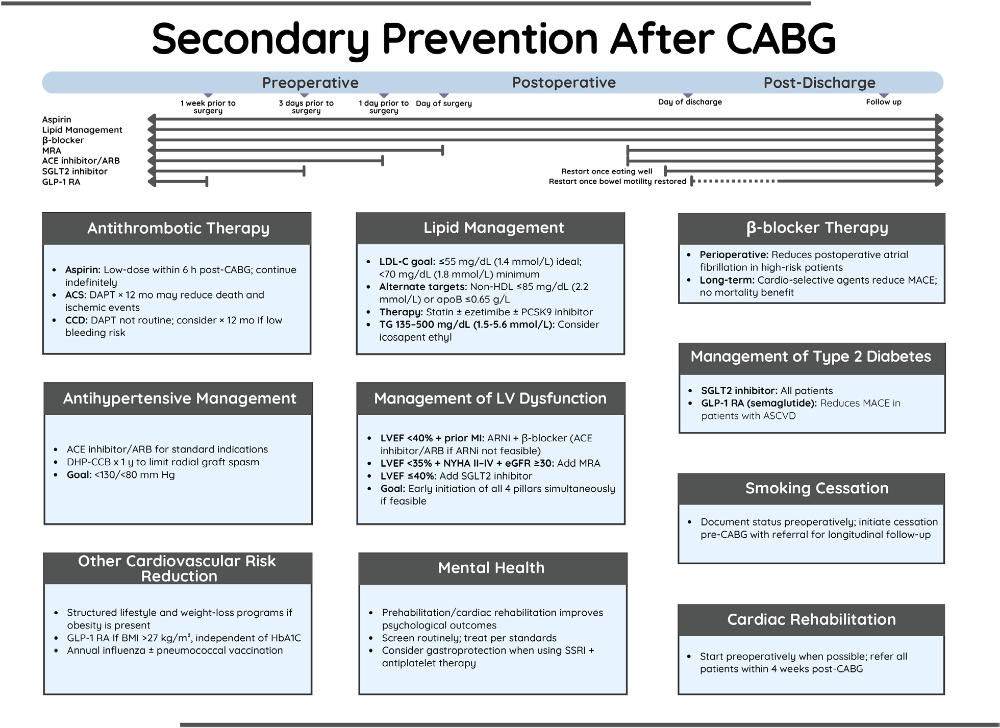

📄 [Abrir o PDF original](https://raw.githubusercontent.com/muriloffs/cardiology-agent/main/study-inbox/processados/ruel-et-al-2026-secondary-prevention-after-coronary-artery-bypass-graft-surgery-2026-update-a-scientific-statement-from.pdf)

# Prevenção Secundária Após Cirurgia de Revascularização Miocárdica (CABG): Atualização 2026 — AHA Scientific Statement

> 🎓 **Aprofunde:** Esta é uma *declaração científica* (scientific statement) da AHA — um documento de posicionamento que sintetiza evidência e oferece considerações práticas, atualizando a declaração de 2015 (Kulik et al, ref 7). Diferente de uma diretriz formal, parte das recomendações são extrapoladas de outras populações e baseadas em opinião do painel, embora muitas citem Classe/Nível das diretrizes vigentes. O cardiologista deve dominar tanto as condutas com base sólida quanto os pontos onde o painel admite incerteza (vide tabela de lacunas de conhecimento ao final).

## Introdução

A revascularização miocárdica cirúrgica (CABG, *coronary artery bypass grafting*) é uma intervenção bem estabelecida, durável e segura. Entretanto, a doença arterial coronariana (DAC) **continua progredindo após o procedimento**, exigindo manejo agressivo e por toda a vida.

Os pacientes submetidos a CABG apresentam desafios singulares para a prevenção secundária, resultantes de:
- a natureza frequentemente **grave e difusa** de sua DAC;
- as **complexidades da recuperação pós-operatória**;
- a **carga de comorbidades**;
- a importância de **garantir a patência dos enxertos a longo prazo** e de prevenir progressão da doença e eventos cardiovasculares recorrentes.

Mesmo em ensaios clínicos, a adesão à prevenção secundária tem sido subótima após CABG (refs 2–4), e grandes registros sugerem **forte correlação inversa entre as taxas de adoção dessas medidas e a mortalidade** (refs 5,6). Portanto, aprimorar as estratégias de prevenção secundária no pós-CABG tem grande impacto em saúde pública, com potencial de melhorar desfechos de milhões de indivíduos. Novas evidências e avanços surgiram desde a declaração de 2015, justificando esta atualização.

> 🎓 **Aprofunde:** A mensagem-âncora do documento: prevenção secundária após CABG **não é coadjuvante** — é determinante da sobrevida a longo prazo. A relação inversa entre adoção das medidas e mortalidade nos registros (refs 5,6 — Kulik 2008 e Björklund/SWEDEHEART 2020) é o argumento de fundo que sustenta todas as seções seguintes.

## Terapia Antitrombótica

Após a CABG, a terapia antitrombótica visa prevenir eventos cardiovasculares e falência dos enxertos. Contudo, a terapia antiplaquetária dupla (DAPT, *dual antiplatelet therapy*) e a adição de anticoagulante oral (OAC) à terapia antiplaquetária **aumentam o risco de sangramento** (ref 8). Por isso, a escolha da estratégia exige pesagem cuidadosa entre benefício anti-isquêmico esperado e risco hemorrágico.

### Aspirina

A aspirina após CABG associa-se a **redução do risco de morte e complicações isquêmicas** (refs 8,9) e a **redução da oclusão dos enxertos** (ref 10).

Recomendação central: uma dose **baixa (100 mg) a média (325 mg) de aspirina deve ser iniciada dentro de 6 horas após a CABG e mantida indefinidamente** para melhorar a patência dos enxertos e reduzir eventos cardiovasculares futuros (**Classe 1; Nível de Evidência A**) (refs 11–13).

A dose baixa parece suficiente porque **excede a dose mínima efetiva necessária para suprimir o tromboxano A2 plaquetário** (ref 14), enquanto doses mais altas aumentam o risco de sangramento gastrointestinal (refs 15,16).

Sobre o período perioperatório: embora manter a aspirina perioperatoriamente associe-se a maior perda sanguínea perioperatória e mais transfusões (mas **sem** aumento do risco de reexploração cirúrgica) (ref 9), pacientes **já em uso de aspirina podem mantê-la até a cirurgia** para reduzir o risco de infarto do miocárdio (IAM) perioperatório (ref 18). Por outro lado, **não há evidência de benefício** com a iniciação pré-operatória imediata (<24 horas) de aspirina em pacientes que vão para CABG eletiva e que são virgens de aspirina ou nos quais ela foi descontinuada (refs 13,18,19).

Em pacientes com **hipersensibilidade à aspirina**, pode-se considerar a **dessensibilização**. Se inviável ou malsucedida, pode-se cogitar **monoterapia com clopidogrel**, embora a evidência específica em CABG seja limitada (ref 20).

> 🎓 **Aprofunde:** Pontos a dominar sobre aspirina pós-CABG: (1) janela de início = **6 horas**; (2) dose baixa basta — não persiga doses altas (sem ganho e mais sangramento GI); (3) o estudo ATACAS (Myles et al, NEJM 2016, ref 18 — [10.1056/NEJMoa1507688](https://doi.org/10.1056/NEJMoa1507688)) mostrou que manter aspirina no pré-op não aumentou reexploração mas não há benefício em *iniciar* aspirina <24h pré-CABG no paciente virgem. (4) A base da recomendação Classe 1A inclui o estudo clássico de Mangano (NEJM 2002, ref 10) sobre aspirina e mortalidade no pós-CABG.

### Inibidores de P2Y12

Dados de análises post hoc de RCTs em pacientes com **síndrome coronariana aguda (SCA)** submetidos a CABG indicam que a **DAPT melhora a eficácia anti-isquêmica sobre a aspirina isolada**, sustentando seu uso por até 1 ano no pós-operatório nesse subgrupo de alto risco (refs 21–23).

Evidências por estudo:
- **CURE** (*Clopidogrel in Unstable Angina to Prevent Recurrent Ischemic Events*): a DAPT com clopidogrel resultou em **redução absoluta de 1,7%** nos eventos cardiovasculares maiores (MACE) comparada à aspirina (ref 21).
- **PLATO** (*Platelet Inhibition and Patient Outcomes*): o **ticagrelor reduziu em 50% as taxas de mortalidade total e cardiovascular** em 1 ano após CABG, comparado ao clopidogrel (ref 22).
- **TACSI** (*Dual Antiplatelet Therapy With Ticagrelor and Acetylsalicylic Acid vs. ASA Only After Isolated CABG in Patients With ACS*): RCT baseado em registro, com **2201 pacientes com SCA submetidos a CABG**, **não encontrou diferença** no composto de morte, IAM, AVC ou nova revascularização em 1 ano entre DAPT com ticagrelor e aspirina isolada (ref 23). Limitação importante: **altas taxas de descontinuação do tratamento**.

Na DAC crônica estável: **não há evidência definitiva de que a DAPT traga benefício clínico adicional sobre a aspirina** no pós-CABG. Contudo, a DAPT nesses pacientes **pode reduzir as taxas de oclusão dos enxertos** (refs 13,24,25).
- Uma **meta-análise em nível de paciente** combinando dados de RCT de **871 pacientes (1064 enxertos de veia safena)** mostrou que **1 ano de DAPT com ticagrelor associou-se a redução de quase 50% na falência do enxerto de veia safena** comparado à aspirina (**11,2% vs. 20%; OR 0,51 [IC 95% 0,35–0,74]; P<0,001**) (ref 26). Porém, o risco de sangramento clinicamente relevante aumentou significativamente com a DAPT, e **não houve benefício em eventos isquêmicos**.
- O efeito da DAPT na falência precoce do enxerto **parece consistente tanto para enxertos arteriais quanto venosos** (ref 24).
- O estudo **DACAB-FE** (*Different Antiplatelet Therapy Strategy After CABG — Follow-Up Extension*) encontrou **menor risco de MACE em 5 anos** nos pacientes que receberam DAPT com ticagrelor durante o primeiro ano após CABG (ref 27).
- Há evidência limitada apoiando o uso de DAPT para melhorar patência de enxerto de safena após CABG **off-pump** (ref 26) e em **DAC de alta complexidade** (ref 28).

Monoterapia com ticagrelor após CABG **não reduziu** a incidência de eventos clínicos ou falência de enxerto comparada à aspirina, embora os RCTs dedicados tenham sido **subdimensionados** (refs 29–31).

> 🎓 **Aprofunde:** A grande novidade desta atualização é o TACSI (Jeppsson et al, NEJM 2025, ref 23 — [10.1056/nejmoa2508026](https://doi.org/10.1056/nejmoa2508026)): foi o primeiro RCT com a CABG como evento **pré-randomização** (vide lacunas). Resultado neutro — desafia a extrapolação dos dados post hoc de CURE/PLATO. Domine a distinção entre **dois objetivos da DAPT**: (a) redução de eventos isquêmicos (sustentação fraca/neutra) vs. (b) **redução de falência do enxerto de safena** (sustentação melhor — meta-análise de Sandner, JAMA 2022, ref 26 — [10.1001/jama.2022.11966](https://doi.org/10.1001/jama.2022.11966)), porém ao custo de sangramento e sem ganho isquêmico.

### Anticoagulantes

Entre os pacientes submetidos a CABG no estudo **COMPASS** (*Cardiovascular Outcomes for People Using Anticoagulation Strategies*) (ref 32), a **rivaroxabana combinada à aspirina em baixa dose foi mais eficaz que a aspirina isolada na prevenção de MACE**, mas **não se associou à redução de falência do enxerto** — achado que provavelmente reflete o **mecanismo plaquetário (e não dependente da coagulação) da falência precoce do enxerto**.

> 🎓 **Aprofunde:** Conceito fisiopatológico-chave: a falência **precoce** do enxerto é **plaquetária**, e por isso a aspirina/DAPT atua nela, ao passo que a anticoagulação (rivaroxabana) atua na via da trombina e reduz MACE sistêmico **sem** impactar a oclusão do enxerto. Isso explica por que diferentes antitrombóticos têm efeitos distintos sobre enxerto vs. eventos clínicos.

### Fibrilação Atrial Pós-operatória (FAPO)

Dado o alto risco de AVC em pacientes com FA pós-operatória, a iniciação de OAC exige avaliação individual da relação risco-benefício (ref 33). Estudos observacionais mostram que a **iniciação precoce de OAC no pós-operatório não se associou a redução de AVC isquêmico ou tromboembolismo**, mas sim a **aumento do risco de sangramento maior e de mortalidade** (refs 34,35).

Uma **meta-análise de 28 estudos observacionais** envolvendo **1.698.307 pacientes** submetidos a CABG não encontrou diferença significativa no risco tromboembólico (tamanho de efeito sobre HR, −0,11; IC −0,38 a 0,13), mas sim **maior risco de sangramento** (tamanho de efeito sobre HR, 0,32; IC 0,06–0,58) nos pacientes com OAC comparados aos sem OAC (ref 36).

> 🎓 **Aprofunde:** Domine a contraintuição da FAPO: ao contrário da FA não-cirúrgica, a anticoagulação precoce no pós-CABG **não demonstrou benefício antitrombótico líquido** e foi associada a dano (sangramento e mortalidade) nos dados observacionais. A FAPO frequentemente é transitória/autolimitada. A decisão de anticoagular deve ser individualizada — não automática pelo CHA₂DS₂-VASc. Esse é um tema reconhecido como lacuna (papel da oclusão de apêndice atrial esquerdo permanece incerto, ref 171).

### Considerações Práticas para Terapia Antitrombótica Após CABG
- **Aspirina em baixa dose iniciada em até 6 horas após CABG e mantida indefinidamente** melhora a patência do enxerto e reduz eventos cardiovasculares futuros; doses mais altas não trazem benefício incremental e aumentam o risco de sangramento GI.
- Em pacientes com **SCA submetidos a CABG**, a **DAPT por 1 ano** pode associar-se a menor risco de morte e de eventos cardíacos.
- Em pacientes com **doença coronariana crônica**, a DAPT de rotina **não está indicada**. A DAPT com aspirina + clopidogrel ou ticagrelor **pode ser considerada por 1 ano para prevenir falência do enxerto** em pacientes **sem alto risco de sangramento**.

## Manejo Lipídico

A progressão da aterosclerose nas coronárias enxertadas ou nativas é exacerbada por **tabagismo continuado, adesão subótima à aspirina e perfil lipídico anormal** (LDL-C alto, HDL baixo, triglicerídeos altos) (refs 37,38). A **redução agressiva do LDL-C** reduz a progressão da aterosclerose dos enxertos e as taxas de nova revascularização (ref 38).

Problema central: **muitos pacientes pós-CABG não atingem as metas lipídicas apesar de estatinas de alta intensidade** (refs 39,40), e os **níveis de LDL-C em 1 ano após CABG associam-se independentemente a MACE a longo prazo** (ref 41).

Pacientes com CABG prévia que desenvolvem SCA têm risco acentuadamente elevado de MACE recorrente e morte (≈28% e ≈9%, respectivamente, em mediana de 2,8 anos), **mesmo sob estatina máxima** (ref 42). Embora a estatina de alta intensidade seja prescrita à maioria, a adição de terapias não-estatínicas é frequentemente necessária para atingir metas contemporâneas.

De acordo com a evidência geral no pós-CABG, **metas mínimas a atingir** são: LDL-C ≤70 mg/dL (≤1,8 mmol/L); não-HDL ≤93 mg/dL (≤2,4 mmol/L); apolipoproteína B ≤0,70 g/L (ref 43).

### Terapias e seus ensaios

- **IMPROVE-IT** (*Improved Reduction of Outcomes: Vytorin Efficacy International Trial*): demonstrou **redução absoluta de 8,8% no MACE com sinvastatina/ezetimiba vs. sinvastatina isolada** em pacientes pós-CABG, com **NNT de 11** (ref 39).
- **Inibidores de PCSK9** (proproteína convertase subtilisina/kexina tipo 9): aprimoram o controle lipídico em alto risco. No **ODYSSEY OUTCOMES** (*Evaluation of Cardiovascular Outcomes After an ACS During Treatment With Alirocumab*), pacientes submetidos a CABG tratados com **alirocumabe** atingiram LDL-C de 25–50 mg/dL (0,65–1,3 mmol/L) e tiveram **redução absoluta de 6,4% no MACE** vs. placebo (**NNT 16**) (ref 42). Apesar disso, esses pacientes **mantiveram taxa residual de MACE de 24,5% em 4 anos**, evidenciando risco persistente mesmo sob redução lipídica intensiva.
- **Icosapente de etila**: reduz eventos cardiovasculares em pacientes de alto risco com hipertrigliceridemia sob estatina. No **REDUCE-IT** (*Reduction of Cardiovascular Events With Icosapent Ethyl–Intervention Trial*), **1837 pacientes (22,5%) tinham história de CABG**; 897 randomizados para icosapente de etila e 940 para placebo. A randomização para icosapente de etila levou a **redução significativa de 24%** no composto (morte CV, IAM, AVC, revascularização coronariana ou hospitalização por angina instável) e a **redução significativa de 31% no MACE** vs. placebo (ref 44). Estima-se que **≈20%–25% dos pacientes pós-CABG sejam potencialmente elegíveis** ao icosapente de etila (ref 45), mas a terapia permanece controversa e pode ser considerada individualmente.

Sobre as opções sem desfechos CV publicados especificamente em pós-CABG (ex.: **ácido bempedoico, inclisiran**): o painel pondera que, por se tratar de população de **alto risco** (DAC cirúrgica, grave e difusa, frequentemente com enxertos de safena), é **razoável aplicar metas das diretrizes europeias**: as diretrizes ESC/EAS de 2019 e a diretriz ESC de 2021 de prevenção sugerem alvo de **<55 mg/dL (<1,4 mmol/L) para pacientes de muito alto risco** (refs 46,47). De forma um pouco mais conservadora, a diretriz **"2023 AHA/ACC/ACCP/ASPC/NLA/PCNA" para DAC crônica** e as **"2025 AHA/ACC Clinical Performance and Quality Measures para DAC crônica"** indicam que o alvo de LDL deve ser **redução ≥50% do basal e níveis <70 mg/dL (<1,8 mmol/L)** (refs 48,49).

> 🎓 **Aprofunde:** Domine a hierarquia de metas: o painel adota **<55 mg/dL como ideal** e **<70 mg/dL como estabelecido**. O detalhe fisiopatológico relevante: o risco residual permanece **alto mesmo com LDL muito baixo** (24,5% de MACE em 4 anos no ODYSSEY pós-CABG) — isso justifica a abordagem multifatorial e o conceito de "quanto mais baixo, melhor" sem um piso definido. O REDUCE-IT CABG (Verma et al, Circulation 2021, ref 44 — [10.1161/CIRCULATIONAHA.121.056290](https://doi.org/10.1161/CIRCULATIONAHA.121.056290)) é a evidência específica para hipertrigliceridemia residual neste grupo.

### Considerações Práticas para Manejo Lipídico Após CABG
- **Tratar para LDL-C de 55 mg/dL (1,4 mmol/L) como alvo ideal** e **não acima de 70 mg/dL (<1,8 mmol/L) como alvo estabelecido**. Alternativamente, considerar alvo de **não-HDL <85 mg/dL (2,2 mmol/L)** ou de **apolipoproteína B ≤0,65 g/L**.
- **Primeira linha**: estatina de alta intensidade ou máxima tolerada, visando o alvo de LDL-C.
- **Segunda linha**: se o alvo não for atingido só com estatina, **ezetimiba**.
- **Terceira linha**: se a combinação estatina + ezetimiba ainda falhar, **inibidor de PCSK9**; ou considerar **icosapente de etila** se triglicerídeos entre 135 mg/dL (1,5 mmol/L) e 500 mg/dL (5,6 mmol/L).

## Terapia com Betabloqueadores

### Betabloqueadores Pré-operatórios

A evidência que sustenta a métrica de qualidade da *Society of Thoracic Surgeons* (STS) que exige administração de betabloqueador **nas 24 horas antes da CABG** é **incerta em pacientes virgens de betabloqueador** (refs 50,51). Essas métricas, baseadas em um estudo de coorte histórico que mostrava menor mortalidade em 30 dias pós-CABG, foram desde então **desafiadas por estudos contemporâneos que não demonstram benefício** (refs 51–57), especialmente no contexto de **CABG não emergencial sem IAM recente** (ref 52).

### Perioperatório

No perioperatório, os betabloqueadores são úteis para a **prevenção de FA após CABG** (**Classe 1; Nível de Evidência B-R**) (ref 13), especialmente quando iniciados **≤72 horas no pós-operatório** em pacientes de alto risco (idade >75 anos, história de FA, maior duração do clampeamento aórtico) (ref 58).

Se o paciente **já estava em betabloqueador antes da admissão**, a continuação perioperatória associa-se a **menor mortalidade em 30 dias apenas naqueles com FEVE reduzida ≤40%**, além de **redução da FA pós-operatória e de arritmias ventriculares** (refs 58–60).

### Indicações de Longo Prazo

A evidência para a continuação de longo prazo de betabloqueadores após CABG é **amplamente extrapolada da literatura médica geral** (refs 57,61), na qual o betabloqueio seletivo reduz MACE em pacientes com **FEVE ≤40%, com ou sem IAM prévio (Classe 1; Nível de Evidência A)** e possivelmente naqueles com **FEVE ≤50%** (ref 48).

Estudos de coorte contemporâneos mostraram **menores taxas de MACE com betabloqueadores cardiosseletivos após CABG**, consistentemente impulsionadas por **redução de IAM** nos subgrupos com IAM prévio, insuficiência cardíaca, FA e FEVE reduzida (refs 62,63). Entretanto, um grande estudo do registro **SWEDEHEART não demonstrou correlação entre uso de betabloqueador e mortalidade após CABG** (ref 6).

> 🎓 **Aprofunde:** Mensagem para dominar: o benefício de betabloqueador no pós-CABG é **maior e mais sólido na FEVE reduzida (≤40%)**; fora desse subgrupo, a evidência é fraca e o registro SWEDEHEART (ref 6) **não viu redução de mortalidade**. A métrica da STS de betabloqueador pré-op em paciente virgem está **desacreditada** — domine isso, pois é um ponto de prova clássico (estudos de Brinkman, Filardo, LaPar — refs 53,55,57). O painel reconhece que o papel do betabloqueador pós-CABG "permanece controverso" (vide lacunas).

### Considerações Práticas para Betabloqueadores Após CABG
- **Pré-operatório**: não há evidência para administrar betabloqueador nas 24h antes de CABG eletiva em pacientes virgens de betabloqueador.
- **Perioperatório**: betabloqueadores são usados para **prevenir FA** em alto risco. Se já em uso, a continuação perioperatória associa-se a redução de FA, e a menor mortalidade em 30 dias e arritmias ventriculares **nos pacientes com FEVE ≤40%**.
- **Longo prazo**: betabloqueadores cardiosseletivos após CABG associam-se a **menores taxas de MACE, mas sem redução de mortalidade**.

## Terapia Anti-hipertensiva

Vários sistemas neuro-humorais e vasodilatadores endógenos são ativados precocemente após a CABG (ref 64). Como a população pós-CABG é de **alto risco cardiovascular**, médicos e pacientes devem buscar as **metas pressóricas mais estritas: <130/<80 mmHg** (refs 48,49).

Sobre classes de medicação:
- O estudo **IMAGINE** (*Ischemia Management With Accupril Post-Bypass Graft via Inhibition of the Converting Enzyme*) **não mostrou benefício clínico ao longo de 3 anos** com a iniciação precoce de inibidor da ECA (IECA) logo após CABG e, de fato, mostrou **aumento de eventos cardíacos nos primeiros 3 meses** após a CABG (ref 65).
- Em contraste, dados do registro **SWEDEHEART** após primeira CABG isolada sugeriram que a **terapia com IECA pode ser benéfica para todos os pacientes que a toleram**. Nessa coorte de baixo risco, **91% (n=28.782) tinham ao menos uma indicação Classe I** para IECA/BRA (IAM prévio, diabetes, insuficiência cardíaca, FEVE reduzida e hipertensão) (ref 66). Portanto, o uso de IECA nesse período é melhor **individualizado e reavaliado ao longo do tempo**.

### Enxerto de Artéria Radial

O papel dos **bloqueadores de canal de cálcio (BCC) após enxerto de artéria radial** permanece debatido (ref 67). RCTs foram pequenos, usaram primariamente **diltiazem** (cujo efeito pode ser limitado por ações cardíacas e venosas) e mostraram **ausência de benefício geral** (refs 68,69).

Em contraste, uma **meta-análise observacional** que reuniu dados de **6 ensaios randomizados (732 pacientes, sendo 502 em BCC e 2 ensaios especificando uso de di-hidropiridina)** mostrou **grandes tamanhos de efeito: redução de 48% no MACE e de 80% na oclusão do enxerto radial** avaliada por angiografia no seguimento de médio prazo (ref 70). O painel apoia o uso de BCC **no primeiro ano pós-operatório** para enxertos de artéria radial, **com di-hidropiridinas preferidas sobre diltiazem ou verapamil**.

> 🎓 **Aprofunde:** A divergência entre os RCTs (negativos, à base de diltiazem) e a meta-análise observacional RADIAL (Gaudino et al, JACC 2019, ref 70 — [10.1016/j.jacc.2019.02.054](https://doi.org/10.1016/j.jacc.2019.02.054)) é fundamental: o painel privilegia o sinal positivo, mas recomenda **di-hidropiridina** (amlodipino/nifedipino), pois o diltiazem/verapamil têm limitações de efeito vasodilatador direto sobre o leito do enxerto radial e mais efeitos cronotrópicos/inotrópicos negativos. O fundamento é o **espasmo da artéria radial** — vaso muscular propenso a vasoconstrição.

### Considerações Práticas para Terapia Anti-hipertensiva Após CABG
- **IECA ou BRA** estão indicados para pacientes que têm indicação clínica **além** da própria CABG (IAM prévio, diabetes, insuficiência cardíaca, FEVE reduzida e hipertensão).
- O uso de **BCC no primeiro ano pós-operatório**, com **di-hidropiridinas (ex.: amlodipino ou nifedipino) preferidas sobre não-di-hidropiridínicos (ex.: diltiazem ou verapamil)**, pode ajudar a limitar o espasmo do enxerto de artéria radial.

## Manejo de IAM Prévio e Disfunção Ventricular Esquerda

Após a CABG, a terapia médica guiada por diretrizes (GDMT, *guideline-directed medical therapy*) no contexto de IAM prévio e **FEVE reduzida persistente <40%** inclui **inibidores do sistema renina-angiotensina-aldosterona como terapia de primeira linha**, para reduzir mortalidade e hospitalização por insuficiência cardíaca, prevenir remodelamento reverso e melhorar o estado funcional (refs 71–73).

Hierarquia recomendada:
- O uso de um **inibidor da neprilisina e do receptor de angiotensina (ARNi)** é recomendado como **primeira linha (Classe 1; Nível de Evidência B-R)**, com **IECA considerado em seguida** ou uso de **BRA se o paciente for intolerante a ARNi e IECA (Classe 1; Nível de Evidência A)** (refs 74,75).
- **Betabloqueadores e IECA podem agir sinergicamente** para melhorar a FEVE e o diâmetro diastólico final mais do que o IECA isolado (refs 76,77).
- Em pacientes com **insuficiência cardíaca com fração de ejeção reduzida (ICFER), classe funcional NYHA II–III**, que toleram IECA ou BRA, recomenda-se a **substituição por ARNi**.
- Em pacientes com sintomas **NYHA II–IV persistentes, FEVE <35%, TFG estimada ≥30 mL·min⁻¹·1,73 m⁻² e potássio sérico <5,0 mEq/L**, recomenda-se a **adição de antagonista do receptor mineralocorticoide (MRA)**, conforme a diretriz **ACC/AHA 2022 (Classe 1; Nível de Evidência A)** (ref 75) e as diretrizes da **ESC (Classe II; Nível de Evidência B)** (ref 78), que expandem a indicação de MRA para FEVE levemente reduzida como parte do acompanhamento intensivo pré-alta e pós-alta precoce de pacientes hospitalizados por IC aguda (**Classe 1, Nível de Evidência B**) (ref 78).
- **Inibidores de SGLT2** (cotransportador sódio-glicose tipo 2) reduzem morte cardiovascular e hospitalização por IC em pacientes com **FEVE ≤40% sintomática, independentemente do status diabético (Classe 1; Nível de Evidência A)** (refs 75,78).

Evidências de populações não-cirúrgicas favorecem a **iniciação simultânea, sobre abordagens escalonadas tradicionais, dos 4 agentes (ARNi ou IECA, betabloqueador, MRA e inibidor de SGLT2)** no contexto de IAM prévio e FEVE reduzida (refs 79,80). O ambiente hospitalar permite **titulação supervisionada e detecção precoce de efeitos adversos**, e iniciar a GDMT no hospital **pode melhorar a adesão do paciente e a continuidade pelos profissionais de atenção primária** (refs 79–81).

Dado importante: a **GDMT pré-operatória é o mais forte preditor de sua continuação na alta após CABG (OR 7,1 [IC 95% 5,0–9,9])** (ref 81), enfatizando o valor da otimização pré-operatória. Ainda assim, o **momento ótimo de início da GDMT após a cirurgia permanece incerto**. Equipes cirúrgicas devem alavancar estratégias baseadas em equipe — seguimento precoce, telemedicina, reabilitação cardíaca (RC) e handoffs coordenados aos profissionais de atenção primária — para sustentar a implementação oportuna.

> 🎓 **Aprofunde:** Domine os "4 pilares" da ICFER aplicados ao pós-CABG: **ARNi/IECA + betabloqueador + MRA + iSGLT2**, com tendência à **iniciação simultânea** (não sequencial). O achado do OR 7,1 (Moshkovitz et al, Mayo Clin Proc 2024, ref 81 — [10.1016/j.mayocp.2023.06.022](https://doi.org/10.1016/j.mayocp.2023.06.022)) tem mensagem prática poderosa: **otimizar a GDMT ANTES da cirurgia** é o que mais garante que ela continue depois. Nuance histórica/fisiopatológica: o IMAGINE (Rouleau et al, Circulation 2008, ref 65) mostrou potencial **dano** de iniciar IECA precocemente em paciente de baixo risco logo após CABG — por isso a indicação de IECA não é universal, mas guiada por comorbidade.

### Terapia com Dispositivos

O **cardiodesfibrilador implantável (CDI)** está indicado para a **prevenção primária de morte súbita cardíaca** em:
- pacientes com **FEVE ≤40% e taquicardia ventricular sustentada induzível ou fibrilação ventricular** (**Classe 1; Nível de Evidência B-R**);
- pacientes **≥40 dias após IAM e ≥90 dias após revascularização**, com **FEVE <35% e sintomas NYHA II–III apesar da GDMT**, ou **FEVE ≤30% apesar da GDMT**, se houver expectativa de sobrevida significativa >1 ano (**Classe 1; Nível de Evidência A**) (refs 82–84).

Estudos recentes demonstraram **potencial benefício de sobrevida com implante mais precoce após CABG** (ref 85), **mas não após intervenção coronariana percutânea** (refs 86,87).

> 🎓 **Aprofunde:** Ponto de prova: período de espera convencional de **90 dias** após revascularização e **40 dias** após IAM antes do CDI. A novidade é que dados após CABG (Nakae et al, JTCVS Open 2023, ref 85) sugerem que o implante mais precoce pode beneficiar — divergindo do que se vê após ICP (REVIVED-BCIS2, ref 86). O papel da **viabilidade miocárdica** na decisão e no timing permanece incerto (ref 173 — lacuna).

### Considerações Práticas para IAM Prévio e Disfunção de VE Após CABG
- Em IAM prévio e FEVE <40% persistente: **ARNi como primeira linha**; IECA se ARNi inviável; BRA se intolerante a IECA, em **combinação com betabloqueador**. Se IC NYHA II–IV persistente, FEVE <35% e TFGe ≥30: adicionar **MRA**. As diretrizes da ESC ainda recomendam adicionar MRA como medicação pré-alta nos hospitalizados por IC aguda. **iSGLT2 são benéficos com FEVE ≤40% sintomática**.
- Se viável, **iniciar simultaneamente os 4 agentes** (ARNi ou IECA, betabloqueador, MRA, iSGLT2). Estratégias baseadas em equipe (seguimento precoce, telemedicina, RC, handoffs coordenados) sustentam implementação segura e oportuna.
- **Dispositivos**: CDI indicado para prevenção primária de morte súbita ≥40 dias após IAM ou ≥90 dias após revascularização, com FEVE <35% e NYHA II–III sob GDMT; FEVE ≤30% sob GDMT; e FEVE ≤40% com TV sustentada induzível ou FV. **Após CABG, implante antes de 90 dias pós-operatórios pode ser considerado.**

## Diabetes

### Manejo Glicêmico Perioperatório

Níveis pré-operatórios de **hemoglobina glicada (HbA1c) <6,5%** correlacionam-se com **menos complicações perioperatórias** (ref 88). Revisões da prática atual sugerem **rastreamento de diabetes em todos os pacientes** e intervenções para atingir **HbA1c <7%** quando aplicável, embora a **prevenção de hipoglicemia perioperatória** também seja consideração importante (refs 88,89). Adicionalmente, o uso de **analgesia epidural durante a cirurgia cardíaca** foi associado a **menor incidência de hiperglicemia** (refs 88,89).

Implicações perioperatórias de iSGLT2 e agonistas:
- **Inibidores de SGLT2** e **agonistas do receptor de GLP-1 (GLP-1 RA)** e os **agonistas duplos GIP–GLP-1 RA** têm implicações perioperatórias importantes. Para reduzir o risco de **cetoacidose diabética**, é prudente **descontinuar os iSGLT2 (quando clinicamente viável) ≈3 dias antes da cirurgia** e reiniciá-los no pós-operatório **assim que a ingestão oral (incluindo carboidratos) for retomada** (refs 89,90). A cetoacidose associada a iSGLT2 frequentemente se apresenta com **relativa euglicemia**.
- As **terapias baseadas em GLP-1 retardam o esvaziamento gástrico** e podem aumentar o **risco de aspiração durante anestesia geral** (refs 89,90). Esses agentes são tipicamente descontinuados **1 semana antes da cirurgia** e retomados após o restabelecimento da motilidade intestinal no pós-operatório.

> 🎓 **Aprofunde:** Dois alertas perioperatórios para dominar: (1) **iSGLT2 → cetoacidose euglicêmica** — suspender ~3 dias antes, reintroduzir só quando comendo carboidratos; (2) **GLP-1 RA → esvaziamento gástrico lento → risco de aspiração** — suspender ~1 semana antes (semanais) ou 3 dias antes (orais). Esses são pontos de segurança anestésica de alta relevância prática.

### Terapias de Prevenção Secundária de Longo Prazo em Diabetes e Obesidade para Redução do Risco Cardiometabólico

Os **inibidores de SGLT2 e GLP-1 RA são fortemente recomendados** para indivíduos com **diabetes tipo 2 e doença cardiovascular aterosclerótica (ASCVD)**, incluindo aqueles com CABG prévia, com base em múltiplos ensaios clínicos (refs 91–93).

Evidências por estudo:
- Em subanálises do **EMPA-REG OUTCOME** (*Empagliflozin Cardiovascular Outcome Event Trial in Type 2 Diabetes*), em pacientes pós-CABG com diabetes tipo 2, os HR para o iSGLT2 **empagliflozina** vs. placebo foram: **0,52 (IC 95% 0,32–0,84) para mortalidade cardiovascular**; **0,57 (IC 95% 0,39–0,83) para mortalidade por todas as causas**; **0,50 (IC 95% 0,32–0,77) para hospitalização por IC**; e **0,65 (IC 95% 0,50–0,84) para nefropatia incidente ou em piora** (ref 94).
- Os **GLP-1 RA** também demonstraram **reduzir MACE e peso corporal** em pacientes com diabetes tipo 2 e ASCVD estabelecida (refs 91–93), mas **dados específicos de CABG não estão publicados**. Em pacientes pós-CABG com diabetes tipo 2, os esforços devem focar em incorporar **uma dessas 2 classes (ou combinação)** como prevenção secundária.
- Em pessoas com **diabetes e doença arterial periférica (DAP) concomitante**, a **semaglutida** melhora a distância de caminhada máxima e livre de dor, melhora o índice tornozelo-braquial e reduz a progressão da doença, conforme avaliado no estudo **STRIDE** (*Semaglutide vs. Placebo in People With Peripheral Arterial Disease and Type 2 Diabetes*) (ref 95).

iSGLT2 na insuficiência cardíaca:
- Embora originalmente desenvolvidos para melhorar a HbA1c, os **iSGLT2 reduzem morte cardiovascular e hospitalizações por IC em pessoas com IC, com ou sem diabetes** (refs 75,78). Uma subanálise da coorte de CABG de **DAPA-HF** (*Dapagliflozin and Prevention of Adverse Outcomes in HF*) e **DELIVER** (*Dapagliflozin in HF With Preserved Ejection Fraction*) mostrou que a **dapagliflozina reduziu de forma consistente os desfechos primário e secundários-chave após CABG, em todo o espectro de FEVE**, no contexto de IC sintomática (ref 97).

GLP-1 RA em obesidade sem diabetes:
- O GLP-1 RA **semaglutida** também demonstrou **reduzir MACE em pacientes com sobrepeso e obesidade sem diabetes, mas com ASCVD estabelecida** (ref 98). Em análise de subgrupo do estudo **SELECT** (*Semaglutide Effects on Heart Disease and Stroke in Patients With Overweight or Obesity*), pacientes submetidos a CABG estavam em **maior risco de eventos cardiovasculares** comparados aos sem CABG (ref 99), e a semaglutida levou a **reduções consistentes de MACE independentemente da história de CABG**.

> 🎓 **Aprofunde:** Domine que os iSGLT2 e GLP-1 RA migraram de "antidiabéticos" para **agentes cardiometabólicos de prevenção secundária**, com indicações que **independem do controle glicêmico**. Para o pós-CABG com DM2: priorize **uma das 2 classes** (ou ambas). A subanálise EMPA-REG pós-CABG (Verma et al, Diabetologia 2018, ref 94 — [10.1007/s00125-018-4644-9](https://doi.org/10.1007/s00125-018-4644-9)) com HR ~0,5 para morte CV é o dado específico mais forte. Para IC pós-CABG (com ou sem DM): **iSGLT2** (DAPA-HF/DELIVER). Para obesidade sem DM com ASCVD: **semaglutida** (SELECT/Verma 2024, ref 99).

### Considerações Práticas para Manejo do Diabetes Após CABG

**1. Prevenção secundária de longo prazo:**
- **iSGLT2** priorizados em pacientes com diabetes e história de CABG, **independentemente da HbA1c basal** — usados primariamente pelo efeito de **redução de MACE e proteção renal**.
- **iSGLT2** priorizados em pacientes pós-CABG com **insuficiência cardíaca, independentemente do status diabético ou da fração de ejeção** — usados primariamente pelo efeito de **redução de morte CV, hospitalização por IC e eventos cardiorrenais**.
- **GLP-1 RA** priorizados em pacientes pós-CABG com **diabetes** ou com **IMC >27 kg/m² sem diabetes**, para **reduzir MACE independentemente da HbA1c**.
- **GLP-1 RA, especificamente a semaglutida**, priorizada em pessoas com **diabetes e DAP concomitante** para melhorar desfechos funcionais e prevenir progressão da doença.

**2. Considerações perioperatórias:**
- **iSGLT2 devem ser evitados em pessoas com diabetes tipo 1.**
- Quando clinicamente apropriado, **suspender iSGLT2 3 dias antes da CABG** e reiniciar após a retomada da ingestão oral, incluindo carboidratos, para reduzir o risco de cetoacidose.
- Quando clinicamente apropriado, **GLP-1 RA semanais devem ser suspensos 1 semana antes da cirurgia** e os **GLP-1 RA orais suspensos 3 dias antes**, retomados quando o paciente estiver se alimentando bem e a motilidade intestinal restabelecida.

## Cessação do Tabagismo

O tabagismo é a **principal causa prevenível de DAC** e aumenta o risco de complicações após CABG (ref 100). **Abster-se do tabagismo após CABG pode reduzir o risco de mortalidade em 5 anos em 35% e o MACE em 18%** (ref 101). Esses dados sublinham a urgência de estratégias eficazes de cessação como parte do cuidado integral.

Mecanismo: o tabagismo **induz calcificação vascular e expressão de metaloproteinases de matriz, reduzindo a patência do enxerto de veia safena** (refs 102,103). Uma **análise agrupada de 7 ensaios com 4413 pacientes** encontrou **associação direta entre tabagismo e falência do enxerto** (ref 104).

Intervenções:
- As **intervenções de cessação que combinam aconselhamento intensivo, terapia de reposição de nicotina (TRN) e farmacoterapia com bupropiona e vareniclina** são as mais eficazes (ref 105).
- Uma **revisão Cochrane** mostrou que **sistemas eletrônicos de liberação de nicotina (ENDS, ex.: cigarros eletrônicos) potencialmente melhoraram as taxas de cessação** comparados à TRN (ref 106); contudo, seus **efeitos cardiovasculares a longo prazo não são bem estudados**, exigindo interpretação cautelosa. É importante notar que os **ENDS não têm aprovação do FDA para cessação do tabagismo**; assim, as **intervenções tradicionais permanecem como primeira linha**.

Os benefícios de parar de fumar **vão além da saúde vascular e da patência do enxerto** — reduzem riscos de cânceres e de doença pulmonar obstrutiva crônica (DPOC). Evidência emergente sugere que os esforços de cessação **devem começar na fase perioperatória**; **fumantes que param mesmo até 4 semanas antes da CABG têm desfechos comparáveis aos de quem nunca fumou** (refs 100,107,108).

O **cirurgião cardíaco está bem posicionado** para discutir a importância da cessação antes da cirurgia. Identificar rotineiramente o status de tabagismo no prontuário e oferecer suporte pré-operatório de cessação são essenciais (ref 107). O **arcabouço dos 5 "As"** (*ask, advise, assess, assist, arrange* — perguntar, aconselhar, avaliar, assistir, organizar) oferece abordagem estruturada para rastreamento e tratamento (ref 107). O cuidado longitudinal beneficia-se do manejo contínuo por clínicos gerais ou especialistas em tratamento do tabaco. A recente diretriz do **NICE** para cessação em gestantes recomenda usar **monitores de monóxido de carbono** para avaliar e tratar a dependência ao tabaco, o que pode ser aplicável em pacientes de CABG (refs 108,109).

> 🎓 **Aprofunde:** Domine o número-âncora: **parar de fumar mesmo 4 semanas antes da CABG iguala os desfechos perioperatórios aos de quem nunca fumou** — argumento poderoso para o cirurgião usar a janela pré-operatória. Mecanismo a citar: tabagismo → calcificação vascular + metaloproteinases → **falência do enxerto de safena** (pooled analysis de Gaudino, Circulation 2023, ref 104). Sobre cigarros eletrônicos: a Cochrane (ref 106) sugere eficácia, mas **sem aprovação FDA e sem dados CV de longo prazo** — não é primeira linha.

### Considerações Práticas para Cessação do Tabagismo Após CABG
- O tabagismo **induz falência do enxerto e MACE**. A abstinência após CABG pode reduzir a mortalidade em 5 anos em **35%** e o MACE em **18%**.
- O cirurgião cardíaco deve **documentar o status de tabagismo, aconselhar ativamente** sobre a importância da cessação e **iniciar o suporte de cessação no pré-operatório**. Fumantes que param mesmo 4 semanas antes da CABG têm desfechos perioperatórios comparáveis aos de quem nunca fumou.
- Como em outras doenças crônicas, o cuidado longitudinal de cessação beneficia-se do **manejo contínuo por clínicos gerais ou especialistas em tratamento do tabaco**.

## Reabilitação Cardíaca e Considerações sobre Exercício

A reabilitação cardíaca (RC) para pacientes submetidos a CABG é **mais robusta quando começa no pré-operatório, continua durante a hospitalização e se estende ao cuidado ambulatorial** (refs 110,111). A **otimização pré-operatória**, particularmente em pacientes com comorbidades ou fragilidade, reduz riscos cirúrgicos, enquanto a RC pós-operatória precoce foca na recuperação acelerada.

Recomendação: **todos os pacientes com DAC e indicações apropriadas (após IAM recente, ICP ou CABG) devem ser encaminhados a um programa de RC para melhorar desfechos (Classe 1; Nível de Evidência A)** (ref 48).

Benefícios da RC:
- É uma **intervenção custo-efetiva** que melhora tolerância ao exercício, captação pulmonar de oxigênio, qualidade de vida e bem-estar psicológico, reduzindo hospitalizações, MACE e mortalidade (refs 111,112).
- A RC pode **mitigar complicações como o comprometimento cognitivo pós-operatório**, observado em **≈40% dos pacientes submetidos a CABG no longo prazo** (ref 113).
- A **mobilização precoce** baseada em exercícios de respiração profunda e fisioterapia torácica é eficaz em reduzir o comprometimento cognitivo pós-operatório e a dor (ref 114).
- Protocolos **ERAS** (*enhanced recovery after surgery*) otimizam ainda mais o cuidado perioperatório, reduzindo morbidade (broncopneumonia, síndrome do desconforto respiratório agudo, delirium pós-operatório, lesão renal aguda moderada a grave), tempo de internação, risco de readmissão e custos (ref 115).
- Protocolos de RC envolvem **treino muscular inspiratório, respiração e exercício aeróbico**, combinados a exercícios de membros superiores ou inferiores. Para pacientes internados, a RC administrada como combinação de múltiplas terapias de exercício mostrou **melhora significativa na distância de caminhada de 6 minutos** (ref 116).

Sobre a esternotomia mediana: pode associar-se a **instabilidade esternal por cicatrização retardada decorrente da desvascularização**. Um programa de exercício consistindo em **contração abdominal integrada e exercícios de membros superiores** é benéfico para **diminuir complicações esternais** (redução da separação esternal nas posições supina e sentada longa) após CABG (ref 117).

A RC ambulatorial após CABG incorpora **treino muscular inspiratório de alta intensidade, treino de resistência e exercício aeróbico**, que melhoram significativamente a capacidade funcional, a distância de caminhada de 6 minutos e o V̇O₂ de pico (refs 117,118). Prescrições de exercício individualizadas — incluindo **treino intervalado de alta intensidade (HIIT) e treino contínuo de intensidade moderada** — aprimoram a recuperação e os desfechos de saúde, ao abordar preferências e motivações dos pacientes.

Telerreabilitação:
- Oferece **alternativa flexível e acessível** para entregar RC, particularmente para idosos ou para os que não conseguem comparecer a programas presenciais. Aproveita a tecnologia para melhorar o automanejo e os desfechos de longo prazo. A telerreabilitação cardíaca transicional domiciliar fornece serviços personalizados e convenientes que se alinham às necessidades do paciente (ref 119). É importante notar que a **telerreabilitação demonstrou ser não-inferior à RC presencial em alguns ensaios randomizados** (refs 120,121).

> 🎓 **Aprofunde:** Domine o conceito de RC como **intervenção de prevenção secundária Classe 1A** — não opcional. Pontos específicos do pós-CABG: (1) RC ideal começa **pré-operatória** (prehabilitação); (2) exercícios de **contração abdominal integrada + membros superiores** reduzem instabilidade esternal (cuidado fisiopatológico com a cicatrização da esternotomia); (3) **telerreabilitação é não-inferior** à presencial — solução de acesso. Encaminhar dentro de **4 semanas** da alta.

### Considerações Práticas para RC e Exercício Após CABG
- **Todos os pacientes com DAC crônica e indicações apropriadas (após IAM recente, ICP ou CABG) devem ser encaminhados a programas de RC dentro de 4 semanas da alta** para melhorar desfechos.
- A RC é mais robusta quando começa no pré-operatório, continua durante a hospitalização e se estende ao cuidado ambulatorial.
- A **telerreabilitação** oferece alternativa flexível e acessível, particularmente para idosos ou para os que não conseguem comparecer a programas presenciais.

## Outra Redução de Risco Cardiovascular: Obesidade, Síndrome Metabólica, Nutrição, Vitaminas, Suplementos e Vacinação

O **reconhecimento da obesidade clínica como uma doença crônica formal** pela recente comissão da Lancet marca uma mudança de paradigma significativa (ref 122). Esse reconhecimento sublinha a importância de entender a obesidade clínica como uma **enfermidade de longo prazo que exige manejo multidisciplinar contínuo** para mitigar desfechos adversos.

Historicamente, o diagnóstico de obesidade baseava-se no IMC; recentemente, o conceito moderno de **"obesidade clínica"** evoluiu, **redefinindo-a como um estado de doença crônica, em vez de um fator de risco** para a saúde cardiometabólica (ref 123). Essa definição atualizada e seus critérios diagnósticos enfatizam o **impacto do excesso de adiposidade sobre a função orgânica reduzida e as limitações nas atividades de vida diária** (refs 123,124).

Fisiopatologia: a obesidade associa-se a **resistência à insulina, hipertensão e estado inflamatório generalizado**. Em uma grande coorte de pacientes submetidos a CABG isolada, a **circunferência da cintura associou-se significativamente a eventos clínicos adversos, independentemente do IMC** (ref 125).

### Manejo do peso na RC

Muitos pacientes que se inscrevem em programas de RC têm sobrepeso (ref 126). À medida que os programas de RC focam cada vez mais na prevenção secundária abrangente da DAC, o **manejo do peso emerge como prioridade**, e o cuidado deve ser oferecido **sem estigma** (ref 127). Os objetivos primários incluem **prevenir ganho de peso adicional, alcançar redução de peso e sustentar a perda a longo prazo**.

Intervenções eficazes podem mirar **prescrições de exercício individualizadas que maximizem o gasto calórico** e **aconselhamento dietético para reduzir a ingestão energética** (refs 127–129). A **participação na RC isoladamente associa-se a perda de peso mínima** (ref 129). Além de dieta e exercício, programas comportamentais de perda de peso enfatizam a importância da mudança de comportamento de saúde, incorporando **autoeficácia, definição de metas, controle de estímulos e manejo do estresse** (refs 130,131).

### Dieta

As dietas **Mediterrânea e DASH** (*Dietary Approaches to Stop Hypertension*) associam-se a benefícios de saúde de longo prazo para pacientes cardíacos (refs 131,132), e a diretriz **AHA/ACC de 2023** para DAC crônica recomenda uma **dieta enfatizando vegetais, frutas, leguminosas, oleaginosas, grãos integrais e proteína magra** para reduzir o risco de eventos de ASCVD (ref 48). **Dietas baseadas em plantas** também demonstraram eficácia em reduzir fatores de risco cardiovascular (refs 132,133). A **otimização nutricional e o aconselhamento em todas as fases do cuidado do paciente de CABG — pré, intra e pós-operatório — podem aprimorar os desfechos cirúrgicos** e apoiar a prevenção secundária da ASCVD, servindo como componente-chave tanto da prehabilitação quanto dos programas de RC (refs 134,135).

### Farmacoterapia para obesidade

Pacientes com história de CABG com obesidade, **incluindo os sem diabetes**, estão em risco aumentado de eventos cardiovasculares. Em muitos países, a **farmacoterapia é agora recomendada para pacientes com IMC ≥30 kg/m²** e para aqueles com **IMC >27 kg/m² com comorbidades relacionadas ao peso**, que falharam em obter sucesso adequado com intervenções de estilo de vida (refs 136–138).

Agentes aprovados para manejo de peso a longo prazo: **GLP-1 RA (liraglutida, semaglutida e tirzepatida), orlistate, fentermina/topiramato e naltrexona/bupropiona**.
- Os **GLP-1 RA aprovados para perda de peso demonstraram reduzir MACE em pacientes com diabetes tipo 2** em RCTs (ref 139), e a **semaglutida também demonstrou reduzir MACE em pacientes sem diabetes tipo 2** (ref 140).
- Até o momento, **apenas 1 estudo avaliou especificamente os desfechos cardiovasculares de fármacos para perda de peso em pacientes pós-CABG** (ref 99). Nessa análise, a **semaglutida vs. placebo resultou em reduções significativas e consistentes de MACE, com redução absoluta numericamente maior (2,3% vs. 1,0%) em 3 anos nos pacientes submetidos a CABG comparados aos não submetidos** (ref 99).
- O **orlistate não demonstrou redução de MACE** em ensaios clínicos randomizados. A **fentermina é contraindicada em indivíduos com ASCVD**; o efeito da **naltrexona/bupropiona sobre a ASCVD é desconhecido**.

Quando as metas de perda de peso não puderem ser alcançadas por modificação de estilo de vida, a **farmacoterapia pode ser considerada** e abordada de forma apropriada via RC após CABG.

### Vitaminas, suplementos e vacinas

Estudos de larga escala **não demonstraram benefícios cardiovasculares de multivitamínicos ou suplementos** (refs 142–144).

Vacinação:
- O **CDC dos EUA recomenda vacinas para influenza e COVID-19 para todos os adultos**. A **vacina contra influenza demonstrou reduzir eventos cardiovasculares compostos em pacientes com ASCVD** (refs 145,146). O CDC recomenda a **vacina pneumocócica para pacientes com ASCVD** (refs 147,148).
- **Não há evidência de que a vacinação pré-operatória contra COVID-19 represente risco** em pacientes de alto risco cardiovascular submetidos a CABG (ref 149), e a **vacinação pós-CABG (geralmente em ou após 1 mês do pós-operatório) é considerada segura**, com baixas taxas de complicações (ref 150). As vacinações para todos os adultos, incluindo o momento de aplicação, devem ser discutidas e adaptadas aos perfis de risco individuais.

> 🎓 **Aprofunde:** Pontos a dominar nesta seção: (1) **obesidade clínica = doença crônica** (paradigma Lancet 2025, ref 122) — não apenas fator de risco; **circunferência da cintura** prediz eventos **independentemente do IMC** (Chassé/Poirier, ref 124). (2) **Semaglutida** é o único fármaco para obesidade com dado **específico de redução de MACE no pós-CABG** (Verma 2024, ref 99). (3) Cuidado com a **fentermina (contraindicada em ASCVD)** e o **orlistate (sem redução de MACE)**. (4) Vacinas: **influenza reduz eventos CV em ASCVD** — não é só prevenção infecciosa. (5) **Suplementos/multivitamínicos: sem benefício CV**.

### Considerações Práticas para Outra Redução de Risco Cardiovascular Após CABG
- Além de dieta e exercício, **programas comportamentais de perda de peso** (autoeficácia, definição de metas, controle de estímulos, manejo do estresse) podem ser incorporados quando há obesidade.
- Estratégias eficazes podem mirar **balanço energético líquido negativo** por meio de prescrições de exercício que maximizem o gasto calórico e aconselhamento dietético para reduzir ingestão energética.
- A evidência apoia o papel da **farmacoterapia na obtenção de perda de peso significativa e redução de MACE**, tanto em pacientes com quanto sem diabetes.
- **Vacinas para influenza e pneumococo devem ser consideradas em indivíduos com ASCVD.**
- As vacinações para todos os adultos devem ser discutidas e adaptadas aos perfis de risco individuais.

## Saúde Mental e Comprometimento Cognitivo

Fatores de risco psicossociais — **depressão, ansiedade, raiva/hostilidade, isolamento social, baixo nível socioeconômico e estresse crônico** — contribuem para comportamentos de saúde negativos, como tabagismo, escolhas alimentares ruins, sedentarismo e redução da adesão aos tratamentos (refs 151–155).

Entre os pacientes submetidos a CABG, a **depressão é prevalente em 19% a 37% no pré-operatório e frequentemente persiste após a cirurgia** (ref 156). Depressão e ansiedade são comuns em participantes de RC, com a **depressão fortemente correlacionada a estresse psicológico e à diminuição da adesão às estratégias de prevenção secundária** (refs 152,154,155,157).

Portanto, é essencial **avaliar fatores de risco psicossociais e distúrbio do humor por entrevistas clínicas ou instrumentos padronizados, antes e após a cirurgia** (refs 152,156,158). Intervenções direcionadas, incluindo **farmacoterapia e psicoterapia**, podem ser implementadas conforme padrões estabelecidos (ref 13).

Alerta farmacológico:
- Os **inibidores seletivos da recaptação de serotonina (ISRS)** são antidepressivos comumente usados. Eles **afetam a função plaquetária** e associam-se a **aumento modesto do risco de sangramento gastrointestinal alto** (ref 159). Em pacientes com DAC em terapia antiplaquetária, deve-se considerar o **manejo concomitante com agentes gastroprotetores, como inibidores de bomba de prótons**, quando um ISRS for iniciado.

Delirium e disfunção cognitiva pós-operatórios:
- Ocorrem frequentemente após CABG, afetando adversamente a qualidade de vida e aumentando o risco de mortalidade. Pacientes com **depressão pré-operatória têm o dobro do risco de delirium**, enquanto aqueles com **comprometimento cognitivo pré-operatório têm risco 4 vezes maior** (ref 113). Uma meta-análise identificou **depressão, diabetes e hipertensão como correlatos adicionais** dessas complicações (ref 113).
- Manejo intensivo por **farmacologia, educação, modificação do comportamento de saúde e retreinamento cognitivo** representam oportunidades pré-operatórias de reduzir essas complicações.
- Inovações recentes de **técnicas cirúrgicas off-pump e "no-touch"** minimizam a manipulação aórtica, **potencialmente reduzindo o risco de lesão neurológica perioperatória**, embora evidência robusta ainda seja necessária (ref 161).
- **Prehabilitação cardíaca e programas de RC** aprimoram a saúde física e aliviam sintomas de depressão, ansiedade e hostilidade (ref 156). A **fisioterapia pré-operatória demonstrou reduzir a lesão cerebral perioperatória**, sugerindo oportunidade de mitigar comprometimentos cognitivos associados à CABG (ref 162).
- O **rastreamento sistemático de condições preexistentes pode identificar fragilidade** e informar estratégias de reabilitação personalizadas, melhorando desfechos e a adesão à prevenção secundária após CABG (refs 163–167).

> 🎓 **Aprofunde:** Domine: (1) **depressão pré-op prevalente em 19–37%** e preditor de **delirium (2×)**; comprometimento cognitivo pré-op = **risco 4× de delirium** (Greaves et al, J Am Heart Assoc 2020, ref 113 — [10.1161/JAHA.120.017275](https://doi.org/10.1161/JAHA.120.017275)). (2) Alerta de **interação ISRS + antiplaquetário → sangramento GI** — adicionar gastroproteção (IBP). (3) **Off-pump/no-touch** podem reduzir lesão neurológica (menos manipulação aórtica) — mas evidência ainda incerta (lacuna). Esses são pontos de prova frequentemente subestimados.

### Considerações Práticas para Manejo da Saúde Mental Após CABG
- **Depressão e ansiedade são comuns antes e depois da CABG** e correlacionam-se com aumento da incidência de delirium e outras complicações. É essencial **avaliar fatores psicossociais e distúrbio do humor por entrevistas clínicas ou instrumentos padronizados, antes e após a cirurgia**.
- Intervenções direcionadas para depressão e ansiedade (farmacoterapia e psicoterapia) podem ser implementadas conforme padrões estabelecidos. Quando um **ISRS for iniciado em paciente com DAC em terapia antiplaquetária, considerar agentes gastroprotetores**.
- **Prehabilitação cardíaca e programas de RC** aprimoram a saúde física e aliviam sintomas de depressão, ansiedade e hostilidade.
- O **rastreamento sistemático de condições preexistentes** pode identificar fragilidade e informar estratégias de reabilitação personalizadas, melhorando desfechos e adesão à prevenção secundária.

## Lacunas de Conhecimento e Direções Futuras

Esta declaração científica fornece forte fundamento para abordar as muitas oportunidades de otimizar terapia, comportamento e prognóstico após CABG como parte integral do manejo vitalício da DAC.

_(figura: Figura 2 — Oportunidades baseadas em doença e timing da prevenção secundária após CABG (linha do tempo pré-op → pós-op → pós-alta), com painéis por domínio: antitrombótico, lipídico, betabloqueador, anti-hipertensivo, disfunção de VE, diabetes tipo 2, cessação tabagismo, RC, saúde mental e outras reduções de risco — ver original)_

Muitos aspectos da prevenção secundária após CABG ainda requerem mais evidência:
- **DAPT**: antes do TACSI, os dados randomizados disponíveis sobre DAPT no pós-CABG em pacientes com SCA derivavam da CABG como **evento pós-randomização** (refs 22,23,169,170). Assim, a própria adequação para a CABG nos pacientes em DAPT poderia ter **selecionado pacientes mais propensos a se beneficiar (ou menos propensos a sofrer dano)** da DAPT — um viés de seleção importante.
- **FA pós-operatória**: permanece problema desafiador, para o qual as estratégias de anticoagulação podem não trazer benefício, e **não está claro se a oclusão/obliteração do apêndice atrial esquerdo melhora desfechos precoces ou dispensa o OAC** (ref 171).
- **Betabloqueadores**: o papel permanece controverso e não foi estudado em subgrupos de interesse adequadamente dimensionados após CABG — ex.: pacientes com **disfunção diastólica, FA pós-operatória, ou revascularização completa vs. incompleta**.
- **CDI**: o momento ótimo de inserção do CDI após CABG é incompletamente definido, com **eventos malignos ocasionalmente observados precocemente** apesar da recomendação ubíqua de aguardar 3 meses, e com **dados limitados sobre se a viabilidade miocárdica afeta o timing e a decisão** de usar CDI (refs 172,173).
- **Enxerto multiarterial**: o papel da prevenção secundária otimizada em **potencializar os efeitos do enxerto multiarterial é desconhecido**; relatadamente, pacientes que **não podem tomar antiplaquetários poderiam se beneficiar de enxerto totalmente arterial**, mas isso permanece não comprovado.
- **Espasmo radial tardio**: a prevenção é insuficientemente estudada, com várias perguntas em aberto — ex.: o papel de agentes farmacológicos na presença de fluxo coronariano competitivo.
- **GLP-1 RA**: o papel potencial dos GLP-1 RA na **patência de enxertos venosos e arteriais permanece desconhecido**.
- **Polifarmácia**: os efeitos gerais sobre saúde de longo prazo e qualidade de vida da **polifarmácia** em pacientes pós-CABG (que tipicamente recebem múltiplas classes de fármacos) permanecem **insuficientemente elucidados** (refs 174,175).

Pesquisas futuras devem incluir **parceiros pacientes** para fornecer perspectivas centradas no paciente, particularmente enfatizando a **tomada de decisão compartilhada** quando as decisões de tratamento (ex.: DAPT estendida ou um CDI) envolvem trade-offs significativos entre benefício e risco.

### Tabela — Lacunas de Conhecimento na Prevenção Secundária Após CABG

| Tema | Perguntas não respondidas |
|---|---|
| **DAPT** | Benefício na patência do enxerto; Aplicação a enxerto multi/totalmente arterial; Duração e dose ótimas |
| **OAC** | Timing/indicação/duração na FA pós-operatória; Papel após ablação bem-sucedida de FA e obliteração do apêndice atrial esquerdo |
| **Manejo lipídico** | Limiares mínimos de meta; Papel do tratamento da hipertrigliceridemia; Inclusão da avaliação de Lp(a) |
| **Betabloqueadores e tratamento anti-hipertensivo** | Papel se houver IAM prévio; Bloqueio de canal de cálcio no enxerto de radial; Quanto esperar para implantar CDI na disfunção grave de VE após CABG; Implante de CDI com ou sem viabilidade miocárdica após CABG |
| **Manejo do diabetes** | Papel de agentes mais novos e do manejo da obesidade nos desfechos de longo prazo e na patência do enxerto |
| **Cessação do tabagismo** | Papel de cigarros eletrônicos e produtos de cannabis nos desfechos de longo prazo |
| **Reabilitação cardíaca** | Efeito da prehabilitação e da cirurgia menos invasiva nos desfechos funcionais e de MACE de longo prazo |
| **Saúde mental** | Prevalência e impacto de longo prazo da depressão (subdiagnosticada); Efeito de técnicas off-pump e no-touch sobre eventos neurológicos perioperatórios |
| **Todos** | Importância das perspectivas centradas no paciente ao ponderar trade-offs entre risco e benefício, particularmente para intervenções de maior risco |

> 🎓 **Aprofunde:** Esta tabela é o "mapa do que não sabemos" — domine-a, pois delimita as fronteiras da evidência. Destaques: (1) **DAPT** — sustentação real é para patência de enxerto, não para eventos; o TACSI foi o primeiro RCT sem viés de seleção pós-randomização. (2) **Lp(a)** aparece como pergunta aberta no lipídico (não há recomendação formal de avaliá-la rotineiramente, mas o painel sinaliza). (3) **CDI + viabilidade miocárdica** e **timing pós-CABG** continuam indefinidos. (4) O painel valoriza explicitamente a **decisão compartilhada** em intervenções de trade-off (DAPT estendida, CDI).

## Conclusões

Desde a declaração da AHA de 2015 sobre prevenção secundária após CABG, o campo **expandiu-se tremendamente**, com novos estudos, dados e até classes inteiramente novas de medicamentos. De modo geral, a prevenção secundária após CABG **melhorou significativamente** desde 2015 sob os pontos de vista de escopo, evidência, aplicabilidade e — talvez o mais importante — **adoção**; dados sugerem maior captação mundial (refs 2,4,176–180).

Está agora **bem demonstrado que a adesão à medicação após CABG leva a melhor sobrevida e desfechos a longo prazo** (refs 2,5,178,180). Nesse período, a CABG teve **ressurgimento como a forma mais robusta e durável de revascularização miocárdica** (ref 181). A CABG está também se tornando **menos invasiva e mais frequentemente combinada a terapias intervencionistas e médicas avançadas** (ref 182), para as quais o ajuste fino e a otimização das estratégias de prevenção secundária serão particularmente relevantes para viabilizar com sucesso essas novas abordagens de revascularização e melhorar os desfechos de futuros pacientes com DAC.

> 🎓 **Aprofunde:** A mensagem de fechamento para reter: **adesão à terapia médica pós-CABG = melhor sobrevida** (mensagem reiterada do início ao fim). E a tendência do campo: CABG **menos invasiva e híbrida** (Ruel & Halkos, ref 182), tornando a prevenção secundária ainda mais central. Conecte isso à introdução — todo o documento gira em torno do eixo "prevenção secundária determina prognóstico".

## Referências citadas

1. Ruel M, Chikwe J. Coronary artery bypass grafting: past and future. *Circulation.* 2024;150:1067–1069. [10.1161/CIRCULATIONAHA.124.068312](https://doi.org/10.1161/CIRCULATIONAHA.124.068312) — [🔍 buscar](https://scholar.google.com/scholar?q=Ruel+M%2C+Chikwe+J.+Coronary+artery+bypass+grafting%3A+past+and+future.+%2ACirculation.%2A+2024%3B150%3A1067%E2%80%931069.+10.1161%2FCIRCULATIONAHA.124.068312)
2. Pinho-Gomes AC, et al. Compliance with guideline-directed medical therapy in contemporary coronary revascularization trials. *J Am Coll Cardiol.* 2018;71:591–602. [10.1016/j.jacc.2017.11.068](https://doi.org/10.1016/j.jacc.2017.11.068) — [🔍 buscar](https://scholar.google.com/scholar?q=Pinho-Gomes+AC%2C+et+al.+Compliance+with+guideline-directed+medical+therapy+in+contemporary+coronary+revascularization+trials.+%2AJ+Am+Coll+Cardiol.%2A+2018%3B71%3A591%E2%80%93602.+10.1016%2Fj.jacc.2017.11.068)
3. Milojevic M, et al. Influence of practice patterns on outcome among countries enrolled in the SYNTAX trial. *Eur J Cardiothorac Surg.* 2017;52:445–453. [10.1093/ejcts/ezx104](https://doi.org/10.1093/ejcts/ezx104) — [🔍 buscar](https://scholar.google.com/scholar?q=Milojevic+M%2C+et+al.+Influence+of+practice+patterns+on+outcome+among+countries+enrolled+in+the+SYNTAX+trial.+%2AEur+J+Cardiothorac+Surg.%2A+2017%3B52%3A445%E2%80%93453.+10.1093%2Fejcts%2Fezx104)
4. Ruel M, Kulik A. Suboptimal medical therapy after coronary revascularization: a missed opportunity. *J Am Coll Cardiol.* 2018;71:603–605. [10.1016/j.jacc.2017.12.007](https://doi.org/10.1016/j.jacc.2017.12.007) — [🔍 buscar](https://scholar.google.com/scholar?q=Ruel+M%2C+Kulik+A.+Suboptimal+medical+therapy+after+coronary+revascularization%3A+a+missed+opportunity.+%2AJ+Am+Coll+Cardiol.%2A+2018%3B71%3A603%E2%80%93605.+10.1016%2Fj.jacc.2017.12.007)
5. Kulik A, et al. Impact of statin use on outcomes after coronary artery bypass graft surgery. *Circulation.* 2008;118:1785–1792. [10.1161/CIRCULATIONAHA.108.799445](https://doi.org/10.1161/CIRCULATIONAHA.108.799445) — [🔍 buscar](https://scholar.google.com/scholar?q=Kulik+A%2C+et+al.+Impact+of+statin+use+on+outcomes+after+coronary+artery+bypass+graft+surgery.+%2ACirculation.%2A+2008%3B118%3A1785%E2%80%931792.+10.1161%2FCIRCULATIONAHA.108.799445)
6. Björklund E, et al. Secondary prevention medications after CABG and long-term survival: SWEDEHEART. *Eur Heart J.* 2020;41:1653–1661. [10.1093/eurheartj/ehz714](https://doi.org/10.1093/eurheartj/ehz714) — [🔍 buscar](https://scholar.google.com/scholar?q=Bj%C3%B6rklund+E%2C+et+al.+Secondary+prevention+medications+after+CABG+and+long-term+survival%3A+SWEDEHEART.+%2AEur+Heart+J.%2A+2020%3B41%3A1653%E2%80%931661.+10.1093%2Feurheartj%2Fehz714)
7. Kulik A, et al. Secondary prevention after coronary artery bypass graft surgery: a scientific statement from the AHA. *Circulation.* 2015;131:927–964. [10.1161/CIR.0000000000000182](https://doi.org/10.1161/CIR.0000000000000182) — [🔍 buscar](https://scholar.google.com/scholar?q=Kulik+A%2C+et+al.+Secondary+prevention+after+coronary+artery+bypass+graft+surgery%3A+a+scientific+statement+from+the+AHA.+%2ACirculation.%2A+2015%3B131%3A927%E2%80%93964.+10.1161%2FCIR.0000000000000182)
8. Björklund E, et al. Postdischarge major bleeding, MI, and mortality risk after CABG. *Heart.* 2024;110:569–577. [10.1136/heartjnl-2023-323394](https://doi.org/10.1136/heartjnl-2023-323394) — [🔍 buscar](https://scholar.google.com/scholar?q=Bj%C3%B6rklund+E%2C+et+al.+Postdischarge+major+bleeding%2C+MI%2C+and+mortality+risk+after+CABG.+%2AHeart.%2A+2024%3B110%3A569%E2%80%93577.+10.1136%2Fheartjnl-2023-323394)
9. Hastings S, Myles P, McIlroy D. Aspirin and coronary artery surgery: systematic review and meta-analysis. *Br J Anaesth.* 2015;115:376–385. [10.1093/bja/aev164](https://doi.org/10.1093/bja/aev164) — [🔍 buscar](https://scholar.google.com/scholar?q=Hastings+S%2C+Myles+P%2C+McIlroy+D.+Aspirin+and+coronary+artery+surgery%3A+systematic+review+and+meta-analysis.+%2ABr+J+Anaesth.%2A+2015%3B115%3A376%E2%80%93385.+10.1093%2Fbja%2Faev164)
10. Mangano DT; Multicenter Study of Perioperative Ischemia Research Group. Aspirin and mortality from coronary bypass surgery. *N Engl J Med.* 2002;347:1309–1317. [10.1056/NEJMoa020798](https://doi.org/10.1056/NEJMoa020798) — [🔍 buscar](https://scholar.google.com/scholar?q=Mangano+DT%3B+Multicenter+Study+of+Perioperative+Ischemia+Research+Group.+Aspirin+and+mortality+from+coronary+bypass+surgery.+%2AN+Engl+J+Med.%2A+2002%3B347%3A1309%E2%80%931317.+10.1056%2FNEJMoa020798)
11. Fremes SE, et al. Optimal antithrombotic therapy following aortocoronary bypass: a meta-analysis. *Eur J Cardiothorac Surg.* 1993;7:169–180. [10.1016/1010-7940(93)90155-5](https://doi.org/10.1016/1010-7940(93)90155-5) — [🔍 buscar](https://scholar.google.com/scholar?q=Fremes+SE%2C+et+al.+Optimal+antithrombotic+therapy+following+aortocoronary+bypass%3A+a+meta-analysis.+%2AEur+J+Cardiothorac+Surg.%2A+1993%3B7%3A169%E2%80%93180.+10.1016%2F1010-7940%2893%2990155-590155-5%29)
12. Musleh G, Dunning J. Does aspirin 6 h after CABG optimise graft patency? *Interact Cardiovasc Thorac Surg.* 2003;2:413–415. [10.1016/S1569-9293(03)00181-6](https://doi.org/10.1016/S1569-9293(03)00181-6) — [🔍 buscar](https://scholar.google.com/scholar?q=Musleh+G%2C+Dunning+J.+Does+aspirin+6+h+after+CABG+optimise+graft+patency%3F+%2AInteract+Cardiovasc+Thorac+Surg.%2A+2003%3B2%3A413%E2%80%93415.+10.1016%2FS1569-9293%2803%2900181-600181-6%29)
13. Lawton JS, et al. 2021 ACC/AHA/SCAI guideline for coronary artery revascularization. *Circulation.* 2022;145:e18–e114. [10.1161/CIR.0000000000001038](https://doi.org/10.1161/CIR.0000000000001038) — [🔍 buscar](https://scholar.google.com/scholar?q=Lawton+JS%2C+et+al.+2021+ACC%2FAHA%2FSCAI+guideline+for+coronary+artery+revascularization.+%2ACirculation.%2A+2022%3B145%3Ae18%E2%80%93e114.+10.1161%2FCIR.0000000000001038)
14. Patrono C, et al. Low-dose aspirin for the prevention of atherothrombosis. *N Engl J Med.* 2005;353:2373–2383. [10.1056/NEJMra052717](https://doi.org/10.1056/NEJMra052717) — [🔍 buscar](https://scholar.google.com/scholar?q=Patrono+C%2C+et+al.+Low-dose+aspirin+for+the+prevention+of+atherothrombosis.+%2AN+Engl+J+Med.%2A+2005%3B353%3A2373%E2%80%932383.+10.1056%2FNEJMra052717)
15. Mehta SR, et al; CURRENT-OASIS 7 Investigators. Dose comparisons of clopidogrel and aspirin in ACS. *N Engl J Med.* 2010;363:930–942. [10.1056/NEJMoa0909475](https://doi.org/10.1056/NEJMoa0909475) — [🔍 buscar](https://scholar.google.com/scholar?q=Mehta+SR%2C+et+al%3B+CURRENT-OASIS+7+Investigators.+Dose+comparisons+of+clopidogrel+and+aspirin+in+ACS.+%2AN+Engl+J+Med.%2A+2010%3B363%3A930%E2%80%93942.+10.1056%2FNEJMoa0909475)
16. Jones WS, et al; ADAPTABLE Team. Comparative effectiveness of aspirin dosing in cardiovascular disease. *N Engl J Med.* 2021;384:1981–1990. [10.1056/NEJMoa2102137](https://doi.org/10.1056/NEJMoa2102137) — [🔍 buscar](https://scholar.google.com/scholar?q=Jones+WS%2C+et+al%3B+ADAPTABLE+Team.+Comparative+effectiveness+of+aspirin+dosing+in+cardiovascular+disease.+%2AN+Engl+J+Med.%2A+2021%3B384%3A1981%E2%80%931990.+10.1056%2FNEJMoa2102137)
18. Myles PS, et al; ATACAS Investigators. Stopping vs. continuing aspirin before coronary artery surgery. *N Engl J Med.* 2016;374:728–737. [10.1056/NEJMoa1507688](https://doi.org/10.1056/NEJMoa1507688) — [🔍 buscar](https://scholar.google.com/scholar?q=Myles+PS%2C+et+al%3B+ATACAS+Investigators.+Stopping+vs.+continuing+aspirin+before+coronary+artery+surgery.+%2AN+Engl+J+Med.%2A+2016%3B374%3A728%E2%80%93737.+10.1056%2FNEJMoa1507688)
19. Deja MA, et al. Effects of preoperative aspirin in CABG: a double-blind, placebo-controlled RCT. *J Thorac Cardiovasc Surg.* 2012;144:204–209. [10.1016/j.jtcvs.2012.04.004](https://doi.org/10.1016/j.jtcvs.2012.04.004) — [🔍 buscar](https://scholar.google.com/scholar?q=Deja+MA%2C+et+al.+Effects+of+preoperative+aspirin+in+CABG%3A+a+double-blind%2C+placebo-controlled+RCT.+%2AJ+Thorac+Cardiovasc+Surg.%2A+2012%3B144%3A204%E2%80%93209.+10.1016%2Fj.jtcvs.2012.04.004)
20. Chiarito M, et al. Monotherapy with a P2Y12 inhibitor or aspirin for secondary prevention. *Lancet.* 2020;395:1487–1495. [10.1016/S0140-6736(20)30315-9](https://doi.org/10.1016/S0140-6736(20)30315-9) — [🔍 buscar](https://scholar.google.com/scholar?q=Chiarito+M%2C+et+al.+Monotherapy+with+a+P2Y12+inhibitor+or+aspirin+for+secondary+prevention.+%2ALancet.%2A+2020%3B395%3A1487%E2%80%931495.+10.1016%2FS0140-6736%2820%2930315-930315-9%29)
21. Fox KA, et al; CURE Trial. Benefits and risks of clopidogrel + aspirin in patients undergoing surgical revascularization for NSTE-ACS (CURE). *Circulation.* 2004;110:1202–1208. [10.1161/01.CIR.0000140675.85342.1B](https://doi.org/10.1161/01.CIR.0000140675.85342.1B) — [🔍 buscar](https://scholar.google.com/scholar?q=Fox+KA%2C+et+al%3B+CURE+Trial.+Benefits+and+risks+of+clopidogrel+%2B+aspirin+in+patients+undergoing+surgical+revascularization+for+NSTE-ACS+%28CURE%29.+%2ACirculation.%2A+2004%3B110%3A1202%E2%80%931208.+10.1161%2F01.CIR.0000140675.85342.1B)
22. Held C, et al. Ticagrelor versus clopidogrel in ACS undergoing CABG: PLATO. *J Am Coll Cardiol.* 2011;57:672–684. [10.1016/j.jacc.2010.10.029](https://doi.org/10.1016/j.jacc.2010.10.029) — [🔍 buscar](https://scholar.google.com/scholar?q=Held+C%2C+et+al.+Ticagrelor+versus+clopidogrel+in+ACS+undergoing+CABG%3A+PLATO.+%2AJ+Am+Coll+Cardiol.%2A+2011%3B57%3A672%E2%80%93684.+10.1016%2Fj.jacc.2010.10.029)
23. Jeppsson A, et al. Ticagrelor and aspirin or aspirin alone after coronary surgery for ACS (TACSI). *N Engl J Med.* 2025;393:2313–2323. [10.1056/nejmoa2508026](https://doi.org/10.1056/nejmoa2508026) — [🔍 buscar](https://scholar.google.com/scholar?q=Jeppsson+A%2C+et+al.+Ticagrelor+and+aspirin+or+aspirin+alone+after+coronary+surgery+for+ACS+%28TACSI%29.+%2AN+Engl+J+Med.%2A+2025%3B393%3A2313%E2%80%932323.+10.1056%2Fnejmoa2508026)
24. Cardoso R, et al. Dual versus single antiplatelet therapy after CABG: updated meta-analysis. *Int J Cardiol.* 2018;269:80–88. [10.1016/j.ijcard.2018.07.083](https://doi.org/10.1016/j.ijcard.2018.07.083) — [🔍 buscar](https://scholar.google.com/scholar?q=Cardoso+R%2C+et+al.+Dual+versus+single+antiplatelet+therapy+after+CABG%3A+updated+meta-analysis.+%2AInt+J+Cardiol.%2A+2018%3B269%3A80%E2%80%9388.+10.1016%2Fj.ijcard.2018.07.083)
25. Solo K, et al. Antithrombotic treatment after CABG: systematic review and network meta-analysis. *BMJ.* 2019;367:l5476. [10.1136/bmj.l5476](https://doi.org/10.1136/bmj.l5476) — [🔍 buscar](https://scholar.google.com/scholar?q=Solo+K%2C+et+al.+Antithrombotic+treatment+after+CABG%3A+systematic+review+and+network+meta-analysis.+%2ABMJ.%2A+2019%3B367%3Al5476.+10.1136%2Fbmj.l5476)
26. Sandner S, et al. Association of DAPT with ticagrelor with vein graft failure after CABG: systematic review and meta-analysis. *JAMA.* 2022;328:554–562. [10.1001/jama.2022.11966](https://doi.org/10.1001/jama.2022.11966) — [🔍 buscar](https://scholar.google.com/scholar?q=Sandner+S%2C+et+al.+Association+of+DAPT+with+ticagrelor+with+vein+graft+failure+after+CABG%3A+systematic+review+and+meta-analysis.+%2AJAMA.%2A+2022%3B328%3A554%E2%80%93562.+10.1001%2Fjama.2022.11966)
27. Zhu Y, et al. Antiplatelet therapy after CABG: five year follow-up of DACAB. *BMJ.* 2024;385:e075707. [10.1136/bmj-2023-075707](https://doi.org/10.1136/bmj-2023-075707) — [🔍 buscar](https://scholar.google.com/scholar?q=Zhu+Y%2C+et+al.+Antiplatelet+therapy+after+CABG%3A+five+year+follow-up+of+DACAB.+%2ABMJ.%2A+2024%3B385%3Ae075707.+10.1136%2Fbmj-2023-075707)
28. Deo SV, et al. Dual anti-platelet therapy after CABG: systematic review and meta-analysis. *J Card Surg.* 2013;28:109–116. [10.1111/jocs.12074](https://doi.org/10.1111/jocs.12074) — [🔍 buscar](https://scholar.google.com/scholar?q=Deo+SV%2C+et+al.+Dual+anti-platelet+therapy+after+CABG%3A+systematic+review+and+meta-analysis.+%2AJ+Card+Surg.%2A+2013%3B28%3A109%E2%80%93116.+10.1111%2Fjocs.12074)
29. Zhao Q, et al. Effect of ticagrelor plus aspirin, ticagrelor alone, or aspirin alone on saphenous vein graft patency 1 year after CABG (DACAB). *JAMA.* 2018;319:1677–1686. [10.1001/jama.2018.3197](https://doi.org/10.1001/jama.2018.3197) — [🔍 buscar](https://scholar.google.com/scholar?q=Zhao+Q%2C+et+al.+Effect+of+ticagrelor+plus+aspirin%2C+ticagrelor+alone%2C+or+aspirin+alone+on+saphenous+vein+graft+patency+1+year+after+CABG+%28DACAB%29.+%2AJAMA.%2A+2018%3B319%3A1677%E2%80%931686.+10.1001%2Fjama.2018.3197)
30. Schunkert H, et al. Randomized trial of ticagrelor vs. aspirin after CABG: TiCAB. *Eur Heart J.* 2019;40:2432–2440. [10.1093/eurheartj/ehz185](https://doi.org/10.1093/eurheartj/ehz185) — [🔍 buscar](https://scholar.google.com/scholar?q=Schunkert+H%2C+et+al.+Randomized+trial+of+ticagrelor+vs.+aspirin+after+CABG%3A+TiCAB.+%2AEur+Heart+J.%2A+2019%3B40%3A2432%E2%80%932440.+10.1093%2Feurheartj%2Fehz185)
31. Kulik A, et al. Ticagrelor versus aspirin and vein graft patency after coronary bypass: RCT. *J Card Surg.* 2022;37:563–570. [10.1111/jocs.16189](https://doi.org/10.1111/jocs.16189) — [🔍 buscar](https://scholar.google.com/scholar?q=Kulik+A%2C+et+al.+Ticagrelor+versus+aspirin+and+vein+graft+patency+after+coronary+bypass%3A+RCT.+%2AJ+Card+Surg.%2A+2022%3B37%3A563%E2%80%93570.+10.1111%2Fjocs.16189)
32. Lamy A, et al. Rivaroxaban, aspirin, or both to prevent early coronary bypass graft occlusion: COMPASS-CABG. *J Am Coll Cardiol.* 2019;73:121–130. [10.1016/j.jacc.2018.10.048](https://doi.org/10.1016/j.jacc.2018.10.048) — [🔍 buscar](https://scholar.google.com/scholar?q=Lamy+A%2C+et+al.+Rivaroxaban%2C+aspirin%2C+or+both+to+prevent+early+coronary+bypass+graft+occlusion%3A+COMPASS-CABG.+%2AJ+Am+Coll+Cardiol.%2A+2019%3B73%3A121%E2%80%93130.+10.1016%2Fj.jacc.2018.10.048)
33. Gaudino M, et al. Postoperative atrial fibrillation: from mechanisms to treatment. *Eur Heart J.* 2023;44:1020–1039. [10.1093/eurheartj/ehad019](https://doi.org/10.1093/eurheartj/ehad019) — [🔍 buscar](https://scholar.google.com/scholar?q=Gaudino+M%2C+et+al.+Postoperative+atrial+fibrillation%3A+from+mechanisms+to+treatment.+%2AEur+Heart+J.%2A+2023%3B44%3A1020%E2%80%931039.+10.1093%2Feurheartj%2Fehad019)
34. Taha A, et al. New-onset AF after CABG and long-term outcome: SWEDEHEART. *J Am Heart Assoc.* 2021;10:e017966. [10.1161/JAHA.120.017966](https://doi.org/10.1161/JAHA.120.017966) — [🔍 buscar](https://scholar.google.com/scholar?q=Taha+A%2C+et+al.+New-onset+AF+after+CABG+and+long-term+outcome%3A+SWEDEHEART.+%2AJ+Am+Heart+Assoc.%2A+2021%3B10%3Ae017966.+10.1161%2FJAHA.120.017966)
35. Riad FS, et al. Anticoagulation in new-onset postoperative AF: STS Adult Cardiac Surgery Database. *Heart Rhythm O2.* 2022;3:325–332. [10.1016/j.hroo.2022.06.003](https://doi.org/10.1016/j.hroo.2022.06.003) — [🔍 buscar](https://scholar.google.com/scholar?q=Riad+FS%2C+et+al.+Anticoagulation+in+new-onset+postoperative+AF%3A+STS+Adult+Cardiac+Surgery+Database.+%2AHeart+Rhythm+O2.%2A+2022%3B3%3A325%E2%80%93332.+10.1016%2Fj.hroo.2022.06.003)
36. van de Kar MRD, et al. Anticoagulation for postoperative AF after isolated CABG: a meta-analysis. *Eur Heart J.* 2024;45:2620–2630. [10.1093/eurheartj/ehae267](https://doi.org/10.1093/eurheartj/ehae267) — [🔍 buscar](https://scholar.google.com/scholar?q=van+de+Kar+MRD%2C+et+al.+Anticoagulation+for+postoperative+AF+after+isolated+CABG%3A+a+meta-analysis.+%2AEur+Heart+J.%2A+2024%3B45%3A2620%E2%80%932630.+10.1093%2Feurheartj%2Fehae267)
37. Campeau L, et al. The relation of risk factors to the development of atherosclerosis in saphenous-vein bypass grafts. *N Engl J Med.* 1984;311:1329–1332. [10.1056/NEJM198411223112101](https://doi.org/10.1056/NEJM198411223112101) — [🔍 buscar](https://scholar.google.com/scholar?q=Campeau+L%2C+et+al.+The+relation+of+risk+factors+to+the+development+of+atherosclerosis+in+saphenous-vein+bypass+grafts.+%2AN+Engl+J+Med.%2A+1984%3B311%3A1329%E2%80%931332.+10.1056%2FNEJM198411223112101)
38. Domanski MJ, et al. Prognostic factors for atherosclerosis progression in saphenous vein grafts: Post-CABG trial. *J Am Coll Cardiol.* 2000;36:1877–1883. [10.1016/s0735-1097(00)00973-6](https://doi.org/10.1016/s0735-1097(00)00973-6) — [🔍 buscar](https://scholar.google.com/scholar?q=Domanski+MJ%2C+et+al.+Prognostic+factors+for+atherosclerosis+progression+in+saphenous+vein+grafts%3A+Post-CABG+trial.+%2AJ+Am+Coll+Cardiol.%2A+2000%3B36%3A1877%E2%80%931883.+10.1016%2Fs0735-1097%2800%2900973-600973-6%29)
39. Eisen A, et al; IMPROVE-IT Investigators. Benefit of adding ezetimibe to statin in patients with prior CABG and ACS in IMPROVE-IT. *Eur Heart J.* 2016;37:3576–3584. [10.1093/eurheartj/ehw377](https://doi.org/10.1093/eurheartj/ehw377) — [🔍 buscar](https://scholar.google.com/scholar?q=Eisen+A%2C+et+al%3B+IMPROVE-IT+Investigators.+Benefit+of+adding+ezetimibe+to+statin+in+patients+with+prior+CABG+and+ACS+in+IMPROVE-IT.+%2AEur+Heart+J.%2A+2016%3B37%3A3576%E2%80%933584.+10.1093%2Feurheartj%2Fehw377)
40. Lan NSR, et al. Attainment of lipid targets following CABG: can we do better? *J Lipid Atheroscler.* 2022;11:187–196. [10.12997/jla.2022.11.2.187](https://doi.org/10.12997/jla.2022.11.2.187) — [🔍 buscar](https://scholar.google.com/scholar?q=Lan+NSR%2C+et+al.+Attainment+of+lipid+targets+following+CABG%3A+can+we+do+better%3F+%2AJ+Lipid+Atheroscler.%2A+2022%3B11%3A187%E2%80%93196.+10.12997%2Fjla.2022.11.2.187)
41. Tang L, et al. Intensive lipid-lowering therapy in predicting long-term outcomes after CABG: retrospective cohort. *J Am Heart Assoc.* 2023;12:e029397. [10.1161/JAHA.123.029397](https://doi.org/10.1161/JAHA.123.029397) — [🔍 buscar](https://scholar.google.com/scholar?q=Tang+L%2C+et+al.+Intensive+lipid-lowering+therapy+in+predicting+long-term+outcomes+after+CABG%3A+retrospective+cohort.+%2AJ+Am+Heart+Assoc.%2A+2023%3B12%3Ae029397.+10.1161%2FJAHA.123.029397)
42. Goodman SG, et al; ODYSSEY OUTCOMES Investigators. Effects of alirocumab on cardiovascular events after coronary bypass surgery. *J Am Coll Cardiol.* 2019;74:1177–1186. [10.1016/j.jacc.2019.07.015](https://doi.org/10.1016/j.jacc.2019.07.015) — [🔍 buscar](https://scholar.google.com/scholar?q=Goodman+SG%2C+et+al%3B+ODYSSEY+OUTCOMES+Investigators.+Effects+of+alirocumab+on+cardiovascular+events+after+coronary+bypass+surgery.+%2AJ+Am+Coll+Cardiol.%2A+2019%3B74%3A1177%E2%80%931186.+10.1016%2Fj.jacc.2019.07.015)
43. Pearson GJ, et al. 2021 Canadian Cardiovascular Society guidelines for the management of dyslipidemia. *Can J Cardiol.* 2021;37:1129–1150. [10.1016/j.cjca.2021.03.016](https://doi.org/10.1016/j.cjca.2021.03.016) — [🔍 buscar](https://scholar.google.com/scholar?q=Pearson+GJ%2C+et+al.+2021+Canadian+Cardiovascular+Society+guidelines+for+the+management+of+dyslipidemia.+%2ACan+J+Cardiol.%2A+2021%3B37%3A1129%E2%80%931150.+10.1016%2Fj.cjca.2021.03.016)
44. Verma S, et al; REDUCE-IT Investigators. Icosapent ethyl reduces ischemic events in patients with a history of previous CABG: REDUCE-IT CABG. *Circulation.* 2021;144:1845–1855. [10.1161/CIRCULATIONAHA.121.056290](https://doi.org/10.1161/CIRCULATIONAHA.121.056290) — [🔍 buscar](https://scholar.google.com/scholar?q=Verma+S%2C+et+al%3B+REDUCE-IT+Investigators.+Icosapent+ethyl+reduces+ischemic+events+in+patients+with+a+history+of+previous+CABG%3A+REDUCE-IT+CABG.+%2ACirculation.%2A+2021%3B144%3A1845%E2%80%931855.+10.1161%2FCIRCULATIONAHA.121.056290)
45. Kosmopoulos A, et al. Generalizability of REDUCE-IT in patients with a history of CABG. *Curr Opin Cardiol.* 2021;36:172–178. [10.1097/HCO.0000000000000800](https://doi.org/10.1097/HCO.0000000000000800) — [🔍 buscar](https://scholar.google.com/scholar?q=Kosmopoulos+A%2C+et+al.+Generalizability+of+REDUCE-IT+in+patients+with+a+history+of+CABG.+%2ACurr+Opin+Cardiol.%2A+2021%3B36%3A172%E2%80%93178.+10.1097%2FHCO.0000000000000800)
46. Mach F, et al; ESC Scientific Document Group. 2019 ESC/EAS guidelines for the management of dyslipidaemias. *Eur Heart J.* 2020;41:111–188. [10.1093/eurheartj/ehz455](https://doi.org/10.1093/eurheartj/ehz455) — [🔍 buscar](https://scholar.google.com/scholar?q=Mach+F%2C+et+al%3B+ESC+Scientific+Document+Group.+2019+ESC%2FEAS+guidelines+for+the+management+of+dyslipidaemias.+%2AEur+Heart+J.%2A+2020%3B41%3A111%E2%80%93188.+10.1093%2Feurheartj%2Fehz455)
47. Visseren FLJ, et al; ESC Scientific Document Group. 2021 ESC guidelines on cardiovascular disease prevention in clinical practice. *Eur Heart J.* 2021;42:3227–3337. [10.1093/eurheartj/ehab484](https://doi.org/10.1093/eurheartj/ehab484) — [🔍 buscar](https://scholar.google.com/scholar?q=Visseren+FLJ%2C+et+al%3B+ESC+Scientific+Document+Group.+2021+ESC+guidelines+on+cardiovascular+disease+prevention+in+clinical+practice.+%2AEur+Heart+J.%2A+2021%3B42%3A3227%E2%80%933337.+10.1093%2Feurheartj%2Fehab484)
48. Virani SS, et al. 2023 AHA/ACC/ACCP/ASPC/NLA/PCNA guideline for the management of patients with chronic coronary disease. *Circulation.* 2023;148:e9–e119. [10.1161/CIR.0000000000001168](https://doi.org/10.1161/CIR.0000000000001168) — [🔍 buscar](https://scholar.google.com/scholar?q=Virani+SS%2C+et+al.+2023+AHA%2FACC%2FACCP%2FASPC%2FNLA%2FPCNA+guideline+for+the+management+of+patients+with+chronic+coronary+disease.+%2ACirculation.%2A+2023%3B148%3Ae9%E2%80%93e119.+10.1161%2FCIR.0000000000001168)
49. Williams MS, et al. 2025 AHA/ACC clinical performance and quality measures for patients with chronic coronary disease. *Circ Cardiovasc Qual Outcomes.* 2025;18:e000140. [10.1161/hcq.0000000000000140](https://doi.org/10.1161/hcq.0000000000000140) — [🔍 buscar](https://scholar.google.com/scholar?q=Williams+MS%2C+et+al.+2025+AHA%2FACC+clinical+performance+and+quality+measures+for+patients+with+chronic+coronary+disease.+%2ACirc+Cardiovasc+Qual+Outcomes.%2A+2025%3B18%3Ae000140.+10.1161%2Fhcq.0000000000000140)
50. O'Brien SM, et al. Quality measurement in adult cardiac surgery, part 2. *Ann Thorac Surg.* 2007;83:S13–S26. [10.1016/j.athoracsur.2007.01.055](https://doi.org/10.1016/j.athoracsur.2007.01.055) — [🔍 buscar](https://scholar.google.com/scholar?q=O%27Brien+SM%2C+et+al.+Quality+measurement+in+adult+cardiac+surgery%2C+part+2.+%2AAnn+Thorac+Surg.%2A+2007%3B83%3AS13%E2%80%93S26.+10.1016%2Fj.athoracsur.2007.01.055)
51. Shahian DM, et al. Quality measurement in adult cardiac surgery, part 1. *Ann Thorac Surg.* 2007;83:S3–12. [10.1016/j.athoracsur.2007.01.053](https://doi.org/10.1016/j.athoracsur.2007.01.053) — [🔍 buscar](https://scholar.google.com/scholar?q=Shahian+DM%2C+et+al.+Quality+measurement+in+adult+cardiac+surgery%2C+part+1.+%2AAnn+Thorac+Surg.%2A+2007%3B83%3AS3%E2%80%9312.+10.1016%2Fj.athoracsur.2007.01.053)
52. Ferguson TB Jr, et al. Preoperative beta-blocker use and mortality and morbidity following CABG. *JAMA.* 2002;287:2221–2227. [10.1001/jama.287.17.2221](https://doi.org/10.1001/jama.287.17.2221) — [🔍 buscar](https://scholar.google.com/scholar?q=Ferguson+TB+Jr%2C+et+al.+Preoperative+beta-blocker+use+and+mortality+and+morbidity+following+CABG.+%2AJAMA.%2A+2002%3B287%3A2221%E2%80%932227.+10.1001%2Fjama.287.17.2221)
53. Brinkman W, et al. Preoperative beta-blocker use in CABG: national database analysis. *JAMA Intern Med.* 2014;174:1320–1327. [10.1001/jamainternmed.2014.2356](https://doi.org/10.1001/jamainternmed.2014.2356) — [🔍 buscar](https://scholar.google.com/scholar?q=Brinkman+W%2C+et+al.+Preoperative+beta-blocker+use+in+CABG%3A+national+database+analysis.+%2AJAMA+Intern+Med.%2A+2014%3B174%3A1320%E2%80%931327.+10.1001%2Fjamainternmed.2014.2356)
54. Wang L, Wang H, Hou X. Short-term effects of preoperative beta-blocker use for isolated CABG. *J Thorac Cardiovasc Surg.* 2018;155:620–629.e1. [10.1016/j.jtcvs.2017.08.025](https://doi.org/10.1016/j.jtcvs.2017.08.025) — [🔍 buscar](https://scholar.google.com/scholar?q=Wang+L%2C+Wang+H%2C+Hou+X.+Short-term+effects+of+preoperative+beta-blocker+use+for+isolated+CABG.+%2AJ+Thorac+Cardiovasc+Surg.%2A+2018%3B155%3A620%E2%80%93629.e1.+10.1016%2Fj.jtcvs.2017.08.025)
55. Filardo G, et al. Preoperative beta-blockers as a coronary surgery quality metric: lack of evidence of efficacy. *Ann Thorac Surg.* 2020;109:1150–1158. [10.1016/j.athoracsur.2019.07.056](https://doi.org/10.1016/j.athoracsur.2019.07.056) — [🔍 buscar](https://scholar.google.com/scholar?q=Filardo+G%2C+et+al.+Preoperative+beta-blockers+as+a+coronary+surgery+quality+metric%3A+lack+of+evidence+of+efficacy.+%2AAnn+Thorac+Surg.%2A+2020%3B109%3A1150%E2%80%931158.+10.1016%2Fj.athoracsur.2019.07.056)
56. O'Neal JB, et al. Effect of preoperative beta-blocker use on outcomes following cardiac surgery. *Am J Cardiol.* 2017;120:1293–1297. [10.1016/j.amjcard.2017.07.012](https://doi.org/10.1016/j.amjcard.2017.07.012) — [🔍 buscar](https://scholar.google.com/scholar?q=O%27Neal+JB%2C+et+al.+Effect+of+preoperative+beta-blocker+use+on+outcomes+following+cardiac+surgery.+%2AAm+J+Cardiol.%2A+2017%3B120%3A1293%E2%80%931297.+10.1016%2Fj.amjcard.2017.07.012)
57. LaPar DJ, et al. Preoperative beta-blocker use should not be a quality metric for CABG. *Ann Thorac Surg.* 2013;96:1539–1544. [10.1016/j.athoracsur.2013.05.059](https://doi.org/10.1016/j.athoracsur.2013.05.059) — [🔍 buscar](https://scholar.google.com/scholar?q=LaPar+DJ%2C+et+al.+Preoperative+beta-blocker+use+should+not+be+a+quality+metric+for+CABG.+%2AAnn+Thorac+Surg.%2A+2013%3B96%3A1539%E2%80%931544.+10.1016%2Fj.athoracsur.2013.05.059)
58. Couffignal C, et al. Timing of beta-blocker reintroduction and postoperative AF after cardiac surgery. *Anesthesiology.* 2020;132:267–279. [10.1097/ALN.0000000000003064](https://doi.org/10.1097/ALN.0000000000003064) — [🔍 buscar](https://scholar.google.com/scholar?q=Couffignal+C%2C+et+al.+Timing+of+beta-blocker+reintroduction+and+postoperative+AF+after+cardiac+surgery.+%2AAnesthesiology.%2A+2020%3B132%3A267%E2%80%93279.+10.1097%2FALN.0000000000003064)
59. Lin T, et al. Mortality reduction with beta-blockers in ischemic cardiomyopathy patients undergoing CABG. *Congest Heart Fail.* 2010;16:170–174. [10.1111/j.1751-7133.2010.00146.x](https://doi.org/10.1111/j.1751-7133.2010.00146.x) — [🔍 buscar](https://scholar.google.com/scholar?q=Lin+T%2C+et+al.+Mortality+reduction+with+beta-blockers+in+ischemic+cardiomyopathy+patients+undergoing+CABG.+%2ACongest+Heart+Fail.%2A+2010%3B16%3A170%E2%80%93174.+10.1111%2Fj.1751-7133.2010.00146.x)
60. Blessberger H, et al. Perioperative beta-blockers for preventing surgery-related mortality and morbidity. *Cochrane Database Syst Rev.* 2019;2019:CD13435. [10.1002/14651858.cd013435](https://doi.org/10.1002/14651858.cd013435) — [🔍 buscar](https://scholar.google.com/scholar?q=Blessberger+H%2C+et+al.+Perioperative+beta-blockers+for+preventing+surgery-related+mortality+and+morbidity.+%2ACochrane+Database+Syst+Rev.%2A+2019%3B2019%3ACD13435.+10.1002%2F14651858.cd013435)
61. Joo SJ, et al. Effect of beta-blocker therapy in patients with or without LV systolic dysfunction after acute MI. *Eur Heart J Cardiovasc Pharmacother.* 2021;7:475–482. [10.1093/ehjcvp/pvaa029](https://doi.org/10.1093/ehjcvp/pvaa029) — [🔍 buscar](https://scholar.google.com/scholar?q=Joo+SJ%2C+et+al.+Effect+of+beta-blocker+therapy+in+patients+with+or+without+LV+systolic+dysfunction+after+acute+MI.+%2AEur+Heart+J+Cardiovasc+Pharmacother.%2A+2021%3B7%3A475%E2%80%93482.+10.1093%2Fehjcvp%2Fpvaa029)
62. Lindgren M, et al. Beta blockers and long-term outcome after CABG: nationwide observational study. *Eur Heart J Cardiovasc Pharmacother.* 2022;8:529–536. [10.1093/ehjcvp/pvac006](https://doi.org/10.1093/ehjcvp/pvac006) — [🔍 buscar](https://scholar.google.com/scholar?q=Lindgren+M%2C+et+al.+Beta+blockers+and+long-term+outcome+after+CABG%3A+nationwide+observational+study.+%2AEur+Heart+J+Cardiovasc+Pharmacother.%2A+2022%3B8%3A529%E2%80%93536.+10.1093%2Fehjcvp%2Fpvac006)
63. Zhang H, et al. Efficacy of long-term beta-blocker therapy for secondary prevention after CABG. *Circulation.* 2015;131:2194–2201. [10.1161/CIRCULATIONAHA.114.014209](https://doi.org/10.1161/CIRCULATIONAHA.114.014209) — [🔍 buscar](https://scholar.google.com/scholar?q=Zhang+H%2C+et+al.+Efficacy+of+long-term+beta-blocker+therapy+for+secondary+prevention+after+CABG.+%2ACirculation.%2A+2015%3B131%3A2194%E2%80%932201.+10.1161%2FCIRCULATIONAHA.114.014209)
64. Sousa-Uva M, et al. The 2017 EACTS guidelines on perioperative medication in adult cardiac surgery and patient blood pressure management. *Eur J Cardiothorac Surg.* 2018;53:1–2. [10.1093/ejcts/ezx448](https://doi.org/10.1093/ejcts/ezx448) — [🔍 buscar](https://scholar.google.com/scholar?q=Sousa-Uva+M%2C+et+al.+The+2017+EACTS+guidelines+on+perioperative+medication+in+adult+cardiac+surgery+and+patient+blood+pressure+management.+%2AEur+J+Cardiothorac+Surg.%2A+2018%3B53%3A1%E2%80%932.+10.1093%2Fejcts%2Fezx448)
65. Rouleau JL, et al; IMAGINE Investigators. Effects of ACE inhibition in low-risk patients early after CABG. *Circulation.* 2008;117:24–31. [10.1161/CIRCULATIONAHA.106.685073](https://doi.org/10.1161/CIRCULATIONAHA.106.685073) — [🔍 buscar](https://scholar.google.com/scholar?q=Rouleau+JL%2C+et+al%3B+IMAGINE+Investigators.+Effects+of+ACE+inhibition+in+low-risk+patients+early+after+CABG.+%2ACirculation.%2A+2008%3B117%3A24%E2%80%9331.+10.1161%2FCIRCULATIONAHA.106.685073)
66. Martinsson A, et al. RAS inhibition and outcome after CABG: SWEDEHEART. *Int J Cardiol.* 2021;331:40–45. [10.1016/j.ijcard.2020.12.056](https://doi.org/10.1016/j.ijcard.2020.12.056) — [🔍 buscar](https://scholar.google.com/scholar?q=Martinsson+A%2C+et+al.+RAS+inhibition+and+outcome+after+CABG%3A+SWEDEHEART.+%2AInt+J+Cardiol.%2A+2021%3B331%3A40%E2%80%9345.+10.1016%2Fj.ijcard.2020.12.056)
67. Ruel M, Sun LY. Post-operative calcium-channel blocker use after radial artery grafting: definitive answer? *J Am Coll Cardiol.* 2019;73:2307–2309. [10.1016/j.jacc.2019.02.053](https://doi.org/10.1016/j.jacc.2019.02.053) — [🔍 buscar](https://scholar.google.com/scholar?q=Ruel+M%2C+Sun+LY.+Post-operative+calcium-channel+blocker+use+after+radial+artery+grafting%3A+definitive+answer%3F+%2AJ+Am+Coll+Cardiol.%2A+2019%3B73%3A2307%E2%80%932309.+10.1016%2Fj.jacc.2019.02.053)
68. Moran SV, et al. Predictors of radial artery patency for coronary bypass operations. *Ann Thorac Surg.* 2001;72:1552–1556. [10.1016/s0003-4975(01)03090-9](https://doi.org/10.1016/s0003-4975(01)03090-9) — [🔍 buscar](https://scholar.google.com/scholar?q=Moran+SV%2C+et+al.+Predictors+of+radial+artery+patency+for+coronary+bypass+operations.+%2AAnn+Thorac+Surg.%2A+2001%3B72%3A1552%E2%80%931556.+10.1016%2Fs0003-4975%2801%2903090-903090-9%29)
69. Gaudino M, et al. Is postoperative calcium channel blocker therapy needed in patients with radial artery grafts? *J Thorac Cardiovasc Surg.* 2005;129:532–535. [10.1016/j.jtcvs.2004.07.054](https://doi.org/10.1016/j.jtcvs.2004.07.054) — [🔍 buscar](https://scholar.google.com/scholar?q=Gaudino+M%2C+et+al.+Is+postoperative+calcium+channel+blocker+therapy+needed+in+patients+with+radial+artery+grafts%3F+%2AJ+Thorac+Cardiovasc+Surg.%2A+2005%3B129%3A532%E2%80%93535.+10.1016%2Fj.jtcvs.2004.07.054)
70. Gaudino M, et al; RADIAL Investigators. Effect of calcium-channel blocker therapy on radial artery grafts after CABG. *J Am Coll Cardiol.* 2019;73:2299–2306. [10.1016/j.jacc.2019.02.054](https://doi.org/10.1016/j.jacc.2019.02.054) — [🔍 buscar](https://scholar.google.com/scholar?q=Gaudino+M%2C+et+al%3B+RADIAL+Investigators.+Effect+of+calcium-channel+blocker+therapy+on+radial+artery+grafts+after+CABG.+%2AJ+Am+Coll+Cardiol.%2A+2019%3B73%3A2299%E2%80%932306.+10.1016%2Fj.jacc.2019.02.054)
71. CONSENSUS Trial Study Group. Effects of enalapril on mortality in severe congestive heart failure (CONSENSUS). *N Engl J Med.* 1987;316:1429–1435. [10.1056/NEJM198706043162301](https://doi.org/10.1056/NEJM198706043162301) — [🔍 buscar](https://scholar.google.com/scholar?q=CONSENSUS+Trial+Study+Group.+Effects+of+enalapril+on+mortality+in+severe+congestive+heart+failure+%28CONSENSUS%29.+%2AN+Engl+J+Med.%2A+1987%3B316%3A1429%E2%80%931435.+10.1056%2FNEJM198706043162301)
72. Cohn JN, et al. A comparison of enalapril with hydralazine-isosorbide dinitrate in chronic CHF. *N Engl J Med.* 1991;325:303–310. [10.1056/NEJM199108013250502](https://doi.org/10.1056/NEJM199108013250502) — [🔍 buscar](https://scholar.google.com/scholar?q=Cohn+JN%2C+et+al.+A+comparison+of+enalapril+with+hydralazine-isosorbide+dinitrate+in+chronic+CHF.+%2AN+Engl+J+Med.%2A+1991%3B325%3A303%E2%80%93310.+10.1056%2FNEJM199108013250502)
73. SOLVD Investigators. Effect of enalapril on survival in patients with reduced LVEF and CHF. *N Engl J Med.* 1991;325:293–302. [10.1056/NEJM199108013250501](https://doi.org/10.1056/NEJM199108013250501) — [🔍 buscar](https://scholar.google.com/scholar?q=SOLVD+Investigators.+Effect+of+enalapril+on+survival+in+patients+with+reduced+LVEF+and+CHF.+%2AN+Engl+J+Med.%2A+1991%3B325%3A293%E2%80%93302.+10.1056%2FNEJM199108013250501)
74. Maddox TM, et al. 2024 ACC expert consensus decision pathway for treatment of HFrEF. *J Am Coll Cardiol.* 2024;83:1444–1488. [10.1016/j.jacc.2023.12.024](https://doi.org/10.1016/j.jacc.2023.12.024) — [🔍 buscar](https://scholar.google.com/scholar?q=Maddox+TM%2C+et+al.+2024+ACC+expert+consensus+decision+pathway+for+treatment+of+HFrEF.+%2AJ+Am+Coll+Cardiol.%2A+2024%3B83%3A1444%E2%80%931488.+10.1016%2Fj.jacc.2023.12.024)
75. Heidenreich PA, et al. 2022 AHA/ACC/HFSA guideline for the management of heart failure. *Circulation.* 2022;145:e895–e1032. [10.1161/CIR.0000000000001063](https://doi.org/10.1161/CIR.0000000000001063) — [🔍 buscar](https://scholar.google.com/scholar?q=Heidenreich+PA%2C+et+al.+2022+AHA%2FACC%2FHFSA+guideline+for+the+management+of+heart+failure.+%2ACirculation.%2A+2022%3B145%3Ae895%E2%80%93e1032.+10.1161%2FCIR.0000000000001063)
76. Gandhi PS, et al. Beneficial effects of carvedilol as concomitant therapy to ACE inhibitor in ischemic LV systolic dysfunction. *Can J Physiol Pharmacol.* 2007;85:193–199. [10.1139/y07-006](https://doi.org/10.1139/y07-006) — [🔍 buscar](https://scholar.google.com/scholar?q=Gandhi+PS%2C+et+al.+Beneficial+effects+of+carvedilol+as+concomitant+therapy+to+ACE+inhibitor+in+ischemic+LV+systolic+dysfunction.+%2ACan+J+Physiol+Pharmacol.%2A+2007%3B85%3A193%E2%80%93199.+10.1139%2Fy07-006)
77. Maruyama Y, et al. Effect of ACE inhibitors and beta-blockers on LV remodeling after CABG. *Int Heart J.* 2008;49:385–390. [10.1536/ihj.49.385](https://doi.org/10.1536/ihj.49.385) — [🔍 buscar](https://scholar.google.com/scholar?q=Maruyama+Y%2C+et+al.+Effect+of+ACE+inhibitors+and+beta-blockers+on+LV+remodeling+after+CABG.+%2AInt+Heart+J.%2A+2008%3B49%3A385%E2%80%93390.+10.1536%2Fihj.49.385)
78. McDonagh TA, et al; ESC Scientific Document Group. 2023 Focused update of the 2021 ESC guidelines for HF. *Eur Heart J.* 2023;44:3627–3639. [10.1093/eurheartj/ehad195](https://doi.org/10.1093/eurheartj/ehad195) — [🔍 buscar](https://scholar.google.com/scholar?q=McDonagh+TA%2C+et+al%3B+ESC+Scientific+Document+Group.+2023+Focused+update+of+the+2021+ESC+guidelines+for+HF.+%2AEur+Heart+J.%2A+2023%3B44%3A3627%E2%80%933639.+10.1093%2Feurheartj%2Fehad195)
79. Schwann AN, et al. Early initiation of GDMT for heart failure after cardiac surgery. *Ann Thorac Surg.* 2024;118:792–800. [10.1016/j.athoracsur.2024.05.034](https://doi.org/10.1016/j.athoracsur.2024.05.034) — [🔍 buscar](https://scholar.google.com/scholar?q=Schwann+AN%2C+et+al.+Early+initiation+of+GDMT+for+heart+failure+after+cardiac+surgery.+%2AAnn+Thorac+Surg.%2A+2024%3B118%3A792%E2%80%93800.+10.1016%2Fj.athoracsur.2024.05.034)
80. Dixit NM, et al. Optimizing GDMT for HFrEF during hospitalization. *US Cardiol.* 2021;15:e07. [10.15420/usc.2020.29](https://doi.org/10.15420/usc.2020.29) — [🔍 buscar](https://scholar.google.com/scholar?q=Dixit+NM%2C+et+al.+Optimizing+GDMT+for+HFrEF+during+hospitalization.+%2AUS+Cardiol.%2A+2021%3B15%3Ae07.+10.15420%2Fusc.2020.29)
81. Moshkovitz Y, et al. Emulated trial for discharge prescription of GDMT and 15-year survival after CABG. *Mayo Clin Proc.* 2024;99:766–779. [10.1016/j.mayocp.2023.06.022](https://doi.org/10.1016/j.mayocp.2023.06.022) — [🔍 buscar](https://scholar.google.com/scholar?q=Moshkovitz+Y%2C+et+al.+Emulated+trial+for+discharge+prescription+of+GDMT+and+15-year+survival+after+CABG.+%2AMayo+Clin+Proc.%2A+2024%3B99%3A766%E2%80%93779.+10.1016%2Fj.mayocp.2023.06.022)
82. Al-Khatib SM, et al. 2017 AHA/ACC/HRS guideline for ventricular arrhythmias and prevention of sudden cardiac death. *Circulation.* 2018;138:e272–e391. [10.1161/CIR.0000000000000549](https://doi.org/10.1161/CIR.0000000000000549) — [🔍 buscar](https://scholar.google.com/scholar?q=Al-Khatib+SM%2C+et+al.+2017+AHA%2FACC%2FHRS+guideline+for+ventricular+arrhythmias+and+prevention+of+sudden+cardiac+death.+%2ACirculation.%2A+2018%3B138%3Ae272%E2%80%93e391.+10.1161%2FCIR.0000000000000549)
83. Epstein AE, et al. ACC/AHA/HRS 2008 guidelines for device-based therapy of cardiac rhythm abnormalities. *Circulation.* 2008;117:e350–e408. [10.1161/CIRCUALTIONAHA.108.189742](https://doi.org/10.1161/CIRCUALTIONAHA.108.189742) — [🔍 buscar](https://scholar.google.com/scholar?q=Epstein+AE%2C+et+al.+ACC%2FAHA%2FHRS+2008+guidelines+for+device-based+therapy+of+cardiac+rhythm+abnormalities.+%2ACirculation.%2A+2008%3B117%3Ae350%E2%80%93e408.+10.1161%2FCIRCUALTIONAHA.108.189742)
84. Adabag S, et al. Improvement of LV function with surgical revascularization in patients eligible for ICD. *J Cardiovasc Electrophysiol.* 2022;33:244–251. [10.1111/jce.15315](https://doi.org/10.1111/jce.15315) — [🔍 buscar](https://scholar.google.com/scholar?q=Adabag+S%2C+et+al.+Improvement+of+LV+function+with+surgical+revascularization+in+patients+eligible+for+ICD.+%2AJ+Cardiovasc+Electrophysiol.%2A+2022%3B33%3A244%E2%80%93251.+10.1111%2Fjce.15315)
85. Nakae M, et al. Ventricular arrhythmias following CABG for ischemic cardiomyopathy: when to insert an ICD? *JTCVS Open.* 2023;13:163–175. [10.1016/j.xjon.2022.10.012](https://doi.org/10.1016/j.xjon.2022.10.012) — [🔍 buscar](https://scholar.google.com/scholar?q=Nakae+M%2C+et+al.+Ventricular+arrhythmias+following+CABG+for+ischemic+cardiomyopathy%3A+when+to+insert+an+ICD%3F+%2AJTCVS+Open.%2A+2023%3B13%3A163%E2%80%93175.+10.1016%2Fj.xjon.2022.10.012)
86. Perera D, et al; REVIVED-BCIS2 Investigators. Arrhythmia and death following percutaneous revascularization in ischemic LV dysfunction. *Circulation.* 2023;148:862–871. [10.1161/CIRCULATIONAHA.123.065300](https://doi.org/10.1161/CIRCULATIONAHA.123.065300) — [🔍 buscar](https://scholar.google.com/scholar?q=Perera+D%2C+et+al%3B+REVIVED-BCIS2+Investigators.+Arrhythmia+and+death+following+percutaneous+revascularization+in+ischemic+LV+dysfunction.+%2ACirculation.%2A+2023%3B148%3A862%E2%80%93871.+10.1161%2FCIRCULATIONAHA.123.065300)
87. Kusumoto FM, et al. HRS/ACC/AHA expert consensus statement on ICD therapy in patients not well represented in clinical trials. *Circulation.* 2014;130:94–125. [10.1161/CIR.0000000000000056](https://doi.org/10.1161/CIR.0000000000000056) — [🔍 buscar](https://scholar.google.com/scholar?q=Kusumoto+FM%2C+et+al.+HRS%2FACC%2FAHA+expert+consensus+statement+on+ICD+therapy+in+patients+not+well+represented+in+clinical+trials.+%2ACirculation.%2A+2014%3B130%3A94%E2%80%93125.+10.1161%2FCIR.0000000000000056)
88. Ljungqvist O. The enhanced recovery after surgery in cardiac surgery revolution. *JAMA Surg.* 2019;154:767. [10.1001/jamasurg.2019.1154](https://doi.org/10.1001/jamasurg.2019.1154) — [🔍 buscar](https://scholar.google.com/scholar?q=Ljungqvist+O.+The+enhanced+recovery+after+surgery+in+cardiac+surgery+revolution.+%2AJAMA+Surg.%2A+2019%3B154%3A767.+10.1001%2Fjamasurg.2019.1154)
89. Crowley K, et al. Current practice in the perioperative management of patients with diabetes mellitus: narrative review. *Br J Anaesth.* 2023;131:242–252. [10.1016/j.bja.2023.02.039](https://doi.org/10.1016/j.bja.2023.02.039) — [🔍 buscar](https://scholar.google.com/scholar?q=Crowley+K%2C+et+al.+Current+practice+in+the+perioperative+management+of+patients+with+diabetes+mellitus%3A+narrative+review.+%2ABr+J+Anaesth.%2A+2023%3B131%3A242%E2%80%93252.+10.1016%2Fj.bja.2023.02.039)
90. Mizubuti GB, et al. Perioperative management of patients on GLP-1 receptor agonists. *Curr Opin Anaesthesiol.* 2024;37:323–333. [10.1097/ACO.0000000000001348](https://doi.org/10.1097/ACO.0000000000001348) — [🔍 buscar](https://scholar.google.com/scholar?q=Mizubuti+GB%2C+et+al.+Perioperative+management+of+patients+on+GLP-1+receptor+agonists.+%2ACurr+Opin+Anaesthesiol.%2A+2024%3B37%3A323%E2%80%93333.+10.1097%2FACO.0000000000001348)
91. Mancini GBJ, et al. 2022 Canadian Cardiovascular Society guideline for use of GLP-1 RA and SGLT2i for cardiorenal risk reduction. *Can J Cardiol.* 2022;38:1153–1167. [10.1016/j.cjca.2022.04.029](https://doi.org/10.1016/j.cjca.2022.04.029) — [🔍 buscar](https://scholar.google.com/scholar?q=Mancini+GBJ%2C+et+al.+2022+Canadian+Cardiovascular+Society+guideline+for+use+of+GLP-1+RA+and+SGLT2i+for+cardiorenal+risk+reduction.+%2ACan+J+Cardiol.%2A+2022%3B38%3A1153%E2%80%931167.+10.1016%2Fj.cjca.2022.04.029)
92. American Diabetes Association Professional Practice Committee. 10. Cardiovascular disease and risk management: Standards of Care in Diabetes–2024. *Diabetes Care.* 2024;47:S179–S218. [10.2337/dc24-S010](https://doi.org/10.2337/dc24-S010) — [🔍 buscar](https://scholar.google.com/scholar?q=American+Diabetes+Association+Professional+Practice+Committee.+10.+Cardiovascular+disease+and+risk+management%3A+Standards+of+Care+in+Diabetes%E2%80%932024.+%2ADiabetes+Care.%2A+2024%3B47%3AS179%E2%80%93S218.+10.2337%2Fdc24-S010)
93. Joseph JJ, et al. Comprehensive management of cardiovascular risk factors for adults with type 2 diabetes: AHA scientific statement. *Circulation.* 2022;145:e722–e759. [10.1161/CIR.0000000000001040](https://doi.org/10.1161/CIR.0000000000001040) — [🔍 buscar](https://scholar.google.com/scholar?q=Joseph+JJ%2C+et+al.+Comprehensive+management+of+cardiovascular+risk+factors+for+adults+with+type+2+diabetes%3A+AHA+scientific+statement.+%2ACirculation.%2A+2022%3B145%3Ae722%E2%80%93e759.+10.1161%2FCIR.0000000000001040)
94. Verma S, et al. Empagliflozin reduces cardiovascular events, mortality and renal events after CABG: subanalysis of EMPA-REG OUTCOME. *Diabetologia.* 2018;61:1712–1723. [10.1007/s00125-018-4644-9](https://doi.org/10.1007/s00125-018-4644-9) — [🔍 buscar](https://scholar.google.com/scholar?q=Verma+S%2C+et+al.+Empagliflozin+reduces+cardiovascular+events%2C+mortality+and+renal+events+after+CABG%3A+subanalysis+of+EMPA-REG+OUTCOME.+%2ADiabetologia.%2A+2018%3B61%3A1712%E2%80%931723.+10.1007%2Fs00125-018-4644-9)
95. Bonaca MP, et al; STRIDE Trial Investigators. Semaglutide and walking capacity in symptomatic PAD and type 2 diabetes (STRIDE). *Lancet.* 2025;405:1580–1593. [10.1016/S0140-6736(25)00509-4](https://doi.org/10.1016/S0140-6736(25)00509-4) — [🔍 buscar](https://scholar.google.com/scholar?q=Bonaca+MP%2C+et+al%3B+STRIDE+Trial+Investigators.+Semaglutide+and+walking+capacity+in+symptomatic+PAD+and+type+2+diabetes+%28STRIDE%29.+%2ALancet.%2A+2025%3B405%3A1580%E2%80%931593.+10.1016%2FS0140-6736%2825%2900509-400509-4%29)
97. Verma S, et al. Outcomes and treatment response with dapagliflozin across EF in HF with history of CABG: pooled DAPA-HF and DELIVER. *Circulation.* 2023;148:14120. (Abstract) — [buscar](https://pubmed.ncbi.nlm.nih.gov/?term=Verma+S%2C+et+al.+Outcomes+and+treatment+response+with+dapagliflozin) — [🔍 buscar](https://scholar.google.com/scholar?q=Verma+S%2C+et+al.+Outcomes+and+treatment+response+with+dapagliflozin+across+EF+in+HF+with+history+of+CABG%3A+pooled+DAPA-HF+and+DELIVER.+%2ACirculation.%2A+2023%3B148%3A14120.+%28Abstract%29+%E2%80%94+buscar)
98. Lincoff AM, et al; SELECT Trial Investigators. Semaglutide and cardiovascular outcomes in obesity without diabetes. *N Engl J Med.* 2023;389:2221–2232. [10.1056/NEJMoa2307563](https://doi.org/10.1056/NEJMoa2307563) — [🔍 buscar](https://scholar.google.com/scholar?q=Lincoff+AM%2C+et+al%3B+SELECT+Trial+Investigators.+Semaglutide+and+cardiovascular+outcomes+in+obesity+without+diabetes.+%2AN+Engl+J+Med.%2A+2023%3B389%3A2221%E2%80%932232.+10.1056%2FNEJMoa2307563)
99. Verma S, et al. Semaglutide improves cardiovascular outcomes in patients with history of CABG and obesity. *J Am Coll Cardiol.* 2024;85:541–545. [10.1016/j.jacc.2024.11.008](https://doi.org/10.1016/j.jacc.2024.11.008) — [🔍 buscar](https://scholar.google.com/scholar?q=Verma+S%2C+et+al.+Semaglutide+improves+cardiovascular+outcomes+in+patients+with+history+of+CABG+and+obesity.+%2AJ+Am+Coll+Cardiol.%2A+2024%3B85%3A541%E2%80%93545.+10.1016%2Fj.jacc.2024.11.008)
100. Masoudkabir F, et al. Smoking cessation after surgery and midterm outcomes of surgical revascularization. *Ann Thorac Surg.* 2020;109:1874–1879. [10.1016/j.athoracsur.2019.09.045](https://doi.org/10.1016/j.athoracsur.2019.09.045) — [🔍 buscar](https://scholar.google.com/scholar?q=Masoudkabir+F%2C+et+al.+Smoking+cessation+after+surgery+and+midterm+outcomes+of+surgical+revascularization.+%2AAnn+Thorac+Surg.%2A+2020%3B109%3A1874%E2%80%931879.+10.1016%2Fj.athoracsur.2019.09.045)
101. Ricker AB, et al. Preoperative intervention for smoking cessation: systematic review. *Am J Surg.* 2024;227:175–182. [10.1016/j.amjsurg.2023.10.016](https://doi.org/10.1016/j.amjsurg.2023.10.016) — [🔍 buscar](https://scholar.google.com/scholar?q=Ricker+AB%2C+et+al.+Preoperative+intervention+for+smoking+cessation%3A+systematic+review.+%2AAm+J+Surg.%2A+2024%3B227%3A175%E2%80%93182.+10.1016%2Fj.amjsurg.2023.10.016)
102. Castagna MT, et al. Incidence, location, magnitude, and clinical correlates of saphenous vein graft calcification. *Circulation.* 2005;111:1148–1152. [10.1161/01.CIR.0000157160.69812.55](https://doi.org/10.1161/01.CIR.0000157160.69812.55) — [🔍 buscar](https://scholar.google.com/scholar?q=Castagna+MT%2C+et+al.+Incidence%2C+location%2C+magnitude%2C+and+clinical+correlates+of+saphenous+vein+graft+calcification.+%2ACirculation.%2A+2005%3B111%3A1148%E2%80%931152.+10.1161%2F01.CIR.0000157160.69812.55)
103. Sun Y, et al. Secondhand smoking and MMP-2 and -9 gene expression in saphenous veins of women nonsmokers. *Ann Thorac Surg.* 2014;98:556–562. [10.1016/j.athoracsur.2014.04.096](https://doi.org/10.1016/j.athoracsur.2014.04.096) — [🔍 buscar](https://scholar.google.com/scholar?q=Sun+Y%2C+et+al.+Secondhand+smoking+and+MMP-2+and+-9+gene+expression+in+saphenous+veins+of+women+nonsmokers.+%2AAnn+Thorac+Surg.%2A+2014%3B98%3A556%E2%80%93562.+10.1016%2Fj.athoracsur.2014.04.096)
104. Gaudino M, et al. Graft failure after CABG and its association with patient characteristics and clinical events: pooled individual patient data analysis. *Circulation.* 2023;148:1305–1315. [10.1161/CIRCULATIONAHA.123.064090](https://doi.org/10.1161/CIRCULATIONAHA.123.064090) — [🔍 buscar](https://scholar.google.com/scholar?q=Gaudino+M%2C+et+al.+Graft+failure+after+CABG+and+its+association+with+patient+characteristics+and+clinical+events%3A+pooled+individual+patient+data+analysis.+%2ACirculation.%2A+2023%3B148%3A1305%E2%80%931315.+10.1161%2FCIRCULATIONAHA.123.064090)
105. Benedetto U, et al. Smoking cessation before CABG improves operative outcomes. *J Thorac Cardiovasc Surg.* 2014;148:468–474. [10.1016/j.jtcvs.2013.09.042](https://doi.org/10.1016/j.jtcvs.2013.09.042) — [🔍 buscar](https://scholar.google.com/scholar?q=Benedetto+U%2C+et+al.+Smoking+cessation+before+CABG+improves+operative+outcomes.+%2AJ+Thorac+Cardiovasc+Surg.%2A+2014%3B148%3A468%E2%80%93474.+10.1016%2Fj.jtcvs.2013.09.042)
106. Hartmann-Boyce J, et al. Electronic cigarettes for smoking cessation. *Cochrane Database Syst Rev.* 2021;9:CD010216. [10.1002/14651858.CD010216.pub6](https://doi.org/10.1002/14651858.CD010216.pub6) — [🔍 buscar](https://scholar.google.com/scholar?q=Hartmann-Boyce+J%2C+et+al.+Electronic+cigarettes+for+smoking+cessation.+%2ACochrane+Database+Syst+Rev.%2A+2021%3B9%3ACD010216.+10.1002%2F14651858.CD010216.pub6)
107. CAN-ADAPTT. Canadian Smoking Cessation Clinical Practice Guideline: Summary Statements. Centre for Addiction and Mental Health; 2011. — [buscar](https://pubmed.ncbi.nlm.nih.gov/?term=CAN-ADAPTT.+Canadian+Smoking+Cessation+Clinical+Practice+Guideline%3A+Summary+Statements.+Centre) — [🔍 buscar](https://scholar.google.com/scholar?q=CAN-ADAPTT.+Canadian+Smoking+Cessation+Clinical+Practice+Guideline%3A+Summary+Statements.+Centre+for+Addiction+and+Mental+Health%3B+2011.+%E2%80%94+buscar)
108. Tobacco: Preventing Uptake, Promoting Quitting and Treating Dependence. NICE Guideline No. 209; 2023. — [buscar](https://pubmed.ncbi.nlm.nih.gov/?term=Tobacco%3A+Preventing+Uptake%2C+Promoting+Quitting+and+Treating+Dependence.+NICE+Guideline) — [🔍 buscar](https://scholar.google.com/scholar?q=Tobacco%3A+Preventing+Uptake%2C+Promoting+Quitting+and+Treating+Dependence.+NICE+Guideline+No.+209%3B+2023.+%E2%80%94+buscar)
109. Bittoun R. Carbon monoxide meter: the essential clinical tool of smoking cessation. *J Smoking Cessation.* 2008;3:69–70. [10.1375/jsc.3.2.69](https://doi.org/10.1375/jsc.3.2.69) — [🔍 buscar](https://scholar.google.com/scholar?q=Bittoun+R.+Carbon+monoxide+meter%3A+the+essential+clinical+tool+of+smoking+cessation.+%2AJ+Smoking+Cessation.%2A+2008%3B3%3A69%E2%80%9370.+10.1375%2Fjsc.3.2.69)
110. Scheenstra B, et al; DCC Trial Investigators. Effect of teleprehabilitation on adverse events after elective cardiac surgery: RCT. *J Am Coll Cardiol.* 2025;85:788–800. [10.1016/j.jacc.2024.10.064](https://doi.org/10.1016/j.jacc.2024.10.064) — [🔍 buscar](https://scholar.google.com/scholar?q=Scheenstra+B%2C+et+al%3B+DCC+Trial+Investigators.+Effect+of+teleprehabilitation+on+adverse+events+after+elective+cardiac+surgery%3A+RCT.+%2AJ+Am+Coll+Cardiol.%2A+2025%3B85%3A788%E2%80%93800.+10.1016%2Fj.jacc.2024.10.064)
111. Huang R, et al. Cardiac rehabilitation programs for chronic heart disease: Bayesian network meta-analysis. *Can J Cardiol.* 2021;37:162–171. [10.1016/j.cjca.2020.02.072](https://doi.org/10.1016/j.cjca.2020.02.072) — [🔍 buscar](https://scholar.google.com/scholar?q=Huang+R%2C+et+al.+Cardiac+rehabilitation+programs+for+chronic+heart+disease%3A+Bayesian+network+meta-analysis.+%2ACan+J+Cardiol.%2A+2021%3B37%3A162%E2%80%93171.+10.1016%2Fj.cjca.2020.02.072)
112. Origuchi H, et al. Active participation in outpatient cardiac rehabilitation and prognosis after CABG: J-REHAB CABG Study. *Circ J.* 2020;84:427–435. [10.1253/circj.CJ-19-0650](https://doi.org/10.1253/circj.CJ-19-0650) — [🔍 buscar](https://scholar.google.com/scholar?q=Origuchi+H%2C+et+al.+Active+participation+in+outpatient+cardiac+rehabilitation+and+prognosis+after+CABG%3A+J-REHAB+CABG+Study.+%2ACirc+J.%2A+2020%3B84%3A427%E2%80%93435.+10.1253%2Fcircj.CJ-19-0650)
113. Greaves D, et al. Risk factors for delirium and cognitive decline following CABG: systematic review and meta-analysis. *J Am Heart Assoc.* 2020;9:e017275. [10.1161/JAHA.120.017275](https://doi.org/10.1161/JAHA.120.017275) — [🔍 buscar](https://scholar.google.com/scholar?q=Greaves+D%2C+et+al.+Risk+factors+for+delirium+and+cognitive+decline+following+CABG%3A+systematic+review+and+meta-analysis.+%2AJ+Am+Heart+Assoc.%2A+2020%3B9%3Ae017275.+10.1161%2FJAHA.120.017275)
114. Allahbakhshian A, et al. Comparison of early mobilization protocols on postoperative cognitive dysfunction, pain, and length of stay after CABG: RCT. *Appl Nurs Res.* 2023;73:151731. [10.1016/j.apnr.2023.151731](https://doi.org/10.1016/j.apnr.2023.151731) — [🔍 buscar](https://scholar.google.com/scholar?q=Allahbakhshian+A%2C+et+al.+Comparison+of+early+mobilization+protocols+on+postoperative+cognitive+dysfunction%2C+pain%2C+and+length+of+stay+after+CABG%3A+RCT.+%2AAppl+Nurs+Res.%2A+2023%3B73%3A151731.+10.1016%2Fj.apnr.2023.151731)
115. Schneider C, et al. ERAS program for isolated elective CABG improves postoperative outcomes. *J Thorac Cardiovasc Surg.* 2024;168:597–607.e2. [10.1016/j.jtcvs.2023.08.019](https://doi.org/10.1016/j.jtcvs.2023.08.019) — [🔍 buscar](https://scholar.google.com/scholar?q=Schneider+C%2C+et+al.+ERAS+program+for+isolated+elective+CABG+improves+postoperative+outcomes.+%2AJ+Thorac+Cardiovasc+Surg.%2A+2024%3B168%3A597%E2%80%93607.e2.+10.1016%2Fj.jtcvs.2023.08.019)
116. Moneruzzaman M, et al. Efficacy of multiple exercise therapy after CABG: systematic review of RCTs. *Rev Cardiovasc Med.* 2023;24:141. [10.31083/j.rcm2405141](https://doi.org/10.31083/j.rcm2405141) — [🔍 buscar](https://scholar.google.com/scholar?q=Moneruzzaman+M%2C+et+al.+Efficacy+of+multiple+exercise+therapy+after+CABG%3A+systematic+review+of+RCTs.+%2ARev+Cardiovasc+Med.%2A+2023%3B24%3A141.+10.31083%2Fj.rcm2405141)
117. Mehani SHM, et al. Effect of adding integrated core and graduated upper limb exercises on sternal instability after CABG: RCT. *Arch Phys Med Rehabil.* 2024;105:2245–2252. [10.1016/j.apmr.2024.08.012](https://doi.org/10.1016/j.apmr.2024.08.012) — [🔍 buscar](https://scholar.google.com/scholar?q=Mehani+SHM%2C+et+al.+Effect+of+adding+integrated+core+and+graduated+upper+limb+exercises+on+sternal+instability+after+CABG%3A+RCT.+%2AArch+Phys+Med+Rehabil.%2A+2024%3B105%3A2245%E2%80%932252.+10.1016%2Fj.apmr.2024.08.012)
118. Sahar W, et al. Effects of prehabilitation resistance training in frail patients awaiting CABG. *J Investig Med.* 2024;72:151–158. [10.1177/10815589231207795](https://doi.org/10.1177/10815589231207795) — [🔍 buscar](https://scholar.google.com/scholar?q=Sahar+W%2C+et+al.+Effects+of+prehabilitation+resistance+training+in+frail+patients+awaiting+CABG.+%2AJ+Investig+Med.%2A+2024%3B72%3A151%E2%80%93158.+10.1177%2F10815589231207795)
119. Mahfouz Khalil MI, et al. Home-based transitional cardiac telerehabilitation in older adults post CABG: RCT. *Geriatr Nurs.* 2024;59:139–149. [10.1016/j.gerinurse.2024.06.044](https://doi.org/10.1016/j.gerinurse.2024.06.044) — [🔍 buscar](https://scholar.google.com/scholar?q=Mahfouz+Khalil+MI%2C+et+al.+Home-based+transitional+cardiac+telerehabilitation+in+older+adults+post+CABG%3A+RCT.+%2AGeriatr+Nurs.%2A+2024%3B59%3A139%E2%80%93149.+10.1016%2Fj.gerinurse.2024.06.044)
120. Claes J, et al. Longer-term effects of home-based exercise interventions in coronary artery disease: systematic review and meta-analysis. *Eur J Prev Cardiol.* 2017;24:244–256. [10.1177/2047487316675823](https://doi.org/10.1177/2047487316675823) — [🔍 buscar](https://scholar.google.com/scholar?q=Claes+J%2C+et+al.+Longer-term+effects+of+home-based+exercise+interventions+in+coronary+artery+disease%3A+systematic+review+and+meta-analysis.+%2AEur+J+Prev+Cardiol.%2A+2017%3B24%3A244%E2%80%93256.+10.1177%2F2047487316675823)
121. Imran HM, et al. Home-based and hybrid cardiac rehabilitation in heart failure: systematic review and meta-analysis. *J Am Heart Assoc.* 2019;8:e012779. [10.1161/JAHA.119.012779](https://doi.org/10.1161/JAHA.119.012779) — [🔍 buscar](https://scholar.google.com/scholar?q=Imran+HM%2C+et+al.+Home-based+and+hybrid+cardiac+rehabilitation+in+heart+failure%3A+systematic+review+and+meta-analysis.+%2AJ+Am+Heart+Assoc.%2A+2019%3B8%3Ae012779.+10.1161%2FJAHA.119.012779)
122. Rubino F, et al. Definition and diagnostic criteria of clinical obesity. *Lancet Diabetes Endocrinol.* 2025;13:221–262. [10.1016/S2213-8587(24)00316-4](https://doi.org/10.1016/S2213-8587(24)00316-4) — [🔍 buscar](https://scholar.google.com/scholar?q=Rubino+F%2C+et+al.+Definition+and+diagnostic+criteria+of+clinical+obesity.+%2ALancet+Diabetes+Endocrinol.%2A+2025%3B13%3A221%E2%80%93262.+10.1016%2FS2213-8587%2824%2900316-400316-4%29)
123. Poirier P, et al. Obesity and cardiovascular disease: pathophysiology, evaluation, and effect of weight loss: AHA scientific statement. *Circulation.* 2006;113:898–918. [10.1161/CIRCULATIONAHA.106.171016](https://doi.org/10.1161/CIRCULATIONAHA.106.171016) — [🔍 buscar](https://scholar.google.com/scholar?q=Poirier+P%2C+et+al.+Obesity+and+cardiovascular+disease%3A+pathophysiology%2C+evaluation%2C+and+effect+of+weight+loss%3A+AHA+scientific+statement.+%2ACirculation.%2A+2006%3B113%3A898%E2%80%93918.+10.1161%2FCIRCULATIONAHA.106.171016)
124. Chassé M, et al. The Underestimated Belly Factor: Waist Circumference and Morbidity Following Isolated CABG. *Can J Cardiol.* 2016;32:327–335. [10.1016/j.cjca.2015.06.031](https://doi.org/10.1016/j.cjca.2015.06.031) — [🔍 buscar](https://scholar.google.com/scholar?q=Chass%C3%A9+M%2C+et+al.+The+Underestimated+Belly+Factor%3A+Waist+Circumference+and+Morbidity+Following+Isolated+CABG.+%2ACan+J+Cardiol.%2A+2016%3B32%3A327%E2%80%93335.+10.1016%2Fj.cjca.2015.06.031)
125. Ades PA, Savage PD, Harvey-Berino J. The treatment of obesity in cardiac rehabilitation. *J Cardiopulm Rehabil Prev.* 2010;30:289–298. [10.1097/HCR.0b013e3181d6f9a8](https://doi.org/10.1097/HCR.0b013e3181d6f9a8) — [🔍 buscar](https://scholar.google.com/scholar?q=Ades+PA%2C+Savage+PD%2C+Harvey-Berino+J.+The+treatment+of+obesity+in+cardiac+rehabilitation.+%2AJ+Cardiopulm+Rehabil+Prev.%2A+2010%3B30%3A289%E2%80%93298.+10.1097%2FHCR.0b013e3181d6f9a8)
126. Ades PA, Savage PD. The treatment of obesity in cardiac rehabilitation: review and practical recommendations. *J Cardiopulm Rehabil Prev.* 2021;41:295–301. [10.1097/HCR.0000000000000637](https://doi.org/10.1097/HCR.0000000000000637) — [🔍 buscar](https://scholar.google.com/scholar?q=Ades+PA%2C+Savage+PD.+The+treatment+of+obesity+in+cardiac+rehabilitation%3A+review+and+practical+recommendations.+%2AJ+Cardiopulm+Rehabil+Prev.%2A+2021%3B41%3A295%E2%80%93301.+10.1097%2FHCR.0000000000000637)
127. Khalid Z, et al. Cardiac rehabilitation for visceral obesity: a multidisciplinary approach. *J Pak Med Assoc.* 2023;73:944–946. [10.47391/JPMA.23-31](https://doi.org/10.47391/JPMA.23-31) — [🔍 buscar](https://scholar.google.com/scholar?q=Khalid+Z%2C+et+al.+Cardiac+rehabilitation+for+visceral+obesity%3A+a+multidisciplinary+approach.+%2AJ+Pak+Med+Assoc.%2A+2023%3B73%3A944%E2%80%93946.+10.47391%2FJPMA.23-31)
128. Poirier P. Is assessment and optimization of physical activity the missing link in prevention of 21st century CVD? *Can J Cardiol.* 2025;41:519–521. [10.1016/j.cjca.2025.01.002](https://doi.org/10.1016/j.cjca.2025.01.002) — [🔍 buscar](https://scholar.google.com/scholar?q=Poirier+P.+Is+assessment+and+optimization+of+physical+activity+the+missing+link+in+prevention+of+21st+century+CVD%3F+%2ACan+J+Cardiol.%2A+2025%3B41%3A519%E2%80%93521.+10.1016%2Fj.cjca.2025.01.002)
129. Barnason S, et al. Behavioral weight loss interventions for overweight and obese cardiac rehabilitation patients: systematic review. *West J Nurs Res.* 2023;45:1165–1172. [10.1177/01939459231209735](https://doi.org/10.1177/01939459231209735) — [🔍 buscar](https://scholar.google.com/scholar?q=Barnason+S%2C+et+al.+Behavioral+weight+loss+interventions+for+overweight+and+obese+cardiac+rehabilitation+patients%3A+systematic+review.+%2AWest+J+Nurs+Res.%2A+2023%3B45%3A1165%E2%80%931172.+10.1177%2F01939459231209735)
130. Olateju IV, et al. Role of behavioral interventions in the management of obesity. *Cureus.* 2021;13:e18080. [10.7759/cureus.18080](https://doi.org/10.7759/cureus.18080) — [🔍 buscar](https://scholar.google.com/scholar?q=Olateju+IV%2C+et+al.+Role+of+behavioral+interventions+in+the+management+of+obesity.+%2ACureus.%2A+2021%3B13%3Ae18080.+10.7759%2Fcureus.18080)
131. Gardner CD, et al. Popular dietary patterns: alignment with AHA 2021 dietary guidance: AHA scientific statement. *Circulation.* 2023;147:1715–1730. [10.1161/CIR.0000000000001146](https://doi.org/10.1161/CIR.0000000000001146) — [🔍 buscar](https://scholar.google.com/scholar?q=Gardner+CD%2C+et+al.+Popular+dietary+patterns%3A+alignment+with+AHA+2021+dietary+guidance%3A+AHA+scientific+statement.+%2ACirculation.%2A+2023%3B147%3A1715%E2%80%931730.+10.1161%2FCIR.0000000000001146)
132. Sebastian SA, Padda I, Johal G. Long-term impact of Mediterranean diet on CVD prevention: systematic review and meta-analysis of RCTs. *Curr Probl Cardiol.* 2024;49:102509. [10.1016/j.cpcardiol.2024.102509](https://doi.org/10.1016/j.cpcardiol.2024.102509) — [🔍 buscar](https://scholar.google.com/scholar?q=Sebastian+SA%2C+Padda+I%2C+Johal+G.+Long-term+impact+of+Mediterranean+diet+on+CVD+prevention%3A+systematic+review+and+meta-analysis+of+RCTs.+%2ACurr+Probl+Cardiol.%2A+2024%3B49%3A102509.+10.1016%2Fj.cpcardiol.2024.102509)
133. Glenn AJ, et al. Portfolio diet score and risk of cardiovascular disease. *Circulation.* 2023;148:1750–1763. [10.1161/CIRCULATIONAHA.123.065551](https://doi.org/10.1161/CIRCULATIONAHA.123.065551) — [🔍 buscar](https://scholar.google.com/scholar?q=Glenn+AJ%2C+et+al.+Portfolio+diet+score+and+risk+of+cardiovascular+disease.+%2ACirculation.%2A+2023%3B148%3A1750%E2%80%931763.+10.1161%2FCIRCULATIONAHA.123.065551)
134. Vinck EE, et al. Peri-operative nutrition in cardiovascular surgery: current pitfalls and future directions. *Acta Chir Belg.* 2022;122:77–84. [10.1080/00015458.2021.2020009](https://doi.org/10.1080/00015458.2021.2020009) — [🔍 buscar](https://scholar.google.com/scholar?q=Vinck+EE%2C+et+al.+Peri-operative+nutrition+in+cardiovascular+surgery%3A+current+pitfalls+and+future+directions.+%2AActa+Chir+Belg.%2A+2022%3B122%3A77%E2%80%9384.+10.1080%2F00015458.2021.2020009)
135. Knight JB, et al. Prehabilitation of cardiac surgical patients, part 1. *Semin Cardiothorac Vasc Anesth.* 2022;26:282–294. [10.1177/10892532221121118](https://doi.org/10.1177/10892532221121118) — [🔍 buscar](https://scholar.google.com/scholar?q=Knight+JB%2C+et+al.+Prehabilitation+of+cardiac+surgical+patients%2C+part+1.+%2ASemin+Cardiothorac+Vasc+Anesth.%2A+2022%3B26%3A282%E2%80%93294.+10.1177%2F10892532221121118)
136. Gadde KM, Apolzan JW, Berthoud H-R. Pharmacotherapy for patients with obesity. *Clin Chem.* 2018;64:118–129. [10.1373/clinchem.2017.272815](https://doi.org/10.1373/clinchem.2017.272815) — [🔍 buscar](https://scholar.google.com/scholar?q=Gadde+KM%2C+Apolzan+JW%2C+Berthoud+H-R.+Pharmacotherapy+for+patients+with+obesity.+%2AClin+Chem.%2A+2018%3B64%3A118%E2%80%93129.+10.1373%2Fclinchem.2017.272815)
137. Obesity Canada. Adult clinical practice guideline. 2025. — [buscar](https://pubmed.ncbi.nlm.nih.gov/?term=Obesity+Canada.+Adult+clinical+practice+guideline.+2025.) — [🔍 buscar](https://scholar.google.com/scholar?q=Obesity+Canada.+Adult+clinical+practice+guideline.+2025.+%E2%80%94+buscar)
138. Overweight and Obesity Management. NICE Clinical Guidelines No. 246; 2025. — [buscar](https://pubmed.ncbi.nlm.nih.gov/?term=Overweight+and+Obesity+Management.+NICE+Clinical+Guidelines+No.+246%3B+2025.) — [🔍 buscar](https://scholar.google.com/scholar?q=Overweight+and+Obesity+Management.+NICE+Clinical+Guidelines+No.+246%3B+2025.+%E2%80%94+buscar)
139. Marx N, et al. GLP-1 receptor agonists for the reduction of atherosclerotic cardiovascular risk in type 2 diabetes. *Circulation.* 2022;146:1882–1894. [10.1161/CIRCULATIONAHA.122.059595](https://doi.org/10.1161/CIRCULATIONAHA.122.059595) — [🔍 buscar](https://scholar.google.com/scholar?q=Marx+N%2C+et+al.+GLP-1+receptor+agonists+for+the+reduction+of+atherosclerotic+cardiovascular+risk+in+type+2+diabetes.+%2ACirculation.%2A+2022%3B146%3A1882%E2%80%931894.+10.1161%2FCIRCULATIONAHA.122.059595)
140. Deanfield J, et al. Semaglutide and cardiovascular outcomes in patients with obesity and prevalent heart failure: prespecified analysis of SELECT. *Lancet.* 2024;404:773–786. [10.1016/S0140-6736(24)01498-3](https://doi.org/10.1016/S0140-6736(24)01498-3) — [🔍 buscar](https://scholar.google.com/scholar?q=Deanfield+J%2C+et+al.+Semaglutide+and+cardiovascular+outcomes+in+patients+with+obesity+and+prevalent+heart+failure%3A+prespecified+analysis+of+SELECT.+%2ALancet.%2A+2024%3B404%3A773%E2%80%93786.+10.1016%2FS0140-6736%2824%2901498-301498-3%29)
142. Jenkins DJA, et al. Supplemental vitamins and minerals for CVD prevention and treatment: JACC Focus Seminar. *J Am Coll Cardiol.* 2021;77:423–436. [10.1016/j.jacc.2020.09.619](https://doi.org/10.1016/j.jacc.2020.09.619) — [🔍 buscar](https://scholar.google.com/scholar?q=Jenkins+DJA%2C+et+al.+Supplemental+vitamins+and+minerals+for+CVD+prevention+and+treatment%3A+JACC+Focus+Seminar.+%2AJ+Am+Coll+Cardiol.%2A+2021%3B77%3A423%E2%80%93436.+10.1016%2Fj.jacc.2020.09.619)
143. Sunkara A, Raizner A. Supplemental vitamins and minerals for CVD prevention and treatment. *Methodist Debakey Cardiovasc J.* 2019;15:179–184. [10.14797/mdcj-15-3-179](https://doi.org/10.14797/mdcj-15-3-179) — [🔍 buscar](https://scholar.google.com/scholar?q=Sunkara+A%2C+Raizner+A.+Supplemental+vitamins+and+minerals+for+CVD+prevention+and+treatment.+%2AMethodist+Debakey+Cardiovasc+J.%2A+2019%3B15%3A179%E2%80%93184.+10.14797%2Fmdcj-15-3-179)
144. Shah AK, Dhalla NS. Effectiveness of some vitamins in the prevention of CVD: narrative review. *Front Physiol.* 2021;12:729255. [10.3389/fphys.2021.729255](https://doi.org/10.3389/fphys.2021.729255) — [🔍 buscar](https://scholar.google.com/scholar?q=Shah+AK%2C+Dhalla+NS.+Effectiveness+of+some+vitamins+in+the+prevention+of+CVD%3A+narrative+review.+%2AFront+Physiol.%2A+2021%3B12%3A729255.+10.3389%2Ffphys.2021.729255)
145. Maniar YM, Al-Abdouh A, Michos ED. Influenza vaccination for cardiovascular prevention: IAMI trial and updated meta-analysis. *Curr Cardiol Rep.* 2022;24:1327–1335. [10.1007/s11886-022-01748-8](https://doi.org/10.1007/s11886-022-01748-8) — [🔍 buscar](https://scholar.google.com/scholar?q=Maniar+YM%2C+Al-Abdouh+A%2C+Michos+ED.+Influenza+vaccination+for+cardiovascular+prevention%3A+IAMI+trial+and+updated+meta-analysis.+%2ACurr+Cardiol+Rep.%2A+2022%3B24%3A1327%E2%80%931335.+10.1007%2Fs11886-022-01748-8)
146. Behrouzi B, et al. Association of influenza vaccination with cardiovascular risk: meta-analysis. *JAMA Netw Open.* 2022;5:e228873. [10.1001/jamanetworkopen.2022.8873](https://doi.org/10.1001/jamanetworkopen.2022.8873) — [🔍 buscar](https://scholar.google.com/scholar?q=Behrouzi+B%2C+et+al.+Association+of+influenza+vaccination+with+cardiovascular+risk%3A+meta-analysis.+%2AJAMA+Netw+Open.%2A+2022%3B5%3Ae228873.+10.1001%2Fjamanetworkopen.2022.8873)
147. Matanock A, et al. Use of PCV13 and PPSV23 among adults aged ≥65 years: updated ACIP recommendations. *MMWR Morb Mortal Wkly Rep.* 2019;68:1069–1075. [10.15585/mmwr.mm6846a5](https://doi.org/10.15585/mmwr.mm6846a5) — [🔍 buscar](https://scholar.google.com/scholar?q=Matanock+A%2C+et+al.+Use+of+PCV13+and+PPSV23+among+adults+aged+%E2%89%A565+years%3A+updated+ACIP+recommendations.+%2AMMWR+Morb+Mortal+Wkly+Rep.%2A+2019%3B68%3A1069%E2%80%931075.+10.15585%2Fmmwr.mm6846a5)
148. Martin TJ, et al. Seasonality of postoperative pneumonia after CABG: National Inpatient Sample study. *J Card Surg.* 2020;35:1258–1266. [10.1111/jocs.14577](https://doi.org/10.1111/jocs.14577) — [🔍 buscar](https://scholar.google.com/scholar?q=Martin+TJ%2C+et+al.+Seasonality+of+postoperative+pneumonia+after+CABG%3A+National+Inpatient+Sample+study.+%2AJ+Card+Surg.%2A+2020%3B35%3A1258%E2%80%931266.+10.1111%2Fjocs.14577)
149. Chang HW, et al. Influence of preoperative COVID-19 vaccination on outcomes after CABG: propensity score-matched analysis. *J Am Heart Assoc.* 2024;13:e032426. [10.1161/JAHA.123.032426](https://doi.org/10.1161/JAHA.123.032426) — [🔍 buscar](https://scholar.google.com/scholar?q=Chang+HW%2C+et+al.+Influence+of+preoperative+COVID-19+vaccination+on+outcomes+after+CABG%3A+propensity+score-matched+analysis.+%2AJ+Am+Heart+Assoc.%2A+2024%3B13%3Ae032426.+10.1161%2FJAHA.123.032426)
150. Ho JYK, et al. Retrospective record review on timing of COVID-19 vaccination and cardiac surgery. *J Card Surg.* 2022;37:3634–3638. [10.1111/jocs.16883](https://doi.org/10.1111/jocs.16883) — [🔍 buscar](https://scholar.google.com/scholar?q=Ho+JYK%2C+et+al.+Retrospective+record+review+on+timing+of+COVID-19+vaccination+and+cardiac+surgery.+%2AJ+Card+Surg.%2A+2022%3B37%3A3634%E2%80%933638.+10.1111%2Fjocs.16883)
151. Rozanski A, Blumenthal JA, Kaplan J. Impact of psychological factors on CVD and implications for therapy. *Circulation.* 1999;99:2192–2217. [10.1161/01.cir.99.16.2192](https://doi.org/10.1161/01.cir.99.16.2192) — [🔍 buscar](https://scholar.google.com/scholar?q=Rozanski+A%2C+Blumenthal+JA%2C+Kaplan+J.+Impact+of+psychological+factors+on+CVD+and+implications+for+therapy.+%2ACirculation.%2A+1999%3B99%3A2192%E2%80%932217.+10.1161%2F01.cir.99.16.2192)
152. Albus C. Psychological and social factors in coronary heart disease. *Ann Med.* 2010;42:487–494. [10.3109/07853890.2010.515605](https://doi.org/10.3109/07853890.2010.515605) — [🔍 buscar](https://scholar.google.com/scholar?q=Albus+C.+Psychological+and+social+factors+in+coronary+heart+disease.+%2AAnn+Med.%2A+2010%3B42%3A487%E2%80%93494.+10.3109%2F07853890.2010.515605)
153. Peersen K, et al. Medical and psychosocial factors associated with low physical activity after a coronary event. *J Cardiopulm Rehabil Prev.* 2020;40:35–40. [10.1097/HCR.0000000000000399](https://doi.org/10.1097/HCR.0000000000000399) — [🔍 buscar](https://scholar.google.com/scholar?q=Peersen+K%2C+et+al.+Medical+and+psychosocial+factors+associated+with+low+physical+activity+after+a+coronary+event.+%2AJ+Cardiopulm+Rehabil+Prev.%2A+2020%3B40%3A35%E2%80%9340.+10.1097%2FHCR.0000000000000399)
154. Ozemek C, Lavie CJ, Kaminsky LA. Review of recent cardiac rehabilitation research related to enrollment/adherence and mental health. *J Cardiopulm Rehabil Prev.* 2021;41:302–307. [10.1097/HCR.0000000000000649](https://doi.org/10.1097/HCR.0000000000000649) — [🔍 buscar](https://scholar.google.com/scholar?q=Ozemek+C%2C+Lavie+CJ%2C+Kaminsky+LA.+Review+of+recent+cardiac+rehabilitation+research+related+to+enrollment%2Fadherence+and+mental+health.+%2AJ+Cardiopulm+Rehabil+Prev.%2A+2021%3B41%3A302%E2%80%93307.+10.1097%2FHCR.0000000000000649)
155. Gaffey AE, et al. Psychological risk factors in cardiac rehabilitation. *J Cardiopulm Rehabil Prev.* 2023;43:E20–E21. [10.1097/HCR.0000000000000828](https://doi.org/10.1097/HCR.0000000000000828) — [🔍 buscar](https://scholar.google.com/scholar?q=Gaffey+AE%2C+et+al.+Psychological+risk+factors+in+cardiac+rehabilitation.+%2AJ+Cardiopulm+Rehabil+Prev.%2A+2023%3B43%3AE20%E2%80%93E21.+10.1097%2FHCR.0000000000000828)
156. Correa-Rodríguez M, et al. Prevalence of depression in coronary artery bypass surgery: systematic review and meta-analysis. *J Clin Med.* 2020;9:909. [10.3390/jcm9040909](https://doi.org/10.3390/jcm9040909) — [🔍 buscar](https://scholar.google.com/scholar?q=Correa-Rodr%C3%ADguez+M%2C+et+al.+Prevalence+of+depression+in+coronary+artery+bypass+surgery%3A+systematic+review+and+meta-analysis.+%2AJ+Clin+Med.%2A+2020%3B9%3A909.+10.3390%2Fjcm9040909)
157. Kachur S, et al. Significance of comorbid psychological stress and depression on outcomes after cardiac rehabilitation. *Am J Med.* 2016;129:1316–1321. [10.1016/j.amjmed.2016.07.006](https://doi.org/10.1016/j.amjmed.2016.07.006) — [🔍 buscar](https://scholar.google.com/scholar?q=Kachur+S%2C+et+al.+Significance+of+comorbid+psychological+stress+and+depression+on+outcomes+after+cardiac+rehabilitation.+%2AAm+J+Med.%2A+2016%3B129%3A1316%E2%80%931321.+10.1016%2Fj.amjmed.2016.07.006)
158. Lazar HL. The surgeon's role in optimizing medical therapy and maintaining compliance with secondary prevention guidelines in CABG. *J Thorac Cardiovasc Surg.* 2020;160:691–698. [10.1016/j.jtcvs.2019.09.195](https://doi.org/10.1016/j.jtcvs.2019.09.195) — [🔍 buscar](https://scholar.google.com/scholar?q=Lazar+HL.+The+surgeon%27s+role+in+optimizing+medical+therapy+and+maintaining+compliance+with+secondary+prevention+guidelines+in+CABG.+%2AJ+Thorac+Cardiovasc+Surg.%2A+2020%3B160%3A691%E2%80%93698.+10.1016%2Fj.jtcvs.2019.09.195)
159. Haghbin H, et al. Risk of GI bleeding with concurrent use of NSAID and SSRI: systematic review and network meta-analysis. *Dig Dis Sci.* 2023;68:1975–1982. [10.1007/s10620-022-07788-y](https://doi.org/10.1007/s10620-022-07788-y) — [🔍 buscar](https://scholar.google.com/scholar?q=Haghbin+H%2C+et+al.+Risk+of+GI+bleeding+with+concurrent+use+of+NSAID+and+SSRI%3A+systematic+review+and+network+meta-analysis.+%2ADig+Dis+Sci.%2A+2023%3B68%3A1975%E2%80%931982.+10.1007%2Fs10620-022-07788-y)
161. Ramponi F, et al. Towards stroke-free coronary surgery: role of the anaortic off-pump bypass technique. *J Card Surg.* 2021;36:1499–1510. [10.1111/jocs.15372](https://doi.org/10.1111/jocs.15372) — [🔍 buscar](https://scholar.google.com/scholar?q=Ramponi+F%2C+et+al.+Towards+stroke-free+coronary+surgery%3A+role+of+the+anaortic+off-pump+bypass+technique.+%2AJ+Card+Surg.%2A+2021%3B36%3A1499%E2%80%931510.+10.1111%2Fjocs.15372)
162. Trubnikova OA, et al. Beneficial effects of a short course of physical prehabilitation on neurophysiological functioning and neurovascular biomarkers in CABG. *Front Aging Neurosci.* 2021;13:699259. [10.3389/fnagi.2021.699259](https://doi.org/10.3389/fnagi.2021.699259) — [🔍 buscar](https://scholar.google.com/scholar?q=Trubnikova+OA%2C+et+al.+Beneficial+effects+of+a+short+course+of+physical+prehabilitation+on+neurophysiological+functioning+and+neurovascular+biomarkers+in+CABG.+%2AFront+Aging+Neurosci.%2A+2021%3B13%3A699259.+10.3389%2Ffnagi.2021.699259)
163. Arora R, et al. Cardioprotective strategies to improve long-term outcomes following CABG. *J Card Surg.* 2006;21:198–204. [10.1111/j.1540-8191.2006.00210.x](https://doi.org/10.1111/j.1540-8191.2006.00210.x) — [🔍 buscar](https://scholar.google.com/scholar?q=Arora+R%2C+et+al.+Cardioprotective+strategies+to+improve+long-term+outcomes+following+CABG.+%2AJ+Card+Surg.%2A+2006%3B21%3A198%E2%80%93204.+10.1111%2Fj.1540-8191.2006.00210.x)
164. Flint KM, Stevens-Lapsley J, Forman DE. Cardiac rehabilitation in frail older adults with CVD. *J Cardiopulm Rehabil Prev.* 2020;40:72–78. [10.1097/HCR.0000000000000492](https://doi.org/10.1097/HCR.0000000000000492) — [🔍 buscar](https://scholar.google.com/scholar?q=Flint+KM%2C+Stevens-Lapsley+J%2C+Forman+DE.+Cardiac+rehabilitation+in+frail+older+adults+with+CVD.+%2AJ+Cardiopulm+Rehabil+Prev.%2A+2020%3B40%3A72%E2%80%9378.+10.1097%2FHCR.0000000000000492)
165. Kellar G, et al. Enhancing functional risk stratification in contemporary cardiac rehabilitation. *J Cardiopulm Rehabil Prev.* 2020;40:394–398. [10.1097/HCR.0000000000000498](https://doi.org/10.1097/HCR.0000000000000498) — [🔍 buscar](https://scholar.google.com/scholar?q=Kellar+G%2C+et+al.+Enhancing+functional+risk+stratification+in+contemporary+cardiac+rehabilitation.+%2AJ+Cardiopulm+Rehabil+Prev.%2A+2020%3B40%3A394%E2%80%93398.+10.1097%2FHCR.0000000000000498)
166. Subramanian H, et al. Prehabilitation of cardiac surgical patients, part 2. *Semin Cardiothorac Vasc Anesth.* 2022;26:295–303. [10.1177/10892532221130922](https://doi.org/10.1177/10892532221130922) — [🔍 buscar](https://scholar.google.com/scholar?q=Subramanian+H%2C+et+al.+Prehabilitation+of+cardiac+surgical+patients%2C+part+2.+%2ASemin+Cardiothorac+Vasc+Anesth.%2A+2022%3B26%3A295%E2%80%93303.+10.1177%2F10892532221130922)
167. Ono M, et al. Impact of patient-reported preprocedural physical and mental health on 10-year mortality after percutaneous or surgical coronary revascularization. *J Am Coll Cardiol.* 2021;78:B99. [10.1016/j.jacc.2021.09.1097](https://doi.org/10.1016/j.jacc.2021.09.1097) — [🔍 buscar](https://scholar.google.com/scholar?q=Ono+M%2C+et+al.+Impact+of+patient-reported+preprocedural+physical+and+mental+health+on+10-year+mortality+after+percutaneous+or+surgical+coronary+revascularization.+%2AJ+Am+Coll+Cardiol.%2A+2021%3B78%3AB99.+10.1016%2Fj.jacc.2021.09.1097)
169. Verma S, et al. Should dual antiplatelet therapy be used in patients following CABG? Meta-analysis of RCTs. *BMC Surg.* 2015;15:112. [10.1186/s12893-015-0096-z](https://doi.org/10.1186/s12893-015-0096-z) — [🔍 buscar](https://scholar.google.com/scholar?q=Verma+S%2C+et+al.+Should+dual+antiplatelet+therapy+be+used+in+patients+following+CABG%3F+Meta-analysis+of+RCTs.+%2ABMC+Surg.%2A+2015%3B15%3A112.+10.1186%2Fs12893-015-0096-z)
170. Sandner S, Florian A, Ruel M. Coronary artery bypass grafting in acute coronary syndromes: modern indications and approaches. *Curr Opin Cardiol.* 2024;39:485–490. [10.1097/HCO.0000000000001172](https://doi.org/10.1097/HCO.0000000000001172) — [🔍 buscar](https://scholar.google.com/scholar?q=Sandner+S%2C+Florian+A%2C+Ruel+M.+Coronary+artery+bypass+grafting+in+acute+coronary+syndromes%3A+modern+indications+and+approaches.+%2ACurr+Opin+Cardiol.%2A+2024%3B39%3A485%E2%80%93490.+10.1097%2FHCO.0000000000001172)
171. Kowalewski M, et al. Systematic review and meta-analysis of left atrial appendage closure's influence on early and long-term mortality and stroke. *JTCVS Open.* 2024;19:131–163. [10.1016/j.xjon.2024.02.022](https://doi.org/10.1016/j.xjon.2024.02.022) — [🔍 buscar](https://scholar.google.com/scholar?q=Kowalewski+M%2C+et+al.+Systematic+review+and+meta-analysis+of+left+atrial+appendage+closure%27s+influence+on+early+and+long-term+mortality+and+stroke.+%2AJTCVS+Open.%2A+2024%3B19%3A131%E2%80%93163.+10.1016%2Fj.xjon.2024.02.022)
172. Goldstein SA, et al. ICD utilization and mortality among patients ≥65 years with low EF after coronary revascularization. *Am J Cardiol.* 2021;138:26–32. [10.1016/j.amjcard.2020.09.056](https://doi.org/10.1016/j.amjcard.2020.09.056) — [🔍 buscar](https://scholar.google.com/scholar?q=Goldstein+SA%2C+et+al.+ICD+utilization+and+mortality+among+patients+%E2%89%A565+years+with+low+EF+after+coronary+revascularization.+%2AAm+J+Cardiol.%2A+2021%3B138%3A26%E2%80%9332.+10.1016%2Fj.amjcard.2020.09.056)
173. Song S, et al. Impact of myocardial hibernation and scar on benefits from CABG in ischemic LV dysfunction. *Ann Thorac Surg.* 2025;119:1001–1010. [10.1016/j.athoracsur.2025.01.011](https://doi.org/10.1016/j.athoracsur.2025.01.011) — [🔍 buscar](https://scholar.google.com/scholar?q=Song+S%2C+et+al.+Impact+of+myocardial+hibernation+and+scar+on+benefits+from+CABG+in+ischemic+LV+dysfunction.+%2AAnn+Thorac+Surg.%2A+2025%3B119%3A1001%E2%80%931010.+10.1016%2Fj.athoracsur.2025.01.011)
174. Park DY, et al. Quality of life in older adults with stable ischemic heart disease and diabetes: post hoc analysis of BARI 2D. *Am J Cardiol.* 2024;223:58–69. [10.1016/j.amjcard.2024.05.016](https://doi.org/10.1016/j.amjcard.2024.05.016) — [🔍 buscar](https://scholar.google.com/scholar?q=Park+DY%2C+et+al.+Quality+of+life+in+older+adults+with+stable+ischemic+heart+disease+and+diabetes%3A+post+hoc+analysis+of+BARI+2D.+%2AAm+J+Cardiol.%2A+2024%3B223%3A58%E2%80%9369.+10.1016%2Fj.amjcard.2024.05.016)
175. Yamamoto K, et al; CREDO-Kyoto PCI/CABG Registry. Effect of polypharmacy on long-term mortality after PCI. *Am J Cardiol.* 2021;159:19–29. [10.1016/j.amjcard.2021.08.013](https://doi.org/10.1016/j.amjcard.2021.08.013) — [🔍 buscar](https://scholar.google.com/scholar?q=Yamamoto+K%2C+et+al%3B+CREDO-Kyoto+PCI%2FCABG+Registry.+Effect+of+polypharmacy+on+long-term+mortality+after+PCI.+%2AAm+J+Cardiol.%2A+2021%3B159%3A19%E2%80%9329.+10.1016%2Fj.amjcard.2021.08.013)
176. Livori AC, et al. Patterns of 12-month post-MI medication use according to revascularisation strategy. *Heart Lung Circ.* 2024;33:1439–1449. [10.1016/j.hlc.2024.04.307](https://doi.org/10.1016/j.hlc.2024.04.307) — [🔍 buscar](https://scholar.google.com/scholar?q=Livori+AC%2C+et+al.+Patterns+of+12-month+post-MI+medication+use+according+to+revascularisation+strategy.+%2AHeart+Lung+Circ.%2A+2024%3B33%3A1439%E2%80%931449.+10.1016%2Fj.hlc.2024.04.307)
177. Kelsey MD, et al. Prescription fills among patients with type 2 diabetes after hospitalization for ACS. *JAMA Netw Open.* 2024;7:e2447102. [10.1001/jamanetworkopen.2024.47102](https://doi.org/10.1001/jamanetworkopen.2024.47102) — [🔍 buscar](https://scholar.google.com/scholar?q=Kelsey+MD%2C+et+al.+Prescription+fills+among+patients+with+type+2+diabetes+after+hospitalization+for+ACS.+%2AJAMA+Netw+Open.%2A+2024%3B7%3Ae2447102.+10.1001%2Fjamanetworkopen.2024.47102)
178. Park J, et al; Asan-Multivessel Registry. Impact of optimal medical therapy on long-term outcomes after revascularization for multivessel CAD. *Am J Cardiol.* 2023;203:81–91. [10.1016/j.amjcard.2023.06.083](https://doi.org/10.1016/j.amjcard.2023.06.083) — [🔍 buscar](https://scholar.google.com/scholar?q=Park+J%2C+et+al%3B+Asan-Multivessel+Registry.+Impact+of+optimal+medical+therapy+on+long-term+outcomes+after+revascularization+for+multivessel+CAD.+%2AAm+J+Cardiol.%2A+2023%3B203%3A81%E2%80%9391.+10.1016%2Fj.amjcard.2023.06.083)
179. Keating T, et al. Adherence to secondary prevention recommendations after CABG. *Ir J Med Sci.* 2023;192:1103–1108. [10.1007/s11845-022-03129-0](https://doi.org/10.1007/s11845-022-03129-0) — [🔍 buscar](https://scholar.google.com/scholar?q=Keating+T%2C+et+al.+Adherence+to+secondary+prevention+recommendations+after+CABG.+%2AIr+J+Med+Sci.%2A+2023%3B192%3A1103%E2%80%931108.+10.1007%2Fs11845-022-03129-0)
180. Pan E, et al. Statins for secondary prevention and major adverse events after CABG. *J Thorac Cardiovasc Surg.* 2022;164:1875–1886.e4. [10.1016/j.jtcvs.2021.08.088](https://doi.org/10.1016/j.jtcvs.2021.08.088) — [🔍 buscar](https://scholar.google.com/scholar?q=Pan+E%2C+et+al.+Statins+for+secondary+prevention+and+major+adverse+events+after+CABG.+%2AJ+Thorac+Cardiovasc+Surg.%2A+2022%3B164%3A1875%E2%80%931886.e4.+10.1016%2Fj.jtcvs.2021.08.088)
181. Dayan V, et al. Multisociety endorsement of the 2024 European guideline recommendations on coronary revascularization. *J Thorac Cardiovasc Surg.* 2025;169:1251–1253. [10.1016/j.jtcvs.2024.10.038](https://doi.org/10.1016/j.jtcvs.2024.10.038) — [🔍 buscar](https://scholar.google.com/scholar?q=Dayan+V%2C+et+al.+Multisociety+endorsement+of+the+2024+European+guideline+recommendations+on+coronary+revascularization.+%2AJ+Thorac+Cardiovasc+Surg.%2A+2025%3B169%3A1251%E2%80%931253.+10.1016%2Fj.jtcvs.2024.10.038)
182. Ruel M, Halkos ME. Minimally invasive coronary artery bypass grafting is the future: pro. *Semin Thorac Cardiovasc Surg.* 2024;37:34–42. [10.1053/j.semtcvs.2024.09.003](https://doi.org/10.1053/j.semtcvs.2024.09.003) — [🔍 buscar](https://scholar.google.com/scholar?q=Ruel+M%2C+Halkos+ME.+Minimally+invasive+coronary+artery+bypass+grafting+is+the+future%3A+pro.+%2ASemin+Thorac+Cardiovasc+Surg.%2A+2024%3B37%3A34%E2%80%9342.+10.1053%2Fj.semtcvs.2024.09.003)