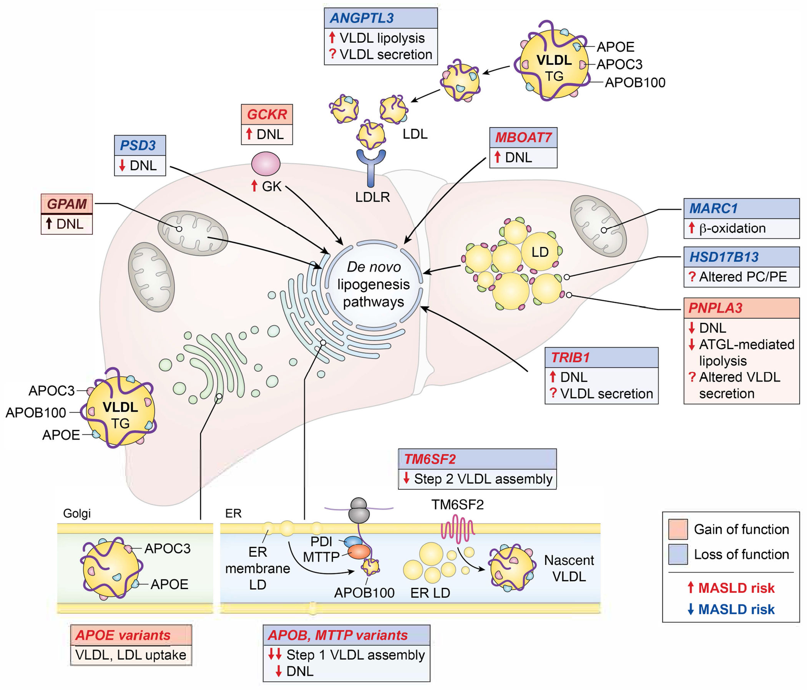

📄 [Abrir o PDF original](https://cdn.jsdelivr.net/gh/muriloffs/cardiology-agent@main/study-inbox/processados/nihms-2164593.pdf)

# Produção Hepática de Lipoproteínas, Fenótipos Cardiometabólicos e Subtipos da Doença Hepática Esteatótica

**Autor:** Nicholas O. Davidson, MD, DSc — Division of Gastroenterology, Washington University School of Medicine, St. Louis, MO

**Publicado em:** Circ Res. 2026 Jun 05;138(12):e327269. [10.1161/CIRCRESAHA.126.327269](https://doi.org/10.1161/CIRCRESAHA.126.327269)

---

## Resumo (Abstract)

A doença hepática esteatótica associada à disfunção metabólica (MASLD — *Metabolic dysfunction associated steatotic liver disease*) acomete mais de um terço dos adultos no mundo. A epidemia crescente de MASLD tem levado a aumentos na doença cardiovascular aterosclerótica (DCV), que é a principal causa de morbidade e mortalidade entre os indivíduos afetados, particularmente naqueles com diabetes tipo 2. Subconjuntos de pacientes com MASLD desenvolverão doença hepática progressiva, incluindo esteato-hepatite associada à disfunção metabólica (MASH), fibrose avançada, cirrose e carcinoma hepatocelular.

A associação de formas progressivas de MASLD com doença cardiometabólica despertou interesse em compreender como vias distintas do metabolismo hepático de lipídios e lipoproteínas podem identificar alvos terapêuticos candidatos para mitigar o risco de DCV. O entendimento mais profundo da homeostase hepática de lipídios e lipoproteínas na MASLD é uma necessidade premente por várias razões ligadas às adaptações moleculares e de sinalização que ocorrem na obesidade e no diabetes tipo 2. Primeiro, porque essas condições, individualmente e em combinação, aceleram o início e a progressão da MASLD; segundo, porque a MASLD progressiva pode promover resistência à insulina e diabetes tipo 2; e terceiro, porque alguns fatores de risco para DCV (dislipidemia, obesidade, diabetes tipo 2) se sobrepõem aos da MASLD.

As evidências sugerem uma etiologia multifatorial para a MASLD, incluindo fatores genéticos que tanto promovem quanto mitigam a progressão da doença hepática e que, junto com modificadores ambientais (dieta, obesidade) e a resistência à insulina, contribuem para o risco de DCV. A segregação dessas etiologias por fenótipo/metabótipo revela um **subtipo dominante de disfunção metabólica sistêmica** (obesidade, resistência à insulina), associado a maior DCV, e um **segundo subtipo dominante onde fatores familiares e genéticos predominam**, refletindo secreção prejudicada de VLDL e associado a risco reduzido de DCV.

> 🎓 **Aprofunde:** O conceito central a dominar deste artigo é a dicotomia em dois subtipos de MASLD com trajetórias cardiovasculares opostas, apesar de fenótipos hepáticos semelhantes (esteatose/fibrose). O subtipo "sistêmico" (obesidade + resistência à insulina → maior secreção de VLDL/APOB → mais DCV) versus o subtipo "familiar/genético" (impedimento da exportação de VLDL → menos lipoproteínas aterogênicas circulantes → menos DCV, mas frequentemente doença hepática mais progressiva). Essa distinção tem implicações diretas para estratificação de risco e seleção terapêutica.

---

## Introdução e Visão Geral

A MASLD é cada vez mais reconhecida como um problema global, com estimativas recentes sugerindo prevalência mundial de **38%**. A carga da MASLD é distribuída de forma desigual, com a maior prevalência observada em pessoas do Kuwait, Egito e Catar, e as maiores taxas de aumento (2010–2021) observadas nos países mais populosos, a saber, China e Índia.

A compreensão da variação geográfica na prevalência de MASLD foi avançada por estudos que mostram a importância de uma variante genética comum (**PNPLA3 rs738409**), preditiva tanto da prevalência de MASLD quanto altamente correlacionada com a progressão da doença para cirrose, confirmada em diferentes populações. Algumas características raciais e étnicas da distribuição da MASLD foram examinadas na população do estudo Dallas Heart, onde indivíduos hispânicos (~49% portadores da variante PNPLA3) exibiram a maior prevalência (em comparação com brancos europeus e negros) de esteatose hepática. No entanto, mesmo após ajuste para a prevalência de PNPLA3 e outras variantes, indivíduos negros não-hispânicos pareceram **protegidos** da MASLD.

De interesse adicional, a taxa de progressão de doenças hepáticas crônicas como hepatite C não foi estatisticamente diferente em negros não-hispânicos, sugerindo que a proteção distintiva contra a MASLD (versus outras formas de doença hepática crônica) em indivíduos negros pode refletir outros fatores que necessitarão de validação. Essas tendências raciais e étnicas inexplicadas na distribuição populacional da MASLD destacam necessidades não atendidas: melhor compreensão de como variantes genéticas subjacentes interagem com fatores ambientais e socioeconômicos para influenciar o desenvolvimento e a progressão da MASLD; e como os impulsionadores mecanísticos subjacentes que promovem a esteatose hepática contribuem, individualmente e em combinação, para o desenvolvimento de toda a gama de comorbidades cardiometabólicas na MASLD/MASH, incluindo DCV.

> 🎓 **Aprofunde:** A variante **PNPLA3 rs738409 (I148M)** é o fator genético isolado mais forte associado à MASLD e à progressão para cirrose (revisado por Romeo & Valenti, Liver Int 2025, [10.1111/liv.70240](https://doi.org/10.1111/liv.70240)). Domine este conceito-chave porque ela reaparece repetidamente: é uma variante de ganho de função no metabolismo de gotículas lipídicas, e seu efeito sobre a DCV é particularmente nuançado (parece NÃO aumentar risco aterogênico, ao contrário de outras variantes de MASLD).

Um tema central desta revisão é destacar subtipos patogenicamente distintos de MASLD. **Um subtipo** reflete doença hepática esteatótica em que excesso de substrato, obesidade e resistência à insulina dominam, associado a dislipidemia e maior risco de DCV. **Um segundo subtipo** reflete um comprometimento relativo da exportação hepática de triglicerídeos (VLDL), associado à doença hepática esteatótica, mas com níveis circulantes reduzidos de lipoproteínas aterogênicas e risco reduzido de DCV.

Impulsionada em parte pelo reconhecimento de que a MASLD engloba um espectro de doença, com maior prevalência em pessoas com obesidade e diabetes tipo 2, a definição de MASLD agora inclui doença hepática esteatótica na ausência de consumo de álcool de risco ou outras etiologias, e inclui pelo menos uma das comorbidades associadas à resistência à insulina (sobrepeso/obesidade, baixos níveis de HDL sérico, níveis aumentados de triglicerídeos séricos, hipertensão ou hiperglicemia de jejum).

Em termos muito gerais, a doença hepática esteatótica surge sob condições de excesso de nutrientes (alto teor de gordura saturada, glicose e frutose), que promovem a **lipogênese de novo hepática (DNL)** e a resistência à insulina. No contexto de variantes genéticas que promovem o acúmulo de gotículas lipídicas, mecanismos homeostáticos (incluindo secreção de VLDL e função mitocondrial) na função hepática tornam-se prejudicados, resultando em lesão lipotóxica, inflamação e progressão para MASH.

Além do continuum da doença hepática esteatótica (MASLD/MASH) e da relação entrelaçada com obesidade e diabetes tipo 2, há também reconhecimento crescente de que a ingestão de álcool pode ser um modificador ambiental-chave, o que levou a uma nomenclatura revisada que agora inclui a doença hepática relacionada ao álcool (**Met-ALD**). Essa provisão é importante porque a classificação de pacientes dentro de subcategorias de MASLD parece ser dinâmica e sujeita a mudanças, como evidenciado por estudos de mais de 1000 pacientes acompanhados por mais de 2 anos, onde **38% dos indivíduos** inicialmente diagnosticados com MASLD mudaram de categoria entre a inscrição basal e o seguimento, e **mais de 60% dos participantes** com Met-ALD basal mudaram de categoria. Esses achados destacam desafios em estudos longitudinais de pacientes com MASLD, onde variações no uso de álcool podem resultar em classificação errônea.

> 🎓 **Aprofunde:** A nova nomenclatura (MASLD/MASH/Met-ALD) substituiu NAFLD/NASH e foi formalizada no consenso multissociedade de Delphi (Rinella et al, Hepatology 2023, [10.1097/HEP.0000000000000520](https://doi.org/10.1097/HEP.0000000000000520)). O ponto prático a dominar: a classificação de subcategorias é **dinâmica** — a flutuação do consumo de álcool gera reclassificação maciça em estudos longitudinais (38% MASLD, >60% Met-ALD), o que é uma armadilha metodológica importante na interpretação de coortes.

---

## MASLD e Diabetes Tipo 2: Causalidade ou Associação?

Há debate contínuo sobre como o fígado se adapta a desafios metabólicos sistêmicos. Embora obesidade e diabetes tipo 2 iniciem e promovam a esteatose hepática, estudos sugeriram uma **causalidade reversa** (evidenciada em randomização mendeliana), na qual a esteatose hepática, particularmente quando combinada com fibrose, promove o desenvolvimento de resistência à insulina, particularmente em subgrupos com predisposição genética conhecida (Dongiovanni et al, J Intern Med 2018). Esses estudos sugerem que a resistência à insulina é uma consequência indireta da esteatose hepática, presumivelmente mediada por sinais de ativação fibrogênica e dano hepático progressivo.

Uma revisão recente sugeriu que a MASLD era uma causa intrínseca de resistência à insulina (Bo et al, Cell Metab 2024), citando estudos que mostram que **71% dos indivíduos com NASH comprovada por biópsia e 46% dos indivíduos com NAFLD** de uma coorte sueca desenvolveram diabetes tipo 2 ao longo de 13,7 anos de seguimento. No entanto, não houve avaliação basal da intolerância à glicose nesses estudos, dificultando a conclusão de que a esteatose hepática em si fosse causal.

Outro estudo relatou desfechos em mais de 25.000 homens coreanos, onde **17,8% dos indivíduos com NAFLD moderada a grave** desenvolveram diabetes tipo 2 ao longo de cinco anos de seguimento. Contudo, o diagnóstico de NAFLD nesse estudo baseou-se apenas em ultrassonografia, e todos os indivíduos exibiram aumentos basais no HOMA-IR, sugerindo que a doença hepática progressiva (inflamação e fibrose) pode exacerbar a resistência à insulina subjacente e promover o desenvolvimento de diabetes tipo 2.

Outros estudos demonstraram que a resistência à insulina hepática pode ser induzida pelo acúmulo de gotículas lipídicas, potencialmente por vias envolvendo alterações mediadas por diacilglicerol ligado à membrana na proteína quinase C épsilon (Lyu et al, Cell Metab 2020).

A visão contrária é que a esteatose hepática isolada **não causa** resistência à insulina. Forte evidência a favor dessa visão reflete achados em indivíduos onde a esteatose hepática é causada por um defeito genético na exportação hepática de lipoproteínas ricas em triglicerídeos (**hipobetalipoproteinemia familiar — FHBL**). Esses estudos mostraram que a sensibilidade hepática à insulina (medida por clamp hiperinsulinêmico-euglicêmico) era **indistinguível** entre indivíduos com FHBL (com esteatose hepática causada por exportação lipídica prejudicada) e indivíduos controle normais, pareados por IMC (Amaro et al, Gastroenterology 2010).

Outros estudos mostraram que aumentos na esteatose hepática estão associados a comprometimento progressivo da ação da insulina no fígado, músculo esquelético e tecido adiposo em indivíduos obesos não-diabéticos, sugerindo que a MASLD está associada a disfunção multiórgão e sensibilidade à insulina prejudicada (Korenblat et al, Gastroenterology 2008).

Em conjunto, as informações disponíveis em humanos sugerem que a esteatose hepática **está associada a, mas (pelo menos isoladamente) não causa**, resistência à insulina e diabetes tipo 2. Estudos recentes identificaram um painel de **235 metabólitos circulantes** que, junto com fatores de risco genéticos e de estilo de vida, predisseram o risco futuro de diabetes tipo 2 ao longo de 26 anos de seguimento, levantando a possibilidade de que avanços contínuos em tecnologias metabolômicas, em múltiplos grupos raciais e étnicos com doença hepática esteatótica, possam identificar mediadores específicos que promovem o diabetes tipo 2.

> 🎓 **Aprofunde:** O argumento decisivo aqui é o experimento "natural" da FHBL (Amaro et al, Gastroenterology 2010, [PMID 20303351](https://pubmed.ncbi.nlm.nih.gov/20303351/)): indivíduos com esteatose por defeito de exportação de VLDL têm sensibilidade hepática à insulina NORMAL. Isso dissocia esteatose de resistência à insulina e sustenta a tese de que a *causa mecanística* da esteatose (e não a gordura em si) é o que determina os desfechos metabólicos e cardiovasculares — conceito que percorre todo o artigo.

---

## MASLD e Diabetes Tipo 2: Associação Causal com Progressão da Doença Hepática e com DCV

A coexistência de diabetes tipo 2 em pacientes com MASLD prenuncia desfechos adversos. Em um estudo de mais de 2000 pacientes, após ajuste para fatores de confusão, pacientes com diabetes tipo 2 exibiram **risco aumentado de descompensação hepática (sHR 2,15 [IC 95% 1,39–3,34]; p=0,0006)**. Além disso, a presença de diabetes tipo 2 foi um preditor independente de desenvolvimento de carcinoma hepatocelular (**sHR 5,34 [1,67–17,09]; p=0,0048**), mesmo após ajuste para a rigidez hepática basal como marcador substituto de fibrose (Huang et al, Lancet Gastroenterol Hepatol 2023). Esses achados sugerem fortemente que mediadores sistêmicos de disfunção metabólica associados à resistência à insulina e ao diabetes tipo 2 contribuem diretamente para a progressão da MASLD e para o desenvolvimento de desfechos adversos.

Embora indivíduos com MASLD, particularmente aqueles com diabetes tipo 2, estejam em risco de desenvolver doença hepática avançada, **a DCV representa a principal causa de mortalidade**. Uma grande meta-análise revisando estudos relatados ao longo de três décadas até 2019 constatou que, em estudos onde a MASLD foi confirmada por ultrassom, índice de fígado gorduroso ou biópsia hepática, a mortalidade específica hepática aumentou **1,75 vez (IC 95% 0,58–2,91)**, mas a mortalidade específica cardíaca aumentou **5,54 vezes (IC 95% 2,72–8,35)**.

Outra meta-análise recente, relatando 21 estudos separados de desfechos de DCV em adultos com MASH e MASLD histologicamente confirmadas, relatou odds ratios de DCV de **3,12 (IC 95%: 1,33–5,32) a 4,12 (IC 95%: 1,91–8,90)**. O risco de doença arterial coronariana aumentou em pessoas com MASH em 6 de 7 estudos, o risco de AVC aumentou em 6 estudos, e o de insuficiência cardíaca em 2 estudos (Sanyal et al, Am Heart J Plus 2024). Estudos retrospectivos de uma coorte coreana demonstraram que a MASLD estava associada a maior risco de infarto do miocárdio, independentemente de outros fatores de risco (Sinn et al, J Gastroenterol Hepatol 2020).

Esses achados reforçam o conceito de que a DCV é prevalente em pacientes com MASLD e MASH, mas deixam a questão da causalidade sem resposta. Estudos de randomização mendeliana sugeriram uma relação causal entre MASLD e rigidez arterial, mas falharam em demonstrar causalidade com insuficiência cardíaca ou doença arterial coronariana (Peng et al, Metabolism 2022). Já estudos recentes, usando randomização mendeliana em um estudo genome-wide incluindo variantes genéticas associadas à esteatose hepática, concluíram que **os mecanismos específicos pelos quais a gordura hepática se acumula, e não o acúmulo de lipídio hepático em si, é o que está causalmente ligado aos desfechos da MASLD, incluindo DCV** (Ahmed et al, J Hepatol 2024).

> 🎓 **Aprofunde:** Note o contraste numérico marcante: mortalidade hepática 1,75x vs mortalidade cardíaca 5,54x na meta-análise de Younossi. Domine a conclusão de Ahmed et al (J Hepatol 2024, [10.1016/j.jhep.2024.06.030](https://doi.org/10.1016/j.jhep.2024.06.030)): a associação MASLD–DCV reflete a **etiologia mecanística subjacente**, não a esteatose per se. Esse é o alicerce conceitual para a classificação em subtipos com riscos cardiovasculares divergentes.

Um tema abrangente desta revisão é iluminar os papéis contrastantes de modificadores genéticos e ambientais nas complicações cardiometabólicas associadas à MASLD. O reconhecimento de fenótipos distintos de MASLD, tanto em humanos quanto em modelos murinos, facilitou a compreensão do papel de fatores genéticos, dietéticos e ambientais. Contudo, os impactos variados da MASLD induzida por dieta em diferentes *backgrounds* genéticos murinos, e os mecanismos que modificam o metabolismo de lipoproteínas e o risco cardiometabólico, ainda não foram totalmente explorados como substituto para a suscetibilidade à DCV em humanos. A compreensão de como a modulação terapêutica do metabolismo hepático e sistêmico de lipoproteínas pode identificar vias homeostáticas de lipídios hepáticos a serem modificadas para mitigar a DCV é especialmente importante quando pareada com a detecção precoce da doença, reconhecendo-se a necessidade de distinguir associação de causalidade.

---

## Produção e Depuração Hepática de Lipoproteínas estão Alteradas na Disfunção Metabólica e na Resistência à Insulina na MASLD: Relevância para Complicações Cardiometabólicas

Os hepatócitos exportam lipídio neutro (ésteres de colesterol e triglicerídeos) na VLDL em um processo multietapas de iniciação, maturação e secreção da partícula. Os lipídios neutros são mobilizados das membranas associadas ao retículo endoplasmático (RE) e de gotículas lipídicas dentro do lúmen do RE, por meio da fusão com a **APOB100**, que é mediada pela chaperona endoluminal heteromérica: o complexo **proteína microsomal de transferência de triglicerídeos (MTTP)–proteína dissulfeto isomerase (PDI)**.

A etapa inicial da lipidação da APOB100 ocorre **co-traducionalmente**, durante a elongação da proteína APOB nascente no lúmen do RE — uma etapa essencial e limitante de velocidade na montagem da VLDL. Isso é evidenciado por indivíduos com variantes raras em **APOB ou MTTP**, onde a secreção de VLDL é virtualmente eliminada, os níveis lipídicos plasmáticos e as concentrações de APOB100 são dramaticamente reduzidos, e o comprometimento resultante da exportação de VLDL causa esteatose hepática progressiva e características de MASLD/MASH.

Sob condições fisiológicas, a APOB100 continua a adquirir lipídio neutro à medida que a partícula nascente de VLDL progressivamente se expande e transita pela via tubulovesicular, adquirindo **APOC3 e APOE** que são incorporadas à partícula madura de VLDL, secretada no plasma como fonte de lipoproteínas ricas em triglicerídeos (**TRLs**).

> 🎓 **Aprofunde:** Memorize a maquinaria de montagem da VLDL: APOB100 é o esqueleto estrutural (1 molécula por partícula); MTTP (com sua chaperona obrigatória PDI) faz a lipidação co-traducional na etapa 1; TM6SF2 atua na etapa 2 (maturação/lipidação adicional). Defeitos em APOB ou MTTP → abeta/hipobetalipoproteinemia → esteatose + hipolipidemia profunda. Esse esquema é a base para entender por que defeitos de exportação de VLDL causam esteatose hepática MAS com perfil lipídico protetor contra DCV.

### Como a resistência à insulina contribui para as anormalidades de lipoproteínas hepáticas na MASLD?

A sinalização de insulina desempenha papel fundamental na regulação do metabolismo da VLDL. Fisiologicamente, ela **promove a degradação intracelular da APOB nascente e reduz a secreção de VLDL** tanto em modelos de roedores quanto em humanos; e (sob condições fisiológicas) suprime a gliconeogênese e aumenta a DNL hepática, por meio da ativação da via SREBP.

No contexto da resistência à insulina, a depuração de partículas de lipoproteínas (LDL) torna-se defeituosa por mecanismos sistêmicos, incluindo ativação prejudicada da lipoproteína lipase, bem como pela ação direta da perda de sinalização do receptor de insulina seletiva do fígado, causando **regulação negativa da expressão do receptor de LDL (LDLR)**. Os efeitos líquidos da resistência global à insulina impactam, portanto, tanto a secreção quanto a depuração de partículas contendo APOB100.

O impacto da resistência à insulina sobre o metabolismo hepático de lipoproteínas inclui mudanças no número, distribuição de tamanho, composição lipídica e depuração de partículas ao longo do espectro **VLDL–IDL–LDL**. Como os triglicerídeos séricos são transportados predominantemente dentro das partículas de VLDL, a capacidade de exportação hepática de triglicerídeos via VLDL é determinada pelo número de partículas de APOB100 secretadas. A própria secreção de APOB100 é influenciada por regulação transcricional, degradação proteica, metabolismo lipídico e depuração mediada por receptor — cada etapa modificada pela sinalização de insulina.

Além disso, a distribuição de tamanho da VLDL humana recém-secretada é modificada pelo conteúdo de lipídio neutro hepático, também sujeito à regulação pela insulina por vias que incluem catabolismo lipídico prejudicado e DNL aumentada. Sob condições fisiológicas, a sinalização hepática de insulina aumenta a degradação da APOB100, diminui a secreção de partículas de VLDL e promove a captação de lipoproteínas. No entanto, no contexto da resistência à insulina, a captação hepática de lipoproteínas é prejudicada, o que resulta em **acúmulo de VLDL e de remanescentes de TRLs — considerados mediadores importantes da DCV aterosclerótica**.

Apesar de mais de uma década de pesquisa, os mecanismos que impulsionam as complexas adaptações metabólicas hepáticas na resistência à insulina ainda são debatidos, e as vias que promovem o acúmulo de gotículas lipídicas hepáticas são incompletamente compreendidas. No contexto da MASLD acompanhada de resistência à insulina (obesidade, diabetes tipo 2), a sinalização de insulina é **seletivamente prejudicada**: a supressão fisiológica da gliconeogênese via sinalização AKT e FOXO1 é atenuada, mas a produção hepática de glicose é aumentada, o que, junto com a DNL aumentada, exacerba ainda mais a esteatose hepática. Essas adaptações foram variavelmente chamadas de **paradoxo da sinalização de insulina** ou **resistência hepática seletiva à insulina**. Os mecanismos e mediadores envolvidos em orquestrar os programas gliconeogênico e lipogênico provavelmente incluem sinalização de outros tecidos.

> 🎓 **Aprofunde:** O conceito de **resistência hepática SELETIVA à insulina** (Santoleri & Titchenell, Cell Mol Gastroenterol Hepatol 2019) é central: na MASLD, a insulina FALHA em suprimir a gliconeogênese (resistência), mas CONTINUA estimulando a DNL/SREBP1 (sensibilidade preservada). Esse "paradoxo" explica por que pacientes têm simultaneamente hiperglicemia E lipogênese aumentada. Domine isto, pois é o eixo fisiopatológico do subtipo sistêmico.

Há também incerteza quanto aos mecanismos subjacentes ao fenótipo proaterogênico na MASLD com resistência à insulina, particularmente em relação à produção de VLDL e ao papel do LDLR hepático. Um artigo de referência de 2008 demonstrou que a **deleção do receptor de insulina específica do fígado (camundongos LIRKO)** exibiu um perfil lipídico aterogênico resultante de aumento da secreção hepática de triglicerídeos de VLDL e de ApoB, juntamente com depuração reduzida de LDL associada à regulação negativa da expressão de LDLR. Quando esses camundongos LIRKO foram alimentados com dieta aterogênica rica em gordura, desenvolveram hipercolesterolemia marcada e aterosclerose acelerada (Biddinger et al, Cell Metab 2008). Esses estudos estabeleceram que **a resistência hepática à insulina isolada** (camundongos LIRKO não eram obesos nem hiperfágicos e não apresentaram alterações nas vias de DNL hepática) é suficiente para replicar dislipidemia aterogênica e suscetibilidade à aterosclerose.

No entanto, outros estudos em camundongos com baixos níveis de expressão do receptor de insulina no fígado, mas sem expressão do receptor de insulina em tecidos periféricos (**L1^B6**), cruzados com camundongos **Ldlr^−/−**, demonstraram **secreção INESPERADAMENTE REDUZIDA** de triglicerídeos de VLDL e de ApoB, e, quando desafiados com dieta ocidental, exibiram **aterosclerose REDUZIDA** (Han et al, J Clin Invest 2009). Esses autores também demonstraram que camundongos geneticamente obesos (ob/ob) exibiam secreção aumentada de VLDL, mas constataram (em contraste com Biddinger et al) que o knockdown por siRNA do receptor de insulina hepático **diminuía** tanto a secreção de triglicerídeos de VLDL quanto a de ApoB. Concluíram que a redução direcionada da sinalização hepática de insulina poderia reduzir a produção de VLDL, mas também notaram (como no estudo de Biddinger) que o direcionamento do receptor de insulina também reduzia a expressão de Ldlr, o que se anteciparia afetar adversamente os níveis circulantes de VLDL e LDL.

Esses estudos contrastantes destacam outro aspecto: tanto os camundongos LIRKO quanto os L1^B6Ldlr^−/− exibiram características de expressão gênica consistentes com supressão de SREBP1 e DNL; ainda assim, o silenciamento do receptor de insulina em camundongos ob/ob (que exibem regulação positiva de DNL) **diminuiu** tanto a produção de triglicerídeos de VLDL quanto a de ApoB. Isso sugere que mesmo no contexto de obesidade e DNL hepática aumentada, a sinalização prejudicada do receptor de insulina pode **limitar** a secreção de VLDL.

Vale enfatizar que indivíduos portadores de mutações no receptor de insulina manifestam resistência sistêmica à insulina, mas **não são obesos e não exibem esteatose hepática**, provavelmente refletindo DNL diminuída (Semple et al, J Clin Invest 2009). Assim, questões fundamentais permanecem sobre os mecanismos moleculares da produção alterada de VLDL/APOB hepática na MASLD e na resistência à insulina hepática (versus sistêmica). Avanços usando ganho e perda de função específicos de célula e tecido em modelos pré-clínicos destacaram vias-chave de sinalização, mas essas observações requerem validação em subconjuntos de pacientes profundamente fenotipados, acoplados a modelos reducionistas (fatias hepáticas, organoides 3D) e células-tronco pluripotentes induzidas derivadas de pacientes, para compreender a relevância para os pacientes com MASLD.

> 🎓 **Aprofunde:** A contradição LIRKO (Biddinger, Cell Metab 2008, [PMID 18249172](https://pubmed.ncbi.nlm.nih.gov/18249172/)) versus L1^B6 (Han, J Clin Invest 2009, [PMID 19273907](https://pubmed.ncbi.nlm.nih.gov/19273907/)) é um ponto fino que merece domínio: ambos têm SREBP1/DNL suprimidas, mas resultados opostos sobre VLDL e aterosclerose. A lição: o efeito da resistência à insulina hepática sobre VLDL depende criticamente do contexto (presença ou não de DNL aumentada, status do LDLR). Em humanos com mutação do receptor de insulina, NÃO há esteatose — porque sem DNL ativa, não há substrato lipídico, reforçando o papel central da DNL.

---

## Subsets Metabólicos de Pacientes com MASLD Definidos Mecanisticamente

### (1) MASLD com predominância de fatores sistêmicos

Há consenso de que a combinação de obesidade e resistência à insulina (generalizada), junto com a ingestão de dietas enriquecidas em gordura saturada e bebidas suplementadas com glicose e frutose, impulsiona uma mudança no sentido de aumentar a DNL hepática, que juntas representam uma **assinatura patogênica característica** em um subconjunto metabólico de pacientes com MASLD.

Esse consenso surgiu de estudos onde o fluxo de substrato da DNL hepática foi rastreado em humanos, originalmente em uma pequena coorte de indivíduos obesos com MASLD, que mostrou DNL elevada no estado de jejum que **falhava em aumentar no período pós-prandial**, com 26% e 23% dos triglicerídeos hepáticos e de VLDL séricos, respectivamente, derivados de lipídio recém-sintetizado (Donnelly et al, J Clin Invest 2005).

Outros estudos mostraram que indivíduos obesos com esteatose hepática aumentada exibiam maior liberação de palmitato do tecido adiposo em comparação a indivíduos sem esteatose, com ambos os grupos exibindo taxas aumentadas de produção de triglicerídeos de VLDL **sem alteração na secreção de APOB100** (Fabbrini et al, Gastroenterology 2008). Esses achados sustentam um papel da resistência à insulina do tecido adiposo como contribuinte-chave para as adaptações na produção hepática de VLDL.

Estudos mais recentes, novamente usando fluxo metabólico para rastrear a cinética da VLDL, demonstraram que indivíduos obesos com síndrome metabólica e conteúdo lipídico hepático elevado (espectroscopia por ressonância magnética, isto é, MASLD) exibiram **aumento de 3,3 vezes na produção hepática de triglicerídeos (como VLDL) a partir de DNL** e duplicação da DNL no conteúdo de ácidos graxos da VLDL, em comparação a indivíduos sem esteatose (Lambert et al, Gastroenterology 2014). Esses pesquisadores também confirmaram que indivíduos com MASLD exibiam níveis mais altos de ácidos graxos noturnos e **nenhuma supressão da contribuição da DNL com o jejum**.

Refinamento adicional veio de estudos recentes onde indivíduos magros e obesos (ambos sem esteatose) foram comparados a indivíduos obesos com MASLD, onde a contribuição da DNL hepática para o triglicerídeo intra-hepático (palmitato) foi de **11% em indivíduos magros, subindo para 19% em obesos sem esteatose e 38% em obesos com MASLD** (Smith et al, J Clin Invest 2020). Esses estudos também mostraram que a DNL hepática estava **inversamente correlacionada** com a sensibilidade à insulina hepática (e corporal total), e que a perda de peso diminuía a esteatose intra-hepática, ao menos em parte por meio da diminuição da DNL.

Essas observações reforçam coletivamente o conceito de que a DNL hepática é aumentada na obesidade e resistência à insulina, acompanhada de aumento na secreção de triglicerídeos de VLDL — o que poderia ser visto como uma **adaptação para limitar a esteatose hepática**. No entanto, embora a DNL hepática aumente linearmente com o aumento inicial da esteatose, há provavelmente um **efeito platô** onde aumentos adicionais no lipídio hepático não são acompanhados por mudanças adaptativas na secreção de triglicerídeos de VLDL para compensar a produção aumentada, o que então exacerba a esteatose.

De interesse adicional, a perda de peso induzida por exercício levou a uma diminuição rápida da esteatose hepática **sem alterar a secreção de triglicerídeos de VLDL**, implicando que o conteúdo de lipídio hepático em si é provavelmente apenas um impulsionador indireto da produção de VLDL (Sullivan et al, Hepatology 2012).

> 🎓 **Aprofunde:** Memorize a progressão quantitativa da contribuição da DNL ao triglicerídeo intra-hepático: **11% (magro) → 19% (obeso sem esteatose) → 38% (obeso com MASLD)** (Smith et al, J Clin Invest 2020, [PMID 31805015](https://pubmed.ncbi.nlm.nih.gov/31805015/)). Essa progressão, com correlação inversa entre DNL e sensibilidade à insulina, fundamenta a DNL como alvo terapêutico no subtipo sistêmico. O "efeito platô" da secreção de VLDL explica por que a esteatose se acumula descompensadamente nas fases avançadas.

#### Targeting terapêutico da DNL na MASLD com predominância de fatores sistêmicos

O achado de que pacientes com obesidade e MASLD exibem mudanças adaptativas na DNL hepática fortaleceu a racionalidade para explorar o direcionamento terapêutico da DNL na mitigação da progressão da MASLD/MASH.

Observações recentes usando **água pesada (heavy water)** para analisar a DNL e o turnover de triglicerídeos hepáticos em **123 indivíduos com MASH, incluindo 20 com cirrose**, revelaram que a DNL permanecia elevada mesmo em indivíduos com fibrose avançada e cirrose, e apesar do conteúdo lipídico hepático reduzido nesses pacientes com doença avançada. De interesse adicional, a DNL hepática estava positivamente correlacionada com o número de partículas de VLDL e a abundância de APOB100, sugerindo que a regulação positiva da DNL pode ser um impulsionador importante da produção de triglicerídeos de VLDL e APOB100. Esses autores mostraram que o tratamento com o inibidor de acetil-CoA carboxilase **firsocostat** reduziu a DNL em indivíduos com MASH, com e sem fibrose avançada, sugerindo que estratégias para reduzir a esteatose hepática são viáveis mesmo nos estágios mais tardios da doença (Lawitz et al, J Lipid Res 2022).

Em uma abordagem diferente de modulação farmacológica da DNL, um ensaio de fase 2b (prova de conceito) de **definistat (denifanstat — um inibidor oral da ácido graxo sintase)** em pacientes com MASH e fibrose F2 ou F3 revelou **resolução de MASH sem piora da fibrose**, sugerindo que estratégias para reduzir a DNL hepática são viáveis, embora estudos de longo prazo em múltiplos países sejam necessários (Loomba et al, Lancet Gastroenterol Hepatol 2024).

Outro ensaio de fase 2b relatou achados em **392 pacientes com MASH e fibrose avançada (F3 ou F4)** tratados com a combinação de **cilofexor (agonista FXR não-esteroidal) e firsocostat por 48 semanas**, que revelou reduções significativas em esteatose, inflamação lobular e rigidez hepática, sugerindo que terapias combinadas direcionadas à DNL e promovendo a sinalização FXR podem ter benefícios para a regressão da fibrose (Loomba et al, Hepatology 2021).

Por outro lado, vários inibidores de acetil-CoA carboxilase foram avaliados em ensaios clínicos com **preocupações sobre aumento dos níveis plasmáticos de triglicerídeos**, possivelmente mediado pela ativação de SREBP1 (Kim et al, Cell Metab 2017). Além disso, estudos recentes em camundongos onde ambas as isoformas de acetil-CoA carboxilase foram deletadas no fígado mostraram **gliconeogênese de jejum aumentada a partir de substratos alternativos**, incluindo piruvato e aminoácidos (Deja et al, Cell Metab 2024). Esses achados sugerem necessidade de explorar vias adaptativas do metabolismo intermediário hepático após inibição farmacológica de longo prazo da acetil-CoA carboxilase em humanos, que podem ser diferentes das observadas em camundongos.

Um resumo recente de terapias farmacológicas que reduziram a esteatose hepática em pacientes com MASH incluiu os **agonistas de GLP-1**, com estudos anteriores demonstrando que esses agonistas reduziam tanto a produção hepática de VLDL quanto a DNL na resistência à insulina em modelos pré-clínicos. O uso amplo de GLP-1 e de novas intervenções baseadas em incretinas provavelmente terá impacto importante sobre o risco de DCV em pacientes com MASLD.

> 🎓 **Aprofunde:** Domine o pipeline de inibidores de DNL: **firsocostat/cilofexor** (ACC + FXR), **denifanstat** (FASN). Atenção à pegadinha clínica: inibidores de ACC podem **AUMENTAR triglicerídeos plasmáticos** via ativação de SREBP1 (Kim et al, Cell Metab 2017, [PMID 28768177](https://pubmed.ncbi.nlm.nih.gov/28768177/)) — um efeito adverso cardiometabólico paradoxal. Os agonistas GLP-1/incretinas emergem como a classe com maior impacto cardiovascular esperado nessa população.

#### Subset MASLD magra ("lean MASLD")

Um subconjunto clínico adicional de MASLD inclui indivíduos que **não são obesos** — a chamada "MASLD magra" — que pode representar até **20%** dos indivíduos com doença hepática esteatótica.

Estudos observacionais de uma coorte de 1339 indivíduos caucasianos com biópsia comprovada, incluindo 195 (14% do total) indivíduos magros (IMC <25), revelaram **doença histológica menos grave e nenhuma diferença na mortalidade geral** ao longo de 94 meses. É importante destacar que o grupo de MASLD magra era significativamente mais jovem que o grupo não-magro e, quando os desfechos de longo prazo foram ajustados para a idade, **não houve diferença entre os grupos** (Younes et al, Gut 2022).

Uma análise transversal mais recente de 312 pacientes prospectivamente inscritos comparou indivíduos magros (40) com MASLD a 90 indivíduos com sobrepeso e 88 com obesidade classe II ou maior, todos pareados por idade e sexo. Os achados revelaram **prevalência indistinguível de fibrose em magros (27%) e não-magros (31%)** com MASLD, mesmo entre indivíduos com alta predição de escore de risco genético, sugerindo que a progressão da MASLD pode ser semelhante em magros e obesos apesar das diferenças de IMC (Tesfai et al, Aliment Pharmacol Ther 2025).

A compreensão detalhada da fisiopatologia subjacente na MASLD magra é incompleta, embora DNL hepática aumentada e alterações no metabolismo do adiposo visceral sejam consideradas vias relevantes. Um pequeno estudo de centro único com 20 indivíduos chineses (predominantemente do sexo feminino) com MASLD magra (IMC 22,6), comparados a 20 controles (IMC 21,2), revelou níveis circulantes mais altos de triglicerídeos e HDL mais baixo, junto com alterações nos perfis de ácidos graxos séricos sugestivas de DNL alterada.

Um estudo retrospectivo recente de **67.519 pacientes** da base de dados TriNetX com MASLD magra relatou **risco significativamente aumentado de DCV** (comparado a pacientes não-magros com MASLD), incluindo insuficiência cardíaca de início recente, desfechos cardiovasculares compostos e mortalidade por todas as causas (Al Ta'ani et al, Clin Transl Gastroenterol 2026). Um estudo de indivíduos europeus com MASLD magra demonstrou concentrações séricas elevadas de **isobutirato, metionina sulfóxido, propionato e fosfatidilcolinas**, sugestivas de enriquecimento com metabólitos derivados de micróbios (Haag et al, JCI Insight 2025).

Esses estudos sugerem que a MASLD magra pode representar **mais um metabótipo distinto**, particularmente em relação ao papel do eixo intestino-fígado. Estudos adicionais de pacientes com MASLD magra, incluindo de diferentes grupos raciais/étnicos e socioeconômicos, pareados por propensão genética, resistência à insulina e caracterização lipoproteica circulante, serão necessários.

> 🎓 **Aprofunde:** A MASLD magra é um paradoxo importante: histologicamente semelhante (mesma prevalência de fibrose ~27-31%) mas, em dados de grandes bases, associada a MAIOR risco cardiovascular (Al Ta'ani et al, 2026). Pistas mecanísticas apontam para o eixo intestino-fígado (assinaturas metabólicas microbianas: isobutirato, propionato). Conceito a dominar: não-obesidade NÃO significa baixo risco — exige avaliação cardiometabólica e genética cuidadosa.

### (2) MASLD com predominância de fatores familiares/genéticos

Avanços na estratificação de risco para DCV em indivíduos com MASLD foram alcançados usando perfilamento lipidômico e metabolômico. Um estudo examinou **mais de 1100 pacientes** de vários centros na Europa, pareados por idade, sexo, IMC e resistência à insulina/diabetes tipo 2, todos com MASLD ou MASH confirmadas por biópsia. Esses indivíduos foram submetidos a perfilamento metabolômico extenso, junto com análise de lipoproteínas por ressonância magnética nuclear (RMN), que revelou **três subconjuntos distintos ("metabótipos")** cujos perfis se alinhavam com assinaturas metabolômicas obtidas de modelos murinos onde a secreção de triglicerídeos de VLDL era regulada positiva ou negativamente (Martinez-Arranz et al, Hepatology 2022).

- **Metabótipo "A"** (secreção prejudicada de VLDL): exibiu níveis mais baixos de APOB sérico, triglicerídeo e colesterol, bem como níveis mais baixos de partículas de LDL e TRL — perfil alinhado a **risco reduzido de DCV**.
- **Metabótipo "C"**: exibiu **secreção aumentada de VLDL (2–3 vezes)**, níveis aumentados de APOB e perfil aterogênico, indicando **risco aumentado de DCV**.

A distribuição dos metabótipos foi **independente do uso de medicação hipolipemiante** e não relacionada a índices clínicos de resistência à insulina (HOMA-IR e HbA1c), sugerindo que outros mecanismos podem explicá-los. Embora o estudo fosse subdimensionado para detectar diferenças em variantes genéticas, os achados demonstram que, apesar de similaridades nos fenótipos de MASLD (idade, obesidade, resistência à insulina, uso de medicação), é possível separar subconjuntos metabolômicos definidos com diferentes perfis de risco para DCV.

Estudos de uma coorte finlandesa examinaram indivíduos obesos com MASLD categorizados com base em um **escore de risco genético agregado** que incluía cinco variantes comuns (**PNPLA3 rs738409; TM6SF2 rs58542926; MBOAT7 rs641738; HSD17B13 rs72613567; MARC1 rs2642438**). O fluxo de substrato e a metabolômica sérica por RMN foram examinados, revelando:

- **Subset Met-Comp** (composição metabólica): níveis aumentados de ácidos graxos, aminoácidos e glicose, com características de DNL aumentada.
- **Subset Gen-Comp** (composição genética/enriquecimento de variantes): caracterizado por **estado redox mitocondrial aumentado** (razão sérica beta-hidroxibutirato/acetoacetato aumentada) e **DNL diminuída**.

Este estudo foi um dos primeiros a combinar perfilamento metabolômico profundo com medidas de DNL e perfil genético limitado, destacando o conceito emergente de que **a patogênese da MASLD reflete um equilíbrio entre excesso de substrato e DNL, modulado por variantes genéticas que influenciam a utilização de energia e a exportação lipídica** (Luukkonen et al, J Hepatol 2022). O conceito de subtipo de predominância sistêmica (análogo a Met-Comp) e de predominância familiar/genética (análogo a Gen-Comp) é ilustrado na Figura 2.

> 🎓 **Aprofunde:** Os dois eixos de evidência convergem: metabótipos A/C de Martinez-Arranz (Hepatology 2022, [PMID 35220605](https://pubmed.ncbi.nlm.nih.gov/35220605/)) e subsets Gen-Comp/Met-Comp de Luukkonen (J Hepatol 2022, [PMID 34710482](https://pubmed.ncbi.nlm.nih.gov/34710482/)). O subset genético (Gen-Comp / metabótipo A) tem assinatura de **DNL baixa + estado redox mitocondrial alto + secreção de VLDL prejudicada → menos DCV**. Dominar essa convergência é a chave para aplicar a estratificação por metabótipo na prática.

A MASLD exibe forte componente genético/hereditário, como mostrado em estudos com gêmeos, que estabeleceram que esteatose e fibrose hepáticas são **traços herdáveis**, particularmente em gêmeos monozigóticos (Loomba et al, Gastroenterology 2015).

Estudos recentes usando o **UK Biobank** mostraram que adiposidade visceral, massa gorda corporal total e IMC eram preditores independentes de esteatose, inflamação e fibrose hepáticas. Usando esses marcadores de adiposidade para gerar um escore de associação genome-wide ajustado, revelaram **27 loci previamente não atribuídos** associados à MASLD, dos quais 6 foram replicados em quatro coortes independentes. Identificaram **37 loci independentes** associados à esteatose, incluindo loci ligados à regulação do metabolismo de lipoproteínas plasmáticas, e refinaram a análise para desenvolver um **escore de risco poligênico particionado (PPRS)** que permitiu alocar variantes em clusters associados a: (1) **secreção prejudicada de VLDL**, ou (2) **aumento do fluxo de substrato, captação de energia ou diminuição da beta-oxidação** (Jamialahmadi et al, Nat Med 2024).

- O **PPRS do cluster 1** foi associado a **DCV diminuída**.
- O **PPRS do cluster 2** predisse **risco aumentado de DCV**.
- **Ambos os grupos PPRS estavam predispostos a desenvolver diabetes tipo 2**, reforçando o conceito de sobreposições funcionais nas vias subjacentes que predispõem à MASLD.

Como reforço adicional do conceito de sobreposição, a variante **PNPLA3 rs738409 (I148M)**, o fator genético mais forte predisponente à MASLD, **apareceu em ambos os clusters**, mas **não é causalmente ligada à doença cardíaca isquêmica** (Lauridsen et al, Eur Heart J 2018). Assim, apesar de alguma sobreposição, esses achados identificaram dois tipos distintos de doença hepática esteatótica: um **fígado-cêntrico (cluster 1)** e outro **(cluster 2) que reflete as adaptações complexas associadas à síndrome metabólica, obesidade e diabetes tipo 2**.

O agrupamento dos subtipos de MASLD em dois grupos etiológicos distintos foi corroborado em uma abordagem paralela usando fenotipagem profunda baseada em grandes conjuntos de dados populacionais, focando em traços cardiometabólicos e hepáticos. Esta replicou os achados anteriores, identificando um cluster de pacientes com **MASLD "fígado-específica"**, definido por ligação genética e progressão rápida da doença hepática, mas **DCV reduzida**; e um segundo cluster alinhado com metabolismo anormal de glicose, níveis elevados de triglicerídeos circulantes, associado a **DCV aumentada e diabetes tipo 2 aumentado** (Raverdy et al, Nat Med 2024). Um subconjunto de pacientes tinha transcriptomas hepáticos disponíveis e outro tinha metabolomas plasmáticos, cada um revelando perfis distintos que se segregavam por cluster.

Os dois estudos acima foram ainda corroborados em um estudo genome-wide em **37.358 participantes do UK Biobank**, onde **13 variantes genéticas** associadas à esteatose hepática foram examinadas quanto a efeitos nos desfechos da MASLD, incluindo DCV (Ahmed et al, J Hepatol 2024). Essas 13 variantes agruparam-se em 3 grupos:

| Grupo | Variantes | Perfil lipídico | DCV (IAM) | DM2 |
|---|---|---|---|---|
| 1 | TOR1B, MBOAT7, MARC1, GPAM | ↓TG sérico, ↑LDL e HDL | Sem aumento | — |
| 2 | PNPLA3, TM6SF2, APOE, SUGP1 | ↓TG e ↓LDL | ↓ (reduzido) | ↑ (aumentado) |
| 3 | TRIB1, GCKR, ADH1B, CDHR4 | ↑TG e ↑LDL | ↑ (maior) | ↓ (menor) |

Uma conclusão central desse estudo foi que **a esteatose hepática em si provavelmente não é causal na associação MASLD–DCV; em vez disso, essa associação reflete a etiologia mecanística subjacente da MASLD**.

Estudos mais recentes identificaram **22 variantes patogênicas ou provavelmente patogênicas em APOB, MTTP, ANGPTL3 e LDLR** entre 24 de 3358 pacientes com MASLD, demonstrando que portadores de variante de APOB exibiam esteatose aumentada e tendência a fibrose aumentada, junto com níveis reduzidos de LDL e triglicerídeos séricos (Schwantes-An et al, Liver Int 2026). Esses achados sugerem que **distúrbios monogênicos de dislipidemia ocorrem raramente em pacientes com MASLD, mas podem estar associados a doença mais progressiva**.

> 🎓 **Aprofunde:** A descoberta-chave do PPRS de Jamialahmadi (Nat Med 2024, [10.1038/s41591-024-03284-0](https://doi.org/10.1038/s41591-024-03284-0)): **cluster 1 (secreção de VLDL prejudicada) → menos DCV; cluster 2 (excesso de substrato/DNL) → mais DCV; AMBOS → mais DM2**. Note o paradoxo da PNPLA3: aparece em ambos os clusters E não causa cardiopatia isquêmica (Lauridsen, Eur Heart J 2018, [PMID 29228164](https://pubmed.ncbi.nlm.nih.gov/29228164/)). Esse é exatamente o tipo de granularidade genética que viabiliza a medicina de precisão na MASLD.

Estudos recentes destacaram a conclusão de que a variante PNPLA3 está associada a **DCV reduzida**, consideração relevante ao avaliar o risco/benefício terapêutico do direcionamento por siRNA. Um estudo usou randomização mendeliana em duas etapas e quantificação de gordura hepática para demonstrar que o **silenciamento de PNPLA3 aumentava os níveis de LDL-colesterol**, sugerindo que diminuir ou inibir PNPLA3 poderia **aumentar o risco de DCV** (Zhang et al, J Clin Endocrinol Metab 2025).

Esses achados foram questionados por outro estudo que utilizou os loci de traço quantitativo (QTL) de PNPLA3 do UK Biobank, em vez de gordura hepática, para imputar associação phenome-wide. Este demonstrou que pacientes portadores da variante PNPLA3 **NÃO exibiam LDL-colesterol reduzido no baseline** (concordante com outras observações) e sugeriu que o silenciamento terapêutico de PNPLA3 **não aumentaria o risco de DCV** (Guo et al, Gastroenterology 2025).

> 🎓 **Aprofunde:** Controvérsia clínica relevante para terapêutica emergente: o silenciamento de PNPLA3 (siRNA/ASO em desenvolvimento) aumenta ou não o risco cardiovascular? Zhang et al (J Clin Endocrinol Metab 2025) sugeriram aumento de LDL via MR de duas etapas; Guo et al (Gastroenterology 2025) refutaram usando QTL diretamente. A interpretação atual favorece **não aumento de lipídios aterogênicos** com o silenciamento de PNPLA3 — ponto crucial para a segurança dessas terapias.

---

## Subsets Genéticos de Pacientes com MASLD: Mecanismos Subjacentes e Potencial Terapêutico

Um resumo das funções/mecanismos associados às principais variantes ligadas à doença esteatótica e à progressão, e às associadas à diminuição dos níveis de triglicerídeos e LDL circulantes, é relevante para a compreensão do risco de DCV como desfecho da MASLD. Trabalhos recentes enfatizaram que **fatores de risco hereditários são preditivos do desenvolvimento de fibrose com a idade** em pacientes com MASLD (Diaz et al, J Hepatol 2025).

### PNPLA3 (rs738409, I148M)

A variante **PNPLA3 rs738409**, codificando uma proteína mutante com substituição I148M, é o determinante mais prevalente e preditivo para MASLD, com achados recentes confirmando um papel na progressão para cirrose, particularmente em populações caucasianas e asiáticas (Yang & Cheng, BMC Med Genomics 2026).

Estudos em 93 indivíduos finlandeses demonstraram que portadores da variante PNPLA3 exibiam **níveis aumentados de beta-hidroxibutirato e DNL hepática reduzida** após jejum noturno. Esses mesmos pacientes demonstraram **canalização aumentada de ácidos graxos para a cetogênese** após refeição mista, junto com estado redox mitocondrial aumentado, e ainda demonstraram **lipólise intra-hepática aumentada e fluxo de citrato sintase mitocondrial hepática diminuído** após consumo de dieta cetogênica (Luukkonen et al, Cell Metab 2023). Esses achados sugerem que portadores homozigotos da variante I148M exibem defeitos na canalização de substrato para DNL, alterações no turnover de triglicerídeos intra-hepáticos e função mitocondrial defeituosa.

No entanto, pacientes obesos portadores da variante PNPLA3 mostraram ser **igualmente resistentes à insulina que não-portadores**, no nível de fígado, músculo esquelético e tecido adiposo, sugerindo que a disfunção metabólica subjacente em obesos estratificados por genótipo PNPLA3 está relacionada aos efeitos de **ganho de função** da variante, e não a diferenças na resistência à insulina (Bril et al, JHEP Rep 2024).

O achado de lipólise intra-hepática aumentada em portadores da variante I148M em jejum é consistente com o **acúmulo diminuído da proteína mutante nas gotículas lipídicas** (PNPLA3 é sabidamente insulino-responsiva), que então **desreprime a atividade da ATGL**.

Estudos recentes exploraram os mecanismos subjacentes à lipólise alterada de gotículas lipídicas em camundongos transgênicos expressando a variante I148M, demonstrando que a proteína associada à gotícula lipídica **ABHD5 — cofator da ATGL — associa-se preferencialmente à PNPLA3 e impede a ativação da lipólise mediada por ATGL** (Wang et al, J Hepatol 2025). A variante I148M acumula-se nas gotículas lipídicas em camundongos (e humanos portadores), sugerindo que a expressão aumentada da proteína mutante Pnpla3^I148M agrega e se liga à ABHD5 — embora não houvesse diferença na afinidade de ligação entre PNPLA3 selvagem versus I148M à ABHD5. Esses achados demonstram que a variante I148M causa **efeito de ganho de função ao sequestrar a ATGL e prejudicar a lipólise**.

Uma questão não respondida é o impacto da variante I148M na regulação da secreção de VLDL. Achados do laboratório Hobbs-Cohen mostraram esteatose hepática **sem alteração na produção de VLDL** em camundongos expressando a variante; já estudos de outros mostraram que a deleção específica do fígado de Pnpla3 ou o knockin de I148M em camundongos alimentados com dieta lipogênica resultou em **secreção DIMINUÍDA de VLDL** (Johnson et al, Nat Commun 2024). Esses fenótipos divergentes podem refletir diferenças nas abordagens e condições dietéticas empregadas, mas deixam em aberto a possibilidade de que a variante PNPLA3 module a produção de VLDL hepática.

Finalmente, estudos de prova de conceito apoiam o **knockdown terapêutico da PNPLA3 mutante** no fígado como estratégia para reduzir esteatose. Dois ensaios de fase 1 recentes em humanos portadores da variante I148M, usando siRNA silenciador, mostraram redução durável (24 semanas) de **30–40% na esteatose hepática** (Fabbrini et al, NEJM 2024). Outro ensaio de fase 1 em humanos com MASH (portadores de I148M) tratados com um antisense conjugado a GalNac mostrou **redução de 89% no mRNA e proteína de PNPLA3** nas gotículas lipídicas hepáticas, resultando em **redução de 12% na gordura hepática**, junto com aumento da abundância de ácidos graxos poli-insaturados nos triglicerídeos plasmáticos (Armisen et al — AZD2693, J Hepatol 2025).

> 🎓 **Aprofunde:** Mecanismo de ganho de função da PNPLA3-I148M a dominar (Wang et al, J Hepatol 2025, [PMID 39550037](https://pubmed.ncbi.nlm.nih.gov/39550037/)): a proteína mutante **sequestra a ABHD5 (cofator da ATGL)**, impedindo a lipólise mediada por ATGL → acúmulo de triglicerídeos. Não é perda de função enzimática direta — é interferência na maquinaria lipolítica. Terapeuticamente, siRNA/ASO (AZD2693, Fabbrini NEJM 2024 [PMID 39083780](https://pubmed.ncbi.nlm.nih.gov/39083780/)) reduzem esteatose 12-40% e parecem cardiovascularmente seguros.

### Genética da MASLD com impairment da secreção de VLDL e DCV reduzida

Estudos populacionais destacaram a forte associação entre níveis séricos de triglicerídeos e DCV, e sugerem que as **partículas de lipoproteínas ricas em triglicerídeos (VLDL e remanescentes de VLDL) contribuem para a DCV residual** mesmo em pacientes com LDL-colesterol no alvo (Ginsberg et al — consenso EAS, Eur Heart J 2021). A concentração de partículas de VLDL (determinada por RMN) está forte e diretamente correlacionada com o risco de DCV (Bjornson et al, Eur Heart J 2023), sugerindo que a produção hepática de VLDL pode ser um biomarcador representativo de risco de DCV em indivíduos com triglicerídeos elevados. Outros estudos populacionais concluíram que **partículas remanescentes de VLDL ricas em triglicerídeos têm cerca de 4 vezes maior aterogenicidade por partícula do que a LDL** (Bjornson et al, J Am Coll Cardiol 2024).

Como as partículas de VLDL contêm **uma molécula de APOB por partícula**, junto com cargas variadas de lipídio neutro (éster de colesterol e triglicerídeo) e outros lipídios polares e proteínas, é imperativo compreender como a doença esteatótica progressiva altera a composição e o catabolismo da VLDL (para remanescentes de TRL e LDL).

Variantes de perda de função demonstradas como prejudiciais à secreção de VLDL incluem **APOB, MTTP e TM6SF2** — genes cujos papéis incluem a transferência de lipídio neutro para o lúmen do RE e a montagem/maturação de partículas intracelulares de VLDL.

- **APOB** é a proteína estrutural responsável por acomodar a adição de lipídio neutro, cuja transferência da bicamada da membrana do RE e do compartimento adjacente de gotícula lipídica intraluminal é promovida pelo complexo heteromérico formado por **MTTP e a chaperona do RE, a proteína dissulfeto isomerase (PDI)**. Estudos onde Pdia1 foi condicionalmente deletado em hepatócitos de camundongos diminuíram muito a secreção de VLDL ao inibir a tradução do mRNA de Mttp e levaram à má-dobra e degradação da APOB (Chen et al, Mol Metab 2024).
- **TM6SF2** é uma proteína transmembrana associada ao RE que promove lipidação adicional da VLDL nascente (Etapa 2), provavelmente atuando a jusante da MTTP, e funciona na formação de partículas maduras.

Um estudo abrangente de indivíduos portadores de mutações inativadoras em **APOB (hipobetalipoproteinemia familiar, FHBL)** ou **MTTP (abetalipoproteinemia, ABL)** revelou **hipolipidemia profunda** com APOB, VLDL e LDL reduzidas, combinada com esteatose hepática, mas com **progressão variável da MASLD** — com 20% dos FHBL homozigotos e 10% dos ABL desenvolvendo fibrose avançada (Di Filippo et al, J Hepatol 2014). Essa heterogeneidade na evolução da MASLD em indivíduos com FHBL já foi previamente notada.

Achados muito recentes de uma coorte de pacientes com MASLD avançada revelaram que indivíduos portadores de **variantes raras de APOB estavam predispostos a desenvolver fibrose e carcinoma hepatocelular e estavam protegidos contra o desenvolvimento de doença arterial coronariana** (Mureddu et al, J Clin Invest 2026). Esses achados reforçam a importância da patobiologia subjacente da esteatose na predição de desfechos e sugerem oportunidade de estratificação de risco em portadores de variantes de APOB.

> 🎓 **Aprofunde:** O "protótipo" do subtipo familiar/genético com DCV reduzida: portadores de variantes de **APOB/MTTP/TM6SF2** têm esteatose POR defeito de exportação de VLDL → hipolipidemia → proteção cardiovascular, MAS com risco de fibrose/CHC mais elevado (Mureddu, J Clin Invest 2026). Esse é o paradoxo cardio-hepático central: o que protege o coração pode agravar o fígado. Implicação prática: portadores de variantes de APOB merecem vigilância hepática (fibrose, CHC).

#### TM6SF2 (E167K, rs58542926)

Uma variante de perda de função em **TM6SF2 rs58542926** foi identificada por vários grupos, que descobriram que a variante E167K estava associada a esteatose hepática e **produção prejudicada de triglicerídeos de VLDL**. Estudos posteriores revelaram que portadores do alelo menor de TM6SF2 exibiam **LDL-colesterol e triglicerídeos reduzidos e estavam protegidos da DCV** (Pirola & Sookoian — meta-análise, Hepatology 2015).

Além da secreção prejudicada de triglicerídeos de VLDL e esteatose, estudos em uma coorte finlandesa de portadores da variante E167K demonstraram **incorporação defeituosa de ácidos graxos poli-insaturados** tanto em triglicerídeos hepáticos quanto séricos, sugerindo que a síntese de fosfolipídios hepáticos também é prejudicada e leva a deficiência de espécies de fosfatidilcolina contendo PUFAs (Luukkonen et al, J Hepatol 2017). Os mecanismos subjacentes a essas mudanças na canalização de PUFA para fosfolipídio permanecem por elucidar.

Estudos em camundongos e ratos com deleção germinativa de Tm6sf2 revelaram secreção prejudicada de triglicerídeos de VLDL **(mas não de ApoB)**, confirmado em camundongos com deleção condicional específica do fígado (Newberry et al, Hepatology 2021). No entanto, há questões não resolvidas quanto a achados discrepantes em estudos humanos. Em particular, estudos cinéticos em portadores da variante E167K demonstraram **secreção diminuída tanto de triglicerídeos de VLDL QUANTO de APOB100**, sugerindo que a variante modifica o **número e a composição** das partículas (diminui ambos), e não apenas reduz a lipidação da VLDL com secreção do mesmo número de partículas menores e sublipidadas (como em camundongos e ratos) (Boren et al, JCI Insight 2020).

Estudos recentes usando **células-tronco pluripotentes induzidas humanas** modificadas para expressar a variante E167K demonstraram **secreção diminuída de APOB100, mas com aumento paradoxal de APOB100 intracelular** — achados em conflito com outros estudos usando esferoides hepáticos humanos onde a APOB100 intracelular estava diminuída (Faccioli et al, Hepatology 2025; Prill et al, Sci Rep 2019). O acúmulo de APOB intracelular na secreção prejudicada seria inesperado com base nos modelos existentes. Embora ambos os estudos sugiram número reduzido de partículas de VLDL (como nos estudos cinéticos), detalhes sobre o destino da APOB intracelular humana e os mecanismos das diferenças versus roedores requerem estudo adicional.

Outra área de investigação concerne a possível perda de função na formação de quilomícron intestinal e no transporte de triglicerídeos associada à variante E167K. Estudos de uma coorte Amish demonstraram **diminuição sutil, mas estatisticamente significativa, dos triglicerídeos séricos pós-prandiais**, sugerindo absorção lipídica intestinal prejudicada, confirmados em células de cólon fetal (Caco-2) e zebrafish (O'Hare et al, Hepatology 2017). Estudos recentes em camundongos com knockout de Tm6sf2 específico do intestino demonstraram desenvolvimento de **MASH espontânea**, catalisada por comunidade microbiana alterada e função de barreira prejudicada (Zhang et al, Nat Metab 2025). Esses achados ainda não foram replicados. Relatos recentes de fenotipagem profunda de >240.000 indivíduos rastreados para variantes de TM6SF2 não notaram distúrbios digestivos, embora defeitos sutis no manejo lipídico intestinal possam ter sido negligenciados (Huang et al, JHEP Rep 2025).

Em contraste, indivíduos com mutações em **APOB ou MTTP frequentemente manifestam esteatorreia** associada à má-absorção lipídica intestinal. Estudos em camundongos com deleção de Mttp específica do intestino exibem secreção prejudicada de quilomícron e mudanças adaptativas no metabolismo de ácidos biliares envolvendo táxons microbianos. Além disso, a função de barreira intestinal prejudicada nesses camundongos revelou **aumentos compensatórios na DNL hepática** e resolução prejudicada da lesão hepática após MASH induzida por dieta rica em gordura, apesar de reduções de até 90 vezes na esteatose hepática (Xie et al, J Lipid Res 2021). Esses estudos sugerem que variantes de perda de função que atuam na mobilização de triglicerídeos hepáticos e intestinais estão associadas a adaptações tecido-específicas (incluindo composição/sinalização microbiana alterada) que podem impactar tanto a sinalização fibrogênica quanto o metabolismo lipoproteico.

> 🎓 **Aprofunde:** TM6SF2-E167K é o paradigma do trade-off cardio-hepático: **protege contra DCV** (↓LDL, ↓TG; Pirola & Sookoian, Hepatology 2015, [PMID 26331730](https://pubmed.ncbi.nlm.nih.gov/26331730/)) mas **promove esteatose/fibrose/CHC**. Em humanos, diminui número E composição da VLDL (Boren, JCI Insight 2020) — diferente do fenótipo murino (apenas partículas menores). Note também o emergente eixo intestinal: TM6SF2 atua no quilomícron, e seu KO intestinal causa MASH via disbiose (Zhang, Nat Metab 2025).

#### APOE

A **APOE** é secretada dos hepatócitos nas partículas de VLDL e se troca para partículas de LDL para captação dependente de LDLR. Estudos do UK Biobank encontraram a variante **APOE rs429358 (codificando APOE4)** associada a parâmetros de dano hepático e esteatose, com estudos de replicação em coorte finlandesa mostrando que essa variante se associava a **esteatose reduzida e era protetora** contra doença esteatótica (Jamialahmadi et al, Gastroenterology 2021). Outros estudos identificaram a variante associada ao **desenvolvimento de MASLD**, com associação agrupada com medidas de composição corporal (IMC, obesidade) (Chen et al, Nat Genet 2023).

Vale notar que variantes de APOE foram associadas tanto a risco **aumentado** quanto **diminuído** de DCV em indivíduos com MASLD. Portadores do alelo menor de APOE exibiram **triglicerídeos e LDL-colesterol circulantes aumentados**, o que se prediria aumentar o risco de DCV, além de seu papel estabelecido na doença de Alzheimer.

#### GPAM

Esse mesmo estudo demonstrou que uma variante de **ganho de função em GPAM rs2792751** estava associada a esteatose hepática aumentada. Estudos anteriores em camundongos demonstraram que a superexpressão de GPAM levava a esteatose e **secreção aumentada de triglicerídeos de VLDL**, enquanto a deleção germinativa de Gpam exibia conteúdo lipídico hepático reduzido em dieta rica em gordura e tolerância à glicose melhorada.

#### TRIB1

Achados anteriores implicaram um locus no cromossomo humano 8q24 contendo **TRIB1**, associado a níveis plasmáticos de triglicerídeos e LDL-colesterol, onde o alelo menor estava associado a **proteção contra DCV**. Confirmado em camundongos: a superexpressão de Trib1 diminuiu a secreção de triglicerídeos de VLDL, e a deleção de Trib1 demonstrou secreção aumentada de VLDL e colesterol/triglicerídeos plasmáticos aumentados (Burkhardt et al, J Clin Invest 2010). Replicado em células humanas (HepG2), apoiando o papel funcional de TRIB1 como modificador genético da secreção de VLDL, provavelmente mediado por alterações na expressão de LDLR e na DNL (via CEBPalpha). Uma variante intrônica de TRIB1 rs2980888 modula a doença esteatótica, embora os mecanismos permaneçam não resolvidos.

#### TOR1B

Achados demonstraram associação de **TOR1B rs7029757** na MASLD ligada a LDL-colesterol aumentado, hipertensão e DCV aumentada, embora a ligação à DCV aumentada não tenha sido confirmada em estudo recente (Ahmed et al, J Hepatol 2024). Os mecanismos foram extrapolados de estudos em camundongos onde a deleção condicional do gene relacionado **Tor1a** ou de seu parceiro obrigatório **Lap1** demonstrou esteatose hepática marcada e secreção prejudicada de triglicerídeos de VLDL, com **acúmulo de gotículas lipídicas nucleares** (Shin et al, J Clin Invest 2019).

#### Mutações somáticas (APOB, TBX3)

Mutações somáticas em genes que afetam a secreção de VLDL podem surgir durante a progressão da MASLD para CHC. Um exemplo proeminente é **APOB**, com mutações relatadas em até 10% dos indivíduos. Estudos recentes identificaram mutações somáticas em **TBX3** que foram propostas para **aumentar a expansão clonal de hepatócitos** em pacientes com MASLD, funcionando por aumento da biogênese de colesterol e da secreção de VLDL, **independentemente de alterações em APOB, MTTP ou TM6SF2** (Mannino et al, J Clin Invest 2025).

### Variantes da MASLD com impacto primário na DNL ou beta-oxidação

#### GCKR (P446L, rs1260326)

Uma variante em **GCKR rs1260326** que codifica uma substituição P446L foi associada a esteatose hepática e níveis aumentados de triglicerídeos e LDL-colesterol circulantes. A variante P446L é um **alelo de ganho de função**, demonstrado por estudos in vitro mostrando **fluxo glicolítico aumentado**, promovendo o metabolismo hepático de glicose e DNL aumentada, que juntos levam a secreção aumentada de VLDL hepática e triglicerídeos séricos aumentados, com níveis reduzidos de glicose (Beer et al, Hum Mol Genet 2009).

#### MBOAT7 (rs641738)

GWAS identificaram uma variante em **MBOAT7 rs641738** em indivíduos europeus em associação com **cirrose relacionada ao álcool**, e estudos mais recentes implicaram esta variante na MASLD. Estudos funcionais em camundongos com deleção específica do fígado de Mboat7 demonstraram **regulação positiva da DNL via Srebp1 como o defeito primário** levando à esteatose, **sem alterações na secreção de triglicerídeos de VLDL** (Xia et al, J Lipid Res 2021). Outros estudos demonstraram homeostase lipídica lisossomal prejudicada e fluxo autofágico alterado em camundongos knockout de Mboat7, o que pode subjazer à resposta à lesão relacionada ao álcool.

#### MARC1 (A165T, rs2642438)

Estudos em ascendências diversas identificaram uma variante em **MARC1 rs2642438**, codificando uma substituição A165T, **associada à proteção contra MASLD**. Estudos mecanísticos revelaram que a variante MARC1 funciona como um **hipomorfo** e sofre **ubiquitinação aumentada com degradação acelerada**, junto com má-localização da membrana mitocondrial externa, sugerindo que funciona como alelo de perda de função (Emdin et al, PLoS Genet 2020; Hou et al, J Biol Chem 2024). Estudos onde MARC1 foi alvejado em linhagens de células hepáticas humanas (siRNA ou deleção por CRISPR) demonstraram **catabolismo aumentado de ácidos graxos via beta-oxidação**, reduzindo o conteúdo de triglicerídeos, junto com **ferroptose reduzida e espécies reativas de oxigênio diminuídas** (Ciociola et al, Clin Mol Hepatol 2025). Esses achados apoiam o direcionamento terapêutico de MARC1.

#### PSD3 (L186T, rs71519934)

Uma variante em **PSD3 rs71519934**, codificando uma substituição L186T, foi **protetora contra MASLD**. A expressão de PSD3 (mRNA) estava aumentada em biópsias de indivíduos com MASLD; hepatócitos humanos primários de doadores homozigotos para a variante exibiam **conteúdo de lipídio neutro reduzido**, e o knockdown por siRNA do alelo selvagem em hepatócitos humanos primários demonstrou **esteatose reduzida**. O knockdown de Psd3 em hepatócitos murinos com dieta indutora de MASH levou a **redução de genes que regulam a DNL** (Mancina et al, Nat Metab 2022). Estudos replicadores são aguardados.

> 🎓 **Aprofunde:** Para a estratificação genética, agrupe mentalmente as variantes por mecanismo dominante (ver Figura 3): **(a) montagem/secreção de VLDL** — APOB, MTTP, TM6SF2 (perda de função → esteatose + ↓DCV); **(b) DNL** — GCKR↑, MBOAT7↑, GPAM↑ (ganho → esteatose), PSD3↓ (perda → proteção); **(c) gotícula lipídica/lipólise** — PNPLA3 (ganho → esteatose); **(d) beta-oxidação mitocondrial** — MARC1 (hipomorfo → ↑beta-oxidação → proteção). Esse mapa mecanístico organiza toda a genética da MASLD.

### Variante com mecanismo desconhecido: HSD17B13

Uma variante de perda de função (splice) da proteína associada à gotícula lipídica **HSD17B13 rs72613567** foi ligada à **proteção contra a progressão da MASLD** e fibrose reduzida, e reduz o risco de cirrose e CHC em indivíduos consumindo quantidades de risco de álcool (Abul-Husn et al, NEJM 2018; Stickel et al, Hepatology 2020). Outra variante de perda de função (rs62305726, substituição P260S) também foi ligada a gravidade reduzida de MASH.

As funções de HSD17B13 incluem papel como **retinol desidrogenase**, atividades em metabolismo de esteroides e eicosanoides, mudanças no metabolismo de fosfolipídios e alterações no catabolismo de pirimidina. No entanto, estudos em modelos murinos sobre o mecanismo de proteção produziram resultados **conflitantes**: a deleção germinativa de Hsd17b13 não revelou proteção contra MASH ou CHC induzidos por dieta; outro relato mostrou que o knockdown por oligonucleotídeo antisense diminuiu esteatose mas não afetou fibrose. Em tentativa de reconciliar, estudos recentes geraram um novo knockout e encontraram apenas diferenças mínimas em marcadores inflamatórios ou lesão fibrótica hepática, concluindo que **diferenças de espécie entre camundongos e humanos provavelmente obscurecem o papel da HSD17B13** na lesão hepática humana (Crane et al, J Lipid Res 2024).

Não obstante, um ensaio recente de fase 1 de um siRNA (**Rapirosiran**) demonstrou redução dose-dependente do mRNA de HSD17B13 hepático e revelou **escores reduzidos de NAS e fibrose aos 6 e 12 meses em 44 indivíduos com MASH (fibrose grau 1–2), sem alterações na esteatose** (Sanyal et al, J Hepatol 2025). Trabalhos recentes implicaram a HSD17B13 na patogênese do CHC por sinalização metabólica alterada mediada via a proteína do RE **EMC6**, cuja deleção foi acompanhada por acúmulo de gotículas lipídicas microvesiculares (Zhang et al, Oncogene 2026).

> 🎓 **Aprofunde:** HSD17B13 é o exemplo da "discordância camundongo-humano" (Crane, J Lipid Res 2024, [PMID 39182609](https://pubmed.ncbi.nlm.nih.gov/39182609/)): em humanos, perda de função protege contra fibrose/cirrose/CHC; em camundongos, o KO não recapitula a proteção. Ainda assim, o silenciamento por siRNA (Rapirosiran, Sanyal J Hepatol 2025) reduziu NAS e fibrose em humanos — sinalizando que a HSD17B13 é alvo terapêutico viável independentemente de o mecanismo exato permanecer indefinido.

### Targeting modificadores do metabolismo de VLDL independentes da MASLD

#### APOC3

A **APOC3**, cujos níveis circulantes são preditivos de DCV, funciona como **inibidor da lipólise de VLDL e prejudica a captação de partículas remanescentes de TRL**. Estudos avaliando a APOC3 como risco de DCV e estudos de randomização mendeliana apoiam seu desenvolvimento clínico como alvo terapêutico cardiovascular. O silenciamento de ApoC3 em camundongos previne o desenvolvimento de lesão aterosclerótica, e o direcionamento terapêutico da APOC3 **reduziu os triglicerídeos séricos, sem agravar a esteatose hepática e sem alteração na produção de VLDL**. O consenso emergente sugere que os efeitos protetores do silenciamento de APOC3 são mediados por **redução de partículas ricas em triglicerídeos (incluindo remanescentes de VLDL), em vez de reduções no LDL-colesterol** (Wulff et al, ATVB 2018). O impacto do silenciamento de APOC3 sobre vias relevantes para a progressão da MASLD ainda não foi totalmente elucidado.

> 🎓 **Aprofunde:** APOC3 é alvo cardiovascular de primeira linha emergente (ASO olezarsen, siRNA plozasiran/ARO-APOC3). Conceito-chave: o benefício vem da redução de **remanescentes ricos em TG, NÃO de LDL** (Wulff, ATVB 2018, [PMID 29348120](https://pubmed.ncbi.nlm.nih.gov/29348120/)). Vantagem na MASLD: reduz TG **sem piorar esteatose e sem alterar produção de VLDL** — perfil atraente para a população com fígado gorduroso. Os ensaios SHASTA-2 (plozasiran) e os do olezarsen (Bergmark/Stroes, NEJM 2024) consolidam a classe.

#### ANGPTL3

Estudos de indivíduos com baixos níveis de LDL-colesterol e triglicerídeos plasmáticos implicaram **ANGPTL3** como locus causal e demonstraram que indivíduos **ANGPTL3-nulos estavam protegidos contra DCV** (Musunuru et al, NEJM 2010; Stitziel et al, JACC 2017). Inibidores antisense de ANGPTL3 reduzem efetivamente o LDL-colesterol **mesmo na ausência de expressão de LDLR** (Raal et al — evinacumabe, NEJM 2020).

A ANGPTL3 funciona como **inibidor da lipólise de VLDL**, por interações com lipases de ação periférica. Outros estudos sugerem que a deficiência de ANGPTL3 modula a produção de VLDL, mas com resultados conflitantes (incluindo diferenças de espécie) quanto à secreção de APOB100 e ao acúmulo de lipídio neutro hepático. Estudos recentes em indivíduos com perda de função composta heterozigota de ANGPTL3 observaram **secreção hepática reduzida de partículas ricas em triglicerídeos, junto com depuração plasmática aumentada** de partículas ricas em triglicerídeos derivadas do intestino e do fígado (Fappi et al, Cell Rep Med 2025). É possível que a captação hepática extremamente rápida dessas partículas obscureça diferenças na produção de APOB.

Estudos de fase 2b do siRNA silenciador de ANGPTL3 (**Zodasiran**) em pacientes com hiperlipidemia mista revelaram um subconjunto (a maioria obesa, IMC>31) que exibia esteatose hepática aumentada no baseline (MRI-PDFF), onde o tratamento **diminuiu a gordura hepática (−28% vs −2% placebo) em 24 semanas** (Rosenson et al, NEJM 2024), levantando a possibilidade de que o direcionamento de ANGPTL3 impacte diretamente a homeostase lipídica hepática. Além disso, o silenciamento de Angptl3 por shRNA em camundongos diminuiu a captação hepática de frutose por mecanismos incluindo **expressão reduzida de GLUT8**, sugerindo efeitos de ANGPTL3 sobre vias do metabolismo energético hepático (Zhao et al, Cell Rep 2025).

> 🎓 **Aprofunde:** ANGPTL3 é alvo com dupla promessa: cardiovascular (evinacumabe reduz LDL independente de LDLR — útil em HF homozigótica; Raal NEJM 2020) E hepática (zodasiran reduziu gordura hepática −28%; Rosenson NEJM 2024, [PMID 38809174](https://pubmed.ncbi.nlm.nih.gov/38809174/)). Domine o mecanismo: ANGPTL3 inibe a lipólise periférica de VLDL; seu bloqueio acelera a depuração de TRLs. O efeito emergente sobre captação de frutose/GLUT8 sugere papel adicional no metabolismo energético hepático.

---

## Conclusões

A DCV está entre as principais causas de morbidade e mortalidade em subconjuntos de pacientes com MASLD, cuja base reflete **alterações na produção e depuração de lipoproteínas ricas em triglicerídeos (incluindo VLDL) e LDL**. O refinamento adicional na fenotipagem profunda, acoplado a avanços em perfilamento metabolômico e lipidômico, fortalecerá ainda mais a compreensão de como modificadores genéticos e ambientais influenciam a progressão da MASLD e o desenvolvimento de desfechos cardiometabólicos adversos. Avançando, o desenvolvimento de terapêuticas direcionadas que mitiguem o risco de DCV e melhorem os desfechos cardiometabólicos em pacientes com MASLD exigirá uma abordagem interdisciplinar para compreender as complexas interações em jogo.

## Sumário dos pontos-chave

- A doença aterosclerótica e cardiometabólica é um problema clínico crítico enfrentado por pacientes com MASLD.
- Informações emergentes apontam para **subconjuntos metabólicos e genéticos distintos** de MASLD.
- Compreender as vias de produção hepática de lipoproteínas pode revelar **novos alvos** para mitigar a doença cardiometabólica em pacientes com MASLD.

---

## Tabela 1 — Modificadores Genéticos da Montagem e Secreção de VLDL Hepática

| Gene | Mecanismo de ação | Referência |
|---|---|---|
| APOB | Iniciação da partícula primordial de VLDL; etapa 1 | No texto |
| MTTP | Lipidação da APOB nascente no RE; etapa 1 | No texto |
| PDI1A | Chaperona obrigatória da MTTP | No texto |
| TM6SF2 | Maturação e lipidação continuada; etapa 2 | No texto |
| miR130b | Aumenta expressão de MTTP, secreção de VLDL | Zhang et al |
| SMLR1 | Função da MTTP na secreção de VLDL; mecanismo? | van Zwol et al |
| LAP1 | Translocação/lipidação defeituosa de APOB | No texto |
| PLA2G12B | Canalização de lipídio para o RE; iniciação da VLDL | Thierer et al |
| TMEM41B/VMP1 | Escramblase do RE; transferência de PL para o RE | Morishita et al; Huang et al; Jiang et al 2022 |
| LPCAT3 | Produção de PL araquidonil na montagem de VLDL | Rong et al |
| GSL1 | Aumenta fluxo de PL, promove montagem de VLDL | Simon et al |
| SMS1/SMS2 | Produção de esfingomielina na montagem de VLDL | Li et al |
| tPA | Modifica interação MTTP-APOB | Dai et al |
| DGAT1/DGAT2 | Disponibilidade de TG para montagem de VLDL | Irshad et al; Amin et al; Calle et al; Loomba 2025 |
| DIESL/TMEM68 | TG independente de DGAT para montagem de VLDL | McLelland et al |
| SAR1B | Transporte COPII RE-Golgi de VLDL | Gusarova et al; Siddiqui/Tiwari et al |
| SURF4 | Saída de VLDL dependente de SAR1B | Wang B et al; Wang X et al |

> 🎓 **Aprofunde:** Esta tabela expande a maquinaria de VLDL para além do trio clássico (APOB/MTTP/TM6SF2). Conceitos a reter: a montagem de VLDL exige fornecimento de fosfolipídios (LPCAT3, TMEM41B/VMP1, PLA2G12B), esfingomielina (SMS1/2), triglicerídeos (DGAT1/2, DIESL) e exportação por vesículas COPII (SAR1B, SURF4). Cada nó é um potencial alvo terapêutico para modular VLDL — relevante porque a própria secreção de VLDL é o fulcro que separa os dois subtipos cardiovasculares de MASLD.

---

## Referências citadas

1. Younossi ZM, et al. The global epidemiology of NAFLD and NASH: a systematic review. Hepatology. 2023;77:1335–1347. [10.1097/HEP.0000000000000004](https://doi.org/10.1097/HEP.0000000000000004) — [PMID 36626630](https://pubmed.ncbi.nlm.nih.gov/36626630/) — [🔍 buscar](https://scholar.google.com/scholar?q=Younossi+ZM%2C+et+al.+The+global+epidemiology+of+NAFLD+and+NASH%3A+a+systematic+review.+Hepatology.+2023%3B77%3A1335%E2%80%931347.+%E2%80%94)
2. Younossi ZM, et al. The Global Epidemiology of NAFLD and NASH Among Patients With Type 2 Diabetes. Clin Gastroenterol Hepatol. 2024;22:1999–2010. [10.1016/j.cgh.2024.03.006](https://doi.org/10.1016/j.cgh.2024.03.006) — [PMID 38521116](https://pubmed.ncbi.nlm.nih.gov/38521116/) — [🔍 buscar](https://scholar.google.com/scholar?q=Younossi+ZM%2C+et+al.+The+Global+Epidemiology+of+NAFLD+and+NASH+Among+Patients+With+Type+2+Diabetes.+Clin+Gastroenterol+Hepatol.+2024%3B22%3A1999%E2%80%932010.+%E2%80%94)
3. Feng G, et al. Global burden of MASLD, 2010 to 2021. JHEP Rep. 2025;7:101271. [10.1016/j.jhepr.2024.101271](https://doi.org/10.1016/j.jhepr.2024.101271) — [PMID 39980749](https://pubmed.ncbi.nlm.nih.gov/39980749/) — [🔍 buscar](https://scholar.google.com/scholar?q=Feng+G%2C+et+al.+Global+burden+of+MASLD%2C+2010+to+2021.+JHEP+Rep.+2025%3B7%3A101271.+%E2%80%94)
4. Romeo S, Valenti L. Fifteen Years of PNPLA3. Liver Int. 2025;45:e70240. [10.1111/liv.70240](https://doi.org/10.1111/liv.70240) — [PMID 40747912](https://pubmed.ncbi.nlm.nih.gov/40747912/) — [🔍 buscar](https://scholar.google.com/scholar?q=Romeo+S%2C+Valenti+L.+Fifteen+Years+of+PNPLA3.+Liver+Int.+2025%3B45%3Ae70240.+%E2%80%94)
5. Sookoian S, Pirola CJ. Meta-analysis of I148M variant of PNPLA3. Hepatology. 2011;53:1883–1894. [10.1002/hep.24283](https://doi.org/10.1002/hep.24283) — [PMID 21381068](https://pubmed.ncbi.nlm.nih.gov/21381068/) — [🔍 buscar](https://scholar.google.com/scholar?q=Sookoian+S%2C+Pirola+CJ.+Meta-analysis+of+I148M+variant+of+PNPLA3.+Hepatology.+2011%3B53%3A1883%E2%80%931894.+%E2%80%94)
6. Kubiliun MJ, et al. Contribution of a genetic risk score to ethnic differences in fatty liver disease. Liver Int. 2022;42:2227–2236. [10.1111/liv.15322](https://doi.org/10.1111/liv.15322) — [PMID 35620859](https://pubmed.ncbi.nlm.nih.gov/35620859/) — [🔍 buscar](https://scholar.google.com/scholar?q=Kubiliun+MJ%2C+et+al.+Contribution+of+a+genetic+risk+score+to+ethnic+differences+in+fatty+liver+disease.+Liver+Int.+2022%3B42%3A2227%E2%80%932236.+%E2%80%94)
7. Kanwal F, et al. Risk factors for HCC in contemporary cohorts of patients with cirrhosis. Hepatology. 2023;77:997–1005. [10.1002/hep.32434](https://doi.org/10.1002/hep.32434) — [PMID 35229329](https://pubmed.ncbi.nlm.nih.gov/35229329/) — [🔍 buscar](https://scholar.google.com/scholar?q=Kanwal+F%2C+et+al.+Risk+factors+for+HCC+in+contemporary+cohorts+of+patients+with+cirrhosis.+Hepatology.+2023%3B77%3A997%E2%80%931005.+%E2%80%94)
8. Targher G, Valenti L, Byrne CD. MASLD. N Engl J Med. 2025;393:683–698. [10.1056/NEJMra2412865](https://doi.org/10.1056/NEJMra2412865) — [PMID 40802944](https://pubmed.ncbi.nlm.nih.gov/40802944/) — [🔍 buscar](https://scholar.google.com/scholar?q=Targher+G%2C+Valenti+L%2C+Byrne+CD.+MASLD.+N+Engl+J+Med.+2025%3B393%3A683%E2%80%93698.+%E2%80%94)
9. Quek J, et al. Global prevalence of NAFLD/NASH in overweight/obese. Lancet Gastroenterol Hepatol. 2023;8:20–30. [10.1016/S2468-1253(22)00317-X](https://doi.org/10.1016/S2468-1253(22)00317-X) — [PMID 36400097](https://pubmed.ncbi.nlm.nih.gov/36400097/) — [🔍 buscar](https://scholar.google.com/scholar?q=Quek+J%2C+et+al.+Global+prevalence+of+NAFLD%2FNASH+in+overweight%2Fobese.+Lancet+Gastroenterol+Hepatol.+2023%3B8%3A20%E2%80%9330.+%E2%80%94)
10. Rinella ME, et al. Multisociety Delphi consensus on new fatty liver disease nomenclature. Hepatology. 2023;78:1966–1986. [10.1097/HEP.0000000000000520](https://doi.org/10.1097/HEP.0000000000000520) — [PMID 37363821](https://pubmed.ncbi.nlm.nih.gov/37363821/) — [🔍 buscar](https://scholar.google.com/scholar?q=Rinella+ME%2C+et+al.+Multisociety+Delphi+consensus+on+new+fatty+liver+disease+nomenclature.+Hepatology.+2023%3B78%3A1966%E2%80%931986.+%E2%80%94)
11. Stefan N, et al. MASLD: heterogeneous pathomechanisms and metabolism-based treatment. Lancet Diabetes Endocrinol. 2025;13:134–148. [10.1016/S2213-8587(24)00318-8](https://doi.org/10.1016/S2213-8587(24)00318-8) — [PMID 39681121](https://pubmed.ncbi.nlm.nih.gov/39681121/) — [🔍 buscar](https://scholar.google.com/scholar?q=Stefan+N%2C+et+al.+MASLD%3A+heterogeneous+pathomechanisms+and+metabolism-based+treatment.+Lancet+Diabetes+Endocrinol.+2025%3B13%3A134%E2%80%93148.+%E2%80%94)
13. Israelsen M, et al. Steatotic Liver Disease Classification Is Dynamic. Clin Gastroenterol Hepatol. 2025;23:2509–2518. [10.1016/j.cgh.2025.02.007](https://doi.org/10.1016/j.cgh.2025.02.007) — [PMID 40204204](https://pubmed.ncbi.nlm.nih.gov/40204204/) — [🔍 buscar](https://scholar.google.com/scholar?q=Israelsen+M%2C+et+al.+Steatotic+Liver+Disease+Classification+Is+Dynamic.+Clin+Gastroenterol+Hepatol.+2025%3B23%3A2509%E2%80%932518.+%E2%80%94)
14. Dongiovanni P, et al. Causal relationship of hepatic fat with liver damage and insulin resistance. J Intern Med. 2018;283:356–370. [10.1111/joim.12719](https://doi.org/10.1111/joim.12719) — [PMID 29280273](https://pubmed.ncbi.nlm.nih.gov/29280273/) — [🔍 buscar](https://scholar.google.com/scholar?q=Dongiovanni+P%2C+et+al.+Causal+relationship+of+hepatic+fat+with+liver+damage+and+insulin+resistance.+J+Intern+Med.+2018%3B283%3A356%E2%80%93370.+%E2%80%94)
15. Bo T, et al. Hepatic selective insulin resistance at the intersection of insulin signaling and MASLD. Cell Metab. 2024;36:947–968. [10.1016/j.cmet.2024.04.006](https://doi.org/10.1016/j.cmet.2024.04.006) — [PMID 38718757](https://pubmed.ncbi.nlm.nih.gov/38718757/) — [🔍 buscar](https://scholar.google.com/scholar?q=Bo+T%2C+et+al.+Hepatic+selective+insulin+resistance+at+the+intersection+of+insulin+signaling+and+MASLD.+Cell+Metab.+2024%3B36%3A947%E2%80%93968.+%E2%80%94)
16. Ekstedt M, et al. Long-term follow-up of patients with NAFLD and elevated liver enzymes. Hepatology. 2006;44:865–873. [10.1002/hep.21327](https://doi.org/10.1002/hep.21327) — [PMID 17006923](https://pubmed.ncbi.nlm.nih.gov/17006923/) — [🔍 buscar](https://scholar.google.com/scholar?q=Ekstedt+M%2C+et+al.+Long-term+follow-up+of+patients+with+NAFLD+and+elevated+liver+enzymes.+Hepatology.+2006%3B44%3A865%E2%80%93873.+%E2%80%94)
17. Park SK, et al. NAFLD as an early predictor of type 2 diabetes in Korean men. Hepatology. 2013;57:1378–1383. [10.1002/hep.26183](https://doi.org/10.1002/hep.26183) — [PMID 23213066](https://pubmed.ncbi.nlm.nih.gov/23213066/) — [🔍 buscar](https://scholar.google.com/scholar?q=Park+SK%2C+et+al.+NAFLD+as+an+early+predictor+of+type+2+diabetes+in+Korean+men.+Hepatology.+2013%3B57%3A1378%E2%80%931383.+%E2%80%94)
19. Lyu K, et al. A Membrane-Bound Diacylglycerol Species Induces PKCϵ-Mediated Hepatic Insulin Resistance. Cell Metab. 2020;32:654–664. [10.1016/j.cmet.2020.08.001](https://doi.org/10.1016/j.cmet.2020.08.001) — [PMID 32882164](https://pubmed.ncbi.nlm.nih.gov/32882164/) — [🔍 buscar](https://scholar.google.com/scholar?q=Lyu+K%2C+et+al.+A+Membrane-Bound+Diacylglycerol+Species+Induces+PKC%CF%B5-Mediated+Hepatic+Insulin+Resistance.+Cell+Metab.+2020%3B32%3A654%E2%80%93664.+%E2%80%94)
20. Amaro A, et al. Dissociation between intrahepatic triglyceride content and insulin resistance in FHBL. Gastroenterology. 2010;139:149–153. [10.1053/j.gastro.2010.03.039](https://doi.org/10.1053/j.gastro.2010.03.039) — [PMID 20303351](https://pubmed.ncbi.nlm.nih.gov/20303351/) — [🔍 buscar](https://scholar.google.com/scholar?q=Amaro+A%2C+et+al.+Dissociation+between+intrahepatic+triglyceride+content+and+insulin+resistance+in+FHBL.+Gastroenterology.+2010%3B139%3A149%E2%80%93153.+%E2%80%94)
21. Korenblat KM, et al. Liver, muscle, and adipose tissue insulin action related to intrahepatic triglyceride. Gastroenterology. 2008;134:1369–1375. [10.1053/j.gastro.2008.01.075](https://doi.org/10.1053/j.gastro.2008.01.075) — [PMID 18355813](https://pubmed.ncbi.nlm.nih.gov/18355813/) — [🔍 buscar](https://scholar.google.com/scholar?q=Korenblat+KM%2C+et+al.+Liver%2C+muscle%2C+and+adipose+tissue+insulin+action+related+to+intrahepatic+triglyceride.+Gastroenterology.+2008%3B134%3A1369%E2%80%931375.+%E2%80%94)
22. Li J, et al. Circulating metabolites, genetics and lifestyle factors and future risk of type 2 diabetes. Nat Med. 2026;32:660–670. [10.1038/s41591-025-04105-8](https://doi.org/10.1038/s41591-025-04105-8) — [🔍 buscar](https://scholar.google.com/scholar?q=Li+J%2C+et+al.+Circulating+metabolites%2C+genetics+and+lifestyle+factors+and+future+risk+of+type+2+diabetes.+Nat+Med.+2026%3B32%3A660%E2%80%93670.)
23. Huang DQ, et al. Type 2 diabetes, hepatic decompensation, and HCC in NAFLD: meta-analysis. Lancet Gastroenterol Hepatol. 2023;8:829–836. [10.1016/S2468-1253(23)00157-7](https://doi.org/10.1016/S2468-1253(23)00157-7) — [PMID 37419133](https://pubmed.ncbi.nlm.nih.gov/37419133/) — [🔍 buscar](https://scholar.google.com/scholar?q=Huang+DQ%2C+et+al.+Type+2+diabetes%2C+hepatic+decompensation%2C+and+HCC+in+NAFLD%3A+meta-analysis.+Lancet+Gastroenterol+Hepatol.+2023%3B8%3A829%E2%80%93836.+%E2%80%94)
24. Targher G, et al. NAFLD and risk of incident CVD: a meta-analysis. J Hepatol. 2016;65:589–600. [10.1016/j.jhep.2016.05.013](https://doi.org/10.1016/j.jhep.2016.05.013) — [PMID 27212244](https://pubmed.ncbi.nlm.nih.gov/27212244/) — [🔍 buscar](https://scholar.google.com/scholar?q=Targher+G%2C+et+al.+NAFLD+and+risk+of+incident+CVD%3A+a+meta-analysis.+J+Hepatol.+2016%3B65%3A589%E2%80%93600.+%E2%80%94)
25. Sanyal AJ, et al. CVD in MASH compared with MASLD and other liver diseases. Am Heart J Plus. 2024;41:100386. [10.1016/j.ahjo.2024.100386](https://doi.org/10.1016/j.ahjo.2024.100386) — [PMID 38623572](https://pubmed.ncbi.nlm.nih.gov/38623572/) — [🔍 buscar](https://scholar.google.com/scholar?q=Sanyal+AJ%2C+et+al.+CVD+in+MASH+compared+with+MASLD+and+other+liver+diseases.+Am+Heart+J+Plus.+2024%3B41%3A100386.+%E2%80%94)
26. Sinn DH, et al. NAFLD and incidence of myocardial infarction: A cohort study. J Gastroenterol Hepatol. 2020;35:833–839. [10.1111/jgh.14856](https://doi.org/10.1111/jgh.14856) — [PMID 31512278](https://pubmed.ncbi.nlm.nih.gov/31512278/) — [🔍 buscar](https://scholar.google.com/scholar?q=Sinn+DH%2C+et+al.+NAFLD+and+incidence+of+myocardial+infarction%3A+A+cohort+study.+J+Gastroenterol+Hepatol.+2020%3B35%3A833%E2%80%93839.+%E2%80%94)
27. Peng H, et al. NAFLD and cardiovascular diseases: A Mendelian randomization study. Metabolism. 2022;133:155220. [10.1016/j.metabol.2022.155220](https://doi.org/10.1016/j.metabol.2022.155220) — [PMID 35618017](https://pubmed.ncbi.nlm.nih.gov/35618017/) — [🔍 buscar](https://scholar.google.com/scholar?q=Peng+H%2C+et+al.+NAFLD+and+cardiovascular+diseases%3A+A+Mendelian+randomization+study.+Metabolism.+2022%3B133%3A155220.+%E2%80%94)
28. Ahmed A, et al. Differing genetic variants associated with liver fat and their contrasting relationships with CVD and cancer. J Hepatol. 2024;81:921–929. [10.1016/j.jhep.2024.06.030](https://doi.org/10.1016/j.jhep.2024.06.030) — [PMID 38960375](https://pubmed.ncbi.nlm.nih.gov/38960375/) — [🔍 buscar](https://scholar.google.com/scholar?q=Ahmed+A%2C+et+al.+Differing+genetic+variants+associated+with+liver+fat+and+their+contrasting+relationships+with+CVD+and+cancer.+J+Hepatol.+2024%3B81%3A921%E2%80%93929.+%E2%80%94)
37. Di Filippo M, et al. Homozygous MTTP and APOB mutations may lead to hepatic steatosis and fibrosis. J Hepatol. 2014;61:891–902. [10.1016/j.jhep.2014.05.023](https://doi.org/10.1016/j.jhep.2014.05.023) — [PMID 24842304](https://pubmed.ncbi.nlm.nih.gov/24842304/) — [🔍 buscar](https://scholar.google.com/scholar?q=Di+Filippo+M%2C+et+al.+Homozygous+MTTP+and+APOB+mutations+may+lead+to+hepatic+steatosis+and+fibrosis.+J+Hepatol.+2014%3B61%3A891%E2%80%93902.+%E2%80%94)
38. van Zwol W, et al. VLDL Biogenesis and Secretion: It Takes a Village. Circ Res. 2024;134:226–244. [10.1161/CIRCRESAHA.123.323284](https://doi.org/10.1161/CIRCRESAHA.123.323284) — [PMID 38236950](https://pubmed.ncbi.nlm.nih.gov/38236950/) — [🔍 buscar](https://scholar.google.com/scholar?q=van+Zwol+W%2C+et+al.+VLDL+Biogenesis+and+Secretion%3A+It+Takes+a+Village.+Circ+Res.+2024%3B134%3A226%E2%80%93244.+%E2%80%94)
41. Biddinger SB, et al. Hepatic insulin resistance is sufficient to produce dyslipidemia and atherosclerosis. Cell Metab. 2008;7:125–134. [10.1016/j.cmet.2007.11.013](https://doi.org/10.1016/j.cmet.2007.11.013) — [PMID 18249172](https://pubmed.ncbi.nlm.nih.gov/18249172/) — [🔍 buscar](https://scholar.google.com/scholar?q=Biddinger+SB%2C+et+al.+Hepatic+insulin+resistance+is+sufficient+to+produce+dyslipidemia+and+atherosclerosis.+Cell+Metab.+2008%3B7%3A125%E2%80%93134.+%E2%80%94)
50. Bjornson E, et al. Triglyceride-rich lipoprotein remnants, LDL, and risk of coronary heart disease: UK Biobank. Eur Heart J. 2023;44:4186–4195. [10.1093/eurheartj/ehad337](https://doi.org/10.1093/eurheartj/ehad337) — [PMID 37358553](https://pubmed.ncbi.nlm.nih.gov/37358553/) — [🔍 buscar](https://scholar.google.com/scholar?q=Bjornson+E%2C+et+al.+Triglyceride-rich+lipoprotein+remnants%2C+LDL%2C+and+risk+of+coronary+heart+disease%3A+UK+Biobank.+Eur+Heart+J.+2023%3B44%3A4186%E2%80%934195.+%E2%80%94)
53. Santoleri D, Titchenell PM. Resolving the Paradox of Hepatic Insulin Resistance. Cell Mol Gastroenterol Hepatol. 2019;7:447–456. [10.1016/j.jcmgh.2018.10.016](https://doi.org/10.1016/j.jcmgh.2018.10.016) — [PMID 30739869](https://pubmed.ncbi.nlm.nih.gov/30739869/) — [🔍 buscar](https://scholar.google.com/scholar?q=Santoleri+D%2C+Titchenell+PM.+Resolving+the+Paradox+of+Hepatic+Insulin+Resistance.+Cell+Mol+Gastroenterol+Hepatol.+2019%3B7%3A447%E2%80%93456.+%E2%80%94)
54. Han S, et al. Hepatic insulin signaling regulates VLDL secretion and atherogenesis in mice. J Clin Invest. 2009;119:1029–1041. [10.1172/JCI36523](https://doi.org/10.1172/JCI36523) — [PMID 19273907](https://pubmed.ncbi.nlm.nih.gov/19273907/) — [🔍 buscar](https://scholar.google.com/scholar?q=Han+S%2C+et+al.+Hepatic+insulin+signaling+regulates+VLDL+secretion+and+atherogenesis+in+mice.+J+Clin+Invest.+2009%3B119%3A1029%E2%80%931041.+%E2%80%94)
55. Semple RK, et al. Postreceptor insulin resistance contributes to human dyslipidemia and hepatic steatosis. J Clin Invest. 2009;119:315–322. [10.1172/JCI37432](https://doi.org/10.1172/JCI37432) — [PMID 19164855](https://pubmed.ncbi.nlm.nih.gov/19164855/) — [🔍 buscar](https://scholar.google.com/scholar?q=Semple+RK%2C+et+al.+Postreceptor+insulin+resistance+contributes+to+human+dyslipidemia+and+hepatic+steatosis.+J+Clin+Invest.+2009%3B119%3A315%E2%80%93322.+%E2%80%94)
58. Donnelly KL, et al. Sources of fatty acids stored in liver and secreted via lipoproteins in NAFLD. J Clin Invest. 2005;115:1343–1351. [10.1172/JCI23621](https://doi.org/10.1172/JCI23621) — [PMID 15864352](https://pubmed.ncbi.nlm.nih.gov/15864352/) — [🔍 buscar](https://scholar.google.com/scholar?q=Donnelly+KL%2C+et+al.+Sources+of+fatty+acids+stored+in+liver+and+secreted+via+lipoproteins+in+NAFLD.+J+Clin+Invest.+2005%3B115%3A1343%E2%80%931351.+%E2%80%94)
59. Fabbrini E, et al. Alterations in adipose tissue and hepatic lipid kinetics in obese men and women with NAFLD. Gastroenterology. 2008;134:424–431. [10.1053/j.gastro.2007.11.038](https://doi.org/10.1053/j.gastro.2007.11.038) — [PMID 18242210](https://pubmed.ncbi.nlm.nih.gov/18242210/) — [🔍 buscar](https://scholar.google.com/scholar?q=Fabbrini+E%2C+et+al.+Alterations+in+adipose+tissue+and+hepatic+lipid+kinetics+in+obese+men+and+women+with+NAFLD.+Gastroenterology.+2008%3B134%3A424%E2%80%93431.+%E2%80%94)
60. Lambert JE, et al. Increased de novo lipogenesis is a distinct characteristic of individuals with NAFLD. Gastroenterology. 2014;146:726–735. [10.1053/j.gastro.2013.11.049](https://doi.org/10.1053/j.gastro.2013.11.049) — [PMID 24316260](https://pubmed.ncbi.nlm.nih.gov/24316260/) — [🔍 buscar](https://scholar.google.com/scholar?q=Lambert+JE%2C+et+al.+Increased+de+novo+lipogenesis+is+a+distinct+characteristic+of+individuals+with+NAFLD.+Gastroenterology.+2014%3B146%3A726%E2%80%93735.+%E2%80%94)
61. Smith GI, et al. Insulin resistance drives hepatic de novo lipogenesis in NAFLD. J Clin Invest. 2020;130:1453–1460. [10.1172/JCI134165](https://doi.org/10.1172/JCI134165) — [PMID 31805015](https://pubmed.ncbi.nlm.nih.gov/31805015/) — [🔍 buscar](https://scholar.google.com/scholar?q=Smith+GI%2C+et+al.+Insulin+resistance+drives+hepatic+de+novo+lipogenesis+in+NAFLD.+J+Clin+Invest.+2020%3B130%3A1453%E2%80%931460.+%E2%80%94)
62. Sullivan S, et al. Randomized trial of exercise effect on intrahepatic triglyceride content and lipid kinetics in NAFLD. Hepatology. 2012;55:1738–1745. [10.1002/hep.25548](https://doi.org/10.1002/hep.25548) — [PMID 22213436](https://pubmed.ncbi.nlm.nih.gov/22213436/) — [🔍 buscar](https://scholar.google.com/scholar?q=Sullivan+S%2C+et+al.+Randomized+trial+of+exercise+effect+on+intrahepatic+triglyceride+content+and+lipid+kinetics+in+NAFLD.+Hepatology.+2012%3B55%3A1738%E2%80%931745.+%E2%80%94)
63. Lawitz EJ, et al. Elevated de novo lipogenesis, slow liver triglyceride turnover in NASH patients. J Lipid Res. 2022;63:100250. [10.1016/j.jlr.2022.100250](https://doi.org/10.1016/j.jlr.2022.100250) — [PMID 35835205](https://pubmed.ncbi.nlm.nih.gov/35835205/) — [🔍 buscar](https://scholar.google.com/scholar?q=Lawitz+EJ%2C+et+al.+Elevated+de+novo+lipogenesis%2C+slow+liver+triglyceride+turnover+in+NASH+patients.+J+Lipid+Res.+2022%3B63%3A100250.+%E2%80%94)
64. Loomba R, et al. Denifanstat for MASH: phase 2b trial. Lancet Gastroenterol Hepatol. 2024;9:1090–1100. [10.1016/S2468-1253(24)00246-2](https://doi.org/10.1016/S2468-1253(24)00246-2) — [PMID 39396529](https://pubmed.ncbi.nlm.nih.gov/39396529/) — [🔍 buscar](https://scholar.google.com/scholar?q=Loomba+R%2C+et+al.+Denifanstat+for+MASH%3A+phase+2b+trial.+Lancet+Gastroenterol+Hepatol.+2024%3B9%3A1090%E2%80%931100.+%E2%80%94)
65. Loomba R, et al. Combination Therapies Including Cilofexor and Firsocostat for Bridging Fibrosis and Cirrhosis in NASH. Hepatology. 2021;73:625–643. [10.1002/hep.31622](https://doi.org/10.1002/hep.31622) — [PMID 33169409](https://pubmed.ncbi.nlm.nih.gov/33169409/) — [🔍 buscar](https://scholar.google.com/scholar?q=Loomba+R%2C+et+al.+Combination+Therapies+Including+Cilofexor+and+Firsocostat+for+Bridging+Fibrosis+and+Cirrhosis+in+NASH.+Hepatology.+2021%3B73%3A625%E2%80%93643.+%E2%80%94)
66. Kim CW, et al. ACC Inhibition Reduces Hepatic Steatosis but Elevates Plasma Triglycerides. Cell Metab. 2017;26:394–406. [10.1016/j.cmet.2017.07.009](https://doi.org/10.1016/j.cmet.2017.07.009) — [PMID 28768177](https://pubmed.ncbi.nlm.nih.gov/28768177/) — [🔍 buscar](https://scholar.google.com/scholar?q=Kim+CW%2C+et+al.+ACC+Inhibition+Reduces+Hepatic+Steatosis+but+Elevates+Plasma+Triglycerides.+Cell+Metab.+2017%3B26%3A394%E2%80%93406.+%E2%80%94)
67. Deja S, et al. Hepatic malonyl-CoA synthesis restrains gluconeogenesis. Cell Metab. 2024;36:1088–1104. [10.1016/j.cmet.2024.02.004](https://doi.org/10.1016/j.cmet.2024.02.004) — [PMID 38447582](https://pubmed.ncbi.nlm.nih.gov/38447582/) — [🔍 buscar](https://scholar.google.com/scholar?q=Deja+S%2C+et+al.+Hepatic+malonyl-CoA+synthesis+restrains+gluconeogenesis.+Cell+Metab.+2024%3B36%3A1088%E2%80%931104.+%E2%80%94)
69. Koh B, et al. Comparative efficacy of pharmacologic therapies for MASH: network meta-analysis. Hepatology. 2026;83:117–126. [10.1097/HEP.0000000000001028](https://doi.org/10.1097/HEP.0000000000001028) — [PMID 39028914](https://pubmed.ncbi.nlm.nih.gov/39028914/) — [🔍 buscar](https://scholar.google.com/scholar?q=Koh+B%2C+et+al.+Comparative+efficacy+of+pharmacologic+therapies+for+MASH%3A+network+meta-analysis.+Hepatology.+2026%3B83%3A117%E2%80%93126.+%E2%80%94)
70. Taher J, et al. GLP-1 receptor agonism ameliorates hepatic VLDL overproduction and DNL. Mol Metab. 2014;3:823–833. [10.1016/j.molmet.2014.09.005](https://doi.org/10.1016/j.molmet.2014.09.005) — [PMID 25506548](https://pubmed.ncbi.nlm.nih.gov/25506548/) — [🔍 buscar](https://scholar.google.com/scholar?q=Taher+J%2C+et+al.+GLP-1+receptor+agonism+ameliorates+hepatic+VLDL+overproduction+and+DNL.+Mol+Metab.+2014%3B3%3A823%E2%80%93833.+%E2%80%94)
72. Long MT, et al. AGA Clinical Practice Update: NAFLD in Lean Individuals. Gastroenterology. 2022;163:764–774. [10.1053/j.gastro.2022.06.023](https://doi.org/10.1053/j.gastro.2022.06.023) — [PMID 35842345](https://pubmed.ncbi.nlm.nih.gov/35842345/) — [🔍 buscar](https://scholar.google.com/scholar?q=Long+MT%2C+et+al.+AGA+Clinical+Practice+Update%3A+NAFLD+in+Lean+Individuals.+Gastroenterology.+2022%3B163%3A764%E2%80%93774.+%E2%80%94)
73. Younes R, et al. Caucasian lean subjects with NAFLD share long-term prognosis of non-lean. Gut. 2022;71:382–390. [10.1136/gutjnl-2020-322564](https://doi.org/10.1136/gutjnl-2020-322564) — [PMID 33541866](https://pubmed.ncbi.nlm.nih.gov/33541866/) — [🔍 buscar](https://scholar.google.com/scholar?q=Younes+R%2C+et+al.+Caucasian+lean+subjects+with+NAFLD+share+long-term+prognosis+of+non-lean.+Gut.+2022%3B71%3A382%E2%80%93390.+%E2%80%94)
74. Tesfai K, et al. Inherited Genetic Risk of Liver Fibrosis in Lean vs Nonlean MASLD. Aliment Pharmacol Ther. 2025. [10.1111/apt.70433](https://doi.org/10.1111/apt.70433) — [🔍 buscar](https://scholar.google.com/scholar?q=Tesfai+K%2C+et+al.+Inherited+Genetic+Risk+of+Liver+Fibrosis+in+Lean+vs+Nonlean+MASLD.+Aliment+Pharmacol+Ther.+2025.)
76. Sun PQ, et al. Targeted metabolomics of fatty-acid metabolism in lean MAFLD. World J Gastroenterol. 2024;30:3290–3303. [10.3748/wjg.v30.i27.3290](https://doi.org/10.3748/wjg.v30.i27.3290) — [PMID 39086751](https://pubmed.ncbi.nlm.nih.gov/39086751/) — [🔍 buscar](https://scholar.google.com/scholar?q=Sun+PQ%2C+et+al.+Targeted+metabolomics+of+fatty-acid+metabolism+in+lean+MAFLD.+World+J+Gastroenterol.+2024%3B30%3A3290%E2%80%933303.+%E2%80%94)
77. Al Ta'ani O, et al. Increased CV and Cerebrovascular Events in Lean vs Non-Lean MASLD. Clin Transl Gastroenterol. 2026. [10.14309/ctg.0000000000000974](https://doi.org/10.14309/ctg.0000000000000974) — [🔍 buscar](https://scholar.google.com/scholar?q=Al+Ta%27ani+O%2C+et+al.+Increased+CV+and+Cerebrovascular+Events+in+Lean+vs+Non-Lean+MASLD.+Clin+Transl+Gastroenterol.+2026.)
78. Haag M, et al. Circulating metabolite signatures: differential gut-liver crosstalk in lean and obese MASLD. JCI Insight. 2025;10. [10.1172/jci.insight.180943](https://doi.org/10.1172/jci.insight.180943) — [🔍 buscar](https://scholar.google.com/scholar?q=Haag+M%2C+et+al.+Circulating+metabolite+signatures%3A+differential+gut-liver+crosstalk+in+lean+and+obese+MASLD.+JCI+Insight.+2025%3B10.)
79. Martinez-Arranz I, et al. Metabolic subtypes of patients with NAFLD exhibit distinctive cardiovascular risk profiles. Hepatology. 2022;76:1121–1134. [10.1002/hep.32427](https://doi.org/10.1002/hep.32427) — [PMID 35220605](https://pubmed.ncbi.nlm.nih.gov/35220605/) — [🔍 buscar](https://scholar.google.com/scholar?q=Martinez-Arranz+I%2C+et+al.+Metabolic+subtypes+of+patients+with+NAFLD+exhibit+distinctive+cardiovascular+risk+profiles.+Hepatology.+2022%3B76%3A1121%E2%80%931134.+%E2%80%94)
81. Luukkonen PK, et al. Distinct contributions of metabolic dysfunction and genetic risk factors in NAFLD. J Hepatol. 2022;76:526–535. [10.1016/j.jhep.2021.10.013](https://doi.org/10.1016/j.jhep.2021.10.013) — [PMID 34710482](https://pubmed.ncbi.nlm.nih.gov/34710482/) — [🔍 buscar](https://scholar.google.com/scholar?q=Luukkonen+PK%2C+et+al.+Distinct+contributions+of+metabolic+dysfunction+and+genetic+risk+factors+in+NAFLD.+J+Hepatol.+2022%3B76%3A526%E2%80%93535.+%E2%80%94)
82. Loomba R, et al. Heritability of Hepatic Fibrosis and Steatosis: Prospective Twin Study. Gastroenterology. 2015;149:1784–1793. [10.1053/j.gastro.2015.08.011](https://doi.org/10.1053/j.gastro.2015.08.011) — [PMID 26299412](https://pubmed.ncbi.nlm.nih.gov/26299412/) — [🔍 buscar](https://scholar.google.com/scholar?q=Loomba+R%2C+et+al.+Heritability+of+Hepatic+Fibrosis+and+Steatosis%3A+Prospective+Twin+Study.+Gastroenterology.+2015%3B149%3A1784%E2%80%931793.+%E2%80%94)
83. Jamialahmadi O, et al. Partitioned polygenic risk scores identify distinct types of MASLD. Nat Med. 2024;30:3614–3623. [10.1038/s41591-024-03284-0](https://doi.org/10.1038/s41591-024-03284-0) — [🔍 buscar](https://scholar.google.com/scholar?q=Jamialahmadi+O%2C+et+al.+Partitioned+polygenic+risk+scores+identify+distinct+types+of+MASLD.+Nat+Med.+2024%3B30%3A3614%E2%80%933623.)
84. Lauridsen BK, et al. Liver fat content, NAFLD, and ischaemic heart disease: Mendelian randomization. Eur Heart J. 2018;39:385–393. [10.1093/eurheartj/ehx662](https://doi.org/10.1093/eurheartj/ehx662) — [PMID 29228164](https://pubmed.ncbi.nlm.nih.gov/29228164/) — [🔍 buscar](https://scholar.google.com/scholar?q=Lauridsen+BK%2C+et+al.+Liver+fat+content%2C+NAFLD%2C+and+ischaemic+heart+disease%3A+Mendelian+randomization.+Eur+Heart+J.+2018%3B39%3A385%E2%80%93393.+%E2%80%94)
85. Raverdy V, et al. Data-driven cluster analysis identifies distinct types of MASLD. Nat Med. 2024;30:3624–3633. [10.1038/s41591-024-03283-1](https://doi.org/10.1038/s41591-024-03283-1) — [🔍 buscar](https://scholar.google.com/scholar?q=Raverdy+V%2C+et+al.+Data-driven+cluster+analysis+identifies+distinct+types+of+MASLD.+Nat+Med.+2024%3B30%3A3624%E2%80%933633.)
86. Schwantes-An TH, et al. Evaluation of Pathogenic Variants in Monogenic Disorders of Dyslipidemia in MASLD. Liver Int. 2026;46:e70486. [10.1111/liv.70486](https://doi.org/10.1111/liv.70486) — [PMID 41514510](https://pubmed.ncbi.nlm.nih.gov/41514510/) — [🔍 buscar](https://scholar.google.com/scholar?q=Schwantes-An+TH%2C+et+al.+Evaluation+of+Pathogenic+Variants+in+Monogenic+Disorders+of+Dyslipidemia+in+MASLD.+Liver+Int.+2026%3B46%3Ae70486.+%E2%80%94)
87. Zhang G, et al. LDL-C and TC Mediate the Risk of PNPLA3 Inhibition in CVD. J Clin Endocrinol Metab. 2025;110:e231–e238. [10.1210/clinem/dgae264](https://doi.org/10.1210/clinem/dgae264) — [PMID 38636099](https://pubmed.ncbi.nlm.nih.gov/38636099/) — [🔍 buscar](https://scholar.google.com/scholar?q=Zhang+G%2C+et+al.+LDL-C+and+TC+Mediate+the+Risk+of+PNPLA3+Inhibition+in+CVD.+J+Clin+Endocrinol+Metab.+2025%3B110%3Ae231%E2%80%93e238.+%E2%80%94)
88. Guo S, et al. PNPLA3 Inhibition and Cardiometabolic Risk. Gastroenterology. 2025;169:767–770. [10.1053/j.gastro.2025.04.006](https://doi.org/10.1053/j.gastro.2025.04.006) — [PMID 40286941](https://pubmed.ncbi.nlm.nih.gov/40286941/) — [🔍 buscar](https://scholar.google.com/scholar?q=Guo+S%2C+et+al.+PNPLA3+Inhibition+and+Cardiometabolic+Risk.+Gastroenterology.+2025%3B169%3A767%E2%80%93770.+%E2%80%94)
89. Fabbrini E, et al. Phase 1 Trials of PNPLA3 siRNA in I148M Homozygous Patients with MAFLD. N Engl J Med. 2024;391:475–476. [10.1056/NEJMc2402341](https://doi.org/10.1056/NEJMc2402341) — [PMID 39083780](https://pubmed.ncbi.nlm.nih.gov/39083780/) — [🔍 buscar](https://scholar.google.com/scholar?q=Fabbrini+E%2C+et+al.+Phase+1+Trials+of+PNPLA3+siRNA+in+I148M+Homozygous+Patients+with+MAFLD.+N+Engl+J+Med.+2024%3B391%3A475%E2%80%93476.+%E2%80%94)
90. Diaz LA, et al. High inherited risk predicts age-associated increases in fibrosis in MASLD. J Hepatol. 2025;83:849–859. [10.1016/j.jhep.2025.04.035](https://doi.org/10.1016/j.jhep.2025.04.035) — [PMID 40334848](https://pubmed.ncbi.nlm.nih.gov/40334848/) — [🔍 buscar](https://scholar.google.com/scholar?q=Diaz+LA%2C+et+al.+High+inherited+risk+predicts+age-associated+increases+in+fibrosis+in+MASLD.+J+Hepatol.+2025%3B83%3A849%E2%80%93859.+%E2%80%94)
91. Yang S, Cheng A. PNPLA3 rs738409 and susceptibility to etiology-specific liver cirrhosis. BMC Med Genomics. 2026;19:2. [10.1186/s12920-025-02278-2](https://doi.org/10.1186/s12920-025-02278-2) — [PMID 41491174](https://pubmed.ncbi.nlm.nih.gov/41491174/) — [🔍 buscar](https://scholar.google.com/scholar?q=Yang+S%2C+Cheng+A.+PNPLA3+rs738409+and+susceptibility+to+etiology-specific+liver+cirrhosis.+BMC+Med+Genomics.+2026%3B19%3A2.+%E2%80%94)
92. Luukkonen PK, et al. The PNPLA3 I148M variant increases ketogenesis and decreases hepatic DNL and mitochondrial function. Cell Metab. 2023;35:1887–1896. [10.1016/j.cmet.2023.10.008](https://doi.org/10.1016/j.cmet.2023.10.008) — [PMID 37909034](https://pubmed.ncbi.nlm.nih.gov/37909034/) — [🔍 buscar](https://scholar.google.com/scholar?q=Luukkonen+PK%2C+et+al.+The+PNPLA3+I148M+variant+increases+ketogenesis+and+decreases+hepatic+DNL+and+mitochondrial+function.+Cell+Metab.+2023%3B35%3A1887%E2%80%931896.+%E2%80%94)
93. Bril F, et al. Insulin resistance is an integral feature of MASLD even with PNPLA3 variants. JHEP Rep. 2024;6:101092. [10.1016/j.jhepr.2024.101092](https://doi.org/10.1016/j.jhepr.2024.101092) — [PMID 39022386](https://pubmed.ncbi.nlm.nih.gov/39022386/) — [🔍 buscar](https://scholar.google.com/scholar?q=Bril+F%2C+et+al.+Insulin+resistance+is+an+integral+feature+of+MASLD+even+with+PNPLA3+variants.+JHEP+Rep.+2024%3B6%3A101092.+%E2%80%94)
94. Wang Y, et al. PNPLA3(148M) is a gain-of-function mutation inhibiting ATGL-mediated triglyceride hydrolysis. J Hepatol. 2025;82:871–881. [10.1016/j.jhep.2024.10.048](https://doi.org/10.1016/j.jhep.2024.10.048) — [PMID 39550037](https://pubmed.ncbi.nlm.nih.gov/39550037/) — [🔍 buscar](https://scholar.google.com/scholar?q=Wang+Y%2C+et+al.+PNPLA3%28148M%29+is+a+gain-of-function+mutation+inhibiting+ATGL-mediated+triglyceride+hydrolysis.+J+Hepatol.+2025%3B82%3A871%E2%80%93881.+%E2%80%94)
95. Smagris E, et al. Pnpla3I148M knockin mice accumulate PNPLA3 on lipid droplets and develop hepatic steatosis. Hepatology. 2015;61:108–118. [10.1002/hep.27242](https://doi.org/10.1002/hep.27242) — [PMID 24917523](https://pubmed.ncbi.nlm.nih.gov/24917523/) — [🔍 buscar](https://scholar.google.com/scholar?q=Smagris+E%2C+et+al.+Pnpla3I148M+knockin+mice+accumulate+PNPLA3+on+lipid+droplets+and+develop+hepatic+steatosis.+Hepatology.+2015%3B61%3A108%E2%80%93118.+%E2%80%94)
98. Johnson SM, et al. PNPLA3 is a triglyceride lipase mobilizing PUFAs for hepatic secretion of large VLDL. Nat Commun. 2024;15:4847. [10.1038/s41467-024-49224-x](https://doi.org/10.1038/s41467-024-49224-x) — [PMID 38844467](https://pubmed.ncbi.nlm.nih.gov/38844467/) — [🔍 buscar](https://scholar.google.com/scholar?q=Johnson+SM%2C+et+al.+PNPLA3+is+a+triglyceride+lipase+mobilizing+PUFAs+for+hepatic+secretion+of+large+VLDL.+Nat+Commun.+2024%3B15%3A4847.+%E2%80%94)
99. Linden D, et al. Targeting PNPLA3 to Treat MASH and MASH Related Fibrosis and Cirrhosis. Liver Int. 2025;45:e16186. [10.1111/liv.16186](https://doi.org/10.1111/liv.16186) — [PMID 39605307](https://pubmed.ncbi.nlm.nih.gov/39605307/) — [🔍 buscar](https://scholar.google.com/scholar?q=Linden+D%2C+et+al.+Targeting+PNPLA3+to+Treat+MASH+and+MASH+Related+Fibrosis+and+Cirrhosis.+Liver+Int.+2025%3B45%3Ae16186.+%E2%80%94)
100. Armisen J, et al. AZD2693, a PNPLA3 antisense oligonucleotide, for MASH: phase I trials. J Hepatol. 2025;83:31–42. [10.1016/j.jhep.2024.12.046](https://doi.org/10.1016/j.jhep.2024.12.046) — [PMID 39798707](https://pubmed.ncbi.nlm.nih.gov/39798707/) — [🔍 buscar](https://scholar.google.com/scholar?q=Armisen+J%2C+et+al.+AZD2693%2C+a+PNPLA3+antisense+oligonucleotide%2C+for+MASH%3A+phase+I+trials.+J+Hepatol.+2025%3B83%3A31%E2%80%9342.+%E2%80%94)
124. Shin JY, et al. Nuclear envelope-localized torsinA-LAP1 complex regulates hepatic VLDL secretion and steatosis. J Clin Invest. 2019;129:4885–4900. [10.1172/JCI129769](https://doi.org/10.1172/JCI129769) — [PMID 31408437](https://pubmed.ncbi.nlm.nih.gov/31408437/) — [🔍 buscar](https://scholar.google.com/scholar?q=Shin+JY%2C+et+al.+Nuclear+envelope-localized+torsinA-LAP1+complex+regulates+hepatic+VLDL+secretion+and+steatosis.+J+Clin+Invest.+2019%3B129%3A4885%E2%80%934900.+%E2%80%94)
125. Ginsberg HN, et al. Triglyceride-rich lipoproteins and their remnants: EAS consensus statement. Eur Heart J. 2021;42:4791–4806. [10.1093/eurheartj/ehab551](https://doi.org/10.1093/eurheartj/ehab551) — [PMID 34472586](https://pubmed.ncbi.nlm.nih.gov/34472586/) — [🔍 buscar](https://scholar.google.com/scholar?q=Ginsberg+HN%2C+et+al.+Triglyceride-rich+lipoproteins+and+their+remnants%3A+EAS+consensus+statement.+Eur+Heart+J.+2021%3B42%3A4791%E2%80%934806.+%E2%80%94)
127. Bjornson E, et al. Quantifying Triglyceride-Rich Lipoprotein Atherogenicity. J Am Coll Cardiol. 2024;84:1328–1338. [10.1016/j.jacc.2024.07.034](https://doi.org/10.1016/j.jacc.2024.07.034) — [PMID 39322327](https://pubmed.ncbi.nlm.nih.gov/39322327/) — [🔍 buscar](https://scholar.google.com/scholar?q=Bjornson+E%2C+et+al.+Quantifying+Triglyceride-Rich+Lipoprotein+Atherogenicity.+J+Am+Coll+Cardiol.+2024%3B84%3A1328%E2%80%931338.+%E2%80%94)
128. Burks KH, Stitziel NO, Davidson NO. Molecular Regulation and Therapeutic Targeting of VLDL Production in Cardiometabolic Disease. Cell Mol Gastroenterol Hepatol. 2025;19:101409. [10.1016/j.jcmgh.2024.101409](https://doi.org/10.1016/j.jcmgh.2024.101409) — [PMID 39406347](https://pubmed.ncbi.nlm.nih.gov/39406347/) — [🔍 buscar](https://scholar.google.com/scholar?q=Burks+KH%2C+Stitziel+NO%2C+Davidson+NO.+Molecular+Regulation+and+Therapeutic+Targeting+of+VLDL+Production+in+Cardiometabolic+Disease.+Cell+Mol+Gastroenterol+Hepatol.+2025%3B19%3A101409.+%E2%80%94)
129. Chen Z, et al. Conditional hepatocyte ablation of PDIA1 uncovers roles in APOB and MTTP folding to support VLDL secretion. Mol Metab. 2024;80:101874. [10.1016/j.molmet.2024.101874](https://doi.org/10.1016/j.molmet.2024.101874) — [PMID 38211723](https://pubmed.ncbi.nlm.nih.gov/38211723/) — [🔍 buscar](https://scholar.google.com/scholar?q=Chen+Z%2C+et+al.+Conditional+hepatocyte+ablation+of+PDIA1+uncovers+roles+in+APOB+and+MTTP+folding+to+support+VLDL+secretion.+Mol+Metab.+2024%3B80%3A101874.+%E2%80%94)
130. Luo F, et al. Hepatic TM6SF2 Is Required for Lipidation of VLDL in a Pre-Golgi Compartment. Cell Mol Gastroenterol Hepatol. 2022;13:879–899. [10.1016/j.jcmgh.2021.12.008](https://doi.org/10.1016/j.jcmgh.2021.12.008) — [PMID 34923175](https://pubmed.ncbi.nlm.nih.gov/34923175/) — [🔍 buscar](https://scholar.google.com/scholar?q=Luo+F%2C+et+al.+Hepatic+TM6SF2+Is+Required+for+Lipidation+of+VLDL+in+a+Pre-Golgi+Compartment.+Cell+Mol+Gastroenterol+Hepatol.+2022%3B13%3A879%E2%80%93899.+%E2%80%94)
132. Mureddu M, et al. Carriage of rare APOB variants predisposes to severe steatotic liver disease and HCC. J Clin Invest. 2026. [10.1172/JCI201762](https://doi.org/10.1172/JCI201762) — [🔍 buscar](https://scholar.google.com/scholar?q=Mureddu+M%2C+et+al.+Carriage+of+rare+APOB+variants+predisposes+to+severe+steatotic+liver+disease+and+HCC.+J+Clin+Invest.+2026.)
133. Mahdessian H, et al. TM6SF2 is a regulator of liver fat metabolism. Proc Natl Acad Sci USA. 2014;111:8913–8918. [10.1073/pnas.1323785111](https://doi.org/10.1073/pnas.1323785111) — [PMID 24927523](https://pubmed.ncbi.nlm.nih.gov/24927523/) — [🔍 buscar](https://scholar.google.com/scholar?q=Mahdessian+H%2C+et+al.+TM6SF2+is+a+regulator+of+liver+fat+metabolism.+Proc+Natl+Acad+Sci+USA.+2014%3B111%3A8913%E2%80%938918.+%E2%80%94)
134. Kozlitina J, et al. Exome-wide association study identifies a TM6SF2 variant conferring susceptibility to NAFLD. Nat Genet. 2014;46:352–356. [10.1038/ng.2901](https://doi.org/10.1038/ng.2901) — [PMID 24531328](https://pubmed.ncbi.nlm.nih.gov/24531328/) — [🔍 buscar](https://scholar.google.com/scholar?q=Kozlitina+J%2C+et+al.+Exome-wide+association+study+identifies+a+TM6SF2+variant+conferring+susceptibility+to+NAFLD.+Nat+Genet.+2014%3B46%3A352%E2%80%93356.+%E2%80%94)
136. Pirola CJ, Sookoian S. Dual and opposite role of TM6SF2-rs58542926 variant. Hepatology. 2015;62:1742–1756. [10.1002/hep.28142](https://doi.org/10.1002/hep.28142) — [PMID 26331730](https://pubmed.ncbi.nlm.nih.gov/26331730/) — [🔍 buscar](https://scholar.google.com/scholar?q=Pirola+CJ%2C+Sookoian+S.+Dual+and+opposite+role+of+TM6SF2-rs58542926+variant.+Hepatology.+2015%3B62%3A1742%E2%80%931756.+%E2%80%94)
137. Luukkonen PK, et al. Impaired hepatic lipid synthesis from PUFAs in TM6SF2 E167K carriers with NAFLD. J Hepatol. 2017;67:128–136. [10.1016/j.jhep.2017.02.014](https://doi.org/10.1016/j.jhep.2017.02.014) — [PMID 28235613](https://pubmed.ncbi.nlm.nih.gov/28235613/) — [🔍 buscar](https://scholar.google.com/scholar?q=Luukkonen+PK%2C+et+al.+Impaired+hepatic+lipid+synthesis+from+PUFAs+in+TM6SF2+E167K+carriers+with+NAFLD.+J+Hepatol.+2017%3B67%3A128%E2%80%93136.+%E2%80%94)
138. Smagris E, et al. Inactivation of Tm6sf2 impairs lipidation but not secretion of VLDL. J Biol Chem. 2016;291:10659–10676. [10.1074/jbc.M116.719955](https://doi.org/10.1074/jbc.M116.719955) — [PMID 27013658](https://pubmed.ncbi.nlm.nih.gov/27013658/) — [🔍 buscar](https://scholar.google.com/scholar?q=Smagris+E%2C+et+al.+Inactivation+of+Tm6sf2+impairs+lipidation+but+not+secretion+of+VLDL.+J+Biol+Chem.+2016%3B291%3A10659%E2%80%9310676.+%E2%80%94)
139. Newberry EP, et al. Liver-Specific Deletion of Mouse Tm6sf2 Promotes Steatosis, Fibrosis, and HCC. Hepatology. 2021;74:1203–1219. [10.1002/hep.31771](https://doi.org/10.1002/hep.31771) — [PMID 33638902](https://pubmed.ncbi.nlm.nih.gov/33638902/) — [🔍 buscar](https://scholar.google.com/scholar?q=Newberry+EP%2C+et+al.+Liver-Specific+Deletion+of+Mouse+Tm6sf2+Promotes+Steatosis%2C+Fibrosis%2C+and+HCC.+Hepatology.+2021%3B74%3A1203%E2%80%931219.+%E2%80%94)
140. Kim DS, et al. TM6SF2 rs58542926 genotype: increased serum tyrosine and decreased apoB-100 particles in Finns. J Lipid Res. 2017;58:1471–1481. [10.1194/jlr.P076034](https://doi.org/10.1194/jlr.P076034) — [PMID 28539357](https://pubmed.ncbi.nlm.nih.gov/28539357/) — [🔍 buscar](https://scholar.google.com/scholar?q=Kim+DS%2C+et+al.+TM6SF2+rs58542926+genotype%3A+increased+serum+tyrosine+and+decreased+apoB-100+particles+in+Finns.+J+Lipid+Res.+2017%3B58%3A1471%E2%80%931481.+%E2%80%94)
141. Boren J, et al. Effects of TM6SF2 E167K on hepatic lipid and VLDL metabolism in humans. JCI Insight. 2020;5. [10.1172/jci.insight.144079](https://doi.org/10.1172/jci.insight.144079) — [🔍 buscar](https://scholar.google.com/scholar?q=Boren+J%2C+et+al.+Effects+of+TM6SF2+E167K+on+hepatic+lipid+and+VLDL+metabolism+in+humans.+JCI+Insight.+2020%3B5.)
142. Faccioli LAP, et al. hiPSC-based hepatic modeling of TM6SF2-E167K variant. Hepatology. 2025;82:638–654. [10.1097/HEP.0000000000001065](https://doi.org/10.1097/HEP.0000000000001065) — [PMID 40833996](https://pubmed.ncbi.nlm.nih.gov/40833996/) — [🔍 buscar](https://scholar.google.com/scholar?q=Faccioli+LAP%2C+et+al.+hiPSC-based+hepatic+modeling+of+TM6SF2-E167K+variant.+Hepatology.+2025%3B82%3A638%E2%80%93654.+%E2%80%94)
143. Prill S, et al. TM6SF2 E167K induces lipid biosynthesis and reduces apoB secretion in human hepatic 3D spheroids. Sci Rep. 2019;9:11585. [10.1038/s41598-019-47737-w](https://doi.org/10.1038/s41598-019-47737-w) — [PMID 31406127](https://pubmed.ncbi.nlm.nih.gov/31406127/) — [🔍 buscar](https://scholar.google.com/scholar?q=Prill+S%2C+et+al.+TM6SF2+E167K+induces+lipid+biosynthesis+and+reduces+apoB+secretion+in+human+hepatic+3D+spheroids.+Sci+Rep.+2019%3B9%3A11585.+%E2%80%94)
144. O'Hare EA, et al. TM6SF2 rs58542926 impacts lipid processing in liver and small intestine. Hepatology. 2017;65:1526–1542. [10.1002/hep.29021](https://doi.org/10.1002/hep.29021) — [PMID 28027591](https://pubmed.ncbi.nlm.nih.gov/28027591/) — [🔍 buscar](https://scholar.google.com/scholar?q=O%27Hare+EA%2C+et+al.+TM6SF2+rs58542926+impacts+lipid+processing+in+liver+and+small+intestine.+Hepatology.+2017%3B65%3A1526%E2%80%931542.+%E2%80%94)
145. Zhang X, et al. Intestinal TM6SF2 protects against MASH through the gut-liver axis. Nat Metab. 2025;7:102–119. [10.1038/s42255-024-01177-7](https://doi.org/10.1038/s42255-024-01177-7) — [PMID 39779889](https://pubmed.ncbi.nlm.nih.gov/39779889/) — [🔍 buscar](https://scholar.google.com/scholar?q=Zhang+X%2C+et+al.+Intestinal+TM6SF2+protects+against+MASH+through+the+gut-liver+axis.+Nat+Metab.+2025%3B7%3A102%E2%80%93119.+%E2%80%94)
146. Huang HYR, et al. Deep metabolic phenotyping of humans with protein-altering variants in TM6SF2. JHEP Rep. 2025;7:101243. [10.1016/j.jhepr.2024.101243](https://doi.org/10.1016/j.jhepr.2024.101243) — [PMID 39687601](https://pubmed.ncbi.nlm.nih.gov/39687601/) — [🔍 buscar](https://scholar.google.com/scholar?q=Huang+HYR%2C+et+al.+Deep+metabolic+phenotyping+of+humans+with+protein-altering+variants+in+TM6SF2.+JHEP+Rep.+2025%3B7%3A101243.+%E2%80%94)
148. Xie Y, et al. Inhibition of chylomicron assembly leads to dissociation of hepatic steatosis from inflammation and fibrosis. J Lipid Res. 2021;62:100123. [10.1016/j.jlr.2021.100123](https://doi.org/10.1016/j.jlr.2021.100123) — [PMID 34563519](https://pubmed.ncbi.nlm.nih.gov/34563519/) — [🔍 buscar](https://scholar.google.com/scholar?q=Xie+Y%2C+et+al.+Inhibition+of+chylomicron+assembly+leads+to+dissociation+of+hepatic+steatosis+from+inflammation+and+fibrosis.+J+Lipid+Res.+2021%3B62%3A100123.+%E2%80%94)
149. Jamialahmadi O, et al. Exome-Wide Association Study on ALT Identifies GPAM and APOE Variants Associated With Fatty Liver Disease. Gastroenterology. 2021;160:1634–1646. [10.1053/j.gastro.2020.12.023](https://doi.org/10.1053/j.gastro.2020.12.023) — [PMID 33347879](https://pubmed.ncbi.nlm.nih.gov/33347879/) — [🔍 buscar](https://scholar.google.com/scholar?q=Jamialahmadi+O%2C+et+al.+Exome-Wide+Association+Study+on+ALT+Identifies+GPAM+and+APOE+Variants+Associated+With+Fatty+Liver+Disease.+Gastroenterology.+2021%3B160%3A1634%E2%80%931646.+%E2%80%94)
150. Chen Y, et al. Genome-wide association meta-analysis identifies 17 loci associated with NAFLD. Nat Genet. 2023;55:1640–1650. [10.1038/s41588-023-01497-6](https://doi.org/10.1038/s41588-023-01497-6) — [PMID 37709864](https://pubmed.ncbi.nlm.nih.gov/37709864/) — [🔍 buscar](https://scholar.google.com/scholar?q=Chen+Y%2C+et+al.+Genome-wide+association+meta-analysis+identifies+17+loci+associated+with+NAFLD.+Nat+Genet.+2023%3B55%3A1640%E2%80%931650.+%E2%80%94)
151. Linden D, et al. Liver-directed overexpression of GPAM results in hepatic steatosis and increased VLDL secretion. FASEB J. 2006;20:434–443. [10.1096/fj.05-4568com](https://doi.org/10.1096/fj.05-4568com) — [PMID 16507761](https://pubmed.ncbi.nlm.nih.gov/16507761/) — [🔍 buscar](https://scholar.google.com/scholar?q=Linden+D%2C+et+al.+Liver-directed+overexpression+of+GPAM+results+in+hepatic+steatosis+and+increased+VLDL+secretion.+FASEB+J.+2006%3B20%3A434%E2%80%93443.+%E2%80%94)
152. Neschen S, et al. Prevention of hepatic steatosis and insulin resistance in GPAM1 knockout mice. Cell Metab. 2005;2:55–65. [10.1016/j.cmet.2005.06.006](https://doi.org/10.1016/j.cmet.2005.06.006) — [PMID 16054099](https://pubmed.ncbi.nlm.nih.gov/16054099/) — [🔍 buscar](https://scholar.google.com/scholar?q=Neschen+S%2C+et+al.+Prevention+of+hepatic+steatosis+and+insulin+resistance+in+GPAM1+knockout+mice.+Cell+Metab.+2005%3B2%3A55%E2%80%9365.+%E2%80%94)
153. Teslovich TM, et al. Biological, clinical and population relevance of 95 loci for blood lipids. Nature. 2010;466:707–713. [10.1038/nature09270](https://doi.org/10.1038/nature09270) — [PMID 20686565](https://pubmed.ncbi.nlm.nih.gov/20686565/) — [🔍 buscar](https://scholar.google.com/scholar?q=Teslovich+TM%2C+et+al.+Biological%2C+clinical+and+population+relevance+of+95+loci+for+blood+lipids.+Nature.+2010%3B466%3A707%E2%80%93713.+%E2%80%94)
154. Burkhardt R, et al. Trib1 regulates hepatic lipogenesis and VLDL production in mice. J Clin Invest. 2010;120:4410–4414. [10.1172/JCI44213](https://doi.org/10.1172/JCI44213) — [PMID 21084752](https://pubmed.ncbi.nlm.nih.gov/21084752/) — [🔍 buscar](https://scholar.google.com/scholar?q=Burkhardt+R%2C+et+al.+Trib1+regulates+hepatic+lipogenesis+and+VLDL+production+in+mice.+J+Clin+Invest.+2010%3B120%3A4410%E2%80%934414.+%E2%80%94)
156. Quiroz-Figueroa K, et al. TRIB1 regulates LDL metabolism through CEBPalpha-mediated effects on the LDLR. J Clin Invest. 2021;131. [10.1172/JCI146775](https://doi.org/10.1172/JCI146775) — [🔍 buscar](https://scholar.google.com/scholar?q=Quiroz-Figueroa+K%2C+et+al.+TRIB1+regulates+LDL+metabolism+through+CEBPalpha-mediated+effects+on+the+LDLR.+J+Clin+Invest.+2021%3B131.)
158. Cancer Genome Atlas Research Network. Comprehensive and Integrative Genomic Characterization of HCC. Cell. 2017;169:1327–1341. [10.1016/j.cell.2017.05.046](https://doi.org/10.1016/j.cell.2017.05.046) — [PMID 28622513](https://pubmed.ncbi.nlm.nih.gov/28622513/) — [🔍 buscar](https://scholar.google.com/scholar?q=Cancer+Genome+Atlas+Research+Network.+Comprehensive+and+Integrative+Genomic+Characterization+of+HCC.+Cell.+2017%3B169%3A1327%E2%80%931341.+%E2%80%94)
159. Mannino G, et al. Somatic mutations in TBX3 promote hepatic clonal expansion by accelerating VLDL secretion. J Clin Invest. 2025;135. [10.1172/JCI191855](https://doi.org/10.1172/JCI191855) — [🔍 buscar](https://scholar.google.com/scholar?q=Mannino+G%2C+et+al.+Somatic+mutations+in+TBX3+promote+hepatic+clonal+expansion+by+accelerating+VLDL+secretion.+J+Clin+Invest.+2025%3B135.)
160. Speliotes EK, et al. GWAS identifies variants associated with NAFLD with distinct effects on metabolic traits. PLoS Genet. 2011;7:e1001324. [10.1371/journal.pgen.1001324](https://doi.org/10.1371/journal.pgen.1001324) — [PMID 21423719](https://pubmed.ncbi.nlm.nih.gov/21423719/) — [🔍 buscar](https://scholar.google.com/scholar?q=Speliotes+EK%2C+et+al.+GWAS+identifies+variants+associated+with+NAFLD+with+distinct+effects+on+metabolic+traits.+PLoS+Genet.+2011%3B7%3Ae1001324.+%E2%80%94)
161. Beer NL, et al. The P446L variant in GCKR exerts effect through increased glucokinase activity in liver. Hum Mol Genet. 2009;18:4081–4088. [10.1093/hmg/ddp357](https://doi.org/10.1093/hmg/ddp357) — [PMID 19643913](https://pubmed.ncbi.nlm.nih.gov/19643913/) — [🔍 buscar](https://scholar.google.com/scholar?q=Beer+NL%2C+et+al.+The+P446L+variant+in+GCKR+exerts+effect+through+increased+glucokinase+activity+in+liver.+Hum+Mol+Genet.+2009%3B18%3A4081%E2%80%934088.+%E2%80%94)
163. Buch S, et al. GWAS confirms PNPLA3 and identifies TM6SF2 and MBOAT7 as risk loci for alcohol-related cirrhosis. Nat Genet. 2015;47:1443–1448. [10.1038/ng.3417](https://doi.org/10.1038/ng.3417) — [PMID 26482880](https://pubmed.ncbi.nlm.nih.gov/26482880/) — [🔍 buscar](https://scholar.google.com/scholar?q=Buch+S%2C+et+al.+GWAS+confirms+PNPLA3+and+identifies+TM6SF2+and+MBOAT7+as+risk+loci+for+alcohol-related+cirrhosis.+Nat+Genet.+2015%3B47%3A1443%E2%80%931448.+%E2%80%94)
164. Abdelsattar S, et al. Impact of genotyping (PTPN2, MBOAT7) in prediction of fibrosis in MASLD. Front Endocrinol. 2025;16:1615162. [10.3389/fendo.2025.1615162](https://doi.org/10.3389/fendo.2025.1615162) — [PMID 41019340](https://pubmed.ncbi.nlm.nih.gov/41019340/) — [🔍 buscar](https://scholar.google.com/scholar?q=Abdelsattar+S%2C+et+al.+Impact+of+genotyping+%28PTPN2%2C+MBOAT7%29+in+prediction+of+fibrosis+in+MASLD.+Front+Endocrinol.+2025%3B16%3A1615162.+%E2%80%94)
165. Xia M, et al. Hepatic deletion of Mboat7 (LPIAT1) causes activation of SREBP-1c and fatty liver. J Lipid Res. 2021;62:100031. [10.1194/jlr.RA120000856](https://doi.org/10.1194/jlr.RA120000856) — [PMID 32859645](https://pubmed.ncbi.nlm.nih.gov/32859645/) — [🔍 buscar](https://scholar.google.com/scholar?q=Xia+M%2C+et+al.+Hepatic+deletion+of+Mboat7+%28LPIAT1%29+causes+activation+of+SREBP-1c+and+fatty+liver.+J+Lipid+Res.+2021%3B62%3A100031.+%E2%80%94)
166. Varadharajan V, et al. MBOAT7 shapes lysosomal lipid homeostasis in alcohol-associated liver injury. Elife. 2024;12. [10.7554/eLife.92243](https://doi.org/10.7554/eLife.92243) — [🔍 buscar](https://scholar.google.com/scholar?q=Varadharajan+V%2C+et+al.+MBOAT7+shapes+lysosomal+lipid+homeostasis+in+alcohol-associated+liver+injury.+Elife.+2024%3B12.)
167. Emdin CA, et al. A missense variant in MARC1 gene and protection against liver disease. PLoS Genet. 2020;16:e1008629. [10.1371/journal.pgen.1008629](https://doi.org/10.1371/journal.pgen.1008629) — [PMID 32282858](https://pubmed.ncbi.nlm.nih.gov/32282858/) — [🔍 buscar](https://scholar.google.com/scholar?q=Emdin+CA%2C+et+al.+A+missense+variant+in+MARC1+gene+and+protection+against+liver+disease.+PLoS+Genet.+2020%3B16%3Ae1008629.+%E2%80%94)
168. Hou W, et al. Biochemical characterization of the p.A165T variant of MARC1. J Biol Chem. 2024;300:107353. [10.1016/j.jbc.2024.107353](https://doi.org/10.1016/j.jbc.2024.107353) — [PMID 38723751](https://pubmed.ncbi.nlm.nih.gov/38723751/) — [🔍 buscar](https://scholar.google.com/scholar?q=Hou+W%2C+et+al.+Biochemical+characterization+of+the+p.A165T+variant+of+MARC1.+J+Biol+Chem.+2024%3B300%3A107353.+%E2%80%94)
169. Ciociola E, et al. Downregulation of the MARC1 p.A165 risk allele reduces hepatocyte lipid content by increasing beta-oxidation. Clin Mol Hepatol. 2025;31:445–459. [10.3350/cmh.2024.0642](https://doi.org/10.3350/cmh.2024.0642) — [PMID 39716370](https://pubmed.ncbi.nlm.nih.gov/39716370/) — [🔍 buscar](https://scholar.google.com/scholar?q=Ciociola+E%2C+et+al.+Downregulation+of+the+MARC1+p.A165+risk+allele+reduces+hepatocyte+lipid+content+by+increasing+beta-oxidation.+Clin+Mol+Hepatol.+2025%3B31%3A445%E2%80%93459.+%E2%80%94)
170. Mancina RM, et al. PSD3 downregulation confers protection against fatty liver disease. Nat Metab. 2022;4:60–75. [10.1038/s42255-021-00518-0](https://doi.org/10.1038/s42255-021-00518-0) — [PMID 35102341](https://pubmed.ncbi.nlm.nih.gov/35102341/) — [🔍 buscar](https://scholar.google.com/scholar?q=Mancina+RM%2C+et+al.+PSD3+downregulation+confers+protection+against+fatty+liver+disease.+Nat+Metab.+2022%3B4%3A60%E2%80%9375.+%E2%80%94)
171. Abul-Husn NS, et al. A Protein-Truncating HSD17B13 Variant and Protection from Chronic Liver Disease. N Engl J Med. 2018;378:1096–1106. [10.1056/NEJMoa1712191](https://doi.org/10.1056/NEJMoa1712191) — [PMID 29562163](https://pubmed.ncbi.nlm.nih.gov/29562163/) — [🔍 buscar](https://scholar.google.com/scholar?q=Abul-Husn+NS%2C+et+al.+A+Protein-Truncating+HSD17B13+Variant+and+Protection+from+Chronic+Liver+Disease.+N+Engl+J+Med.+2018%3B378%3A1096%E2%80%931106.+%E2%80%94)
172. Stickel F, et al. HSD17B13 Genetic Variation Reduces Risk of Cirrhosis and HCC in Alcohol Misusers. Hepatology. 2020;72:88–102. [10.1002/hep.30996](https://doi.org/10.1002/hep.30996) — [PMID 31630428](https://pubmed.ncbi.nlm.nih.gov/31630428/) — [🔍 buscar](https://scholar.google.com/scholar?q=Stickel+F%2C+et+al.+HSD17B13+Genetic+Variation+Reduces+Risk+of+Cirrhosis+and+HCC+in+Alcohol+Misusers.+Hepatology.+2020%3B72%3A88%E2%80%93102.+%E2%80%94)
173. Ma Y, et al. HSD17B13 Is a Hepatic Retinol Dehydrogenase Associated With Histological Features of NAFLD. Hepatology. 2019;69:1504–1519. [10.1002/hep.30350](https://doi.org/10.1002/hep.30350) — [PMID 30415504](https://pubmed.ncbi.nlm.nih.gov/30415504/) — [🔍 buscar](https://scholar.google.com/scholar?q=Ma+Y%2C+et+al.+HSD17B13+Is+a+Hepatic+Retinol+Dehydrogenase+Associated+With+Histological+Features+of+NAFLD.+Hepatology.+2019%3B69%3A1504%E2%80%931519.+%E2%80%94)
175. Luukkonen PK, et al. Inhibition of HSD17B13 protects against liver fibrosis by inhibition of pyrimidine catabolism in NASH. Proc Natl Acad Sci USA. 2023;120:e2217543120. [10.1073/pnas.2217543120](https://doi.org/10.1073/pnas.2217543120) — [PMID 36669104](https://pubmed.ncbi.nlm.nih.gov/36669104/) — [🔍 buscar](https://scholar.google.com/scholar?q=Luukkonen+PK%2C+et+al.+Inhibition+of+HSD17B13+protects+against+liver+fibrosis+by+inhibition+of+pyrimidine+catabolism+in+NASH.+Proc+Natl+Acad+Sci+USA.+2023%3B120%3Ae2217543120.+%E2%80%94)
176. Ma Y, et al. HSD17B13 Deficiency Does Not Protect Mice From Obesogenic Diet Injury. Hepatology. 2021;73:1701–1716. [10.1002/hep.31517](https://doi.org/10.1002/hep.31517) — [PMID 32779242](https://pubmed.ncbi.nlm.nih.gov/32779242/) — [🔍 buscar](https://scholar.google.com/scholar?q=Ma+Y%2C+et+al.+HSD17B13+Deficiency+Does+Not+Protect+Mice+From+Obesogenic+Diet+Injury.+Hepatology.+2021%3B73%3A1701%E2%80%931716.+%E2%80%94)
177. Ma Y, et al. Evaluation of antisense oligonucleotide therapy targeting Hsd17b13 in a fibrosis mouse model. J Lipid Res. 2024;65:100514. [10.1016/j.jlr.2024.100514](https://doi.org/10.1016/j.jlr.2024.100514) — [PMID 38309418](https://pubmed.ncbi.nlm.nih.gov/38309418/) — [🔍 buscar](https://scholar.google.com/scholar?q=Ma+Y%2C+et+al.+Evaluation+of+antisense+oligonucleotide+therapy+targeting+Hsd17b13+in+a+fibrosis+mouse+model.+J+Lipid+Res.+2024%3B65%3A100514.+%E2%80%94)
178. Crane JD, et al. Murine HSD17beta13 does not control liver steatosis and modestly impacts fibrosis. J Lipid Res. 2024;65:100634. [10.1016/j.jlr.2024.100634](https://doi.org/10.1016/j.jlr.2024.100634) — [PMID 39182609](https://pubmed.ncbi.nlm.nih.gov/39182609/) — [🔍 buscar](https://scholar.google.com/scholar?q=Crane+JD%2C+et+al.+Murine+HSD17beta13+does+not+control+liver+steatosis+and+modestly+impacts+fibrosis.+J+Lipid+Res.+2024%3B65%3A100634.+%E2%80%94)
179. Sanyal AJ, et al. Phase I study of an RNAi therapeutic targeting HSD17B13 for MASH. J Hepatol. 2025;83:838–848. [10.1016/j.jhep.2025.05.031](https://doi.org/10.1016/j.jhep.2025.05.031) — [PMID 40581300](https://pubmed.ncbi.nlm.nih.gov/40581300/) — [🔍 buscar](https://scholar.google.com/scholar?q=Sanyal+AJ%2C+et+al.+Phase+I+study+of+an+RNAi+therapeutic+targeting+HSD17B13+for+MASH.+J+Hepatol.+2025%3B83%3A838%E2%80%93848.+%E2%80%94)
180. Zhang Y, et al. EMC6 as a pathogenic determinant in HCC: regulation of HSD17B13. Oncogene. 2026;45:322–338. [10.1038/s41388-025-03649-w](https://doi.org/10.1038/s41388-025-03649-w) — [PMID 41339752](https://pubmed.ncbi.nlm.nih.gov/41339752/) — [🔍 buscar](https://scholar.google.com/scholar?q=Zhang+Y%2C+et+al.+EMC6+as+a+pathogenic+determinant+in+HCC%3A+regulation+of+HSD17B13.+Oncogene.+2026%3B45%3A322%E2%80%93338.+%E2%80%94)
181. Bornfeldt KE. Apolipoprotein C3: form begets function. J Lipid Res. 2024;65:100475. [10.1016/j.jlr.2023.100475](https://doi.org/10.1016/j.jlr.2023.100475) — [PMID 37972731](https://pubmed.ncbi.nlm.nih.gov/37972731/) — [🔍 buscar](https://scholar.google.com/scholar?q=Bornfeldt+KE.+Apolipoprotein+C3%3A+form+begets+function.+J+Lipid+Res.+2024%3B65%3A100475.+%E2%80%94)
196. Wulff AB, et al. APOC3 Loss-of-Function Mutations, Remnant Cholesterol, LDL-C, and Cardiovascular Risk. Arterioscler Thromb Vasc Biol. 2018;38:660–668. [10.1161/ATVBAHA.117.310473](https://doi.org/10.1161/ATVBAHA.117.310473) — [PMID 29348120](https://pubmed.ncbi.nlm.nih.gov/29348120/) — [🔍 buscar](https://scholar.google.com/scholar?q=Wulff+AB%2C+et+al.+APOC3+Loss-of-Function+Mutations%2C+Remnant+Cholesterol%2C+LDL-C%2C+and+Cardiovascular+Risk.+Arterioscler+Thromb+Vasc+Biol.+2018%3B38%3A660%E2%80%93668.+%E2%80%94)
197. Musunuru K, et al. Exome sequencing, ANGPTL3 mutations, and familial combined hypolipidemia. N Engl J Med. 2010;363:2220–2227. [10.1056/NEJMoa1002926](https://doi.org/10.1056/NEJMoa1002926) — [PMID 20942659](https://pubmed.ncbi.nlm.nih.gov/20942659/) — [🔍 buscar](https://scholar.google.com/scholar?q=Musunuru+K%2C+et+al.+Exome+sequencing%2C+ANGPTL3+mutations%2C+and+familial+combined+hypolipidemia.+N+Engl+J+Med.+2010%3B363%3A2220%E2%80%932227.+%E2%80%94)
198. Stitziel NO, et al. ANGPTL3 Deficiency and Protection Against Coronary Artery Disease. J Am Coll Cardiol. 2017;69:2054–2063. [10.1016/j.jacc.2017.02.030](https://doi.org/10.1016/j.jacc.2017.02.030) — [PMID 28385496](https://pubmed.ncbi.nlm.nih.gov/28385496/) — [🔍 buscar](https://scholar.google.com/scholar?q=Stitziel+NO%2C+et+al.+ANGPTL3+Deficiency+and+Protection+Against+Coronary+Artery+Disease.+J+Am+Coll+Cardiol.+2017%3B69%3A2054%E2%80%932063.+%E2%80%94)
199. Raal FJ, et al. Evinacumab for Homozygous Familial Hypercholesterolemia. N Engl J Med. 2020;383:711–720. [10.1056/NEJMoa2004215](https://doi.org/10.1056/NEJMoa2004215) — [PMID 32813947](https://pubmed.ncbi.nlm.nih.gov/32813947/) — [🔍 buscar](https://scholar.google.com/scholar?q=Raal+FJ%2C+et+al.+Evinacumab+for+Homozygous+Familial+Hypercholesterolemia.+N+Engl+J+Med.+2020%3B383%3A711%E2%80%93720.+%E2%80%94)
200. Adam RC, et al. ANGPTL3 governs LDL-cholesterol levels through endothelial lipase-dependent VLDL clearance. J Lipid Res. 2020;61:1271–1286. [10.1194/jlr.RA120000888](https://doi.org/10.1194/jlr.RA120000888) — [PMID 32646941](https://pubmed.ncbi.nlm.nih.gov/32646941/) — [🔍 buscar](https://scholar.google.com/scholar?q=Adam+RC%2C+et+al.+ANGPTL3+governs+LDL-cholesterol+levels+through+endothelial+lipase-dependent+VLDL+clearance.+J+Lipid+Res.+2020%3B61%3A1271%E2%80%931286.+%E2%80%94)
205. Fappi A, et al. Effect of complete, lifelong ANGPTL3 deficiency on TRL kinetics. Cell Rep Med. 2025;6:102152. [10.1016/j.xcrm.2025.102152](https://doi.org/10.1016/j.xcrm.2025.102152) — [PMID 40446802](https://pubmed.ncbi.nlm.nih.gov/40446802/) — [🔍 buscar](https://scholar.google.com/scholar?q=Fappi+A%2C+et+al.+Effect+of+complete%2C+lifelong+ANGPTL3+deficiency+on+TRL+kinetics.+Cell+Rep+Med.+2025%3B6%3A102152.+%E2%80%94)
206. Rosenson RS, et al. Zodasiran, an RNAi Therapeutic Targeting ANGPTL3, for Mixed Hyperlipidemia. N Engl J Med. 2024;391:913–925. [10.1056/NEJMoa2404147](https://doi.org/10.1056/NEJMoa2404147) — [PMID 38809174](https://pubmed.ncbi.nlm.nih.gov/38809174/) — [🔍 buscar](https://scholar.google.com/scholar?q=Rosenson+RS%2C+et+al.+Zodasiran%2C+an+RNAi+Therapeutic+Targeting+ANGPTL3%2C+for+Mixed+Hyperlipidemia.+N+Engl+J+Med.+2024%3B391%3A913%E2%80%93925.+%E2%80%94)
207. Zhao M, et al. ANGPTL3 orchestrates hepatic fructose sensing and metabolism. Cell Rep. 2025;44:115962. [10.1016/j.celrep.2025.115962](https://doi.org/10.1016/j.celrep.2025.115962) — [PMID 40638391](https://pubmed.ncbi.nlm.nih.gov/40638391/) — [🔍 buscar](https://scholar.google.com/scholar?q=Zhao+M%2C+et+al.+ANGPTL3+orchestrates+hepatic+fructose+sensing+and+metabolism.+Cell+Rep.+2025%3B44%3A115962.+%E2%80%94)